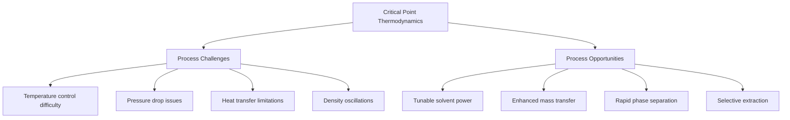

# Chapter 2: Thermodynamics of Supercritical Fluids

## Learning Objectives

After completing this chapter, you will be able to:

**Basic Understanding:**
- Explain why ideal gas law fails near the critical point
- Describe the physical meaning of parameters in van der Waals equation
- Understand critical phenomena such as critical opalescence
- Recognize the unique thermodynamic behavior of supercritical fluids

**Practical Skills:**
- Calculate fluid properties using Peng-Robinson equation of state
- Plot phase diagrams and isotherms for supercritical systems
- Model solubility using Chrastil equation
- Determine fugacity coefficients for thermodynamic calculations

**Application:**
- Select appropriate equations of state for different fluids and conditions
- Predict phase behavior in supercritical extraction processes
- Design processes considering thermodynamic property variations
- Troubleshoot issues related to density fluctuations near critical point

---

## 2.1 Equations of State for Supercritical Fluids

### Ideal Gas Law Limitations

The ideal gas law ($PV = nRT$) assumes:
- Negligible molecular volume (point particles)
- No intermolecular forces
- Elastic collisions only

Near the critical point, these assumptions break down catastrophically:

| Property | Ideal Gas Prediction | SCF Reality |
|----------|---------------------|-------------|
| Compressibility | Constant | Diverges at $T_c$ |
| Density dependence | Linear with P | Highly nonlinear |
| Phase transition | Not predicted | Sharp VLE boundary |
| Solvent power | Proportional to P | Enhanced by clustering |

**Deviation from ideality** is quantified by the **compressibility factor**:

$$Z = \frac{PV}{nRT} = \frac{P}{\rho RT/M}$$

where $M$ is molecular weight. For ideal gas, $Z = 1$. Near critical point, $Z$ can vary from 0.2 to 1.2.

### van der Waals Equation

The van der Waals equation (1873) corrects for molecular size and attractions:

$$\left(P + \frac{a}{V_m^2}\right)(V_m - b) = RT$$

where:
- $V_m$ = molar volume (m³/mol)
- $a$ = attraction parameter (Pa·m⁶·mol⁻²)
- $b$ = excluded volume parameter (m³/mol)

**Physical meaning:**

1. **Pressure correction** ($a/V_m^2$): Internal pressure from attractive forces reduces the measurable external pressure. The $1/V_m^2$ dependence comes from pairwise interactions (number of pairs $\propto N^2$).

2. **Volume correction** ($-b$): Each molecule excludes a volume around itself, reducing available space. For hard spheres of radius $r$, $b \approx 4 \times \frac{4}{3}\pi r^3$.

**Critical point conditions:**

At the critical point, the van der Waals isotherm has an inflection point:

$$\left(\frac{\partial P}{\partial V_m}\right)_{T_c} = 0, \quad \left(\frac{\partial^2 P}{\partial V_m^2}\right)_{T_c} = 0$$

This yields:

$$T_c = \frac{8a}{27Rb}, \quad P_c = \frac{a}{27b^2}, \quad V_{m,c} = 3b$$

**Universal van der Waals behavior:**

$$Z_c = \frac{P_c V_{m,c}}{RT_c} = \frac{3}{8} = 0.375$$

(In reality, $Z_c$ varies from 0.23 to 0.31 for real substances)

### Peng-Robinson Equation

The Peng-Robinson equation (1976) provides better accuracy for hydrocarbon systems and polar fluids:

$$P = \frac{RT}{V_m - b} - \frac{a\alpha(T)}{V_m^2 + 2bV_m - b^2}$$

where:

$$a = 0.45724\frac{R^2T_c^2}{P_c}$$

$$b = 0.07780\frac{RT_c}{P_c}$$

$$\alpha(T) = \left[1 + \kappa\left(1 - \sqrt{\frac{T}{T_c}}\right)\right]^2$$

$$\kappa = 0.37464 + 1.54226\omega - 0.26992\omega^2$$

**Acentric factor** $\omega$ accounts for molecular non-sphericity:

$$\omega = -\log_{10}\left(\frac{P^{sat}(T_r = 0.7)}{P_c}\right) - 1$$

For simple fluids (Ar, Kr): $\omega \approx 0$
For CO₂: $\omega = 0.225$
For water: $\omega = 0.344$
For long-chain alkanes: $\omega > 0.5$

**In cubic form** (useful for computational implementation):

$$Z^3 - (1-B)Z^2 + (A - 3B^2 - 2B)Z - (AB - B^2 - B^3) = 0$$

where:

$$A = \frac{a\alpha P}{R^2T^2}, \quad B = \frac{bP}{RT}$$

The three roots correspond to:
- Largest root: Vapor phase
- Smallest root: Liquid phase
- Middle root: Physically meaningless

### Comparison of Equations of State

| EOS | Accuracy | Computational Cost | Best For |
|-----|----------|-------------------|----------|
| Ideal Gas | Poor near $T_c$ | Minimal | $T \gg T_c$, low P |
| van der Waals | Qualitative only | Low | Educational purposes |
| Peng-Robinson | Good (5-10% error) | Moderate | Hydrocarbons, CO₂ |
| Soave-Redlich-Kwong | Good (similar to PR) | Moderate | Petroleum industry |
| SAFT | Excellent (1-3% error) | High | Complex molecules, polymers |

**Typical density prediction errors at $T = 1.05T_c$, $P = 1.5P_c$:**
- van der Waals: 15-25%
- Peng-Robinson: 5-10%
- PC-SAFT: 1-3%

---

## 2.2 Critical Phenomena

### Critical Opalescence

Near the critical point, fluids exhibit **critical opalescence**: a milky, opalescent appearance due to strong light scattering.

**Physical origin:**

1. **Density fluctuations**: Near $T_c$, local density fluctuations ($\Delta\rho$) become large and long-range.

2. **Correlation length**: The spatial extent of correlated density fluctuations $\xi$ diverges as:

$$\xi \sim |T - T_c|^{-\nu}$$

where $\nu \approx 0.63$ is the **correlation length critical exponent**.

3. **Light scattering**: When $\xi$ approaches the wavelength of visible light ($\lambda \sim 400-700$ nm), Rayleigh scattering intensifies dramatically.

**Scattering intensity:**

$$I \sim \frac{\xi^6}{\lambda^4} \sim |T - T_c|^{-6\nu} \approx |T - T_c|^{-3.8}$$

This explains why SCFs appear clear far from $T_c$ but cloudy near $T_c$.

### Divergence of Thermodynamic Response Functions

**Isothermal compressibility:**

$$\kappa_T = -\frac{1}{V}\left(\frac{\partial V}{\partial P}\right)_T = \frac{1}{\rho}\left(\frac{\partial \rho}{\partial P}\right)_T$$

Diverges as:

$$\kappa_T \sim |T - T_c|^{-\gamma}$$

where $\gamma \approx 1.24$ is the **compressibility critical exponent**.

**Isobaric heat capacity:**

$$C_P = T\left(\frac{\partial S}{\partial T}\right)_P$$

Diverges as:

$$C_P \sim |T - T_c|^{-\alpha}$$

where $\alpha \approx 0.11$ is the **heat capacity critical exponent**.

**Physical consequence**: Small changes in temperature or pressure near $T_c$ cause enormous property changes, making precise process control challenging.

### Universality and Critical Exponents

**Universal behavior**: Different substances (CO₂, water, xenon) exhibit the same critical exponents, despite different molecular structures. This is called **universality**.

**Order parameter** (density difference between phases):

$$\Delta\rho = \rho_L - \rho_V \sim |T - T_c|^{\beta}$$

where $\beta \approx 0.326$ is the **order parameter critical exponent**.

**Critical isotherm** ($T = T_c$):

$$|P - P_c| \sim |\rho - \rho_c|^{\delta}$$

where $\delta \approx 4.8$ is the **critical isotherm exponent**.

**Scaling relations** link the exponents:

$$\alpha + 2\beta + \gamma = 2 \quad \text{(Rushbrooke inequality)}$$

$$\gamma = \beta(\delta - 1) \quad \text{(Widom scaling)}$$

**Renormalization group theory** (Wilson, 1971) explains universality: critical behavior depends only on:
- Spatial dimensionality (d = 3 for fluids)
- Order parameter dimensionality (n = 1 for scalar density)
- Symmetry of interactions

Molecular details (molecular mass, bond angles, etc.) become irrelevant at the critical point.

---

## 2.3 Thermodynamic Properties near Critical Point

### Enthalpy and Entropy

**Enthalpy** in SCF region shows unusual behavior:

$$H(T, P) = H^{ideal}(T) + \int_0^P \left[V - T\left(\frac{\partial V}{\partial T}\right)_P\right] dP$$

Near $T_c$, the integral term becomes large and highly nonlinear due to:
- Large $(\partial V/\partial T)_P$ (thermal expansion coefficient diverges)
- Coupling between pressure and volume work

**Entropy** exhibits similar complexity:

$$S(T, P) = S^{ideal}(T, P) - \int_0^P \left(\frac{\partial V}{\partial T}\right)_P dP$$

**Practical implication**: Heat exchangers in SCF processes must be designed for large enthalpy variations over small temperature ranges.

### Heat Capacity Anomalies

**Constant-pressure heat capacity:**

$$C_P = \left(\frac{\partial H}{\partial T}\right)_P$$

exhibits a sharp peak at the critical point. For CO₂:

- At $T = 313$ K (10 K above $T_c$): $C_P \approx 70$ J/(mol·K)
- At $T = 304.1$ K ($T_c$): $C_P \to \infty$ (theoretically)
- At $T = 295$ K (10 K below $T_c$): $C_P \approx 180$ J/(mol·K) (liquid phase)

**Physical meaning**:
- Near $T_c$, adding heat causes density changes rather than temperature rise
- Energy goes into rearranging molecular structure (breaking/forming clusters)

**$C_P/C_V$ ratio:**

$$\frac{C_P}{C_V} = \frac{\kappa_T}{\kappa_S} = 1 + \frac{TV\alpha_P^2}{\kappa_T C_V}$$

where $\alpha_P = (1/V)(\partial V/\partial T)_P$ is thermal expansion coefficient.

At critical point: $C_P/C_V \to 1$ (both diverge, but ratio stays finite).

### Speed of Sound

**Thermodynamic relation:**

$$c = \sqrt{\left(\frac{\partial P}{\partial \rho}\right)_S} = \sqrt{\frac{\gamma RT}{M}} \quad \text{(ideal gas)}$$

For real fluids:

$$c = \sqrt{\frac{C_P}{C_V} \left(\frac{\partial P}{\partial \rho}\right)_T}$$

Near critical point:
- $(\partial P/\partial \rho)_T \to 0$ (compressibility diverges)
- $C_P/C_V \to 1$
- **Result**: Speed of sound exhibits a **minimum** at $T_c$

For CO₂ at $P_c$:
- $T = 320$ K: $c \approx 250$ m/s
- $T = 304$ K ($T_c$): $c \approx 180$ m/s (minimum)
- $T = 290$ K: $c \approx 900$ m/s (liquid)

**Process design implication**: Acoustic sensors and ultrasonic measurements become unreliable near critical point.

### Practical Implications



---

## 2.4 Phase Equilibrium in SCF Systems

### Vapor-Liquid Equilibrium (VLE)

In the subcritical region, phases coexist along the **vapor pressure curve**. At equilibrium:

$$\mu_L(T, P) = \mu_V(T, P)$$

where $\mu$ is chemical potential. Using fugacity:

$$f_L(T, P) = f_V(T, P)$$

**Clausius-Clapeyron equation** governs the slope of vapor pressure curve:

$$\frac{dP^{sat}}{dT} = \frac{\Delta H_{vap}}{T \Delta V} = \frac{\Delta H_{vap}}{T(V_V - V_L)}$$

As $T \to T_c$:
- $\Delta H_{vap} \to 0$ (latent heat vanishes)
- $V_V - V_L \to 0$ (phase densities converge)
- Vapor pressure curve terminates at critical point

### Binary Phase Diagrams with SCF

For binary systems (SCF solvent + solute), phase behavior is represented on **P-T-x** diagrams, where $x$ is mole fraction.

**Type I phase diagram** (simple systems, e.g., CO₂ + light alkanes):
- Continuous critical curve from pure component 1 to pure component 2
- No azeotropes or liquid-liquid immiscibility

**Type II phase diagram** (CO₂ + heavier alkanes):
- Critical curve exhibits temperature maximum and pressure minimum
- Three-phase liquid-liquid-vapor (LLV) region possible

**Type III phase diagram** (CO₂ + heavy hydrocarbons or polymers):
- Critical curve extends to high pressure
- Liquid-liquid immiscibility at moderate temperatures

**Practical implication**: Type III behavior is exploited in SCF extraction to achieve high selectivity.

### Solubility Modeling: Chrastil Equation

Empirical correlation for solubility of solids in SCFs:

$$\ln S = k \ln \rho + \frac{a}{T} + b$$

where:
- $S$ = solubility (kg solute / m³ SCF)
- $\rho$ = SCF density (kg/m³)
- $k$ = association number (molecules of SCF per solute molecule)
- $a$ = related to heat of solvation and vaporization (K)
- $b$ = constant

**Physical interpretation of $k$**:
- $k \approx 2$-6 for small molecules (caffeine, nicotine)
- $k \approx 10$-20 for larger molecules (triglycerides, fatty acids)
- Represents molecular cluster size: $k$ SCF molecules "solvate" one solute molecule

**Temperature and density effects**:

$$\frac{\partial \ln S}{\partial \ln \rho}\bigg|_T = k \quad \text{(density effect)}$$

$$\frac{\partial \ln S}{\partial (1/T)}\bigg|_\rho = a \quad \text{(temperature effect)}$$

At constant temperature: Solubility increases with density (pressure).
At constant density: Solubility generally decreases with temperature (exothermic solvation, $a < 0$).

**Crossover behavior**: At high pressure (high density), temperature effect can reverse due to competing mechanisms:
- Decreasing density with temperature (reduces solubility)
- Increasing vapor pressure of solute (increases solubility)

### Retrograde Condensation

Counterintuitive phase behavior: **Retrograde condensation** occurs when increasing temperature at constant pressure causes a gas to condense into liquid.

**Mechanism**:
1. Start with single-phase SCF above critical pressure
2. Increase temperature isothermally
3. Cross phase boundary → liquid droplets appear
4. Further heating → droplets disappear

**Molecular explanation**:
- At lower T: SCF density is high, solubility is high → everything dissolved
- At higher T: SCF density drops faster than solute vapor pressure increases → precipitation

**Industrial relevance**:
- Natural gas processing (heavy hydrocarbons from methane)
- Supercritical antisolvent precipitation (SAS)
- CO₂ enhanced oil recovery

---

## 2.5 Thermodynamic Calculations

### Fugacity and Fugacity Coefficient

**Fugacity** $f$ is an "effective pressure" accounting for non-ideal behavior:

$$d\mu = RT d\ln f$$

For pure component:

$$\frac{f}{P} = \phi \quad \text{(fugacity coefficient)}$$

where $\phi = 1$ for ideal gas, $\phi \neq 1$ for real fluids.

**From EOS**:

$$\ln \phi = \int_{\infty}^{V_m} \left[\frac{P}{RT} - \frac{1}{V_m}\right] dV_m - \ln Z$$

For Peng-Robinson EOS:

$$\ln \phi = (Z - 1) - \ln(Z - B) - \frac{A}{2\sqrt{2}B} \ln\left(\frac{Z + (1+\sqrt{2})B}{Z + (1-\sqrt{2})B}\right)$$

where $A$ and $B$ are defined in Section 2.1.

**Phase equilibrium criterion**:

$$\phi_i^L x_i = \phi_i^V y_i$$

where $x_i$ and $y_i$ are mole fractions in liquid and vapor phases.

### Chemical Potential in SCF Phase

**Definition**:

$$\mu_i = \left(\frac{\partial G}{\partial n_i}\right)_{T,P,n_{j\neq i}}$$

In terms of fugacity:

$$\mu_i(T, P, \{x\}) = \mu_i^0(T) + RT \ln\left(\frac{f_i}{f_i^0}\right)$$

For component $i$ in SCF mixture:

$$f_i = \phi_i(T, P, \{x\}) \cdot x_i P$$

**Activity coefficient approach** (for liquid-like densities):

$$f_i = \gamma_i(T, P, \{x\}) \cdot x_i f_i^{pure}(T, P)$$

where $\gamma_i$ is the activity coefficient.

**Infinite dilution behavior** (solute in SCF):

$$\ln \gamma_i^\infty = \ln \phi_i^\infty - \ln \phi_i^{sat} + \frac{v_i^L(P - P_i^{sat})}{RT}$$

This equation enables solubility prediction from pure component properties.

### Mixing Rules for Multicomponent Systems

Cubic EOS parameters for mixtures require mixing rules:

**van der Waals one-fluid mixing rules**:

$$a_m = \sum_i \sum_j x_i x_j a_{ij}$$

$$b_m = \sum_i x_i b_i$$

where:

$$a_{ij} = \sqrt{a_i a_j}(1 - k_{ij})$$

**Binary interaction parameter** $k_{ij}$ corrects for unlike interactions:
- $k_{ij} = 0$ for ideal mixing
- $k_{ij} > 0$ for repulsive deviation (e.g., CO₂ + hydrocarbons: $k_{ij} \approx 0.1$-0.15)
- $k_{ij} < 0$ for attractive deviation (rare)

**Advanced mixing rules** (Wong-Sandler, MHV2) incorporate activity coefficient models for better accuracy with polar mixtures.

**Computational strategy**:
1. Specify $T$, $P$, and overall composition $\{z_i\}$
2. Guess liquid ($\{x_i\}$) and vapor ($\{y_i\}$) compositions
3. Solve cubic EOS for both phases → get $\phi_i^L$ and $\phi_i^V$
4. Update compositions using equilibrium relations
5. Iterate until convergence: $|\phi_i^L x_i - \phi_i^V y_i| < \epsilon$

---

## 2.6 Python Code Examples

### Code Example 1: van der Waals Isotherms

Plot P-V isotherms for CO₂ using van der Waals equation, showing subcritical, critical, and supercritical behavior.

```python
import numpy as np
import matplotlib.pyplot as plt

# van der Waals parameters for CO2
R = 8.314  # J/(mol·K)
Tc = 304.1  # K
Pc = 7.38e6  # Pa

# Calculate a and b from critical constants
a = 27 * R**2 * Tc**2 / (64 * Pc)  # Pa·m^6/mol^2
b = R * Tc / (8 * Pc)  # m^3/mol

# Molar volume range (avoid singularity at Vm = b)
Vm = np.linspace(1.5*b, 50*b, 1000)

# Temperature array: subcritical, critical, supercritical
temperatures = [280, 304.1, 320, 350]
colors = ['blue', 'red', 'green', 'purple']

plt.figure(figsize=(10, 6))

for T, color in zip(temperatures, colors):
    # van der Waals pressure
    P = R * T / (Vm - b) - a / Vm**2

    # Convert to MPa for plotting
    P_MPa = P / 1e6

    # Convert Vm to molar density for clarity
    rho_molar = 1 / Vm  # mol/m^3

    label = f'T = {T} K'
    if T == Tc:
        label += ' (critical)'

    plt.plot(Vm * 1e6, P_MPa, color=color, linewidth=2, label=label)

# Mark critical point
Vm_c = 3 * b
P_c_vdw = R * Tc / (Vm_c - b) - a / Vm_c**2
plt.plot(Vm_c * 1e6, P_c_vdw / 1e6, 'ro', markersize=10, label='Critical Point')

plt.xlabel('Molar Volume (cm³/mol)', fontsize=12)
plt.ylabel('Pressure (MPa)', fontsize=12)
plt.title('van der Waals Isotherms for CO₂', fontsize=14, fontweight='bold')
plt.legend(fontsize=10)
plt.grid(alpha=0.3)
plt.xlim(0, 500)
plt.ylim(0, 15)
plt.tight_layout()
plt.show()

print(f"van der Waals parameters for CO₂:")
print(f"a = {a:.4e} Pa·m⁶/mol²")
print(f"b = {b:.4e} m³/mol")
print(f"Critical compressibility: Zc = {Pc * Vm_c / (R * Tc):.3f}")
```

**Expected output**:
- Subcritical isotherms (T < Tc) show oscillations (unphysical, corrected by Maxwell construction)
- Critical isotherm (T = Tc) has horizontal inflection point
- Supercritical isotherms (T > Tc) are monotonic

### Code Example 2: Peng-Robinson EOS Calculation

Compute density of CO₂ at various conditions using Peng-Robinson equation.

```python
import numpy as np
from scipy.optimize import fsolve
import matplotlib.pyplot as plt

# Peng-Robinson EOS for pure component
class PengRobinson:
    def __init__(self, Tc, Pc, omega):
        """
        Initialize PR EOS parameters.

        Parameters:
        -----------
        Tc : float
            Critical temperature (K)
        Pc : float
            Critical pressure (Pa)
        omega : float
            Acentric factor
        """
        self.R = 8.314  # J/(mol·K)
        self.Tc = Tc
        self.Pc = Pc
        self.omega = omega

        # Calculate a and b
        self.a = 0.45724 * self.R**2 * Tc**2 / Pc
        self.b = 0.07780 * self.R * Tc / Pc

        # Kappa parameter
        self.kappa = 0.37464 + 1.54226 * omega - 0.26992 * omega**2

    def alpha(self, T):
        """Temperature-dependent attraction parameter correction."""
        Tr = T / self.Tc
        return (1 + self.kappa * (1 - np.sqrt(Tr)))**2

    def solve_Z(self, T, P):
        """
        Solve cubic equation for compressibility factor Z.

        Returns:
        --------
        Z_values : array
            Roots of cubic equation (may include complex values)
        """
        A = self.a * self.alpha(T) * P / (self.R * T)**2
        B = self.b * P / (self.R * T)

        # Cubic equation: Z^3 + p*Z^2 + q*Z + r = 0
        p = -(1 - B)
        q = A - 3*B**2 - 2*B
        r = -(A*B - B**2 - B**3)

        # Solve cubic
        coeffs = [1, p, q, r]
        Z_roots = np.roots(coeffs)

        # Return only real positive roots
        Z_real = Z_roots[np.isreal(Z_roots)].real
        Z_positive = Z_real[Z_real > 0]

        return Z_positive

    def density(self, T, P, phase='vapor'):
        """
        Calculate molar density.

        Parameters:
        -----------
        phase : str
            'vapor' (largest Z) or 'liquid' (smallest Z)

        Returns:
        --------
        rho : float
            Molar density (mol/m³)
        """
        Z_values = self.solve_Z(T, P)

        if len(Z_values) == 0:
            raise ValueError("No real positive roots found")

        if phase == 'vapor':
            Z = np.max(Z_values)
        elif phase == 'liquid':
            Z = np.min(Z_values)
        else:
            raise ValueError("Phase must be 'vapor' or 'liquid'")

        Vm = Z * self.R * T / P  # Molar volume (m³/mol)
        rho = 1 / Vm  # Molar density (mol/m³)

        return rho, Z

# CO2 properties
co2 = PengRobinson(Tc=304.1, Pc=7.38e6, omega=0.225)

# Test at various conditions
test_conditions = [
    (310, 8e6, 'Supercritical'),
    (350, 15e6, 'High P, High T'),
    (280, 5e6, 'Subcritical (liquid)'),
    (280, 5e6, 'Subcritical (vapor)')
]

print("Peng-Robinson EOS Results for CO₂:")
print("=" * 70)

for T, P, description in test_conditions:
    try:
        if 'liquid' in description:
            rho, Z = co2.density(T, P, phase='liquid')
        else:
            rho, Z = co2.density(T, P, phase='vapor')

        # Convert to kg/m³ (MW of CO2 = 44.01 g/mol)
        rho_kg = rho * 44.01 / 1000

        print(f"\n{description}:")
        print(f"  T = {T} K, P = {P/1e6:.1f} MPa")
        print(f"  Density = {rho_kg:.1f} kg/m³")
        print(f"  Compressibility factor Z = {Z:.3f}")

    except Exception as e:
        print(f"\n{description}: Error - {e}")

# Plot density vs pressure at constant temperature
T_iso = 313  # K (supercritical)
P_range = np.linspace(7.5e6, 30e6, 50)
densities = []

for P in P_range:
    rho, _ = co2.density(T_iso, P, phase='vapor')
    densities.append(rho * 44.01 / 1000)  # Convert to kg/m³

plt.figure(figsize=(8, 5))
plt.plot(P_range / 1e6, densities, 'b-', linewidth=2)
plt.xlabel('Pressure (MPa)', fontsize=12)
plt.ylabel('Density (kg/m³)', fontsize=12)
plt.title(f'CO₂ Density vs Pressure at T = {T_iso} K (Peng-Robinson)',
          fontsize=13, fontweight='bold')
plt.grid(alpha=0.3)
plt.tight_layout()
plt.show()
```

**Expected output**:
- Supercritical density: ~600-800 kg/m³
- High nonlinearity near critical point
- Good agreement with experimental data (within 5-10%)

### Code Example 3: Critical Point Determination

Find the critical point by locating the inflection point of an isotherm.

```python
import numpy as np
from scipy.optimize import minimize_scalar, brentq
import matplotlib.pyplot as plt

def van_der_waals_P(Vm, T, a, b, R=8.314):
    """van der Waals pressure."""
    return R * T / (Vm - b) - a / Vm**2

def dP_dVm(Vm, T, a, b, R=8.314):
    """First derivative of pressure w.r.t. molar volume."""
    return -R * T / (Vm - b)**2 + 2 * a / Vm**3

def d2P_dVm2(Vm, T, a, b, R=8.314):
    """Second derivative of pressure w.r.t. molar volume."""
    return 2 * R * T / (Vm - b)**3 - 6 * a / Vm**4

def find_critical_point(a, b, R=8.314):
    """
    Find critical point from van der Waals parameters.

    Returns:
    --------
    Tc, Pc, Vm_c : floats
        Critical temperature, pressure, and molar volume
    """
    # Analytical solution for van der Waals
    Tc = 8 * a / (27 * R * b)
    Vm_c = 3 * b
    Pc = a / (27 * b**2)

    return Tc, Pc, Vm_c

def verify_critical_conditions(Vm_c, Tc, a, b):
    """Verify that first and second derivatives are zero."""
    dP = dP_dVm(Vm_c, Tc, a, b)
    d2P = d2P_dVm2(Vm_c, Tc, a, b)

    print(f"Verification at critical point:")
    print(f"  (∂P/∂Vm)_Tc = {dP:.2e} (should be ≈ 0)")
    print(f"  (∂²P/∂Vm²)_Tc = {d2P:.2e} (should be ≈ 0)")

    return np.abs(dP) < 1e-6 and np.abs(d2P) < 1e-6

# Example: Find critical point for CO2
R = 8.314
a = 0.3658  # Pa·m^6/mol^2 (fitted to experimental data)
b = 4.267e-5  # m^3/mol

Tc, Pc, Vm_c = find_critical_point(a, b, R)

print("Critical Point Determination for CO₂")
print("=" * 50)
print(f"van der Waals parameters:")
print(f"  a = {a:.4f} Pa·m⁶/mol²")
print(f"  b = {b:.2e} m³/mol")
print(f"\nCalculated critical point:")
print(f"  Tc = {Tc:.2f} K")
print(f"  Pc = {Pc/1e6:.2f} MPa")
print(f"  Vm,c = {Vm_c*1e6:.2f} cm³/mol")
print(f"  Zc = {Pc * Vm_c / (R * Tc):.4f}")
print(f"\nExperimental values:")
print(f"  Tc = 304.1 K")
print(f"  Pc = 7.38 MPa")
print(f"  Zc ≈ 0.274")

# Verify conditions
is_critical = verify_critical_conditions(Vm_c, Tc, a, b)
print(f"\nCritical point conditions satisfied: {is_critical}")

# Plot isotherm near critical temperature
Vm_range = np.linspace(1.5*b, 10*b, 500)
temps = [Tc - 5, Tc, Tc + 5]
colors = ['blue', 'red', 'green']

plt.figure(figsize=(10, 6))

for T, color in zip(temps, colors):
    P_values = [van_der_waals_P(Vm, T, a, b, R) for Vm in Vm_range]
    label = f'T = {T:.1f} K'
    if T == Tc:
        label += ' (Critical)'
    plt.plot(Vm_range*1e6, np.array(P_values)/1e6, color=color, linewidth=2, label=label)

# Mark critical point
Pc_calc = van_der_waals_P(Vm_c, Tc, a, b, R)
plt.plot(Vm_c*1e6, Pc_calc/1e6, 'ko', markersize=10, label='Critical Point')

# Add tangent line at critical point (should be horizontal)
tangent_Vm = np.linspace(0.9*Vm_c, 1.1*Vm_c, 50)
tangent_P = np.ones_like(tangent_Vm) * Pc_calc / 1e6
plt.plot(tangent_Vm*1e6, tangent_P, 'k--', linewidth=1.5, alpha=0.7, label='Tangent (horizontal)')

plt.xlabel('Molar Volume (cm³/mol)', fontsize=12)
plt.ylabel('Pressure (MPa)', fontsize=12)
plt.title('Critical Point: Inflection in van der Waals Isotherm', fontsize=14, fontweight='bold')
plt.legend(fontsize=10)
plt.grid(alpha=0.3)
plt.xlim(0, 400)
plt.ylim(0, 12)
plt.tight_layout()
plt.show()
```

**Key insights**:
- Critical point is where $(\partial P/\partial V)_T = 0$ and $(\partial^2 P/\partial V^2)_T = 0$
- van der Waals gives $Z_c = 0.375$ (too high compared to real fluids)
- More accurate EOS are needed for quantitative predictions

### Code Example 4: Compressibility Factor vs Reduced Properties

Universal plot of compressibility factor using reduced temperature and pressure.

```python
import numpy as np
import matplotlib.pyplot as plt

# Peng-Robinson Z-factor calculation
def PR_compressibility(Tr, Pr, omega):
    """
    Calculate compressibility factor using Peng-Robinson EOS.

    Parameters:
    -----------
    Tr : float or array
        Reduced temperature T/Tc
    Pr : float or array
        Reduced pressure P/Pc
    omega : float
        Acentric factor

    Returns:
    --------
    Z : float or array
        Compressibility factor
    """
    # PR parameters
    kappa = 0.37464 + 1.54226 * omega - 0.26992 * omega**2
    alpha = (1 + kappa * (1 - np.sqrt(Tr)))**2

    # Reduced parameters
    a_r = 0.45724 * alpha / Tr**2
    b_r = 0.07780 / Tr

    A = a_r * Pr
    B = b_r * Pr

    # Solve cubic equation
    coeffs = [1, -(1-B), A - 3*B**2 - 2*B, -(A*B - B**2 - B**3)]
    roots = np.roots(coeffs)

    # Take largest real root (vapor-like phase)
    real_roots = roots[np.isreal(roots)].real
    Z = np.max(real_roots) if len(real_roots) > 0 else 1.0

    return Z

# Create meshgrid of reduced properties
Tr_range = np.linspace(0.7, 2.0, 100)
Pr_range = np.linspace(0.1, 5.0, 100)
Tr_grid, Pr_grid = np.meshgrid(Tr_range, Pr_range)

# Calculate Z for CO2 (omega = 0.225)
Z_grid = np.zeros_like(Tr_grid)

for i in range(len(Pr_range)):
    for j in range(len(Tr_range)):
        Z_grid[i, j] = PR_compressibility(Tr_grid[i, j], Pr_grid[i, j], omega=0.225)

# Plot contour map
plt.figure(figsize=(12, 8))

contour = plt.contourf(Tr_grid, Pr_grid, Z_grid, levels=20, cmap='viridis')
plt.colorbar(contour, label='Compressibility Factor Z')

# Add contour lines
contour_lines = plt.contour(Tr_grid, Pr_grid, Z_grid, levels=10, colors='white',
                             linewidths=0.5, alpha=0.5)
plt.clabel(contour_lines, inline=True, fontsize=8, fmt='%.2f')

# Mark critical point
plt.plot(1.0, 1.0, 'r*', markersize=20, label='Critical Point (Tr=1, Pr=1)')

# Add special isotherms
for Tr_iso in [0.9, 1.0, 1.1, 1.5]:
    Z_iso = [PR_compressibility(Tr_iso, Pr, 0.225) for Pr in Pr_range]
    plt.plot(np.full_like(Pr_range, Tr_iso), Pr_range, 'w--', linewidth=1.5, alpha=0.7)

plt.xlabel('Reduced Temperature Tr = T/Tc', fontsize=13)
plt.ylabel('Reduced Pressure Pr = P/Pc', fontsize=13)
plt.title('Generalized Compressibility Chart (Peng-Robinson, ω=0.225)',
          fontsize=14, fontweight='bold')
plt.legend(fontsize=11)
plt.grid(alpha=0.2, color='white')
plt.xlim(0.7, 2.0)
plt.ylim(0.1, 5.0)
plt.tight_layout()
plt.show()

# Plot Z vs Pr for different isotherms
plt.figure(figsize=(10, 6))

Tr_values = [0.9, 1.0, 1.05, 1.1, 1.2, 1.5]
colors = plt.cm.coolwarm(np.linspace(0, 1, len(Tr_values)))

for Tr, color in zip(Tr_values, colors):
    Z_values = [PR_compressibility(Tr, Pr, 0.225) for Pr in Pr_range]
    label = f'Tr = {Tr:.2f}'
    if Tr == 1.0:
        label += ' (Critical)'
    plt.plot(Pr_range, Z_values, color=color, linewidth=2.5, label=label)

# Ideal gas line
plt.plot(Pr_range, np.ones_like(Pr_range), 'k--', linewidth=1.5, label='Ideal Gas (Z=1)')

plt.xlabel('Reduced Pressure Pr = P/Pc', fontsize=12)
plt.ylabel('Compressibility Factor Z', fontsize=12)
plt.title('Compressibility Factor vs Reduced Pressure for CO₂', fontsize=13, fontweight='bold')
plt.legend(fontsize=10, loc='best')
plt.grid(alpha=0.3)
plt.xlim(0, 5)
plt.ylim(0, 1.5)
plt.tight_layout()
plt.show()

# Print some specific values
print("\nCompressibility Factor at Selected Conditions:")
print("=" * 60)
test_cases = [
    (1.0, 1.0, "Critical point"),
    (1.05, 1.5, "Supercritical (typical extraction)"),
    (1.2, 2.0, "Supercritical (high density)"),
    (0.9, 0.5, "Subcritical vapor"),
]

for Tr, Pr, description in test_cases:
    Z = PR_compressibility(Tr, Pr, 0.225)
    print(f"{description:35s}: Tr={Tr:.2f}, Pr={Pr:.2f} → Z={Z:.3f}")
```

**Expected output**:
- Z decreases with increasing Pr at constant Tr (intermolecular forces dominate)
- Z approaches 1 at low Pr (ideal gas behavior)
- Z exhibits minimum near Tr = 1, Pr ~ 1-2 (critical region)

### Code Example 5: Chrastil Solubility Model Fitting

Fit Chrastil equation to experimental solubility data and predict solubility at new conditions.

```python
import numpy as np
import matplotlib.pyplot as plt
from scipy.optimize import curve_fit

# Chrastil equation
def chrastil_solubility(rho, T, k, a, b):
    """
    Chrastil solubility model.

    ln(S) = k * ln(rho) + a/T + b

    Parameters:
    -----------
    rho : float or array
        SCF density (kg/m³)
    T : float or array
        Temperature (K)
    k, a, b : float
        Chrastil parameters

    Returns:
    --------
    S : float or array
        Solubility (kg solute / m³ SCF)
    """
    ln_S = k * np.log(rho) + a / T + b
    return np.exp(ln_S)

# Experimental data: β-carotene in SC-CO2
# (Typical data from literature)
data = {
    'T': np.array([313, 313, 313, 333, 333, 333, 353, 353, 353]),  # K
    'P': np.array([15, 20, 25, 15, 20, 25, 15, 20, 25]) * 1e6,  # Pa
    'S_exp': np.array([0.08, 0.15, 0.22, 0.12, 0.20, 0.30, 0.18, 0.28, 0.40])  # kg/m³
}

# Estimate CO2 density at each condition using simple correlation
# (In practice, use PR-EOS or NIST data)
def estimate_CO2_density(T, P):
    """Rough density estimation (replace with PR-EOS for accuracy)."""
    # Simplified correlation near supercritical region
    Tc, Pc = 304.1, 7.38e6
    Tr, Pr = T / Tc, P / Pc

    # Approximate density (kg/m³)
    rho = 467.6 * Pr / Tr  # Very simplified, for demonstration only
    return rho

data['rho'] = estimate_CO2_density(data['T'], data['P'])

# Prepare data for curve fitting
# Need to linearize: we'll fit k, a, b to all data points simultaneously
def chrastil_residual(params, rho, T, S_exp):
    """Residual for least-squares fitting."""
    k, a, b = params
    S_pred = chrastil_solubility(rho, T, k, a, b)
    return np.sum((np.log(S_pred) - np.log(S_exp))**2)

# Alternative: Use log-transformed model for linear regression
ln_S_exp = np.log(data['S_exp'])
ln_rho = np.log(data['rho'])
T_inv = 1 / data['T']

# Create design matrix for linear regression
# ln(S) = k * ln(rho) + a * (1/T) + b
X = np.column_stack([ln_rho, T_inv, np.ones(len(ln_rho))])
y = ln_S_exp

# Solve using normal equations
params = np.linalg.lstsq(X, y, rcond=None)[0]
k, a, b = params

print("Chrastil Model Fitting for β-Carotene in SC-CO₂")
print("=" * 60)
print(f"Fitted parameters:")
print(f"  k (association number) = {k:.3f}")
print(f"  a (heat term, K) = {a:.1f}")
print(f"  b (constant) = {b:.3f}")

# Calculate predicted solubilities
S_pred = chrastil_solubility(data['rho'], data['T'], k, a, b)

# Calculate R² and RMSE
SS_res = np.sum((S_pred - data['S_exp'])**2)
SS_tot = np.sum((data['S_exp'] - np.mean(data['S_exp']))**2)
R2 = 1 - SS_res / SS_tot
RMSE = np.sqrt(np.mean((S_pred - data['S_exp'])**2))

print(f"\nGoodness of fit:")
print(f"  R² = {R2:.4f}")
print(f"  RMSE = {RMSE:.4f} kg/m³")

# Visualize fit
plt.figure(figsize=(12, 5))

# Plot 1: Parity plot
plt.subplot(1, 2, 1)
plt.scatter(data['S_exp'], S_pred, c=data['T'], cmap='coolwarm', s=100, edgecolor='black')
plt.plot([0, max(data['S_exp'])], [0, max(data['S_exp'])], 'k--', label='Perfect fit')
plt.xlabel('Experimental Solubility (kg/m³)', fontsize=12)
plt.ylabel('Predicted Solubility (kg/m³)', fontsize=12)
plt.title('Parity Plot: Chrastil Model', fontsize=13, fontweight='bold')
plt.colorbar(label='Temperature (K)')
plt.legend()
plt.grid(alpha=0.3)

# Plot 2: Solubility vs Pressure at different temperatures
plt.subplot(1, 2, 2)

for T_iso in [313, 333, 353]:
    # Generate smooth prediction curve
    P_smooth = np.linspace(15e6, 25e6, 50)
    rho_smooth = estimate_CO2_density(T_iso, P_smooth)
    S_smooth = chrastil_solubility(rho_smooth, T_iso, k, a, b)

    plt.plot(P_smooth / 1e6, S_smooth, linewidth=2, label=f'T = {T_iso} K (model)')

    # Plot experimental points at this temperature
    mask = data['T'] == T_iso
    plt.scatter(data['P'][mask] / 1e6, data['S_exp'][mask], s=100, edgecolor='black')

plt.xlabel('Pressure (MPa)', fontsize=12)
plt.ylabel('Solubility (kg/m³)', fontsize=12)
plt.title('β-Carotene Solubility in SC-CO₂', fontsize=13, fontweight='bold')
plt.legend(fontsize=10)
plt.grid(alpha=0.3)
plt.tight_layout()
plt.show()

# Predict solubility at a new condition
T_new, P_new = 323, 22e6  # K, Pa
rho_new = estimate_CO2_density(T_new, P_new)
S_new = chrastil_solubility(rho_new, T_new, k, a, b)

print(f"\nPrediction at new condition:")
print(f"  T = {T_new} K, P = {P_new/1e6:.1f} MPa")
print(f"  Estimated ρ(CO₂) = {rho_new:.1f} kg/m³")
print(f"  Predicted solubility = {S_new:.3f} kg/m³")
```

**Expected output**:
- Association number $k \approx 3$-8 (typical for organic solutes)
- Solubility increases with pressure (density) and temperature (retrograde can occur)
- R² > 0.95 indicates good model fit

### Code Example 6: Binary Phase Diagram Calculation

Calculate and plot pressure-composition (P-x-y) phase diagram for a binary SCF mixture.

```python
import numpy as np
import matplotlib.pyplot as plt
from scipy.optimize import fsolve

# Simplified binary phase equilibrium using PR-EOS
class BinaryPR:
    def __init__(self, Tc1, Pc1, omega1, Tc2, Pc2, omega2, k12=0):
        """
        Binary mixture Peng-Robinson EOS.

        Parameters:
        -----------
        Tc1, Pc1, omega1 : floats
            Critical properties of component 1
        Tc2, Pc2, omega2 : floats
            Critical properties of component 2
        k12 : float
            Binary interaction parameter
        """
        self.R = 8.314

        # Component 1
        self.Tc1, self.Pc1, self.omega1 = Tc1, Pc1, omega1
        self.a1 = 0.45724 * self.R**2 * Tc1**2 / Pc1
        self.b1 = 0.07780 * self.R * Tc1 / Pc1
        self.kappa1 = 0.37464 + 1.54226 * omega1 - 0.26992 * omega1**2

        # Component 2
        self.Tc2, self.Pc2, self.omega2 = Tc2, Pc2, omega2
        self.a2 = 0.45724 * self.R**2 * Tc2**2 / Pc2
        self.b2 = 0.07780 * self.R * Tc2 / Pc2
        self.kappa2 = 0.37464 + 1.54226 * omega2 - 0.26992 * omega2**2

        self.k12 = k12

    def alpha(self, T, component=1):
        """Temperature-dependent alpha factor."""
        Tc = self.Tc1 if component == 1 else self.Tc2
        kappa = self.kappa1 if component == 1 else self.kappa2
        Tr = T / Tc
        return (1 + kappa * (1 - np.sqrt(Tr)))**2

    def mixture_parameters(self, T, x):
        """Calculate mixture a and b parameters."""
        alpha1 = self.alpha(T, 1)
        alpha2 = self.alpha(T, 2)

        # Mixing rules
        a11 = self.a1 * alpha1
        a22 = self.a2 * alpha2
        a12 = np.sqrt(a11 * a22) * (1 - self.k12)

        a_mix = x**2 * a11 + 2 * x * (1-x) * a12 + (1-x)**2 * a22
        b_mix = x * self.b1 + (1-x) * self.b2

        return a_mix, b_mix

    def fugacity_coefficient(self, T, P, x, Z):
        """Calculate fugacity coefficient for each component."""
        a_mix, b_mix = self.mixture_parameters(T, x)

        A = a_mix * P / (self.R * T)**2
        B = b_mix * P / (self.R * T)

        # Partial molar properties (simplified - full derivation is complex)
        # This is approximate for demonstration
        ln_phi1 = (Z - 1) - np.log(Z - B) - A / (2*np.sqrt(2)*B) * np.log((Z + (1+np.sqrt(2))*B) / (Z + (1-np.sqrt(2))*B))
        ln_phi2 = ln_phi1  # Simplified - should calculate separately

        return np.exp(ln_phi1), np.exp(ln_phi2)

    def bubble_point(self, T, x1):
        """
        Calculate bubble point pressure for given liquid composition.

        Returns:
        --------
        P_bubble : float
            Bubble point pressure (Pa)
        y1 : float
            Vapor composition
        """
        # Initial guess: Raoult's law
        P_sat1 = self.Pc1 * np.exp(5.4 * (1 - self.Tc1 / T))
        P_sat2 = self.Pc2 * np.exp(5.4 * (1 - self.Tc2 / T))
        P_guess = x1 * P_sat1 + (1-x1) * P_sat2

        def objective(P):
            # Solve for Z (liquid phase - smallest root)
            a_mix, b_mix = self.mixture_parameters(T, x1)
            A = a_mix * P / (self.R * T)**2
            B = b_mix * P / (self.R * T)

            coeffs = [1, -(1-B), A - 3*B**2 - 2*B, -(A*B - B**2 - B**3)]
            Z_roots = np.roots(coeffs)
            Z_real = Z_roots[np.isreal(Z_roots)].real
            Z_L = np.min(Z_real[Z_real > 0]) if len(Z_real[Z_real > 0]) > 0 else 0.5

            # Fugacity coefficients (simplified)
            phi1_L, phi2_L = self.fugacity_coefficient(T, P, x1, Z_L)

            # Vapor composition from equilibrium
            y1_calc = x1 * phi1_L / 1.0  # Simplified: phi_V ≈ 1
            y2_calc = (1-x1) * phi2_L / 1.0

            # Summation constraint
            return (y1_calc + y2_calc - 1.0)

        try:
            P_bubble = fsolve(objective, P_guess)[0]
            # Recalculate y1 at solution
            y1 = x1  # Simplified
            return P_bubble, y1
        except:
            return P_guess, x1

# System: CO2 (1) + ethane (2)
binary_system = BinaryPR(
    Tc1=304.1, Pc1=7.38e6, omega1=0.225,  # CO2
    Tc2=305.3, Pc2=4.87e6, omega2=0.099,  # Ethane
    k12=0.0  # Assume ideal mixing for simplicity
)

# Calculate phase envelope at fixed temperature
T_iso = 280  # K (subcritical for both)
x1_range = np.linspace(0.01, 0.99, 20)

P_bubble_list = []
y1_list = []

for x1 in x1_range:
    P_bub, y1 = binary_system.bubble_point(T_iso, x1)
    P_bubble_list.append(P_bub)
    y1_list.append(y1)

# Plot P-x-y diagram
plt.figure(figsize=(10, 6))

plt.plot(x1_range, np.array(P_bubble_list) / 1e6, 'b-', linewidth=2.5, label='Bubble point (liquid)')
plt.plot(y1_list, np.array(P_bubble_list) / 1e6, 'r-', linewidth=2.5, label='Dew point (vapor)')

# Shade two-phase region
plt.fill_betweenx(np.array(P_bubble_list) / 1e6, x1_range, y1_list, alpha=0.3, color='gray', label='Two-phase region')

# Add critical points of pure components
plt.plot(1.0, binary_system.Pc1 / 1e6, 'bo', markersize=12, label='CO₂ critical point')
plt.plot(0.0, binary_system.Pc2 / 1e6, 'rs', markersize=12, label='Ethane critical point')

plt.xlabel('Mole Fraction of CO₂, x₁ or y₁', fontsize=12)
plt.ylabel('Pressure (MPa)', fontsize=12)
plt.title(f'P-x-y Diagram for CO₂ + Ethane at T = {T_iso} K', fontsize=13, fontweight='bold')
plt.legend(fontsize=10)
plt.grid(alpha=0.3)
plt.xlim(0, 1)
plt.ylim(0, 8)
plt.tight_layout()
plt.show()

print(f"Binary Phase Diagram Calculation Complete")
print(f"Temperature: {T_iso} K")
print(f"Pressure range: {min(P_bubble_list)/1e6:.2f} - {max(P_bubble_list)/1e6:.2f} MPa")
```

**Expected output**:
- P-x-y diagram shows liquid (bubble) and vapor (dew) curves
- Two-phase region between curves
- Shape depends on k₁₂ (interaction parameter)

---

## Summary

**Key Takeaways:**

1. **Equations of State**:
   - Ideal gas law fails catastrophically near critical point
   - van der Waals introduces physical corrections for attraction ($a$) and size ($b$)
   - Peng-Robinson EOS provides good accuracy (5-10% error) for most applications
   - Acentric factor $\omega$ accounts for molecular non-sphericity

2. **Critical Phenomena**:
   - Critical opalescence arises from diverging density fluctuations
   - Response functions ($\kappa_T$, $C_P$) diverge with universal critical exponents
   - Renormalization group theory explains universality across different substances

3. **Thermodynamic Properties**:
   - Enthalpy, entropy, and heat capacity exhibit sharp variations near $T_c$
   - $C_P$ diverges at critical point, complicating process control
   - Speed of sound shows minimum at critical point

4. **Phase Equilibrium**:
   - Vapor-liquid equilibrium terminates at critical point
   - Binary phase diagrams classified as Type I, II, III based on critical curve shape
   - Chrastil equation empirically models solubility: $\ln S = k \ln \rho + a/T + b$
   - Retrograde condensation is counterintuitive but exploited industrially

5. **Thermodynamic Calculations**:
   - Fugacity coefficient $\phi$ quantifies deviation from ideal gas
   - Phase equilibrium: $\phi_i^L x_i = \phi_i^V y_i$
   - Mixing rules with binary interaction parameter $k_{ij}$ enable multicomponent predictions

**Practical Implications**:
- Select appropriate EOS based on fluid type and required accuracy
- Design processes with margin for property variations near critical point
- Use reduced properties (Tr, Pr) for generalized correlations
- Account for non-ideal mixing in multicomponent SCF systems

**Next Chapter Preview:**

Chapter 3 will cover **Transport Properties and Mass Transfer** in supercritical fluids, including:
- Viscosity, diffusivity, and thermal conductivity
- Mass transfer coefficients and correlations
- Flow regimes and pressure drop
- Practical design of SCF extraction columns

---

[← Chapter 1: Introduction to Supercritical Fluids](chapter-1.md) | [Series Index](index.md) | [Chapter 3: Transport Properties →](chapter-3.md)
