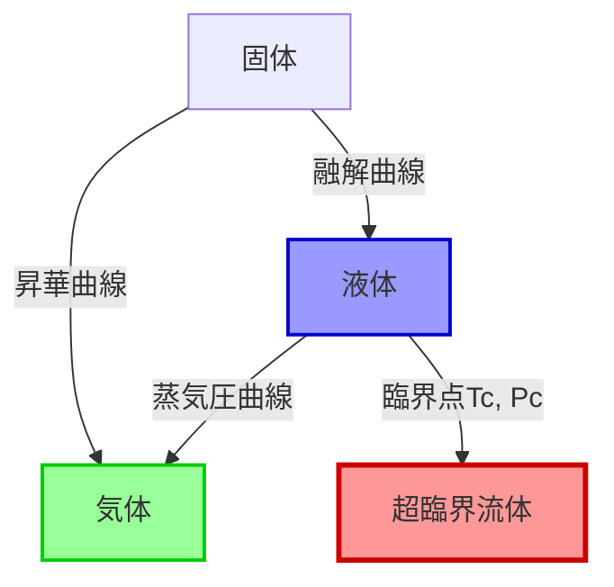

[🌐 EN](../../../en/MS/supercritical-fluids-introduction/chapter-1.md) | 🇯🇵 JP

[材料科学道場](../index.html) > [超臨界流体入門](index.md) > 第1章

# 第1章: 超臨界流体の基礎

**臨界点、相図、および特有の物性の理解**

## 学習目標

本章を完了することで、以下ができるようになります:

### 基礎理解
- [ ] 超臨界流体の定義と臨界点の概念を説明できる
- [ ] 相図上で超臨界状態の位置を示し、相境界の特徴を理解できる
- [ ] 臨界温度、臨界圧力、臨界密度の物理的意味を理解できる
- [ ] 代表的な物質の臨界定数を覚え、その違いを説明できる

### 実践スキル
- [ ] Pythonで物質の相図を作成し、臨界点を可視化できる
- [ ] 超臨界流体の密度、粘度、拡散係数を計算できる
- [ ] 気体・液体・超臨界流体の物性を定量的に比較できる
- [ ] 圧力と温度による超臨界流体の物性変化をプロットできる

### 応用
- [ ] 超臨界流体の特有の性質が材料科学にどう役立つか説明できる
- [ ] 溶媒特性（溶解度パラメータ、誘電率）と応用の関係を理解できる
- [ ] 表面張力ゼロの特性を活かした応用例を挙げられる
- [ ] 超臨界CO₂による抽出プロセスの原理を説明できる

## 導入

コーヒーからカフェインを抜く際、水や有機溶媒を使うと風味が失われてしまいます。しかし、**超臨界CO₂（二酸化炭素）**を使えば、カフェインだけを選択的に抽出し、風味を保つことができます。これは超臨界流体の「液体のような溶解力」と「気体のような拡散性」を組み合わせた応用例です。

**超臨界流体（Supercritical Fluid, SCF）**は、臨界温度（\\(T_c\\)）と臨界圧力（\\(P_c\\)）を超えた状態にある物質です。この状態では、液体と気体の区別が消失し、両者の中間的な性質を持つユニークな状態が現れます。材料科学では、超臨界流体は以下の用途で活用されています:

- **抽出・分離**: カフェイン抽出、香料抽出、有害物質除去
- **ナノ材料合成**: 均一な粒径制御、ナノ粒子・薄膜作製
- **エアロゲル製造**: 超臨界乾燥による多孔質材料の作製
- **表面処理**: コーティング、洗浄、樹脂含浸

本章では、超臨界流体の基礎的な概念を学び、その特有の性質がなぜ材料プロセスに有用なのかを理解します。Pythonコードを使って相図の作成や物性計算を実践し、超臨界状態の直感的な理解を深めます。

## 1.1 超臨界流体とは何か？

### 1.1.1 定義: 臨界温度・臨界圧力を超えた状態

**超臨界流体**は、物質が以下の条件を満たすときの状態です:

\\[
T > T_c \quad \text{かつ} \quad P > P_c
\\]

ここで:
- \\(T_c\\): **臨界温度（Critical Temperature）** — この温度以上では、どれだけ圧力をかけても液化しない
- \\(P_c\\): **臨界圧力（Critical Pressure）** — 臨界温度での液化に必要な最小圧力

### 1.1.2 相図での説明（P-T図）

物質の状態（固体、液体、気体）は、温度と圧力によって決まります。**相図（Phase Diagram）**は、どの条件でどの相が安定かを示す地図です。

#### 典型的なP-T相図



**重要な特徴**:
1. **三重点（Triple Point）**: 固体・液体・気体が共存する一点
2. **臨界点（Critical Point）**: 液体と気体の境界が消失する点 (\\(T_c, P_c\\))
3. **超臨界領域**: 臨界点より高温・高圧の領域

### 1.1.3 液体と気体の境界が消失

臨界点以下では、液体と気体の間に**明確な相境界（界面）**が存在します。液体は高密度、気体は低密度であり、両者の間には密度の不連続な変化があります。

しかし、臨界点を超えると:
- **密度が連続的に変化**し、液体から気体への不連続な転移がなくなる
- **表面張力がゼロ**になり、界面が消失する
- **単一の相**として存在し、液体とも気体とも区別できない

#### Python: 相図の作成と臨界点の可視化

```python
import numpy as np
import matplotlib.pyplot as plt

# CO₂の相図データ（簡略化したClausiusクラペイロン式）
def vapor_pressure_curve(T_range, Tc, Pc):
    """
    蒸気圧曲線の近似（Antoine式の簡略版）

    Parameters:
    -----------
    T_range : array
        温度範囲（K）
    Tc : float
        臨界温度（K）
    Pc : float
        臨界圧力（bar）

    Returns:
    --------
    P : array
        蒸気圧（bar）
    """
    # 臨界点以下のみ計算
    T = T_range[T_range <= Tc]
    # 簡略化した蒸気圧曲線（実際にはAntoine式などを使用）
    Tr = T / Tc
    P = Pc * np.exp(5 * (1 - 1/Tr))
    return T, P

# CO₂のパラメータ
Tc_CO2 = 304.13  # K (31°C)
Pc_CO2 = 73.8    # bar

# 温度範囲
T_range = np.linspace(200, 350, 500)

# 蒸気圧曲線
T_vapor, P_vapor = vapor_pressure_curve(T_range, Tc_CO2, Pc_CO2)

# プロット
plt.figure(figsize=(10, 7))

# 蒸気圧曲線（液体-気体境界）
plt.plot(T_vapor, P_vapor, 'b-', linewidth=2, label='液体-気体境界')

# 臨界点
plt.plot(Tc_CO2, Pc_CO2, 'ro', markersize=12, label=f'臨界点 ({Tc_CO2:.1f} K, {Pc_CO2:.1f} bar)')

# 超臨界領域の塗りつぶし
T_super = np.linspace(Tc_CO2, 350, 100)
P_super = np.linspace(Pc_CO2, 120, 100)
T_mesh, P_mesh = np.meshgrid(T_super, P_super)
plt.contourf(T_mesh, P_mesh, np.ones_like(T_mesh),
             levels=[0, 1], colors=['#ffcccc'], alpha=0.4)

# 各相の領域を注釈
plt.text(250, 30, '液体', fontsize=14, color='blue', ha='center')
plt.text(250, 5, '気体', fontsize=14, color='green', ha='center')
plt.text(330, 95, '超臨界流体', fontsize=14, color='red', ha='center', weight='bold')

# グラフの装飾
plt.xlabel('温度 (K)', fontsize=12)
plt.ylabel('圧力 (bar)', fontsize=12)
plt.title('CO₂の相図（簡略化）', fontsize=14, weight='bold')
plt.xlim(200, 350)
plt.ylim(0, 120)
plt.grid(True, alpha=0.3)
plt.legend(fontsize=10)
plt.tight_layout()
plt.savefig('co2_phase_diagram.png', dpi=150)
plt.show()
```

**実行結果の解釈**:
- 青い曲線が液体-気体の境界（蒸気圧曲線）
- 赤い点が臨界点（304.13 K, 73.8 bar）
- ピンクの領域が超臨界状態
- 曲線より左下が気体、右上が液体、臨界点より右上が超臨界流体

### 1.1.4 発見の歴史と重要性

**歴史的発見**:
- **1822年**: Baron Cagniard de la Tourが実験中に臨界現象を発見
- **1869年**: Thomas Andrewsが「臨界点」の概念を確立
- **1879年**: James Dewarが超臨界流体の連続的な状態変化を観察
- **1970年代**: 超臨界流体抽出（SFE）の工業化が本格化
- **1990年代以降**: ナノ材料合成、グリーンケミストリーへの応用拡大

**現代的重要性**:
- **環境に優しい溶媒**: 有機溶媒の代替（特にscCO₂）
- **省エネルギー**: 低温プロセス、溶媒回収の容易さ
- **高品質材料**: 均一なナノ粒子、純度の高い抽出物
- **産業規模の応用**: 食品加工、医薬品製造、電子材料

## 1.2 臨界点

### 1.2.1 臨界温度(Tc)、臨界圧力(Pc)、臨界密度(ρc)

臨界点は、以下の3つのパラメータで完全に記述されます:

| パラメータ | 記号 | 物理的意味 |
|------------|------|------------|
| **臨界温度** | \\(T_c\\) | この温度以上では液化不可能 |
| **臨界圧力** | \\(P_c\\) | 臨界温度での液化に必要な最小圧力 |
| **臨界密度** | \\(\rho_c\\) | 臨界点での物質の密度 |

これらは物質固有の定数であり、分子間相互作用の強さを反映します。

### 1.2.2 代表的な物質の臨界定数表

| 物質 | 化学式 | \\(T_c\\) (°C) | \\(P_c\\) (bar) | \\(\rho_c\\) (g/cm³) | 応用分野 |
|------|--------|----------------|----------------|---------------------|----------|
| **二酸化炭素** | CO₂ | 31.0 | 73.8 | 0.468 | 抽出、洗浄、合成 |
| **水** | H₂O | 374.0 | 220.6 | 0.322 | 水熱合成、廃棄物処理 |
| **窒素** | N₂ | -147.0 | 34.0 | 0.313 | 冷媒、不活性雰囲気 |
| **エタノール** | C₂H₅OH | 241.0 | 61.4 | 0.276 | バイオマス処理 |
| **プロパン** | C₃H₈ | 96.7 | 42.5 | 0.217 | 抽出、発泡剤 |

**比較のポイント**:
- **CO₂**: 低い\\(T_c\\)（常温に近い）で扱いやすく、最も広く使われる
- **H₂O**: 高い\\(T_c\\)・\\(P_c\\)だが、極性溶媒として強力
- **N₂**: 非常に低い\\(T_c\\)で、低温プロセスに使用
- **アルコール**: 中程度の\\(T_c\\)で、極性・無極性の中間的溶解性

### 1.2.3 分子レベルでの臨界点の意味

臨界点では、分子間相互作用と熱運動のバランスが絶妙な状態になります:

1. **分子間引力**: 液体を形成しようとする力
2. **熱運動**: 気体に拡散しようとする力

**臨界点以下**（\\(T < T_c\\)）:
- 分子間引力が勝る → 液体が形成可能
- 冷却すれば必ず液化する

**臨界点以上**（\\(T > T_c\\)）:
- 熱運動が勝る → 液体を維持できない
- どれだけ圧縮しても密度の高い流体のまま（液化しない）

#### 密度ゆらぎと臨界オパレッセンス

臨界点近傍では、**密度ゆらぎ**が非常に大きくなり、光が散乱されて**白濁（臨界オパレッセンス）**が観察されます。これは、液体的な高密度領域と気体的な低密度領域が時空間的に共存するためです。

### 1.2.4 臨界指数と普遍性

臨界点近傍の物理量は、**べき乗則（Power Law）**で記述されます。例えば、臨界点からの温度差 \\(\Delta T = T - T_c\\) に対して:

\\[
\rho_{\text{液}} - \rho_{\text{気}} \propto (\Delta T)^\beta
\\]

ここで \\(\beta\\) は**臨界指数**で、物質によらず普遍的な値（\\(\beta \approx 0.32\\)）を取ります。この普遍性は、臨界現象が分子の詳細によらず、系の次元性と対称性のみで決まることを示しています。

## 1.3 超臨界流体の特有の性質

超臨界流体は、液体と気体の「良いとこ取り」をした性質を持ちます。

### 1.3.1 密度: 液体に近い（圧力・温度で調整可能）

**密度範囲**:
- **気体**: 0.001 - 0.01 g/cm³
- **超臨界流体**: 0.1 - 0.9 g/cm³（液体に近い）
- **液体**: 0.6 - 1.5 g/cm³

**調整可能性（Tunability）**:
超臨界流体の最大の特徴は、圧力と温度を変えることで密度を広範囲に連続的に調整できることです。密度が高いほど溶解力が強くなるため、「溶媒パワーのダイヤル調整」が可能になります。

#### Python: 密度の圧力・温度依存性

```python
import numpy as np
import matplotlib.pyplot as plt
from scipy.optimize import fsolve

# Peng-Robinson状態方程式
def peng_robinson_density(T, P, Tc, Pc, omega):
    """
    Peng-Robinson状態方程式で密度を計算

    Parameters:
    -----------
    T : float
        温度 (K)
    P : float
        圧力 (bar)
    Tc : float
        臨界温度 (K)
    Pc : float
        臨界圧力 (bar)
    omega : float
        偏心因子

    Returns:
    --------
    rho : float
        密度 (g/cm³)
    """
    R = 0.08314  # L·bar/(mol·K)

    # PR式のパラメータ
    Tr = T / Tc
    a_alpha = 0.45724 * (R * Tc)**2 / Pc * \
              (1 + (0.37464 + 1.54226*omega - 0.26992*omega**2) * (1 - np.sqrt(Tr)))**2
    b = 0.07780 * R * Tc / Pc

    # 圧縮因子Zの計算（立方方程式を解く）
    A = a_alpha * P / (R * T)**2
    B = b * P / (R * T)

    # Z³ - (1-B)Z² + (A-3B²-2B)Z - (AB-B²-B³) = 0
    coef = [1, -(1-B), A-3*B**2-2*B, -(A*B-B**2-B**3)]
    roots = np.roots(coef)

    # 実数根の中で最大のもの（超臨界では1つの実根）
    Z = max([r.real for r in roots if abs(r.imag) < 1e-10])

    # モル体積 V = ZRT/P
    V_molar = Z * R * T / P  # L/mol

    # CO₂の分子量
    M = 44.01  # g/mol

    # 密度 = M / V
    rho = M / V_molar / 1000  # g/cm³

    return rho

# CO₂のパラメータ
Tc_CO2 = 304.13  # K
Pc_CO2 = 73.8    # bar
omega_CO2 = 0.228  # 偏心因子

# 圧力範囲（80 - 300 bar）
pressures = np.linspace(80, 300, 50)

# 複数の温度で密度を計算
temperatures = [310, 320, 340, 360, 380]  # K（すべて超臨界）
colors = ['red', 'orange', 'green', 'blue', 'purple']

plt.figure(figsize=(10, 7))

for T, color in zip(temperatures, colors):
    densities = [peng_robinson_density(T, P, Tc_CO2, Pc_CO2, omega_CO2)
                 for P in pressures]
    plt.plot(pressures, densities, '-o', linewidth=2, markersize=4,
             color=color, label=f'{T} K ({T-273:.0f} °C)')

# 液体CO₂の典型的な密度（参考線）
plt.axhline(y=0.77, color='gray', linestyle='--', linewidth=1.5,
            label='液体CO₂の典型密度')

# グラフの装飾
plt.xlabel('圧力 (bar)', fontsize=12)
plt.ylabel('密度 (g/cm³)', fontsize=12)
plt.title('超臨界CO₂の密度の圧力・温度依存性', fontsize=14, weight='bold')
plt.xlim(80, 300)
plt.ylim(0, 1.0)
plt.grid(True, alpha=0.3)
plt.legend(fontsize=10, loc='lower right')
plt.tight_layout()
plt.savefig('scCO2_density_PT.png', dpi=150)
plt.show()

# 臨界点近傍での急激な変化を示す
T_near_critical = 305  # K（臨界点直上）
P_range_near = np.linspace(75, 150, 100)
rho_near = [peng_robinson_density(T_near_critical, P, Tc_CO2, Pc_CO2, omega_CO2)
            for P in P_range_near]

plt.figure(figsize=(10, 6))
plt.plot(P_range_near, rho_near, 'r-', linewidth=2.5)
plt.axvline(x=Pc_CO2, color='blue', linestyle='--', linewidth=1.5,
            label=f'臨界圧力 ({Pc_CO2} bar)')
plt.xlabel('圧力 (bar)', fontsize=12)
plt.ylabel('密度 (g/cm³)', fontsize=12)
plt.title(f'臨界点近傍（{T_near_critical} K）での密度の急変', fontsize=14, weight='bold')
plt.grid(True, alpha=0.3)
plt.legend(fontsize=10)
plt.tight_layout()
plt.savefig('scCO2_density_near_critical.png', dpi=150)
plt.show()
```

**観察されるポイント**:
1. 圧力を上げると密度が増加（溶解力が強くなる）
2. 温度を上げると密度が減少（熱膨張）
3. 臨界点近傍（305 K, 74 bar付近）で密度が急激に変化
4. 高圧（>200 bar）では液体に近い密度（~0.8 g/cm³）

### 1.3.2 粘度: 気体に近い（低粘度で高速拡散）

**粘度範囲**:
- **気体**: 10⁻⁵ - 10⁻⁴ Pa·s
- **超臨界流体**: 10⁻⁵ - 10⁻⁴ Pa·s（気体に近い）
- **液体**: 10⁻³ - 10⁻² Pa·s

**利点**:
低粘度により、超臨界流体は以下が可能です:
- **多孔質材料への高速浸透**: エアロゲル製造、樹脂含浸
- **低圧力損失**: 配管やフィルターでの圧力降下が小さい
- **高速抽出**: 短時間での抽出プロセス

### 1.3.3 拡散係数: 液体と気体の中間

**拡散係数範囲**:
- **気体**: 10⁻⁵ - 10⁻⁴ m²/s
- **超臨界流体**: 10⁻⁸ - 10⁻⁷ m²/s（中間）
- **液体**: 10⁻¹⁰ - 10⁻⁹ m²/s

拡散係数が大きいほど、物質が速く移動します。超臨界流体は液体の10-100倍速く拡散するため、抽出・反応プロセスが高速化されます。

### 1.3.4 表面張力: ゼロ（液気界面なし）

超臨界流体には液体と気体の区別がないため、**表面張力がゼロ**です。これにより:

- **多孔質材料への完全浸透**: 毛細管力による障壁がない
- **エアロゲル製造**: 液体を超臨界乾燥すると、表面張力による構造収縮を避けられる
- **微細パターンへのコーティング**: ナノスケールの隙間にも均一に入り込む

### 1.3.5 比較表: 気体 vs 液体 vs SCF

| 物性 | 気体 | 超臨界流体 | 液体 | SCFの利点 |
|------|------|------------|------|-----------|
| **密度** (g/cm³) | 0.001 - 0.01 | 0.2 - 0.9 | 0.6 - 1.5 | 液体並みの溶解力 |
| **粘度** (Pa·s) | 10⁻⁵ - 10⁻⁴ | 10⁻⁵ - 10⁻⁴ | 10⁻³ - 10⁻² | 気体並みの低抵抗 |
| **拡散係数** (m²/s) | 10⁻⁵ - 10⁻⁴ | 10⁻⁸ - 10⁻⁷ | 10⁻¹⁰ - 10⁻⁹ | 液体の10-100倍速い |
| **表面張力** (mN/m) | 0 | 0 | 20 - 80 | 完全浸透可能 |
| **溶解力** | 低 | 高（調整可能） | 高 | 圧力で制御可能 |
| **拡散速度** | 速い | 速い | 遅い | 高速プロセス |

### 1.3.6 調整可能性: P, Tで物性を「ダイヤルイン」

超臨界流体の最大の強みは、**圧力と温度を変えるだけで物性を連続的に調整できる**ことです。これを「ソルベントパワーのチューニング（溶媒力の微調整）」と呼びます。

#### 例: 抽出プロセスでの調整

1. **高圧・低温**: 高密度 → 溶解力大 → 多成分抽出
2. **低圧・高温**: 低密度 → 溶解力小 → 選択的抽出
3. **段階的減圧**: 溶解力を徐々に下げて、成分ごとに分別回収

この調整可能性により、従来の液体溶媒では達成困難だった高度な分離・精製が可能になります。

## 1.4 超臨界流体の溶媒特性

### 1.4.1 誘電率

**誘電率（\\(\varepsilon\\)）**は、溶媒の極性を示す指標です。高いほど極性物質（イオン、極性分子）をよく溶かします。

| 物質 | 常温・常圧での\\(\varepsilon\\) | 超臨界状態での\\(\varepsilon\\) |
|------|-------------------------------|-------------------------------|
| **水** | 78.5 | 5 - 10（温度・圧力依存） |
| **CO₂** | 1.0 | 1.0 - 1.5 |
| **エタノール** | 24.3 | 5 - 15 |

**特徴**:
- **scCO₂**: 低極性で、非極性〜弱極性物質に適する
- **scH₂O**: 高温で誘電率が下がり、有機物も溶解可能に

### 1.4.2 Hildebrand溶解度パラメータ

**Hildebrand溶解度パラメータ（\\(\delta\\)）**は、溶媒と溶質の親和性を表す指標です。\\(\delta\\)が近い物質ほどよく溶け合います。

\\[
\delta = \sqrt{\frac{\Delta H_{\text{vap}} - RT}{V_m}}
\\]

ここで:
- \\(\Delta H_{\text{vap}}\\): 蒸発エンタルピー
- \\(V_m\\): モル体積
- \\(R\\): 気体定数
- \\(T\\): 温度

#### Python: 溶解度パラメータの計算

```python
import numpy as np
import matplotlib.pyplot as plt

def hildebrand_parameter(rho, Tc, Pc):
    """
    簡略化したHildebrand溶解度パラメータの計算

    Parameters:
    -----------
    rho : float
        密度 (g/cm³)
    Tc : float
        臨界温度 (K)
    Pc : float
        臨界圧力 (bar)

    Returns:
    --------
    delta : float
        溶解度パラメータ (MPa^0.5)
    """
    # 簡略化した式（密度に比例）
    # 実際にはより複雑な状態方程式を使用
    delta = 10.0 * (rho / 0.5)  # MPa^0.5
    return delta

# CO₂の密度範囲
densities = np.linspace(0.1, 0.9, 50)

# 溶解度パラメータを計算
delta_values = [hildebrand_parameter(rho, Tc_CO2, Pc_CO2) for rho in densities]

# 代表的な溶媒・溶質の溶解度パラメータ（参考値）
solvents = {
    'ヘキサン': 14.9,
    'トルエン': 18.2,
    'アセトン': 20.3,
    'エタノール': 26.5,
    '水': 47.8
}

plt.figure(figsize=(10, 7))
plt.plot(densities, delta_values, 'b-', linewidth=3, label='超臨界CO₂')

# 参考溶媒を横線で表示
for solvent, delta in solvents.items():
    plt.axhline(y=delta, linestyle='--', linewidth=1, alpha=0.6, label=solvent)

plt.xlabel('密度 (g/cm³)', fontsize=12)
plt.ylabel('溶解度パラメータ (MPa^0.5)', fontsize=12)
plt.title('超臨界CO₂の溶解度パラメータの密度依存性', fontsize=14, weight='bold')
plt.ylim(0, 50)
plt.grid(True, alpha=0.3)
plt.legend(fontsize=9, loc='upper left')
plt.tight_layout()
plt.savefig('solubility_parameter.png', dpi=150)
plt.show()
```

**観察されるポイント**:
- 低密度（低圧）のscCO₂は**ヘキサンに近い**溶解力 → 非極性物質（油、脂質）に適する
- 高密度（高圧）のscCO₂は**トルエン〜アセトンに近い**溶解力 → 弱極性物質も溶解
- 水やエタノールには及ばない → 高極性物質には不向き（共溶媒の添加で改善可能）

### 1.4.3 密度（圧力）による溶解度変化

超臨界流体の溶解度は、密度に強く依存します。密度を上げる（圧力を上げる）ほど、溶解力が増大します。

\\[
\log S \propto \rho
\\]

ここで \\(S\\) は溶解度（溶質のモル分率）です。

#### 例: カフェインの溶解度

| 圧力 (bar) | 密度 (g/cm³) | カフェイン溶解度 (mg/L) |
|-----------|--------------|-------------------------|
| 80 | 0.20 | 0.5 |
| 120 | 0.45 | 3.5 |
| 180 | 0.65 | 12.0 |
| 250 | 0.78 | 25.0 |

圧力を80→250 barに上げると、溶解度は**50倍**に増加します。

### 1.4.4 例: 超臨界CO₂によるカフェイン抽出

**プロセスの原理**:

1. **高圧抽出（180-250 bar, 40-60°C）**:
   - scCO₂がコーヒー豆に浸透
   - カフェイン（弱極性）が溶解
   - 風味成分（多くは極性が高い）は残留

2. **減圧回収（大気圧に戻す）**:
   - CO₂が気化し、カフェインが析出
   - CO₂は回収・再利用される

3. **選択性の理由**:
   - カフェインの溶解度パラメータ ≈ 20 MPa^0.5 → scCO₂と適合
   - 糖類・アミノ酸 ≈ 30-40 MPa^0.5 → scCO₂に溶けにくい

**利点**:
- 水抽出と異なり、風味を保持
- 有機溶媒（ジクロロメタンなど）と異なり、無毒・無残留
- 抽出後のCO₂は完全回収可能（環境負荷小）

## 1.5 Pythonコード例: 総合演習

### コード例1: 複数物質の相図比較

```python
import numpy as np
import matplotlib.pyplot as plt

# 物質のパラメータ
substances = {
    'CO₂': {'Tc': 304.13, 'Pc': 73.8, 'color': 'red'},
    'H₂O': {'Tc': 647.1, 'Pc': 220.6, 'color': 'blue'},
    'N₂': {'Tc': 126.2, 'Pc': 34.0, 'color': 'green'},
    'エタノール': {'Tc': 514.0, 'Pc': 61.4, 'color': 'orange'}
}

plt.figure(figsize=(12, 8))

for name, params in substances.items():
    Tc, Pc = params['Tc'], params['Pc']

    # 蒸気圧曲線（簡略版）
    T_range = np.linspace(Tc * 0.6, Tc, 100)
    Tr = T_range / Tc
    P_vapor = Pc * np.exp(5 * (1 - 1/Tr))

    plt.plot(T_range, P_vapor, '-', linewidth=2, color=params['color'], label=name)
    plt.plot(Tc, Pc, 'o', markersize=10, color=params['color'])
    plt.text(Tc + 5, Pc + 5, f'{name}\n({Tc:.0f}K, {Pc:.0f}bar)',
             fontsize=9, color=params['color'])

plt.xlabel('温度 (K)', fontsize=12)
plt.ylabel('圧力 (bar)', fontsize=12)
plt.title('複数物質の相図と臨界点の比較', fontsize=14, weight='bold')
plt.xlim(100, 700)
plt.ylim(0, 250)
plt.grid(True, alpha=0.3)
plt.legend(fontsize=10)
plt.tight_layout()
plt.savefig('multi_substance_phase_diagram.png', dpi=150)
plt.show()
```

### コード例2: 超臨界流体の物性計算ツール

```python
import numpy as np

class SupercriticalFluid:
    """
    超臨界流体の物性計算クラス
    """

    def __init__(self, name, Tc, Pc, omega, M):
        """
        Parameters:
        -----------
        name : str
            物質名
        Tc : float
            臨界温度 (K)
        Pc : float
            臨界圧力 (bar)
        omega : float
            偏心因子
        M : float
            分子量 (g/mol)
        """
        self.name = name
        self.Tc = Tc
        self.Pc = Pc
        self.omega = omega
        self.M = M
        self.R = 0.08314  # L·bar/(mol·K)

    def is_supercritical(self, T, P):
        """超臨界状態かどうか判定"""
        return T > self.Tc and P > self.Pc

    def density_PR(self, T, P):
        """Peng-Robinson式で密度を計算"""
        Tr = T / self.Tc
        a_alpha = 0.45724 * (self.R * self.Tc)**2 / self.Pc * \
                  (1 + (0.37464 + 1.54226*self.omega - 0.26992*self.omega**2) *
                   (1 - np.sqrt(Tr)))**2
        b = 0.07780 * self.R * self.Tc / self.Pc

        A = a_alpha * P / (self.R * T)**2
        B = b * P / (self.R * T)

        # 圧縮因子Zの計算
        coef = [1, -(1-B), A-3*B**2-2*B, -(A*B-B**2-B**3)]
        roots = np.roots(coef)
        Z = max([r.real for r in roots if abs(r.imag) < 1e-10])

        V_molar = Z * self.R * T / P  # L/mol
        rho = self.M / V_molar / 1000  # g/cm³
        return rho

    def viscosity_estimate(self, T, P):
        """
        粘度の簡易推定（経験式）
        Lucas法に基づく近似
        """
        rho = self.density_PR(T, P)
        Tr = T / self.Tc

        # 簡略化したLucas式
        xi = 0.176 * (self.Tc / self.M**3 / self.Pc**4)**(1/6)
        eta0 = 0.807 * Tr**0.618 - 0.357 * np.exp(-0.449*Tr) + \
               0.340 * np.exp(-4.058*Tr) + 0.018

        # 圧力補正（簡略版）
        Pr = P / self.Pc
        fp = 1 + 0.3 * (Pr - 1)

        eta = eta0 * xi * fp  # μPa·s
        return eta * 1e-6  # Pa·s

    def diffusivity_estimate(self, T, P):
        """
        拡散係数の簡易推定（Wilke-Chang式の変形）
        """
        rho = self.density_PR(T, P)
        eta = self.viscosity_estimate(T, P)

        # 簡略化した式
        D = 1e-8 * T / (eta * 1e6 * rho**0.6)  # m²/s
        return D

    def summary(self, T, P):
        """指定した温度・圧力での物性サマリー"""
        is_sc = self.is_supercritical(T, P)
        rho = self.density_PR(T, P)
        eta = self.viscosity_estimate(T, P)
        D = self.diffusivity_estimate(T, P)

        print(f"=== {self.name} at {T} K, {P} bar ===")
        print(f"状態: {'超臨界' if is_sc else '非超臨界'}")
        print(f"密度: {rho:.4f} g/cm³")
        print(f"粘度: {eta:.2e} Pa·s")
        print(f"拡散係数: {D:.2e} m²/s")
        print()

        return {'state': is_sc, 'density': rho, 'viscosity': eta, 'diffusivity': D}

# 使用例
co2 = SupercriticalFluid(
    name='CO₂',
    Tc=304.13,  # K
    Pc=73.8,    # bar
    omega=0.228,
    M=44.01     # g/mol
)

# 様々な条件での物性
conditions = [
    (280, 50),   # 液体
    (305, 75),   # 臨界点直上
    (320, 100),  # 超臨界（低密度）
    (320, 200),  # 超臨界（高密度）
]

for T, P in conditions:
    co2.summary(T, P)
```

### コード例3: 抽出プロセスのシミュレーション

```python
import numpy as np
import matplotlib.pyplot as plt

def extraction_simulation(P_range, T, solute_name='カフェイン'):
    """
    超臨界抽出プロセスのシミュレーション

    Parameters:
    -----------
    P_range : array
        圧力範囲 (bar)
    T : float
        温度 (K)
    solute_name : str
        溶質の名前
    """
    # CO₂の密度計算（簡略版）
    co2 = SupercriticalFluid('CO₂', 304.13, 73.8, 0.228, 44.01)
    densities = [co2.density_PR(T, P) for P in P_range]

    # 溶解度の経験式（密度に比例）
    # 実際のカフェインの溶解度データに基づく近似
    solubility = [10 * rho**2 for rho in densities]  # mg/L

    # 抽出効率（溶解度と拡散の寄与）
    diffusivities = [co2.diffusivity_estimate(T, P) for P in P_range]
    D_ref = diffusivities[0]
    extraction_rate = [S * (D/D_ref) for S, D in zip(solubility, diffusivities)]

    # プロット
    fig, (ax1, ax2, ax3) = plt.subplots(3, 1, figsize=(10, 12))

    # 密度
    ax1.plot(P_range, densities, 'b-', linewidth=2)
    ax1.set_ylabel('密度 (g/cm³)', fontsize=11)
    ax1.set_title(f'{solute_name}抽出プロセスのシミュレーション（{T} K）',
                  fontsize=13, weight='bold')
    ax1.grid(True, alpha=0.3)

    # 溶解度
    ax2.plot(P_range, solubility, 'g-', linewidth=2)
    ax2.set_ylabel('溶解度 (mg/L)', fontsize=11)
    ax2.grid(True, alpha=0.3)

    # 抽出速度（相対値）
    ax3.plot(P_range, extraction_rate, 'r-', linewidth=2)
    ax3.set_xlabel('圧力 (bar)', fontsize=11)
    ax3.set_ylabel('抽出速度 (相対)', fontsize=11)
    ax3.grid(True, alpha=0.3)

    # 最適圧力範囲を強調
    optimal_range = (150, 220)
    for ax in [ax1, ax2, ax3]:
        ax.axvspan(optimal_range[0], optimal_range[1],
                   alpha=0.2, color='yellow', label='推奨圧力範囲')

    ax1.legend(fontsize=9)
    plt.tight_layout()
    plt.savefig('extraction_simulation.png', dpi=150)
    plt.show()

    # 最適圧力の提案
    optimal_idx = np.argmax(extraction_rate)
    print(f"推奨抽出条件:")
    print(f"  温度: {T} K ({T-273:.0f} °C)")
    print(f"  圧力: {P_range[optimal_idx]:.0f} bar")
    print(f"  密度: {densities[optimal_idx]:.3f} g/cm³")
    print(f"  溶解度: {solubility[optimal_idx]:.1f} mg/L")

# シミュレーション実行
P_range = np.linspace(80, 300, 100)
extraction_simulation(P_range, T=313)  # 40°C
```

## まとめ

本章では、超臨界流体の基礎を学びました:

- **超臨界流体の定義**: 臨界温度・臨界圧力を超えた状態で、液体と気体の区別が消失する
- **臨界点**: 物質固有の定数（\\(T_c, P_c, \rho_c\\)）で、分子間相互作用の強さを反映
- **代表的物質**: CO₂（最も広く使用）、H₂O（強力な極性溶媒）、N₂（低温プロセス）
- **特有の性質**:
  - 密度: 液体並み（溶解力）
  - 粘度・拡散: 気体並み（高速浸透）
  - 表面張力: ゼロ（完全浸透）
  - 調整可能性: 圧力・温度で物性を制御
- **溶媒特性**: 誘電率、溶解度パラメータ、密度依存の溶解度
- **応用例**: カフェイン抽出（scCO₂の選択的溶解力を活用）

超臨界流体は、**液体の溶解力**と**気体の拡散性**を併せ持つ「ハイブリッド状態」です。この特性を活かし、材料科学では抽出・合成・加工の広範な分野で利用されています。次章では、超臨界流体の熱力学を深掘りし、状態方程式による物性予測と相平衡計算を学びます。

## 演習問題

### 問題1: 臨界点の比較（基礎）

CO₂とH₂Oの臨界定数を比較し、なぜCO₂が産業で広く使われるのか、3つの理由を挙げて説明せよ。

### 問題2: 相図の読み取り（基礎）

CO₂の相図において、以下の状態が何相か答えよ:
1. 250 K, 10 bar
2. 310 K, 100 bar
3. 300 K, 50 bar

### 問題3: 密度計算（中級）

提供されたPeng-Robinson式のコードを使い、scCO₂の密度を以下の条件で計算せよ:
- 温度: 320 K
- 圧力: 80, 120, 180, 250 bar

計算結果を表にまとめ、圧力と密度の関係を考察せよ。

### 問題4: 物性比較（中級）

気体CO₂（300 K, 1 bar）、液体CO₂（280 K, 60 bar）、超臨界CO₂（320 K, 150 bar）の密度・粘度・拡散係数を推定し、表で比較せよ。それぞれの状態がどのような応用に適しているか議論せよ。

### 問題5: 溶解度パラメータ（発展）

scCO₂の溶解度パラメータが15-20 MPa^0.5の範囲にあるとき、以下の物質のうち最も溶けやすいものを選び、理由を説明せよ:
- ヘキサン（\\(\delta\\) = 14.9）
- トルエン（\\(\delta\\) = 18.2）
- エタノール（\\(\delta\\) = 26.5）
- 水（\\(\delta\\) = 47.8）

### 問題6: 抽出プロセス設計（実践）

以下の条件で、scCO₂を用いた抽出プロセスを設計せよ:
- ターゲット: 植物油（\\(\delta\\) ≈ 16 MPa^0.5）
- 温度範囲: 40-60°C（熱劣化を避ける）
- 圧力範囲: 100-300 bar

最適な温度・圧力条件を提案し、その理由を物性データに基づいて説明せよ。

### 問題7: Pythonプログラミング（総合）

`SupercriticalFluid`クラスを拡張し、以下の機能を追加せよ:
1. 与えられた溶解度パラメータ \\(\delta_{\text{solute}}\\) に対して、最適な圧力を提案する関数
2. 温度・圧力の2次元マップをヒートマップで可視化する関数
3. 複数の物質（CO₂, H₂O, エタノール）の物性を同時にプロットする関数

## 参考文献

1. M. McHugh and V. Krukonis, *Supercritical Fluid Extraction: Principles and Practice*, 2nd ed., Butterworth-Heinemann (1994). — 超臨界流体抽出の標準的教科書
2. T. J. Bruno and J. F. Ely, *Supercritical Fluid Technology: Reviews in Modern Theory and Applications*, CRC Press (1991). — 理論と応用の包括的レビュー
3. E. Kiran, P. G. Debenedetti, and C. J. Peters (eds.), *Supercritical Fluids: Fundamentals and Applications*, NATO Science Series (2000). — 基礎から最新応用までカバー
4. A. Bertucco and G. Vetter (eds.), *High Pressure Process Technology: Fundamentals and Applications*, Elsevier (2001). — 高圧プロセスの工学的側面
5. K. P. Johnston and J. M. L. Penninger (eds.), *Supercritical Fluid Science and Technology*, ACS Symposium Series (1989). — 初期の重要論文集
6. C. A. Eckert et al., "Supercritical fluids as solvents for chemical and materials processing", *Nature* **383**, 313 (1996). — 超臨界流体の材料科学への応用
7. R. L. Smith Jr. and S. B. Hawthorne, "Supercritical fluids", *Anal. Chem.* **65**, 223R (1993). — 分析化学での応用レビュー
8. M. D. Luque de Castro, M. Valcárcel, and M. T. Tena, *Analytical Supercritical Fluid Extraction*, Springer (1994). — 分析化学への応用
9. Y. Arai, T. Sako, and Y. Takebayashi, *Supercritical Fluids: Molecular Interactions, Physical Properties, and New Applications*, Springer (2002). — 分子間相互作用と物性
10. G. Brunner, *Supercritical Fluids as Solvents and Reaction Media*, Elsevier (2004). — 反応媒体としての応用

---

**ナビゲーション**

[← 目次](index.md) | [第2章: 超臨界流体の熱力学 →](chapter-2.md)

---

## 免責事項

このコンテンツはAIの支援を受けて作成されており、正確性を保証するものではありません。重要な情報については一次資料や査読済み文献で確認することをお勧めします。
