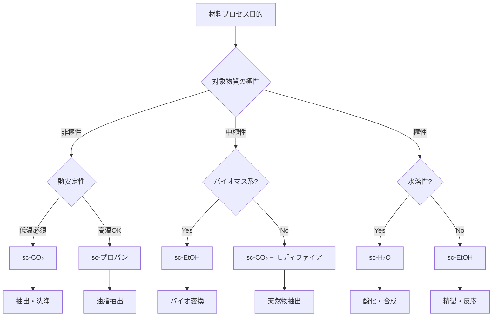

# 第3章: 代表的な超臨界流体とその特性

## 学習目標

この章を学ぶことで、以下を習得できます：

1. **主要超臨界流体の理解**：CO₂、水、エタノールなどの臨界定数と基本物性
2. **溶媒特性の比較**：各SCFの極性、密度、溶解性の違い
3. **応用分野の把握**：各SCFの代表的な工業応用と最適使用条件
4. **溶媒選択能力**：材料プロセスに適したSCFを選択する判断基準
5. **安全性評価**：各SCFの環境影響と取り扱い上の注意点

---

## 3.1 超臨界二酸化炭素（sc-CO₂）

### 3.1.1 基本物性と臨界定数

超臨界二酸化炭素（sc-CO₂）は、最も広く研究・応用されている超臨界流体です。

**臨界定数**
- **臨界温度（Tc）**: 31.1°C（304.3 K）
- **臨界圧力（Pc）**: 7.38 MPa（73.8 bar）
- **臨界密度（ρc）**: 467.6 kg/m³

**代表的な物性値（40°C、15 MPa）**
- 密度：約 800 kg/m³
- 粘度：約 0.06 mPa·s（水の約1/15）
- 拡散係数：約 10⁻⁸ m²/s（気体と液体の中間）

### 3.1.2 なぜsc-CO₂が最も広く使われるのか

**1. 温和な臨界条件**
- 室温に近い臨界温度（31.1°C）
- 熱に不安定な物質（天然物、医薬品）の処理に最適
- エネルギー消費が少ない

**2. 安全性と環境性**
- 無毒・不燃性・非爆発性
- 大気中に既に存在（リサイクル可能）
- オゾン層破壊係数（ODP）= 0
- 地球温暖化係数（GWP）= 1（基準物質）

**3. 入手容易性と経済性**
- 工業副産物として大量に入手可能
- 比較的安価（~$100/トン）
- 高純度品も容易に製造可能

**4. 優れたプロセス特性**
- 減圧により容易に分離（気体に戻る）
- 残留溶媒の問題がない
- 温度・圧力で溶媒特性を調整可能

### 3.1.3 密度-圧力-温度の関係

sc-CO₂の最大の特徴は、密度が圧力と温度に強く依存することです。

```python
import numpy as np
import matplotlib.pyplot as plt
from CoolProp.CoolProp import PropsSI

# sc-CO₂の密度-圧力-温度マップ作成
plt.figure(figsize=(10, 6))

temperatures = [35, 40, 50, 60, 80]  # °C
pressures = np.linspace(8, 30, 100)  # MPa

for T in temperatures:
    densities = []
    for P in pressures:
        try:
            rho = PropsSI('D', 'T', T + 273.15, 'P', P * 1e6, 'CO2')
            densities.append(rho)
        except:
            densities.append(np.nan)

    plt.plot(pressures, densities, label=f'{T}°C', linewidth=2)

plt.axhline(y=467.6, color='r', linestyle='--',
            label='臨界密度 (467.6 kg/m³)')
plt.xlabel('圧力 (MPa)', fontsize=12)
plt.ylabel('密度 (kg/m³)', fontsize=12)
plt.title('超臨界CO₂の密度-圧力-温度関係', fontsize=14)
plt.legend()
plt.grid(True, alpha=0.3)
plt.xlim(8, 30)
plt.ylim(0, 1000)
plt.tight_layout()
plt.savefig('co2_density_map.png', dpi=300)
plt.show()

# 特定条件での密度計算
print("=== sc-CO₂の密度計算 ===")
conditions = [(40, 10), (40, 15), (40, 25), (60, 15)]
for T, P in conditions:
    rho = PropsSI('D', 'T', T + 273.15, 'P', P * 1e6, 'CO2')
    print(f"T = {T}°C, P = {P} MPa: ρ = {rho:.1f} kg/m³")
```

**重要な知見**：
- 臨界点近傍で密度が急激に変化（圧力・温度調整による溶解性制御）
- 40°C、15 MPaで約800 kg/m³（液体CO₂に近い密度）
- 高温では密度が低下→溶解性低下

### 3.1.4 溶媒特性と極性

**基本的な極性**
- **非極性〜やや極性**の溶媒
- ヒルデブランド溶解度パラメータ：δ ≈ 6-12 MPa^(1/2)（圧力依存）
- 無極性分子（脂肪族、芳香族）に対する溶解性が高い

**モディファイア（共溶媒）の使用**

極性物質の溶解性を向上させるため、少量の極性溶媒を添加：

- **エタノール（1-10 vol%）**: 極性物質の抽出
- **メタノール**: より高い極性が必要な場合
- **水**: 超親水性物質の可溶化

```python
# モディファイア効果のシミュレーション
import matplotlib.pyplot as plt

modifier_conc = np.array([0, 1, 3, 5, 10])  # vol%
polarity_index = np.array([1.0, 1.8, 2.5, 3.0, 4.0])  # 相対値

plt.figure(figsize=(8, 5))
plt.plot(modifier_conc, polarity_index, 'o-', linewidth=2, markersize=8)
plt.xlabel('エタノール添加量 (vol%)', fontsize=12)
plt.ylabel('極性指数（相対値）', fontsize=12)
plt.title('モディファイア添加による極性変化', fontsize=14)
plt.grid(True, alpha=0.3)
plt.tight_layout()
plt.savefig('modifier_effect.png', dpi=300)
plt.show()

print("モディファイア効果:")
print("- 1-3%添加で極性が2-3倍に増加")
print("- 極性化合物の抽出効率が大幅に向上")
```

### 3.1.5 代表的な応用例

**1. 脱カフェイン（Decaffeination）**
- 世界初の商用sc-CO₂プロセス（1970年代）
- コーヒー豆・茶葉からカフェインを選択的に除去
- 風味成分を保持

**2. 天然物抽出**
- ホップエキス（ビール）
- 香料・精油
- 医薬品成分

**3. ドライクリーニング**
- 有機溶媒（パークロロエチレン）の代替
- 非水洗浄プロセス

**4. RESS（Rapid Expansion of Supercritical Solutions）**
- 超微粒子製造
- 医薬品の結晶制御
- ナノ粒子合成

**5. 精密洗浄**
- 半導体製造（レジスト除去）
- 光学部品洗浄

---

## 3.2 超臨界水（SCW）

### 3.2.1 基本物性と臨界定数

**臨界定数**
- **臨界温度（Tc）**: 374°C（647 K）
- **臨界圧力（Pc）**: 22.1 MPa（221 bar）
- **臨界密度（ρc）**: 322 kg/m³

**極端な物性変化の特徴**

常温の水と超臨界水では、物性が劇的に変化します：

| 物性 | 常温水（25°C） | 超臨界水（400°C, 25 MPa） | 変化率 |
|------|----------------|---------------------------|--------|
| 密度（kg/m³） | 997 | ~200 | 1/5 |
| 粘度（mPa·s） | 0.89 | 0.04 | 1/20 |
| 誘電率 | 78 | ~6 | 1/13 |
| イオン積（Kw） | 10⁻¹⁴ | 10⁻¹¹ | 1000倍 |

**最も重要な変化：誘電率の低下**

```python
import numpy as np
import matplotlib.pyplot as plt

# 水の誘電率の温度依存性（簡略モデル）
temperatures = np.linspace(0, 500, 500)
def dielectric_constant(T):
    """水の誘電率の近似式"""
    if T < 374:
        return 87.74 - 0.4 * T + 0.00072 * T**2 - 0.000001 * T**3
    else:
        # 超臨界領域での急激な低下
        return 80 * np.exp(-(T - 374) / 100)

epsilon = [dielectric_constant(T) for T in temperatures]

plt.figure(figsize=(10, 6))
plt.plot(temperatures, epsilon, linewidth=2)
plt.axvline(x=374, color='r', linestyle='--', label='臨界温度 (374°C)')
plt.axhline(y=78, color='gray', linestyle=':', alpha=0.5, label='室温水の誘電率')
plt.xlabel('温度 (°C)', fontsize=12)
plt.ylabel('誘電率 ε', fontsize=12)
plt.title('水の誘電率の温度依存性', fontsize=14)
plt.legend()
plt.grid(True, alpha=0.3)
plt.xlim(0, 500)
plt.ylim(0, 90)
plt.tight_layout()
plt.savefig('water_dielectric.png', dpi=300)
plt.show()

print("=== 誘電率の変化が意味すること ===")
print("常温水（ε ≈ 78）: 極性溶媒、イオン性物質に優れた溶媒")
print("超臨界水（ε ≈ 6）: 非極性溶媒、有機物に近い性質")
print("→ 温度制御により極性を連続的に調整可能")
```

### 3.2.2 超臨界水中の化学反応

**酸化反応の促進**

超臨界水中では、酸素が完全に溶解し、有機物の酸化分解が急速に進行します。

**反応機構の特徴**：
1. **酸素の完全可溶化**（相分離なし）
2. **ラジカル反応の促進**（H·、OH·の生成）
3. **イオン積の増加**（酸・塩基触媒効果）

```python
# 超臨界水中の有機物酸化分解の反応速度シミュレーション
import numpy as np
import matplotlib.pyplot as plt

def scw_oxidation_rate(T, P=25):
    """
    超臨界水中の酸化反応速度定数（アレニウス式）
    k = A * exp(-Ea / RT)
    """
    A = 1e13  # 頻度因子 (s^-1)
    Ea = 150e3  # 活性化エネルギー (J/mol)
    R = 8.314  # 気体定数

    return A * np.exp(-Ea / (R * T))

temperatures = np.linspace(300, 700, 100) + 273.15  # K
k_values = [scw_oxidation_rate(T) for T in temperatures]

plt.figure(figsize=(10, 6))
plt.semilogy(temperatures - 273.15, k_values, linewidth=2)
plt.axvline(x=374, color='r', linestyle='--', label='臨界温度')
plt.xlabel('温度 (°C)', fontsize=12)
plt.ylabel('反応速度定数 k (s⁻¹)', fontsize=12)
plt.title('超臨界水中の酸化反応速度', fontsize=14)
plt.legend()
plt.grid(True, alpha=0.3, which='both')
plt.tight_layout()
plt.savefig('scw_reaction_rate.png', dpi=300)
plt.show()

# 滞留時間の計算
print("=== 有機物分解に必要な滞留時間 ===")
for T_celsius in [400, 500, 600]:
    k = scw_oxidation_rate(T_celsius + 273.15)
    t_99 = -np.log(0.01) / k  # 99%分解に必要な時間
    print(f"{T_celsius}°C: {t_99:.2f} 秒 ({t_99/60:.2f} 分)")
```

### 3.2.3 代表的な応用例

**1. SCWO（Supercritical Water Oxidation, 超臨界水酸化）**

有害廃棄物の完全無害化技術：

- **対象廃棄物**：
  - PCB、ダイオキシン類
  - 有機塩素化合物
  - 医薬品・農薬廃棄物
  - 下水汚泥

- **反応条件**：
  - 温度：400-650°C
  - 圧力：23-30 MPa
  - 滞留時間：数秒〜数分

- **生成物**：
  - CO₂、H₂O、N₂（無害なガス）
  - 無機塩（固体として分離）

**2. 水熱合成（Hydrothermal Synthesis）**

- **金属酸化物ナノ粒子**：
  - ZnO、TiO₂、Fe₃O₄
  - 形状・サイズ制御が容易

- **ゼオライト・多孔体**：
  - 結晶性制御
  - 低温合成（エネルギー効率）

**3. バイオマス変換**

- **ガス化**：水素・メタンの生成
- **液化**：バイオ原油の製造

---

## 3.3 超臨界エタノール（sc-EtOH）

### 3.3.1 基本物性と臨界定数

**臨界定数**
- **臨界温度（Tc）**: 241°C（514 K）
- **臨界圧力（Pc）**: 6.14 MPa（61.4 bar）
- **臨界密度（ρc）**: 276 kg/m³

**特徴**：
- CO₂より高温だが、水より低温
- 中程度の極性（CO₂と水の中間）
- 生体適合性・低毒性

### 3.3.2 グリーン溶媒としての位置づけ

エタノールは、12の「グリーンケミストリー原則」に適合：

1. **再生可能資源**：バイオマス由来
2. **低毒性**：食品添加物レベル
3. **生分解性**：環境中で容易に分解
4. **非危険性**：適切な条件下で安全

```python
# 各種溶媒のグリーン性評価（レーダーチャート）
import numpy as np
import matplotlib.pyplot as plt

categories = ['再生可能性', '低毒性', '生分解性', '安全性', '入手容易性', '経済性']
N = len(categories)

# スコア（5点満点）
solvents = {
    'sc-CO₂': [3, 5, 5, 5, 5, 4],
    'sc-EtOH': [5, 4, 5, 4, 4, 3],
    'sc-H₂O': [5, 5, 5, 3, 5, 5],
    'ヘキサン': [1, 2, 2, 2, 4, 5]
}

angles = np.linspace(0, 2 * np.pi, N, endpoint=False).tolist()
angles += angles[:1]

fig, ax = plt.subplots(figsize=(8, 8), subplot_kw=dict(projection='polar'))

for solvent, scores in solvents.items():
    values = scores + scores[:1]
    ax.plot(angles, values, 'o-', linewidth=2, label=solvent)
    ax.fill(angles, values, alpha=0.15)

ax.set_xticks(angles[:-1])
ax.set_xticklabels(categories, fontsize=11)
ax.set_ylim(0, 5)
ax.set_yticks([1, 2, 3, 4, 5])
ax.set_title('各種溶媒のグリーン性評価', fontsize=14, pad=20)
ax.legend(loc='upper right', bbox_to_anchor=(1.3, 1.1))
ax.grid(True)

plt.tight_layout()
plt.savefig('green_solvent_comparison.png', dpi=300)
plt.show()
```

### 3.3.3 代表的な応用例

**1. 天然物抽出**

- **ポリフェノール類**：抗酸化物質
- **カロテノイド**：色素成分
- **脂溶性ビタミン**

利点：
- 食品グレードの溶媒（残留しても安全）
- 中程度の極性（幅広い成分を抽出）

**2. バイオディーゼル製造**

従来法の問題点：
- 液相エステル交換反応（長時間）
- 触媒（NaOH、KOH）の分離が必要
- グリセリン副生物の処理

sc-EtOH法の利点：
```python
# バイオディーゼル製造のプロセス比較
import matplotlib.pyplot as plt

methods = ['従来法\n(触媒)', 'sc-EtOH法']
reaction_time = [60, 5]  # 分
temperature = [60, 280]  # °C
yield_pct = [95, 98]

fig, axes = plt.subplots(1, 3, figsize=(12, 4))

# 反応時間
axes[0].bar(methods, reaction_time, color=['steelblue', 'coral'])
axes[0].set_ylabel('反応時間（分）', fontsize=11)
axes[0].set_title('反応速度', fontsize=12)

# 反応温度
axes[1].bar(methods, temperature, color=['steelblue', 'coral'])
axes[1].set_ylabel('温度（°C）', fontsize=11)
axes[1].set_title('反応温度', fontsize=12)

# 収率
axes[2].bar(methods, yield_pct, color=['steelblue', 'coral'])
axes[2].set_ylabel('収率（%）', fontsize=11)
axes[2].set_ylim(90, 100)
axes[2].set_title('製品収率', fontsize=12)

plt.tight_layout()
plt.savefig('biodiesel_comparison.png', dpi=300)
plt.show()

print("sc-EtOH法の優位性:")
print("- 反応時間：1/12（60分 → 5分）")
print("- 無触媒プロセス（分離工程不要）")
print("- 高収率・高純度")
print("- グリセリン同時変換")
```

**3. ナノ粒子合成**

- 金属ナノ粒子の還元合成
- 有機-無機ハイブリッド材料

---

## 3.4 その他の超臨界流体

### 3.4.1 超臨界プロパン（sc-C₃H₈）

**臨界定数**
- Tc = 96.7°C、Pc = 4.25 MPa

**特徴と用途**：
- CO₂より高い溶解性（脂溶性物質）
- 食用油の抽出
- **欠点**：可燃性

### 3.4.2 超臨界窒素（sc-N₂）

**臨界定数**
- Tc = -147°C、Pc = 3.39 MPa

**用途**：
- 極低温プロセス
- 不活性雰囲気での反応

### 3.4.3 超臨界キセノン（sc-Xe）

**臨界定数**
- Tc = 16.6°C、Pc = 5.84 MPa

**特徴**：
- 室温に近い臨界温度
- 放射線遮蔽効果
- **欠点**：非常に高価

### 3.4.4 超臨界フッ素化合物

**例：HFC-134a（1,1,1,2-テトラフルオロエタン）**
- Tc = 101°C、Pc = 4.06 MPa
- オゾン層破壊係数（ODP）= 0
- 冷媒からの転用

**用途**：
- 半導体洗浄
- フッ素系ポリマー合成

---

## 3.5 溶媒選択ガイド

### 3.5.1 SCF選択の決定木

プロセス目的に応じた最適なSCF選択のフローチャート：



### 3.5.2 全SCFの比較表

| SCF | Tc (°C) | Pc (MPa) | 極性 | 密度範囲 (kg/m³) | 主な用途 | 安全性 | コスト |
|-----|---------|----------|------|------------------|----------|--------|--------|
| **CO₂** | 31.1 | 7.38 | 非〜弱極性 | 200-900 | 抽出、洗浄、粒子製造 | ◎ 無毒・不燃 | ◎ 低 |
| **H₂O** | 374 | 22.1 | 極性→非極性 | 50-600 | 酸化、合成、ガス化 | ○ 高温高圧 | ◎ 極低 |
| **EtOH** | 241 | 6.14 | 中極性 | 100-500 | バイオ変換、抽出 | ○ 低毒性 | ○ 中 |
| **C₃H₈** | 96.7 | 4.25 | 非極性 | 150-500 | 油脂抽出 | △ 可燃性 | ○ 中 |
| **N₂** | -147 | 3.39 | 非極性 | 300-800 | 不活性プロセス | ◎ 不活性 | ○ 中 |
| **Xe** | 16.6 | 5.84 | 非極性 | 1000-2000 | 特殊用途 | ◎ 不活性 | × 高 |

### 3.5.3 モディファイア（共溶媒）の使用

**目的**：
- 極性の調整
- 溶解性の向上
- 選択性の制御

**一般的なモディファイア**：

| モディファイア | 添加量 (vol%) | 効果 | 対象物質 |
|---------------|---------------|------|----------|
| エタノール | 1-10 | 極性増加 | ポリフェノール、アルカロイド |
| メタノール | 1-5 | 強極性化 | 糖類、アミノ酸 |
| 酢酸 | 0.1-3 | 酸性化 | 塩基性化合物 |
| 水 | 1-10 | 親水性向上 | ペプチド、タンパク質 |

```python
# モディファイア効果のシミュレーション
import numpy as np
import matplotlib.pyplot as plt

compounds = ['カフェイン', 'カテキン', 'アントシアニン', 'クロロフィル']
extraction_pure_co2 = [85, 45, 20, 90]  # %
extraction_with_modifier = [95, 88, 75, 92]  # %

x = np.arange(len(compounds))
width = 0.35

fig, ax = plt.subplots(figsize=(10, 6))
bars1 = ax.bar(x - width/2, extraction_pure_co2, width,
               label='純sc-CO₂', color='steelblue')
bars2 = ax.bar(x + width/2, extraction_with_modifier, width,
               label='sc-CO₂ + 5% EtOH', color='coral')

ax.set_ylabel('抽出率 (%)', fontsize=12)
ax.set_xlabel('化合物', fontsize=12)
ax.set_title('モディファイア添加による抽出率の向上', fontsize=14)
ax.set_xticks(x)
ax.set_xticklabels(compounds)
ax.legend()
ax.set_ylim(0, 100)
ax.grid(axis='y', alpha=0.3)

# 向上率の表示
for i, (v1, v2) in enumerate(zip(extraction_pure_co2, extraction_with_modifier)):
    improvement = v2 - v1
    ax.text(i, v2 + 2, f'+{improvement}%', ha='center', fontsize=9)

plt.tight_layout()
plt.savefig('modifier_extraction_comparison.png', dpi=300)
plt.show()

print("=== モディファイア効果の定量評価 ===")
for comp, v1, v2 in zip(compounds, extraction_pure_co2, extraction_with_modifier):
    print(f"{comp}: {v1}% → {v2}% (向上率: {(v2-v1)/v1*100:.1f}%)")
```

### 3.5.4 環境・安全性の考慮

**環境影響評価（LCA視点）**

```python
# 各SCFの環境負荷スコア（簡易評価）
import matplotlib.pyplot as plt
import numpy as np

solvents = ['sc-CO₂', 'sc-H₂O', 'sc-EtOH', 'ヘキサン', 'トルエン']

# スコア（低いほど環境負荷が小さい、10点満点）
gwp = [1, 0, 2, 8, 7]  # 地球温暖化係数
toxicity = [0, 0, 1, 7, 8]  # 毒性
biodegradability = [10, 10, 10, 3, 2]  # 生分解性（逆スコア、高いほど良い）
energy = [4, 8, 6, 2, 3]  # エネルギー消費

x = np.arange(len(solvents))
width = 0.2

fig, ax = plt.subplots(figsize=(12, 6))

bars1 = ax.bar(x - 1.5*width, gwp, width, label='温暖化')
bars2 = ax.bar(x - 0.5*width, toxicity, width, label='毒性')
bars3 = ax.bar(x + 0.5*width, [10-b for b in biodegradability], width, label='難分解性')
bars4 = ax.bar(x + 1.5*width, energy, width, label='エネルギー')

ax.set_ylabel('環境負荷スコア（低い方が良い）', fontsize=12)
ax.set_xlabel('溶媒', fontsize=12)
ax.set_title('各種溶媒の環境負荷比較', fontsize=14)
ax.set_xticks(x)
ax.set_xticklabels(solvents)
ax.legend()
ax.set_ylim(0, 11)
ax.grid(axis='y', alpha=0.3)

plt.tight_layout()
plt.savefig('environmental_impact_comparison.png', dpi=300)
plt.show()

print("=== 総合環境スコア（合計値、低いほど優秀） ===")
for i, solv in enumerate(solvents):
    total = gwp[i] + toxicity[i] + (10-biodegradability[i]) + energy[i]
    print(f"{solv}: {total} 点")
```

**安全性のチェックリスト**

各SCFの取り扱い上の注意点：

| SCF | 主な安全リスク | 必要な対策 | 法規制 |
|-----|---------------|-----------|--------|
| **CO₂** | 高圧、窒息（換気不良） | 圧力計、安全弁、換気 | 高圧ガス保安法 |
| **H₂O** | 超高圧、高温やけど | 耐圧容器、断熱、冷却 | 高圧ガス保安法 |
| **EtOH** | 可燃性（高温） | 防爆設備、不活性ガス | 消防法（危険物） |
| **C₃H₈** | 可燃性、爆発 | 防爆、ガス検知器 | 高圧ガス保安法 |

---

## 3.6 Pythonコード例集

### コード例1: 各種SCFの状態図を比較

```python
import numpy as np
import matplotlib.pyplot as plt
from CoolProp.CoolProp import PropsSI

# 複数のSCFの状態図を重ねて表示
fluids = {
    'CO2': {'color': 'blue', 'label': 'CO₂'},
    'Water': {'color': 'red', 'label': 'H₂O'},
    'Ethanol': {'color': 'green', 'label': 'EtOH'}
}

fig, ax = plt.subplots(figsize=(10, 8))

for fluid, props in fluids.items():
    try:
        T_crit = PropsSI(fluid, 'Tcrit')
        P_crit = PropsSI(fluid, 'pcrit')

        # 飽和曲線（液相線・気相線）
        T_range = np.linspace(PropsSI(fluid, 'Ttriple') + 1, T_crit - 0.1, 200)
        P_sat = [PropsSI('P', 'T', T, 'Q', 0, fluid) for T in T_range]

        ax.plot(T_range - 273.15, np.array(P_sat) / 1e6,
                color=props['color'], linewidth=2, label=props['label'])

        # 臨界点
        ax.plot(T_crit - 273.15, P_crit / 1e6, 'o',
                color=props['color'], markersize=10)

        # 臨界点の注釈
        ax.annotate(f"{props['label']}\n({T_crit-273.15:.1f}°C, {P_crit/1e6:.1f} MPa)",
                   xy=(T_crit - 273.15, P_crit / 1e6),
                   xytext=(15, 15), textcoords='offset points',
                   fontsize=9, ha='left',
                   bbox=dict(boxstyle='round,pad=0.3', facecolor=props['color'], alpha=0.2),
                   arrowprops=dict(arrowstyle='->', color=props['color']))

    except Exception as e:
        print(f"Error with {fluid}: {e}")

ax.set_xlabel('温度 (°C)', fontsize=12)
ax.set_ylabel('圧力 (MPa)', fontsize=12)
ax.set_title('各種超臨界流体の相図比較', fontsize=14)
ax.legend(fontsize=11)
ax.grid(True, alpha=0.3)
ax.set_xlim(-50, 400)
ax.set_ylim(0, 25)

plt.tight_layout()
plt.savefig('scf_phase_diagram_comparison.png', dpi=300)
plt.show()
```

### コード例2: 溶媒選択支援ツール

```python
def select_scf(target_compound, max_temperature=None, required_polarity=None):
    """
    材料プロセスに最適なSCFを推奨する関数

    Parameters:
    -----------
    target_compound : str
        対象化合物の種類 ('nonpolar', 'midpolar', 'polar')
    max_temperature : float
        許容最高温度 (°C)
    required_polarity : str
        必要な極性 ('low', 'medium', 'high')

    Returns:
    --------
    dict: 推奨SCFと理由
    """

    scf_database = {
        'CO2': {
            'Tc': 31.1,
            'Pc': 7.38,
            'polarity': 'low',
            'suitable_for': ['nonpolar', 'midpolar'],
            'advantages': ['低温', '安全', '低コスト'],
            'applications': ['抽出', '洗浄', '粒子製造']
        },
        'H2O': {
            'Tc': 374,
            'Pc': 22.1,
            'polarity': 'high',
            'suitable_for': ['polar'],
            'advantages': ['グリーン', '反応性高い'],
            'applications': ['酸化', '合成', 'ガス化']
        },
        'EtOH': {
            'Tc': 241,
            'Pc': 6.14,
            'polarity': 'medium',
            'suitable_for': ['midpolar', 'polar'],
            'advantages': ['バイオ由来', '低毒性'],
            'applications': ['バイオ変換', '抽出']
        },
        'Propane': {
            'Tc': 96.7,
            'Pc': 4.25,
            'polarity': 'low',
            'suitable_for': ['nonpolar'],
            'advantages': ['高溶解性（脂質）'],
            'applications': ['油脂抽出']
        }
    }

    recommendations = []

    for scf, properties in scf_database.items():
        score = 0
        reasons = []

        # 化合物適合性チェック
        if target_compound in properties['suitable_for']:
            score += 3
            reasons.append(f"化合物の極性に適合")

        # 温度制約チェック
        if max_temperature is not None:
            if properties['Tc'] <= max_temperature:
                score += 2
                reasons.append(f"温度要件を満たす（Tc={properties['Tc']}°C）")
            else:
                score -= 5
                reasons.append(f"温度要件を超過（Tc={properties['Tc']}°C）")

        # 極性要件チェック
        if required_polarity is not None:
            if properties['polarity'] == required_polarity:
                score += 2
                reasons.append(f"必要な極性レベル")

        recommendations.append({
            'scf': scf,
            'score': score,
            'properties': properties,
            'reasons': reasons
        })

    # スコア順にソート
    recommendations.sort(key=lambda x: x['score'], reverse=True)

    return recommendations

# 使用例
print("=== ケース1: 低極性化合物の低温抽出 ===")
results = select_scf(target_compound='nonpolar',
                     max_temperature=100,
                     required_polarity='low')
for i, rec in enumerate(results[:3], 1):
    print(f"\n{i}位: {rec['scf']} (スコア: {rec['score']})")
    print(f"   理由: {', '.join(rec['reasons'])}")
    print(f"   利点: {', '.join(rec['properties']['advantages'])}")

print("\n=== ケース2: 極性化合物の酸化反応 ===")
results = select_scf(target_compound='polar',
                     required_polarity='high')
for i, rec in enumerate(results[:3], 1):
    print(f"\n{i}位: {rec['scf']} (スコア: {rec['score']})")
    print(f"   理由: {', '.join(rec['reasons'])}")
```

### コード例3: モディファイア効果の予測モデル

```python
import numpy as np
import matplotlib.pyplot as plt
from scipy.optimize import curve_fit

# 実験データ（モディファイア濃度 vs 抽出率）
modifier_conc = np.array([0, 1, 3, 5, 10, 15])  # vol% ethanol
extraction_yield = np.array([45, 62, 78, 88, 93, 94])  # %

def modifier_model(C, Y_max, k, C0):
    """
    モディファイア効果のモデル（Langmuir型）
    Y = Y_max * (k * C) / (1 + k * C) + C0
    """
    return Y_max * (k * C) / (1 + k * C) + C0

# フィッティング
popt, pcov = curve_fit(modifier_model, modifier_conc, extraction_yield,
                       p0=[100, 0.5, 40])

Y_max, k, C0 = popt
print(f"フィッティングパラメータ:")
print(f"  最大抽出率: {Y_max:.1f}%")
print(f"  親和定数 k: {k:.3f}")
print(f"  ベース抽出率: {C0:.1f}%")

# 予測曲線
C_fit = np.linspace(0, 20, 200)
Y_fit = modifier_model(C_fit, *popt)

# プロット
plt.figure(figsize=(10, 6))
plt.plot(modifier_conc, extraction_yield, 'o', markersize=10,
         label='実験データ', color='darkblue')
plt.plot(C_fit, Y_fit, '-', linewidth=2,
         label=f'モデル (Y_max={Y_max:.1f}%)', color='red')
plt.axhline(y=Y_max, linestyle='--', color='gray', alpha=0.5,
           label=f'最大抽出率 ({Y_max:.1f}%)')
plt.xlabel('エタノール濃度 (vol%)', fontsize=12)
plt.ylabel('抽出率 (%)', fontsize=12)
plt.title('モディファイア効果の予測モデル', fontsize=14)
plt.legend()
plt.grid(True, alpha=0.3)
plt.xlim(0, 20)
plt.ylim(40, 100)
plt.tight_layout()
plt.savefig('modifier_prediction_model.png', dpi=300)
plt.show()

# 最適濃度の提案
optimal_conc = 5  # コスト対効果を考慮
optimal_yield = modifier_model(optimal_conc, *popt)
print(f"\n推奨モディファイア濃度: {optimal_conc} vol%")
print(f"予測抽出率: {optimal_yield:.1f}%")
print(f"（最大抽出率の {optimal_yield/Y_max*100:.1f}%に到達）")
```

### コード例4: SCFの経済性評価ツール

```python
import numpy as np
import matplotlib.pyplot as plt

class SCFEconomicsCalculator:
    """超臨界流体プロセスの経済性評価クラス"""

    def __init__(self, scf_type, production_rate_kg_per_hour):
        self.scf_type = scf_type
        self.production_rate = production_rate_kg_per_hour

        # SCF特性データベース
        self.scf_properties = {
            'CO2': {
                'cost_per_kg': 0.1,  # $/kg
                'Tc': 31.1, 'Pc': 7.38,
                'energy_factor': 1.0
            },
            'H2O': {
                'cost_per_kg': 0.001,
                'Tc': 374, 'Pc': 22.1,
                'energy_factor': 3.5  # 高温・高圧
            },
            'EtOH': {
                'cost_per_kg': 1.5,
                'Tc': 241, 'Pc': 6.14,
                'energy_factor': 2.2
            }
        }

    def calculate_operating_cost(self, operating_hours_per_year=8000):
        """年間運転コストの計算"""

        props = self.scf_properties[self.scf_type]

        # SCF消費量（リサイクル率95%と仮定）
        scf_loss_rate = 0.05  # 5%のロス
        scf_consumption = self.production_rate * scf_loss_rate

        # コスト要素
        scf_cost = scf_consumption * props['cost_per_kg'] * operating_hours_per_year

        # エネルギーコスト（簡易計算）
        base_energy_cost = 50  # $/hour（ベースライン）
        energy_cost = base_energy_cost * props['energy_factor'] * operating_hours_per_year

        # メンテナンスコスト（圧力に依存）
        maintenance_cost = props['Pc'] * 1000 * operating_hours_per_year / 8000

        total_cost = scf_cost + energy_cost + maintenance_cost

        return {
            'scf_cost': scf_cost,
            'energy_cost': energy_cost,
            'maintenance_cost': maintenance_cost,
            'total_cost': total_cost,
            'cost_per_kg_product': total_cost / (self.production_rate * operating_hours_per_year)
        }

    def compare_with_conventional(self, conventional_solvent_cost_per_kg_product):
        """従来法との経済性比較"""

        scf_economics = self.calculate_operating_cost()
        scf_cost = scf_economics['cost_per_kg_product']

        savings = conventional_solvent_cost_per_kg_product - scf_cost
        savings_pct = (savings / conventional_solvent_cost_per_kg_product) * 100

        return {
            'scf_cost': scf_cost,
            'conventional_cost': conventional_solvent_cost_per_kg_product,
            'savings': savings,
            'savings_percent': savings_pct
        }

# 使用例：複数SCFの経済性比較
production_rate = 100  # kg/hour

scf_types = ['CO2', 'H2O', 'EtOH']
results = {}

print("=== 年間運転コスト比較（生産速度: 100 kg/hour）===\n")

for scf in scf_types:
    calc = SCFEconomicsCalculator(scf, production_rate)
    results[scf] = calc.calculate_operating_cost()

    print(f"{scf}:")
    print(f"  SCF消費コスト: ${results[scf]['scf_cost']:,.0f}")
    print(f"  エネルギーコスト: ${results[scf]['energy_cost']:,.0f}")
    print(f"  メンテナンスコスト: ${results[scf]['maintenance_cost']:,.0f}")
    print(f"  総コスト: ${results[scf]['total_cost']:,.0f}")
    print(f"  製品1kgあたり: ${results[scf]['cost_per_kg_product']:.3f}\n")

# コスト内訳の可視化
fig, ax = plt.subplots(figsize=(10, 6))

categories = list(results.keys())
scf_costs = [results[scf]['scf_cost'] for scf in categories]
energy_costs = [results[scf]['energy_cost'] for scf in categories]
maintenance_costs = [results[scf]['maintenance_cost'] for scf in categories]

x = np.arange(len(categories))
width = 0.6

p1 = ax.bar(x, scf_costs, width, label='SCF消費', color='steelblue')
p2 = ax.bar(x, energy_costs, width, bottom=scf_costs,
            label='エネルギー', color='coral')
p3 = ax.bar(x, maintenance_costs, width,
            bottom=np.array(scf_costs) + np.array(energy_costs),
            label='メンテナンス', color='lightgreen')

ax.set_ylabel('年間コスト ($)', fontsize=12)
ax.set_xlabel('超臨界流体', fontsize=12)
ax.set_title('各SCFの運転コスト内訳', fontsize=14)
ax.set_xticks(x)
ax.set_xticklabels(categories)
ax.legend()
ax.grid(axis='y', alpha=0.3)

plt.tight_layout()
plt.savefig('scf_economics_comparison.png', dpi=300)
plt.show()
```

### コード例5: 安全性リスク評価マトリクス

```python
import numpy as np
import matplotlib.pyplot as plt
import seaborn as sns

# リスクマトリクス（確率 × 重大度）
scf_list = ['CO2', 'H2O', 'EtOH', 'Propane', 'N2']

# リスク項目
risks = {
    'high_pressure': [3, 5, 2, 2, 2],      # 高圧リスク（1-5）
    'high_temperature': [1, 5, 4, 3, 1],  # 高温リスク
    'flammability': [1, 1, 3, 5, 1],      # 可燃性
    'toxicity': [2, 1, 1, 2, 1],          # 毒性
    'asphyxiation': [4, 2, 2, 3, 4]       # 窒息リスク
}

# リスクマトリクスの作成
risk_matrix = np.array([risks[key] for key in risks.keys()])

# ヒートマップ
fig, ax = plt.subplots(figsize=(10, 6))
sns.heatmap(risk_matrix, annot=True, fmt='d', cmap='YlOrRd',
            xticklabels=scf_list,
            yticklabels=['高圧', '高温', '可燃性', '毒性', '窒息'],
            cbar_kws={'label': 'リスクレベル (1=低, 5=高)'},
            linewidths=0.5, linecolor='gray')

ax.set_title('超臨界流体の安全性リスク評価マトリクス', fontsize=14)
ax.set_xlabel('超臨界流体', fontsize=12)
ax.set_ylabel('リスク項目', fontsize=12)

plt.tight_layout()
plt.savefig('scf_safety_risk_matrix.png', dpi=300)
plt.show()

# 総合リスクスコア
total_risk = risk_matrix.sum(axis=0)
print("=== 総合リスクスコア ===")
for scf, score in zip(scf_list, total_risk):
    risk_level = "低" if score < 8 else ("中" if score < 12 else "高")
    print(f"{scf}: {score} 点 ({risk_level}リスク)")
```

### コード例6: プロセス条件最適化シミュレーション

```python
import numpy as np
import matplotlib.pyplot as plt
from scipy.optimize import minimize

def scf_extraction_efficiency(T, P, scf_type='CO2'):
    """
    SCF抽出効率のモデル化

    Parameters:
    -----------
    T : float
        温度 (°C)
    P : float
        圧力 (MPa)
    scf_type : str
        SCFの種類

    Returns:
    --------
    float : 抽出効率 (0-100%)
    """

    # 臨界定数
    critical_points = {
        'CO2': {'Tc': 31.1, 'Pc': 7.38},
        'H2O': {'Tc': 374, 'Pc': 22.1},
        'EtOH': {'Tc': 241, 'Pc': 6.14}
    }

    Tc = critical_points[scf_type]['Tc']
    Pc = critical_points[scf_type]['Pc']

    # 換算温度・圧力
    Tr = (T + 273.15) / (Tc + 273.15)
    Pr = P / Pc

    # 効率モデル（簡略化）
    if Tr < 1.0 or Pr < 1.0:
        return 0  # 超臨界条件未満

    # 最適条件からのずれを考慮
    T_optimal = Tc + 10  # 臨界温度 + 10°C
    P_optimal = Pc * 2   # 臨界圧力の2倍

    efficiency = 100 * np.exp(-0.001 * ((T - T_optimal)**2 + (P - P_optimal)**2))

    return min(efficiency, 100)

def total_cost(conditions, scf_type='CO2'):
    """
    総コスト関数（エネルギー + 時間）

    Parameters:
    -----------
    conditions : array
        [温度(°C), 圧力(MPa)]

    Returns:
    --------
    float : 総コスト（相対値）
    """
    T, P = conditions

    # 効率
    efficiency = scf_extraction_efficiency(T, P, scf_type)

    if efficiency < 1:
        return 1e6  # ペナルティ

    # エネルギーコスト（温度・圧力に依存）
    energy_cost = 0.1 * T + 10 * P

    # 時間コスト（効率に反比例）
    time_cost = 1000 / efficiency

    return energy_cost + time_cost

# 最適化
scf = 'CO2'
critical_T = 31.1
critical_P = 7.38

# 初期推定値
x0 = [critical_T + 20, critical_P * 2]

# 制約条件（超臨界条件）
bounds = [(critical_T + 1, critical_T + 50),
          (critical_P + 0.5, critical_P * 4)]

# 最適化実行
result = minimize(total_cost, x0, args=(scf,),
                 bounds=bounds, method='L-BFGS-B')

T_opt, P_opt = result.x
efficiency_opt = scf_extraction_efficiency(T_opt, P_opt, scf)

print(f"=== {scf}抽出プロセスの最適条件 ===")
print(f"最適温度: {T_opt:.1f}°C")
print(f"最適圧力: {P_opt:.1f} MPa")
print(f"予測抽出効率: {efficiency_opt:.1f}%")
print(f"最小総コスト: {result.fun:.1f} (相対値)")

# 効率マップの可視化
T_range = np.linspace(critical_T + 1, critical_T + 50, 50)
P_range = np.linspace(critical_P + 0.5, critical_P * 4, 50)
T_grid, P_grid = np.meshgrid(T_range, P_range)

efficiency_grid = np.zeros_like(T_grid)
for i in range(len(P_range)):
    for j in range(len(T_range)):
        efficiency_grid[i, j] = scf_extraction_efficiency(
            T_grid[i, j], P_grid[i, j], scf)

plt.figure(figsize=(10, 8))
contour = plt.contourf(T_grid, P_grid, efficiency_grid,
                       levels=20, cmap='viridis')
plt.colorbar(contour, label='抽出効率 (%)')

# 臨界点と最適点をプロット
plt.plot(critical_T, critical_P, 'r*', markersize=15,
         label=f'臨界点 ({critical_T}°C, {critical_P} MPa)')
plt.plot(T_opt, P_opt, 'wo', markersize=12,
         label=f'最適点 ({T_opt:.1f}°C, {P_opt:.1f} MPa)')

plt.xlabel('温度 (°C)', fontsize=12)
plt.ylabel('圧力 (MPa)', fontsize=12)
plt.title(f'{scf}抽出プロセスの効率マップ', fontsize=14)
plt.legend()
plt.grid(True, alpha=0.3, color='white')
plt.tight_layout()
plt.savefig('scf_optimization_map.png', dpi=300)
plt.show()
```

---

## まとめ

本章では、代表的な超臨界流体の特性と応用について学びました。

### 重要なポイント

1. **超臨界CO₂（sc-CO₂）**
   - 最も広く使用される（温和な条件、安全性、経済性）
   - 非極性〜やや極性の溶媒
   - 抽出・洗浄・粒子製造に最適

2. **超臨界水（SCW）**
   - 極端な物性変化（誘電率の低下）
   - 強力な酸化能力（SCWO）
   - 水熱合成・バイオマス変換に応用

3. **超臨界エタノール（sc-EtOH）**
   - グリーン溶媒（再生可能、低毒性）
   - 中程度の極性
   - バイオディーゼル・天然物抽出に有効

4. **溶媒選択の基準**
   - 対象物質の極性
   - 温度・圧力の制約
   - 安全性・環境性
   - 経済性

5. **モディファイアの活用**
   - 少量添加（1-10 vol%）で極性を調整
   - 選択性の向上
   - 抽出効率の改善

### 次章の予告

第4章では、超臨界流体を用いた**材料合成プロセス**を詳しく学びます：

- 超臨界流体中での化学反応
- ナノ粒子合成技術（RESS、SAS法）
- 多孔体・エアロゲルの製造
- 複合材料・機能性材料の創製

プロセスの原理から実際の装置設計まで、材料インフォマティクスの視点も交えて解説します。

---

## 参考文献

1. McHugh, M. A., & Krukonis, V. J. (1994). *Supercritical Fluid Extraction: Principles and Practice* (2nd ed.). Butterworth-Heinemann.

2. Brunner, G. (2010). *Applications of Supercritical Fluids*. Annual Review of Chemical and Biomolecular Engineering, 1, 321-342.

3. Savage, P. E. (1999). *Organic Chemical Reactions in Supercritical Water*. Chemical Reviews, 99(2), 603-622.

4. Beckman, E. J. (2004). *Supercritical and near-critical CO2 in green chemical synthesis and processing*. The Journal of Supercritical Fluids, 28(2-3), 121-191.

5. Saka, S., & Kusdiana, D. (2001). *Biodiesel fuel from rapeseed oil as prepared in supercritical methanol*. Fuel, 80(2), 225-231.

6. 阿尾武彦 (2012). 『超臨界流体入門』. 講談社サイエンティフィク.

7. 日本超臨界流体協会 (2020). 『超臨界流体技術の最前線』. 化学工業社.

---

## 演習問題

### 問題1: 溶媒選択（基礎）
カフェインをコーヒー豆から抽出したい。以下の条件で最適なSCFを選び、理由を述べよ。
- カフェインの極性：やや極性
- 熱分解温度：約 230°C
- 目標：食品グレードの製品

<details>
<summary>解答例を見る</summary>

**推奨SCF: 超臨界CO₂ + エタノール（モディファイア）**

**理由**：
1. CO₂の臨界温度（31.1°C）は熱分解温度を大きく下回る
2. 純CO₂はやや非極性だが、エタノール添加（3-5 vol%）でカフェインの溶解性が向上
3. 食品グレードの溶媒（CO₂、エタノールともに安全）
4. 減圧により容易に分離可能（残留溶媒なし）
5. 商業的に確立された技術（実績あり）

**プロセス条件**：
- 温度：40-60°C
- 圧力：15-25 MPa
- モディファイア：エタノール 3-5 vol%

</details>

### 問題2: モディファイア効果（応用）
純sc-CO₂での抽出率が50%の極性化合物に対し、エタノールを5 vol%添加したところ、抽出率が85%に向上した。この向上効果を定量的に評価せよ。

<details>
<summary>解答例を見る</summary>

**定量評価**：

1. **絶対向上率**：
   - Δη = 85% - 50% = 35%

2. **相対向上率**：
   - (85% - 50%) / 50% × 100 = 70% の向上

3. **モディファイア効率**：
   - 1 vol%あたりの向上率 = 35% / 5% = 7%/vol%

4. **経済性評価**：
   - エタノールコスト増加：約5%（体積基準）
   - 抽出率向上：70%
   - **コスト対効果：非常に優れている**

**結論**：少量のモディファイア添加で大幅な性能向上が得られ、経済的に有利。

</details>

### 問題3: 安全性評価（発展）
超臨界プロパン（sc-C₃H₈）を用いた油脂抽出プロセスを計画している。CO₂と比較した場合の安全リスクを評価し、必要な対策を提案せよ。

<details>
<summary>解答例を見る</summary>

**リスク比較**：

| 項目 | sc-CO₂ | sc-C₃H₈ | リスク差 |
|------|--------|---------|---------|
| 可燃性 | なし | **高い** | +++++ |
| 爆発性 | なし | **あり** | +++++ |
| 毒性 | 低い | 低い | 同等 |
| 圧力レベル | 7.4 MPa | 4.3 MPa | CO₂の方が高圧 |
| 窒息リスク | あり | あり | 同等 |

**必要な安全対策**：

1. **防爆対策**：
   - 電気設備の防爆仕様（Ex認定）
   - 静電気除去設備
   - 火気厳禁エリアの設定

2. **ガス検知・警報**：
   - 可燃性ガス検知器の設置
   - 自動遮断システム
   - 緊急停止ボタン

3. **換気・不活性化**：
   - 強制換気システム
   - 窒素パージ装置
   - 爆発放散口

4. **運転管理**：
   - 標準作業手順書（SOP）の整備
   - 定期的な安全教育
   - リスクアセスメントの実施

**総合評価**：
- sc-C₃H₈は溶解性に優れるが、安全対策コストが高い
- 食品用途など、安全性が最優先される場合はsc-CO₂を推奨
- 工業用途で経済性を重視する場合は、十分な安全対策を前提にsc-C₃H₈も選択肢

</details>

---

## ナビゲーション

- **前の章**: [第2章: 超臨界流体の物性と相挙動](chapter-2.md)
- **次の章**: [第4章: 超臨界流体を用いた材料合成](chapter-4.md)
- **シリーズ目次**: [超臨界流体入門シリーズ](index.md)

---

**著者**: Dr. Yusuke Hashimoto（橋本 雄介）
**所属**: 東北大学 材料科学高等研究所
**専門**: 材料インフォマティクス、計算材料科学
**更新日**: 2025年12月25日
