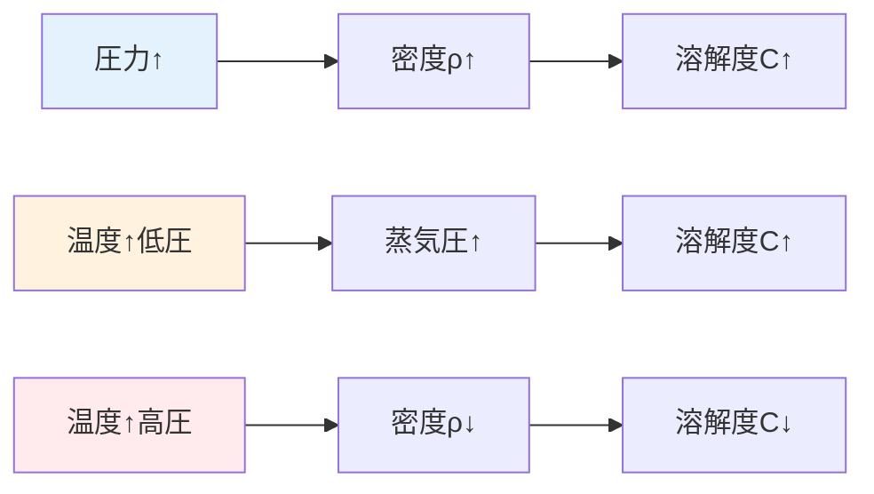
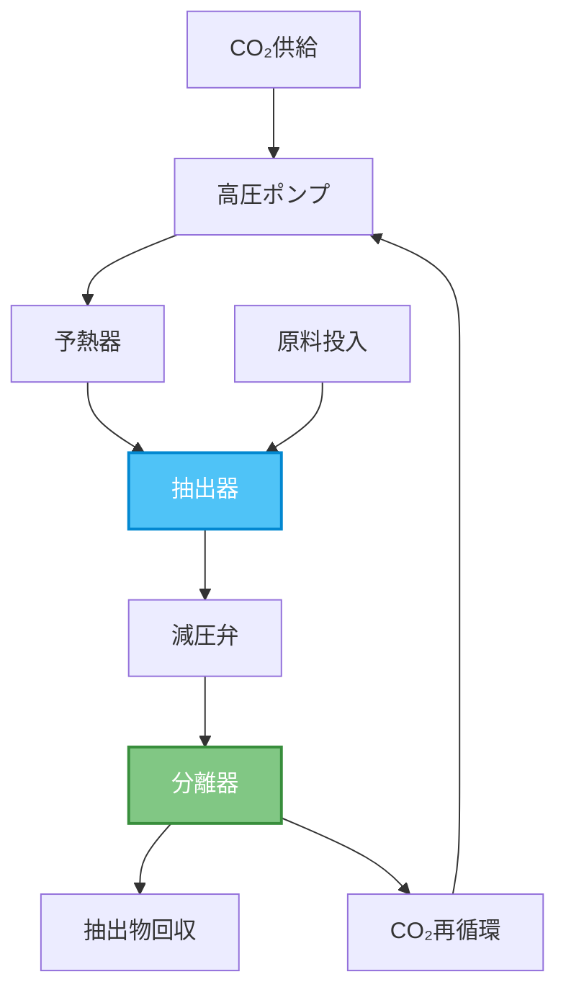
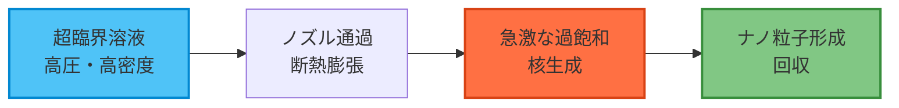
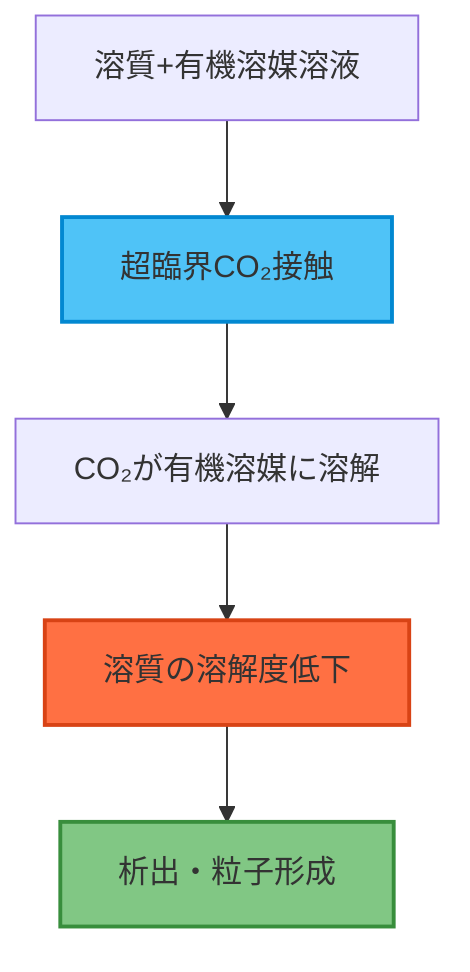

## 学習目標

この章を完了すると、以下のスキルと知識を習得できます：

  * ✅ 超臨界流体抽出（SFE）の原理と産業応用を理解できる
  * ✅ RESS法とSAS法によるナノ材料合成の違いを説明できる
  * ✅ エアロゲル製造における超臨界乾燥の役割を理解できる
  * ✅ 超臨界流体による表面処理・洗浄の利点を説明できる
  * ✅ 超臨界水酸化（SCWO）の原理と廃棄物処理への応用を理解できる
  * ✅ Pythonで超臨界流体プロセスの基本設計計算ができる

## 4.1 超臨界流体抽出（SFE）

### 4.1.1 SFEの原理

**超臨界流体抽出（Supercritical Fluid Extraction, SFE）** は、超臨界状態の流体を溶媒として用いる抽出プロセスです。圧力と温度を調整することで溶解度を連続的に制御できる点が最大の特徴です。

#### 📊 溶解度の圧力・温度依存性

超臨界流体中の溶質の溶解度は、以下の経験式で表されます：

**Chrastil式**（1982）：

$$
\ln C = k \ln \rho + \frac{a}{T} + b
$$

ここで：
- $C$：溶解度（kg/m³）
- $\rho$：超臨界流体の密度（kg/m³）
- $T$：温度（K）
- $k$、$a$、$b$：物質固有の定数

**重要なポイント**：
- 等温条件では、圧力上昇 → 密度上昇 → 溶解度上昇
- 高圧条件では、温度上昇 → 密度低下 → 溶解度低下（逆転現象）
- 低圧条件では、温度上昇 → 蒸気圧上昇 → 溶解度上昇



### 4.1.2 代表的なSFE応用例

#### ☕ カフェイン抽出（古典的な例）

コーヒー豆からのカフェイン除去は、超臨界CO₂抽出の最も有名な産業応用です。

**プロセス条件**：
- 温度：40-80℃
- 圧力：100-300 bar
- 溶媒：超臨界CO₂（選択性向上のため水蒸気で前処理）

**従来法に対する利点**：
- 有機溶媒（ジクロロメタン等）の残留なし
- 低温処理により香りの保持
- カフェインの選択的抽出（クロロゲン酸等は残留）

#### 🌿 天然物抽出

**精油抽出**：
- ラベンダー、ローズマリー等のエッセンシャルオイル
- 水蒸気蒸留に比べて低温処理が可能
- 熱に敏感な香気成分の保持

**有効成分抽出**：
- 医薬品原料（例：タキソール、アルテミシニン）
- 機能性食品成分（例：リコペン、カロテノイド）
- 抗酸化物質（例：ポリフェノール、トコフェロール）

#### 🍺 ホップ抽出

ビール製造で使用するホップのα酸抽出：

- 従来法（有機溶媒）に比べて純度が高い
- 苦味成分（フムロン）の異性化を防ぐ
- ビール製造時の添加量を正確に制御可能

### 4.1.3 SFEプロセス設計の考慮点

**抽出器設計**：



**最適化パラメータ**：
1. **圧力**：高圧ほど溶解度増加だが、設備コスト上昇
2. **温度**：低温で選択性向上、高温で拡散速度増加
3. **流量**：物質移動速度とCO₂消費量のトレードオフ
4. **粒径**：小粒径で抽出速度向上、圧力損失増加
5. **共溶媒**：エタノール等の添加で極性物質の溶解度向上

```python
"""
Example 1: Chrastil式による溶解度計算
超臨界CO₂中のカフェイン溶解度
"""
import numpy as np
import matplotlib.pyplot as plt

def chrastil_solubility(rho, T, k=10.5, a=-4800, b=20.0):
    """
    Chrastil式による溶解度計算

    Parameters
    ----------
    rho : float or array
        超臨界流体密度 (kg/m³)
    T : float
        温度 (K)
    k, a, b : float
        カフェインに対する経験定数

    Returns
    -------
    C : float or array
        溶解度 (kg/m³)
    """
    ln_C = k * np.log(rho) + a / T + b
    return np.exp(ln_C)

# CO₂密度の圧力・温度依存性（簡略モデル）
def co2_density(P, T):
    """
    超臨界CO₂密度の簡易計算（状態方程式の簡略版）

    Parameters
    ----------
    P : float or array
        圧力 (bar)
    T : float
        温度 (K)

    Returns
    -------
    rho : float or array
        密度 (kg/m³)
    """
    # 実際にはPeng-Robinson等の状態方程式を使用
    # ここでは簡略化した経験式
    Pc = 73.8  # 臨界圧力 (bar)
    Tc = 304.1  # 臨界温度 (K)

    Pr = P / Pc  # 換算圧力
    Tr = T / Tc  # 換算温度

    # 簡略化した密度計算
    rho = 467.6 * Pr / Tr * (1 + 0.1 * (Pr - 1))
    return rho

# 可視化
fig, axes = plt.subplots(1, 2, figsize=(14, 5))

# (1) 圧力-溶解度曲線（異なる温度）
P_range = np.linspace(80, 300, 100)  # bar
temperatures = [313, 323, 333, 343]  # K (40, 50, 60, 70℃)

for T in temperatures:
    rho = co2_density(P_range, T)
    C = chrastil_solubility(rho, T) * 1e6  # mg/m³に変換
    axes[0].plot(P_range, C, label=f'{T-273:.0f}°C', linewidth=2)

axes[0].set_xlabel('Pressure (bar)', fontsize=12)
axes[0].set_ylabel('Caffeine Solubility (mg/L)', fontsize=12)
axes[0].set_title('Pressure Effect on Solubility', fontsize=13, fontweight='bold')
axes[0].legend()
axes[0].grid(alpha=0.3)

# (2) 温度-溶解度曲線（異なる圧力）
T_range = np.linspace(313, 353, 100)  # K
pressures = [100, 150, 200, 250, 300]  # bar

for P in pressures:
    rho = co2_density(P, T_range)
    C = chrastil_solubility(rho, T_range) * 1e6
    axes[1].plot(T_range - 273, C, label=f'{P} bar', linewidth=2)

axes[1].set_xlabel('Temperature (°C)', fontsize=12)
axes[1].set_ylabel('Caffeine Solubility (mg/L)', fontsize=12)
axes[1].set_title('Temperature Effect on Solubility', fontsize=13, fontweight='bold')
axes[1].legend()
axes[1].grid(alpha=0.3)
axes[1].axvline(x=31, color='red', linestyle='--', alpha=0.5, label='Tc')

plt.tight_layout()
plt.savefig('sfe_solubility_curves.png', dpi=300, bbox_inches='tight')
plt.show()

# 実用的な抽出条件の提案
print("=== 推奨抽出条件 ===")
print("\n【高溶解度条件】")
P_high, T_high = 250, 323  # bar, K
rho_high = co2_density(P_high, T_high)
C_high = chrastil_solubility(rho_high, T_high)
print(f"圧力: {P_high} bar, 温度: {T_high-273:.0f}°C")
print(f"CO₂密度: {rho_high:.1f} kg/m³")
print(f"カフェイン溶解度: {C_high*1e6:.2f} mg/L")

print("\n【低温選択的抽出】")
P_low, T_low = 150, 313  # bar, K
rho_low = co2_density(P_low, T_low)
C_low = chrastil_solubility(rho_low, T_low)
print(f"圧力: {P_low} bar, 温度: {T_low-273:.0f}°C")
print(f"CO₂密度: {rho_low:.1f} kg/m³")
print(f"カフェイン溶解度: {C_low*1e6:.2f} mg/L")
```

**実行結果の解釈**：
- 高圧・中温条件で最大溶解度を達成
- 低温条件では選択性が向上（他の成分の溶解度が低下）
- 温度上昇による溶解度変化は圧力領域で異なる挙動を示す

## 4.2 ナノ材料合成

超臨界流体を利用したナノ材料合成は、粒径制御と結晶性の向上に優れています。

### 4.2.1 RESS法（超臨界溶液の急速膨張）

**RESS（Rapid Expansion of Supercritical Solutions）** は、超臨界流体に溶解させた物質を急激に減圧することでナノ粒子を生成する手法です。

#### 🔬 原理



**核生成理論**：

古典的核生成理論より、臨界核半径 $r^*$ は：

$$
r^* = \frac{2\gamma V_m}{RT \ln S}
$$

ここで：
- $\gamma$：表面エネルギー（J/m²）
- $V_m$：モル体積（m³/mol）
- $S$：過飽和度（$= C / C_{eq}$）

**粒径制御パラメータ**：
1. **抽出圧力**：高圧で溶解度増加 → 過飽和度増大 → 粒径減少
2. **ノズル温度**：温度低下で核生成速度増加
3. **膨張速度**：急速膨張で均一核生成優先
4. **添加剤**：界面活性剤で粒子成長抑制

#### 📈 応用例

**医薬品微粒子化**：
- イブプロフェン、アスピリン等の難水溶性薬物
- 平均粒径：50-500 nm（バイオアベイラビリティ向上）

**高分子微粒子**：
- ポリ乳酸（PLA）、ポリカプロラクトン（PCL）
- ドラッグデリバリーシステム用キャリア

```python
"""
Example 2: RESS法における粒径予測
核生成理論に基づくナノ粒子サイズ計算
"""
import numpy as np
import matplotlib.pyplot as plt

def critical_radius(gamma, Vm, T, S):
    """
    臨界核半径の計算

    Parameters
    ----------
    gamma : float
        表面エネルギー (J/m²)
    Vm : float
        モル体積 (m³/mol)
    T : float
        温度 (K)
    S : float
        過飽和度 (C/Ceq)

    Returns
    -------
    r_star : float
        臨界核半径 (m)
    """
    R = 8.314  # J/(mol·K)
    r_star = 2 * gamma * Vm / (R * T * np.log(S))
    return r_star

def nucleation_rate(gamma, Vm, T, S, A0=1e30):
    """
    均一核生成速度の計算（簡略モデル）

    Parameters
    ----------
    gamma : float
        表面エネルギー (J/m²)
    Vm : float
        モル体積 (m³/mol)
    T : float
        温度 (K)
    S : float
        過飽和度
    A0 : float
        頻度因子 (m⁻³s⁻¹)

    Returns
    -------
    J : float
        核生成速度 (m⁻³s⁻¹)
    """
    R = 8.314
    r_star = critical_radius(gamma, Vm, T, S)

    # 核生成エネルギー障壁
    delta_G = (16 * np.pi * gamma**3 * Vm**2) / (3 * (R * T * np.log(S))**2)

    # 核生成速度
    J = A0 * np.exp(-delta_G / (R * T))
    return J

def final_particle_size(S, gamma, Vm, T, growth_time=1e-3):
    """
    最終粒子径の簡易推定

    Parameters
    ----------
    S : float
        過飽和度
    gamma : float
        表面エネルギー (J/m²)
    Vm : float
        モル体積 (m³/mol)
    T : float
        温度 (K)
    growth_time : float
        成長時間 (s)

    Returns
    -------
    d_final : float
        最終粒子径 (m)
    """
    r_star = critical_radius(gamma, Vm, T, S)

    # 簡略化した成長モデル（拡散律速）
    growth_rate = 1e-6 * S  # m/s (経験的)
    d_final = 2 * (r_star + growth_rate * growth_time)

    return d_final

# イブプロフェンの物性値
gamma_ibu = 0.03  # J/m² (推定値)
Vm_ibu = 2.1e-4   # m³/mol
T_room = 298      # K

# 過飽和度の範囲
S_range = np.logspace(0.5, 3, 100)  # 3.16 ~ 1000

# 粒径計算
particle_sizes = []
for S in S_range:
    d = final_particle_size(S, gamma_ibu, Vm_ibu, T_room) * 1e9  # nm
    particle_sizes.append(d)

# 可視化
fig, axes = plt.subplots(1, 2, figsize=(14, 5))

# (1) 過飽和度-粒径関係
axes[0].plot(S_range, particle_sizes, 'b-', linewidth=2.5)
axes[0].set_xscale('log')
axes[0].set_xlabel('Supersaturation Ratio (S)', fontsize=12)
axes[0].set_ylabel('Particle Diameter (nm)', fontsize=12)
axes[0].set_title('Effect of Supersaturation on Particle Size', fontsize=13, fontweight='bold')
axes[0].grid(alpha=0.3)
axes[0].axhline(y=100, color='red', linestyle='--', alpha=0.5, label='Target: 100 nm')
axes[0].legend()

# (2) 核生成速度
J_values = [nucleation_rate(gamma_ibu, Vm_ibu, T_room, S) for S in S_range]

axes[1].plot(S_range, J_values, 'r-', linewidth=2.5)
axes[1].set_xscale('log')
axes[1].set_yscale('log')
axes[1].set_xlabel('Supersaturation Ratio (S)', fontsize=12)
axes[1].set_ylabel('Nucleation Rate (m⁻³s⁻¹)', fontsize=12)
axes[1].set_title('Nucleation Rate vs. Supersaturation', fontsize=13, fontweight='bold')
axes[1].grid(alpha=0.3)

plt.tight_layout()
plt.savefig('ress_particle_size_prediction.png', dpi=300, bbox_inches='tight')
plt.show()

# プロセス条件の提案
print("=== RESS法プロセス設計 ===\n")

target_sizes = [50, 100, 200, 500]  # nm
print("目標粒径に対する推奨過飽和度：\n")

for target in target_sizes:
    # 逆算（簡易的）
    for S in S_range:
        d = final_particle_size(S, gamma_ibu, Vm_ibu, T_room) * 1e9
        if abs(d - target) < 5:
            print(f"粒径 {target} nm → 過飽和度 S = {S:.1f}")
            print(f"  推奨条件: 抽出圧力 {100 + 20*np.log(S):.0f} bar, 急速膨張")
            break
```

### 4.2.2 SAS/GAS法（超臨界反溶媒法）

**SAS（Supercritical Anti-Solvent）** または **GAS（Gas Anti-Solvent）** 法は、超臨界流体を反溶媒として利用する手法です。

#### 🔬 原理



**RESS法との比較**：

特性 | RESS法 | SAS法
---|---|---
溶質溶解先 | 超臨界流体 | 有機溶媒
析出メカニズム | 膨張による過飽和 | 反溶媒効果
適用物質 | SCFに可溶な物質 | 有機溶媒に可溶な物質（汎用性高）
粒径制御 | 難しい（高速） | 容易（穏やか）
結晶性 | 低（急速析出） | 高（ゆっくり析出）

### 4.2.3 超臨界水中での水熱合成

**超臨界水（Supercritical Water, SCW）** を反応媒体とした材料合成は、独自の利点を持ちます。

**超臨界水の特性**：
- 誘電率が大幅に低下（常温：78 → 超臨界：2-5）
- イオン積が増加（pH調整不要な塩基性条件）
- 有機物との相溶性向上

#### 📊 応用例

**金属酸化物ナノ粒子**：
- TiO₂、ZnO、Fe₃O₄（磁性ナノ粒子）
- 連続フロー式合成で均一粒径

**量子ドット**：
- CdSe、CdS、PbS
- 高結晶性、狭い粒径分布

```python
"""
Example 3: 超臨界水中での金属酸化物合成シミュレーション
連続フロー式反応器の設計計算
"""
import numpy as np
import matplotlib.pyplot as plt

class SCWReactor:
    """超臨界水反応器モデル"""

    def __init__(self, T=400, P=250, flow_rate=10):
        """
        Parameters
        ----------
        T : float
            反応温度 (℃)
        P : float
            反応圧力 (bar)
        flow_rate : float
            流量 (mL/min)
        """
        self.T = T + 273.15  # K
        self.P = P
        self.flow_rate = flow_rate

    def reaction_rate(self, C, k0=1e8, Ea=60000):
        """
        反応速度計算（アレニウス式）

        Parameters
        ----------
        C : float
            前駆体濃度 (mol/L)
        k0 : float
            頻度因子 (s⁻¹)
        Ea : float
            活性化エネルギー (J/mol)

        Returns
        -------
        r : float
            反応速度 (mol/(L·s))
        """
        R = 8.314
        k = k0 * np.exp(-Ea / (R * self.T))
        r = k * C
        return r

    def residence_time(self, reactor_volume=50):
        """
        滞留時間計算

        Parameters
        ----------
        reactor_volume : float
            反応器体積 (mL)

        Returns
        -------
        tau : float
            滞留時間 (s)
        """
        tau = reactor_volume / self.flow_rate * 60  # s
        return tau

    def conversion(self, C0=0.1, reactor_volume=50):
        """
        反応率計算

        Parameters
        ----------
        C0 : float
            初期濃度 (mol/L)
        reactor_volume : float
            反応器体積 (mL)

        Returns
        -------
        X : float
            反応率
        """
        tau = self.residence_time(reactor_volume)
        r = self.reaction_rate(C0)

        # 1次反応を仮定
        k = r / C0
        X = 1 - np.exp(-k * tau)
        return X

    def particle_size(self, C0=0.1, X=0.95):
        """
        粒子径推定（簡略モデル）

        Parameters
        ----------
        C0 : float
            初期濃度 (mol/L)
        X : float
            反応率

        Returns
        -------
        d : float
            平均粒子径 (nm)
        """
        # 生成粒子数密度（核生成理論の簡略版）
        N = 1e18 * (self.T / 673)**2 * (self.P / 250)  # particles/mL

        # 体積から粒径計算（球形を仮定）
        Mw = 80  # g/mol (TiO₂)
        rho = 4230  # kg/m³ (TiO₂)

        mass_produced = C0 * X * Mw  # g/L
        total_volume = mass_produced / rho * 1e-3  # m³/L

        particle_volume = total_volume / N * 1e3  # m³/particle
        d = (6 * particle_volume / np.pi)**(1/3) * 1e9  # nm

        return d

# 温度・圧力条件の最適化
temperatures = np.linspace(350, 450, 20)  # ℃
pressures = [200, 250, 300, 350]  # bar

fig, axes = plt.subplots(2, 2, figsize=(14, 10))

# (1) 温度-反応率関係
for P in pressures:
    conversions = []
    for T in temperatures:
        reactor = SCWReactor(T=T, P=P, flow_rate=10)
        X = reactor.conversion()
        conversions.append(X * 100)

    axes[0, 0].plot(temperatures, conversions, label=f'{P} bar', linewidth=2)

axes[0, 0].set_xlabel('Temperature (°C)', fontsize=12)
axes[0, 0].set_ylabel('Conversion (%)', fontsize=12)
axes[0, 0].set_title('Temperature Effect on Conversion', fontsize=13, fontweight='bold')
axes[0, 0].legend()
axes[0, 0].grid(alpha=0.3)
axes[0, 0].axhline(y=95, color='red', linestyle='--', alpha=0.5)

# (2) 流量-滞留時間関係
flow_rates = np.linspace(5, 50, 20)  # mL/min
reactor_volumes = [30, 50, 70, 100]  # mL

for V in reactor_volumes:
    reactor = SCWReactor(T=400, P=250)
    tau_values = [reactor.residence_time(V) / flow for flow in flow_rates]
    axes[0, 1].plot(flow_rates, tau_values, label=f'{V} mL', linewidth=2)

axes[0, 1].set_xlabel('Flow Rate (mL/min)', fontsize=12)
axes[0, 1].set_ylabel('Residence Time (s)', fontsize=12)
axes[0, 1].set_title('Flow Rate vs. Residence Time', fontsize=13, fontweight='bold')
axes[0, 1].legend()
axes[0, 1].grid(alpha=0.3)

# (3) 温度-粒径関係
for P in pressures:
    particle_sizes = []
    for T in temperatures:
        reactor = SCWReactor(T=T, P=P, flow_rate=10)
        d = reactor.particle_size()
        particle_sizes.append(d)

    axes[1, 0].plot(temperatures, particle_sizes, label=f'{P} bar', linewidth=2)

axes[1, 0].set_xlabel('Temperature (°C)', fontsize=12)
axes[1, 0].set_ylabel('Particle Size (nm)', fontsize=12)
axes[1, 0].set_title('Temperature Effect on Particle Size', fontsize=13, fontweight='bold')
axes[1, 0].legend()
axes[1, 0].grid(alpha=0.3)

# (4) 濃度-粒径関係
concentrations = np.linspace(0.01, 0.5, 20)  # mol/L
reactor = SCWReactor(T=400, P=250, flow_rate=10)

particle_sizes_conc = []
for C0 in concentrations:
    d = reactor.particle_size(C0=C0)
    particle_sizes_conc.append(d)

axes[1, 1].plot(concentrations, particle_sizes_conc, 'b-', linewidth=2.5)
axes[1, 1].set_xlabel('Precursor Concentration (mol/L)', fontsize=12)
axes[1, 1].set_ylabel('Particle Size (nm)', fontsize=12)
axes[1, 1].set_title('Concentration Effect on Particle Size', fontsize=13, fontweight='bold')
axes[1, 1].grid(alpha=0.3)

plt.tight_layout()
plt.savefig('scw_synthesis_optimization.png', dpi=300, bbox_inches='tight')
plt.show()

# 最適条件の提案
print("=== 超臨界水合成の最適条件 ===\n")
print("【TiO₂ナノ粒子合成（粒径10-20 nm目標）】")
print("温度: 380-400°C")
print("圧力: 250 bar")
print("流量: 10 mL/min")
print("前駆体濃度: 0.05-0.1 mol/L")
print("反応器体積: 50 mL（滞留時間 ~300 s）")
```

## 4.3 エアロゲル製造

### 4.3.1 エアロゲルとは

**エアロゲル（Aerogel）** は、ゲルの液相を気相で置き換えた超低密度・高多孔性材料です。

**特徴**：
- 密度：0.003-0.5 g/cm³（空気の3-500倍）
- 多孔率：80-99.8%
- 比表面積：200-1000 m²/g
- 熱伝導率：0.01-0.02 W/(m·K)（断熱性能）

### 4.3.2 超臨界乾燥の原理

通常の蒸発乾燥では、液-気界面の表面張力によりゲル骨格が崩壊します。超臨界乾燥では、表面張力がゼロになるため、構造を保持できます。


**プロセスステップ**：

1. **ゲル化**：テトラエトキシシラン（TEOS）の加水分解・縮合
   $$
   \text{Si(OC}_2\text{H}_5\text{)}_4 + 4\text{H}_2\text{O} \rightarrow \text{Si(OH)}_4 + 4\text{C}_2\text{H}_5\text{OH}
   $$

2. **エージング**：骨格強度向上

3. **溶媒置換**：水 → エタノール（CO₂と相溶性向上）

4. **超臨界乾燥**：
   - 温度：40-60℃
   - 圧力：80-150 bar
   - 時間：2-6時間

### 4.3.3 応用

**断熱材**：
- 建築用断熱材（熱伝導率 0.015 W/(m·K)）
- 宇宙服、高温配管断熱

**触媒**：
- 高比表面積（活性サイト多数）
- 貴金属担持触媒

**エネルギー貯蔵**：
- スーパーキャパシタ電極（カーボンエアロゲル）
- 水素貯蔵材料

```python
"""
Example 4: エアロゲル乾燥プロセスシミュレーション
超臨界CO₂乾燥における圧力・温度プロファイル
"""
import numpy as np
import matplotlib.pyplot as plt

def drying_profile(T_initial=40, P_initial=80, T_final=60, P_final=1):
    """
    超臨界乾燥プロセスの温度・圧力プロファイル

    Parameters
    ----------
    T_initial : float
        初期温度 (℃)
    P_initial : float
        初期圧力 (bar)
    T_final : float
        最終温度 (℃)
    P_final : float
        最終圧力 (bar)

    Returns
    -------
    time : array
        時間 (min)
    T : array
        温度プロファイル (℃)
    P : array
        圧力プロファイル (bar)
    phase : array
        状態（0: 液体, 1: 超臨界, 2: 気体）
    """
    # プロセス段階
    time = []
    T = []
    P = []
    phase = []

    # Stage 1: 加温・昇圧（0-60 min）
    t1 = np.linspace(0, 60, 100)
    T1 = T_initial + (T_final - T_initial) * (t1 / 60)**1.5
    P1 = P_initial + (P_final - P_initial) * 0.2 * (t1 / 60)
    phase1 = np.ones_like(t1)  # 液体

    time.extend(t1)
    T.extend(T1)
    P.extend(P1)
    phase.extend(phase1)

    # Stage 2: 超臨界状態維持（60-180 min）
    t2 = np.linspace(60, 180, 100)
    T2 = np.ones_like(t2) * T_final
    P2 = P_initial + (P_final - P_initial) * 0.2  # 維持
    phase2 = np.ones_like(t2) * 2  # 超臨界

    time.extend(t2)
    T.extend(T2)
    P.extend(P2)
    phase.extend(phase2)

    # Stage 3: 等温減圧（180-240 min）
    t3 = np.linspace(180, 240, 100)
    T3 = np.ones_like(t3) * T_final
    P3 = P2 - (P2 - P_final) * ((t3 - 180) / 60)**0.5
    phase3 = np.ones_like(t3) * 3  # 気体

    time.extend(t3)
    T.extend(T3)
    P.extend(P3)
    phase.extend(phase3)

    return np.array(time), np.array(T), np.array(P), np.array(phase)

def shrinkage_estimation(P, sigma_liquid=0.022, r_pore=10e-9):
    """
    収縮率の推定（毛管圧モデル）

    Parameters
    ----------
    P : array
        圧力プロファイル (bar)
    sigma_liquid : float
        液体の表面張力 (N/m)
    r_pore : float
        細孔半径 (m)

    Returns
    -------
    shrinkage : array
        収縮率 (%)
    """
    # 毛管圧
    P_capillary = 2 * sigma_liquid / r_pore / 1e5  # bar

    # 超臨界状態（P > Pc）では表面張力ゼロ
    Pc = 73.8  # CO₂臨界圧力 (bar)

    shrinkage = np.zeros_like(P)
    for i, p in enumerate(P):
        if p < Pc:
            # 液体状態：毛管圧による収縮
            shrinkage[i] = min(P_capillary / p * 10, 100)
        else:
            # 超臨界：収縮なし
            shrinkage[i] = 0

    return shrinkage

# プロセスシミュレーション
time, T, P, phase = drying_profile()
shrinkage = shrinkage_estimation(P)

# 可視化
fig, axes = plt.subplots(3, 1, figsize=(12, 10), sharex=True)

# (1) 温度プロファイル
axes[0].plot(time, T, 'r-', linewidth=2.5)
axes[0].set_ylabel('Temperature (°C)', fontsize=12)
axes[0].set_title('Supercritical Drying Process Profile', fontsize=13, fontweight='bold')
axes[0].grid(alpha=0.3)
axes[0].axhline(y=31, color='blue', linestyle='--', alpha=0.5, label='Tc (CO₂)')
axes[0].legend()

# (2) 圧力プロファイル
axes[1].plot(time, P, 'b-', linewidth=2.5)
axes[1].set_ylabel('Pressure (bar)', fontsize=12)
axes[1].grid(alpha=0.3)
axes[1].axhline(y=73.8, color='red', linestyle='--', alpha=0.5, label='Pc (CO₂)')
axes[1].legend()

# 超臨界領域をハイライト
sc_region = (P > 73.8) & (T > 31)
axes[1].fill_between(time, 0, P, where=sc_region, alpha=0.2, color='green', label='Supercritical region')

# (3) 収縮率
axes[2].plot(time, shrinkage, 'g-', linewidth=2.5)
axes[2].set_xlabel('Time (min)', fontsize=12)
axes[2].set_ylabel('Shrinkage (%)', fontsize=12)
axes[2].grid(alpha=0.3)
axes[2].set_ylim([-5, 50])

# プロセス段階の注釈
axes[2].axvspan(0, 60, alpha=0.1, color='red', label='Heating & Pressurization')
axes[2].axvspan(60, 180, alpha=0.1, color='green', label='Supercritical hold')
axes[2].axvspan(180, 240, alpha=0.1, color='blue', label='Isothermal depressurization')
axes[2].legend(loc='upper right')

plt.tight_layout()
plt.savefig('aerogel_drying_process.png', dpi=300, bbox_inches='tight')
plt.show()

print("=== エアロゲル超臨界乾燥プロセス ===\n")
print("【プロセス段階】")
print("Stage 1 (0-60 min): 加温・昇圧")
print(f"  温度: 40 → 60°C")
print(f"  圧力: 80 → 96 bar")
print("\nStage 2 (60-180 min): 超臨界状態維持")
print(f"  温度: 60°C (一定)")
print(f"  圧力: 96 bar (一定)")
print(f"  → 細孔内のエタノールをCO₂で置換")
print("\nStage 3 (180-240 min): 等温減圧")
print(f"  温度: 60°C (一定)")
print(f"  圧力: 96 → 1 bar")
print(f"  → 表面張力ゼロで乾燥完了")

print("\n【予測される物性】")
print("収縮率: < 5% (超臨界乾燥)")
print("比較: 通常乾燥では 30-80% 収縮")
print("密度: 0.05-0.15 g/cm³")
print("多孔率: 90-95%")
print("比表面積: 400-800 m²/g")
```

## 4.4 表面処理と洗浄

### 4.4.1 精密洗浄

超臨界CO₂による洗浄は、電子部品や光学機器の精密洗浄に使用されます。

**利点**：
- 表面張力ゼロ → 微細孔への浸透性
- 低粘度 → 高速洗浄
- 残留物なし（気化時に痕跡なし）
- 環境負荷低（VOC削減）

**応用例**：
- 半導体ウェハー洗浄（フォトレジスト残渣除去）
- 光学レンズ洗浄（指紋、油分除去）
- 精密機械部品の脱脂

### 4.4.2 表面改質

**高分子含浸**：
- ポリマーを超臨界CO₂に溶解
- 多孔質材料に含浸
- 減圧で析出・固定化

**応用**：
- 木材の防腐・防水処理
- 繊維の機能性付与（撥水、抗菌）

### 4.4.3 超臨界CO₂染色

繊維（特にポリエステル）の染色に超臨界CO₂を使用：

**プロセス**：
1. 染料を超臨界CO₂に溶解
2. 繊維内部に拡散
3. 減圧で繊維内に固定化

**利点**：
- 水不使用（廃水ゼロ）
- 染色時間短縮（30-60分）
- 均一な染色

## 4.5 高分子加工

### 4.5.1 SCFによる発泡

超臨界CO₂を物理発泡剤として使用：

**原理**：
1. 高圧下でCO₂を高分子に溶解
2. 急速減圧でCO₂が過飽和
3. 核生成・成長で気泡形成

**応用**：
- 発泡ポリスチレン（断熱材）
- ポリウレタンフォーム
- 生分解性フォーム（PLA）

### 4.5.2 微粒子化

**用途**：
- ポリマー粉末塗料
- 医薬品マイクロカプセル

## 4.6 超臨界水酸化（SCWO）

### 4.6.1 原理

**超臨界水酸化（Supercritical Water Oxidation, SCWO）** は、超臨界水中で有機物を完全酸化する技術です。

**反応条件**：
- 温度：400-650℃
- 圧力：220-300 bar
- 酸化剤：酸素、過酸化水素

**化学反応**：

有機物の完全酸化：

$$
\text{C}_x\text{H}_y\text{O}_z + \left(x + \frac{y}{4} - \frac{z}{2}\right)\text{O}_2 \rightarrow x\text{CO}_2 + \frac{y}{2}\text{H}_2\text{O}
$$

**特徴**：
- 分解効率：99.99%以上
- 反応時間：数秒～数分
- 無害化：CO₂と水のみ生成（塩化物はHClとして回収）

### 4.6.2 廃棄物処理

**対象廃棄物**：
- 有毒有機化合物（PCB、ダイオキシン）
- 医療廃棄物
- 下水汚泥
- 化学兵器

### 4.6.3 電子廃棄物からの金属回収

超臨界水中での金属浸出：

**プロセス**：
1. 電子基板を粉砕
2. 超臨界水 + 酸（塩酸等）で処理
3. 金属イオンが溶液に移行
4. 冷却・析出で金属回収

**回収可能金属**：
- 金、銀、銅、パラジウム

```python
"""
Example 5: 超臨界水酸化（SCWO）反応速度計算
有機物分解効率の温度・圧力依存性
"""
import numpy as np
import matplotlib.pyplot as plt

def scwo_reaction_rate(T, P, C, A=1e12, Ea=120000, n=1.5):
    """
    SCWO反応速度計算

    Parameters
    ----------
    T : float
        温度 (K)
    P : float
        圧力 (bar)
    C : float
        有機物濃度 (mol/L)
    A : float
        頻度因子 (s⁻¹)
    Ea : float
        活性化エネルギー (J/mol)
    n : float
        反応次数

    Returns
    -------
    r : float
        反応速度 (mol/(L·s))
    """
    R = 8.314
    k = A * np.exp(-Ea / (R * T))

    # 圧力効果（簡略モデル）
    k_eff = k * (P / 250)**0.3

    r = k_eff * C**n
    return r

def scwo_conversion(T, P, C0=0.01, tau=10):
    """
    分解率計算

    Parameters
    ----------
    T : float
        温度 (K)
    P : float
        圧力 (bar)
    C0 : float
        初期濃度 (mol/L)
    tau : float
        滞留時間 (s)

    Returns
    -------
    X : float
        分解率
    """
    r = scwo_reaction_rate(T, P, C0)

    # 1.5次反応の積分解
    k_eff = r / C0**1.5

    # 積分形（簡略計算）
    X = 1 - (1 + 0.5 * k_eff * C0**0.5 * tau)**(-2)

    # 物理的範囲に制限
    X = min(max(X, 0), 1)

    return X

# 温度・圧力条件の最適化
temperatures = np.linspace(673, 923, 50)  # K (400-650℃)
pressures = [220, 250, 280, 300]  # bar

fig, axes = plt.subplots(2, 2, figsize=(14, 10))

# (1) 温度-分解率関係
for P in pressures:
    conversions = []
    for T in temperatures:
        X = scwo_conversion(T, P, tau=10) * 100
        conversions.append(X)

    axes[0, 0].plot(temperatures - 273, conversions, label=f'{P} bar', linewidth=2)

axes[0, 0].set_xlabel('Temperature (°C)', fontsize=12)
axes[0, 0].set_ylabel('Decomposition Efficiency (%)', fontsize=12)
axes[0, 0].set_title('Temperature Effect on SCWO Efficiency', fontsize=13, fontweight='bold')
axes[0, 0].legend()
axes[0, 0].grid(alpha=0.3)
axes[0, 0].axhline(y=99.99, color='red', linestyle='--', alpha=0.5, label='Target')

# (2) 滞留時間-分解率関係
residence_times = np.linspace(1, 60, 50)  # s
T_conditions = [673, 723, 773, 823]  # K

for T in T_conditions:
    conversions_tau = []
    for tau in residence_times:
        X = scwo_conversion(T, 250, tau=tau) * 100
        conversions_tau.append(X)

    axes[0, 1].plot(residence_times, conversions_tau, label=f'{T-273:.0f}°C', linewidth=2)

axes[0, 1].set_xlabel('Residence Time (s)', fontsize=12)
axes[0, 1].set_ylabel('Decomposition Efficiency (%)', fontsize=12)
axes[0, 1].set_title('Residence Time Effect', fontsize=13, fontweight='bold')
axes[0, 1].legend()
axes[0, 1].grid(alpha=0.3)
axes[0, 1].axhline(y=99.99, color='red', linestyle='--', alpha=0.5)

# (3) アレニウスプロット
inv_T = 1000 / temperatures  # 1000/T
k_values = []

for T in temperatures:
    r = scwo_reaction_rate(T, 250, 0.01)
    k = r / 0.01**1.5
    k_values.append(k)

axes[1, 0].semilogy(inv_T, k_values, 'b-', linewidth=2.5)
axes[1, 0].set_xlabel('1000/T (K⁻¹)', fontsize=12)
axes[1, 0].set_ylabel('Rate Constant k (L⁰·⁵/(mol⁰·⁵·s))', fontsize=12)
axes[1, 0].set_title('Arrhenius Plot', fontsize=13, fontweight='bold')
axes[1, 0].grid(alpha=0.3)

# (4) プロセス設計マップ
T_grid = np.linspace(673, 923, 30)
tau_grid = np.linspace(5, 60, 30)
T_mesh, tau_mesh = np.meshgrid(T_grid, tau_grid)

X_mesh = np.zeros_like(T_mesh)
for i in range(T_mesh.shape[0]):
    for j in range(T_mesh.shape[1]):
        X_mesh[i, j] = scwo_conversion(T_mesh[i, j], 250, tau=tau_mesh[i, j]) * 100

contour = axes[1, 1].contourf(T_mesh - 273, tau_mesh, X_mesh, levels=15, cmap='RdYlGn')
axes[1, 1].contour(T_mesh - 273, tau_mesh, X_mesh, levels=[99.99], colors='red', linewidths=2)
axes[1, 1].set_xlabel('Temperature (°C)', fontsize=12)
axes[1, 1].set_ylabel('Residence Time (s)', fontsize=12)
axes[1, 1].set_title('Process Design Map', fontsize=13, fontweight='bold')
plt.colorbar(contour, ax=axes[1, 1], label='Efficiency (%)')

plt.tight_layout()
plt.savefig('scwo_optimization.png', dpi=300, bbox_inches='tight')
plt.show()

# 最適条件の提案
print("=== SCWO最適運転条件 ===\n")

target_efficiency = 99.99  # %

print("【高効率条件（99.99%以上）】")
for T in [673, 723, 773, 823]:
    for tau in [10, 20, 30]:
        X = scwo_conversion(T, 250, tau=tau) * 100
        if X >= target_efficiency:
            print(f"温度: {T-273:.0f}°C, 滞留時間: {tau:.0f} s → 分解率: {X:.3f}%")
            break

print("\n【エネルギー効率重視】")
print("温度: 450-500°C (低温側)")
print("圧力: 250 bar")
print("滞留時間: 20-30 s (長め)")

print("\n【処理能力重視】")
print("温度: 550-600°C (高温)")
print("圧力: 280-300 bar")
print("滞留時間: 5-10 s (短時間)")
```

### 4.6.4 プロセス上の課題

**腐食問題**：
- 超臨界水 + 塩化物 → 塩酸生成
- 高温腐食によるリアクター損傷
- 対策：耐食性材料（Ni基合金、チタン）

**塩析出**：
- 無機塩（NaCl等）の溶解度低下
- 配管閉塞のリスク
- 対策：適切な温度制御、フラッシング

**高コスト**：
- 高圧装置の初期投資
- 運転コスト
- 対策：大規模化、エネルギー回収

```python
"""
Example 6: SCWO経済性評価
処理コストの試算と従来法との比較
"""
import numpy as np
import matplotlib.pyplot as plt

class SCWOEconomics:
    """SCWO経済性評価モデル"""

    def __init__(self, capacity=1000, T=500, P=250):
        """
        Parameters
        ----------
        capacity : float
            処理能力 (kg/day)
        T : float
            運転温度 (℃)
        P : float
            運転圧力 (bar)
        """
        self.capacity = capacity  # kg/day
        self.T = T
        self.P = P

    def capex(self):
        """
        設備投資コスト（CAPEX）

        Returns
        -------
        cost : float
            設備投資 (万円)
        """
        # スケール係数（経験式）
        base_cost = 5000  # 万円（基準：100 kg/day）
        scale_factor = 0.7

        cost = base_cost * (self.capacity / 100)**scale_factor

        # 圧力補正
        pressure_factor = 1 + 0.01 * (self.P - 250)
        cost *= pressure_factor

        return cost

    def opex(self):
        """
        運転コスト（OPEX）

        Returns
        -------
        cost : float
            年間運転コスト (万円/年)
        """
        # エネルギーコスト
        heating_energy = self.capacity * 365 * 2.5  # kWh/year (2.5 kWh/kg)
        energy_cost = heating_energy * 20 / 10000  # 20円/kWh → 万円

        # メンテナンスコスト（CAPEX の 5%/年）
        maintenance_cost = self.capex() * 0.05

        # 人件費
        labor_cost = 800  # 万円/年（オペレーター2名）

        total_opex = energy_cost + maintenance_cost + labor_cost
        return total_opex

    def unit_cost(self):
        """
        単位処理コスト

        Returns
        -------
        cost : float
            処理コスト (円/kg)
        """
        # 償却期間10年
        annual_capex = self.capex() / 10
        annual_opex = self.opex()

        total_annual_cost = (annual_capex + annual_opex) * 10000  # 円
        annual_capacity = self.capacity * 365  # kg/year

        unit_cost = total_annual_cost / annual_capacity
        return unit_cost

# 処理能力ごとのコスト比較
capacities = np.logspace(2, 4, 20)  # 100-10000 kg/day

scwo_costs = []
incineration_costs = []
landfill_costs = []

for cap in capacities:
    # SCWO
    scwo = SCWOEconomics(capacity=cap, T=500, P=250)
    scwo_costs.append(scwo.unit_cost())

    # 焼却（従来法）
    incin_cost = 150 - 20 * np.log10(cap / 100)  # 円/kg（スケールメリット）
    incineration_costs.append(max(incin_cost, 80))

    # 埋立
    landfill_costs.append(50)  # 円/kg（固定）

# 可視化
fig, axes = plt.subplots(1, 2, figsize=(14, 5))

# (1) 処理コスト比較
axes[0].plot(capacities, scwo_costs, 'b-', linewidth=2.5, label='SCWO')
axes[0].plot(capacities, incineration_costs, 'r--', linewidth=2.5, label='Incineration')
axes[0].plot(capacities, landfill_costs, 'g:', linewidth=2.5, label='Landfill')

axes[0].set_xscale('log')
axes[0].set_xlabel('Treatment Capacity (kg/day)', fontsize=12)
axes[0].set_ylabel('Unit Cost (¥/kg)', fontsize=12)
axes[0].set_title('SCWO Economic Comparison', fontsize=13, fontweight='bold')
axes[0].legend()
axes[0].grid(alpha=0.3)

# 損益分岐点
for i, cap in enumerate(capacities):
    if scwo_costs[i] < incineration_costs[i]:
        break_even = cap
        break

axes[0].axvline(x=break_even, color='black', linestyle='--', alpha=0.5)
axes[0].text(break_even * 1.2, 150, f'Break-even:\n{break_even:.0f} kg/day', fontsize=10)

# (2) コスト内訳（1000 kg/day の場合）
scwo_1000 = SCWOEconomics(capacity=1000, T=500, P=250)

categories = ['CAPEX\n(償却)', 'Energy', 'Maintenance', 'Labor']
costs_breakdown = [
    scwo_1000.capex() / 10 * 10000 / (1000 * 365),  # 円/kg
    1000 * 365 * 2.5 * 20 / (1000 * 365),
    scwo_1000.capex() * 0.05 * 10000 / (1000 * 365),
    800 * 10000 / (1000 * 365)
]

axes[1].bar(categories, costs_breakdown, color=['#4fc3f7', '#ff7043', '#81c784', '#ffb74d'])
axes[1].set_ylabel('Unit Cost (¥/kg)', fontsize=12)
axes[1].set_title('Cost Breakdown (1000 kg/day)', fontsize=13, fontweight='bold')
axes[1].grid(axis='y', alpha=0.3)

# 総コスト表示
total_cost = sum(costs_breakdown)
axes[1].axhline(y=total_cost, color='red', linestyle='--', linewidth=2, label=f'Total: {total_cost:.1f} ¥/kg')
axes[1].legend()

plt.tight_layout()
plt.savefig('scwo_economics.png', dpi=300, bbox_inches='tight')
plt.show()

print("=== SCWO経済性評価 ===\n")

for cap in [500, 1000, 2000, 5000]:
    scwo = SCWOEconomics(capacity=cap, T=500, P=250)
    print(f"【処理能力: {cap} kg/day】")
    print(f"  設備投資（CAPEX）: {scwo.capex():.0f} 万円")
    print(f"  年間運転コスト（OPEX）: {scwo.opex():.0f} 万円")
    print(f"  単位処理コスト: {scwo.unit_cost():.1f} 円/kg")
    print()

print(f"損益分岐点: 約 {break_even:.0f} kg/day")
print("→ この規模以上でSCWOが焼却より経済的")
```

## まとめ

本章では、超臨界流体の材料科学への多様な応用を学びました。

**重要なポイント**：

1. **超臨界流体抽出（SFE）**：
   - 圧力・温度で溶解度を連続制御
   - 食品（カフェイン除去）から医薬品まで幅広い応用
   - 環境負荷低減（有機溶媒不使用）

2. **ナノ材料合成**：
   - RESS法：急速膨張による微粒子化
   - SAS法：反溶媒効果で結晶性向上
   - 超臨界水合成：高結晶性金属酸化物

3. **エアロゲル製造**：
   - 超臨界乾燥で構造維持
   - 超低密度・高多孔性
   - 断熱材、触媒、エネルギー貯蔵への応用

4. **表面処理・洗浄**：
   - 精密洗浄（半導体、光学）
   - 染色（廃水ゼロ）
   - 高分子含浸

5. **超臨界水酸化（SCWO）**：
   - 有害廃棄物の完全分解（99.99%以上）
   - 電子廃棄物からの金属回収
   - 高コストが課題、大規模化で改善

**次章への展望**：

これまでの理論と応用を踏まえ、次章では超臨界流体技術の最新研究動向と将来展望を探ります。

---

**ナビゲーション**：

- [前の章へ（第3章：熱力学と状態方程式）](chapter-3.html)
- [次の章へ（第5章：最新研究動向と将来展望）](chapter-5.html)
- [目次に戻る](index.html)
