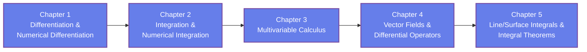

## Video Lecture

  <iframe
    width="560"
    height="315"
    src="https://www.youtube.com/embed/BEElvcgY5Uk"
    title="Calculus & Vector Analysis - Full Series"
    frameborder="0"
    allow="accelerometer; autoplay; clipboard-write; encrypted-media; gyroscope; picture-in-picture"
    allowfullscreen>
  </iframe>

> The whole series is available as a single video with chapter markers. Each chapter page starts this video at that chapter.

---

[AI Terakoya Top](<../../index.html>)›[Fundamentals of Mathematics](<../index.html>)›[Calculus Vector Analysis](<../../FM/calculus-vector-analysis/index.html>)

🌐 EN | [🇯🇵 JP](<../../../jp/FM/calculus-vector-analysis/index.html>) | Last sync: 2025-11-16

[← Fundamentals of Mathematics Top](<../index.html>)

## 🎯 Series Overview

Calculus and vector analysis are the essential mathematical foundations for all areas of materials science, process engineering, and machine learning. This series covers single-variable and multivariable differential and integral calculus, vector fields, gradients, divergence, curl, line integrals, and surface integrals, with paired theory and implementation (Python/NumPy/SymPy). 

### Learning Path

### 📋 Learning Objectives

  * Understand and implement differentiation and integration of single and multivariable functions
  * Understand the concepts and physical meaning of vector fields
  * Calculate and interpret gradients, divergence, and curl
  * Calculate and apply line integrals and surface integrals
  * Implement numerical and symbolic calculus using NumPy/SymPy

### 📖 Prerequisites

High school level single-variable differentiation and integration, plus basic vectors, are sufficient. Understanding basic Python usage (variables, functions, lists) is recommended.

Chapter 1

Fundamentals of Differentiation and Numerical Differentiation

Learn from the definition of differentiation to calculation rules for derivatives and higher-order derivatives, and implement numerical differentiation using NumPy (forward difference, central difference, Richardson extrapolation). Applications to temperature dependence of material properties and reaction rate analysis are also introduced. 

Definition of Differentiation Derivatives Numerical Differentiation Higher-Order Derivatives NumPy Implementation

💻 7 Code Examples ⏱️ 18-22 minutes

[Read Chapter 1 →](<chapter-1.html>)

Chapter 2

Fundamentals of Integration and Numerical Integration

Learn the definition of definite integrals, calculation of indefinite integrals, and the relationship between integration and differentiation (fundamental theorem of calculus), and implement numerical integration methods such as the trapezoidal rule and Simpson's rule, together with SciPy's adaptive quadrature. Applications to heat calculation and improper/singular integrals are also covered. 

Definite & Indefinite Integrals Fundamental Theorem Trapezoidal Rule Simpson's Rule SciPy Implementation

💻 7 Code Examples ⏱️ 18-22 minutes

[Read Chapter 2 →](<chapter-2.html>)

Chapter 3

Multivariable Calculus

Learn partial derivatives, the total differential and the chain rule, and the gradient, and handle extremum problems of multivariable functions (gradient descent, Lagrange multipliers). Double integrals and the change of variables to polar coordinates are also implemented. 

Partial Derivatives Total Differential Chain Rule Gradient Double Integrals Extremum Problems

💻 7 Code Examples ⏱️ 18-22 minutes

[Read Chapter 3 →](<chapter-3.html>)

Chapter 4

Vector Fields and Differential Operators

Learn the concept of vector fields, definitions and physical meanings of gradient (grad), divergence (div), and curl (rot). Implementation of Laplacian, vector field visualization, and determination of conservative fields and potential functions. 

Vector Fields Gradient (grad) Divergence (div) Curl (rot) Laplacian

💻 7 Code Examples ⏱️ 18-22 minutes

[Read Chapter 4 →](<chapter-4.html>)

Chapter 5

Line Integrals, Surface Integrals, and Integral Theorems

Learn calculation methods for line integrals (scalar and vector fields) and surface integrals (scalar and vector fields). Understand Green's theorem, Gauss's divergence theorem, and Stokes' theorem, and implement an application to atomic diffusion via the continuity equation. 

Line Integrals Surface Integrals Green's Theorem Divergence Theorem Stokes' Theorem

💻 7 Code Examples ⏱️ 18-22 minutes

[Read Chapter 5 →](<chapter-5.html>)

## 📚 Recommended Learning Paths

### Pattern 1: Beginner - Theory and Practice Balanced (5-7 days)

  * Day 1: Chapter 1 (Fundamentals)
  * Day 2: Chapter 2 (Core Concepts)
  * Day 3: Chapter 3 (Advanced Theory)
  * Day 4: Chapter 4 (Applications)
  * Day 5: Chapter 5 (Python Practice) + Review

### Pattern 2: Intermediate - Fast Track (3 days)

  * Day 1: Chapters 1-2 (Fundamentals and Core Concepts)
  * Day 2: Chapters 3-4 (Advanced Theory and Applications)
  * Day 3: Chapter 5 (Practice) + All Exercises

### Pattern 3: Topic-Focused - Computational Skills (1 day)

  * Focus: Code examples from all chapters
  * Execute all Python implementations
  * Modify parameters and analyze results
  * Light theory review as needed

## 🎯 Overall Learning Outcomes

Upon completing this series, you will achieve:

### Knowledge Level

  * ✅ Understand fundamental theoretical concepts and mathematical formulations
  * ✅ Explain relationships between key equations and physical phenomena
  * ✅ Interpret results in context of real-world applications
  * ✅ Connect concepts across chapters systematically

### Practical Skills

  * ✅ Implement algorithms from scratch using Python
  * ✅ Utilize NumPy, SciPy, and Matplotlib effectively
  * ✅ Visualize complex data and results
  * ✅ Debug and optimize numerical code

### Application Ability

  * ✅ Apply theoretical concepts to practical problems
  * ✅ Design computational experiments
  * ✅ Analyze and interpret simulation results
  * ✅ Extend learned methods to new domains

## 🛠️ Technologies and Tools Used

### Main Libraries

  * **numpy**
  * **scipy**
  * **matplotlib**
  * **sympy**

### Development Environment

  * **Python** : 3.8 or higher
  * **Jupyter Notebook** : Interactive development and visualization
  * **IDE** : VSCode, PyCharm, or similar

### Recommended Tools

  * Google Colab (cloud-based, no setup required)
  * Anaconda Distribution (complete environment)
  * Git (version control for exercises)

## 🚀 Next Steps

### Deep Dive Learning

For more advanced study in this field:

  * Real Analysis
  * Differential Geometry
  * Tensor Calculus

### Related Series

Expand your knowledge with related topics:

  * Linear Algebra and Tensor Analysis
  * Complex Functions and Special Functions

### Practical Projects

Apply your skills to hands-on projects:

  * 3D vector field visualization
  * Numerical PDE solver
  * Gradient descent optimizer

### ⚠️ Disclaimer

  * This content is provided for educational and informational purposes only and does not constitute professional advice.
  * All content and code examples are provided "AS IS" without warranty of any kind, either express or implied, including but not limited to warranties of accuracy, reliability, completeness, or fitness for a particular purpose.
  * The use of external links, data, tools, and libraries is at your own discretion and risk. The authors and contributors are not responsible for their availability, functionality, or suitability.
  * In no event shall the content creator or contributors be liable for any direct, indirect, incidental, special, exemplary, or consequential damages arising from the use of this content, to the maximum extent permitted by law.
  * Accuracy of information is not guaranteed. Content may contain errors or become outdated.
  * Content is licensed under Creative Commons BY 4.0 unless otherwise specified. Please refer to the license for usage terms.
