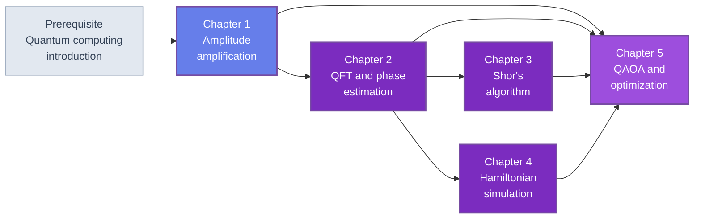

🌐 EN | [🇯🇵 JP](<../../../jp/FM/quantum-algorithms-intermediate/index.html>) | Last sync: 2026-08-13

[AI Terakoya Top](<../../index.html>)›[Fundamental Mathematics Dojo](<../index.html>)›[Intermediate Quantum Algorithms](<index.html>)

[← Back to Fundamental Mathematics Dojo](<../index.html>)

## 🎯 Series Overview

This series is the sequel to [Introduction to Quantum Computing](<../quantum-computing-introduction/index.html>). That course took the shortest honest path from a single qubit to a variational calculation of a molecular ground state, and it was explicit about what it was leaving out: Grover's algorithm, the quantum Fourier transform, phase estimation, Shor's algorithm, the modern Hamiltonian-simulation methods, and QAOA all appeared as names in a table of contents that was never written. This course writes it.

The organizing question is in the subtitle. Quantum algorithms are usually presented as a list of speedups, and the list is misleading, because the speedups are not the same kind of object. Grover's quadratic speedup is provable and optimal, and it is also small enough that constant factors, clock rates and error-correction overhead can eat it entirely. Shor's speedup is superpolynomial, and it applies to one problem with a very particular algebraic structure. Phase estimation with qubitization gives a provable advantage on a problem — the eigenvalues of a many-body Hamiltonian — that a materials researcher actually has. QAOA gives no proven advantage at all. Presenting these as five entries in the same list is the central dishonesty of the popular account, and this course does not commit it: **every speedup in these five chapters is stated together with the assumptions it needs, and the assumptions are checked.**

The second commitment is that **everything runs**. The introductory course built a state-vector simulator out of ninety-nine lines of NumPy; every algorithm here is implemented on that same simulator, from Grover on ten qubits to the end-to-end factorization of 15 and 21. There is no SDK, no hardware backend, and no result you cannot reproduce and take apart. Where an algorithm is too large to run — a resource estimate for an industrially relevant Hamiltonian — the estimate is computed from the formulas rather than quoted.

### Learning Path

Chapter 1 is self-contained and can be read first or last; it is placed first because the oracle model and the honest accounting it introduces are used in every later chapter. Chapter 2 is the load-bearing one: Chapter 3 cannot be read without its phase-estimation implementation, and Chapter 4's block encodings are built on the same controlled-unitary machinery. Chapter 5 assumes all four, because its closing section is a map of the whole subject.

### 📋 Learning Objectives

On finishing this series you will be able to:

  * State the oracle (query) model precisely, and say for any claimed oracle-based speedup what the oracle would have to be built out of and what that costs
  * Derive Grover's algorithm as a rotation in a two-dimensional subspace, compute the optimal iteration count, and generalize it to amplitude amplification around an arbitrary state preparation
  * Build the quantum Fourier transform from $O(n^2)$ gates, explain why its output amplitudes cannot be read out, and implement both textbook and iterative phase estimation
  * Implement Shor's algorithm end to end — order finding, the continued-fraction post-processing, and the classical reduction — and explain why modular exponentiation, not the Fourier transform, is what makes it expensive
  * Explain Trotterization, block encoding, qubitization and qDRIFT, and state the query complexity each one achieves
  * Formulate a combinatorial optimization problem as an Ising model, run QAOA on it, and compare the result against classical heuristics at equal budget
  * Say, for any quantum algorithm you meet, which of the three kinds of speedup it claims, what the base of the comparison is, and which assumption is doing the work

### 📖 Prerequisites

**Required.** [Introduction to Quantum Computing](<../quantum-computing-introduction/index.html>), or equivalent fluency with: state vectors and unitary gates, the big-endian qubit convention, the ninety-nine-line state-vector simulator of that course's Chapter 2, and the variational eigensolver of its Chapter 3. This course re-lists the simulator functions each chapter needs, but it does not re-derive them.

**Required.** Linear algebra — eigenvalues and eigenvectors, tensor products, unitary and Hermitian matrices — and enough elementary number theory to be comfortable with modular arithmetic. Chapter 3 develops the number theory it needs from scratch, including continued fractions.

**Required.** Python 3.8 or later with NumPy, SciPy and Matplotlib. There is no quantum SDK and no hardware backend anywhere in this series.

**Recommended.** [Introduction to Quantum Hardware](<../quantum-hardware-introduction/index.html>), for the physical meaning of the gate times and error rates that Chapters 1 and 4 use in their resource estimates. [Introduction to Quantum Machine Learning](<../../MI/quantum-machine-learning-introduction/index.html>), for the same evaluation discipline applied to a different subfield.

* * *

## 📚 Chapters

### Chapter 1: Amplitude Amplification and Grover's Algorithm

The oracle model stated honestly: what a phase oracle is, what it is not, and what happens to the accounting when you write one out as a circuit and count the gates. Grover's algorithm derived as a product of two reflections, which is a rotation by $2\theta$ in the two-dimensional plane spanned by the marked and unmarked states, with the exact optimal iteration count $\lfloor \pi/(4\arcsin\sqrt{M/N}) \rfloor$ and the over-rotation that follows from running longer. The general form — amplitude amplification around any state preparation $A$ — which is the version that appears as a subroutine everywhere else. Closes with the honest assessment: four separate ways in which constant factors, clock rates, imperfect parallelism and error-correction overhead consume a quadratic speedup, why unstructured search is not database search, and what the QRAM problem does to the latter.

**Key topics** : phase oracle · query model · oracle as a circuit · two reflections · optimal iteration count · over-rotation · amplitude amplification · exact amplification · quadratic speedup accounting · QRAM · unknown number of solutions

💻 7 Code Examples ⏱️ 45-50 minutes 📊 Intermediate

[Read Chapter 1 →](<chapter-1.html>)

### Chapter 2: QFT and Phase Estimation

The QFT as a circuit of $O(n^2)$ gates, and the crucial difference from the classical FFT: the transform is applied to amplitudes that cannot be read out, so the QFT is never a data-processing routine but always a step that converts a period into a measurable bit string. Phase estimation built on top of it — controlled unitaries, the inverse transform, and the exact relation between the number of ancilla bits and the achievable precision and success probability. The iterative single-ancilla variant, which is the form that a near-term device could actually run. Closes on what phase estimation is for: it is the eigenvalue algorithm, and the eigenvalue problem a materials researcher cares about is electronic structure — the fault-tolerant successor to the variational methods of the introductory course.

**Key topics** : QFT circuit · controlled phase rotations · $O(n^2)$ gate count · unreadable amplitudes · phase estimation · precision and ancilla count · iterative QPE · eigenvalue estimation for electronic structure

💻 7 Code Examples ⏱️ 45-50 minutes 📊 Intermediate

[Read Chapter 2 →](<chapter-2.html>)

### Chapter 3: Shor's Algorithm

The classical reduction first: factoring reduces to order finding, and the reduction is elementary number theory that runs on a laptop. The quantum part is then one application of phase estimation to modular multiplication, and the honest observation that the modular exponentiation circuit — not the Fourier transform — is where essentially all of the cost lives. A complete implementation follows: factoring 15 and 21 end to end on the simulator, with the measured probability distribution, the continued-fraction post-processing that turns a measured fraction into a period, and the failure modes that make the algorithm probabilistic. Closes with what this means for cryptography, argued from resource-count scaling rather than from dates, and why the migration to lattice-based schemes is a rational response to a superpolynomial speedup even though no machine can run it yet.

**Key topics** : factoring to order finding · modular exponentiation cost · continued fractions · end-to-end factorization of 15 and 21 · failure modes and repetition · resource scaling · post-quantum cryptography

💻 7 Code Examples ⏱️ 45-50 minutes 📊 Intermediate

[Read Chapter 3 →](<chapter-3.html>)

### Chapter 4: Modern Hamiltonian Simulation

Trotterization revisited from the introductory course, with its error scaling made explicit and its limitations made quantitative. Then the methods that replaced it: linear combinations of unitaries, block encoding, and qubitization, developed to the level of explicit matrices and circuits rather than left as citations, with the optimal query complexity they achieve. Randomized compilation via qDRIFT, and when a random ordering beats a systematic one. Closes with the arithmetic of resource estimation as it is actually practised — counts of T gates and logical qubits — and with why electronic structure of materials and molecules, and not optimization or machine learning, is the application where a fault-tolerant machine has a defensible advantage.

**Key topics** : Trotter error scaling · linear combination of unitaries · block encoding · qubitization and the quantum walk · optimal query complexity · qDRIFT · T counts and logical qubit counts · electronic structure as the target application

💻 7 Code Examples ⏱️ 45-50 minutes 📊 Advanced

[Read Chapter 4 →](<chapter-4.html>)

### Chapter 5: QAOA and Optimization

Combinatorial optimization written as an Ising model: MaxCut, spin glasses, and the reason this formulation is familiar to anyone who has looked at a magnetic material. The structure of QAOA — alternating cost and mixer layers, and the adiabatic limit it approaches as the depth grows. A complete implementation on small graphs at depths one to three, with the parameter landscape drawn out. Then the evaluation, conducted with the same discipline the quantum machine learning course applies to its own subject: QAOA against greedy, against simulated annealing, and against the Goemans-Williamson relaxation at equal budget, with the conclusion stated plainly. The chapter closes the series with a map of where provable speedups actually live — Grover-type, Shor-type, and phase-estimation-type — and the preconditions each one carries.

**Key topics** : Ising formulation · MaxCut · cost and mixer layers · adiabatic limit · parameter landscape · classical baselines at equal budget · approximation ratios · the map of provable speedups

💻 8 Code Examples ⏱️ 45-50 minutes 📊 Advanced

[Read Chapter 5 →](<chapter-5.html>)

* * *

## 🔤 Notation and Conventions

Everything is inherited from [Introduction to Quantum Computing](<../quantum-computing-introduction/index.html>) and never changed, so that code from any chapter of either course can be combined with any other.

| Symbol | Meaning |
| --- | --- |
| $\lvert q_0 q_1 \cdots q_{n-1}\rangle$ | big-endian: qubit 0 is leftmost and most significant. The opposite of Qiskit's convention |
| $N = 2^n$ | size of the search space or of the register |
| $M$ | number of marked strings; $\theta = \arcsin\sqrt{M/N}$ |
| $O$, $D$ | phase oracle and diffusion operator; $G = DO$ is one Grover iteration |
| $A$ | a state preparation unitary; amplitude amplification uses $Q = (2A\lvert 0\rangle\langle 0\rvert A^{\dagger} - I)\,O$ |
| $\mathrm{QFT}_n$ | quantum Fourier transform on $n$ qubits (Chapter 2) |
| $\varphi$ | a phase to be estimated, $U\lvert u\rangle = e^{2\pi i \varphi}\lvert u\rangle$ (Chapters 2-4) |
| $r$ | multiplicative order of $a$ modulo $N$ (Chapter 3) |
| $\lVert H \rVert_1$ | sum of the absolute values of Hamiltonian coefficients, the natural cost parameter (Chapter 4) |
| $p$ | QAOA depth (Chapter 5) |
| $X, Y, Z, H$, CNOT | gate symbols, identical to the introductory course |

**Query counts versus gate counts.** Complexity in this course is quoted in *queries* when the statement is about the oracle model, and in *gates* when the statement is about a machine. The two differ by whatever the oracle costs, and Chapter 1 makes a point of the difference because most confusion about quantum speedups lives exactly there.

**Reduced units.** Where a Hamiltonian appears, $\hbar = 1$.

* * *

## 🔍 What This Series Is and Is Not

**It is not an algorithm zoo.** Six algorithms in five chapters, each developed far enough to run and to be taken apart. A catalogue of forty algorithm names with one paragraph each would be shorter to write and useless to read; the useful skill is being able to see, in an algorithm you have never met, which of a small number of mechanisms it is using.

**It is not speed bragging.** Every speedup is stated with its assumptions. That means saying that Grover's quadratic advantage is real and provably optimal, *and* that it is small enough to be destroyed by constant factors — both halves, because omitting either one is a distortion. It also means saying that QAOA currently has no proven advantage over classical heuristics, and that phase estimation for electronic structure does.

**It is not a hardware course.** Gate times, error rates and error-correction overheads appear only as parameters in resource estimates, and always as sweeps over decades rather than as specifications. For where those parameters come from, read [Introduction to Quantum Hardware](<../quantum-hardware-introduction/index.html>).

**It is not a cryptography course.** Chapter 3 covers what Shor's algorithm implies for RSA and why post-quantum cryptography exists, from the scaling of resource counts. It does not cover the schemes themselves.

**It is not framework documentation.** As in the introductory course, everything is NumPy. You will finish knowing what a quantum SDK computes, which is the only durable way to use one.

## 📚 Recommended Learning Paths

### Pattern 1: Complete path (6-7 days)

  * Day 1: Chapter 1, Sections 1.1-1.4 — the oracle model and the honest accounting
  * Day 2: Chapter 1, Section 1.5 — run the Grover implementation, reproduce the success-probability curves yourself
  * Day 3: Chapter 2 — QFT and phase estimation, both variants
  * Day 4: Chapter 3 — Shor's algorithm, factoring 15 and 21 end to end
  * Day 5: Chapter 4, Sections 4.1-4.3 — Trotter, block encoding, qubitization
  * Day 6: Chapter 4, Sections 4.4-4.5 and Chapter 5, Sections 5.1-5.3 — resource estimation, then QAOA
  * Day 7: Chapter 5, Sections 5.4-5.5 and the exercises — the classical baselines, and the map of speedups

### Pattern 2: The fault-tolerant electronic-structure path (2 days)

  * Chapter 2 in full — phase estimation is the algorithm
  * Chapter 4 in full — block encoding, qubitization, and the resource arithmetic
  * Section 5.5 — where this sits relative to everything else

### Pattern 3: The sceptic's path (half a day)

  * Section 1.4 — what a quadratic speedup is actually worth
  * Section 3.4 — a superpolynomial speedup, and what it does and does not imply
  * Sections 5.4 and 5.5 — the equal-budget comparison, and the map

## 🎯 Overall Learning Outcomes

### Knowledge Level

  * ✅ State the oracle model and identify the assumption it hides in any given application
  * ✅ Explain Grover, QFT, phase estimation, Shor, qubitization and QAOA in terms of the mechanism each one uses
  * ✅ Distinguish the three kinds of quantum speedup and name the preconditions of each
  * ✅ Explain why the amplitudes of a quantum Fourier transform cannot be read out, and what that rules out

### Practical Skills

  * ✅ Implement Grover and general amplitude amplification, and verify the optimal iteration count numerically
  * ✅ Implement the QFT, textbook phase estimation and iterative phase estimation, and measure their precision
  * ✅ Factor a composite number end to end on a state-vector simulator, including the classical post-processing
  * ✅ Construct and verify a block encoding of a small Hamiltonian, and compare Trotter against qDRIFT error
  * ✅ Run QAOA against classical heuristics at equal budget and report the comparison honestly

### Application Ability

  * ✅ Read a quantum-algorithms paper and locate its speedup claim, its base of comparison, and its load-bearing assumption
  * ✅ Produce an order-of-magnitude resource estimate for a quantum algorithm from its query complexity
  * ✅ Decide, for a computational problem in your own work, whether any of these mechanisms could apply

## 🛠️ Technologies and Tools Used

### Main Libraries

  * **numpy** — the state-vector simulator, and every algorithm built on it
  * **scipy** — classical optimizers for QAOA, eigenvalue problems, and the classical baselines
  * **matplotlib** — success-probability curves, measured distributions, parameter landscapes

### Development Environment

  * **Python** : 3.8 or higher
  * **Jupyter Notebook** : recommended; the chapters are written as sessions in which later examples reuse earlier definitions
  * Google Colab runs every example; nothing needs a GPU or a quantum backend

## 🚀 Next Steps

### Deep Dive Learning

  * Quantum signal processing and the quantum singular value transformation, which unify the Chapter 4 methods
  * Fault-tolerant compilation: magic-state distillation, and where T counts come from
  * Quantum linear-systems algorithms, and the input/output assumptions that decide whether they help
  * Lower bounds: the adversary method, and why $\Omega(\sqrt{N})$ for unstructured search cannot be beaten

### Related Series

  * [Introduction to Quantum Computing](<../quantum-computing-introduction/index.html>) — the prerequisite, and the source of the simulator
  * [Introduction to Quantum Hardware](<../quantum-hardware-introduction/index.html>) — where gate times and error rates come from
  * [Introduction to Quantum Machine Learning](<../../MI/quantum-machine-learning-introduction/index.html>) — the same evaluation discipline, applied to learning
  * [Introduction to Quantum Sensing](<../../MS/quantum-sensing-introduction/index.html>) — quantum systems as instruments rather than computers
  * [Introduction to Quantum Mechanics](<../quantum-mechanics/index.html>) — the physics underneath all of it

### Practical Projects

  * Extend the Chapter 1 code to Grover with a noisy oracle, and measure how the optimal iteration count moves
  * Implement quantum counting with the Chapter 2 phase estimation, and use it to remove the guesswork from Chapter 1
  * Factor 33 or 35 on the simulator, and count the qubits and gates the modular exponentiation actually took
  * Build a block encoding of a four-site Hubbard Hamiltonian and estimate the T count of a phase-estimation run
  * Take a real optimization problem from your own work, cast it as an Ising model, and run the Chapter 5 comparison

### ⚠️ Disclaimer

  * This content is provided solely for educational, research, and informational purposes and does not constitute professional advice (legal, accounting, technical warranty, etc.).
  * This content and accompanying code examples are provided "AS IS" without any warranty, express or implied, including but not limited to merchantability, fitness for a particular purpose, non-infringement, accuracy, completeness, operation, or safety.
  * The author and Tohoku University assume no responsibility for the content, availability, or safety of external links, third-party data, tools, libraries, etc.
  * To the maximum extent permitted by applicable law, the author and Tohoku University shall not be liable for any direct, indirect, incidental, special, consequential, or punitive damages arising from the use, execution, or interpretation of this content.
  * The content may be changed, updated, or discontinued without notice.
  * The copyright and license of this content are subject to the stated conditions (e.g., CC BY 4.0). Such licenses typically include no-warranty clauses.
