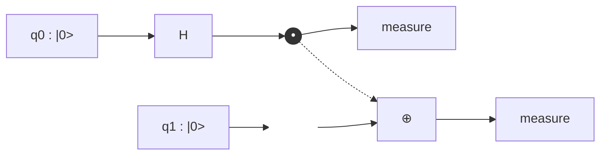

🌐 EN | [🇯🇵 JP](<../../../jp/FM/quantum-computing-introduction/chapter-2.html>) | Last sync: 2026-08-12

[Fundamental Mathematics Dojo](<../index.html>) > [Introduction to Quantum Computing](<index.html>) > Chapter 2

Chapter 1 gave us states: vectors in a \\(2^n\\)-dimensional space, their probabilities, and their measurement statistics. A state that never changes computes nothing. This chapter supplies the verbs — the **gates** that move a state around its Hilbert space — and shows that a handful of them suffices to reach anywhere. Along the way we finish the mini-simulator: after Section 2.3 you will own a piece of code, 99 lines long, that applies an arbitrary unitary to arbitrary qubits of an arbitrary register, and every subsequent chapter of this series runs on it unchanged.

The material here is deliberately compressed. Gate identities are the vocabulary of quantum computing, not its content; our real destination is Chapter 3, where the same simulator computes a molecular ground-state energy. But two ideas in this chapter are not vocabulary at all. The first is that **entanglement is a resource with a number attached to it** — the same entanglement entropy that decides whether a quantum material can be simulated classically by tensor-network methods. The second is that **a continuous space of operations is reachable from a discrete gate set**, which is the reason a digital quantum computer can be built at all.

## Learning Objectives

After completing this chapter, you will be able to:

  * Explain why quantum gates must be unitary, and derive the gate matrix \\(U = \exp(-iHt/\hbar)\\) from the Schrödinger equation
  * Write down and apply the standard single-qubit gates X, Y, Z, H, S, T and the rotations \\(R_x(\theta)\\), \\(R_y(\theta)\\), \\(R_z(\theta)\\), and interpret each as a rotation of the Bloch sphere
  * Construct CNOT, CZ, SWAP and general controlled-\\(U\\) gates, and convert between them with single-qubit conjugations
  * Implement `apply_gate` with the tensor-reshape technique, so that a \\(k\\)-qubit gate acts on any \\(k\\) qubits of an \\(n\\)-qubit register without ever building a \\(2^n \times 2^n\\) matrix
  * Prepare the four Bell states and the GHZ state, and quantify their entanglement with the reduced density matrix and the von Neumann entropy
  * Show numerically that the CHSH combination reaches \\(2\sqrt{2}\\) for a Bell state, exceeding any classical bound
  * Decompose an arbitrary single-qubit unitary into three rotations, and explain in what sense \\(\lbrace H, T \rbrace\\) is universal while \\(\lbrace H, S \rbrace\\) is not
  * Compile a Pauli exponential \\(\exp(-i\theta P)\\) into CNOTs and one \\(R_z\\) — the single compilation trick on which every variational algorithm in Chapter 3 depends

* * *

## 2.1 Unitary Evolution: Where Gates Come From

### From the Schrödinger equation to a matrix

A quantum computer is not a new kind of physics. It is the ordinary time evolution of a controlled quantum system, sliced into pieces that we choose to call gates. Start from the time-dependent Schrödinger equation for a state \\(\lvert \psi(t) \rangle\\) under a Hamiltonian \\(H\\):

\\[ i\hbar \frac{d}{dt} \lvert \psi(t) \rangle = H \lvert \psi(t) \rangle \\]

If \\(H\\) is time independent over the interval \\([0, t]\\), the solution is a matrix exponential:

\\[ \lvert \psi(t) \rangle = U(t) \lvert \psi(0) \rangle, \qquad U(t) = \exp\left(-\frac{i H t}{\hbar}\right) \\]

That matrix \\(U\\) is a quantum gate. In the laboratory, "applying an X gate" means driving a superconducting qubit with a microwave pulse whose amplitude and duration are calibrated so that \\(\exp(-iHt/\hbar)\\) equals the X matrix to within a fraction of a percent. In our simulator, it means multiplying by a \\(2 \times 2\\) array. The two descriptions are the same statement at different levels of abstraction, and it is worth keeping the physical one in mind: gate errors in Chapter 5 are nothing more exotic than a miscalibrated \\(Ht\\).

### Why gates must be unitary

Because \\(H\\) is Hermitian (\\(H^\dagger = H\\)), the exponential is **unitary**:

\\[ U^\dagger U = \exp\left(+\frac{i H^\dagger t}{\hbar}\right)\exp\left(-\frac{i H t}{\hbar}\right) = I \\]

Unitarity has two consequences that shape everything that follows.

**Probability is conserved.** If \\(\lvert \psi \rangle\\) is normalised then so is \\(U \lvert \psi \rangle\\), because \\(\langle \psi \rvert U^\dagger U \lvert \psi \rangle = \langle \psi \rvert \psi \rangle = 1\\). There is no way to write a gate that "loses" amplitude; loss and decoherence are not gates but couplings to a larger system, which is exactly how Chapter 5 will model them.

**Every gate is reversible.** \\(U^{-1} = U^\dagger\\) always exists, so any quantum circuit can be run backwards by applying the adjoints of its gates in reverse order. This is a sharp break from classical logic, where the two-input AND gate destroys information: knowing the output is 0 does not tell you the input. A reversible computer cannot have an AND gate with one output bit, which is why the quantum analogue of AND is the three-qubit Toffoli gate that keeps its inputs (Section 2.5).

Property | Classical logic | Quantum gates
---|---|---
Reversibility | AND, OR, NAND are irreversible | Every gate is invertible, \\(U^{-1} = U^\dagger\\)
Fan-out | A wire can be copied freely | Forbidden by the no-cloning theorem
State space | \\(2^n\\) discrete strings | Continuum of superpositions in \\(\mathbb{C}^{2^n}\\)
Universal set | \\(\lbrace\\) NAND \\(\rbrace\\) alone | \\(\lbrace H, T, \mathrm{CNOT} \rbrace\\), and only approximately
Error model | Bit flips, discrete | Continuous drift of amplitude and phase
Composition | Boolean function tables | Matrix products

### Global phase is not physical

Two states that differ by an overall factor \\(e^{i\alpha}\\) give identical predictions for every measurement, because that factor cancels in \\(\lvert \langle x \rvert \psi \rangle \rvert^2\\) and in every expectation value \\(\langle \psi \rvert A \lvert \psi \rangle\\). So the state space is really the projective space, and gates that differ by a global phase are physically the same gate. We will meet this constantly: \\(R_z(\pi) = -iZ\\), and \\(R_x(\pi) = -iX\\). The minus signs are invisible.

**Relative phase, by contrast, is everything.** In \\(\alpha \lvert 0 \rangle + \beta \lvert 1 \rangle\\) the phase of \\(\beta\\) relative to \\(\alpha\\) determines the outcome of any measurement that is not in the computational basis. A gate that does nothing but adjust relative phases — the \\(S\\) and \\(T\\) gates below — is the workhorse of quantum algorithms, because interference is the only mechanism by which a quantum computer beats a classical one.

### Gate composition and circuit depth

A circuit is a product of unitaries. If gates \\(U_1, U_2, \ldots, U_L\\) are applied in that order, the total operation is

\\[ U_{\text{total}} = U_L \cdots U_2 U_1 \\]

note the reversal: the first gate applied stands rightmost, because it acts on the state first. Two quantities describe the circuit's cost:

  * **Gate count**: how many elementary operations. Determines the accumulated error on hardware.
  * **Circuit depth**: how many layers, where gates acting on disjoint qubits share a layer. Determines the wall-clock duration, hence how much of the coherence time \\(T_2\\) is consumed.

We will compute both for the GHZ state in Section 2.6, where the same state is reachable with depth \\(n\\) or depth \\(\lceil \log_2 n \rceil\\).

* * *

## 2.2 Single-Qubit Gates

### The Pauli gates

The three Pauli matrices are simultaneously the generators of rotation, the observables of a qubit, and gates in their own right:

\\[ X = \begin{pmatrix} 0 & 1 \\\\ 1 & 0 \end{pmatrix}, \qquad Y = \begin{pmatrix} 0 & -i \\\\ i & 0 \end{pmatrix}, \qquad Z = \begin{pmatrix} 1 & 0 \\\\ 0 & -1 \end{pmatrix} \\]

Their action on the basis states is worth memorising:

  * \\(X \lvert 0 \rangle = \lvert 1 \rangle\\), \\(X \lvert 1 \rangle = \lvert 0 \rangle\\) — the **bit flip**, the quantum NOT gate.
  * \\(Z \lvert 0 \rangle = \lvert 0 \rangle\\), \\(Z \lvert 1 \rangle = -\lvert 1 \rangle\\) — the **phase flip**, invisible in the computational basis but not in any other.
  * \\(Y = iXZ\\) — both at once, up to a phase.

Each squares to the identity, \\(X^2 = Y^2 = Z^2 = I\\), so each is its own inverse. They anticommute pairwise, \\(XY = -YX = iZ\\) and cyclically, which is the algebraic fact behind the uncertainty relation between spin components.

### The Hadamard gate

\\[ H = \frac{1}{\sqrt{2}}\begin{pmatrix} 1 & 1 \\\\ 1 & -1 \end{pmatrix} \\]

The Hadamard gate creates superposition from a basis state:

\\[ H \lvert 0 \rangle = \frac{\lvert 0 \rangle + \lvert 1 \rangle}{\sqrt{2}} \equiv \lvert + \rangle, \qquad H \lvert 1 \rangle = \frac{\lvert 0 \rangle - \lvert 1 \rangle}{\sqrt{2}} \equiv \lvert - \rangle \\]

and it is its own inverse, \\(H^2 = I\\). Its deeper role is as a **basis change**: it maps the \\(Z\\) axis to the \\(X\\) axis,

\\[ H Z H = X, \qquad H X H = Z \\]

which is exactly how we will measure \\(\langle X \rangle\\) on hardware that can only measure \\(Z\\). Apply \\(H\\), then measure in the computational basis. Every "measure this Pauli operator" instruction reduces to a basis change plus a \\(Z\\) measurement, a point we return to in Chapter 3 where the energy of a molecule is assembled from three such settings.

### Phase gates: S and T

\\[ S = \begin{pmatrix} 1 & 0 \\\\ 0 & i \end{pmatrix}, \qquad T = \begin{pmatrix} 1 & 0 \\\\ 0 & e^{i\pi/4} \end{pmatrix} \\]

These are the quarter- and eighth-turn phase rotations, satisfying \\(S^2 = Z\\) and \\(T^2 = S\\). They do nothing to measurement probabilities in the computational basis and everything to interference afterwards. The \\(T\\) gate has a special status in fault-tolerant quantum computing: it is the cheap gate in simulation and the expensive gate on hardware. Gates built only from \\(\lbrace H, S, \mathrm{CNOT} \rbrace\\) — the **Clifford** gates — are efficiently simulable classically (the Gottesman-Knill theorem), so a circuit without \\(T\\) gates cannot be doing anything a laptop could not. The T-count of a circuit is the standard currency of quantum resource estimates, and Section 2.5 shows why.

### Rotation gates

For any Pauli operator \\(P\\) with \\(P^2 = I\\), the exponential closes into a simple form:

\\[ \exp(-i\theta P) = \cos(\theta)\, I - i \sin(\theta)\, P \\]

The conventional single-qubit rotations use a half-angle so that \\(\theta = 2\pi\\) is a full turn of the Bloch sphere:

\\[ R_x(\theta) = \exp\left(-\frac{i\theta X}{2}\right) = \begin{pmatrix} \cos\frac{\theta}{2} & -i\sin\frac{\theta}{2} \\\\ -i\sin\frac{\theta}{2} & \cos\frac{\theta}{2} \end{pmatrix} \\]

\\[ R_y(\theta) = \begin{pmatrix} \cos\frac{\theta}{2} & -\sin\frac{\theta}{2} \\\\ \sin\frac{\theta}{2} & \cos\frac{\theta}{2} \end{pmatrix}, \qquad R_z(\theta) = \begin{pmatrix} e^{-i\theta/2} & 0 \\\\ 0 & e^{i\theta/2} \end{pmatrix} \\]

\\(R_y\\) is real, which makes it the natural knob for a variational ansatz over real amplitudes; \\(R_z\\) is diagonal, which makes it free on some hardware platforms (implemented as a shift of the microwave reference phase rather than a physical pulse).

Gate | Matrix | Bloch action | Effect on \\(\lvert 0 \rangle\\)
---|---|---|---
\\(X\\) | \\(\begin{pmatrix} 0 & 1 \\\\ 1 & 0 \end{pmatrix}\\) | \\(\pi\\) about \\(x\\) | \\(\lvert 1 \rangle\\)
\\(Y\\) | \\(\begin{pmatrix} 0 & -i \\\\ i & 0 \end{pmatrix}\\) | \\(\pi\\) about \\(y\\) | \\(i\lvert 1 \rangle\\)
\\(Z\\) | \\(\begin{pmatrix} 1 & 0 \\\\ 0 & -1 \end{pmatrix}\\) | \\(\pi\\) about \\(z\\) | \\(\lvert 0 \rangle\\)
\\(H\\) | \\(\tfrac{1}{\sqrt{2}}\begin{pmatrix} 1 & 1 \\\\ 1 & -1 \end{pmatrix}\\) | \\(\pi\\) about \\((x+z)/\sqrt{2}\\) | \\(\lvert + \rangle\\)
\\(S\\) | \\(\begin{pmatrix} 1 & 0 \\\\ 0 & i \end{pmatrix}\\) | \\(\pi/2\\) about \\(z\\) | \\(\lvert 0 \rangle\\)
\\(T\\) | \\(\begin{pmatrix} 1 & 0 \\\\ 0 & e^{i\pi/4} \end{pmatrix}\\) | \\(\pi/4\\) about \\(z\\) | \\(\lvert 0 \rangle\\)
\\(R_x(\theta)\\) | \\(\cos\tfrac{\theta}{2} I - i \sin\tfrac{\theta}{2} X\\) | \\(\theta\\) about \\(x\\) | \\(\cos\tfrac{\theta}{2}\lvert 0 \rangle - i\sin\tfrac{\theta}{2}\lvert 1 \rangle\\)
\\(R_y(\theta)\\) | \\(\cos\tfrac{\theta}{2} I - i \sin\tfrac{\theta}{2} Y\\) | \\(\theta\\) about \\(y\\) | \\(\cos\tfrac{\theta}{2}\lvert 0 \rangle + \sin\tfrac{\theta}{2}\lvert 1 \rangle\\)
\\(R_z(\theta)\\) | \\(\cos\tfrac{\theta}{2} I - i \sin\tfrac{\theta}{2} Z\\) | \\(\theta\\) about \\(z\\) | \\(e^{-i\theta/2}\lvert 0 \rangle\\)

The first code example builds all of these and verifies the identities numerically. Read the output as a specification: every claim in the table above is checked to machine precision.

Code Example 1: The Single-Qubit Gate Zoo

```python
import numpy as np

I2 = np.eye(2, dtype=complex)
X = np.array([[0, 1], [1, 0]], dtype=complex)
Y = np.array([[0, -1j], [1j, 0]], dtype=complex)
Z = np.array([[1, 0], [0, -1]], dtype=complex)
H = np.array([[1, 1], [1, -1]], dtype=complex) / np.sqrt(2)
S = np.array([[1, 0], [0, 1j]], dtype=complex)
T = np.array([[1, 0], [0, np.exp(1j * np.pi / 4)]], dtype=complex)

def rx(theta):
    c, s = np.cos(theta / 2), np.sin(theta / 2)
    return np.array([[c, -1j * s], [-1j * s, c]], dtype=complex)

def ry(theta):
    c, s = np.cos(theta / 2), np.sin(theta / 2)
    return np.array([[c, -s], [s, c]], dtype=complex)

def rz(theta):
    e = np.exp(-1j * theta / 2)
    return np.array([[e, 0], [0, np.conj(e)]], dtype=complex)

GATES = {'I': I2, 'X': X, 'Y': Y, 'Z': Z, 'H': H, 'S': S, 'T': T}

print("Unitarity check  (max |U^dag U - I|)")
print("-" * 46)
for name, U in GATES.items():
    err = np.max(np.abs(U.conj().T @ U - I2))
    det = np.linalg.det(U)
    print(f"  {name}: error = {err:.2e},  det = {det.real:+.3f}{det.imag:+.3f}i")

print("\nAction on the computational basis")
print("-" * 46)
ket0, ket1 = np.array([1, 0], dtype=complex), np.array([0, 1], dtype=complex)
for name, U in GATES.items():
    a, b = U @ ket0, U @ ket1
    print(f"  {name}|0> = [{a[0]:+.3f} {a[1]:+.3f}]   {name}|1> = [{b[0]:+.3f} {b[1]:+.3f}]")

print("\nGate algebra")
print("-" * 46)
ident = [("H@H == I", H @ H, I2),
         ("S@S == Z", S @ S, Z),
         ("T@T == S", T @ T, S),
         ("H@Z@H == X", H @ Z @ H, X),
         ("H@X@H == Z", H @ X @ H, Z),
         ("X@Y == i Z", X @ Y, 1j * Z),
         ("Rx(pi) == -i X", rx(np.pi), -1j * X),
         ("Ry(pi) == -i Y", ry(np.pi), -1j * Y),
         ("Rz(pi/2) == e^{-i pi/4} S", rz(np.pi / 2), np.exp(-1j * np.pi / 4) * S)]
for label, A, B in ident:
    print(f"  {label:28s} {'OK' if np.allclose(A, B) else 'FAIL'}   (max diff {np.max(np.abs(A - B)):.1e})")

print("\nEigenvalues and rotation axes")
print("-" * 46)
for name in ['X', 'Y', 'Z', 'H']:
    w, v = np.linalg.eigh(GATES[name])
    print(f"  {name}: eigenvalues = {np.round(w.real, 3)}")

print("\nRotation gates: Ry(theta) applied to |0>")
print("-" * 46)
print(f"  {'theta/pi':>9} {'amp(0)':>9} {'amp(1)':>9} {'P(0)':>7} {'P(1)':>7} {'<Z>':>8}")
for f in [0.0, 0.25, 0.5, 2/3, 1.0, 1.5]:
    psi = ry(f * np.pi) @ ket0
    p = np.abs(psi) ** 2
    print(f"  {f:9.3f} {psi[0].real:9.4f} {psi[1].real:9.4f} {p[0]:7.4f} {p[1]:7.4f} {p[0]-p[1]:8.4f}")

theta = 0.9
print("\nGlobal vs relative phase")
print("-" * 46)
psi_a = rz(theta) @ (H @ ket0)
psi_b = np.exp(1j * 0.31) * psi_a
print(f"  probabilities equal?      {np.allclose(np.abs(psi_a)**2, np.abs(psi_b)**2)}")
print(f"  <X> for psi_a = {np.vdot(psi_a, X @ psi_a).real:+.4f},  for psi_b = {np.vdot(psi_b, X @ psi_b).real:+.4f}")
psi_c = H @ (rz(theta) @ ket0)
print(f"  Rz then H vs H then Rz identical? {np.allclose(psi_a, psi_c)}  -> gates do not commute")
```

```text
Unitarity check  (max |U^dag U - I|)
----------------------------------------------
  I: error = 0.00e+00,  det = +1.000+0.000i
  X: error = 0.00e+00,  det = -1.000+0.000i
  Y: error = 0.00e+00,  det = -1.000+0.000i
  Z: error = 0.00e+00,  det = -1.000+0.000i
  H: error = 2.22e-16,  det = -1.000+0.000i
  S: error = 0.00e+00,  det = +0.000+1.000i
  T: error = 0.00e+00,  det = +0.707+0.707i

Action on the computational basis
----------------------------------------------
  I|0> = [+1.000+0.000j +0.000+0.000j]   I|1> = [+0.000+0.000j +1.000+0.000j]
  X|0> = [+0.000+0.000j +1.000+0.000j]   X|1> = [+1.000+0.000j +0.000+0.000j]
  Y|0> = [+0.000+0.000j +0.000+1.000j]   Y|1> = [+0.000-1.000j +0.000+0.000j]
  Z|0> = [+1.000+0.000j +0.000+0.000j]   Z|1> = [+0.000+0.000j -1.000+0.000j]
  H|0> = [+0.707+0.000j +0.707+0.000j]   H|1> = [+0.707+0.000j -0.707+0.000j]
  S|0> = [+1.000+0.000j +0.000+0.000j]   S|1> = [+0.000+0.000j +0.000+1.000j]
  T|0> = [+1.000+0.000j +0.000+0.000j]   T|1> = [+0.000+0.000j +0.707+0.707j]

Gate algebra
----------------------------------------------
  H@H == I                     OK   (max diff 2.2e-16)
  S@S == Z                     OK   (max diff 0.0e+00)
  T@T == S                     OK   (max diff 2.2e-16)
  H@Z@H == X                   OK   (max diff 2.2e-16)
  H@X@H == Z                   OK   (max diff 2.2e-16)
  X@Y == i Z                   OK   (max diff 0.0e+00)
  Rx(pi) == -i X               OK   (max diff 6.1e-17)
  Ry(pi) == -i Y               OK   (max diff 6.1e-17)
  Rz(pi/2) == e^{-i pi/4} S    OK   (max diff 1.6e-16)

Eigenvalues and rotation axes
----------------------------------------------
  X: eigenvalues = [-1.  1.]
  Y: eigenvalues = [-1.  1.]
  Z: eigenvalues = [-1.  1.]
  H: eigenvalues = [-1.  1.]

Rotation gates: Ry(theta) applied to |0>
----------------------------------------------
   theta/pi    amp(0)    amp(1)    P(0)    P(1)      <Z>
      0.000    1.0000    0.0000  1.0000  0.0000   1.0000
      0.250    0.9239    0.3827  0.8536  0.1464   0.7071
      0.500    0.7071    0.7071  0.5000  0.5000   0.0000
      0.667    0.5000    0.8660  0.2500  0.7500  -0.5000
      1.000    0.0000    1.0000  0.0000  1.0000  -1.0000
      1.500   -0.7071    0.7071  0.5000  0.5000  -0.0000

Global vs relative phase
----------------------------------------------
  probabilities equal?      True
  <X> for psi_a = +0.6216,  for psi_b = +0.6216
  Rz then H vs H then Rz identical? False  -> gates do not commute
```

**What to notice.** Every gate has \\(\lvert \det U \rvert = 1\\) and all four Hermitian gates have eigenvalues \\(\pm 1\\) — that is what makes them observables as well as gates. The \\(R_y(\theta)\\) table shows the amplitude turning continuously while \\(\langle Z \rangle = \cos\theta\\) sweeps from \\(+1\\) to \\(-1\\): a knob, not a switch. And the last block makes the crucial distinction: multiplying the whole state by \\(e^{0.31i}\\) changes no observable, while reordering \\(H\\) and \\(R_z\\) changes the state entirely. Non-commutativity is not a nuisance to be managed; it is the reason a circuit's order carries information.

* * *

## 2.3 Two-Qubit Gates and the Tensor-Reshape Trick

### The index convention, stated once

Everything in this series uses **big-endian** ordering: qubit 0 is the leftmost symbol in the ket and the most significant bit of the amplitude index. For an \\(n\\)-qubit register,

\\[ \lvert q_0 q_1 \cdots q_{n-1} \rangle \; \longleftrightarrow \; \text{index } k = \sum_{i=0}^{n-1} q_i \, 2^{\,n-1-i} \\]

so on two qubits, \\(\lvert 00 \rangle, \lvert 01 \rangle, \lvert 10 \rangle, \lvert 11 \rangle\\) occupy indices 0, 1, 2, 3. Papers differ on this — much of the Qiskit literature is little-endian, with qubit 0 as the *rightmost* symbol — and a mismatched convention is the single most common source of silently wrong results in quantum simulation code. When you compare a number in this series against a paper, check the ordering first.

### CNOT, CZ and SWAP

The controlled-NOT flips the target if and only if the control is \\(\lvert 1 \rangle\\). With qubit 0 as control and qubit 1 as target, in the big-endian basis:

\\[ \mathrm{CNOT} = \begin{pmatrix} 1 & 0 & 0 & 0 \\\\ 0 & 1 & 0 & 0 \\\\ 0 & 0 & 0 & 1 \\\\ 0 & 0 & 1 & 0 \end{pmatrix}, \qquad \begin{aligned} \mathrm{CNOT} \lvert 00 \rangle &= \lvert 00 \rangle \\\\ \mathrm{CNOT} \lvert 01 \rangle &= \lvert 01 \rangle \\\\ \mathrm{CNOT} \lvert 10 \rangle &= \lvert 11 \rangle \\\\ \mathrm{CNOT} \lvert 11 \rangle &= \lvert 10 \rangle \end{aligned} \\]

The controlled-Z is diagonal, \\(\mathrm{CZ} = \mathrm{diag}(1, 1, 1, -1)\\), and the two are related by a Hadamard on the target:

\\[ \mathrm{CZ} = (I \otimes H)\, \mathrm{CNOT}\, (I \otimes H) \\]

Unlike CNOT, CZ is manifestly **symmetric** in its two qubits: it does not matter which one you call the control. That symmetry is physically meaningful, because the native two-qubit interaction on many hardware platforms is of CZ type, and the compiler inserts the Hadamards for you.

SWAP exchanges two qubits and decomposes into three CNOTs:

\\[ \mathrm{SWAP} = \mathrm{CNOT}\_{0 \to 1} \, \mathrm{CNOT}\_{1 \to 0} \, \mathrm{CNOT}\_{0 \to 1} \\]

This is not a curiosity. On a device whose qubits are connected in a line, entangling two distant qubits requires a chain of SWAPs, and the resulting overhead — three two-qubit gates per hop — is one of the hard practical limits discussed in Chapter 5.

### Controlled-\\(U\\) in general

For any single-qubit \\(U\\), the controlled version is block diagonal:

\\[ C(U) = \begin{pmatrix} I & 0 \\\\ 0 & U \end{pmatrix} = \lvert 0 \rangle\langle 0 \rvert \otimes I + \lvert 1 \rangle\langle 1 \rvert \otimes U \\]

so CNOT is \\(C(X)\\) and CZ is \\(C(Z)\\). Controlled rotations can be built from two CNOTs and two half-angle rotations, for example

\\[ C(R_z(\theta)) = \mathrm{CNOT}\, \left[I \otimes R_z(-\theta/2)\right] \mathrm{CNOT} \left[I \otimes R_z(\theta/2)\right] \\]

(verified numerically in Code Example 6). The general fact behind such constructions: any two-qubit unitary can be written with at most three CNOTs plus single-qubit gates, and the count of CNOTs is the honest measure of a circuit's difficulty, because two-qubit gate errors on real hardware are typically an order of magnitude larger than single-qubit errors.

### The problem with the Kronecker product

To apply a gate \\(U\\) to qubit \\(t\\) of an \\(n\\)-qubit register, the textbook expression is a Kronecker product with identities in every other slot:

\\[ U^{(t)} = I \otimes \cdots \otimes I \otimes \underbrace{U}\_{\text{slot } t} \otimes I \otimes \cdots \otimes I \\]

This is correct and unusable. The matrix has \\(2^n \times 2^n = 4^n\\) entries, almost all of them zeros, so at \\(n = 20\\) it needs 17 terabytes while the state vector itself needs only 17 megabytes. Building it destroys the whole point of state-vector simulation.

### The tensor-reshape technique

The fix is to stop thinking of the state as a vector of length \\(2^n\\) and start thinking of it as a tensor with \\(n\\) indices, each of dimension 2:

\\[ \psi_{q_0 q_1 \cdots q_{n-1}}, \qquad \text{shape } \underbrace{(2, 2, \ldots, 2)}\_{n} \\]

Because of the big-endian convention, `state.reshape([2] * n)` gives exactly this, with axis \\(i\\) corresponding to qubit \\(i\\) — no bookkeeping required. Applying a \\(k\\)-qubit gate to qubits \\(t_1, \ldots, t_k\\) is then a four-step recipe:

  1. **Reshape** the state to an \\(n\\)-index tensor.
  2. **Move** the target axes to the front with `np.moveaxis`.
  3. **Flatten** into a \\(2^k \times 2^{n-k}\\) matrix and multiply by \\(U\\) from the left. This is a single dense matrix product, which BLAS executes at full speed.
  4. **Move the axes back** and flatten to a vector.

The cost is \\(O(2^k \cdot 2^n)\\) operations and \\(O(2^n)\\) memory — linear in the state size for a fixed gate size, with no dependence on how far apart the target qubits are. This is the core of every serious state-vector simulator, and it fits in eight lines.

Code Example 2: The Complete Mini-Simulator

```python
"""Minimal state-vector simulator (big-endian: qubit 0 = leftmost = most significant).

Save this file as qcsim.py; every later example does `from qcsim import *`.
"""
import numpy as np

# ---- single-qubit gates -------------------------------------------------
I2 = np.eye(2, dtype=complex)
X = np.array([[0, 1], [1, 0]], dtype=complex)
Y = np.array([[0, -1j], [1j, 0]], dtype=complex)
Z = np.array([[1, 0], [0, -1]], dtype=complex)
H = np.array([[1, 1], [1, -1]], dtype=complex) / np.sqrt(2)
S = np.array([[1, 0], [0, 1j]], dtype=complex)
T = np.array([[1, 0], [0, np.exp(1j * np.pi / 4)]], dtype=complex)


def rx(theta):
    c, s = np.cos(theta / 2), np.sin(theta / 2)
    return np.array([[c, -1j * s], [-1j * s, c]], dtype=complex)


def ry(theta):
    c, s = np.cos(theta / 2), np.sin(theta / 2)
    return np.array([[c, -s], [s, c]], dtype=complex)


def rz(theta):
    e = np.exp(-1j * theta / 2)
    return np.array([[e, 0], [0, np.conj(e)]], dtype=complex)


# ---- states -------------------------------------------------------------
def ket(bits: str) -> np.ndarray:
    """'01' -> the 4-dimensional basis state |01> (big-endian)."""
    n = len(bits)
    psi = np.zeros(2 ** n, dtype=complex)
    psi[int(bits, 2)] = 1.0
    return psi


def apply_gate(state, U, targets, n):
    """Apply the 2^k x 2^k unitary U to the listed target qubits of an n-qubit state."""
    k = len(targets)
    psi = state.reshape([2] * n)          # 1. view as an n-index tensor
    psi = np.moveaxis(psi, targets, range(k))   # 2. bring targets to the front
    rest = psi.shape[k:]
    psi = psi.reshape(2 ** k, -1)         # 3. flatten and multiply
    psi = U @ psi
    psi = psi.reshape(list((2,) * k) + list(rest))
    psi = np.moveaxis(psi, range(k), targets)   # 4. put the axes back
    return psi.reshape(-1)


CNOT4 = np.array([[1, 0, 0, 0],
                  [0, 1, 0, 0],
                  [0, 0, 0, 1],
                  [0, 0, 1, 0]], dtype=complex)


def cnot(state, control, target, n):
    """CNOT with the given control and target; any pair of qubits, any order."""
    return apply_gate(state, CNOT4, [control, target], n)


def probs(state):
    """Born-rule probabilities of all 2^n outcomes."""
    return np.abs(state) ** 2


def sample(state, shots, seed=None):
    """Simulated measurement: {bitstring: count}."""
    n = int(np.log2(state.size))
    rng = np.random.default_rng(seed)
    idx = rng.choice(state.size, size=shots, p=probs(state))
    out = {}
    for i in idx:
        b = format(i, f'0{n}b')
        out[b] = out.get(b, 0) + 1
    return dict(sorted(out.items()))


PAULI = {'I': I2, 'X': X, 'Y': Y, 'Z': Z}


def expval(state, pauli, coeff_map=None):
    """Expectation value of a Pauli string such as 'ZZ', 'XI' (one character per qubit).

    If coeff_map is given, the result is multiplied by coeff_map[pauli], so that a
    whole Hamiltonian is one line:  sum(expval(psi, p, terms) for p in terms).
    """
    n = len(pauli)
    phi = state.copy()
    for q, ch in enumerate(pauli):
        if ch != 'I':
            phi = apply_gate(phi, PAULI[ch], [q], n)
    val = np.vdot(state, phi).real
    if coeff_map is not None:
        val *= coeff_map.get(pauli, 1.0)
    return val
```

That is the whole simulator. Ninety-nine lines, nine functions, no dependencies beyond NumPy, and it will carry us through a molecular ground-state calculation in Chapter 3, a Hubbard model in Chapter 4 and a noise model in Chapter 5. Before trusting it, test it.

Code Example 3: Validating the Simulator

```python
import numpy as np
from qcsim import *
from functools import reduce

def kron_all(mats):
    return reduce(np.kron, mats)

print("Big-endian index convention")
print("-" * 60)
for bits in ['0', '1', '01', '10', '011', '110']:
    print(f"  ket('{bits}') -> index {int(np.argmax(np.abs(ket(bits))))}"
          f"  of dimension {2**len(bits)}")

print("\napply_gate vs explicit Kronecker product")
print("-" * 60)
rng = np.random.default_rng(0)
n = 4
psi = rng.normal(size=2**n) + 1j * rng.normal(size=2**n)
psi /= np.linalg.norm(psi)
for t in range(n):
    ref = kron_all([T if i == t else I2 for i in range(n)]) @ psi
    err = np.max(np.abs(apply_gate(psi, T, [t], n) - ref))
    print(f"  T on qubit {t}: max deviation = {err:.2e}")

print("\nCNOT truth table (n = 2, control 0 -> target 1)")
print("-" * 60)
for bits in ['00', '01', '10', '11']:
    out = cnot(ket(bits), 0, 1, 2)
    print(f"  |{bits}> -> |{format(int(np.argmax(np.abs(out))), '02b')}>")

print("\nCNOT with control 1 -> target 0 (no qubit reordering needed)")
print("-" * 60)
for bits in ['00', '01', '10', '11']:
    out = cnot(ket(bits), 1, 0, 2)
    print(f"  |{bits}> -> |{format(int(np.argmax(np.abs(out))), '02b')}>")

print("\nGate applied to distant qubits of a 5-qubit register")
print("-" * 60)
n = 5
psi = ket('00000')
psi = apply_gate(psi, H, [0], n)
psi = cnot(psi, 0, 4, n)
nz = {format(i, '05b'): float(psi[i].real) for i in range(2**n) if abs(psi[i]) > 1e-12}
print("  H(0) then CNOT(0->4):", {k: round(float(v), 4) for k, v in nz.items()})

print("\nexpval against explicit Pauli matrices")
print("-" * 60)
psi = ket('00')
psi = apply_gate(psi, H, [0], 2)
psi = cnot(psi, 0, 1, 2)
for p in ['ZZ', 'XX', 'YY', 'ZI', 'IZ', 'XI']:
    direct = np.vdot(psi, kron_all([PAULI[c] for c in p]) @ psi).real
    print(f"  <{p}> = {expval(psi, p):+.6f}   (matrix product: {direct:+.6f})")

print("\nHamiltonian expectation with coeff_map")
print("-" * 60)
Hd = {'ZI': 0.5, 'IZ': -0.25, 'XX': 0.75}
E = sum(expval(psi, p, Hd) for p in Hd)
Hmat = sum(c * kron_all([PAULI[ch] for ch in p]) for p, c in Hd.items())
print(f"  sum of weighted terms = {E:+.6f}")
print(f"  <psi|H|psi> directly   = {np.vdot(psi, Hmat @ psi).real:+.6f}")

print("\nNormalisation and sampling")
print("-" * 60)
print(f"  sum of probs = {probs(psi).sum():.12f}")
print(f"  sample(2000 shots) = {sample(psi, 2000, seed=42)}")
```

```text
Big-endian index convention
------------------------------------------------------------
  ket('0') -> index 0  of dimension 2
  ket('1') -> index 1  of dimension 2
  ket('01') -> index 1  of dimension 4
  ket('10') -> index 2  of dimension 4
  ket('011') -> index 3  of dimension 8
  ket('110') -> index 6  of dimension 8

apply_gate vs explicit Kronecker product
------------------------------------------------------------
  T on qubit 0: max deviation = 0.00e+00
  T on qubit 1: max deviation = 0.00e+00
  T on qubit 2: max deviation = 0.00e+00
  T on qubit 3: max deviation = 0.00e+00

CNOT truth table (n = 2, control 0 -> target 1)
------------------------------------------------------------
  |00> -> |00>
  |01> -> |01>
  |10> -> |11>
  |11> -> |10>

CNOT with control 1 -> target 0 (no qubit reordering needed)
------------------------------------------------------------
  |00> -> |00>
  |01> -> |11>
  |10> -> |10>
  |11> -> |01>

Gate applied to distant qubits of a 5-qubit register
------------------------------------------------------------
  H(0) then CNOT(0->4): {'00000': 0.7071, '10001': 0.7071}

expval against explicit Pauli matrices
------------------------------------------------------------
  <ZZ> = +1.000000   (matrix product: +1.000000)
  <XX> = +1.000000   (matrix product: +1.000000)
  <YY> = -1.000000   (matrix product: -1.000000)
  <ZI> = +0.000000   (matrix product: +0.000000)
  <IZ> = +0.000000   (matrix product: +0.000000)
  <XI> = +0.000000   (matrix product: +0.000000)

Hamiltonian expectation with coeff_map
------------------------------------------------------------
  sum of weighted terms = +0.750000
  <psi|H|psi> directly   = +0.750000

Normalisation and sampling
------------------------------------------------------------
  sum of probs = 1.000000000000
  sample(2000 shots) = {'00': 1008, '11': 992}
```

**What to notice.** The deviation from the Kronecker-product reference is exactly zero, not merely small: the reshape route performs the same floating-point operations in a different order and, for these gates, in the same order per amplitude. The CNOT truth tables come out right in both directions with no special-case code — `moveaxis` handles the reordering. And `CNOT(0 -> 4)` on five qubits produces \\((\lvert 00000 \rangle + \lvert 10001 \rangle)/\sqrt{2}\\), showing that "distance" between qubits costs the simulator nothing (it costs real hardware a great deal, which is Chapter 5's problem).

* * *

## 2.4 Entanglement

### Bell states

Two Hadamards and one CNOT produce the most studied state in physics:

\\[ \lvert \Phi^{+} \rangle = \mathrm{CNOT}\_{0\to1} (H \otimes I) \lvert 00 \rangle = \frac{\lvert 00 \rangle + \lvert 11 \rangle}{\sqrt{2}} \\]

Together with the other three **Bell states**,

\\[ \lvert \Phi^{\pm} \rangle = \frac{\lvert 00 \rangle \pm \lvert 11 \rangle}{\sqrt{2}}, \qquad \lvert \Psi^{\pm} \rangle = \frac{\lvert 01 \rangle \pm \lvert 10 \rangle}{\sqrt{2}} \\]

they form an orthonormal basis of the two-qubit space, and none of them can be written as a product \\(\lvert a \rangle \otimes \lvert b \rangle\\). That is the definition of entanglement: **a pure state is entangled if it does not factorise.**

The physical content is a correlation without a local cause. In \\(\lvert \Phi^{+} \rangle\\) each qubit alone is completely random — \\(\langle Z_0 \rangle = \langle Z_1 \rangle = 0\\), both outcomes equally likely — yet the two are perfectly correlated, \\(\langle Z_0 Z_1 \rangle = 1\\). Every measurement of qubit 0 predicts qubit 1 with certainty, while neither qubit separately carries any information at all.

Code Example 4: Bell States, Correlations and the CHSH Bound

```python
import numpy as np
from qcsim import *

def bell(kind):
    """Prepare one of the four Bell states from |00>."""
    psi = ket('00')
    if kind in ('Psi+', 'Psi-'):
        psi = apply_gate(psi, X, [1], 2)
    if kind in ('Phi-', 'Psi-'):
        psi = apply_gate(psi, X, [0], 2)
    psi = apply_gate(psi, H, [0], 2)
    psi = cnot(psi, 0, 1, 2)
    return psi

labels = ['Phi+', 'Phi-', 'Psi+', 'Psi-']
print("The four Bell states (amplitudes in the order |00> |01> |10> |11>)")
print("-" * 70)
for k in labels:
    psi = bell(k)
    print(f"  {k:5s}: {np.round(psi.real, 4)}")

print("\nTwo-qubit correlations")
print("-" * 70)
print(f"  {'state':6s} {'<ZI>':>8} {'<IZ>':>8} {'<ZZ>':>8} {'<XX>':>8} {'<YY>':>8}")
for k in labels:
    psi = bell(k)
    print(f"  {k:6s} {expval(psi,'ZI'):8.4f} {expval(psi,'IZ'):8.4f} "
          f"{expval(psi,'ZZ'):8.4f} {expval(psi,'XX'):8.4f} {expval(psi,'YY'):8.4f}")

print("\nProduct state for comparison: |+> (x) |+>")
print("-" * 70)
prod = apply_gate(apply_gate(ket('00'), H, [0], 2), H, [1], 2)
print(f"  amplitudes: {np.round(prod.real, 4)}")
print(f"  <ZI> = {expval(prod,'ZI'):+.4f}, <IZ> = {expval(prod,'IZ'):+.4f}, "
      f"<ZZ> = {expval(prod,'ZZ'):+.4f}")
print(f"  <ZZ> - <ZI><IZ> = {expval(prod,'ZZ') - expval(prod,'ZI')*expval(prod,'IZ'):+.4f}"
      "   (zero: statistically independent)")
psi = bell('Phi+')
print(f"  Bell Phi+: <ZZ> - <ZI><IZ> = "
      f"{expval(psi,'ZZ') - expval(psi,'ZI')*expval(psi,'IZ'):+.4f}"
      "   (one: perfectly correlated)")

print("\nMeasurement statistics, 4000 shots")
print("-" * 70)
print(f"  Phi+  : {sample(bell('Phi+'), 4000, seed=1)}")
print(f"  Psi+  : {sample(bell('Psi+'), 4000, seed=1)}")
print(f"  |+>|+>: {sample(prod, 4000, seed=1)}")

print("\nCHSH combination S = <A0B0> + <A0B1> + <A1B0> - <A1B1>")
print("-" * 70)
def rotated_zz(psi, angle_a, angle_b):
    """<Z Z> after rotating each qubit's measurement axis in the x-z plane."""
    phi = apply_gate(psi, ry(-angle_a), [0], 2)
    phi = apply_gate(phi, ry(-angle_b), [1], 2)
    return expval(phi, 'ZZ')

psi = bell('Phi+')
a0, a1 = 0.0, np.pi / 2
b0, b1 = np.pi / 4, -np.pi / 4
S = (rotated_zz(psi, a0, b0) + rotated_zz(psi, a0, b1)
     + rotated_zz(psi, a1, b0) - rotated_zz(psi, a1, b1))
print(f"  S(Bell state)    = {S:+.6f}   (Tsirelson bound 2*sqrt(2) = {2*np.sqrt(2):.6f})")
S_prod = (rotated_zz(prod, a0, b0) + rotated_zz(prod, a0, b1)
          + rotated_zz(prod, a1, b0) - rotated_zz(prod, a1, b1))
print(f"  S(product state) = {S_prod:+.6f}   (classical bound 2)")
```

```text
The four Bell states (amplitudes in the order |00> |01> |10> |11>)
----------------------------------------------------------------------
  Phi+ : [0.7071 0.     0.     0.7071]
  Phi- : [ 0.7071  0.      0.     -0.7071]
  Psi+ : [0.     0.7071 0.7071 0.    ]
  Psi- : [ 0.      0.7071 -0.7071  0.    ]

Two-qubit correlations
----------------------------------------------------------------------
  state      <ZI>     <IZ>     <ZZ>     <XX>     <YY>
  Phi+     0.0000   0.0000   1.0000   1.0000  -1.0000
  Phi-     0.0000   0.0000   1.0000  -1.0000   1.0000
  Psi+     0.0000   0.0000  -1.0000   1.0000   1.0000
  Psi-     0.0000   0.0000  -1.0000  -1.0000  -1.0000

Product state for comparison: |+> (x) |+>
----------------------------------------------------------------------
  amplitudes: [0.5 0.5 0.5 0.5]
  <ZI> = +0.0000, <IZ> = +0.0000, <ZZ> = +0.0000
  <ZZ> - <ZI><IZ> = +0.0000   (zero: statistically independent)
  Bell Phi+: <ZZ> - <ZI><IZ> = +1.0000   (one: perfectly correlated)

Measurement statistics, 4000 shots
----------------------------------------------------------------------
  Phi+  : {'00': 2015, '11': 1985}
  Psi+  : {'01': 2015, '10': 1985}
  |+>|+>: {'00': 1011, '01': 1004, '10': 981, '11': 1004}

CHSH combination S = <A0B0> + <A0B1> + <A1B0> - <A1B1>
----------------------------------------------------------------------
  S(Bell state)    = +2.828427   (Tsirelson bound 2*sqrt(2) = 2.828427)
  S(product state) = +1.414214   (classical bound 2)
```

**What to notice.** The four Bell states are distinguished not by their single-qubit statistics — all identical and all random — but by the *signs* of their two-qubit correlators. That is why a Bell measurement can extract two bits of information from a pair that carries none locally.

The last block deserves emphasis. The CHSH quantity \\(S\\) built from four correlation measurements can never exceed 2 for any theory in which each qubit carries pre-existing values for all observables (a local hidden-variable theory). Our simulator returns \\(2\sqrt{2} = 2.828\\), the maximum quantum mechanics allows. No approximation was made anywhere in the computation: the excess over 2 is a direct consequence of the linear algebra, and it has been confirmed in laboratories to dozens of standard deviations. The product state, by contrast, reaches only \\(\sqrt{2}\\).

### Quantifying entanglement: the reduced density matrix

"Entangled or not" is too coarse. The refined question — *how much* — is answered by the **reduced density matrix**. Given a pure state of a bipartite system \\(AB\\), trace out \\(B\\):

\\[ \rho_A = \mathrm{Tr}\_B \lvert \psi \rangle\langle \psi \rvert \\]

If \\(\lvert \psi \rangle\\) factorises, \\(\rho_A\\) is a pure state, \\(\mathrm{Tr}(\rho_A^2) = 1\\). If it is entangled, \\(\rho_A\\) is mixed. The standard measure is the **von Neumann entropy** of \\(\rho_A\\), in bits:

\\[ S(\rho_A) = -\mathrm{Tr}\left(\rho_A \log_2 \rho_A\right) = -\sum_j \lambda_j \log_2 \lambda_j \\]

with \\(\lambda_j\\) the eigenvalues of \\(\rho_A\\). For one qubit traced against the rest, \\(S = 0\\) means a product state and \\(S = 1\\) bit means maximal entanglement.

Computationally, the partial trace is another reshape. Writing the state as a matrix \\(M\\) whose rows index the kept qubits and whose columns index the traced-out ones, \\(\rho_A = M M^\dagger\\). That is the whole implementation.

**Why a materials scientist should care.** This number is not decoration. The classical cost of representing a quantum state with a matrix-product state — the representation behind DMRG, the most successful numerical method for one-dimensional quantum magnets — grows exponentially in the entanglement entropy across the worst cut. Ground states of gapped local Hamiltonians obey an **area law**: \\(S\\) scales with the size of the boundary between the two halves rather than with their volume. That is precisely why DMRG succeeds in 1D chains, struggles in 2D, and why the systems that resist classical simulation are the highly entangled ones: frustrated magnets, doped Hubbard models, critical points. When Chapter 4 asks which materials problems are worth a quantum computer, entanglement entropy is the quantity that answers.

Code Example 5: Measuring Entanglement

```python
import numpy as np
from qcsim import *

def reduced_density_matrix(state, keep, n):
    """Partial trace: keep the listed qubits, trace out the rest."""
    psi = state.reshape([2] * n)
    keep = list(keep)
    rest = [q for q in range(n) if q not in keep]
    psi = np.moveaxis(psi, keep + rest, range(n))
    M = psi.reshape(2 ** len(keep), 2 ** len(rest))
    return M @ M.conj().T

def entanglement_entropy(state, keep, n):
    """von Neumann entropy of the reduced state, in bits."""
    w = np.linalg.eigvalsh(reduced_density_matrix(state, keep, n)).real
    w = w[w > 1e-12]
    return float(max(0.0, -np.sum(w * np.log2(w))))

print("Product state |+> (x) |0>")
print("-" * 58)
prod = apply_gate(ket('00'), H, [0], 2)
rho = reduced_density_matrix(prod, [0], 2)
print("  rho_0 =", np.round(rho.real, 4).tolist())
print(f"  purity Tr(rho^2) = {np.trace(rho @ rho).real:.4f}")
print(f"  entropy S = {entanglement_entropy(prod, [0], 2):.4f} bit")

print("\nBell state (|00> + |11>)/sqrt(2)")
print("-" * 58)
bell = cnot(apply_gate(ket('00'), H, [0], 2), 0, 1, 2)
rho = reduced_density_matrix(bell, [0], 2)
print("  rho_0 =", np.round(rho.real, 4).tolist())
print(f"  purity Tr(rho^2) = {np.trace(rho @ rho).real:.4f}")
print(f"  entropy S = {entanglement_entropy(bell, [0], 2):.4f} bit  (maximal for one qubit)")

print("\nTuning the entanglement: Ry(theta) on qubit 0, then CNOT(0->1)")
print("-" * 58)
print(f"  {'theta/pi':>9} {'amp|00>':>9} {'amp|11>':>9} {'S (bits)':>10} {'<ZZ>':>8}")
for f in [0.0, 0.1, 0.25, 0.4, 0.5, 0.75, 1.0]:
    psi = cnot(apply_gate(ket('00'), ry(f * np.pi), [0], 2), 0, 1, 2)
    S = entanglement_entropy(psi, [0], 2)
    print(f"  {f:9.2f} {psi[0].real:9.4f} {psi[3].real:9.4f} {S:10.4f} {expval(psi,'ZZ'):8.4f}")

print("\nThree-qubit states: where does the entanglement live?")
print("-" * 58)
ghz = ket('000')
ghz = apply_gate(ghz, H, [0], 3)
ghz = cnot(ghz, 0, 1, 3)
ghz = cnot(ghz, 1, 2, 3)
w = (ket('100') + ket('010') + ket('001')) / np.sqrt(3)
sep = apply_gate(apply_gate(ket('000'), H, [0], 3), H, [2], 3)
for name, st in [('GHZ', ghz), ('W', w), ('|+>|0>|+>', sep)]:
    s1 = entanglement_entropy(st, [0], 3)
    s2 = entanglement_entropy(st, [0, 1], 3)
    print(f"  {name:10s} S(qubit0 | rest) = {s1:.4f},  S(qubits01 | qubit2) = {s2:.4f}")

print("\nEntropy of a random state vs number of traced-out qubits (n = 10)")
print("-" * 58)
rng = np.random.default_rng(3)
n = 10
psi = rng.normal(size=2**n) + 1j * rng.normal(size=2**n)
psi /= np.linalg.norm(psi)
for k in [1, 2, 3, 4, 5]:
    S = entanglement_entropy(psi, list(range(k)), n)
    print(f"  keep {k} qubit(s): S = {S:6.4f} bits   (maximum possible {k})")
```

```text
Product state |+> (x) |0>
----------------------------------------------------------
  rho_0 = [[0.5, 0.5], [0.5, 0.5]]
  purity Tr(rho^2) = 1.0000
  entropy S = 0.0000 bit

Bell state (|00> + |11>)/sqrt(2)
----------------------------------------------------------
  rho_0 = [[0.5, 0.0], [0.0, 0.5]]
  purity Tr(rho^2) = 0.5000
  entropy S = 1.0000 bit  (maximal for one qubit)

Tuning the entanglement: Ry(theta) on qubit 0, then CNOT(0->1)
----------------------------------------------------------
   theta/pi   amp|00>   amp|11>   S (bits)     <ZZ>
       0.00    1.0000    0.0000     0.0000   1.0000
       0.10    0.9877    0.1564     0.1659   1.0000
       0.25    0.9239    0.3827     0.6009   1.0000
       0.40    0.8090    0.5878     0.9300   1.0000
       0.50    0.7071    0.7071     1.0000   1.0000
       0.75    0.3827    0.9239     0.6009   1.0000
       1.00    0.0000    1.0000     0.0000   1.0000

Three-qubit states: where does the entanglement live?
----------------------------------------------------------
  GHZ        S(qubit0 | rest) = 1.0000,  S(qubits01 | qubit2) = 1.0000
  W          S(qubit0 | rest) = 0.9183,  S(qubits01 | qubit2) = 0.9183
  |+>|0>|+>  S(qubit0 | rest) = 0.0000,  S(qubits01 | qubit2) = 0.0000

Entropy of a random state vs number of traced-out qubits (n = 10)
----------------------------------------------------------
  keep 1 qubit(s): S = 0.9966 bits   (maximum possible 1)
  keep 2 qubit(s): S = 1.9897 bits   (maximum possible 2)
  keep 3 qubit(s): S = 2.9574 bits   (maximum possible 3)
  keep 4 qubit(s): S = 3.8417 bits   (maximum possible 4)
  keep 5 qubit(s): S = 4.2961 bits   (maximum possible 5)
```

**What to notice.** Three lessons hide in this output.

First, \\(\rho_0\\) for the product state is \\(\lvert + \rangle\langle + \rvert\\) — a pure state with off-diagonal coherence — while for the Bell state it is \\(I/2\\), the maximally mixed state, with the coherence gone. Entanglement with an inaccessible partner *is* decoherence, viewed from one side. That identification is the whole content of Chapter 5's noise models.

Second, \\(\langle Z_0 Z_1 \rangle = 1\\) for every \\(\theta\\) in the tuning table while \\(S\\) ranges from 0 to 1: a strong correlator does not imply entanglement. Only \\(\theta = \pi/2\\) gives a maximally entangled state; \\(\theta = 0\\) and \\(\theta = \pi\\) give product states with perfect classical correlation.

Third, the random 10-qubit state is nearly maximally entangled across every cut — \\(S \approx k\\) bits for \\(k\\) kept qubits until \\(k\\) approaches \\(n/2\\), where the finite-dimension correction (Page's result, \\(S \approx k - 2^{2k-n-1}/\ln 2\\)) bites. A generic state in Hilbert space is useless for tensor-network methods, and useless as a computational target. The states we care about, in chemistry and in materials, are the special ones near the bottom of the spectrum, and their entanglement is far below the generic value. That gap is where every practical quantum algorithm lives.

* * *

## 2.5 Circuits and Universal Gate Sets

### Reading a circuit diagram

A circuit diagram is a picture of a matrix product. Wires are qubits, time runs left to right, boxes are single-qubit gates, and a filled dot connected to a box is a controlled operation. The Bell-state circuit is



Two conventions are worth stating because they trip everyone once. The **order is reversed** between diagram and formula: the circuit "H then CNOT" is the matrix \\(\mathrm{CNOT}\,(H \otimes I)\\). And a **vertical stack of gates on disjoint qubits is a tensor product**, occupying one layer of depth regardless of how many qubits it spans.

### What "universal" means

A set of gates is **universal** if any unitary on any number of qubits can be approximated to arbitrary accuracy by a finite circuit drawn from the set. Note the two escape clauses: *approximated*, not reproduced exactly, and with no promise about the circuit's length.

Three facts organise the whole subject.

  1. **Any single-qubit unitary is three rotations.** For any \\(2 \times 2\\) unitary \\(U\\) there exist angles with \\(U = e^{i\alpha} R_z(\beta) R_y(\gamma) R_z(\delta)\\) — the ZYZ or Euler decomposition. Three real parameters plus a phase, exactly matching the dimension of \\(U(2)\\).
  2. **Single-qubit gates plus CNOT are universal.** Any \\(n\\)-qubit unitary factors into two-qubit blocks, and any two-qubit unitary needs at most three CNOTs and a handful of single-qubit gates.
  3. **A discrete set suffices.** \\(\lbrace H, T \rbrace\\) generates a dense subgroup of \\(SU(2)\\): the reachable operations come arbitrarily close to every rotation. The Solovay-Kitaev theorem makes this quantitative — accuracy \\(\varepsilon\\) costs \\(O(\log^c(1/\varepsilon))\\) gates, with \\(c\\) around 2 to 4 depending on the construction.

Point 3 is what makes a *digital* quantum computer possible. If a continuum of perfectly calibrated gates were required, error correction would be hopeless, since you cannot digitise a continuous parameter. Instead we correct a discrete set of gates and pay a polylogarithmic overhead in depth.

The contrast with \\(\lbrace H, S \rbrace\\) is the sharpest way to see it. Those two generate the single-qubit **Clifford group**, which is *finite* — exactly 24 elements up to global phase. No amount of depth will reach an arbitrary rotation, and by the Gottesman-Knill theorem a Clifford-only circuit is classically simulable in polynomial time. The \\(T\\) gate is the whole difference between a classical simulation and a quantum computation.

Common universal set | Contents | Where it is used
---|---|---
Clifford + T | \\(H\\), \\(S\\), CNOT, \\(T\\) | Fault-tolerant compilation, resource estimates
Rotations + CNOT | \\(R_x\\), \\(R_y\\), \\(R_z\\), CNOT | NISQ hardware, variational circuits
\\(\lbrace H, T \rbrace\\) + CNOT | minimal discrete set | Theory, Solovay-Kitaev proofs
Toffoli + \\(H\\) | CCX, \\(H\\) | Reversible arithmetic, oracle construction

Code Example 6: Circuit Identities That Earn Their Keep

```python
import numpy as np
from qcsim import *
from functools import reduce

def unitary_of(circuit, n):
    """Build the 2^n x 2^n matrix of a circuit given as a list of operations."""
    cols = []
    for i in range(2 ** n):
        psi = np.zeros(2 ** n, dtype=complex)
        psi[i] = 1.0
        for op in circuit:
            if op[0] == 'U':
                psi = apply_gate(psi, op[1], op[2], n)
            else:
                psi = cnot(psi, op[1], op[2], n)
        cols.append(psi)
    return np.column_stack(cols)

CZ = np.diag([1, 1, 1, -1]).astype(complex)
SWAP = np.array([[1, 0, 0, 0], [0, 0, 1, 0], [0, 1, 0, 0], [0, 0, 0, 1]], dtype=complex)

print("CNOT and CZ are the same gate in a different basis")
print("-" * 68)
lhs = unitary_of([('U', H, [1]), ('C', 0, 1), ('U', H, [1])], 2)
print(f"  (I(x)H) CNOT (I(x)H) == CZ : {np.allclose(lhs, CZ)}")
print(f"  CZ symmetric in its two qubits : "
      f"{np.allclose(CZ, unitary_of([('U', H, [0]), ('C', 1, 0), ('U', H, [0])], 2))}")

print("\nSWAP from three CNOTs")
print("-" * 68)
swap3 = unitary_of([('C', 0, 1), ('C', 1, 0), ('C', 0, 1)], 2)
print(f"  CNOT(0,1) CNOT(1,0) CNOT(0,1) == SWAP : {np.allclose(swap3, SWAP)}")
for bits in ['00', '01', '10', '11']:
    out = swap3 @ ket(bits)
    print(f"    |{bits}> -> |{format(int(np.argmax(np.abs(out))), '02b')}>")

print("\nControlled-U from a controlled phase and single-qubit gates")
print("-" * 68)
def controlled(U):
    """Block-diagonal 4x4 matrix: apply U to qubit 1 only if qubit 0 is |1>."""
    C = np.eye(4, dtype=complex)
    C[2:, 2:] = U
    return C
print(f"  controlled(X) == CNOT : {np.allclose(controlled(X), CNOT4)}")
print(f"  controlled(Z) == CZ   : {np.allclose(controlled(Z), CZ)}")
theta = 0.7
crz = unitary_of([('U', rz(theta / 2), [1]), ('C', 0, 1),
                  ('U', rz(-theta / 2), [1]), ('C', 0, 1)], 2)
print(f"  two CNOTs + two Rz == controlled-Rz({theta}) : "
      f"{np.allclose(crz, controlled(rz(theta)))}")

print("\nThe Pauli-exponential identity used by every variational ansatz")
print("-" * 68)
for theta in [0.3, 1.0, 2.4]:
    ZZ = np.kron(Z, Z)
    exact = np.cos(theta) * np.eye(4) - 1j * np.sin(theta) * ZZ   # exp(-i theta ZZ)
    circ = unitary_of([('C', 0, 1), ('U', rz(2 * theta), [1]), ('C', 0, 1)], 2)
    print(f"  theta = {theta:4.1f}: CNOT Rz(2 theta) CNOT == exp(-i theta Z(x)Z) : "
          f"{np.allclose(circ, exact)}  (max diff {np.max(np.abs(circ - exact)):.1e})")

print("\nBasis change turns Z into X or Y: exp(-i theta X(x)Y)")
print("-" * 68)
theta = 0.6
XY = np.kron(X, Y)
exact = np.cos(theta) * np.eye(4) - 1j * np.sin(theta) * XY
Sdg = S.conj().T
circ = unitary_of([('U', H, [0]), ('U', H @ Sdg, [1]),
                   ('C', 0, 1), ('U', rz(2 * theta), [1]), ('C', 0, 1),
                   ('U', S @ H, [1]), ('U', H, [0])], 2)
print(f"  compiled circuit == exp(-i theta X(x)Y) : {np.allclose(circ, exact)}"
      f"  (max diff {np.max(np.abs(circ - exact)):.1e})")

print("\nToffoli (CCX) from Clifford + T gates")
print("-" * 68)
Tdg = T.conj().T
toffoli = [('U', H, [2]),
           ('C', 1, 2), ('U', Tdg, [2]), ('C', 0, 2), ('U', T, [2]),
           ('C', 1, 2), ('U', Tdg, [2]), ('C', 0, 2), ('U', T, [2]),
           ('U', H, [2]),
           ('U', Tdg, [1]), ('C', 0, 1), ('U', Tdg, [1]), ('C', 0, 1),
           ('U', S, [1]), ('U', T, [0])]
M = unitary_of(toffoli, 3)
CCX = np.eye(8, dtype=complex)
CCX[[6, 7]] = CCX[[7, 6]]
print(f"  16 elementary gates == CCX : {np.allclose(M, CCX)}"
      f"  (max diff {np.max(np.abs(M - CCX)):.1e})")
print("  gate count: 6 CNOTs, 7 T/T-dagger, 2 H, 1 S")
for bits in ['000', '010', '100', '110', '111']:
    out = M @ ket(bits)
    print(f"    |{bits}> -> |{format(int(np.argmax(np.abs(out))), '03b')}>")
```

```text
CNOT and CZ are the same gate in a different basis
--------------------------------------------------------------------
  (I(x)H) CNOT (I(x)H) == CZ : True
  CZ symmetric in its two qubits : True

SWAP from three CNOTs
--------------------------------------------------------------------
  CNOT(0,1) CNOT(1,0) CNOT(0,1) == SWAP : True
    |00> -> |00>
    |01> -> |10>
    |10> -> |01>
    |11> -> |11>

Controlled-U from a controlled phase and single-qubit gates
--------------------------------------------------------------------
  controlled(X) == CNOT : True
  controlled(Z) == CZ   : True
  two CNOTs + two Rz == controlled-Rz(0.7) : True

The Pauli-exponential identity used by every variational ansatz
--------------------------------------------------------------------
  theta =  0.3: CNOT Rz(2 theta) CNOT == exp(-i theta Z(x)Z) : True  (max diff 0.0e+00)
  theta =  1.0: CNOT Rz(2 theta) CNOT == exp(-i theta Z(x)Z) : True  (max diff 0.0e+00)
  theta =  2.4: CNOT Rz(2 theta) CNOT == exp(-i theta Z(x)Z) : True  (max diff 0.0e+00)

Basis change turns Z into X or Y: exp(-i theta X(x)Y)
--------------------------------------------------------------------
  compiled circuit == exp(-i theta X(x)Y) : True  (max diff 3.3e-16)

Toffoli (CCX) from Clifford + T gates
--------------------------------------------------------------------
  16 elementary gates == CCX : True  (max diff 2.8e-16)
  gate count: 6 CNOTs, 7 T/T-dagger, 2 H, 1 S
    |000> -> |000>
    |010> -> |010>
    |100> -> |100>
    |110> -> |111>
    |111> -> |110>
```

**The one identity to remember.** Look again at the Pauli-exponential block:

\\[ \exp(-i\theta\, Z \otimes Z) = \mathrm{CNOT}\_{0\to1} \left[I \otimes R_z(2\theta)\right] \mathrm{CNOT}\_{0\to1} \\]

and its generalisation, obtained by conjugating with the basis changes that turn \\(Z\\) into \\(X\\) or \\(Y\\):

\\[ \exp(-i\theta\, X \otimes Y) = W^\dagger \exp(-i\theta\, Z \otimes Z)\, W, \qquad W = H \otimes (H S^\dagger) \\]

Any Hamiltonian written as a sum of Pauli strings — which is to say, any Hamiltonian at all after the Jordan-Wigner transformation of Chapter 4 — can be turned into a circuit this way: one CNOT ladder to compute the parity, one \\(R_z\\) to apply the phase, one ladder to undo it. This is how the variational ansatz of Chapter 3 is built, and how Trotterised time evolution is built in Chapter 4. Six lines of numerical verification here save a great deal of confusion later.

**On the Toffoli.** The reversible AND gate needs 6 CNOTs and 7 T gates. It is worth internalising how expensive that is: a single classical AND, the cheapest operation in a classical processor, costs a fault-tolerant quantum computer seven magic-state distillations. Any quantum algorithm whose speedup comes from doing classical arithmetic faster is almost certainly not a speedup at all.

Code Example 7: Decomposition and Universality

```python
import numpy as np
from qcsim import *

def zyz_decompose(U):
    """Write a 2x2 unitary as U = e^{i alpha} Rz(beta) Ry(gamma) Rz(delta)."""
    alpha = np.angle(np.linalg.det(U)) / 2
    V = U * np.exp(-1j * alpha)                     # det V = 1, i.e. V in SU(2)
    gamma = 2 * np.arctan2(abs(V[1, 0]), abs(V[0, 0]))
    if abs(V[0, 0]) > 1e-12 and abs(V[1, 0]) > 1e-12:
        beta = -np.angle(V[0, 0]) + np.angle(V[1, 0])
        delta = -np.angle(V[0, 0]) - np.angle(V[1, 0])
    elif abs(V[1, 0]) <= 1e-12:
        beta, delta = -2 * np.angle(V[0, 0]), 0.0
    else:
        beta, delta = 2 * np.angle(V[1, 0]), 0.0
    return alpha, beta, gamma, delta

def rebuild(a, b, g, d):
    return np.exp(1j * a) * rz(b) @ ry(g) @ rz(d)

rng = np.random.default_rng(7)
print("ZYZ (Euler) decomposition of random single-qubit unitaries")
print("-" * 68)
print(f"  {'trial':>5} {'alpha':>8} {'beta':>8} {'gamma':>8} {'delta':>8} {'max error':>11}")
for trial in range(5):
    A = rng.normal(size=(2, 2)) + 1j * rng.normal(size=(2, 2))
    Q, R = np.linalg.qr(A)
    U = Q * np.exp(-1j * np.angle(np.diag(R)))      # random unitary
    a, b, g, d = zyz_decompose(U)
    print(f"  {trial:5d} {a:8.4f} {b:8.4f} {g:8.4f} {d:8.4f} "
          f"{np.max(np.abs(rebuild(a, b, g, d) - U)):11.2e}")

print("\nThe named gates as three rotations")
print("-" * 68)
for name, U in [('X', X), ('Y', Y), ('Z', Z), ('H', H), ('S', S), ('T', T)]:
    a, b, g, d = zyz_decompose(U)
    print(f"  {name}: beta = {b:+.4f}, gamma = {g:+.4f}, delta = {d:+.4f}, "
          f"error = {np.max(np.abs(rebuild(a, b, g, d) - U)):.1e}")

def canonical(U):
    """Representative of U up to a global phase, hashable after rounding."""
    idx = np.argmax(np.abs(U) > 1e-9)
    z = U.flat[int(idx)]
    V = U * np.conj(z) / abs(z)
    return tuple(np.round(V.flatten(), 6) + 0.0)

def op_distance(A, B):
    """Operator distance that ignores the global phase."""
    return np.sqrt(max(0.0, 2 - abs(np.trace(A.conj().T @ B))))

target = ry(0.3) @ rz(1.1)          # an arbitrary rotation

print("\nBreadth-first search over words in {H, S}: a finite group")
print("-" * 68)
seen = {canonical(np.eye(2, dtype=complex)): np.eye(2, dtype=complex)}
frontier = list(seen.values())
for length in range(1, 9):
    new = []
    for M in frontier:
        for G in (H, S):
            W = G @ M
            key = canonical(W)
            if key not in seen:
                seen[key] = W
                new.append(W)
    frontier = new
    best = min(op_distance(M, target) for M in seen.values())
    print(f"  length <= {length}: {len(seen):5d} distinct operations, "
          f"best distance to target = {best:.5f}")
    if not new:
        print("  -> the group has closed: no new operations appear")
        break

print("\nBreadth-first search over words in {H, T}: dense in SU(2)")
print("-" * 68)
seen = {canonical(np.eye(2, dtype=complex)): np.eye(2, dtype=complex)}
frontier = list(seen.values())
best_so_far = op_distance(np.eye(2, dtype=complex), target)
for length in range(1, 25):
    new = []
    for M in frontier:
        for G in (H, T):
            W = G @ M
            key = canonical(W)
            if key not in seen:
                seen[key] = W
                new.append(W)
    frontier = new
    if new:
        best_so_far = min(best_so_far, min(op_distance(M, target) for M in new))
    if length % 4 == 0:
        print(f"  length <= {length:2d}: {len(seen):7d} distinct operations, "
              f"best distance to target = {best_so_far:.5f}")
print("  -> the error keeps shrinking: no continuum of gates is needed, only depth")
```

```text
ZYZ (Euler) decomposition of random single-qubit unitaries
--------------------------------------------------------------------
  trial    alpha     beta    gamma    delta   max error
      0   0.0916   4.4937   1.1060  -1.1744    1.57e-16
      1   0.5087  -2.9903   1.5453  -1.8537    2.24e-16
      2   0.2673  -0.3523   1.5729   5.2895    1.67e-16
      3  -1.5378  -2.2953   3.0303  -0.1803    1.57e-16
      4  -0.4231   2.6054   1.7817   2.7651    2.48e-16

The named gates as three rotations
--------------------------------------------------------------------
  X: beta = -3.1416, gamma = +3.1416, delta = +0.0000, error = 1.2e-16
  Y: beta = +0.0000, gamma = +3.1416, delta = +0.0000, error = 1.2e-16
  Z: beta = +3.1416, gamma = +0.0000, delta = +0.0000, error = 1.2e-16
  H: beta = +0.0000, gamma = +1.5708, delta = +3.1416, error = 1.4e-16
  S: beta = +1.5708, gamma = +0.0000, delta = +0.0000, error = 2.6e-16
  T: beta = +0.7854, gamma = +0.0000, delta = +0.0000, error = 1.2e-16

Breadth-first search over words in {H, S}: a finite group
--------------------------------------------------------------------
  length <= 1:     3 distinct operations, best distance to target = 0.27748
  length <= 2:     6 distinct operations, best distance to target = 0.27748
  length <= 3:    11 distinct operations, best distance to target = 0.27748
  length <= 4:    16 distinct operations, best distance to target = 0.27748
  length <= 5:    21 distinct operations, best distance to target = 0.27748
  length <= 6:    24 distinct operations, best distance to target = 0.27748
  length <= 7:    24 distinct operations, best distance to target = 0.27748
  -> the group has closed: no new operations appear

Breadth-first search over words in {H, T}: dense in SU(2)
--------------------------------------------------------------------
  length <=  4:      19 distinct operations, best distance to target = 0.21650
  length <=  8:     128 distinct operations, best distance to target = 0.21650
  length <= 12:     494 distinct operations, best distance to target = 0.14115
  length <= 16:    1525 distinct operations, best distance to target = 0.13884
  length <= 20:    4428 distinct operations, best distance to target = 0.04014
  length <= 24:   12629 distinct operations, best distance to target = 0.03632
  -> the error keeps shrinking: no continuum of gates is needed, only depth
```

**What to notice.** The ZYZ decomposition reproduces every random unitary to \\(10^{-16}\\): three rotation angles genuinely exhaust the single-qubit gate space. Then the two searches make the universality statement concrete. Words in \\(\lbrace H, S \rbrace\\) stop producing anything new at exactly **24** distinct operations — the order of the single-qubit Clifford group modulo phase — and the best approximation to the target rotation is stuck at 0.277 forever. Words in \\(\lbrace H, T \rbrace\\) keep multiplying and the error keeps dropping, from 0.217 to 0.036 by length 24.

The convergence is slow and irregular, which is exactly the honest picture: brute-force search is a terrible way to compile, and the Solovay-Kitaev algorithm exists precisely because it achieves \\(\varepsilon\\) with \\(O(\log^c(1/\varepsilon))\\) gates instead of the exponential search shown here. But the qualitative claim is settled by these ten lines: adding one gate changes a finite group into a dense one.

* * *

## 2.6 The Finished Simulator: API, Scaling, and What It Cannot Do

### The API you now own

Function | Signature | Purpose
---|---|---
`ket` | `ket(bits: str) -> np.ndarray` | Basis state from a bit string, big-endian
`rx`, `ry`, `rz` | `rx(theta) -> 2x2` | Rotation gate matrices
`apply_gate` | `apply_gate(state, U, targets, n)` | Apply a \\(k\\)-qubit unitary to any \\(k\\) qubits
`cnot` | `cnot(state, control, target, n)` | CNOT between any pair, either direction
`probs` | `probs(state) -> np.ndarray` | Born-rule probabilities
`sample` | `sample(state, shots, seed=None) -> dict` | Simulated measurement counts
`expval` | `expval(state, pauli, coeff_map=None)` | Expectation value of **one** Pauli string, scaled by `coeff_map[pauli]` when a map is given

Note what `expval` does and does not do: it evaluates **one** Pauli string. A whole Hamiltonian given as a `{pauli: coefficient}` dictionary is evaluated outside the function, in the one-line idiom `E = sum(expval(psi, p, terms) for p in terms)` — which is why the optional `coeff_map` argument multiplies by `coeff_map[pauli]` rather than summing over the map. These signatures are fixed for the rest of the series. Chapters 3, 4 and 5 re-list the same implementation so that each chapter runs standalone, and the code is character-for-character identical: whatever you build on top of it will keep working.

### Depth versus gate count, measured

The GHZ state \\((\lvert 0\cdots0 \rangle + \lvert 1\cdots1 \rangle)/\sqrt{2}\\) is the \\(n\\)-qubit generalisation of a Bell state, and it can be prepared in two ways with the same gate count but very different depth: a chain of CNOTs (depth \\(n\\)) or a doubling pattern in which every already-entangled qubit becomes the control for a new one (depth \\(\lceil \log_2 n \rceil\\)). On hardware, where every layer consumes coherence time, that difference decides whether the state survives.

Code Example 8: GHZ States and the Cost of Exactness

```python
import numpy as np
from qcsim import *

def ghz_linear(n):
    """GHZ state with a chain of CNOTs: circuit depth grows as n."""
    psi = ket('0' * n)
    psi = apply_gate(psi, H, [0], n)
    for q in range(n - 1):
        psi = cnot(psi, q, q + 1, n)
    return psi

def ghz_log(n):
    """Same state with a doubling pattern: depth grows as log2(n)."""
    psi = ket('0' * n)
    psi = apply_gate(psi, H, [0], n)
    reach = 1
    depth = 0
    while reach < n:
        for q in range(min(reach, n - reach)):
            psi = cnot(psi, q, q + reach, n)
        reach *= 2
        depth += 1
    return psi, depth

print("GHZ states: two circuits, one state")
print("-" * 72)
print(f"  {'n':>3} {'dim':>7} {'depth(chain)':>13} {'depth(doubling)':>16} {'states agree':>14}")
for n in range(2, 9):
    a = ghz_linear(n)
    b, d = ghz_log(n)
    agree = np.allclose(a, b)
    print(f"  {n:3d} {2**n:7d} {n:13d} {d:16d} {str(agree):>14}")

n = 5
psi = ghz_linear(n)
print(f"\nGHZ(n = {n}) amplitudes that are not zero")
print("-" * 72)
for i in np.nonzero(np.abs(psi) > 1e-12)[0]:
    print(f"  |{format(i, f'0{n}b')}> : {psi[i].real:+.6f}")

print("\nCorrelations in GHZ(5)")
print("-" * 72)
for p in ['ZIIII', 'ZZIII', 'ZZZZI', 'ZZZZZ', 'XXXXX', 'XIIII']:
    print(f"  <{p}> = {expval(psi, p):+.6f}")
print("  single-qubit observables are unbiased, but the parity of any even number")
print("  of Z measurements is fixed at +1, and <X^n> = +1 for n odd.")

print("\nSampling GHZ(5), 4000 shots")
print("-" * 72)
print(f"  {sample(psi, 4000, seed=5)}")

print("\nThe cost of exact simulation")
print("-" * 72)
print(f"  {'qubits':>7} {'amplitudes':>15} {'complex128 memory':>20}")
for n in [10, 20, 30, 40, 50, 60]:
    nbytes = 16 * 2.0 ** n
    for unit, scale in [('EB', 1e18), ('PB', 1e15), ('TB', 1e12), ('GB', 1e9), ('MB', 1e6), ('kB', 1e3)]:
        if nbytes >= scale:
            mem = f"{nbytes/scale:.1f} {unit}"
            break
    print(f"  {n:7d} {2**n:15d} {mem:>20}")
print("  50 qubits already exceeds every classical machine ever built:")
print("  this is the resource that a quantum processor offers for free.")
```

```text
GHZ states: two circuits, one state
------------------------------------------------------------------------
    n     dim  depth(chain)  depth(doubling)   states agree
    2       4             2                1           True
    3       8             3                2           True
    4      16             4                2           True
    5      32             5                3           True
    6      64             6                3           True
    7     128             7                3           True
    8     256             8                3           True

GHZ(n = 5) amplitudes that are not zero
------------------------------------------------------------------------
  |00000> : +0.707107
  |11111> : +0.707107

Correlations in GHZ(5)
------------------------------------------------------------------------
  <ZIIII> = +0.000000
  <ZZIII> = +1.000000
  <ZZZZI> = +1.000000
  <ZZZZZ> = +0.000000
  <XXXXX> = +1.000000
  <XIIII> = +0.000000
  single-qubit observables are unbiased, but the parity of any even number
  of Z measurements is fixed at +1, and <X^n> = +1 for n odd.

Sampling GHZ(5), 4000 shots
------------------------------------------------------------------------
  {'00000': 2033, '11111': 1967}

The cost of exact simulation
------------------------------------------------------------------------
   qubits      amplitudes    complex128 memory
       10            1024              16.4 kB
       20         1048576              16.8 MB
       30      1073741824              17.2 GB
       40   1099511627776              17.6 TB
       50 1125899906842624              18.0 PB
       60 1152921504606846976              18.4 EB
  50 qubits already exceeds every classical machine ever built:
  this is the resource that a quantum processor offers for free.
```

**What to notice.** Both circuits use exactly \\(n-1\\) CNOTs, yet the doubling pattern needs only 3 layers where the chain needs 8. The states are bit-for-bit identical. Depth optimisation is free accuracy on real hardware, and it is the first thing a compiler does.

The correlation block shows the GHZ signature: nothing local, everything global. \\(\langle Z_0 \rangle = 0\\), and \\(\langle Z_0 Z_1 Z_2 Z_3 Z_4 \rangle = 0\\) as well — because for odd \\(n\\) the two contributing configurations have opposite parity — while the parity of any *even* number of qubits is pinned at \\(+1\\) and \\(\langle X^{\otimes 5} \rangle = +1\\). Multi-qubit parity operators are exactly the stabilisers that error-correcting codes measure, which is why GHZ-type states appear in Chapter 5.

The last table is the reason this whole field exists. Every qubit added doubles the memory of the exact simulation. Our simulator handles about 30 qubits on a workstation and nothing beyond; a 60-qubit state vector would need 18 exabytes. And yet nature manages a 60-electron molecule without difficulty. Quantum computing is the attempt to borrow that ability.

**The honest caveat.** The exponential wall is real but it is not the whole story, and it is often overstated in popular accounts. Tensor networks simulate weakly entangled states of hundreds of qubits; Clifford circuits of thousands of qubits are simulable in polynomial time; and specialised methods handle shallow circuits far beyond 50 qubits. The correct statement is narrower: *generic, deeply entangled, non-Clifford* states resist classical simulation. Chapter 5 returns to this when we assess what "quantum advantage" claims actually establish.

* * *

## Exercises

Work through these with the simulator in front of you. Solutions follow each question.

#### Exercise 1: Basis Changes on the Bloch Sphere

(a) Verify by matrix multiplication that \\(HZH = X\\) and explain what this means as a rotation of the Bloch sphere. (b) Find a single-qubit gate \\(G\\) with \\(G Z G^\dagger = Y\\), and use it to explain how a device that can only measure \\(Z\\) can measure \\(\langle Y \rangle\\).

<details><summary>Solution</summary>
<p>(a) Direct multiplication gives \(HZH = X\) (Code Example 1 checks this to \(2.2 \times 10^{-16}\)). Geometrically, \(H\) is a \(\pi\) rotation about the axis \((x+z)/\sqrt{2}\), which exchanges the \(x\) and \(z\) axes of the Bloch sphere while reversing \(y\). Conjugating an observable by \(H\) therefore relabels \(Z\) as \(X\).</p>
<p>(b) A rotation by \(-\pi/2\) about the \(x\) axis carries \(z\) to \(y\): \(G = R_x(-\pi/2)\) satisfies \(G Z G^\dagger = Y\). Equivalently \(G = SH\) works. To measure \(\langle Y \rangle\), apply the inverse rotation to the state and then measure \(Z\): with \(V = H S^\dagger\) one has \(V^\dagger Z V = Y\), so \(\langle \psi \rvert Y \lvert \psi \rangle = \langle V\psi \rvert Z \lvert V\psi \rangle\). This is exactly the <code>H @ Sdg</code> gate that appears in Code Example 6 and in every energy measurement of Chapter 3.</p>
<p>Numerical check: <code>rx(-np.pi/2) @ Z @ rx(-np.pi/2).conj().T</code> returns <code>[[0, -1j], [1j, 0]]</code>, which is \(Y\).</p>
</details>

#### Exercise 2: Reversing a CNOT with Hadamards

Show that surrounding a CNOT with Hadamards on *both* qubits exchanges the roles of control and target:

\\[ (H \otimes H)\, \mathrm{CNOT}\_{0 \to 1}\, (H \otimes H) = \mathrm{CNOT}\_{1 \to 0} \\]

Why does this not contradict the statement that CNOT is asymmetric?

<details><summary>Solution</summary>
<p>Using \(\mathrm{CNOT}_{0\to1} = (I \otimes H)\,\mathrm{CZ}\,(I \otimes H)\) and \(H^2 = I\), the left-hand side becomes \((H \otimes I)\,\mathrm{CZ}\,(H \otimes I)\), which is \(\mathrm{CNOT}_{1\to0}\) by the same identity applied to the other qubit. The essential input is that CZ <em>is</em> symmetric.</p>
<p>There is no contradiction: CNOT is asymmetric in the computational basis, but "control" and "target" are basis-dependent labels, not physical properties. In the \(X\) basis the roles are simply interchanged. Verify with the <code>unitary_of</code> helper of Code Example 6:</p>
<p><code>lhs = unitary_of([('U',H,[0]),('U',H,[1]),('C',0,1),('U',H,[0]),('U',H,[1])], 2)</code><br/>
<code>rhs = unitary_of([('C',1,0)], 2)</code><br/>
<code>np.allclose(lhs, rhs)  # True</code></p>
</details>

#### Exercise 3: How Much Entanglement?

For \\(\lvert \psi \rangle = a \lvert 00 \rangle + b \lvert 11 \rangle\\) with \\(a, b\\) real and \\(a^2 + b^2 = 1\\): (a) compute \\(\rho_0\\) and its entropy analytically; (b) find the \\(a\\) that maximises the entanglement; (c) decide whether \\((\lvert 00 \rangle + \lvert 01 \rangle)/\sqrt{2}\\) is entangled.

<details><summary>Solution</summary>
<p>(a) Tracing out qubit 1 gives \(\rho_0 = \mathrm{diag}(a^2, b^2)\), so \(S = -a^2 \log_2 a^2 - b^2 \log_2 b^2\), the binary entropy of \(a^2\).</p>
<p>(b) \(S\) is maximal when \(a^2 = b^2 = 1/2\), i.e. \(a = 1/\sqrt{2}\), giving \(S = 1\) bit. Checked numerically: \(a = 0.9\) gives \(S = 0.701471\), matching the formula exactly, and \(a = 1/\sqrt{2}\) gives \(S = 1.000000\).</p>
<p>(c) Not entangled. Factorise: \((\lvert 00 \rangle + \lvert 01 \rangle)/\sqrt{2} = \lvert 0 \rangle \otimes (\lvert 0 \rangle + \lvert 1 \rangle)/\sqrt{2} = \lvert 0 \rangle \lvert + \rangle\). The numerical entropy is \(3 \times 10^{-16}\), i.e. zero. A superposition of two basis states is <em>not</em> automatically entangled — what matters is whether the coefficient matrix \(C_{ij}\) has rank one.</p>
</details>

#### Exercise 4: Compile a Controlled Rotation

Using only CNOTs and single-qubit rotations, build the controlled-\\(R_y(\theta)\\) gate

\\[ C(R_y(\theta)) = \lvert 0 \rangle\langle 0 \rvert \otimes I + \lvert 1 \rangle\langle 1 \rvert \otimes R_y(\theta) \\]

and verify it numerically for \\(\theta = 0.7\\). How many CNOTs are required, and why can it not be done with one?

<details><summary>Solution</summary>
<p>The standard construction splits the rotation into halves that cancel when the control is \(\lvert 0 \rangle\) and add when it is \(\lvert 1 \rangle\):</p>
<p><code>circ = [('U', ry(theta/2), [1]), ('C', 0, 1), ('U', ry(-theta/2), [1]), ('C', 0, 1)]</code></p>
<p>With control \(\lvert 0 \rangle\) the two CNOTs are inactive and the target sees \(R_y(-\theta/2) R_y(\theta/2) = I\). With control \(\lvert 1 \rangle\) the target sees \(X R_y(-\theta/2) X R_y(\theta/2) = R_y(\theta/2) R_y(\theta/2) = R_y(\theta)\), using \(X R_y(\phi) X = R_y(-\phi)\). Numerically <code>np.allclose(circ_matrix, controlled(ry(0.7)))</code> is <code>True</code> with maximum deviation \(1.1 \times 10^{-16}\).</p>
<p>Two CNOTs are necessary: a controlled rotation is not a product of one CNOT with single-qubit gates, because its "entangling power" (formally, its local invariants) differs from that of a single CNOT. Two is also sufficient for any controlled single-qubit unitary; three CNOTs suffice for a completely arbitrary two-qubit gate.</p>
</details>

#### Exercise 5: A Three-Qubit Gate in a Larger Register

The Toffoli gate is an \\(8 \times 8\\) matrix. Apply it with `apply_gate` to qubits 0, 2 and 4 of a random 5-qubit state and verify the result against direct bit-level logic. What does this exercise establish about `apply_gate`?

<details><summary>Solution</summary>
<p>Build <code>CCX</code> as the identity with rows 6 and 7 exchanged (in the big-endian ordering \(\lvert 110 \rangle \leftrightarrow \lvert 111 \rangle\)), then call <code>apply_gate(psi, CCX, [0, 2, 4], 5)</code>. The reference is a loop over all 32 basis indices that flips bit 4 whenever bits 0 and 2 are both set. The two agree to machine precision.</p>
<p>What it establishes: <code>apply_gate</code> is correct for \(k &gt; 2\) and for non-adjacent, out-of-order targets, with no change of code. The \(2^k \times 2^{n-k}\) reshape does not care what \(k\) is. This matters in Chapter 4, where a Trotter step applies four-qubit Pauli exponentials to scattered qubits of a fermionic register.</p>
<p>One caution: the <em>order</em> of the target list is part of the specification. <code>[0, 2, 4]</code> means the first index of <code>CCX</code> refers to qubit 0, the second to qubit 2, the third to qubit 4. Passing <code>[4, 2, 0]</code> gives a different — and usually unintended — gate.</p>
</details>

* * *

## Summary

### Key Takeaways

**1. Gates are unitary because time evolution is**

  * \\(U = \exp(-iHt/\hbar)\\) from the Schrödinger equation; Hermitian \\(H\\) forces \\(U^\dagger U = I\\).
  * Unitarity means conserved probability and reversibility; irreversible classical gates have no direct quantum analogue.
  * Global phase is unobservable; relative phase carries all the interference.

**2. A small vocabulary of gates suffices**

  * Pauli \\(X\\), \\(Y\\), \\(Z\\) (bit and phase flips), \\(H\\) (basis change), \\(S\\) and \\(T\\) (phase), \\(R_x\\), \\(R_y\\), \\(R_z\\) (continuous rotations).
  * CNOT, CZ and SWAP are interconvertible with single-qubit conjugations; CZ is symmetric, CNOT is not — but only in the computational basis.
  * A controlled single-qubit rotation costs two CNOTs; an arbitrary two-qubit gate costs three.

**3. The tensor-reshape technique makes simulation practical**

  * Never build \\(I \otimes \cdots \otimes U \otimes \cdots \otimes I\\): it needs \\(4^n\\) entries.
  * Reshape to an \\(n\\)-index tensor, `moveaxis` the targets forward, one dense \\(2^k \times 2^{n-k}\\) product, move back.
  * Cost \\(O(2^k 2^n)\\) time and \\(O(2^n)\\) memory, independent of which qubits are targeted.

**4. Entanglement is a quantity, not a property**

  * A pure state is entangled iff it does not factorise; the amount is the von Neumann entropy of the reduced density matrix.
  * A Bell state has \\(S = 1\\) bit and reaches the Tsirelson bound \\(2\sqrt{2}\\) in CHSH, beyond any classical model.
  * Strong correlation is not the same as entanglement: \\(\langle Z_0 Z_1 \rangle = 1\\) is compatible with \\(S = 0\\).
  * Entanglement entropy is what decides whether tensor-network methods can simulate a quantum material classically.

**5. A discrete gate set is enough**

  * Any single-qubit unitary is \\(e^{i\alpha}R_z(\beta)R_y(\gamma)R_z(\delta)\\); single-qubit gates plus CNOT are universal.
  * \\(\lbrace H, S \rbrace\\) generates exactly 24 operations — a finite group, classically simulable (Gottesman-Knill).
  * \\(\lbrace H, T \rbrace\\) is dense in \\(SU(2)\\); Solovay-Kitaev reaches accuracy \\(\varepsilon\\) with \\(O(\log^c(1/\varepsilon))\\) gates.
  * \\(T\\) count, not gate count, is the honest currency of fault-tolerant cost. A Toffoli costs 7 \\(T\\) gates.

**6. The compilation identity to remember**

  * \\(\exp(-i\theta P)\\) for any Pauli string \\(P\\) becomes a CNOT ladder, one \\(R_z(2\theta)\\), and the reverse ladder, with basis changes for \\(X\\) and \\(Y\\) factors.
  * This single construction generates every variational ansatz in Chapter 3 and every Trotter step in Chapter 4.

**Practical implications**

  * Fix your endianness once and state it in every docstring; a mismatch is the most common bug in quantum simulation code.
  * Optimise depth, not only gate count: layers consume coherence time.
  * Test a simulator against explicit Kronecker products at small \\(n\\) before trusting it at large \\(n\\).
  * Treat any claimed speedup that rests on classical arithmetic inside a quantum circuit with suspicion: Toffoli gates are expensive.

### Where This Leads

You now have every ingredient of a variational quantum algorithm: states, gates, circuits, and a way to compute the expectation value of any Pauli string. Chapter 3 assembles them into the **variational quantum eigensolver**, the algorithm that dominates near-term quantum chemistry. We will build a parameterised circuit, express the electronic Hamiltonian of the hydrogen molecule as a sum of six Pauli strings, and let a classical optimiser drive the parameter until the energy reaches its minimum — then check the answer against exact diagonalisation of the same Hamiltonian and against the published STO-3G reference values. The compilation identity of Section 2.5 is what turns the ansatz into a circuit, and `expval` is what turns the circuit into an energy.

[← Chapter 1: Qubits and Superposition](<chapter-1.html>) [Chapter 3: Variational Quantum Eigensolver →](<chapter-3.html>)

### Disclaimer

  * This content is provided solely for educational, research, and informational purposes and does not constitute professional advice (legal, accounting, technical warranty, etc.).
  * This content and accompanying code examples are provided "AS IS" without any warranty, express or implied, including but not limited to merchantability, fitness for a particular purpose, non-infringement, accuracy, completeness, operation, or safety.
  * The author and Tohoku University assume no responsibility for the content, availability, or safety of external links, third-party data, tools, libraries, etc.
  * To the maximum extent permitted by applicable law, the author and Tohoku University shall not be liable for any direct, indirect, incidental, special, consequential, or punitive damages arising from the use, execution, or interpretation of this content.
  * The content may be changed, updated, or discontinued without notice.
  * The copyright and license of this content are subject to the stated conditions (e.g., CC BY 4.0). Such licenses typically include no-warranty clauses.
