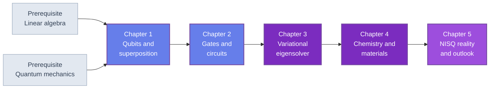

🌐 EN | [🇯🇵 JP](<../../../jp/FM/quantum-computing-introduction/index.html>) | Last sync: 2026-08-12

[AI Terakoya Top](<../../index.html>)›[Fundamental Mathematics Dojo](<../index.html>)›[Introduction to Quantum Computing](<index.html>)

[← Back to Fundamental Mathematics Dojo](<../index.html>)

## 🎯 Series Overview

This series is written for **materials scientists and chemists** , not for computer scientists. It starts from a problem you already have: the electronic structure of a strongly correlated material is described by a wave function whose dimension grows exponentially with the number of orbitals, and no amount of classical hardware will change that scaling. A quantum computer stores exactly that kind of object natively, which is why quantum simulation of matter — not code breaking, not machine learning — is the application with the clearest physical motivation.

The five chapters take the shortest honest path from a single qubit to a variational calculation of a molecular ground state, and then ask the harder question: what can actually be done with the noisy devices that exist, and what cannot. Everything is built from **NumPy alone** , with just under a hundred lines of code standing in for a state-vector simulator, so that no result depends on a framework you have to trust. Chapter 5 introduces Qiskit, PennyLane and Cirq only as a map of the ecosystem, after you already know what they compute.

The tone is deliberately unexcited. Quantum computing is a research field with a real physical case and a large gap between demonstration and utility, and a materials researcher is better served by knowing where that gap is than by a list of headline claims.

### Learning Path

Chapters 1 and 2 build the formalism and the simulator. Chapters 3 and 4 are the reason the series exists: variational algorithms and the electronic structure problem. Chapter 5 is the reality check, and it is not optional reading.

### 📋 Learning Objectives

On finishing this series you will be able to:

  * Describe a quantum state as a normalized complex vector, compute measurement probabilities from the Born rule, and explain why the state space of \\(n\\) qubits has dimension \\(2^n\\) — the same exponential wall that limits full configuration interaction
  * Build a state-vector simulator from scratch in NumPy (state preparation, single- and two-qubit gates, sampling, Pauli expectation values) and use it to verify every claim in the series numerically
  * Construct a parameterized circuit, measure the expectation value of a Pauli-decomposed Hamiltonian, and run a complete variational quantum eigensolver against a classical optimizer
  * Map an electronic structure problem onto qubits via second quantization and the Jordan-Wigner transformation, and compare the resulting qubit Hamiltonian with exact diagonalization
  * Assess a quantum-computing claim about materials science on physical grounds — decoherence times, circuit depth, measurement cost and error-correction overhead — instead of on press-release arithmetic

### 📖 Prerequisites

**Required.** Linear algebra at the level of eigenvalue problems, Hermitian and unitary matrices, and the Kronecker product: see [Linear Algebra and Tensor Analysis](<../linear-algebra-tensor/index.html>). Quantum mechanics at the level of state vectors, operators, measurement and the variational principle: see [Introduction to Quantum Mechanics](<../quantum-mechanics/index.html>). Chapter 3 refers back to the variational method covered there, and Chapter 4 refers to second quantization, which is introduced in [Introduction to Quantum Field Theory](<../quantum-field-theory-introduction/index.html>).

**Required.** Python 3.8 or later with NumPy. Chapter 3 uses `scipy.optimize`, and several chapters plot with Matplotlib. Nothing else is needed — there is no quantum SDK to install.

**Not required.** Any prior exposure to quantum computing, quantum information theory, or complexity theory. Circuit diagrams, gate sets and entanglement measures are introduced where they are first used.

* * *

## 📚 Chapters

### Chapter 1: Qubits and Superposition

Why the electronic structure problem is exponentially hard, and how a qubit register stores exactly the object that makes it hard. State vectors and Dirac notation, normalization, global versus relative phase, the Bloch sphere, measurement and the Born rule, collapse, and the tensor-product structure of a multi-qubit register. Closes by implementing the first three functions of the mini simulator — `ket`, `probs`, `sample` — in NumPy.

**Key topics** : state vectors · Dirac notation · superposition · Bloch sphere · Born rule · tensor products · exponential scaling

💻 8 Code Examples ⏱️ 30-35 minutes 📊 Beginner

[Read Chapter 1 →](<chapter-1.html>)

### Chapter 2: Quantum Gates and Circuits

Unitary evolution as the discrete face of the Schrödinger equation, and why every gate is reversible. The single-qubit gates X, Y, Z, H, S, T and the rotations \\(R_x, R_y, R_z\\); the two-qubit gates CNOT and CZ and controlled unitaries in general. Bell states and the connection between circuit entanglement and many-body entanglement in quantum materials. Circuit notation, universal gate sets, and completion of the mini simulator with the tensor-reshape `apply_gate`, `cnot` and `expval`.

**Key topics** : unitary evolution · Pauli and Clifford gates · rotation gates · CNOT · entanglement · universal gate sets · circuit simulation

💻 8 Code Examples ⏱️ 35-40 minutes 📊 Intermediate

[Read Chapter 2 →](<chapter-2.html>)

### Chapter 3: Variational Quantum Eigensolver

The algorithm that carries most of the near-term hope for chemistry. Why a variational method rather than phase estimation on today's hardware; parameterized circuits and the design of an ansatz, from hardware-efficient layers to chemically motivated forms; Pauli decomposition of an observable and the measurement of its expectation value; the classical optimization loop with gradient-free methods and the parameter-shift rule. Implements the full VQE for the two-qubit reduced Hamiltonian of H₂ over a range of bond lengths and compares the curve with exact diagonalization. Ends with the two limits that matter: barren plateaus and measurement cost.

**Key topics** : variational principle · ansatz design · Pauli decomposition · parameter-shift rule · H₂ potential energy curve · barren plateaus

💻 9 Code Examples ⏱️ 40-45 minutes 📊 Advanced

[Read Chapter 3 →](<chapter-3.html>)

### Chapter 4: Quantum Computing for Chemistry and Materials

The application chapter. Scaling of the electronic structure problem and where density functional theory runs out — strong correlation. Second quantization and fermionic operators, the Jordan-Wigner transformation with a working implementation, and the difference between digital and analog quantum simulation. Quantum phase estimation versus VQE as the fault-tolerant and near-term faces of the same problem. Target problems in materials science — spin models, the Hubbard model, catalysis such as FeMoco, battery materials — with an assessment of which are genuinely promising. Implements the qubit Hamiltonian of a small Hubbard model and a transverse-field Ising chain and compares exact diagonalization with VQE.

**Key topics** : full CI scaling · second quantization · Jordan-Wigner · QPE vs VQE · Hubbard model · transverse-field Ising · strongly correlated materials

💻 6 Code Examples ⏱️ 40-45 minutes 📊 Advanced

[Read Chapter 4 →](<chapter-4.html>)

### Chapter 5: NISQ Reality and Outlook

The physics of noise: decoherence with its \\(T_1\\) and \\(T_2\\) times, gate errors, and the minimum density-matrix formalism needed to describe them. A trajectory-based depolarizing-channel simulation showing fidelity decay against circuit depth. Error mitigation such as zero-noise extrapolation, and error correction with the surface code — including the overhead, stated in orders of magnitude rather than in promises. A realistic assessment of what noisy devices can and cannot do for materials research, how to read a "quantum advantage" announcement, and criteria for judging one from physical principles. Closes with the software ecosystem, references, and a learning roadmap.

**Key topics** : T₁/T₂ decoherence · density matrices · depolarizing channel · zero-noise extrapolation · surface code · realistic assessment · Qiskit / PennyLane / Cirq

💻 5 Code Examples ⏱️ 40-45 minutes 📊 Advanced

[Read Chapter 5 →](<chapter-5.html>)

* * *

## 🔤 Notation Used Throughout

The series fixes one set of conventions in Chapter 1 and never changes it, so that code from any chapter runs against code from any other.

| Symbol | Meaning |
| --- | --- |
| \\(\lvert 0\rangle, \lvert 1\rangle\\) | Computational basis states of one qubit |
| \\(\lvert\psi\rangle = \alpha\lvert 0\rangle + \beta\lvert 1\rangle\\) | A general qubit state, with \\(\lvert\alpha\rvert^2 + \lvert\beta\rvert^2 = 1\\) |
| \\(\lvert q_0 q_1 \ldots q_{n-1}\rangle\\) | Basis state of an \\(n\\)-qubit register |
| X, Y, Z | Pauli gates |
| H, S, T | Hadamard, phase, and \\(\pi/8\\) gates |
| \\(R_x(\theta), R_y(\theta), R_z(\theta)\\) | Single-qubit rotations about the Bloch axes |
| CNOT, CZ | Controlled-NOT and controlled-Z |
| \\(H = c_0\,II + c_1\,ZI + \cdots\\) | A Hamiltonian as a linear combination of Pauli strings |

**Qubit ordering.** Qubit 0 is the **leftmost** bit and the **most significant** bit, so the basis state \\(\lvert q_0 q_1 \ldots q_{n-1}\rangle\\) occupies index \\(\sum_i q_i 2^{\,n-1-i}\\) of the state vector. This is the convention Qiskit does *not* use, and mixing the two is the single most common source of silent errors in quantum code. Chapter 1 makes the convention explicit and tests it.

### The Mini Simulator

The whole series runs on one small module, built up over Chapters 1 and 2 and then reused without modification:

| Function | Introduced | Purpose |
| --- | --- | --- |
| `ket(bits)` | Chapter 1 | Basis state from a bit string, e.g. `ket('01')` |
| `probs(state)` | Chapter 1 | Born-rule probabilities \\(\lvert\text{amp}\rvert^2\\) |
| `sample(state, shots, seed=None)` | Chapter 1 | Measurement sampling, returned as a count dictionary |
| `I2, X, Y, Z, H, S, T` | Chapter 2 | The \\(2\times2\\) gate matrices |
| `rx/ry/rz(theta)` | Chapter 2 | Rotation gate matrices |
| `apply_gate(state, U, targets, n)` | Chapter 2 | Apply a gate by tensor reshaping |
| `cnot(state, control, target, n)` | Chapter 2 | Two-qubit entangling gate |
| `expval(state, pauli, coeff_map=None)` | Chapter 2 | Expectation value of **one** Pauli string, scaled by `coeff_map[pauli]` if a map is given; a whole Hamiltonian is `sum(expval(psi, p, terms) for p in terms)` |

Every chapter reprints the implementation it needs, so any chapter can be executed on its own.

* * *

## 🔍 What This Series Is and Is Not

**It is** a physics course. Every algorithm is presented as a statement about states, operators and measurements, and every claim is checked numerically on a simulator you build yourself.

**It is not** a survey of quantum algorithms. Shor's and Grover's algorithms appear only in passing, because neither is the reason a materials researcher would look at this hardware.

**It is not** a hardware course. Superconducting qubits, trapped ions and neutral atoms are mentioned where their error characteristics matter, and otherwise left alone.

**It is not** promotional. Where the honest answer is "not yet, and here is the physical reason", that is the answer you will get.

## 📚 Recommended Learning Paths

### Pattern 1: Complete path (6-8 days)

  * Day 1: Chapter 1 — qubits, superposition, measurement; run all eight examples
  * Day 2: Chapter 2 — gates and circuits; finish the simulator and keep it
  * Day 3: Chapter 3, Sections 3.1-3.4 — the variational recipe
  * Day 4: Chapter 3, Sections 3.5-3.6 — the H₂ curve, end to end
  * Day 5: Chapter 4, Sections 4.1-4.4 — fermions to qubits
  * Day 6: Chapter 4, Sections 4.5-4.6 — model Hamiltonians for materials
  * Day 7: Chapter 5 — noise, mitigation, and a realistic outlook
  * Day 8: Exercises and one problem of your own

### Pattern 2: Fast track for the physically fluent (3 days)

  * Day 1: Chapters 1-2, skimming the formalism, executing all code
  * Day 2: Chapter 3 in full — this is the algorithmic core
  * Day 3: Chapters 4-5, with attention to Sections 4.5 and 5.4

### Pattern 3: Decision-maker path (half a day)

  * Section 1.1 — why the problem is hard at all
  * Sections 3.1 and 3.6 — what VQE promises and what limits it
  * Sections 4.5 and 5.3-5.5 — which materials problems are plausible targets, and the cost of getting there

## 🎯 Overall Learning Outcomes

### Knowledge Level

  * ✅ Explain superposition, entanglement and measurement in operator language, without metaphor
  * ✅ State the resource scaling of exact classical diagonalization and of the corresponding qubit register
  * ✅ Describe the variational quantum eigensolver as a hybrid algorithm and identify each of its costs
  * ✅ Explain how fermionic antisymmetry survives the mapping onto qubits

### Practical Skills

  * ✅ Implement a state-vector simulator in NumPy from an empty file
  * ✅ Construct a Pauli-string Hamiltonian and evaluate its expectation value
  * ✅ Run and debug a variational optimization loop, including shot-noise effects
  * ✅ Verify every quantum result against exact diagonalization at small size

### Application Ability

  * ✅ Recognize which of your own problems are candidates for quantum simulation, and which are not
  * ✅ Estimate qubit count, circuit depth and shot budget for a proposed calculation
  * ✅ Read a quantum-computing paper or announcement in materials science and locate its actual claim

## 🛠️ Technologies and Tools Used

### Main Libraries

  * **numpy** — every simulator in this series
  * **scipy** — classical optimizers in Chapter 3, exact diagonalization of sparse Hamiltonians
  * **matplotlib** — potential energy curves, Bloch spheres, fidelity decay

### Referenced in Chapter 5 Only

  * **Qiskit** , **PennyLane** , **Cirq** — surveyed as an ecosystem, never required to follow the text

### Development Environment

  * **Python** : 3.8 or higher
  * **Jupyter Notebook** : recommended, since most examples are short and exploratory
  * Google Colab works for every example in the series; nothing needs a GPU or a quantum backend

## 🚀 Next Steps

### Deep Dive Learning

  * Quantum error correction and fault-tolerant architectures
  * Tensor-network methods (DMRG, PEPS) — the classical competition that any quantum claim must beat
  * Quantum Monte Carlo and its sign problem

### Related Series

  * [Introduction to Quantum Hardware](<../quantum-hardware-introduction/index.html>) — the companion volume: what the machines are made of, platform by platform
  * [Introduction to Quantum Machine Learning](<../../MI/quantum-machine-learning-introduction/index.html>) — the MI-side application, and an honest measurement of whether it beats a classical baseline
  * [Introduction to Quantum Mechanics](<../quantum-mechanics/index.html>) — variational principle, perturbation theory
  * [Introduction to Quantum Field Theory](<../quantum-field-theory-introduction/index.html>) — second quantization, creation and annihilation operators
  * [Linear Algebra and Tensor Analysis](<../linear-algebra-tensor/index.html>) — eigenvalue problems, Kronecker products, tensor contractions

### Practical Projects

  * Extend the mini simulator to density matrices and a noise channel of your choice
  * Reproduce a published two- or four-qubit VQE result and quantify its shot budget
  * Build the qubit Hamiltonian of a lattice model from your own research and diagonalize it exactly

### ⚠️ Disclaimer

  * This content is provided solely for educational, research, and informational purposes and does not constitute professional advice (legal, accounting, technical warranty, etc.).
  * This content and accompanying code examples are provided "AS IS" without any warranty, express or implied, including but not limited to merchantability, fitness for a particular purpose, non-infringement, accuracy, completeness, operation, or safety.
  * The author and Tohoku University assume no responsibility for the content, availability, or safety of external links, third-party data, tools, libraries, etc.
  * To the maximum extent permitted by applicable law, the author and Tohoku University shall not be liable for any direct, indirect, incidental, special, consequential, or punitive damages arising from the use, execution, or interpretation of this content.
  * The content may be changed, updated, or discontinued without notice.
  * The copyright and license of this content are subject to the stated conditions (e.g., CC BY 4.0). Such licenses typically include no-warranty clauses.
