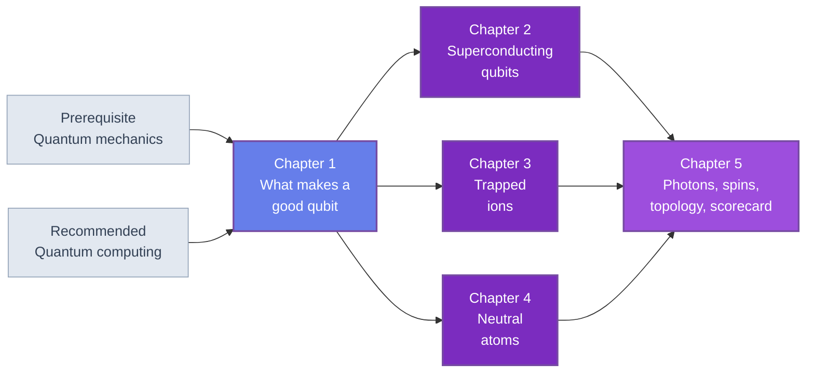

🌐 EN | [🇯🇵 JP](<../../../jp/FM/quantum-hardware-introduction/index.html>) | Last sync: 2026-08-13

[AI Terakoya Top](<../../index.html>)›[Fundamental Mathematics Dojo](<../index.html>)›[Introduction to Quantum Hardware](<index.html>)

[← Back to Fundamental Mathematics Dojo](<../index.html>)

## 🎯 Series Overview

This series is the companion volume to [Introduction to Quantum Computing](<../quantum-computing-introduction/index.html>). That course states plainly that it is not a hardware course: superconducting qubits, trapped ions and neutral atoms appear there only where their error characteristics matter, and decoherence enters as a parameter of a noise model. This course fills exactly that gap. Where the algorithms course asks what a quantum computer could compute, this one asks what a quantum computer has to be made of, and why every candidate answer is limited by something a materials scientist would recognize.

The organizing view is stated in the subtitle and defended in every chapter: **quantum hardware is a materials problem**. The coherence of a superconducting qubit is set by two-level defects in a few nanometres of amorphous surface oxide. The coherence of a silicon spin qubit is set by the residual concentration of $^{29}\mathrm{Si}$ and by traps at the oxide interface. The motional heating that limits an ion trap comes from electric-field noise at an electrode surface. The topological proposal stands or falls on the quality of a semiconductor-superconductor interface. In each case the device figure of merit — a $T_1$, a $T_2^\ast$, a quality factor — translates directly into a quantity from the materials literature: a loss tangent, an interface trap density, an isotopic purity, a surface participation ratio.

Five chapters cover one platform each, after a first chapter that fixes the language in which they are compared. The treatment is deliberately physical rather than promotional. Where the honest answer is "the material is not good enough yet, and here is which material", that is the answer given — which is, for the intended reader, the interesting answer, because it identifies where the work is.

### Learning Path

Chapter 1 is not optional: it defines $T_1$, $T_2$ and $T_2^\ast$, the six comparison axes, and the unit conventions that the other four chapters use without restating. Chapters 2, 3 and 4 are independent of each other and can be read in any order, or singly. Chapter 5 collects the remaining platforms and then compares all of them on the axes of Chapter 1, so it should be read last.

### 📋 Learning Objectives

On finishing this series you will be able to:

  * State the DiVincenzo criteria and, for each, name the physical property of a device or material that constrains it
  * Define $T_1$, $T_2$ and $T_2^\ast$ precisely, derive the bound $T_2 \le 2T_1$, and explain which part of the environmental noise spectrum each one samples
  * Explain the mechanism of each major platform from its Hamiltonian: the Josephson nonlinearity of a transmon, the shared motional mode of an ion chain, the Rydberg blockade of a neutral-atom array, the exchange interaction of a double quantum dot
  * Derive the anharmonicity of a transmon by numerical diagonalization, compute the Mathieu stability diagram of a Paul trap, simulate Rydberg blockade dynamics, and diagonalize an exchange-coupled double dot — verifying each mechanism numerically rather than accepting it
  * Identify, for any platform, the materials channel that currently limits its coherence, and name the measurement that would confirm the diagnosis
  * Read a hardware claim on physical grounds — energy scales, scaling laws, connectivity, noise spectra — rather than on quoted device specifications

### 📖 Prerequisites

**Required.** Quantum mechanics at the level of two-level systems, the harmonic oscillator, time-dependent perturbation theory and the rotating-wave approximation: see [Introduction to Quantum Mechanics](<../quantum-mechanics/index.html>). Chapter 2 uses the quantized LC circuit, Chapter 3 the Mathieu equation and sideband transitions, Chapter 4 the AC Stark shift.

**Recommended.** [Introduction to Quantum Computing](<../quantum-computing-introduction/index.html>). This series uses the qubit ordering, gate symbols and state-vector conventions established there, and Chapter 5 refers to its treatment of error correction. Reading the two together is the intended experience, but this course is self-contained on the physics side.

**Required.** Python 3.8 or later with NumPy, SciPy and Matplotlib. Every code example is plain NumPy or SciPy; there is no quantum SDK and no hardware backend anywhere in the series.

**Useful but not required.** Solid-state physics for Chapter 2 — [Introduction to Superconductivity](<../../MS/superconductivity-introduction/index.html>) covers the Cooper pairing and Josephson physics that Chapter 2 summarizes in one section — and [Introduction to Spintronics](<../../MS/spintronics-introduction/index.html>) for the spin-qubit section of Chapter 5.

* * *

## 📚 Chapters

### Chapter 1: What Makes a Good Qubit

Why a good qubit must be two contradictory things at once, and how natural and engineered platforms resolve that contradiction differently. The DiVincenzo criteria with the physical content of each. The six comparison axes — coherence, gate fidelity and speed, connectivity, reproducibility and yield, operating temperature, scalability — with a quantitative demonstration that ranking by any single one of them gives a different winner. The common language of decoherence: $T_1$, $T_2$, $T_2^\ast$, noise spectral density, $1/f$ noise from two-level fluctuators, and filter functions. Closes with a Bloch-equation laboratory that reproduces Rabi oscillations, free-induction decay, Ramsey fringes, the Hahn echo and CPMG dynamical decoupling from first principles.

**Key topics** : DiVincenzo criteria · comparison axes · $T_1$ / $T_2$ / $T_2^\ast$ · noise spectral density · $1/f$ noise and TLS · Bloch equations · Ramsey and echo · CPMG scaling

💻 7 Code Examples ⏱️ 40-45 minutes 📊 Intermediate

[Read Chapter 1 →](<chapter-1.html>)

### Chapter 2: Superconducting Qubits

Superconductivity and the Josephson effect, from Cooper pairing to the two Josephson relations. Quantizing the LC circuit, and why an artificial atom needs a nonlinear element at all. The transmon: the cosine potential, anharmonicity, and the trade of anharmonicity against charge-noise insensitivity as $E_J/E_C$ grows. Control and readout with microwave pulses and dispersive measurement, with the minimum circuit QED required. The mechanisms of two-qubit gates — capacitive coupling, tunable couplers, cross-resonance. Closes with the materials science of decoherence: two-level systems in surface and interface oxides, the participation-ratio analysis of dielectric loss, non-equilibrium quasiparticles, and substrate choice.

**Key topics** : Josephson relations · circuit quantization · transmon · anharmonicity · $E_J/E_C$ and charge dispersion · dispersive readout · tunable couplers · cross-resonance and frequency collisions · TLS and participation ratio · quasiparticles

💻 7 Code Examples ⏱️ 45-50 minutes 📊 Advanced

[Read Chapter 2 →](<chapter-2.html>)

### Chapter 3: Trapped Ions

The physics of the Paul trap: the Mathieu equation, the pseudopotential, and the stability diagram. What carries the qubit — hyperfine levels against optical transitions, and why clock transitions are special. Laser cooling and sideband spectroscopy, from Doppler cooling to resolved-sideband cooling on a single motional mode. Gate mechanisms built on a shared phonon mode, from the Cirac-Zoller scheme to the Mølmer-Sørensen gate that superseded it. All-to-all connectivity and what it costs: gate speed, mode crowding, and the scaling with ion number. Closes with the engineering and materials problems — anomalous heating from trap surfaces, vacuum, and the complexity of the optical system.

**Key topics** : Mathieu equation · pseudopotential · stability diagram · hyperfine vs optical qubits · sideband cooling · Mølmer-Sørensen gate · all-to-all connectivity · anomalous heating

💻 7 Code Examples ⏱️ 45-50 minutes 📊 Advanced

[Read Chapter 3 →](<chapter-3.html>)

### Chapter 4: Neutral Atoms

Laser cooling from the scattering force to optical molasses and the magneto-optical trap. Optical tweezers and atom arrays: the dipole force, rearrangement, and the arbitrary geometries that follow from it. Rydberg states and the blockade effect, with the $n^{11}$ scaling of the interaction, the blockade radius and the $C_6$ coefficient. Gates and the two modes of operation that distinguish this platform — digital gates, and analog quantum simulation in which an Ising Hamiltonian is implemented directly. Closes with the honest assessment: natural scaling to mid-size registers, against atom loss, the physical limits on gate fidelity, and destructive readout.

**Key topics** : optical molasses and MOT · dipole force · optical tweezers · Rydberg blockade · $C_6$ and blockade radius · digital vs analog operation · atom loss · destructive readout

💻 6 Code Examples ⏱️ 40-45 minutes 📊 Advanced

[Read Chapter 4 →](<chapter-4.html>)

### Chapter 5: Photons, Spins, Topology — and the Scorecard

The remaining platforms, and then the comparison. Photonic quantum computing: single photons, the difficulty of making light interact, and where measurement-based schemes and Gaussian boson sampling actually sit. Semiconductor spin qubits: quantum dots, the exchange interaction, and isotopic purification of silicon — the clearest case in the series of a materials argument deciding a platform's prospects. Topological quantum computation: non-Abelian anyons and Majorana modes, why the protection is intrinsic and what it does not cover (quasiparticle poisoning), and a frank account of the distance between a proof of principle and a device. The scorecard then compares every platform on the axes of Chapter 1 — by physical constraint, not by numerical record — and states plainly that there is no winner yet. Closes with what all of this implies for a materials researcher.

**Key topics** : linear optics and KLM · measurement-based computation · quantum-dot spin qubits · exchange interaction · $^{28}\mathrm{Si}$ purification · Majorana modes · non-Abelian statistics · quasiparticle poisoning · cross-platform scorecard

💻 6 Code Examples ⏱️ 45-50 minutes 📊 Advanced

[Read Chapter 5 →](<chapter-5.html>)

* * *

## 🔤 Notation and Units

The conventions are fixed in Chapter 1 and never changed, so that code and formulas from any chapter can be combined with any other.

| Symbol | Meaning |
| --- | --- |
| $\hbar = 1$ | Hamiltonians are written in reduced units; physical energies restore $\hbar$ explicitly |
| $\omega_q$, $\omega_d$ | qubit and drive angular frequencies (rad/s); quoted as $\omega/2\pi$ in Hz |
| $\Omega$ | Rabi frequency, angular; a $\pi$ pulse takes $\pi/\Omega$ |
| $\Delta = \omega_q - \omega_d$ | detuning, angular |
| $T_1$ | energy relaxation time (longitudinal) |
| $T_2$ | coherence time after an echo; $1/T_2 = 1/(2T_1) + 1/T_\varphi$ |
| $T_2^\ast$ | coherence time without an echo, including static inhomogeneity |
| $S(f)$ | one-sided noise power spectral density, $\langle\delta\omega^2\rangle = \int_0^\infty S\,df$ |
| $E_J$, $E_C$ | Josephson and charging energies of a superconducting circuit (Chapter 2) |
| $\eta$ | Lamb-Dicke parameter of a trapped ion (Chapter 3) |
| $C_6$, $R_b$ | Rydberg interaction coefficient and blockade radius (Chapter 4) |
| $J$ | exchange coupling of a double quantum dot (Chapter 5) |
| $X, Y, Z, H$, CNOT | gate symbols, identical to the sister course |

**Energy units.** Superconducting circuits are quoted in GHz, trapped ions and neutral atoms in MHz, spins in MHz or in tesla. Chapter 1 gives the conversion once — 1 GHz corresponds to 4.14 $\mu$eV and to 48 mK — and each later chapter then uses the unit conventional in its own literature.

**Qubit ordering.** Qubit 0 is the leftmost and most significant bit, exactly as in [Introduction to Quantum Computing](<../quantum-computing-introduction/index.html>). This is the opposite of Qiskit's convention.

* * *

## 🔍 What This Series Is and Is Not

**It is** a physics and materials course. Every platform is presented from its Hamiltonian, every mechanism is verified numerically at small size, and every coherence limit is traced to a physical origin.

**It is not a performance-record table.** Qubit counts, fidelity records and quoted device specifications appear nowhere in these five chapters. Such numbers are obsolete before they are read, and they are not explanatory. Scaling laws, selection rules and participation-ratio arguments remain true.

**It is not a vendor comparison.** No company roadmaps, no product names, no assessment of who is ahead. Where platforms are compared, they are compared on physical constraints, and Chapter 5 says explicitly that there is no winner yet.

**It is not an algorithms course.** For what these machines would compute, and why a materials researcher should care at all, read [Introduction to Quantum Computing](<../quantum-computing-introduction/index.html>) — this course is the other half of that pair.

**It is not promotional.** Where the honest answer is "not yet, and here is the material that has to improve", that is the answer you will get.

## 📚 Recommended Learning Paths

### Pattern 1: Complete path (6-7 days)

  * Day 1: Chapter 1, Sections 1.1-1.5 — the criteria, the axes, the language of decoherence
  * Day 2: Chapter 1, Section 1.6 — run its five examples (Examples 1-2 sit in §1.1 and §1.3) and reproduce the Ramsey/echo separation yourself
  * Day 3: Chapter 2 — superconducting qubits, ending on the TLS and participation-ratio section
  * Day 4: Chapter 3 — trapped ions
  * Day 5: Chapter 4 — neutral atoms
  * Day 6: Chapter 5, Sections 5.1-5.3 — photons, spins, topology
  * Day 7: Chapter 5, Sections 5.4-5.5 and the exercises — the scorecard, and what it means for your own work

### Pattern 2: One platform in depth (1 day)

  * Chapter 1, Sections 1.2-1.4 — enough language to read anything else
  * The single chapter for the platform you care about, in full, with its code
  * Chapter 5, Section 5.4 — where that platform sits relative to the others

### Pattern 3: Materials-researcher path (half a day)

  * Section 1.5 — the position of the course, and the table of what limits each platform
  * Section 2.6 — dielectric loss, TLS and the participation-ratio analysis, the most developed materials argument in the series
  * Section 3.6 — anomalous heating from trap surfaces
  * Sections 5.2 and 5.5 — isotopic purification, and where materials science has room to contribute

## 🎯 Overall Learning Outcomes

### Knowledge Level

  * ✅ State the DiVincenzo criteria and the six comparison axes, and explain why the axes are physically coupled
  * ✅ Explain the operating principle of each major platform starting from its Hamiltonian
  * ✅ Define $T_1$, $T_2$ and $T_2^\ast$ and say which frequency range of the environment each one probes
  * ✅ Name the dominant materials-limited decoherence channel of each platform

### Practical Skills

  * ✅ Integrate the Bloch equations and reproduce Rabi, Ramsey, echo and CPMG measurements numerically
  * ✅ Diagonalize a transmon Hamiltonian in the charge basis and extract anharmonicity and charge dispersion
  * ✅ Compute a Mathieu stability diagram, a Rydberg blockade evolution, and an exchange-coupled two-spin spectrum
  * ✅ Estimate an energy scale, an operating temperature, or a gate budget from first principles

### Application Ability

  * ✅ Read a hardware paper and locate its actual physical claim, separate from its device specifications
  * ✅ Diagnose, from a set of coherence measurements, which noise band and therefore which defect population changed
  * ✅ Identify where your own materials expertise intersects a current bottleneck in this field

## 🛠️ Technologies and Tools Used

### Main Libraries

  * **numpy** — every simulation in this series
  * **scipy** — ODE integration of the Bloch equations, eigenvalue problems, special functions for the Mathieu equation
  * **matplotlib** — coherence curves, stability diagrams, potential landscapes

### Development Environment

  * **Python** : 3.8 or higher
  * **Jupyter Notebook** : recommended, since most examples are short and exploratory
  * Google Colab runs every example; nothing needs a GPU, a quantum backend, or a laboratory

## 🚀 Next Steps

### Deep Dive Learning

  * Circuit quantum electrodynamics, at the level of a full treatment of dispersive readout and parametric amplification
  * Microwave loss in amorphous dielectrics at millikelvin temperatures — the measurement techniques as much as the results
  * Quantum error correction and fault-tolerant architectures, and how the code choice depends on the connectivity a platform provides
  * Surface science of trap electrodes and of shallow defect centres

### Related Series

  * [Introduction to Quantum Computing](<../quantum-computing-introduction/index.html>) — the algorithms half of this pair
  * [Introduction to Quantum Mechanics](<../quantum-mechanics/index.html>) — two-level systems, the harmonic oscillator, perturbation theory
  * [Introduction to Superconductivity](<../../MS/superconductivity-introduction/index.html>) — Cooper pairing and the Josephson effect in full
  * [Introduction to Spintronics](<../../MS/spintronics-introduction/index.html>) — spin transport, exchange, and magnetic materials

### Practical Projects

  * Extend the Chapter 1 toolkit to two qubits and simulate a two-qubit gate under correlated noise
  * Take a published $T_1$ or $Q_i$ dataset and extract a surface loss tangent with a participation-ratio model
  * Implement CPMG noise spectroscopy on simulated data and recover $S(f)$ over three decades
  * Estimate the refrigeration and control-channel budget of a hypothetical thousand-qubit machine on your chosen platform

### ⚠️ Disclaimer

  * This content is provided solely for educational, research, and informational purposes and does not constitute professional advice (legal, accounting, technical warranty, etc.).
  * This content and accompanying code examples are provided "AS IS" without any warranty, express or implied, including but not limited to merchantability, fitness for a particular purpose, non-infringement, accuracy, completeness, operation, or safety.
  * The author and Tohoku University assume no responsibility for the content, availability, or safety of external links, third-party data, tools, libraries, etc.
  * To the maximum extent permitted by applicable law, the author and Tohoku University shall not be liable for any direct, indirect, incidental, special, consequential, or punitive damages arising from the use, execution, or interpretation of this content.
  * The content may be changed, updated, or discontinued without notice.
  * The copyright and license of this content are subject to the stated conditions (e.g., CC BY 4.0). Such licenses typically include no-warranty clauses.
