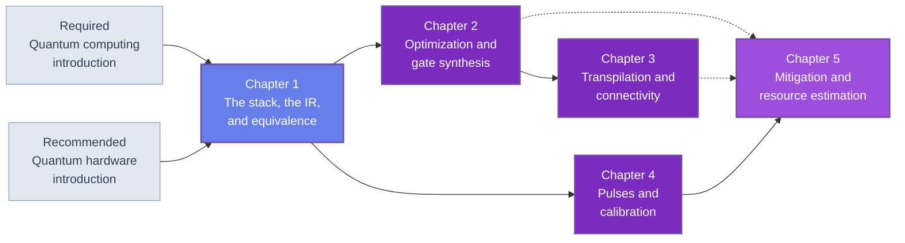

🌐 EN | [🇯🇵 JP](<../../../jp/FM/quantum-software-stack-introduction/index.html>) | Last sync: 2026-08-13

[AI Terakoya Top](<../../index.html>)›[Fundamental Mathematics Dojo](<../index.html>)›[Introduction to the Quantum Software Stack](<index.html>)

[← Back to Fundamental Mathematics Dojo](<../index.html>)

## 🎯 Series Overview

**This is not an SDK tutorial. It is a course on what SDKs do.**

That distinction is the reason the series exists, so it is worth being precise about it. Between a quantum algorithm written as mathematics and a machine that accepts shaped microwave or laser pulses there are six layers of software: a circuit representation, an optimizer, a placement and routing stage, a gate-synthesis stage, a pulse compiler with its calibration loops, and a measurement post-processor. Chapter 1 tabulates seven, because its table counts the algorithm itself as layer 1. Every quantum framework in existence implements those layers. None of them explains them, because documentation exists to tell you which function to call, not what the function had to solve.

So this course builds a miniature version of the whole stack, in NumPy, from nothing. A circuit intermediate representation in Chapter 1, with a unitary-equivalence checker that guards every rewrite that follows. A peephole optimizer and single- and two-qubit gate synthesis in Chapter 2. Connectivity graphs, layout and a SWAP router in Chapter 3. A three-level pulse simulator with Rabi, Ramsey and DRAG calibration in Chapter 4. Readout-error correction, zero-noise extrapolation, probabilistic error cancellation and a resource estimator in Chapter 5. Nothing is called; everything is written, run, and measured.

The payoff is not that you should use the code here instead of a framework — you should not, and the closing section of Chapter 1 says so plainly. The payoff is that a framework's API changes every year and its layers do not. When you can read a transpiled circuit and say *this grew because of routing, not synthesis*, or look at a basis gate set and know which synthesis problem the compiler had to solve, or estimate what an algorithm will cost before writing a line of it, then the documentation of any framework becomes a reference rather than a mystery. That is the state this course is designed to leave you in.

The second commitment is the verification discipline, which is the technical spine of the series. A compiler pass is correct when it preserves the meaning of the circuit, and for quantum circuits "same meaning" has an exact and *checkable* definition: the same unitary, up to a global phase. Every pass in these five chapters ships with that check, run exhaustively where the register is small and on random states where it is not. Chapter 1 builds the checker; Chapter 2 uses it on six hundred randomly generated rewrites — two hundred circuits through each of three optimizing pipelines — alongside two hundred runs of a no-op control pipeline; Chapter 5 uses it on the mitigation circuits. It is also how this course can be honest without hardware access: the claims are either checked numerically or presented as parametric estimates, never quoted.

### Learning Path

Chapter 1 is not optional: it fixes the circuit representation, the qubit convention and the equivalence checker that the other four chapters use without restating. From there the series splits. Chapters 2 and 3 are the compiler path and are best read in order, since routing consumes the output of synthesis. Chapter 4 depends only on Chapter 1 and can be read directly after it by anyone whose interest is control rather than compilation. Chapter 5 reads best after all of them, but the dependence is conceptual rather than a flow of data: it prices what the other layers cannot fix, and it assumes you can already read a gate count as Chapter 2 does, a routing overhead as Chapter 3 does, and a physical error rate as Chapter 4 measures one. Its resource estimator is self-contained — the inputs are a Hamiltonian 1-norm, a target precision, a walk cost, a physical error rate and a logical qubit count, and nothing is imported from the earlier chapters' code. The dashed edges above mark that kind of dependency.

### 📋 Learning Objectives

On finishing this series you will be able to:

  * Name the layers between an algorithm and a control waveform, say what each one consumes and produces, and identify exactly which piece of hardware information each one needs
  * Implement a circuit intermediate representation and the metrics that go with it — depth, gate counts, two-qubit counts — and explain why the choice of gate set is what fixes a layer boundary
  * Verify that a compiler pass preserves meaning, by unitary equivalence with global-phase removal, and explain why a global phase may never be dropped inside a controlled block
  * Write a peephole optimizer, decompose an arbitrary single-qubit unitary by Euler angles, and state the CNOT count that a general two-qubit unitary requires
  * Explain why the $T$ gate is the expensive one, and how that changes the cost model once error correction is in play
  * Represent a connectivity graph, choose an initial layout, insert SWAP gates to route a circuit onto it, and measure the resulting overhead on all-to-all, lattice and heavy-hex geometries
  * Simulate a three-level system, observe leakage from a square pulse, suppress it with DRAG, and run Rabi, Ramsey and DRAG-coefficient calibration loops that recover parameters you deliberately mis-set
  * Implement readout-error correction, zero-noise extrapolation and probabilistic error cancellation, and measure the sampling cost each one demands
  * Produce a logical-to-physical resource estimate — algorithm $T$ count to code distance to physical qubits to runtime — as a function you can run rather than a number you have read

### 📖 Prerequisites

**Required.** [Introduction to Quantum Computing](<../quantum-computing-introduction/index.html>), or equivalent fluency with state vectors and unitary gates, the big-endian qubit convention, the ninety-nine-line state-vector simulator of that course's Chapter 2, and its treatment of noise channels and error correction in Chapter 5. Every chapter here re-lists the simulator functions it needs, but none of them re-derives the physics.

**Required.** Linear algebra: unitary and Hermitian matrices, tensor products, eigendecomposition, and matrix norms. Chapter 2's synthesis arguments and Chapter 4's three-level dynamics both need eigenvalues rather than only matrix multiplication.

**Required.** Python 3.8 or later with NumPy, SciPy and Matplotlib. There is no quantum SDK and no hardware backend anywhere in this series — that is the point of it.

**Recommended.** [Introduction to Quantum Hardware](<../quantum-hardware-introduction/index.html>). Chapter 3 explains connectivity graphs as consequences of the platform physics — all-to-all for trapped ions, sparse for superconducting circuits — and Chapter 4 revisits the resonant-drive physics of that course's Chapter 2 in the language of control. Both chapters are readable without it, and considerably more interesting with it.

**Useful but not required.** [Intermediate Quantum Algorithms](<../quantum-algorithms-intermediate/index.html>), for the circuits this stack is asked to compile, and for the resource-estimation conventions Chapter 5 stays consistent with.

* * *

## 📚 Chapters

### Chapter 1: The Stack from Algorithms to Pulses

Why there are layers at all, and where the boundaries belong: the criterion turns out to be how perishable each pass's input is, which sorts the seven layers into exactly the order they are conventionally drawn in. The circuit intermediate representation of the course is then fixed — gate tuples, big-endian wires, `run_circuit`, `circuit_depth`, `gate_counts` — with an argument that the choice of gate set, and nothing about data structures, is what makes a layer boundary. Compilation is defined as meaning-preserving rewriting, with the three correctness relations in use (exact up to a global phase, exact up to a qubit permutation, approximate within $\varepsilon$) and the unitary-equivalence checker that tests the first of them. Closes with a map of what commercial frameworks call these layers, in terms general enough to survive their next several releases, and with a four-stage compiler pipeline whose stubs the remaining chapters replace.

**Key topics** : the seven layers · perishability as the layering criterion · circuit IR as data · gate sets as layer boundaries · depth and its unit-time assumption · the three correctness relations · global-phase removal by Hilbert-Schmidt overlap · why a global phase is not global inside a controlled block · state versus unitary equivalence · the SDK layer correspondence

💻 7 Code Examples ⏱️ 45-50 minutes 📊 Intermediate

[Read Chapter 1 →](<chapter-1.html>)

### Chapter 2: Circuit Optimization and Gate Synthesis

The rewriting rules that a peephole optimizer is made of: fusion of adjacent gates, cancellation of inverses, and the commutation rules that decide when two gates may be exchanged. Single-qubit synthesis by Euler decomposition, which turns any $U(2)$ into three rotations, implemented and verified against the Chapter 1 checker. Two-qubit synthesis: the KAK decomposition as a concept, explicit two- and three-CNOT constructions, and the lower bound on the CNOT count that says when you have finished. Then Clifford$+T$ and the reason the $T$ gate is expensive, which is a statement about error correction rather than about hardware, and which sets up the resource arithmetic of Chapter 5. Closes with measurements: a peephole optimizer run over random circuits with the depth and gate-count reduction recorded, and every rewrite verified for unitary equivalence.

**Key topics** : gate fusion and cancellation · commutation rules · circuit identities · Euler and ZYZ decomposition · KAK decomposition · two-CNOT and three-CNOT constructions · CNOT lower bounds · Clifford$+T$ · $T$ count · exhaustive equivalence verification of an optimizer

💻 7 Code Examples ⏱️ 45-50 minutes 📊 Advanced

[Read Chapter 2 →](<chapter-2.html>)

### Chapter 3: Transpilation — Mapping to Connectivity

Connectivity graphs as consequences of physics: all-to-all where a shared bosonic mode couples every qubit, a two-dimensional lattice or a heavy-hex graph where the coupling is capacitive and the frequencies must not collide. The placement problem — choosing which physical qubit each program qubit starts on — with an honest account of why it is NP-hard and why heuristics are nonetheless sufficient. Routing by SWAP insertion, and the principle behind the forward-and-backward heuristics that modern routers use. Then the cost measurement: SWAP overhead as a function of connectivity and circuit structure, with the reasoning behind synthetic benchmarks and without any vendor numbers. Closes with an implementation: a graph representation, a nearest-neighbour router, GHZ and QFT circuits routed onto three geometries with their SWAP counts compared, and post-routing equivalence verified including the qubit permutation.

**Key topics** : coupling graphs · all-to-all, lattice and heavy-hex · initial layout selection · NP-hardness and why heuristics suffice · SWAP insertion · lookahead routing heuristics · SWAP overhead versus connectivity · equivalence up to a permutation

💻 7 Code Examples ⏱️ 45-50 minutes 📊 Advanced

[Read Chapter 3 →](<chapter-3.html>)

### Chapter 4: Pulses and Calibration

What is underneath a gate: a rotation is a resonant drive, and the physics of Chapter 2 of the hardware course reappears here as a control problem. Pulse shaping from the square pulse to the Gaussian to DRAG, motivated by the thing that makes shaping necessary — leakage out of the computational subspace of a weakly anharmonic system. The calibration loop as the distinctive feature of this layer: Rabi amplitude calibration, frequency calibration by Ramsey interferometry, and DRAG coefficient calibration, which together are software conducting an experiment on its own machine. Randomized benchmarking and the reason it can separate gate fidelity from state-preparation and measurement error. Closes with a three-level pulse simulator: leakage measured under a square pulse and suppressed by DRAG, calibration loops that recover parameters deliberately mis-set beforehand, and a simulated randomized-benchmarking run whose extracted gate error matches the value that was configured.

**Key topics** : resonant drive and the rotating frame · leakage and anharmonicity · Gaussian and DRAG pulse shaping · Rabi amplitude calibration · Ramsey frequency calibration · DRAG coefficient calibration · randomized benchmarking · separating SPAM from gate error

💻 9 Code Examples ⏱️ 50-55 minutes 📊 Advanced

[Read Chapter 4 →](<chapter-4.html>)

### Chapter 5: Error Mitigation as Software, and Resource Estimation

Mitigation treated as what it actually is — a software layer that post-processes measurement results. Readout-error correction from the confusion matrix, by inversion and by constrained least squares, with the reason the second is preferred. Zero-noise extrapolation implemented by gate folding, with the variance cost measured rather than asserted. Probabilistic error cancellation and its quasi-probability construction, with the exponential sampling cost shown numerically, because an honest account of a method includes the point at which it stops working. Then the boundary of the whole approach: mitigation costs grow exponentially and correction costs grow polynomially, which is where software ingenuity ends and error correction begins. A resource-estimation pipeline follows, implemented as functions from an algorithm's $T$ count through code distance and physical qubit count to a runtime. Closes with a map of the six-course quantum family and how its chapters cross-reference.

**Key topics** : confusion matrix and readout correction · constrained least squares · zero-noise extrapolation by gate folding · variance cost of mitigation · quasi-probability and PEC · exponential sampling cost · mitigation versus correction · $T$ count to code distance to physical qubits · runtime estimation · the series map

💻 8 Code Examples ⏱️ 45-50 minutes 📊 Advanced

[Read Chapter 5 →](<chapter-5.html>)

* * *

## 🔤 Notation and Conventions

Two conventions are inherited from [Introduction to Quantum Computing](<../quantum-computing-introduction/index.html>) and never changed; the third is new here and is the technical contract of the series.

| Symbol | Meaning |
| --- | --- |
| $\lvert q_0 q_1 \cdots q_{n-1}\rangle$ | big-endian: qubit 0 is leftmost and most significant. The opposite of the convention used by much of the SDK literature |
| $\hbar = 1$ | reduced units wherever a Hamiltonian appears, which is Chapter 4 |
| $C = [g_1, \ldots, g_L]$ | a circuit is a list of gate tuples, applied left to right |
| $U(C)$ | the $2^n \times 2^n$ matrix of a circuit, $U_{g_L}\cdots U_{g_1}$ |
| $e^{i\varphi}$ | the global phase, quotiented out by every equivalence check |
| $\mathrm{depth}(C)$ | number of layers under greedy packing by qubit disjointness |
| $\varepsilon$ | error of an approximate synthesis, in operator norm |
| $d$ | code distance (Chapter 5); $\lVert \cdot \rVert$ is the operator norm elsewhere |
| $X, Y, Z, H, S, T$, CNOT | gate symbols, identical to the introductory course |

**The circuit IR.** Fixed in Chapter 1 and used unchanged by all five chapters:

| Gate tuple | Meaning |
| --- | --- |
| `("h", q)`, `("x", q)`, `("z", q)`, `("s", q)`, `("t", q)` | fixed single-qubit gates |
| `("rx", theta, q)`, `("ry", theta, q)`, `("rz", theta, q)` | rotations, angle in radians, $R_a(\theta) = e^{-i\theta A/2}$ |
| `("cx", control, target)`, `("cz", q1, q2)` | two-qubit gates |

Three functions come with it — `run_circuit(circ, n)`, `circuit_depth(circ, n)`, `gate_counts(circ)` — and each chapter re-lists the ones it uses, verbatim.

**Parameters, not specifications.** Gate durations, error rates and coherence times appear throughout as dimensionless parameters swept over decades. They are there to expose scaling and constant factors, and they are not device specifications, measurements, or predictions about any machine.

* * *

## 🔍 What This Series Is and Is Not

**It is not an SDK tutorial.** No framework is installed, imported, or version-pinned anywhere in these five chapters. Section 1.4 maps the layers onto the components every framework has, using generic names, and that is the closest the series comes to API documentation — deliberately, because an API changes and a layer does not.

**It is a bridge to an SDK, not a replacement for one.** A production framework gives you hardware access, passes developed against real devices, and a maintained machine description for every backend. None of that is replaceable. What it does not give you is knowledge of what the passes did, and that is the half this course supplies.

**It is not a hardware course.** The physics of qubits, coherence and gate mechanisms belongs to [Introduction to Quantum Hardware](<../quantum-hardware-introduction/index.html>). Chapter 4 uses exactly as much of it as a control problem requires: a three-level system, a drive, and a leakage channel.

**It is not an algorithms course.** The circuits compiled here are small and generic. For the algorithms that produce interesting circuits, read [Intermediate Quantum Algorithms](<../quantum-algorithms-intermediate/index.html>).

**It is not promotional about mitigation.** Chapter 5 implements zero-noise extrapolation and probabilistic error cancellation and then measures what they cost. Where the cost is exponential, that is stated with the number attached, and the chapter says plainly where software ingenuity ends.

**Everything runs, and everything is checked.** Every code example was executed to produce the output shown. Every rewriting pass is accompanied by a unitary-equivalence check, and where the register is too large for an exhaustive check, the fallback and its limitations are stated rather than skipped.

## 📚 Recommended Learning Paths

### Pattern 1: Complete path (6-7 days)

  * Day 1: Chapter 1, Sections 1.1-1.4 — the layers, the IR, and what compilation means
  * Day 2: Chapter 1, Section 1.5 — build the IR and the checker, and run the pipeline yourself
  * Day 3: Chapter 2 — rewriting rules, Euler and KAK synthesis, $T$ counting
  * Day 4: Chapter 3 — connectivity, layout, routing, and the SWAP overhead
  * Day 5: Chapter 4 — pulses, leakage, DRAG, and the calibration loops
  * Day 6: Chapter 5, Sections 5.1-5.4 — readout correction, ZNE, PEC, and their limits
  * Day 7: Chapter 5, Sections 5.5-5.6 and the exercises — resource estimation, and the map of the series

### Pattern 2: The compiler path (2-3 days)

  * Chapter 1 in full — the IR and the equivalence checker are the tools
  * Chapter 2 in full — this is where most of a transpiler's code lives
  * Chapter 3 in full — and Section 3.4 for how to cost the result

### Pattern 3: The control path (1-2 days)

  * Chapter 1, Sections 1.1-1.2 — enough of the stack to place the pulse layer in it
  * Chapter 4 in full, with its calibration loops run and deliberately broken
  * Chapter 5, Sections 5.1-5.2 — the measurement side of the same layer

### Pattern 4: The sceptic's path (half a day)

  * Section 1.3 — what it means for a rewrite to be correct, and how to check it
  * Sections 5.3 and 5.4 — the exponential cost of mitigation, and where it stops
  * Section 5.5 — a resource estimate you can run, with the assumptions visible

## 🎯 Overall Learning Outcomes

### Knowledge Level

  * ✅ Name the layers of a quantum software stack and state the hardware information each one requires
  * ✅ Explain why the gate set, not the data structure, is what defines a layer boundary
  * ✅ State the three correctness relations for a compiler pass and say which layer uses which
  * ✅ Explain why the $T$ gate is expensive, why mitigation costs grow exponentially, and why correction does not

### Practical Skills

  * ✅ Implement a circuit IR with depth and gate-count metrics, and a unitary-equivalence checker with global-phase removal
  * ✅ Write and verify rewriting passes, including Euler decomposition of an arbitrary single-qubit unitary
  * ✅ Route a circuit onto a connectivity graph and measure the overhead
  * ✅ Simulate a shaped pulse on a three-level system and run a calibration loop that recovers a mis-set parameter
  * ✅ Implement readout correction, ZNE and PEC, and measure the sampling cost of each

### Application Ability

  * ✅ Read a transpiled circuit and identify which layer is responsible for its size
  * ✅ Choose a compilation objective — depth, two-qubit count, $T$ count — appropriate to a stated error model
  * ✅ Estimate the resources an algorithm needs from its gate counts, with the assumptions written down
  * ✅ Open the documentation of any quantum framework and assign each part of it to a layer

## 🛠️ Technologies and Tools Used

### Main Libraries

  * **numpy** — the state-vector simulator, the circuit IR, and every pass built on them
  * **scipy** — ODE integration for the pulse simulator, eigenvalue problems, least squares for readout correction and extrapolation
  * **matplotlib** — depth and gate-count comparisons, pulse envelopes, calibration curves, extrapolation plots

### Development Environment

  * **Python** : 3.8 or higher
  * **Jupyter Notebook** : recommended; each chapter is written as one session in which later examples reuse earlier definitions
  * Google Colab runs every example; nothing needs a GPU, a quantum backend, or a laboratory

## 🚀 Next Steps

### Deep Dive Learning

  * The ZX-calculus and other graphical rewriting systems, which are what modern optimizers use instead of peephole rules
  * Fault-tolerant compilation: lattice surgery, magic-state distillation, and where a $T$ count becomes a physical footprint
  * Optimal control — GRAPE, CRAB and derivative-free methods — for pulses that no analytic shape can reach
  * Verification at scale: decision diagrams and equivalence checking beyond the simulable range
  * Pulse-level and hardware-aware compilation, where the layers of this course are deliberately merged

### Related Series

  * [Introduction to Quantum Computing](<../quantum-computing-introduction/index.html>) — the prerequisite, and the source of the simulator
  * [Intermediate Quantum Algorithms](<../quantum-algorithms-intermediate/index.html>) — the algorithms whose circuits this stack compiles
  * [Introduction to Quantum Hardware](<../quantum-hardware-introduction/index.html>) — where the connectivity graphs and the pulse physics come from
  * [Introduction to Quantum Machine Learning](<../../MI/quantum-machine-learning-introduction/index.html>) — the same evaluation discipline applied to learning
  * [Introduction to Quantum Sensing](<../../MS/quantum-sensing-introduction/index.html>) — the same control and calibration ideas used for measurement instead of computation

### Practical Projects

  * Extend the Chapter 1 IR with mid-circuit measurement and classical control, and decide what `circuit_depth` should then mean
  * Add a commutation-aware cancellation pass to the Chapter 2 optimizer and re-measure the reduction on the Chapter 3 routed circuits
  * Implement a lookahead router and compare it against the nearest-neighbour one on the same three connectivity graphs
  * Calibrate the Chapter 4 pulse simulator with a noisy signal and measure how the recovered parameters degrade
  * Take a circuit from your own work, push it through the whole pipeline, and produce a resource estimate with every assumption written down

### ⚠️ Disclaimer

  * This content is provided solely for educational, research, and informational purposes and does not constitute professional advice (legal, accounting, technical warranty, etc.).
  * This content and accompanying code examples are provided "AS IS" without any warranty, express or implied, including but not limited to merchantability, fitness for a particular purpose, non-infringement, accuracy, completeness, operation, or safety.
  * The author and Tohoku University assume no responsibility for the content, availability, or safety of external links, third-party data, tools, libraries, etc.
  * To the maximum extent permitted by applicable law, the author and Tohoku University shall not be liable for any direct, indirect, incidental, special, consequential, or punitive damages arising from the use, execution, or interpretation of this content.
  * The content may be changed, updated, or discontinued without notice.
  * The copyright and license of this content are subject to the stated conditions (e.g., CC BY 4.0). Such licenses typically include no-warranty clauses.
