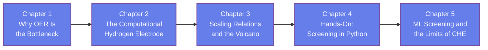

[AI Terakoya Top](<../../index.html>)›[Materials Informatics Dojo](<../index.html>)›[Computational Chemistry of OER](<index.html>)

🌐 EN | [🇯🇵 JP](<../../../jp/MI/oer-computational-chemistry/index.html>) | Last sync: 2026-08-18

[← Back to Materials Informatics Dojo](<../index.html>)

## 🎯 Series Overview

Splitting water is the cleanest route to hydrogen, and the reaction that makes it hard is not the one that produces the hydrogen. It is the other half — the **oxygen evolution reaction**, four proton-electron transfers that must be pushed through in sequence, and the origin of most of the energy loss in a working electrolyzer. This series is about how computational chemistry gets a grip on that reaction: what can be calculated, how, and — the part that matters most — what the calculation is not telling you.

The route runs from the mechanism to a working screening pipeline. We set up the four-step mechanism and explain why four electrons is the problem; build the **computational hydrogen electrode**, the reference trick that lets a DFT code with no electrons-in-solution model produce an electrochemical free-energy diagram; derive the **scaling relation** between intermediates and the volcano plot that follows from it; implement the screening loop in **Python**; and finish by putting a machine-learned model in front of that loop and stating, plainly, the five things the computational hydrogen electrode cannot see.

This is a series of the **Materials Informatics Dojo**, and it complements [MI Applications to Catalyst Design](<../catalyst-mi-application/index.html>). That series works at the data-driven layer — descriptors, activity models, Bayesian optimization, active learning. This one works one layer underneath it, on the physics that produces the descriptors in the first place. Read either first; read both to see how the layers join.

It is written for **materials researchers who want the physics behind catalyst informatics**: people who can run or read an ML screening study and want to know what \\(\Delta G_{\mathrm{OH}}\\) actually is, why the volcano has a peak, and where a computed overpotential stops being trustworthy. **No electrochemistry background is assumed.**

> **A promise about numbers, stated up front.** Every numerical value in this series is either a definition, a unit conversion, or an **illustrative value we invented for teaching** — and each one is labelled as such where it appears. No number here is attributed to a real material, a real measurement, or a real published calculation. The scaling-relation offset is quoted as "roughly 3.2 eV" because that is the honest precision of a trend, not a constant of nature. If you need a number for your own work, get it from a primary source, not from a tutorial.

### Learning Path

### 📋 Learning Objectives

  * Explain why the oxygen evolution reaction, not hydrogen evolution, is the bottleneck of electrochemical water splitting
  * Construct a free-energy diagram with the computational hydrogen electrode, including the reference trick and the corrections that turn electronic energies into free energies
  * Derive the scaling relation between adsorbed intermediates and show why it caps the volcano plot at a nonzero overpotential
  * Implement a descriptor-based screening loop in Python and read a theoretical overpotential off the result
  * State the limits of the computational hydrogen electrode — kinetics, real surfaces, solvation, stability, and functional dependence — and judge a screening claim against them

### 📖 Prerequisites

**Basic thermodynamics** is the one genuine requirement: Gibbs free energy, the meaning of \\(\Delta G\\) for a reaction step, and the idea that a spontaneous step is downhill in free energy. If you have taken an introductory physical chemistry course, you have enough.

**Python** is needed for the hands-on work in Chapters 4 and 5. The code uses **NumPy** only — no chemistry package, no machine-learning library — and is written to be read line by line and fully explained.

**No electrochemistry background is required.** Electrode potential, overpotential, the standard hydrogen electrode, and the four-step OER mechanism are all built up from the beginning. Familiarity with DFT is helpful for context but is not assumed; this series treats a DFT calculation as a black box that returns a total energy, and concerns itself with what you do with those energies afterwards.

Chapter 1

Why OER Is the Bottleneck

Understand what makes oxygen evolution the expensive half of water splitting. Meet the four-electron mechanism and its three surface intermediates, see what overpotential means and where the energy actually goes in an electrolyzer, and understand why a reaction that is thermodynamically fixed at 1.23 V is practically much more costly.

Water Splitting Four-Electron Mechanism Overpotential Surface Intermediates Why Four Is Hard

⏱️ 20-25 minutes

[Read Chapter 1 →](<chapter-1.html>)

Chapter 2

The Computational Hydrogen Electrode

Learn the trick that makes electrochemistry computable. See how referencing the proton-electron pair to half a hydrogen molecule removes the intractable solvated proton from the calculation, how applied potential enters as a simple linear shift, and how zero-point and entropy corrections turn DFT energies into a free-energy diagram.

CHE Reference Trick Free-Energy Diagram Potential as a Shift ZPE and Entropy Corrections

⏱️ 25-30 minutes

[Read Chapter 2 →](<chapter-2.html>)

Chapter 3

Scaling Relations and the Volcano

Learn why one number can stand in for a whole surface. Derive the correlation between the binding energies of the intermediates, see why it collapses four free-energy steps onto a single descriptor axis, and build the volcano plot whose peak sits at a nonzero overpotential — the ceiling that the scaling relation imposes on an entire family of materials.

Scaling Relations Descriptors Volcano Plot Sabatier Principle The Ceiling

⏱️ 25-30 minutes

[Read Chapter 3 →](<chapter-3.html>)

Chapter 4

Hands-On: Screening in Python

Build the screening loop yourself. Assemble free energies for a set of fictitious candidates, apply the CHE construction step by step, compute theoretical overpotentials, and rank the candidates on a volcano — all in NumPy, with every intermediate quantity visible and every value labelled as the teaching illustration it is.

NumPy Implementation Free-Energy Steps Overpotential Calculation Candidate Ranking Volcano Construction

💻 NumPy hands-on ⏱️ 30-35 minutes

[Read Chapter 4 →](<chapter-4.html>)

Chapter 5

ML Screening and the Limits of CHE

Generalize the descriptor into a learned model, then find out what the whole framework cannot see. Fit a ridge model in plain NumPy and watch its error grow silently outside the training range, survey the strategies for breaking the scaling relation, and work through the five honest limits of the computational hydrogen electrode — kinetics, real surfaces, solvation, stability, and functional dependence.

ML Screening Screening Funnel Extrapolation Risk Breaking Scaling Relations The Five Limits

💻 NumPy hands-on ⏱️ 25-30 minutes

[Read Chapter 5 →](<chapter-5.html>)

## 📚 Recommended Learning Paths

### Pattern 1: Beginner - Full Tour (5 days)

  * Day 1: Chapter 1 (Why OER is the bottleneck)
  * Day 2: Chapter 2 (The computational hydrogen electrode)
  * Day 3: Chapter 3 (Scaling relations and the volcano)
  * Day 4: Chapter 4 (Build the screening loop)
  * Day 5: Chapter 5 (ML screening and the honest limits) + Review

### Pattern 2: Intermediate - Fast Track (3 days)

  * Day 1: Chapters 1-2 (Mechanism and the CHE construction)
  * Day 2: Chapters 3-4 (Scaling, the volcano, then the working loop)
  * Day 3: Chapter 5 (Limits and honest assessment) + All exercises

### Pattern 3: Practitioner - Straight to the Code (1 day)

  * Skim Chapter 2 for the CHE recipe and the correction terms
  * Read Chapter 3 carefully (the descriptor logic you are about to implement)
  * Work through Chapter 4 with the code running beside you
  * Read Chapter 5 in full before quoting any screening result to anyone

## 🎯 Overall Learning Outcomes

Upon completing this series, you will achieve:

### Knowledge Level

  * ✅ Explain the four-step OER mechanism and why the four-electron requirement makes it the bottleneck
  * ✅ State what the computational hydrogen electrode assumes and what it lets you compute
  * ✅ Explain why the scaling relation exists and how it caps the volcano at a nonzero overpotential
  * ✅ Distinguish a thermodynamic statement from a kinetic one when reading a free-energy diagram

### Practical Skills

  * ✅ Build a free-energy diagram from adsorption energies and read a theoretical overpotential off it
  * ✅ Implement a descriptor-based screening loop in NumPy without a chemistry package
  * ✅ Fit a ridge regression model with the normal equation and evaluate it honestly
  * ✅ Test whether a candidate falls inside a model's applicability domain before trusting its prediction

### Application Ability

  * ✅ Judge a published computational screening study against the five limits of CHE
  * ✅ Decide when a descriptor-based ranking is informative and when it is being over-read
  * ✅ Connect physics-derived descriptors to a materials informatics workflow as features rather than as answers
  * ✅ Recognize when a machine-learning model is extrapolating and treat its output accordingly

## 🛠️ Technologies and Tools Used

### Main Libraries

  * **numpy**
  * **matplotlib**

### Development Environment

  * **Python** : 3.8 or higher
  * **Jupyter Notebook** : Interactive development and visualization
  * **IDE** : VSCode, PyCharm, or similar

### Recommended Tools

  * Google Colab (cloud-based, no setup required)
  * Anaconda Distribution (complete environment)
  * Git (version control for exercises)

## 🚀 Next Steps

### Deep Dive Learning

For more advanced study in this field:

  * Microkinetic Modelling and Electrochemical Barriers
  * Explicit-Solvent and Constant-Potential Electronic Structure Methods
  * Computed Pourbaix Diagrams and Electrochemical Stability Analysis

### Related Series

Expand your knowledge with related topics:

  * [MI Applications to Catalyst Design](<../catalyst-mi-application/index.html>) (the data-driven layer above this one)
  * [Bayesian Optimization](<../bayesian-optimization-introduction/index.html>) (choosing the next calculation or experiment)
  * [Computational Materials Basics](<../computational-materials-basics-introduction/index.html>) (the DFT machinery this series treats as a black box)

### Practical Projects

Apply your skills to hands-on projects:

  * Extend the Chapter 4 screening loop to rank candidates by two objectives instead of one
  * Add an applicability-domain test to the Chapter 5 ridge model and apply it to a held-out set
  * A critical review of one published OER screening study against the five limits in Chapter 5

### ⚠️ Disclaimer

  * This content is provided for educational and informational purposes only and does not constitute professional advice.
  * All content and code examples are provided "AS IS" without warranty of any kind, either express or implied, including but not limited to warranties of accuracy, reliability, completeness, or fitness for a particular purpose.
  * The use of external links, data, tools, and libraries is at your own discretion and risk. The authors and contributors are not responsible for their availability, functionality, or suitability.
  * In no event shall the content creator or contributors be liable for any direct, indirect, incidental, special, exemplary, or consequential damages arising from the use of this content, to the maximum extent permitted by law.
  * Accuracy of information is not guaranteed. Content may contain errors or become outdated.
  * Content is licensed under Creative Commons BY 4.0 unless otherwise specified. Please refer to the license for usage terms.
