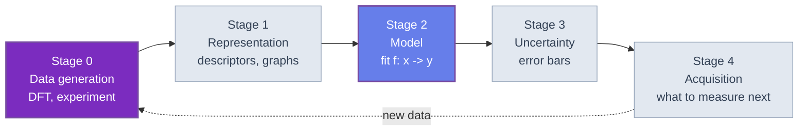

🌐 EN | [🇯🇵 JP](<../../../jp/MI/quantum-machine-learning-introduction/chapter-1.html>) | Last sync: 2026-08-13

[Materials Informatics Dojo](<../index.html>) > [Introduction to Quantum Machine Learning](<index.html>) > Chapter 1

Quantum machine learning is the most oversold subject in quantum technology, and that is why it is worth a careful course. The overselling is not usually dishonest. It comes from a chain of individually reasonable statements — a quantum state of $n$ qubits carries $2^n$ amplitudes; a quantum circuit induces an inner product between data points; that inner product is hard to compute classically — which, laid end to end, sound like an argument that a quantum computer must be a better learner. It is not one, and the gap between the chain and the conclusion is where this chapter lives.

The reader this course is written for already knows how to build a regression model on a table of composition descriptors, already knows that the hard part is the data and not the fitting, and has been asked at least once whether quantum computing will change any of that. This chapter's job is to make that question precise enough to answer. That means four things: a taxonomy that separates the four different subjects the phrase "quantum machine learning" is used for; an honest statement of the case for and the case against; a map of where in an actual materials-informatics pipeline a quantum processor could plausibly attach; and an evaluation protocol strict enough that the remaining chapters cannot cheat, including when they would like to.

The chapter ends with the toolkit the whole course runs on: the mini state-vector simulator re-listed from the sister course, the synthetic materials dataset every experiment uses, a classical ridge baseline that fixes the number to beat, and — already in Chapter 1 — two results that preview the two honest doubts. One of them is a quantum feature map that genuinely beats the linear baseline, together with a demonstration that it does so for reasons a pocket calculator could reproduce. That result is the course in miniature.

## Learning Objectives

After completing this chapter, you will be able to:

  * Place any QML proposal in the four-quadrant taxonomy — classical or quantum *data*, classical or quantum *processing* — and explain why the quadrant, not the algorithm, decides how plausible the claim is
  * State the case for QML (exponential state space, implicit feature maps, universality of data re-uploading) and the four standing objections to it (the input problem, the output problem, dequantization, concentration), and say which of the four each chapter of this course addresses
  * Identify the five stages of a descriptor-to-property materials pipeline and, for each, name the candidate quantum role and the honest current verdict on it
  * Apply the equal-budget evaluation protocol — fixed split, matched parameter count, model selection on training data only, a trivial baseline, a noise floor, a paired uncertainty on every reported difference, and an explicit shot cost
  * Re-derive the course's classical baseline from the closed-form ridge solution and reproduce its test RMSE on the shared synthetic dataset
  * Demonstrate numerically that a product-state quantum feature map is exactly reproducible in closed form, and that a hardware-efficient quantum kernel loses contrast as the register grows

### Conventions and Ground Rules

Six conventions are fixed here and used without restatement for the rest of the course.

**Qubit ordering and the simulator.** Qubit 0 is the leftmost and most significant bit, exactly as in [Introduction to Quantum Computing](<../../FM/quantum-computing-introduction/index.html>). The simulator of that course's Chapter 2 is re-listed unchanged in Code Example 1, and its API — `ket`, `apply_gate`, `cnot`, `probs`, `sample`, `expval` — is the only quantum interface this course uses. There is no SDK, no vendor backend, and no hardware anywhere in these five chapters.

**One dataset.** Every experiment in Chapters 1 through 5 runs on the synthetic dataset of Code Example 2: 60 rows, four composition-like descriptors in $[0,1]$, one formation-energy-like target. It is generated by a fixed seed, so every number printed in this course is reproducible on any machine. It is also *synthetic*, which means no result here is evidence about real materials data; it is evidence about the *methods*, which is what a methods course should be about.

**One split.** Training set = the first 40 rows. Test set = the last 20 rows. The split is deterministic and is never re-drawn, so numbers from any chapter are directly comparable with numbers from any other.

**Angular arguments in units of $\pi$.** Encoding angles are written $\pi x_j$ with $x_j \in [0,1]$, so a descriptor sweeps a rotation from $0$ to $\pi$. This is the convention Chapter 2 uses when it costs out the alternatives.

**Metrics.** Regression quality is reported as root-mean-square error on the test rows, with the coefficient of determination $R^2$ alongside it. Every difference between two models is reported with a paired bootstrap interval, for the reason Section 1.4 gives.

**Notation for the taxonomy.** A two-letter label such as CQ means *classical data, quantum processing*: the first letter is the data, the second is the processing. The literature is not consistent about this ordering, so check it whenever you read a paper.

* * *

## 1.1 Four Quadrants, Not One Subject

"Quantum machine learning" names at least four distinct research programmes, and almost every confused argument about it comes from mixing two of them. The separation that does the most work is a two-by-two: is the *data* classical or quantum, and is the *processing* classical or quantum?

| | Classical processing | Quantum processing |
| --- | --- | --- |
| **Classical data** | **CC** — ordinary machine learning. Everything materials informatics does today. | **CQ** — quantum kernels, variational quantum models, quantum neural networks on a descriptor table. **This course.** |
| **Quantum data** | **QC** — classical ML on data produced by quantum simulation or quantum experiment. Machine-learned interatomic potentials trained on DFT; classical shadows post-processed by a classical learner. | **QQ** — a quantum sensor or quantum simulation feeding a quantum processor without an intervening measurement. Strongest theory, no data yet. |

Each quadrant deserves a sentence of its own, because their prospects are not remotely alike.

**CC is the incumbent, and it is very strong.** The baseline a quantum method has to beat is not a straw man. Gradient boosting and kernel methods on composition descriptors, and graph neural networks on structures, are mature, cheap, and backed by decades of engineering — see [Materials Informatics Introduction](<../mi-introduction/index.html>) and [Introduction to Composition-Based Features](<../composition-features-introduction/index.html>) for what that incumbent actually looks like. Nothing in this course is an argument against using them.

**CQ is the hyped quadrant, and it is the one this course is about.** You have a table of numbers on a classical disk and you want a quantum processor to learn from it. This is the quadrant of quantum kernel methods (Chapter 3) and variational quantum circuits (Chapter 4). It is also the quadrant where all four of Section 1.2's objections bite hardest, because getting classical data into a quantum state and getting a real number back out are precisely the two operations that a quantum computer does badly.

**QC is where quantum technology has already changed materials science, and it is not usually called QML.** A machine-learned interatomic potential trained on density-functional data is a classical model learning from data that only a quantum-mechanical calculation could have produced. This is the pattern behind [Machine Learning Potential (MLP) Introduction](<../mlp-introduction/index.html>), and it is worth noticing that it is a *quantum data* success story with no quantum computer in it. The natural extension — replace DFT with a quantum-computed energy from a variational eigensolver — belongs to [Introduction to Quantum Computing](<../../FM/quantum-computing-introduction/index.html>), Chapters 3 and 4, and is arguably the most credible quantum contribution to materials research on the table.

**QQ has the strongest theorems and the least data.** The sharpest known separations — settings where a quantum learner provably needs exponentially fewer samples than any classical learner — live here, and they rely on the data itself being a quantum state that is never measured into a classical record. Chapter 5 returns to this, because it is the honest answer to "so is there *anything* provably quantum about quantum machine learning". There is. It is just not the thing being sold.

### Why the Quadrant Matters More Than the Algorithm

Two observations follow immediately, and they are worth stating before any mathematics.

The first is that a quantum *advantage* proved in one quadrant says nothing about another. A sample-complexity separation for quantum data does not transfer to a descriptor table, because the mechanism of the separation is that the data was never classical. Conversely, a negative result about loading classical data says nothing about the QQ quadrant. Papers routinely prove something in QQ and motivate it with a CQ application.

The second is that the *bottleneck* is different in each quadrant. In CQ the bottleneck is the interface — encoding in, measurement out. In QC the bottleneck is generating the data at all, which is a quantum-simulation problem and not a learning problem. Improving a learning algorithm helps only in the quadrant where learning is the bottleneck, and in CQ it usually is not.

* * *

## 1.2 The Case For, and the Four Standing Objections

### The Case For

Four arguments recur, and each is correct as far as it goes.

**The state space is exponentially large.** A register of $n$ qubits has a state described by $2^n$ complex amplitudes. Thirty qubits already carry more amplitudes than there are rows in any materials database. If a model's expressive power tracked the dimension of the space it computes in, this would settle the matter.

**Encoding induces a feature map, and the feature map has an inner product.** Write $x \mapsto |\phi(x)\rangle$ for the state a circuit prepares from a data row $x$. Then

$$ k(x, x') = \left| \langle \phi(x) | \phi(x') \rangle \right|^2 $$

is a positive-semidefinite kernel, so every tool from kernel theory applies immediately: representer theorems, kernel ridge regression, support vector machines. This is the observation that turned QML from a collection of circuit heuristics into something with a theory, and Chapter 3 develops it properly. The feature space is the $2^n$-dimensional one, and it is never written down — only the kernel is evaluated, exactly as in the classical kernel trick.

**Even one qubit is a universal approximator, if you re-upload.** A single qubit, alternating data-dependent rotations with trainable rotations, realizes a Fourier series in the input whose number of accessible frequencies grows with the number of re-uploads. Expressive power is not bounded by the qubit count. Chapter 2 makes this quantitative.

**Some of these models are classically hard to simulate.** Sampling from the output of a sufficiently deep random circuit is believed to be intractable classically. A model class that a classical computer cannot even *simulate* feels like it must be able to do something a classical model cannot.

### The Four Standing Objections

Each of the four arguments above has a specific answer, and the answers are not rhetorical.

**1. The input problem.** The exponential is spent before the computation begins. To use $N$ data rows of $d$ descriptors, something has to read $Nd$ classical numbers, and reading them is $\Omega(Nd)$ work no matter what happens next. Worse, the encoding scheme that actually exploits the $2^n$ amplitudes — amplitude encoding, which packs $2^n$ numbers into one state — requires a state-preparation circuit whose depth is generically exponential in $n$. The cheap encodings (basis, angle) use one qubit per feature and therefore never touch the exponential space in the first place. Chapter 2 is entirely about this trade, because it is the real bottleneck of the CQ quadrant and it is almost always glossed over.

**2. The output problem.** Everything a quantum model reports is the mean of $\pm 1$ measurement outcomes. After $S$ shots the standard error of such a mean is at most $1/\sqrt{S}$, so three decimal places cost a million shots — per number. Code Example 4 turns this into a price list. Two consequences follow. Any claimed advantage smaller than the shot noise of the experiment that measured it is not an advantage. And reading out a genuinely $2^n$-dimensional answer requires $O(2^n)$ measurements, which cancels exactly the resource the first argument was appealing to.

**3. Dequantization.** Beginning with Ewin Tang's 2018 result on recommendation systems, a series of papers showed that several celebrated exponential speedups in quantum linear algebra were artifacts of an unfair comparison: the quantum algorithm was granted a special data structure (efficient state preparation), while the classical algorithm was not granted its analogue (sample-and-query access to the same data). Given the analogous access, classical algorithms with polylogarithmic dependence on dimension exist too, and the exponential separation evaporates, leaving a large polynomial one. The same pattern has since been found for several quantum kernel constructions, which turn out to have efficient classical surrogates. Chapter 5 treats this in full; Code Example 5 in this chapter is a miniature instance of it, and the miniature is embarrassingly clean.

**4. Concentration.** Expressive feature maps are self-defeating. If $|\phi(x)\rangle$ explores the state space thoroughly, then two different inputs give nearly orthogonal states, so $k(x,x') \to 0$ for every pair $x \ne x'$: the kernel matrix converges to the identity, every point becomes its own island, and there is nothing left to generalize from. The same phenomenon in the variational setting is the barren-plateau problem — gradients vanishing exponentially in the qubit count — which [Introduction to Quantum Computing](<../../FM/quantum-computing-introduction/index.html>) covers in its Chapter 3 and which Chapter 4 here revisits in its machine-learning form. Code Example 6 measures the onset of concentration on this course's own dataset.

There is a fifth objection that is less often stated and is arguably the most important.

**5. Hard to simulate is not the same as good at learning.** Generalization comes from a hypothesis class whose *bias* matches the structure of the data, not from a large hypothesis class. A model family that a classical computer cannot simulate is a family whose functions are unusual; there is no reason for unusual to mean *appropriate for formation energies*. The no-free-lunch framing is the right one: expressive power without a matching prior buys nothing, and Chapter 4's overfitting experiments make the point with numbers.

| The claim | What is actually established | What would have to be true for the claim |
| --- | --- | --- |
| "$2^n$-dimensional feature space" | The Hilbert space has that dimension | The learner would have to access it without paying $2^n$ in preparation or readout |
| "Quantum kernels are classically hard" | True for specific constructed kernels | The hardness would have to coincide with usefulness on the dataset at hand |
| "Exponential speedup for linear algebra" | Holds under a state-preparation assumption | The classical algorithm would have to be denied the analogous access — and it is not |
| "More qubits, more expressive" | True for the function class | Expressivity would have to improve generalization, not destroy it by concentration |
| "Universal approximation with one qubit" | True, with enough re-uploads | Universality would have to imply sample efficiency, which it does not |

One row is deliberately absent from that table, and a course this sceptical owes the reader the strongest result on the other side rather than a footnote. A rigorous quantum advantage in the CQ quadrant does exist. Liu, Arunachalam and Temme exhibited a classification problem built on the discrete logarithm for which a quantum kernel attains high accuracy while, under standard cryptographic assumptions, no classical learner runs in polynomial time. That is a theorem about *classical data and quantum processing*, and it settles the question of whether the quadrant can contain a separation at all: it can. What it does not do is transfer. The hardness is group-theoretic, the feature map is the one the hardness is defined by, and nothing in the construction suggests that formation energies carry discrete-logarithm structure — its authors claim no such thing. So the accurate summary of CQ is not "no separation exists"; it is "a separation exists for a problem built to have one, and no materials-informatics problem is known to be of that kind". This course's negative results are about the second clause.

### What This Course Concludes, Stated Up Front

There is no suspense to preserve. On the CQ quadrant, this course finds no evidence of a quantum advantage on materials-informatics-shaped problems, and Chapters 3 and 4 report the negative results in the same detail as the positive ones. What it does find is that the *kernel view* of quantum models is genuinely clarifying, that the encoding step is where the real research problem is, and that the QC and QQ quadrants — quantum data — are where a materials researcher should expect quantum technology to actually matter. Chapter 5 assembles that argument.

* * *

## 1.3 Where Quantum Could Enter a Materials Pipeline

Abstract discussion of advantage is less useful than asking where, in a pipeline that already exists, a quantum processor could be attached. A descriptor-to-property workflow has five stages.



| Stage | Candidate quantum role | What it would need | Honest verdict |
| --- | --- | --- | --- |
| 0. Data generation | Compute energies and spectra by quantum simulation instead of DFT, for systems where DFT is unreliable | Fault-tolerant or heavily error-mitigated devices; the resource estimates are in the sister course | **The strongest case.** Quantum data, classical learning: the QC quadrant. Not this course's subject, and not this course's doubt either |
| 1. Representation | A quantum feature map replacing or augmenting a descriptor vector | An encoding whose induced inner product matches the physics of the property | Open, and the most interesting open problem in CQ. Chapter 2 |
| 2. Model | Quantum kernel ridge regression; a variational quantum circuit as the regressor | Kernels that do not concentrate; trainable circuits without barren plateaus | No advantage demonstrated at matched budget. Chapters 3 and 4 |
| 3. Uncertainty | Quantum-kernel Gaussian processes | Everything stage 2 needs, plus a calibrated posterior | Nothing beyond what the classical kernel view already gives |
| 4. Acquisition | Quantum optimization over a discrete candidate set | A combinatorial-optimization advantage, which is a separate literature | Out of scope; see [Bayesian Optimization and Active Learning](<../bayesian-optimization-introduction/index.html>) for the classical state of the art |

Three points about this table are worth making explicitly, because they are the reason the course is organized the way it is.

**The highest-value stage is stage 0, and it needs no machine learning at all.** A quantum computer that produces accurate energies for a strongly correlated system contributes to materials science by generating data, and the learner that consumes the data can be an ordinary classical model. This is not a disappointing conclusion; it is a redirection of effort towards the thing that is actually hard.

**Stage 1 is where the research problem is, and it is a physics problem.** A quantum feature map is only useful if the inner product it induces reflects something true about the material — a symmetry, a locality structure, a spectrum. Choosing an encoding because it is easy to compile is choosing a prior at random. Chapter 2 spends its entire length on this, and Section 1.5's Example 5 shows what happens when the encoding is chosen for convenience: the model works, and it works for entirely classical reasons.

**Stages 2 and 3 are where the marketing is.** They are also the stages where the classical incumbent is strongest and cheapest, which is exactly the wrong place to look for an advantage.

* * *

## 1.4 The Evaluation Protocol

This section is the constitution of the course. Every experiment in Chapters 2 through 5 obeys it, and the rules are written down here so that a reader can check.

The motivation is uncomfortable but simple: nearly every reported quantum-advantage-on-a-dataset result in the literature has at least one of the flaws below, and most have several. The flaws are not fraud. They are what happens when a comparison is set up by someone who wants one side to win.

### The Seven Rules

**R1. One split, fixed in advance.** Train on the first 40 rows, test on the last 20. Never re-draw the split, never report the best of several splits, never let a test row influence anything.

**R2. Matched parameter count.** A quantum model with $p$ trainable parameters is compared with a classical model with the same $p$, not with a classical model chosen to be weak. If the quantum model has 24 parameters, the classical competitor is a network or a feature expansion with about 24.

**R3. Matched data.** The same 40 training rows, in the same order, with no additional feature engineering on one side only.

**R4. Model selection never touches the test set.** Hyperparameters — ridge penalties, kernel bandwidths, circuit depths, learning rates — are chosen on the training rows alone. Which estimator does the choosing depends on what is being fitted, and the convention is stated once here rather than re-argued in each chapter: **leave-one-out** cross-validation over the 40 training rows in this chapter, where a refit is a $5\times5$ solve and forty of them cost nothing; **five-fold** cross-validation over the same 40 rows from Chapter 2 onward, where a refit is a kernel solve; and, for the iteratively trained models of Chapter 4, a fixed **30/10 split** of the training rows, because a learning rate and a stopping step have to be chosen against a curve rather than a single fit. What never varies is the rule: a number selected with the help of a test row is not a test number.

**R5. Report the trivial baselines and the noise floor.** Two numbers bracket every result, and it is worth being careful about which end is which, because what is bracketed is the *error*. The **upper** bracket is the error of predicting the training mean, $0.5242$ in RMSE on this dataset; a model that does not come in well below it has done nothing. The **lower** bracket is the irreducible noise, $0.0507$, which is the test RMSE of the *perfect* model — one that has recovered the generating function exactly and is still wrong by the noise it cannot see. So a model at $0.52$ has learned nothing, a model at $0.05$ has learned everything there was to learn, and a model *below* $0.05$ has a leak rather than a discovery. Every result in this course is quoted against both numbers.

**R6. Every difference carries an interval, and the interval is paired.** A test RMSE computed on 20 rows is a random variable. Its 95% bootstrap interval on this dataset is about $0.085$ wide — larger than most claimed quantum improvements in the literature. Differences between two models must be assessed by resampling the *same* rows for both models, because pairing removes the dominant source of variance. Code Example 4 implements this, and it immediately kills a classical improvement that looked convincing.

**R7. Count the shots.** A quantum number obtained from exact state-vector expectation values is a statement about a mathematical model, not about a device. Every quantum result in this course therefore also reports what it would have cost in shots at a stated precision. A method that needs $10^9$ shots to match a closed-form classical model has not matched it.

### What a Win Would Have to Look Like

Assembling the rules gives a falsifiable target. A quantum model would have demonstrated an advantage on this course's problem if, and only if, it achieved a test RMSE whose paired bootstrap interval against the best matched-budget classical model lies entirely below zero, using no more training data, no more parameters, and a shot budget that is stated and not absurd. None of Chapters 2 through 5 achieves this, and each says so.

### Common Failure Modes, Named

| Failure | How it looks in a paper | The rule it breaks |
| --- | --- | --- |
| Weak baseline | Quantum kernel SVM compared with linear regression | R2 |
| Baseline undertuned | Classical hyperparameters left at defaults, quantum ones swept | R2, R4 |
| Test-set selection | "We chose the circuit depth that generalized best" | R4 |
| Split shopping | Results on "a favourable train/test split" | R1 |
| No uncertainty | RMSE quoted to four digits on 20 test points | R6 |
| Tiny data | 20 samples, 8 features, and a claimed advantage | R6 |
| Simulated shots ignored | Exact expectation values presented as device results | R7 |
| Dataset chosen after the fact | The one dataset out of nine where quantum won | R1, R6 |

The literature on classical model evaluation has been through all of this already, and its conclusions transfer without modification: see [Model Evaluation Introduction](<../../ML/model-evaluation-introduction/index.html>) for the classical treatment. Nothing about quantum hardware creates a new statistics.

* * *

## 1.5 The Toolkit: Simulator, Dataset, Baseline, Protocol

The six examples below are the working apparatus of the course. They run in one session, in order: Example $N$ assumes the names defined by Examples $1$ through $N-1$. Examples 1 to 3 build the shared ground; Example 4 makes Section 1.4 executable; Examples 5 and 6 are the first two honest results.

### Code Example 1: The Mini-Simulator, Re-listed

The simulator is reproduced verbatim from [Introduction to Quantum Computing](<../../FM/quantum-computing-introduction/index.html>), Chapter 2, so that this course is self-contained without inventing a second convention. One hundred and forty-eight lines, NumPy only, big-endian ordering: one hundred and four for the simulator itself and forty-four for a self-check. The self-check verifies the three properties the rest of the course leans on: that `apply_gate` agrees with an explicit Kronecker product, that $\langle Z \rangle = \cos\theta$ and $\langle X \rangle = \sin\theta$ after an $R_Y(\theta)$ on $|0\rangle$, and that `sample` is reproducible from a seed.

```python
"""Chapter 1, Example 1: the mini state-vector simulator, re-listed in full.

Byte-identical to the simulator built in Introduction to Quantum Computing,
Chapter 2. Big-endian ordering: qubit 0 is the leftmost and most significant
bit. NumPy only. Every later example in this course continues from this block
in the same session.
"""
import numpy as np

# ---- single-qubit gates -------------------------------------------------
I2 = np.eye(2, dtype=complex)
X = np.array([[0, 1], [1, 0]], dtype=complex)
Y = np.array([[0, -1j], [1j, 0]], dtype=complex)
Z = np.array([[1, 0], [0, -1]], dtype=complex)
H = np.array([[1, 1], [1, -1]], dtype=complex) / np.sqrt(2)
S = np.array([[1, 0], [0, 1j]], dtype=complex)
T = np.array([[1, 0], [0, np.exp(1j * np.pi / 4)]], dtype=complex)


def rx(theta):
    c, s = np.cos(theta / 2), np.sin(theta / 2)
    return np.array([[c, -1j * s], [-1j * s, c]], dtype=complex)


def ry(theta):
    c, s = np.cos(theta / 2), np.sin(theta / 2)
    return np.array([[c, -s], [s, c]], dtype=complex)


def rz(theta):
    e = np.exp(-1j * theta / 2)
    return np.array([[e, 0], [0, np.conj(e)]], dtype=complex)


# ---- states -------------------------------------------------------------
def ket(bits: str) -> np.ndarray:
    """'01' -> the 4-dimensional basis state |01> (big-endian)."""
    n = len(bits)
    psi = np.zeros(2 ** n, dtype=complex)
    psi[int(bits, 2)] = 1.0
    return psi


def apply_gate(state, U, targets, n):
    """Apply the 2^k x 2^k unitary U to the listed target qubits of an n-qubit state."""
    k = len(targets)
    psi = state.reshape([2] * n)          # 1. view as an n-index tensor
    psi = np.moveaxis(psi, targets, range(k))   # 2. bring targets to the front
    rest = psi.shape[k:]
    psi = psi.reshape(2 ** k, -1)         # 3. flatten and multiply
    psi = U @ psi
    psi = psi.reshape(list((2,) * k) + list(rest))
    psi = np.moveaxis(psi, range(k), targets)   # 4. put the axes back
    return psi.reshape(-1)


CNOT4 = np.array([[1, 0, 0, 0],
                  [0, 1, 0, 0],
                  [0, 0, 0, 1],
                  [0, 0, 1, 0]], dtype=complex)


def cnot(state, control, target, n):
    """CNOT with the given control and target; any pair of qubits, any order."""
    return apply_gate(state, CNOT4, [control, target], n)


def probs(state):
    """Born-rule probabilities of all 2^n outcomes."""
    return np.abs(state) ** 2


def sample(state, shots, seed=None):
    """Simulated measurement: {bitstring: count}."""
    n = int(np.log2(state.size))
    rng = np.random.default_rng(seed)
    idx = rng.choice(state.size, size=shots, p=probs(state))
    out = {}
    for i in idx:
        b = format(i, f'0{n}b')
        out[b] = out.get(b, 0) + 1
    return dict(sorted(out.items()))


PAULI = {'I': I2, 'X': X, 'Y': Y, 'Z': Z}


def expval(state, pauli, coeff_map=None):
    """Expectation value of a Pauli string such as 'ZZ', 'XI' (one character per qubit).

    If coeff_map is given, the result is multiplied by coeff_map[pauli], so that a
    whole Hamiltonian is one line:  sum(expval(psi, p, terms) for p in terms).
    """
    n = len(pauli)
    phi = state.copy()
    for q, ch in enumerate(pauli):
        if ch != 'I':
            phi = apply_gate(phi, PAULI[ch], [q], n)
    val = np.vdot(state, phi).real
    if coeff_map is not None:
        val *= coeff_map.get(pauli, 1.0)
    return val


# ---- self-check: the contract this course relies on ---------------------
from functools import reduce


def kron_all(mats):
    return reduce(np.kron, mats)


print("Big-endian index convention")
for bits in ['0', '1', '0100', '1000']:
    print(f"  ket('{bits}') -> index {int(np.argmax(np.abs(ket(bits))))}"
          f" of dimension {2**len(bits)}")

print("\napply_gate vs an explicit Kronecker product (n = 4)")
rng = np.random.default_rng(0)
n = 4
psi = rng.normal(size=2**n) + 1j * rng.normal(size=2**n)
psi /= np.linalg.norm(psi)
for t in range(n):
    ref = kron_all([ry(0.7) if i == t else I2 for i in range(n)]) @ psi
    print(f"  RY(0.7) on qubit {t}: max deviation ="
          f" {np.max(np.abs(apply_gate(psi, ry(0.7), [t], n) - ref)):.2e}")

print("\nExpectation values on a known state")
# RY(theta)|0> = cos(theta/2)|0> + sin(theta/2)|1>, so <Z> = cos(theta) and
# <X> = sin(theta). This identity is the whole of angle encoding, and it is
# what Section 1.5 measures.
for theta in [0.0, 0.5, np.pi / 3, np.pi]:
    phi = apply_gate(ket('0'), ry(theta), [0], 1)
    print(f"  theta = {theta:7.4f}   <Z> = {expval(phi, 'Z'):+.6f}"
          f" (cos = {np.cos(theta):+.6f})"
          f"   <X> = {expval(phi, 'X'):+.6f} (sin = {np.sin(theta):+.6f})")

print("\nNormalisation, sampling and coefficient maps")
psi2 = apply_gate(apply_gate(ket('00'), ry(0.6), [0], 2), ry(np.pi / 4), [1], 2)
psi2 = cnot(psi2, 0, 1, 2)
print(f"  sum of probs                = {probs(psi2).sum():.12f}")
print(f"  sample(psi2, 8, seed=0)     = {sample(psi2, 8, seed=0)}")
print(f"  sample(psi2, 8, seed=0)     = {sample(psi2, 8, seed=0)}   (identical)")
terms = {'ZI': 0.5, 'IZ': -0.25, 'XX': 0.75}
print(f"  <ZI>, <IZ>, <XX>            = "
      + ", ".join(f"{expval(psi2, p):+.6f}" for p in terms))
print(f"  sum_p coeff[p] <p>          = "
      f"{sum(expval(psi2, p, terms) for p in terms):+.6f}")
```

```text
Big-endian index convention
  ket('0') -> index 0 of dimension 2
  ket('1') -> index 1 of dimension 2
  ket('0100') -> index 4 of dimension 16
  ket('1000') -> index 8 of dimension 16

apply_gate vs an explicit Kronecker product (n = 4)
  RY(0.7) on qubit 0: max deviation = 0.00e+00
  RY(0.7) on qubit 1: max deviation = 1.39e-17
  RY(0.7) on qubit 2: max deviation = 3.47e-18
  RY(0.7) on qubit 3: max deviation = 1.39e-17

Expectation values on a known state
  theta =  0.0000   <Z> = +1.000000 (cos = +1.000000)   <X> = +0.000000 (sin = +0.000000)
  theta =  0.5000   <Z> = +0.877583 (cos = +0.877583)   <X> = +0.479426 (sin = +0.479426)
  theta =  1.0472   <Z> = +0.500000 (cos = +0.500000)   <X> = +0.866025 (sin = +0.866025)
  theta =  3.1416   <Z> = -1.000000 (cos = -1.000000)   <X> = +0.000000 (sin = +0.000000)

Normalisation, sampling and coefficient maps
  sum of probs                = 1.000000000000
  sample(psi2, 8, seed=0)     = {'00': 6, '01': 1, '10': 1}
  sample(psi2, 8, seed=0)     = {'00': 6, '01': 1, '10': 1}   (identical)
  <ZI>, <IZ>, <XX>            = +0.825336, +0.583600, +0.564642
  sum_p coeff[p] <p>          = +0.690250
```

**What to look for.** The middle block is the identity that Sections 1.5 and beyond are built on. Applying $R_Y(\theta)$ to $|0\rangle$ gives $\cos(\theta/2)|0\rangle + \sin(\theta/2)|1\rangle$, whose Pauli expectations are exactly $\langle Z \rangle = \cos\theta$ and $\langle X \rangle = \sin\theta$. Angle encoding therefore turns a descriptor into a pair of trigonometric features and nothing more — a fact that will be inconvenient in Example 5 and decisive in Chapter 5.

The final block is the Hamiltonian convention. `expval` takes exactly one Pauli string per call, and a weighted sum of terms is assembled outside the function by the caller. This is deliberate: it keeps the simulator's contract small, and it makes the shot cost visible, because each term in the sum is a separate measurement in the laboratory.

### Code Example 2: The Synthetic Materials Dataset

Every experiment in this course uses this dataset, generated by this function, with this seed. The descriptor names are illustrative — the point of the construction is the *shape* of the problem, not any claim about real chemistry: four bounded descriptors, a smooth target with one genuinely non-additive term, and a small amount of noise.

```python
"""Chapter 1, Example 2: the synthetic materials dataset.
Continues from Example 1 (same session)."""


def make_materials_dataset(n=60, seed=7):
    """Synthetic composition-descriptor -> formation-energy-like regression set.
    4 descriptors in [0,1]; smooth nonlinear target + mild noise. Deterministic."""
    rng = np.random.default_rng(seed)
    X = rng.uniform(0.0, 1.0, (n, 4))
    y = (np.sin(np.pi * X[:, 0]) * np.cos(np.pi * X[:, 1])
         + 0.5 * X[:, 2]**2 - 0.3 * X[:, 3]
         + 0.05 * rng.standard_normal(n))
    return X, y


X, y = make_materials_dataset()
N_TRAIN = 40                      # train = first 40 rows, test = last 20 rows
Xtr, ytr = X[:N_TRAIN], y[:N_TRAIN]
Xte, yte = X[N_TRAIN:], y[N_TRAIN:]

print(f"dataset: X {X.shape}, y {y.shape}")
print(f"split  : train = rows 0..{N_TRAIN-1} ({len(ytr)}),"
      f" test = rows {N_TRAIN}..{len(y)-1} ({len(yte)})")

names = ["x0 (site-A fraction)", "x1 (site-B fraction)",
         "x2 (mean radius)", "x3 (electronegativity spread)"]
print(f"\n{'descriptor':<32}{'min':>9}{'mean':>9}{'max':>9}{'std':>9}")
print("-" * 68)
for j, nm in enumerate(names):
    c = X[:, j]
    print(f"{nm:<32}{c.min():>9.4f}{c.mean():>9.4f}{c.max():>9.4f}{c.std():>9.4f}")
print(f"{'y (formation-energy-like)':<32}{y.min():>9.4f}{y.mean():>9.4f}"
      f"{y.max():>9.4f}{y.std():>9.4f}")

print(f"\nfirst five rows")
print(f"{'row':>4}{'x0':>9}{'x1':>9}{'x2':>9}{'x3':>9}{'y':>10}")
print("-" * 50)
for i in range(5):
    print(f"{i:>4}" + "".join(f"{v:>9.4f}" for v in X[i]) + f"{y[i]:>10.4f}")

# The noise floor. Regenerating the target without its noise term isolates the
# irreducible part of any test error: no model, quantum or classical, can beat
# it on this data.
y_clean = (np.sin(np.pi * X[:, 0]) * np.cos(np.pi * X[:, 1])
           + 0.5 * X[:, 2]**2 - 0.3 * X[:, 3])
noise = y - y_clean
print(f"\nnoise term: std over all 60 rows = {noise.std():.6f}")
print(f"            RMS over the 20 test rows = "
      f"{np.sqrt(np.mean(noise[N_TRAIN:]**2)):.6f}   <- the floor to remember")
print(f"variance of y explained by the noise = "
      f"{noise.var() / y.var() * 100:.2f} %")

# Two trivial reference points that any reported number must clear.
print(f"\ntrivial baselines on the test set")
print(f"  predict the training mean : RMSE = "
      f"{np.sqrt(np.mean((yte - ytr.mean())**2)):.6f}")
print(f"  predict zero              : RMSE = {np.sqrt(np.mean(yte**2)):.6f}")
```

```text
dataset: X (60, 4), y (60,)
split  : train = rows 0..39 (40), test = rows 40..59 (20)

descriptor                            min     mean      max      std
--------------------------------------------------------------------
x0 (site-A fraction)               0.0118   0.5355   0.9955   0.3088
x1 (site-B fraction)               0.0037   0.5231   0.9614   0.2865
x2 (mean radius)                   0.0052   0.4766   0.9787   0.2762
x3 (electronegativity spread)      0.0202   0.5063   0.9890   0.2945
y (formation-energy-like)         -1.2198  -0.0336   1.2142   0.5446

first five rows
 row       x0       x1       x2       x3         y
--------------------------------------------------
   0   0.6251   0.8972   0.7757   0.2252   -0.6472
   1   0.3002   0.8736   0.0053   0.8212   -0.9934
   2   0.7971   0.4679   0.3030   0.2784   -0.0502
   3   0.2549   0.4451   0.5045   0.5535    0.0615
   4   0.9955   0.7927   0.6222   0.9890   -0.0772

noise term: std over all 60 rows = 0.051343
            RMS over the 20 test rows = 0.050656   <- the floor to remember
variance of y explained by the noise = 0.89 %

trivial baselines on the test set
  predict the training mean : RMSE = 0.524164
  predict zero              : RMSE = 0.503541
```

**What to look for.** Three numbers from this output are used repeatedly. The noise floor is $0.0507$ on the test rows: that is the RMSE of a model that has learned the generating function perfectly, and any test RMSE below it is a sign of a leak, not of skill. The training-mean baseline is $0.5242$: that is the RMSE of a model that has learned nothing. And the noise accounts for only $0.89\%$ of the variance of $y$, which means this dataset is dominated by *structure* — a fair test of a model's ability to represent a function, and a deliberately gentle test of its ability to resist noise.

The target's leading term, $\sin(\pi x_0)\cos(\pi x_1)$, is the interesting one. It is not additive in the descriptors, so no linear model can represent it, and it is not a polynomial, so a quadratic expansion only approximates it. Chapter 2 chose that term on purpose: it is the simplest function that an angle-encoded quantum circuit represents exactly and a linear model cannot represent at all, and Example 5 is what happens when that fact is exploited.

### Code Example 3: The Classical Baseline, in Closed Form

Ridge regression on the four raw descriptors, solved by one linear system. Five parameters, no iterations, no library beyond NumPy, and hyperparameter selection by leave-one-out cross-validation on the training rows only. This is the number every later chapter reports against.

```python
"""Chapter 1, Example 3: the classical baseline, in closed form.
Continues from Examples 1 and 2 (same session)."""
import matplotlib.pyplot as plt


def rmse(a, b):
    return float(np.sqrt(np.mean((np.asarray(a) - np.asarray(b))**2)))


def r2(y_true, y_pred):
    y_true = np.asarray(y_true)
    ss_res = np.sum((y_true - np.asarray(y_pred))**2)
    ss_tot = np.sum((y_true - y_true.mean())**2)
    return float(1.0 - ss_res / ss_tot)


def ridge_fit(Phi, y, lam):
    """Closed-form ridge with an unpenalised intercept: w = (A^T A + lam P)^-1 A^T y.

    A is the design matrix with a leading column of ones; P is the identity with
    a zero in the intercept slot, so the offset is never shrunk towards zero.
    One np.linalg.solve, no iterations, no library beyond NumPy.
    """
    A = np.hstack([np.ones((Phi.shape[0], 1)), Phi])
    P = np.diag([0.0] + [1.0] * Phi.shape[1])
    return np.linalg.solve(A.T @ A + lam * P, A.T @ y)


def ridge_predict(Phi, w):
    return np.hstack([np.ones((Phi.shape[0], 1)), Phi]) @ w


def loo_rmse(Phi, y, lam):
    """Leave-one-out CV error, by refitting once per held-out row.

    The training set has 40 rows, so 40 refits of a 5x5 linear system cost
    nothing. Model selection NEVER touches the test set: that is the rule the
    rest of the course is held to.
    """
    errs = []
    for i in range(len(y)):
        keep = np.arange(len(y)) != i
        w = ridge_fit(Phi[keep], y[keep], lam)
        errs.append(y[i] - ridge_predict(Phi[i:i+1], w)[0])
    return float(np.sqrt(np.mean(np.square(errs))))


lambdas = np.logspace(-6, 2, 17)
print("Linear ridge on the four raw descriptors: 5 parameters (4 + intercept)")
print(f"\n{'lambda':>12}{'LOO RMSE':>12}{'train RMSE':>12}{'test RMSE':>12}"
      f"{'test R^2':>11}")
print("-" * 59)
rows = []
for lam in lambdas:
    w = ridge_fit(Xtr, ytr, lam)
    row = (lam, loo_rmse(Xtr, ytr, lam), rmse(ytr, ridge_predict(Xtr, w)),
           rmse(yte, ridge_predict(Xte, w)), r2(yte, ridge_predict(Xte, w)))
    rows.append(row)
    if lam in (lambdas[0], lambdas[4], lambdas[8], lambdas[12], lambdas[16]):
        print(f"{row[0]:>12.2e}{row[1]:>12.6f}{row[2]:>12.6f}{row[3]:>12.6f}"
              f"{row[4]:>11.4f}")

best = min(rows, key=lambda r: r[1])
lam_star = best[0]
w_star = ridge_fit(Xtr, ytr, lam_star)
print(f"\nselected by LOO on the training rows only: lambda* = {lam_star:.3e}")
print(f"  train RMSE = {rmse(ytr, ridge_predict(Xtr, w_star)):.6f}")
print(f"  test  RMSE = {rmse(yte, ridge_predict(Xte, w_star)):.6f}"
      f"   <- THE NUMBER TO BEAT")
print(f"  test  R^2  = {r2(yte, ridge_predict(Xte, w_star)):.4f}")
print(f"  noise floor= {np.sqrt(np.mean(noise[N_TRAIN:]**2)):.6f}")

print(f"\nfitted coefficients")
labels = ["intercept", "x0", "x1", "x2", "x3"]
for nm, v in zip(labels, w_star):
    print(f"  {nm:<10}{v:+.6f}")

# Where the linear model fails, and why. The target's leading term is
# sin(pi x0) cos(pi x1), which is even about x0 = 1/2 and odd about x1 = 1/2;
# no single linear coefficient can represent it.
print(f"\nthe part a linear model cannot see")
print(f"  test RMSE of the linear fit          : "
      f"{rmse(yte, ridge_predict(Xte, w_star)):.6f}")
print(f"  test RMSE against the noise-free y   : "
      f"{rmse(y_clean[N_TRAIN:], ridge_predict(Xte, w_star)):.6f}")
print(f"  so the model error is dominated by structure, not noise:"
      f" {rmse(y_clean[N_TRAIN:], ridge_predict(Xte, w_star)) / np.sqrt(np.mean(noise[N_TRAIN:]**2)):.1f}x the floor")

fig, ax = plt.subplots(1, 2, figsize=(11, 4))
ax[0].semilogx([r[0] for r in rows], [r[1] for r in rows], "o-",
               label="leave-one-out (train)")
ax[0].semilogx([r[0] for r in rows], [r[3] for r in rows], "s--",
               label="test")
ax[0].axvline(lam_star, color="k", lw=1, ls=":")
ax[0].set_xlabel("ridge penalty $\\lambda$"); ax[0].set_ylabel("RMSE")
ax[0].set_title("Model selection uses LOO, never the test set")
ax[0].legend(fontsize=8)

ax[1].plot(yte, ridge_predict(Xte, w_star), "o", color="tab:purple")
lims = [min(yte) - 0.2, max(yte) + 0.2]
ax[1].plot(lims, lims, "k-", lw=1)
ax[1].set_xlabel("true y (test)"); ax[1].set_ylabel("predicted y")
ax[1].set_title("Linear ridge: the baseline every chapter reports against")
plt.tight_layout()
plt.show()
```

```text
Linear ridge on the four raw descriptors: 5 parameters (4 + intercept)

      lambda    LOO RMSE  train RMSE   test RMSE   test R^2
-----------------------------------------------------------
    1.00e-06    0.267818    0.228322    0.215685     0.8123
    1.00e-04    0.267816    0.228322    0.215683     0.8123
    1.00e-02    0.267626    0.228328    0.215500     0.8126
    1.00e+00    0.285458    0.255193    0.243393     0.7609
    1.00e+02    0.556769    0.540949    0.510434    -0.0514

selected by LOO on the training rows only: lambda* = 1.000e-01
  train RMSE = 0.228810
  test  RMSE = 0.214636   <- THE NUMBER TO BEAT
  test  R^2  = 0.8141
  noise floor= 0.050656

fitted coefficients
  intercept +0.641944
  x0        +0.045693
  x1        -1.552014
  x2        +0.508459
  x3        -0.293696

the part a linear model cannot see
  test RMSE of the linear fit          : 0.214636
  test RMSE against the noise-free y   : 0.206426
  so the model error is dominated by structure, not noise: 4.1x the floor
```

**What to look for.** The number to beat is a test RMSE of $0.2146$, at $R^2 = 0.814$. It is worth pausing on how respectable that is: five parameters, fitted in microseconds, explain 81% of the variance of a target whose leading term they cannot represent at all. Linear models are strong on smooth low-dimensional problems, and a QML paper that beats only a linear model has not cleared a high bar.

The coefficient table shows how the fit achieves it, and the answer is instructive. The coefficient on $x_0$ is $+0.046$ — effectively zero — because $\sin(\pi x_0)$ is symmetric about $x_0 = 1/2$ and therefore has no linear component over $[0,1]$. The coefficient on $x_1$ is $-1.55$, far larger than the $-0.3$ that the explicit $x_3$ term would suggest, because $\cos(\pi x_1)$ *is* monotonic and the fit uses $x_1$ as a proxy for the whole product term. The model has found the best available linear shadow of a non-linear function.

The last block separates the two sources of error. Measured against the *noise-free* target, the fit's error is $0.2064$, which is $4.1$ times the noise floor. The baseline's error is therefore structural, not statistical: there is real signal left on the table, and a model with the right inductive bias should be able to take it. Chapters 3 and 4 try to take it with quantum models; Example 5 takes most of it with four lines of trigonometry.

### Code Example 4: The Protocol, Made Executable

Section 1.4 as code. The first block prices the model families this course will compare, the second prices a single quantum number in shots, and the third demonstrates the paired bootstrap by applying it to an honest classical upgrade — quadratic features — that looks like an improvement and is not one.

One detail in the second block is worth flagging in advance, because getting it wrong inflates every quantum cost estimate in the literature by a constant factor. The shot count for one measured number is $S = v/\varepsilon^2$, where $v$ is the variance of a *single* shot — not $1/\varepsilon^2$. For a Pauli expectation, a shot returns $\pm 1$, so $v \le 1$ and the familiar $1/\varepsilon^2$ is right. For a fidelity kernel entry the shot returns a *bit* — whether the inversion test landed on the all-zero string — so $v = k(1-k)$, and with the mean off-diagonal $k = 0.153$ that Example 6 measures for this course's feature map, $v = 0.130$: a factor of eight cheaper. Chapters 2 and 3 use the binomial form throughout, and this table now matches them.

```python
"""Chapter 1, Example 4: the equal-budget protocol, made executable.
Continues from Examples 1, 2 and 3 (same session)."""

# ---- (a) what each model family actually costs ---------------------------
# n_par  : trainable real numbers
# n_eval : model evaluations needed to train it, counting a parameter-shift
#          gradient as two evaluations per parameter per step
# v      : variance of ONE measurement shot of the quantity being estimated, or
#          None for a classical family that needs no shots at all. A Pauli
#          expectation is a mean of +-1 outcomes, so v <= 1. A fidelity kernel
#          entry is the all-zero count of an inversion test -- a Bernoulli
#          variable with p = k -- so v = k(1-k), and Example 6 measures the mean
#          off-diagonal k = 0.153 for this course's feature map.
K_BAR = 0.153
families = [
    # name,                        n_par, n_eval,               v
    ("linear ridge",                   5, 1,                     None),
    ("quadratic-feature ridge",       15, 1,                     None),
    ("RBF kernel ridge",              40, 820 + 800,             None),
    ("quantum kernel ridge",          40, 820 + 800,             K_BAR * (1 - K_BAR)),
    ("VQC, 4 qubits x 3 layers",      24, 2 * 24 * 200,          1.0),
    ("MLP 4-4-1, matched size",       25, 200,                   None),
]

print("Model families at comparable size on 40 training rows")
hdr = (f"{'family':<28}{'params':>8}{'evals':>10}{'evals/param':>13}"
       f"{'shot variance v':>17}")
print(hdr)
print("-" * len(hdr))
for name, npar, nev, v in families:
    print(f"{name:<28}{npar:>8d}{nev:>10d}{nev/npar:>13.1f}"
          f"{('none' if v is None else f'{v:.3f}'):>17}")

print("\nRule for the rest of the course: a quantum model may only be compared")
print("with a classical model of the same parameter count, trained on the same")
print("40 rows, selected by the same cross-validation on those rows alone (R4),")
print("and reported on the same 20 test rows. Nothing else counts as a comparison.")

# ---- (b) the shot cost of a single number -------------------------------
# Every number a quantum model reports is the mean of S independent shots, so
# its standard error is sqrt(v / S) and S = v / eps^2. Only v changes between
# quantities: v <= 1 for a Pauli expectation, v = k(1-k) for a kernel entry.
print(f"\nShots for one measured number at standard error eps:  S = v / eps^2")
print(f"{'eps':>10}{'v = 1 (Pauli)':>16}{'v = 0.130 (kernel)':>21}"
      f"{'v = 1 at 10 kHz':>18}")
print("-" * 65)
for eps in [1e-1, 1e-2, 1e-3, 1e-4]:
    print(f"{eps:>10.0e}{1.0 / eps**2:>16,.0f}"
          f"{K_BAR * (1 - K_BAR) / eps**2:>21,.0f}"
          f"{1.0 / eps**2 / 1e4:>15.4g} s")

print(f"\nTotal shots to train each quantum family to eps = 1e-3 per evaluation")
for name, npar, nev, v in families:
    if v is not None:
        S = v / 1e-6
        print(f"  {name:<28}{nev:>8d} evals x {S:.2e} shots = {nev * S:.2e} shots"
              f"  ({nev * S / 1e4 / 3600:.1f} h at 10 kHz)")

# ---- (c) how large a difference is a difference --------------------------
def bootstrap_rmse_ci(y_true, y_pred, B=10000, seed=0, alpha=0.05):
    """Percentile bootstrap CI for a test RMSE, resampling the test rows."""
    rng = np.random.default_rng(seed)
    y_true, y_pred = np.asarray(y_true), np.asarray(y_pred)
    m = len(y_true)
    stats = np.empty(B)
    for b in range(B):
        idx = rng.integers(0, m, m)
        stats[b] = np.sqrt(np.mean((y_true[idx] - y_pred[idx])**2))
    return (float(np.quantile(stats, alpha / 2)),
            float(np.quantile(stats, 1 - alpha / 2)))


def paired_bootstrap_diff(y_true, pred_a, pred_b, B=10000, seed=0, alpha=0.05):
    """CI for RMSE(a) - RMSE(b) with the SAME resampled rows on both sides.

    Pairing removes the variance that comes from which rows landed in the test
    set, which is the variance that makes unpaired comparisons of two models on
    twenty points look far more decisive than they are.
    """
    rng = np.random.default_rng(seed)
    y_true = np.asarray(y_true)
    pred_a, pred_b = np.asarray(pred_a), np.asarray(pred_b)
    m = len(y_true)
    d = np.empty(B)
    for b in range(B):
        idx = rng.integers(0, m, m)
        d[b] = (np.sqrt(np.mean((y_true[idx] - pred_a[idx])**2))
                - np.sqrt(np.mean((y_true[idx] - pred_b[idx])**2)))
    return (float(d.mean()), float(np.quantile(d, alpha / 2)),
            float(np.quantile(d, 1 - alpha / 2)))


def quadratic_features(Z):
    """[x_j] followed by all products x_i x_j with i <= j: 4 + 10 = 14 columns."""
    cols = [Z]
    d = Z.shape[1]
    cols += [(Z[:, i] * Z[:, j])[:, None] for i in range(d) for j in range(i, d)]
    return np.hstack(cols)


pred_lin = ridge_predict(Xte, w_star)
lo, hi = bootstrap_rmse_ci(yte, pred_lin)
print(f"\nThe baseline is not a point, it is an interval")
print(f"  linear ridge test RMSE = {rmse(yte, pred_lin):.6f}"
      f"   95% CI [{lo:.6f}, {hi:.6f}]")
print(f"  width of that interval = {hi - lo:.6f} on 20 test rows")

Qtr, Qte = quadratic_features(Xtr), quadratic_features(Xte)
rows_q = [(lam, loo_rmse(Qtr, ytr, lam)) for lam in lambdas]
lam_q = min(rows_q, key=lambda r: r[1])[0]
w_q = ridge_fit(Qtr, ytr, lam_q)
pred_q = ridge_predict(Qte, w_q)
print(f"\nA fair classical upgrade: 15 parameters instead of 5")
print(f"  quadratic-feature ridge, lambda* = {lam_q:.3e}")
print(f"  train RMSE = {rmse(ytr, ridge_predict(Qtr, w_q)):.6f}")
print(f"  test  RMSE = {rmse(yte, pred_q):.6f}   R^2 = {r2(yte, pred_q):.4f}")

mean_d, lo_d, hi_d = paired_bootstrap_diff(yte, pred_lin, pred_q)
verdict = "significant" if lo_d > 0.0 else "NOT significant at 95%"
print(f"\nPaired bootstrap, RMSE(linear) - RMSE(quadratic)")
print(f"  mean difference = {mean_d:+.6f}   95% CI"
      f" [{lo_d:+.6f}, {hi_d:+.6f}]  ->  {verdict}")
print(f"  smallest difference this test set can resolve is of order"
      f" {(hi_d - lo_d) / 2:.3f} RMSE")
```

```text
Model families at comparable size on 40 training rows
family                        params     evals  evals/param  shot variance v
----------------------------------------------------------------------------
linear ridge                       5         1          0.2             none
quadratic-feature ridge           15         1          0.1             none
RBF kernel ridge                  40      1620         40.5             none
quantum kernel ridge              40      1620         40.5            0.130
VQC, 4 qubits x 3 layers          24      9600        400.0            1.000
MLP 4-4-1, matched size           25       200          8.0             none

Rule for the rest of the course: a quantum model may only be compared
with a classical model of the same parameter count, trained on the same
40 rows, selected by the same cross-validation on those rows alone (R4),
and reported on the same 20 test rows. Nothing else counts as a comparison.

Shots for one measured number at standard error eps:  S = v / eps^2
       eps   v = 1 (Pauli)   v = 0.130 (kernel)   v = 1 at 10 kHz
-----------------------------------------------------------------
     1e-01             100                   13           0.01 s
     1e-02          10,000                1,296              1 s
     1e-03       1,000,000              129,591            100 s
     1e-04     100,000,000           12,959,100          1e+04 s

Total shots to train each quantum family to eps = 1e-3 per evaluation
  quantum kernel ridge            1620 evals x 1.30e+05 shots = 2.10e+08 shots  (5.8 h at 10 kHz)
  VQC, 4 qubits x 3 layers        9600 evals x 1.00e+06 shots = 9.60e+09 shots  (266.7 h at 10 kHz)

The baseline is not a point, it is an interval
  linear ridge test RMSE = 0.214636   95% CI [0.169509, 0.254653]
  width of that interval = 0.085145 on 20 test rows

A fair classical upgrade: 15 parameters instead of 5
  quadratic-feature ridge, lambda* = 1.000e+00
  train RMSE = 0.232948
  test  RMSE = 0.212956   R^2 = 0.8170

Paired bootstrap, RMSE(linear) - RMSE(quadratic)
  mean difference = +0.002133   95% CI [-0.036421, +0.045125]  ->  NOT significant at 95%
  smallest difference this test set can resolve is of order 0.041 RMSE
```

**What to look for.** The first table is the budget accounting that R2 and R7 require. Note the last column: the two quantum families need shots, and their evaluation counts translate into $2.1 \times 10^8$ and $9.6 \times 10^9$ shots at three-decimal precision — 5.8 and 267 hours at a generous 10 kHz repetition rate, for a regression problem that a closed-form solve finishes in microseconds. The kernel method is the cheaper of the two by a factor of forty-six, partly because it needs fewer evaluations and partly because a kernel entry is a bit rather than a bounded observable, and its shot variance $k(1-k) = 0.130$ is correspondingly smaller. Neither comparison is a rhetorical flourish; both are R7, and they are the reason Chapter 4 reports wall-clock costs alongside accuracies.

The third block is the one to internalize. The quadratic-feature ridge reaches a test RMSE of $0.2130$ against the linear model's $0.2146$. Written that way it is an improvement, and in a paper it would be reported as one. The paired bootstrap says the difference is $+0.0021$ with a 95% interval of $[-0.036, +0.045]$: the interval straddles zero by a wide margin, so the correct conclusion is that this test set cannot tell the two models apart. The smallest difference 20 test rows can resolve here is about $0.04$ in RMSE — roughly 20% of the baseline error. Any claimed improvement smaller than that, on a dataset of this size, is noise regardless of how many digits it is quoted to.

This is worth stating as a general lesson about small-data QML benchmarks. Materials datasets are frequently in the tens-to-hundreds of rows, which puts the resolution of the comparison at the same order as the effect sizes being claimed. The fix is not more digits; it is a paired interval, and reporting it honestly often means reporting that nothing was demonstrated.

### Code Example 5: A First Quantum Feature Map — and What It Is Worth

Now the quantum model. Each of the four descriptors is loaded onto its own qubit by an $R_Y(\pi x_j)$ rotation, and the resulting state is measured in every one- and two-body Pauli basis. Those expectation values become a feature vector, and ridge regression is run on it under exactly the protocol of Example 4. The same features are then computed a second time in closed form, with no quantum state anywhere, and the two are compared.

```python
"""Chapter 1, Example 5: a first quantum feature map -- and what it is worth.
Continues from Examples 1, 2, 3 and 4 (same session)."""
from itertools import combinations, product

NQ = 4                              # one qubit per descriptor


def encode_angles(x):
    """|phi(x)> = (prod_j RY(pi x_j)) |0000>, one descriptor per qubit.

    This is angle encoding, the cheapest of the three schemes Chapter 2 costs
    out: no state-preparation subroutine, depth 1, and one qubit per feature.
    """
    psi = ket('0' * NQ)
    for j, xj in enumerate(x):
        psi = apply_gate(psi, ry(np.pi * float(xj)), [j], NQ)
    return psi


def pauli_string(pos_ops):
    """{position: letter} -> a full-width Pauli string, e.g. {0:'X',1:'Z'} -> 'XZII'."""
    return "".join(pos_ops.get(q, 'I') for q in range(NQ))


ONE_BODY = [pauli_string({q: A}) for A in "ZX" for q in range(NQ)]
TWO_BODY = [pauli_string({i: A, j: B})
            for i, j in combinations(range(NQ), 2)
            for A, B in product("ZX", repeat=2)]
print(f"one-body observables ({len(ONE_BODY)}): {' '.join(ONE_BODY)}")
print(f"two-body observables ({len(TWO_BODY)}): {' '.join(TWO_BODY[:8])} ...")


def quantum_features(Zmat, strings):
    """Measure every listed Pauli string on the encoded state of every row."""
    F = np.empty((len(Zmat), len(strings)))
    for i, x in enumerate(Zmat):
        psi = encode_angles(x)
        for k, s in enumerate(strings):
            F[i, k] = expval(psi, s)
    return F


def classical_features(Zmat, strings):
    """The same numbers, in closed form, with no quantum state anywhere.

    The encoded state is a product state, so every Pauli expectation factorises:
    <Z_j> = cos(pi x_j) and <X_j> = sin(pi x_j), and a two-body term is just the
    product of the two. Four multiplications per feature.
    """
    fn = {'Z': np.cos, 'X': np.sin}
    out = np.empty((len(Zmat), len(strings)))
    for k, s in enumerate(strings):
        col = np.ones(len(Zmat))
        for q, ch in enumerate(s):
            if ch != 'I':
                col = col * fn[ch](np.pi * Zmat[:, q])
        out[:, k] = col
    return out


preds = {}
for tag, strings in [("one-body only", ONE_BODY),
                     ("one- and two-body", ONE_BODY + TWO_BODY)]:
    Ftr_q = quantum_features(Xtr, strings)
    Fte_q = quantum_features(Xte, strings)
    Ftr_c = classical_features(Xtr, strings)
    Fte_c = classical_features(Xte, strings)
    dev = max(np.max(np.abs(Ftr_q - Ftr_c)), np.max(np.abs(Fte_q - Fte_c)))

    lam_f = min(((lam, loo_rmse(Ftr_q, ytr, lam)) for lam in lambdas),
                key=lambda r: r[1])[0]
    w_f = ridge_fit(Ftr_q, ytr, lam_f)
    pq = ridge_predict(Fte_q, w_f)
    w_c = ridge_fit(Ftr_c, ytr, lam_f)
    pc = ridge_predict(Fte_c, w_c)

    print(f"\n{tag}: {len(strings)} features, {len(strings)+1} parameters")
    print(f"  lambda* (LOO)                     = {lam_f:.3e}")
    print(f"  train RMSE                        = "
          f"{rmse(ytr, ridge_predict(Ftr_q, w_f)):.6f}")
    print(f"  test  RMSE (features measured)    = {rmse(yte, pq):.6f}")
    print(f"  test  RMSE (features computed)    = {rmse(yte, pc):.6f}")
    print(f"  test  R^2                         = {r2(yte, pq):.4f}")
    print(f"  max |measured - computed| feature = {dev:.2e}")
    print(f"  max |prediction difference|       = {np.max(np.abs(pq - pc)):.2e}")
    preds[tag] = pq

# Does the improvement survive the protocol of Example 4?
mean_d, lo_d, hi_d = paired_bootstrap_diff(yte, pred_lin,
                                           preds["one- and two-body"])
verdict = "significant" if lo_d > 0.0 else "NOT significant at 95%"
print(f"\nPaired bootstrap, RMSE(linear ridge) - RMSE(32 quantum features)")
print(f"  mean difference = {mean_d:+.6f}   95% CI"
      f" [{lo_d:+.6f}, {hi_d:+.6f}]  ->  {verdict}")

# The observable that matters, and why it matters.
XZ = pauli_string({0: 'X', 1: 'Z'})
fq = quantum_features(X, [XZ])[:, 0]
fc = np.sin(np.pi * X[:, 0]) * np.cos(np.pi * X[:, 1])
print(f"\nOne observable does most of the work: <{XZ}>")
print(f"  <{XZ}> vs sin(pi x0) cos(pi x1): max deviation = "
      f"{np.max(np.abs(fq - fc)):.2e}")
print(f"  correlation of <{XZ}> with the noise-free target = "
      f"{np.corrcoef(fq, y_clean)[0, 1]:.6f}")
print(f"  it IS the leading term of the generator, reproduced exactly")

# The honest accounting for this section.
print(f"\nCost of the 32 one- and two-body features for all 60 rows")
print(f"  state-vector: 60 states x 32 expectation values = {60*32} exact numbers")
print(f"  on hardware at eps = 1e-3: {60*32} x 1e6 = {60*32*1e6:.2e} shots")
print(f"  in closed form: {60*32} numbers, each a single sin or cos of pi*x_j"
      f" (8 features)")
print(f"                  or a product of two such factors (24 features)")
```

```text
one-body observables (8): ZIII IZII IIZI IIIZ XIII IXII IIXI IIIX
two-body observables (24): ZZII ZXII XZII XXII ZIZI ZIXI XIZI XIXI ...

one-body only: 8 features, 9 parameters
  lambda* (LOO)                     = 1.000e+00
  train RMSE                        = 0.222696
  test  RMSE (features measured)    = 0.236936
  test  RMSE (features computed)    = 0.236936
  test  R^2                         = 0.7734
  max |measured - computed| feature = 4.44e-16
  max |prediction difference|       = 4.44e-16

one- and two-body: 32 features, 33 parameters
  lambda* (LOO)                     = 1.000e-02
  train RMSE                        = 0.014971
  test  RMSE (features measured)    = 0.126719
  test  RMSE (features computed)    = 0.126719
  test  R^2                         = 0.9352
  max |measured - computed| feature = 5.00e-16
  max |prediction difference|       = 2.15e-14

Paired bootstrap, RMSE(linear ridge) - RMSE(32 quantum features)
  mean difference = +0.087318   95% CI [+0.032419, +0.142067]  ->  significant

One observable does most of the work: <XZII>
  <XZII> vs sin(pi x0) cos(pi x1): max deviation = 3.33e-16
  correlation of <XZII> with the noise-free target = 0.953150
  it IS the leading term of the generator, reproduced exactly

Cost of the 32 one- and two-body features for all 60 rows
  state-vector: 60 states x 32 expectation values = 1920 exact numbers
  on hardware at eps = 1e-3: 1920 x 1e6 = 1.92e+09 shots
  in closed form: 1920 numbers, each a single sin or cos of pi*x_j (8 features)
                  or a product of two such factors (24 features)
```

**What to look for.** Read the two blocks in order, because the story reverses twice.

First reversal: the 32-feature quantum model is *good*. Test RMSE falls from the baseline's $0.2146$ to $0.1267$, $R^2$ rises from $0.814$ to $0.935$, and — unlike the quadratic upgrade of Example 4 — the paired bootstrap interval is $[+0.032, +0.142]$, entirely above zero. That is a significant improvement under R1, R3, R5, R6 and R7, and a paper could be written about it. One rule is missing, and it is the one that matters: 33 parameters against the baseline's five is not a matched budget, so this comparison does not satisfy R2. Exercise 3 supplies the missing arm by putting a 34-parameter classical model on the other side of the same bootstrap, and the paragraph after next supplies the arm that R2 really asks for — the *best* classical model at that budget — against which the quantum model does not win at all.

Second reversal: the features were never quantum. The encoded state is a product state, so every Pauli expectation factorizes, and the observable that carries the result is
$$ \langle X_0 Z_1 \rangle = \sin(\pi x_0)\cos(\pi x_1) $$
which is the leading term of the generating function, exactly. The measured value and the closed-form value agree to $3\times10^{-16}$, and the model trained on classically computed features makes predictions identical to the model trained on measured features to $2\times10^{-14}$. The quantum computer's entire contribution was to evaluate 1920 numbers, each of them either a single $\sin(\pi x_j)$ or $\cos(\pi x_j)$ — the eight one-body features — or a product of two such factors — the twenty-four two-body ones. On hardware at three-decimal precision that costs $1.9\times10^9$ shots; on a laptop it is 1920 multiplications.

Three lessons come out of this, and they are the lessons the course is built on.

**A quantum model beating a classical baseline is not evidence of quantum advantage.** It is evidence that the quantum model's feature map happened to suit the data. Whether that feature map needed a quantum computer is a separate question, and it is the question almost never asked.

**Product-state encodings are always classically simulable.** With no entangling gates, $\langle \phi(x) | P | \phi(x)\rangle$ factorizes into single-qubit factors and costs $O(n)$ arithmetic. Every "quantum feature map" built from a single layer of independent rotations is in this class. Chapter 2 shows what has to be added to escape it, and Chapter 5 shows why escaping it is harder than it looks: an efficient classical surrogate can survive the addition of entanglement.

**The honest comparison is against the classical model that uses the same features.** Not against the linear model on raw descriptors. Once the trigonometric features are on the table, the quantum implementation contributes nothing but latency — and this is the mechanism of dequantization, in the smallest possible example.

The 1-body row is a useful control. With only $\langle Z_j\rangle$ and $\langle X_j\rangle$ available, the model *cannot* form the product $\sin(\pi x_0)\cos(\pi x_1)$, and its test RMSE of $0.2369$ is slightly worse than the raw-descriptor baseline. The improvement in the 32-feature row therefore came specifically from the two-body terms, i.e. from having the right cross-term in the basis — a statement about the function class, not about quantum mechanics. Note also the train/test gap in that row: training RMSE $0.0150$ against test RMSE $0.1267$, with 33 parameters fitted on 40 points. The model is overfitting substantially even while winning, which is the theme of Chapter 4.

### Code Example 6: Concentration, in Preview

The second honest doubt, measured. A hardware-efficient feature map — angle encoding followed by a CNOT ring, repeated twice — is evaluated on registers from 2 to 12 qubits, with the same four descriptors re-uploaded as the register grows. The quantity of interest is the spread of the off-diagonal kernel values $k(x,x') = |\langle \phi(x)|\phi(x')\rangle|^2$, because a kernel with no spread carries no information.

```python
"""Chapter 1, Example 6: the concentration problem, in preview.
Continues from Examples 1, 2, 3, 4 and 5 (same session)."""

N_LAYERS = 2                        # encoding repetitions, as in Chapter 3


def encode_entangled(x, n, n_layers=N_LAYERS):
    """Angle encoding with a CNOT ring, repeated n_layers times, on n qubits.

    Descriptor q mod 4 is loaded onto qubit q, so the same four numbers are
    re-uploaded as the register grows. This is the standard "hardware-efficient"
    feature map, and it is the one whose kernel Chapter 3 studies.
    """
    psi = ket('0' * n)
    for _ in range(n_layers):
        for q in range(n):
            psi = apply_gate(psi, ry(np.pi * float(x[q % 4])), [q], n)
        for q in range(n):
            psi = cnot(psi, q, (q + 1) % n, n)
    return psi


def quantum_kernel_matrix(Zmat, n):
    """k(x, x') = |<phi(x)|phi(x')>|^2 for every pair of rows."""
    Phi = np.array([encode_entangled(x, n) for x in Zmat])
    return np.abs(Phi.conj() @ Phi.T)**2


off = ~np.eye(len(X), dtype=bool)
print("Quantum kernel of a hardware-efficient feature map, 60 rows, 2 layers")
print("shots per entry are quoted at eps = std(k)/10, the convention of Chapter 3:")
print("an entry is a Bernoulli count, so S = k(1-k)/eps^2 = 100 k(1-k)/std^2")
hdr = (f"{'qubits':>7}{'dim':>7}{'mean k':>11}{'std k':>11}{'max k':>9}"
       f"{'std/mean':>10}{'shots/entry':>14}")
print(hdr)
print("-" * len(hdr))


def shots_per_entry(kbar, sd, margin=10.0):
    """S = k(1-k)/eps^2 with eps = sd/margin: a Bernoulli entry, not a bounded one."""
    return kbar * (1.0 - kbar) * margin**2 / sd**2


stats = []
for n in [2, 4, 6, 8, 10, 12]:
    K = quantum_kernel_matrix(X, n)
    v = K[off]
    stats.append((n, v.mean(), v.std()))
    print(f"{n:>7d}{2**n:>7d}{v.mean():>11.6f}{v.std():>11.6f}{v.max():>9.4f}"
          f"{v.std()/v.mean():>10.4f}{shots_per_entry(v.mean(), v.std()):>14.3e}")

# How fast is the decay, and where does it end up?
ns = np.array([s[0] for s in stats], dtype=float)
mn = np.array([s[1] for s in stats])
sd = np.array([s[2] for s in stats])
slope, intercept = np.polyfit(ns, np.log2(sd), 1)
slope_m, intercept_m = np.polyfit(ns, np.log2(mn), 1)
print(f"\nlog2(std) is linear in the qubit count: slope = {slope:.4f} per qubit")
print(f"  i.e. the spread falls by a factor {2**(-slope):.2f} for every qubit added")
print(f"  log2(mean k) has slope {slope_m:.4f}, so the shot cost k(1-k)/eps^2 grows")
print(f"  only as 2^({slope_m:.4f} - 2*{slope:.4f})n = {2**(slope_m - 2*slope):.3f}^n")
for n_extra in [20, 30, 50]:
    pred = 2.0**(intercept + slope * n_extra)
    kb = 2.0**(intercept_m + slope_m * n_extra)
    print(f"  extrapolated to n = {n_extra:>2d}: std = {pred:.3e}, mean = {kb:.3e},"
          f" shots ~ {shots_per_entry(kb, pred):.2e}")

print(f"\nWhen does a test row stop having neighbours?")
print(f"{'qubits':>7}{'||K - I||_F / ||I||_F':>24}{'test rows with':>16}"
      f"{'largest k to':>15}")
print(f"{'':>7}{'':>24}{'max k < 0.1':>16}{'any train row':>15}")
print("-" * 62)
for n in [2, 4, 6, 8, 10, 12]:
    K = quantum_kernel_matrix(X, n)
    Kx = K[N_TRAIN:, :N_TRAIN]                 # test rows vs training rows
    best = Kx.max(axis=1)
    rel = (np.linalg.norm(K - np.eye(len(X)), 'fro')
           / np.linalg.norm(np.eye(len(X)), 'fro'))
    print(f"{n:>7d}{rel:>24.6f}{int(np.sum(best < 0.1)):>16d}"
          f"{best.max():>15.6f}")

print(f"\nA caveat that Chapter 3 makes precise: the decay here is much slower")
print(f"than the 2^-n of a generic feature map, because this map re-uploads only")
print(f"four independent numbers however many qubits it is given. Concentration")
print(f"is driven by the expressivity of the encoding, not by the register size.")

fig, ax = plt.subplots(1, 2, figsize=(11, 4))
ax[0].semilogy(ns, sd, "o-", color="tab:purple", label="measured std of $k$")
ax[0].semilogy(ns, 2.0**(intercept + slope * ns), "k--", lw=1,
               label=f"$2^{{{slope:.2f}n}}$ fit")
ax[0].set_xlabel("number of qubits $n$")
ax[0].set_ylabel("std of off-diagonal $k(x,x')$")
ax[0].set_title("Exponential concentration of a quantum kernel")
ax[0].legend(fontsize=8)

im = ax[1].imshow(quantum_kernel_matrix(X, 12), cmap="viridis")
ax[1].set_title("Kernel matrix at $n=12$: diagonal and nothing else")
fig.colorbar(im, ax=ax[1])
plt.tight_layout()
plt.show()
```

```text
Quantum kernel of a hardware-efficient feature map, 60 rows, 2 layers
shots per entry are quoted at eps = std(k)/10, the convention of Chapter 3:
an entry is a Bernoulli count, so S = k(1-k)/eps^2 = 100 k(1-k)/std^2
 qubits    dim     mean k      std k    max k  std/mean   shots/entry
---------------------------------------------------------------------
      2      4   0.359838   0.309325   0.9982    0.8596     2.407e+02
      4     16   0.153000   0.191101   0.9780    1.2490     3.549e+02
      6     64   0.077986   0.137245   0.8805    1.7599     3.817e+02
      8    256   0.044784   0.105990   0.8580    2.3667     3.808e+02
     10   1024   0.029538   0.085575   0.7734    2.8972     3.914e+02
     12   4096   0.021315   0.072502   0.7596    3.4014     3.969e+02

log2(std) is linear in the qubit count: slope = -0.2045 per qubit
  i.e. the spread falls by a factor 1.15 for every qubit added
  log2(mean k) has slope -0.4044, so the shot cost k(1-k)/eps^2 grows
  only as 2^(-0.4044 - 2*-0.2045)n = 1.003^n
  extrapolated to n = 20: std = 2.094e-02, mean = 1.840e-03, shots ~ 4.19e+02
  extrapolated to n = 30: std = 5.073e-03, mean = 1.115e-04, shots ~ 4.33e+02
  extrapolated to n = 50: std = 2.979e-04, mean = 4.101e-07, shots ~ 4.62e+02

When does a test row stop having neighbours?
 qubits   ||K - I||_F / ||I||_F  test rows with   largest k to
                                    max k < 0.1  any train row
--------------------------------------------------------------
      2                3.644826               0       0.996462
      4                1.880371               0       0.977952
      6                1.212502               0       0.880540
      8                0.883812               1       0.857991
     10                0.695366               1       0.773427
     12                0.580464               4       0.759562

A caveat that Chapter 3 makes precise: the decay here is much slower
than the 2^-n of a generic feature map, because this map re-uploads only
four independent numbers however many qubits it is given. Concentration
is driven by the expressivity of the encoding, not by the register size.
```

**What to look for.** The mean off-diagonal kernel value falls from $0.360$ at two qubits to $0.021$ at twelve, and the standard deviation falls with it — from $0.309$ to $0.073$. The ratio $\mathrm{std}/\mathrm{mean}$ *rises*, which is worth understanding correctly: the distribution is becoming a spike near zero with a thin tail, not a tight cluster. The Frobenius column makes the geometry plain. At two qubits the kernel matrix is nothing like the identity, $\|K - I\|_F / \|I\|_F = 3.64$; at twelve it is $0.58$ and falling, and four of the twenty test rows already have no training row with similarity above $0.1$. Those four rows are unlearnable: kernel regression on a point with no neighbours returns the prior.

The shot column is the operational statement, and it has to be read carefully because the naive version of it is wrong in an instructive way. An entry of this Gram matrix is estimated by counting all-zero outcomes in an inversion test, so it is a **Bernoulli** variable with $p = k$ and single-shot variance $k(1-k)$ — not a bounded observable with variance one. The shots needed to resolve structure at a tenth of the spread are therefore $100\,k(1-k)/\mathrm{std}^2$, which is about $4\times10^2$ per entry at twelve qubits and, on the fitted decays, still about $4.6\times10^2$ at fifty. Flat. The reason is in the two slopes printed just above: the mean falls at $2^{-0.40n}$, twice as fast as the spread's $2^{-0.20n}$, so the numerator shrinks at almost exactly the rate the denominator does. Quoting $1/\mathrm{std}^2$ instead — as an earlier version of this table did — gives $1.1\times10^7$ shots at fifty qubits and overstates the cost by four orders of magnitude. It is exactly the kind of arithmetic slip that makes a scaling argument look decisive when it is not, and this course is obliged to catch it in its own favour as readily as against itself.

None of which means the shot cost never explodes. It explodes precisely when the feature map is expressive enough that $k$ and $\mathrm{std}(k)$ *both* fall as $2^{-n}$, the Haar regime, because then $k(1-k)/\mathrm{std}^2 \sim 2^{n}$. This map is not in that regime, for the reason the first caveat below gives; Chapter 3 builds one that is, measures the exponent, and finds the $2^n$.

Two honest caveats. First, the decay here is far slower than the $2^{-n}$ of a generic feature map — the fitted slope is $-0.20$ per qubit, a factor of $1.15$ rather than $2$ — precisely because this map re-uploads only four independent numbers no matter how many qubits it is given. Concentration is driven by the expressivity of the encoding, not by the register size, and the low-dimensional input here limits the expressivity. Chapter 3 does this properly, with a map whose expressivity does grow. Second, extrapolating a fit over $2 \le n \le 12$ out to $n = 50$ is exactly the kind of move Section 1.4 warns about; the extrapolation is included to show the mechanism, not to claim a number, and the honest version is a scaling argument rather than a fitted line.

* * *

## Exercises

#### Exercise 1: Sorting Claims Into Quadrants

Classify each of the following into CC, CQ, QC or QQ, using the convention that the first letter is the data and the second the processing. Then, for each, name the single objection from Section 1.2 that is most relevant to it.

  1. A graph neural network trained on 100,000 DFT-relaxed structures to predict formation energies.
  2. A quantum kernel support vector machine trained on Magpie composition descriptors downloaded from a materials database.
  3. A variational eigensolver computes ground-state energies for 50 candidate compositions; a Gaussian process is then fitted to those energies as a function of composition.
  4. A quantum sensor prepares a state encoding a magnetic-field profile; the state is passed coherently into a processor that classifies the sample without ever measuring the field.
  5. Random-circuit sampling data from a superconducting processor is used to train a classical model to predict the same circuits' output distributions.

<details>
<summary>Solution</summary>

<p><strong>1. QC.</strong> The data could only have been produced by quantum mechanics (a DFT calculation), and the learner is entirely classical. The relevant objection is none of the four — this quadrant does not have an input or output problem, which is exactly why it works. The binding constraint is the cost of generating the data.</p>

<p><strong>2. CQ.</strong> Classical descriptors on a classical disk, quantum processing. The most relevant objection is <em>the input problem</em>: the encoding step is where the exponential is spent, and with a cheap encoding there is no exponential to spend. Concentration is a close second once the register grows.</p>

<p><strong>3. QC.</strong> This is a trap: the presence of a quantum computer does not make it CQ. The quantum device is generating <em>data</em> (energies), and the learner is a classical Gaussian process. The relevant constraint is again the cost and accuracy of data generation, which is the sister course's subject.</p>

<p><strong>4. QQ.</strong> Quantum data, quantum processing, no intervening measurement. This is where the provable sample-complexity separations live, and none of the four objections applies in its usual form — there is no encoding step and no classical readout of the data. The binding constraint is that the sensor and the processor must be coherently connected, which is a hardware problem; see <a href="../../FM/quantum-hardware-introduction/index.html">Introduction to Quantum Hardware</a>.</p>

<p><strong>5. QC.</strong> The samples are classical bitstrings, but they are data that only a quantum process produced, and the learner is classical. The relevant objection is <em>5</em>: hard-to-simulate is not the same as useful. Learning to imitate a random circuit's output distribution is a benchmark, not an application.</p>

<p>The pattern to take away: three of the five are QC. That quadrant is where quantum technology is already contributing to materials science, and it is not what "quantum machine learning" usually refers to.</p>

</details>

#### Exercise 2: The Shot Budget of an Honest Claim

A paper reports that a variational quantum regressor with 40 parameters reaches a test RMSE of $0.198$ on a 60-row dataset, against $0.215$ for linear ridge, and states that the circuits were evaluated with 1000 shots each.

  1. Training used 300 gradient steps with parameter-shift gradients. How many circuit evaluations and how many total shots is that?
  2. With 1000 shots, what is the standard error on a single expectation value? Compare it with the reported RMSE improvement of $0.017$.
  3. Using Code Example 4's paired-bootstrap resolution of about $0.04$ RMSE on 20 test rows, is the reported improvement resolvable at all?
  4. What single additional experiment would make the claim checkable?

<details>
<summary>Solution</summary>

<p><strong>1.</strong> Parameter-shift needs two evaluations per parameter per step: \(2 \times 40 \times 300 = 24{,}000\) circuit evaluations for the gradients, plus 300 for the loss itself, so about \(2.4 \times 10^4\). At 1000 shots each that is \(2.4 \times 10^7\) shots. At a 10 kHz repetition rate, 40 minutes of pure sampling — cheap in isolation, and roughly \(10^{10}\) times the cost of the closed-form solve it is being compared with.</p>

<p><strong>2.</strong> A Pauli expectation is a mean of \(\pm 1\) outcomes, so the standard error is at most \(1/\sqrt{1000} = 0.032\). The claimed RMSE improvement is 0.017, i.e. about half the noise on each individual model evaluation. The model's own predictions are noisier than the effect being reported.</p>

<p><strong>3.</strong> No. The paired resolution of a 20-row test set on this kind of data is of order 0.04 in RMSE, and the claimed effect is 0.017 — under half of it. Without a paired interval the number is uninterpretable, and with one it would almost certainly straddle zero. Rules R6 and R7 are both broken.</p>

<p><strong>4.</strong> Report the paired bootstrap interval of the difference, computed on the same resampled test rows for both models. Nothing else is needed: it is a five-line computation on data the authors already have, and it converts an unfalsifiable claim into a checkable one. A useful second step is to repeat the whole pipeline at several shot counts and show that the reported accuracy is not an artifact of shot noise happening to help.</p>

</details>

#### Exercise 3: Beating the Baseline the Boring Way

Continuing in the same session as Code Example 5, add cubic terms to the classical feature set: all monomials $x_i x_j x_k$ with $i \le j \le k$, giving $4 + 10 + 20 = 34$ features.

  1. Fit the cubic-feature ridge with leave-one-out selection and report its test RMSE. Compare it with the five-parameter linear baseline.
  2. Compare it with the 32-feature quantum model by paired bootstrap. Which wins, and is the difference resolvable?
  3. Does the result of part 2 establish a quantum advantage? If not, what does R2 have to be strengthened to say?

<details>
<summary>Solution</summary>

<p><strong>1.</strong> The cubic expansion reaches a test RMSE of 0.2442 with \(\lambda^\ast = 10^{-4}\) and \(R^2 = 0.759\) — <em>worse</em> than the five-parameter linear baseline's 0.2146. Thirty-four features on forty training rows is too many, and leave-one-out selection cannot rescue it because no single penalty simultaneously suppresses twenty useless cubic monomials and preserves the useful linear ones. Adding classical parameters blindly makes the model worse, which is worth seeing once.</p>

<p><strong>2.</strong> The paired bootstrap of RMSE(cubic) minus RMSE(quantum features) gives a mean of \(+0.110\) with a 95% interval of \([+0.013, +0.217]\), entirely above zero. The quantum feature map wins, and the difference is resolvable at 95%.</p>

<p><strong>3.</strong> No, and this is the exercise's point. The comparison satisfies R2 in its literal form — 33 quantum parameters against 34 classical ones — and still proves nothing, because the classical competitor was chosen badly. Example 5 already showed that a classical model given the <em>same</em> trigonometric basis reproduces the quantum model's predictions to \(2\times10^{-14}\), so the correct conclusion is that the win belongs to the basis and not to the hardware.</p>

<p>R2 therefore has to be read as "matched budget against the <em>best</em> classical model you can build at that budget", not "against some classical model of that size". That phrase does real work: the strongest matched-budget classical model here is the trigonometric one, and against it the quantum model does not win by any margin at all — it ties exactly. A protocol that only requires parameter matching is easy to satisfy and easy to game.</p>

```python
"""Exercise 3. Continues from Examples 1, 2, 3, 4 and 5 (same session)."""
from itertools import combinations_with_replacement


def poly_features(Z, degree):
    cols = []
    for deg in range(1, degree + 1):
        for combo in combinations_with_replacement(range(Z.shape[1]), deg):
            col = np.ones(len(Z))
            for j in combo:
                col = col * Z[:, j]
            cols.append(col[:, None])
    return np.hstack(cols)


Ctr, Cte = poly_features(Xtr, 3), poly_features(Xte, 3)
lam_c = min(((lam, loo_rmse(Ctr, ytr, lam)) for lam in lambdas),
            key=lambda r: r[1])[0]
w_c3 = ridge_fit(Ctr, ytr, lam_c)
p_c3 = ridge_predict(Cte, w_c3)
print(f"cubic features: {Ctr.shape[1]} columns, lambda* = {lam_c:.3e}")
print(f"  test RMSE = {rmse(yte, p_c3):.6f}   R^2 = {r2(yte, p_c3):.4f}")
print("  vs quantum 32-feature map: %s"
      % str(paired_bootstrap_diff(yte, p_c3, preds["one- and two-body"])))
# cubic features: 34 columns, lambda* = 1.000e-04
#   test RMSE = 0.244150   R^2 = 0.7594
#   vs quantum 32-feature map: (0.10976763726, 0.01253429057, 0.21694093466)
```

</details>

#### Exercise 4: Dequantizing a Three-Body Observable

Example 5 used one- and two-body Pauli observables. Consider the three-body observable $\langle X_0 Z_1 X_2 \rangle$ on the same angle-encoded state $|\phi(x)\rangle = \bigotimes_j R_Y(\pi x_j)|0\rangle$.

  1. Write down $\langle X_0 Z_1 X_2 \rangle$ in closed form as a function of $x_0, x_1, x_2$.
  2. Verify your expression numerically against `expval` on all 60 rows.
  3. Generalize: for a product-state encoding, what is the classical cost of evaluating an arbitrary $k$-body Pauli expectation, and how does it compare with the shot cost on hardware?
  4. What feature of a feature map would have to change for this argument to fail?

<details>
<summary>Solution</summary>

<p><strong>1.</strong> The state is a product, so the expectation factorizes into single-qubit factors, and \(\langle Z\rangle_j = \cos(\pi x_j)\), \(\langle X\rangle_j = \sin(\pi x_j)\). Hence</p>

<p>\[ \langle X_0 Z_1 X_2 \rangle = \sin(\pi x_0)\,\cos(\pi x_1)\,\sin(\pi x_2) \]</p>

<p><strong>2.</strong> The maximum deviation over all 60 rows is \(2.2 \times 10^{-16}\), i.e. floating-point agreement.</p>

<p><strong>3.</strong> For a product state, a \(k\)-body Pauli expectation is a product of \(k\) trigonometric factors: \(O(k)\) arithmetic operations, exactly. On hardware the same number is a mean of \(\pm 1\) outcomes and costs \(O(1/\epsilon^2)\) shots — \(10^6\) at \(\epsilon = 10^{-3}\), and no amount of engineering changes the \(1/\epsilon^2\). The ratio between the two is the whole content of the word "dequantization" in this setting.</p>

<p><strong>4.</strong> Entanglement in the encoding. The factorization used in part 1 holds only because \(|\phi(x)\rangle\) is a product state; a map that entangles the qubits, as in Code Example 6, does not factorize and has no comparably trivial closed form. That is a necessary condition for a quantum feature map to be non-trivial, and Chapter 5 explains why it is not a sufficient one: efficient classical surrogates exist for many entangling maps too, and the surrogate does not have to be an exact simulation — only accurate enough to match the model's generalization.</p>

```python
"""Exercise 4. Continues from Examples 1, 2, 3, 4 and 5 (same session)."""
s3 = pauli_string({0: 'X', 1: 'Z', 2: 'X'})
meas = quantum_features(X, [s3])[:, 0]
closed = (np.sin(np.pi * X[:, 0]) * np.cos(np.pi * X[:, 1])
          * np.sin(np.pi * X[:, 2]))
print(f"observable {s3}: max |measured - closed form| = "
      f"{np.max(np.abs(meas - closed)):.2e}")
# observable XZXI: max |measured - closed form| = 2.22e-16
```

</details>

#### Exercise 5: Reading a Claim

An abstract reads, in part:

> "We introduce a quantum kernel for materials property prediction. On a curated set of 45 perovskites we obtain a mean absolute error of 0.0312 eV/atom, outperforming a random forest baseline (0.0389 eV/atom) by 20%. Kernel entries were evaluated on a 27-qubit device with 4000 shots. Hyperparameters were selected to minimize test error."

Identify every violation of Section 1.4's rules, and for each say what the authors would have to report instead. Then state the one additional experiment that would most increase your confidence in the result.

<details>
<summary>Solution</summary>

<p><strong>R4, test-set selection.</strong> "Hyperparameters were selected to minimize test error" makes the reported number a training number. The fix is cross-validation on the training split, with the test set touched exactly once.</p>

<p><strong>R6, no uncertainty.</strong> Four significant figures of MAE on 45 samples, of which perhaps 10 to 15 are test samples. A paired bootstrap interval on the difference is mandatory; on this sample size it would very likely include zero. The "20%" is a ratio of two numbers each of which has an interval wider than their difference.</p>

<p><strong>R2, baseline strength.</strong> A random forest is a reasonable competitor but its tuning is not described, and there is no matched-parameter-count comparison. The fix is to report the classical baseline's hyperparameter search on the same footing as the quantum model's, and to say how many parameters each has.</p>

<p><strong>R5, no floors.</strong> Neither the trivial baseline (predict the training mean) nor an estimate of the data's own noise is given. Without them, 0.0312 eV/atom is uninterpretable: DFT formation energies carry functional errors of order 0.05 eV/atom, so the reported error may well be below the accuracy of the labels.</p>

<p><strong>R7 is partially satisfied and partially not.</strong> The shot count is stated, which is good. But 4000 shots gives a standard error of \(1/\sqrt{4000} = 0.016\) on each kernel entry, and the paper does not show that the result survives that noise. The fix is a shot-count sweep: if accuracy is flat from 1000 to 100,000 shots, the claim is about the kernel; if it moves, the claim is about the noise.</p>

<p><strong>R1, dataset selection.</strong> "A curated set of 45 perovskites" invites the question of what curation removed and how many other sets were tried. The fix is a pre-registered split on a public dataset, or at minimum an explicit statement of the selection procedure.</p>

<p><strong>The one additional experiment.</strong> A classical surrogate of the quantum kernel: compute the same Gram matrix by any efficient classical approximation — a random-feature expansion, or an explicit product-state evaluation if the encoding permits one — and rerun the identical pipeline with it. If the surrogate matches, the quantum device contributed nothing, and Example 5 of this chapter is the reason to expect that outcome. This single control is more informative than any amount of additional tuning, and Chapter 5 argues it should be standard practice.</p>

</details>

* * *

## Summary

### Key Takeaways

**1\. Four quadrants, and they are not one subject**

  * Classify by *data* (classical or quantum) and *processing* (classical or quantum). CC is ordinary ML, CQ is what "QML" usually means, QC is classical learning on quantum-generated data, QQ is fully coherent.
  * An advantage proved in one quadrant transfers to no other, because the mechanism of the advantage is the quadrant itself.
  * Materials informatics already has a quantum success story, and it is QC: machine-learned potentials trained on quantum-mechanical calculations.

**2\. The case for QML is four correct statements that do not compose**

  * A $2^n$-dimensional state space, an implicit kernel, universality from data re-uploading, and classical hardness of simulation are each true.
  * None of them says a quantum model will generalize better from 40 rows of descriptor data, which is the actual question.

**3\. Four standing objections, plus one that matters most**

  * The input problem: encoding classical data costs at least $\Omega(Nd)$, and the encoding that reaches the exponential space needs exponential depth.
  * The output problem: every answer is a measurement mean, with standard error $1/\sqrt{S}$; three decimals cost $10^6$ shots per number.
  * Dequantization: exponential speedups in quantum linear algebra were artifacts of unequal data-access assumptions, and several quantum kernels have efficient classical surrogates.
  * Concentration: an expressive feature map drives $k(x,x') \to 0$ off the diagonal, and the kernel matrix becomes the identity.
  * And, most importantly, classical hardness of simulation is not a good inductive bias. Expressivity without a matching prior buys nothing.

**4\. In a materials pipeline, the credible quantum contribution is upstream**

  * Stage 0, data generation by quantum simulation, is the strongest case, and it needs no quantum learning at all.
  * Stage 1, the encoding, is where the real open research problem is, and it is a physics question about which inner product matches the property.
  * Stages 2 and 3, model and uncertainty, are where the marketing is and where the classical incumbent is strongest.

**5\. One protocol, seven rules, and it is not negotiable**

  * Fixed split; matched parameter count; matched data; selection by LOO on training rows only; report the trivial baseline ($0.5242$) and the noise floor ($0.0507$); a paired bootstrap interval on every difference; an explicit shot cost.
  * On 20 test rows the resolution of a paired comparison is about $0.04$ RMSE, which is 20% of the baseline error. Most claimed quantum improvements are smaller than the resolution of the experiment that produced them.
  * The classical baseline is a test RMSE of $0.2146$ at $R^2 = 0.814$, from five parameters and one linear solve.

**6\. Chapter 1 already contains both honest doubts, measured**

  * A 32-feature angle-encoded quantum map reaches test RMSE $0.1267$, a *significant* improvement over the baseline by paired bootstrap — and is reproduced to $2\times10^{-14}$ by evaluating sines and cosines of the descriptors, and pairwise products of them, classically. That is dequantization in miniature.
  * A hardware-efficient kernel loses contrast as the register grows: off-diagonal spread falls from $0.309$ at 2 qubits to $0.073$ at 12, and four of twenty test rows already have no neighbour above $0.1$ similarity.
  * Both effects are milder here than in the general case, and both are studied properly in Chapters 3 and 4.

**Practical implications**

  * Before reading any QML claim, find the quadrant, the parameter counts on both sides, the size of the test set, and whether an interval is reported. Four questions usually settle it.
  * Before running any QML experiment, write down the classical baseline and its uncertainty first. If the baseline's interval is wider than the effect you hope to see, the experiment cannot answer the question as designed.
  * When a quantum feature map wins, immediately try to compute its features classically. If you can, the win belongs to the feature map and not to the hardware.

Chapter 2 takes up the question this chapter deferred: how does classical data get into a quantum state at all? Basis, angle and amplitude encoding are costed out in qubits, depth and state-preparation difficulty; the encoding is recast as a feature map with an induced inner product; data re-uploading is shown to make a single qubit a universal approximator; and the frequency spectrum of an angle-encoded model is extracted by Fourier analysis, which turns "which encoding should I use" from a matter of convenience into a statement about which functions the model can represent at all.

[← Series Top](<index.html>) [Chapter 2: Data Encoding →](<chapter-2.html>)

### Disclaimer

  * This content is provided solely for educational, research, and informational purposes and does not constitute professional advice (legal, accounting, technical warranty, etc.).
  * This content and accompanying code examples are provided "AS IS" without any warranty, express or implied, including but not limited to merchantability, fitness for a particular purpose, non-infringement, accuracy, completeness, operation, or safety.
  * Every dataset in this course is synthetic and every model comparison is illustrative: the numbers demonstrate a methodology and are not evidence about real materials data or about the performance of any quantum device.
  * The author and Tohoku University assume no responsibility for the content, availability, or safety of external links, third-party data, tools, libraries, etc.
  * To the maximum extent permitted by applicable law, the author and Tohoku University shall not be liable for any direct, indirect, incidental, special, consequential, or punitive damages arising from the use, execution, or interpretation of this content.
  * The content may be changed, updated, or discontinued without notice.
  * The copyright and license of this content are subject to the stated conditions (e.g., CC BY 4.0). Such licenses typically include no-warranty clauses.
