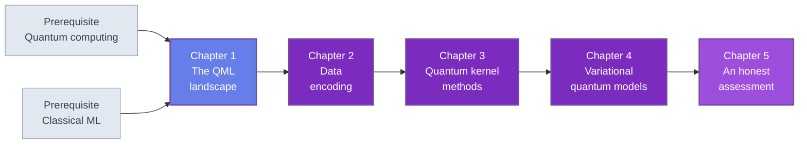

🌐 EN | [🇯🇵 JP](<../../../jp/MI/quantum-machine-learning-introduction/index.html>) | Last sync: 2026-08-13

[AI Terakoya Top](<../../index.html>)›[Materials Informatics Dojo](<../index.html>)›[Introduction to Quantum Machine Learning](<index.html>)

[← Back to Materials Informatics Dojo](<../index.html>)

## 🎯 Series Overview

You already fit models to materials data. Somebody has already asked you whether quantum computing will change that. This series is the answer, worked out rather than asserted.

Quantum machine learning is the most oversold subject in quantum technology, and the overselling is not usually dishonest — it comes from a chain of individually correct statements that does not compose into the conclusion people draw from it. A register of $n$ qubits carries $2^n$ amplitudes; a quantum circuit induces an inner product between data points; that inner product can be hard to compute classically. All true. None of it says a quantum model will generalize better from forty rows of composition descriptors, which is the question a materials researcher actually has.

So this course does the arithmetic. Every experiment runs on one synthetic materials dataset with a fixed seed, one fixed train/test split, and one evaluation protocol strict enough that the later chapters cannot cheat: matched parameter counts, hyperparameters selected on training data only, a trivial baseline and a noise floor quoted alongside every result, a paired bootstrap interval on every difference the course claims — every chapter prints its own — and an explicit shot cost for anything a real device would have had to measure. Under that protocol, some quantum models here win and some lose, and Chapter 1 already contains the most instructive case — a quantum feature map that beats the classical baseline *significantly*, and is then reproduced to fourteen decimal places by evaluating sines and cosines of the descriptors, and pairwise products of them, on a laptop.

That result is the shape of the whole subject. The interesting questions turn out not to be "is quantum faster" but "what does the encoding actually assume about the physics", "why does an expressive kernel destroy its own ability to generalize", and "where in a materials workflow could a quantum processor plausibly attach at all". The honest answer to the last one is upstream of the machine learning, and Chapter 5 defends it.

This is the first quantum course placed in the Materials Informatics Dojo, and the placement is the point: it is written for people who will judge quantum claims against a classical baseline they already trust.

### Learning Path

The chapters are strictly sequential. Chapter 1 fixes the simulator, the dataset, the split, the classical baseline and the evaluation protocol, and every later chapter continues from that session; Chapter 2's encodings are what Chapter 3's kernels are built from; Chapter 4's variational models reuse Chapter 2's feature maps; Chapter 5 collects the evidence from all four. Reading out of order is possible but the code will not run.

### 📋 Learning Objectives

On finishing this series you will be able to:

  * Place any QML proposal in the four-quadrant taxonomy — classical or quantum *data*, classical or quantum *processing* — and explain why the quadrant decides how plausible the claim is
  * Cost out basis, angle and amplitude encoding in qubits, circuit depth and state-preparation difficulty, and explain why the encoding, not the model, is the real bottleneck of the field
  * Derive the quantum kernel $k(x,x') = |\langle\phi(x)|\phi(x')\rangle|^2$, estimate it by an inversion test, and solve kernel ridge regression in closed form with NumPy alone
  * Demonstrate exponential concentration numerically and explain why it makes a more expressive feature map a worse learner
  * Build and train a variational quantum regressor with parameter-shift gradients, and compare it fairly against a classical network of the same parameter count
  * Explain dequantization and classical surrogates well enough to say, of a given quantum model, whether its quantum-ness is essential or incidental
  * Read a quantum-advantage claim with the seven-rule protocol of Chapter 1 and identify which rules it breaks

### 📖 Prerequisites

**Required.** [Introduction to Quantum Computing](<../../FM/quantum-computing-introduction/index.html>) at the level of its Chapters 1 to 3: qubits and state vectors, the standard gate set, the mini state-vector simulator, variational circuits and the barren-plateau problem. The simulator of that course's Chapter 2 is re-listed verbatim in Chapter 1 here, and its API and big-endian qubit ordering are used unchanged throughout.

**Required.** Classical supervised learning at the level of regression, regularization, cross-validation and overfitting. [Materials Informatics Introduction](<../mi-introduction/index.html>) is the natural entry point from the materials side, and [Model Evaluation Introduction](<../../ML/model-evaluation-introduction/index.html>) covers the evaluation machinery this course leans on heavily. Familiarity with composition descriptors — see [Introduction to Composition-Based Features](<../composition-features-introduction/index.html>) — makes the synthetic dataset feel less abstract.

**Required.** Python 3.8 or later with NumPy, SciPy and Matplotlib. Nothing else. There is no quantum SDK, no vendor account, and no hardware access anywhere in these five chapters.

**Recommended.** [Introduction to Quantum Hardware](<../../FM/quantum-hardware-introduction/index.html>), for what the shot rates and error rates quoted in the cost estimates actually come from. Chapter 5 refers to it when it discusses what the QQ quadrant would physically require.

**Useful but not required.** [Bayesian Optimization and Active Learning](<../bayesian-optimization-introduction/index.html>) for the acquisition stage of the pipeline Chapter 1 maps out, and [Machine Learning Potential (MLP) Introduction](<../mlp-introduction/index.html>) as the working example of the quadrant where quantum technology has already changed materials science.

* * *

## 📚 Chapters

### Chapter 1: The QML Landscape

What is being claimed, and what would have to be true for the claim to hold. The four-quadrant taxonomy — classical or quantum data crossed with classical or quantum processing — and why materials informatics already has a quantum success story in the quadrant nobody calls QML. The case for QML (exponential state space, implicit feature maps, universality from data re-uploading) set against the four standing objections (the input problem, the output problem, dequantization, concentration) and the fifth that matters most: classical hardness of simulation is not a good inductive bias. A stage-by-stage map of where a quantum processor could attach to a descriptor-to-property pipeline. Then the seven-rule evaluation protocol that governs every later chapter, and the shared toolkit: the mini-simulator re-listed, the synthetic materials dataset, the closed-form ridge baseline that fixes the number to beat, and first measurements of both dequantization and concentration.

**Key topics** : four-quadrant taxonomy · input and output problems · dequantization · kernel concentration · inductive bias · equal-budget protocol · paired bootstrap · shot accounting · closed-form ridge baseline

💻 6 Code Examples ⏱️ 40-45 minutes 📊 Intermediate

[Read Chapter 1 →](<chapter-1.html>)

### Chapter 2: Data Encoding — the Real Bottleneck of QML

How classical numbers get into a quantum state, and what each route costs. Basis, angle and amplitude encoding compared on qubit count, circuit depth and state-preparation difficulty, with the uncomfortable conclusion that the encoding which reaches the exponential space is the one you cannot afford to prepare. Encoding recast as a feature map $x \mapsto |\phi(x)\rangle$ with an induced inner product, which is what makes the kernel view of Chapter 3 possible. Data re-uploading, and why a single qubit with enough re-uploads is a universal approximator. Then the part that decides everything downstream: the encoding fixes the model's frequency spectrum, and therefore which functions it can represent at all. Closes with three encodings implemented, their induced kernel matrices visualized, and the Fourier spectrum of an angle-encoded model extracted numerically.

**Key topics** : basis / angle / amplitude encoding · state-preparation cost · feature maps and induced inner products · data re-uploading · universal approximation · bandwidth and frequency spectrum · Fourier analysis of a quantum model

💻 6 Code Examples ⏱️ 45-50 minutes 📊 Intermediate

[Read Chapter 2 →](<chapter-2.html>)

### Chapter 3: Quantum Kernel Methods

The most theoretically satisfying corner of QML, and the one where the bad news is clearest. The kernel trick revisited, then the quantum kernel $k(x,x') = |\langle\phi(x)|\phi(x')\rangle|^2$ and its estimation by SWAP test and by inversion test, with the shot cost of each. Kernel ridge regression solved in closed form with NumPy — no scikit-learn — so that the whole pipeline is visible. Then exponential concentration: as the register grows, an expressive feature map drives every off-diagonal kernel entry towards zero, the Gram matrix becomes the identity, and learning stops being possible at all. This is demonstrated numerically, not asserted. Closes with quantum kernel ridge regression against RBF kernel ridge regression on the shared dataset under the identical protocol, reporting the result whether or not the quantum side wins, and a survey of the proposed mitigations including projected kernels.

**Key topics** : kernel trick · quantum kernel · SWAP and inversion tests · shot cost per Gram entry · closed-form kernel ridge · exponential concentration · Gram matrix conditioning · projected kernels

💻 7 Code Examples ⏱️ 45-50 minutes 📊 Advanced

[Read Chapter 3 →](<chapter-3.html>)

### Chapter 4: Variational Quantum Models

The other main branch: a parameterized circuit trained by gradient descent. The anatomy of a variational quantum circuit — encoding layer, variational layer, measurement — and its exact correspondence with the variational eigensolver of the sister course. Parameter-shift gradients derived and implemented, with the training loop and its shot cost made explicit. Barren plateaus revisited in their machine-learning form: how depth, global measurements and entanglement each flatten the loss landscape, and what that means for a model you actually intend to train. Then generalization: a quantum model with $p$ parameters compared against a classical network with $p$ parameters on the same data and the same budget, which is a comparison the literature rarely makes. Closes with a trained VQC regressor and a NumPy MLP of matched size, with their learning curves side by side.

**Key topics** : VQC architecture · encoding and variational layers · parameter-shift rule · training loops and shot budgets · barren plateaus in QML · global vs local measurement · overfitting and matched-budget comparison · learning curves

💻 7 Code Examples ⏱️ 45-50 minutes 📊 Advanced

[Read Chapter 4 →](<chapter-4.html>)

### Chapter 5: An Honest Assessment

Where the evidence of the previous four chapters leads. Dequantization and classical surrogates: how to tell when a quantum model's quantum-ness is load-bearing and when it is decoration, and why a surrogate does not have to be an exact simulation to demolish an advantage claim. How to read a quantum-advantage paper — benchmark hygiene, data scale, baseline strength, cherry-picking, and the specific controls whose absence should end your interest. Then the genuine positive result: with *quantum* data, the situation is different, and provable sample-complexity separations exist. What that means for a materials researcher who will be working with quantum sensors and quantum simulation output long before they work with a quantum learner. Closes with practical guidance on what is worth learning now — the kernel view, the encoding question, the evaluation discipline — and a summary of the series.

**Key topics** : dequantization · classical surrogates of quantum kernels · benchmark hygiene · cherry-picking and selective reporting · quantum data and sample-complexity separations · what to learn now · series synthesis

💻 6 Code Examples ⏱️ 45-50 minutes 📊 Advanced

[Read Chapter 5 →](<chapter-5.html>)

* * *

## 🔤 Notation and Shared Conventions

Fixed in Chapter 1 and used unchanged, so that code from any chapter runs with code from any other.

| Symbol | Meaning |
| --- | --- |
| $x \in [0,1]^4$ | one row of the synthetic dataset: four composition-like descriptors |
| $y$ | the target: a formation-energy-like scalar |
| $\lvert\phi(x)\rangle$ | the state an encoding circuit prepares from a data row |
| $k(x,x')$ | quantum kernel, $\lvert\langle\phi(x)\rvert\phi(x')\rangle\rvert^2$ |
| $\lambda$ | ridge penalty, always selected on training rows only: leave-one-out in Chapter 1, five-fold from Chapter 2 onward, a 30/10 validation split for Chapter 4's iterative training |
| $S$ | number of measurement shots; standard error of an expectation value is at most $1/\sqrt{S}$ |
| $p$ | trainable parameter count, the quantity that must match across a comparison |
| CC, CQ, QC, QQ | quadrant labels: first letter is the data, second is the processing |
| $X, Y, Z, H$, CNOT | gate symbols, identical to [Introduction to Quantum Computing](<../../FM/quantum-computing-introduction/index.html>) |

**Qubit ordering.** Qubit 0 is the leftmost and most significant bit, exactly as in the sister course. This is the opposite of Qiskit's convention.

**Dataset and split.** One synthetic dataset of 60 rows, generated with a fixed seed in Chapter 1's Code Example 2. Training set = the first 40 rows; test set = the last 20. Never re-drawn.

**Reference numbers.** The classical baseline is a test RMSE of $0.2146$ at $R^2 = 0.814$. The noise floor is $0.0507$; predicting the training mean gives $0.5242$. Every result in the series is quoted against these three numbers.

* * *

## 🔍 What This Series Is and Is Not

**It is** a methods course with every number reproduced from scratch. Every code example is plain NumPy or SciPy, every output in the text was produced by the code above it, and every comparison follows the protocol of Chapter 1.

**It is not an SDK tutorial.** There is no Qiskit, no PennyLane, no Cirq, no vendor account, and no cloud backend. The mini-simulator from the sister course is the only quantum interface, which keeps the physics visible instead of hiding it behind a framework whose API will have changed by the time you read this.

**It is not a benchmark victory declaration.** This course does not claim a quantum advantage, and it does not claim that one is impossible. It reports what its own experiments found under a stated protocol, including the experiments where the quantum model lost, and including the one where the quantum model won for entirely classical reasons.

**It is not evidence about real materials data.** The dataset is synthetic by design, so that every number is reproducible and no result depends on a private dataset. Conclusions here are about methods and about how to evaluate them, not about the achievable accuracy on any real property.

**It is not a hardware course.** Device numbers, qubit counts and vendor roadmaps appear nowhere. Where a shot budget is quoted it is quoted as arithmetic — $1/\epsilon^2$ shots per expectation value — and not as a device specification. For the physics behind those rates, read [Introduction to Quantum Hardware](<../../FM/quantum-hardware-introduction/index.html>).

## 📚 Recommended Learning Paths

### Pattern 1: Complete path (5-6 days)

  * Day 1: Chapter 1, Sections 1.1-1.4 — the taxonomy, the objections, the pipeline map, the protocol
  * Day 2: Chapter 1, Section 1.5 — run all six examples, and reproduce the baseline number yourself before reading on
  * Day 3: Chapter 2 — encodings, feature maps, re-uploading, frequency spectra
  * Day 4: Chapter 3 — quantum kernels and the concentration problem
  * Day 5: Chapter 4 — variational models and matched-budget comparison
  * Day 6: Chapter 5 and the exercises — dequantization, benchmark hygiene, and what to do about it

### Pattern 2: The sceptic's path (half a day)

  * Chapter 1, Sections 1.2 and 1.4 — the objections and the protocol
  * Chapter 1, Code Example 5 — dequantization in the smallest possible example
  * Chapter 3, Section 3.6 — concentration, demonstrated
  * Chapter 5, Sections 5.1 to 5.3 — surrogates and how to read a claim

### Pattern 3: The encoding path (one day)

  * Chapter 1, Section 1.5 — the toolkit and the baseline
  * Chapter 2 in full, with its code — this is where the open research problem is
  * Chapter 3, Sections 3.1 and 3.2 — what the encoding induces
  * Chapter 5, Section 5.6 — what to learn now, if you intend to work on this

## 🎯 Overall Learning Outcomes

### Knowledge Level

  * ✅ State the four-quadrant taxonomy and the bottleneck specific to each quadrant
  * ✅ Explain the input problem, the output problem, dequantization and concentration, and which chapter addresses each
  * ✅ Define the quantum kernel and explain why concentration follows from expressivity
  * ✅ Explain why classical hardness of simulation does not imply better generalization

### Practical Skills

  * ✅ Implement basis, angle and amplitude encoding with a bare state-vector simulator
  * ✅ Build a quantum kernel matrix, solve kernel ridge regression in closed form, and diagnose a concentrated Gram matrix
  * ✅ Derive and implement parameter-shift gradients, and train a variational circuit
  * ✅ Run a matched-budget comparison with cross-validated selection and a paired bootstrap interval on the difference
  * ✅ Convert any quantum result into its shot cost at a stated precision

### Application Ability

  * ✅ Read a QML paper and locate its quadrant, its baseline, its test-set size and its missing interval
  * ✅ Decide, for a given quantum model, whether an efficient classical surrogate is likely to exist
  * ✅ Identify where in your own materials workflow quantum technology could plausibly contribute, and where it could not
  * ✅ Design an experiment whose negative result would be as informative as its positive one

## 🛠️ Technologies and Tools Used

### Main Libraries

  * **numpy** — the state-vector simulator, every linear solve, every kernel matrix
  * **scipy** — occasional optimization and special functions
  * **matplotlib** — kernel matrices, learning curves, concentration scaling

### Development Environment

  * **Python** : 3.8 or higher
  * **Jupyter Notebook** : recommended, since the chapters are written as one continuous session
  * Google Colab runs every example. Nothing here needs a GPU, a quantum backend, or an account

## 🚀 Next Steps

### Deep Dive Learning

  * Quantum kernel theory: generalization bounds, the geometric difference, and when a quantum kernel is provably hard to approximate
  * Classical surrogates and randomized linear algebra — the machinery behind dequantization results
  * Quantum simulation for materials: the QC-quadrant application, starting from the sister course's variational eigensolver chapters
  * Learning from quantum data: shadow tomography, classical shadows, and the provable sample-complexity separations

### Related Series

  * [Introduction to Quantum Computing](<../../FM/quantum-computing-introduction/index.html>) — the required prerequisite, and the source of this course's simulator
  * [Introduction to Quantum Hardware](<../../FM/quantum-hardware-introduction/index.html>) — where shot rates and error rates come from physically
  * [Introduction to Quantum Sensing](<../../MS/quantum-sensing-introduction/index.html>) — the same quantum systems used as measuring instruments for materials, and where the quantum data of Chapter 5's open question would come from
  * [Materials Informatics Introduction](<../mi-introduction/index.html>) — the classical incumbent this course measures against
  * [Model Evaluation Introduction](<../../ML/model-evaluation-introduction/index.html>) — the classical evaluation discipline, transferred unchanged
  * [Machine Learning Potential (MLP) Introduction](<../mlp-introduction/index.html>) — the quadrant where quantum technology already contributes

### Practical Projects

  * Re-run the whole course on your own dataset, keeping the protocol and replacing only the data
  * Implement a classical surrogate for Chapter 3's quantum kernel and see how closely it tracks the quantum result
  * Measure the frequency spectrum of your favourite encoding and check it against the functions you actually need to fit
  * Take a published QML benchmark, add the missing paired interval, and see whether the reported advantage survives

### ⚠️ Disclaimer

  * This content is provided solely for educational, research, and informational purposes and does not constitute professional advice (legal, accounting, technical warranty, etc.).
  * This content and accompanying code examples are provided "AS IS" without any warranty, express or implied, including but not limited to merchantability, fitness for a particular purpose, non-infringement, accuracy, completeness, operation, or safety.
  * Every dataset in this course is synthetic and every model comparison is illustrative: the numbers demonstrate a methodology and are not evidence about real materials data or about the performance of any quantum device.
  * The author and Tohoku University assume no responsibility for the content, availability, or safety of external links, third-party data, tools, libraries, etc.
  * To the maximum extent permitted by applicable law, the author and Tohoku University shall not be liable for any direct, indirect, incidental, special, consequential, or punitive damages arising from the use, execution, or interpretation of this content.
  * The content may be changed, updated, or discontinued without notice.
  * The copyright and license of this content are subject to the stated conditions (e.g., CC BY 4.0). Such licenses typically include no-warranty clauses.
