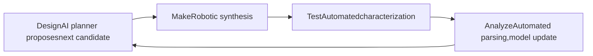

# Chapter 1: What is a Self-Driving Lab?

This chapter defines Self-Driving Labs (SDLs), explains the closed-loop experimental cycle that distinguishes them from mere automation, and traces the field's history through its landmark systems.

**Closed-Loop Autonomous Experimentation**

## Learning Objectives

By completing this chapter, you will be able to:

  * ✅ Define a Self-Driving Lab and distinguish it from conventional lab automation
  * ✅ Explain the closed DMTA (Design–Make–Test–Analyze) cycle
  * ✅ Describe the levels of laboratory autonomy
  * ✅ Name three landmark SDL systems and what each demonstrated
  * ✅ Explain why materials discovery motivates autonomous experimentation

**Reading Time**: 20-25 minutes **Code Examples**: 2 **Exercises**: 3

* * *

## 1.1 The Problem: Discovery is Too Slow

Developing a new material — a battery electrolyte, a solar absorber, a catalyst — has historically taken **10 to 20 years** from first concept to commercial deployment. The bottleneck is rarely a shortage of ideas. It is the **experimental throughput** of human-operated laboratories:

- A synthesis-and-characterization cycle for one candidate typically takes days
- A human researcher runs experiments during working hours only
- Results are analyzed manually, and the next experiment is chosen by intuition
- Knowledge is trapped in lab notebooks, theses, and the heads of departing students

Meanwhile, the search spaces are astronomically large. Even a modest four-component alloy or electrolyte formulation with 10 levels per component has thousands of candidate compositions; realistic molecular design spaces exceed 10^60 candidates. Exhaustive experimentation is impossible — **the only way forward is to make each experiment count and to run experiments around the clock.**

Initiatives such as the **Materials Genome Initiative** (USA, 2011) attacked the problem first with computation and databases. Mission Innovation's 2018 *Materials Acceleration Platform* (MAP) report went further, calling for laboratories that combine AI, robotics, and computation into autonomous discovery platforms. The Self-Driving Lab is the concrete realization of that call.

## 1.2 Definition: What Makes a Lab "Self-Driving"?

> **A Self-Driving Lab (SDL) is a laboratory in which an AI planner chooses experiments, robotic hardware executes them, automated instruments characterize the products, and the results feed back to the planner — closing the loop without a human in it.**

The essential word is **loop**. Three capabilities must be connected:

| Element | Role | Typical Technology |
|---|---|---|
| **Brain** | Decides the next experiment | Bayesian optimization, active learning |
| **Body** | Makes and measures samples | Liquid handlers, robot arms, automated furnaces, in-line spectrometers |
| **Nervous system** | Moves samples, data, and commands | Orchestration software, laboratory information systems, parsers |

### Automation is Not Autonomy

A common confusion is between *automated* and *autonomous* laboratories:

- **Automated (high-throughput) lab**: executes a **predefined** list of experiments quickly. The plate of 96 reactions is chosen by a human before the run. Screening is fast but not adaptive.
- **Autonomous lab (SDL)**: chooses its **own** next experiment based on everything it has measured so far. The experiment list does not exist in advance.

High-throughput screening spends its budget uniformly, including on hopeless regions of the search space. An SDL concentrates its budget where the model is most uncertain or the predicted performance is highest — this is why SDLs routinely report finding optima in **tens of experiments** where grid screening would need thousands.

### Levels of Laboratory Autonomy

By analogy with driving automation, laboratory autonomy is often described in levels:

| Level | Description | Human Role |
|---|---|---|
| 0 | Manual experimentation | Everything |
| 1 | Single automated instruments | Plans, transfers samples, analyzes |
| 2 | Automated workflows (fixed recipe lists) | Plans the campaign |
| 3 | Closed-loop optimization of a fixed workflow | Defines objective and search space |
| 4 | Closed loop + automated hypothesis or workflow adaptation | Supervises |
| 5 | Fully autonomous scientific discovery | Sets scientific goals |

Nearly all current SDLs operate at **Level 3**: the workflow (e.g., "mix, anneal, measure conductivity") is fixed by humans, and the machine autonomously optimizes within it. Level 4–5 systems remain research frontiers.

## 1.3 The Closed DMTA Cycle

Pharmaceutical and materials chemistry describe discovery as the **DMTA cycle**: Design, Make, Test, Analyze. In a conventional lab each turn of the cycle takes days to weeks, dominated by hand-offs between people and instruments. An SDL closes the cycle in hours or minutes:



A minimal closed loop in pseudocode makes the structure concrete:

```python
# Minimal closed-loop SDL skeleton
model = SurrogateModel()                 # e.g., Gaussian process
data = initial_experiments(n=5)          # small random/space-filling seed

while not stopping_criterion(data):
    model.fit(data)
    x_next = acquisition_argmax(model)   # Design  (brain)
    sample = robot.synthesize(x_next)    # Make    (body)
    y = instruments.measure(sample)      # Test    (body)
    data.append((x_next, y))             # Analyze (nervous system)

best = data.argmax()
```

Every real SDL — however sophisticated — is an elaboration of this loop: better surrogate models, parallel batches, multiple objectives, more capable robots, richer characterization. The following chapters unpack each part.

### What Closing the Loop Buys You

- **Speed**: the lab runs 24/7; cycle time drops from days to hours
- **Data efficiency**: each experiment is chosen to be maximally informative, typically reducing experiment counts by 10–100× versus grid or random search
- **Reproducibility**: robots execute protocols identically every time, and every action is logged
- **Complete data capture**: failed experiments — which humans rarely publish — are recorded and used by the model

## 1.4 A Brief History Through Landmark Systems

### Robot Scientists: Adam and Eve (2004–2015)

The earliest "robot scientists" came from **Ross King's group**. **Adam** (2009) autonomously generated hypotheses about yeast functional genomics, designed experiments to test them, and ran the experiments — the first machine credited with an independent scientific discovery. Its successor **Eve** applied the approach to early-stage drug screening, identifying compounds active against malaria targets. These systems established the template: hypothesis, experiment, analysis, repeat — without a human in the loop.

### Ada: A Materials SDL (2018–)

**Ada**, built by the groups of Curtis Berlinguette, Jason Hein, and Alán Aspuru-Guzik in Canada, was among the first modular self-driving labs for **thin-film materials**. Ada synthesized films, measured their optical and electronic properties, and used Bayesian optimization to tune process conditions — demonstrating closed-loop optimization of real materials processing, including organic hole-transport layers for solar cells.

### The Mobile Robotic Chemist (2020)

Andrew Cooper's group at the University of Liverpool took a different approach: instead of building a bespoke integrated platform, they gave a **mobile robot** human-like access to a conventional chemistry lab. The robot moved between stations, handling vials, operating instruments, and searching a 10-dimensional space for better photocatalysts for hydrogen evolution. Over **8 days it ran 688 experiments** autonomously and found a photocatalyst blend about **6× more active** than the starting formulation (Burger et al., *Nature* 2020). The result showed that autonomy can be retrofitted onto ordinary labs — the robot uses the same equipment humans do.

### A-Lab: Autonomous Solid-State Synthesis (2023)

The **A-Lab** at Lawrence Berkeley National Laboratory (Gerbrand Ceder's group) targeted the hardest step of inorganic materials discovery: **making predicted compounds**. Fed with candidate compounds from the Materials Project and Google DeepMind's GNoME predictions, A-Lab autonomously planned solid-state syntheses, executed them with robotic powder handling and furnaces, and identified products by automated X-ray diffraction analysis. In its debut report it attempted 58 novel compounds in 17 days and claimed successful synthesis of 41 (Szymanski et al., *Nature* 2023).

The claim drew significant scrutiny — chemists including Robert Palgrave and Leslie Schoop argued that several products were misidentified or already-known phases, a debate we examine in Chapter 4. The controversy itself became an important lesson: **autonomous characterization and phase identification are as critical as autonomous synthesis**, and community standards for validating SDL claims are still forming.

### The Ecosystem Today

SDLs now exist for organic synthesis (Cronin's Chemputer, IBM RoboRXN), photovoltaic and optoelectronic films, nanoparticles, formulations, electrocatalysis, and battery materials. National and international programs — the **Acceleration Consortium** (Toronto), the US MGI ecosystem, and Japanese efforts at NIMS including the **NIMO** orchestration package and NIMS-OS — are building shared platforms. The field's guiding review literature (e.g., Häse, Roch & Aspuru-Guzik; Stach et al.; Abolhasani & Kumacheva, *Nature Synthesis* 2023) frames SDLs as the practical engine of the Materials Acceleration Platform vision.

## 1.5 When is an SDL Worth Building?

SDLs shine when three conditions hold:

1. **Expensive or slow experiments** — each data point costs hours and real money, so data efficiency matters
2. **Well-defined, measurable objective** — conductivity, yield, efficiency, activity; the loop needs a number to optimize
3. **Automatable unit operations** — synthesis and characterization steps that robots can actually perform

Conversely, SDLs struggle when the objective is fuzzy ("interesting new chemistry"), when synthesis requires manual craft that resists automation, or when a single experiment is so cheap that brute-force screening is simpler. A useful rule of thumb: **an SDL is an investment in *reusable* experimental capacity** — the platform pays off across many campaigns, not one.

```python
# Back-of-envelope: when does closed-loop beat screening?
grid_experiments   = 10**4      # exhaustive grid over 4 parameters
sdl_experiments    = 60         # typical closed-loop campaign
cost_per_exp_hours = 6

print("Grid:", grid_experiments * cost_per_exp_hours / 24 / 365, "years")
print("SDL :", sdl_experiments  * cost_per_exp_hours / 24, "days")
# Grid: ~6.8 years   SDL: ~15 days
```

## 1.6 Chapter Summary

- Materials discovery is throughput-limited; search spaces are too large for exhaustive experimentation
- An SDL closes the Design–Make–Test–Analyze loop: an AI planner (brain), robotic execution (body), and orchestration/data infrastructure (nervous system)
- Autonomy differs from automation: an SDL chooses its own next experiment
- Landmark systems — Adam/Eve, Ada, the mobile robotic chemist, A-Lab — progressively demonstrated hypothesis generation, thin-film optimization, retrofit autonomy, and autonomous solid-state synthesis
- The A-Lab debate shows that validation and characterization standards are part of the engineering problem
- SDLs pay off when experiments are expensive, objectives are measurable, and operations are automatable

**Next chapter**: the brain — how Bayesian optimization and active learning decide which experiment to run next.

## Exercises

1. **Conceptual**: For each of the following, state whether it is *automation* or *autonomy*, and why: (a) a liquid handler preparing a 96-well plate from a fixed recipe file; (b) a system that re-plans tomorrow's syntheses each night from today's XRD results; (c) a furnace with a programmable temperature schedule.
2. **Quantitative**: A screening campaign requires 5,000 grid experiments at 4 hours each. A closed-loop campaign reaches the same optimum in 80 experiments but adds 15 minutes of planning overhead per experiment. Compute the wall-clock time of both approaches for (a) one instrument, (b) eight parallel instruments.
3. **Discussion**: The mobile robotic chemist reused a human lab, while A-Lab was purpose-built. List two advantages and two disadvantages of each strategy for a university group starting an SDL project.
