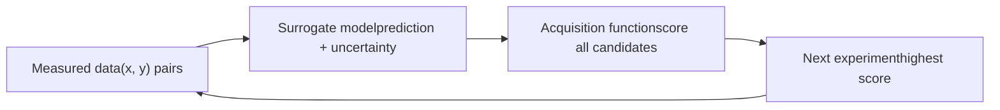

# Chapter 2: The Brain — AI Experiment Planning

This chapter explains how an SDL decides what to do next: surrogate models, acquisition functions, batch planning for parallel hardware, and multi-objective campaigns.

**Bayesian Optimization and Active Learning Inside the Loop**

## Learning Objectives

By completing this chapter, you will be able to:

  * ✅ Explain the roles of the surrogate model and the acquisition function
  * ✅ Choose between exploration- and exploitation-leaning acquisition strategies
  * ✅ Explain batch (parallel) experiment planning and why SDLs need it
  * ✅ Describe multi-objective optimization and the Pareto front in materials contexts
  * ✅ List practical planner choices (software) used in real SDLs

**Reading Time**: 20-25 minutes **Code Examples**: 4 **Exercises**: 3

* * *

## 2.1 The Planner's Job

At each turn of the loop, the planner faces the same question: *given everything measured so far, which experiment is most worth its cost?* Two ingredients answer it:

1. A **surrogate model** — a cheap statistical stand-in for the expensive experiment, giving a prediction **and an uncertainty** for any untried condition
2. An **acquisition function** — a rule that scores candidate experiments by combining predicted value and uncertainty



This is exactly the machinery covered in depth in our [Bayesian Optimization series](../../PI/bayesian-optimization/index.html); here we focus on what changes when the optimizer sits **inside a robot**.

## 2.2 Surrogate Models

The workhorse is the **Gaussian process (GP)**: for any candidate x it returns a mean prediction μ(x) and a standard deviation σ(x). GPs dominate SDL practice because:

- They quantify uncertainty honestly, which acquisition functions require
- They work well with the **small datasets** (tens to hundreds of points) typical of expensive experiments
- Their smoothness assumptions match many process–property landscapes

Alternatives appear when the situation demands them: **random forests** for mixed categorical/continuous spaces (e.g., choice of solvent plus temperature), and **neural-network ensembles** when data grows into the thousands. The principle is unchanged — the planner needs *both* a prediction and an error bar.

```python
from sklearn.gaussian_process import GaussianProcessRegressor
from sklearn.gaussian_process.kernels import Matern

gp = GaussianProcessRegressor(kernel=Matern(nu=2.5), normalize_y=True)
gp.fit(X_measured, y_measured)
mu, sigma = gp.predict(X_candidates, return_std=True)   # prediction + uncertainty
```

## 2.3 Acquisition Functions: Deciding Under Uncertainty

The acquisition function converts (μ, σ) into a single "how promising" score. The classic trio:

| Acquisition | Formula (sketch) | Personality |
|---|---|---|
| **Expected Improvement (EI)** | E[max(y − y_best, 0)] | Balanced default; most SDL campaigns use it |
| **Upper Confidence Bound (UCB)** | μ + κσ | Tunable: large κ explores, small κ exploits |
| **Probability of Improvement (PI)** | P(y > y_best) | Greedy; can stall on tiny certain gains |

The essential tension is **exploration versus exploitation**: sampling where σ is large teaches the model the most; sampling where μ is high harvests performance now. Purely greedy loops get stuck on local optima; purely exploratory loops waste the budget mapping regions that will never win.

```python
import numpy as np
from scipy.stats import norm

def expected_improvement(mu, sigma, y_best, xi=0.01):
    z = (mu - y_best - xi) / sigma
    return (mu - y_best - xi) * norm.cdf(z) + sigma * norm.pdf(z)

scores = expected_improvement(mu, sigma, y_measured.max())
x_next = X_candidates[np.argmax(scores)]
```

### Active Learning vs. Optimization

Not every campaign hunts a single optimum. If the goal is an **accurate model of the whole space** (a phase map, a calibration surface), the planner should maximize *information*, not performance — choosing points of highest predictive uncertainty or highest expected model change. This is **active learning**, covered in our [dedicated series](../active-learning-introduction/index.html). Many real SDL campaigns interleave both modes: map first, optimize second.

## 2.4 Batch Planning: Feeding Parallel Hardware

Robotic platforms rarely run one sample at a time — a plate holds 24 or 96 wells; a furnace anneals several crucibles together. The planner must propose a **batch** of q experiments *before* seeing any of their results. Naively taking the top-q acquisition scores fails: the top scores cluster around the same peak, wasting the batch on near-duplicates.

Standard fixes:

- **Kriging Believer / fantasy points**: pick the best candidate, *pretend* its predicted value is measured, refit, pick the next — q times. Forces diversity because each fantasy point deflates its neighborhood's uncertainty.
- **Local penalization**: after each pick, multiply the acquisition surface by a penalty around the chosen point.
- **q-EI / q-UCB**: Monte-Carlo batch acquisition functions (as in BoTorch) that optimize the joint value of the whole batch.

```python
# Kriging Believer sketch
batch = []
from copy import deepcopy
gp_b = deepcopy(gp)   # clone() would return an unfitted model
for _ in range(q):
    mu_b, sig_b = gp_b.predict(X_candidates, return_std=True)
    x = X_candidates[np.argmax(expected_improvement(mu_b, sig_b, y_best))]
    batch.append(x)
    gp_b.fit(np.vstack([gp_b.X_train_, [x]]),          # fantasy update
             np.append(gp_b.y_train_, gp_b.predict([x])))
```

**Asynchronous loops** go one step further: instruments finish at different times, and the planner issues a new experiment whenever any slot frees up, conditioning on all completed results plus fantasy values for still-running ones.

## 2.5 Multi-Objective Campaigns

Real materials must satisfy several properties at once — a solid electrolyte needs high conductivity *and* electrochemical stability; a solar absorber needs the right band gap *and* long carrier lifetime; everything must ultimately be cheap and stable. With competing objectives there is no single best sample; the target becomes the **Pareto front**: the set of samples where improving one objective necessarily worsens another.

- **Scalarization**: collapse objectives into one score (weighted sum, or desirability products). Simple, but weights must be chosen in advance.
- **Expected Hypervolume Improvement (EHVI)**: pick the experiment expected to grow the dominated hypervolume of the Pareto front — the principled multi-objective acquisition, implemented in BoTorch/Ax.
- **Constraints**: treat hard requirements ("stability window > 4 V") as feasibility constraints with their own probabilistic models, multiplying acquisition by the probability of feasibility.

Multi-objective closed loops have optimized, for example, polymer blend conductivity against mechanical robustness, and nanoparticle optical spectra against size dispersity.

## 2.6 Planners in Practice

| Software | Origin | Notes |
|---|---|---|
| **Ax / BoTorch** | Meta | Industrial-strength BO, q-batch and EHVI support |
| **GPyOpt / scikit-optimize** | academic | Lightweight, good for teaching and prototypes |
| **Dragonfly** | CMU | High-dimensional and multi-fidelity BO |
| **ChemOS / Phoenics / Gryffin** | Aspuru-Guzik group | ChemOS orchestrates SDLs; Phoenics and Gryffin are its BO planners — Gryffin handles categorical variables (e.g., solvent identity) |
| **NIMO** | NIMS | Orchestration with pluggable planners; see our [NIMO series](../nimo-introduction/index.html) |

Two practical lessons recur across deployments:

1. **The planner is rarely the bottleneck** — integration, parsing, and hardware reliability consume most engineering effort (Chapter 3)
2. **Encode chemistry into the search space**: constraining compositions to sum to 100%, working in log-concentration, or using categorical kernels for solvent choice improves data efficiency more than exotic acquisition functions

## 2.7 Chapter Summary

- The SDL brain = surrogate model (prediction + uncertainty) + acquisition function (value of the next experiment)
- GPs dominate for small expensive datasets; EI/UCB are the standard acquisition choices, trading exploration against exploitation
- Batch and asynchronous planning (Kriging Believer, q-EI) are required to feed parallel robotic hardware
- Multi-objective campaigns target the Pareto front, with EHVI as the principled acquisition
- Mature software (Ax/BoTorch, Gryffin, NIMO) means you rarely write a planner from scratch

**Next chapter**: the body — robots, instruments, and the orchestration software that binds them.

## Exercises

1. **Conceptual**: Your GP predicts candidate A: μ=80, σ=2 and candidate B: μ=70, σ=15 (current best y=82). Which does EI likely prefer, and why? What about UCB with κ=0.5?
2. **Coding**: Implement the Kriging Believer sketch above for a 1-D toy function and show that the selected batch of q=4 points is more spread out than the top-4 EI points.
3. **Design**: A battery-materials campaign must maximize ionic conductivity while keeping interfacial resistance below a threshold. Propose a planner setup (model(s), acquisition, constraint handling) and justify each choice.
