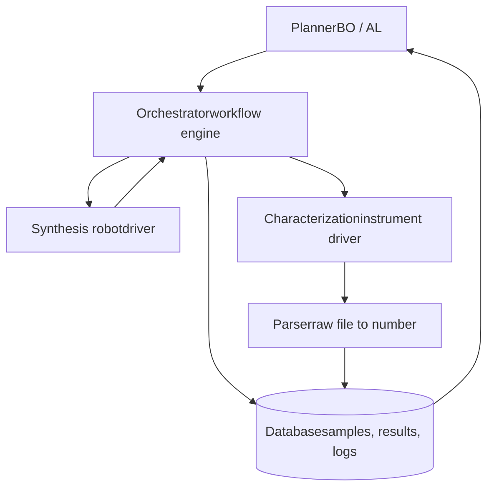

# Chapter 3: The Body — Automation and Orchestration

This chapter surveys the physical and software infrastructure of an SDL: synthesis robots, automated characterization, sample transport, orchestration software, and the data pipeline that closes the loop.

**Robots, Instruments, and the Software That Binds Them**

## Learning Objectives

By completing this chapter, you will be able to:

  * ✅ Describe the main robotic synthesis modalities (liquid handling, powder dosing, flow chemistry, mobile robots)
  * ✅ Explain which characterization techniques automate well and why
  * ✅ Describe the role of orchestration software and name representative packages
  * ✅ Explain automated data parsing and why it is a major engineering cost
  * ✅ Sketch the architecture of a complete SDL for a given materials problem

**Reading Time**: 20-25 minutes **Code Examples**: 3 **Exercises**: 3

* * *

## 3.1 Synthesis Hardware: Four Modalities

### Liquid Handling

The most mature automation modality, inherited from biotech. Pipetting robots (Opentrons, Hamilton, Tecan) dispense microliter volumes into well plates — ideal for **solution-processed materials**: nanoparticle syntheses, perovskite precursor inks, polymer formulations, electrolyte blends. An entry-level open-source liquid handler costs a few thousand dollars, which has made solution SDLs the most common starting point.

### Powder Handling and Solid-State Synthesis

Solid-state chemistry — weighing powders, grinding, pressing pellets, furnace annealing — resisted automation far longer; powders stick, clump, and vary in flow behavior. **A-Lab** is the flagship demonstration: robotic powder dosing into crucibles, transfer by robot arm into box furnaces, and automated recovery and grinding of products. Commercial powder-dosing stations (e.g., Chemspeed) now serve battery and catalyst SDLs.

### Flow Chemistry

In flow systems, reagents pump continuously through temperature-controlled reactors; residence time, stoichiometry, and temperature become **continuously tunable knobs**, and in-line analytics measure products in real time. Flow SDLs (including IBM's RoboRXN and many nanoparticle platforms) offer the fastest cycle times — minutes per condition — and excellent reproducibility, at the cost of chemistry that must tolerate being pumped.

### Mobile Robots

Liverpool's mobile robotic chemist (Chapter 1) showed the retrofit strategy: a free-roaming robot arm on wheels that uses **human instruments in a human lab**. Modularity is maximal — add a new instrument by teaching the robot where its buttons are — but throughput is limited by the robot walking between stations one sample at a time.

| Modality | Best for | Cycle time | Maturity |
|---|---|---|---|
| Liquid handling | Solutions, formulations | minutes–hours | High |
| Powder/solid-state | Ceramics, battery materials | hours–days | Medium (A-Lab era) |
| Flow chemistry | Organics, nanoparticles | minutes | High |
| Mobile robot | Retrofit of existing labs | hours | Emerging |

## 3.2 Automated Characterization

The "Test" step must produce a number the planner can optimize — automatically, without a human reading spectra.

**Automate well:**

- **UV-Vis / photoluminescence** — in-line fiber spectrometers; standard in nanoparticle and perovskite SDLs
- **XRD** — automated sample changers are routine; *automated interpretation* (phase identification) is the hard part and a core A-Lab contribution (ML-assisted pattern matching against databases)
- **Electrochemistry** — potentiostats are inherently computer-controlled; conductivity, impedance, and stability windows integrate naturally
- **Optical microscopy + computer vision** — film quality scoring, droplet detection, crystallization monitoring
- **NMR / HPLC / MS in flow** — mature in organic-synthesis SDLs for yield quantification

**Automate poorly (today):** TEM (manual grid preparation and expert interpretation), XPS (UHV sample transfer), and any measurement whose interpretation is itself a research question. A practical SDL design rule: **choose an objective measurable by a robot in minutes**; keep slow, expert-dependent measurements as offline validation of the final winners.

## 3.3 Orchestration Software

Something must tell the liquid handler to dispense, wait for the furnace, launch the measurement, and hand the parsed result to the planner. That "something" is the **orchestrator** — the least glamorous and most labor-intensive part of every SDL build.



Representative packages:

| Package | Origin | Notes |
|---|---|---|
| **ChemOS** | Aspuru-Guzik group | Early general SDL operating system |
| **Bluesky** | NSLS-II / APS | Beamline-grade experiment orchestration, widely reused |
| **HELAO** | Caltech/HTE community | Asynchronous distributed lab automation |
| **NIMO** | NIMS | Planner-agnostic orchestration; see our [NIMO series](../nimo-introduction/index.html) |
| **NIMS-OS** | NIMS | Integrated AI + robot operation for autonomous experiments |

Instrument **drivers** remain the pain point: most lab instruments ship with GUI-only vendor software, so SDL builders write wrappers around serial commands, vendor APIs, or even GUI automation. Standards efforts — **SiLA 2** for device communication and **AnIML** for analytical data — aim to make instruments plug-and-play, but coverage is still partial (Chapter 5).

```python
# What orchestration code actually looks like (simplified)
def run_experiment(x):
    plate = liquid_handler.prepare(composition=x)        # driver 1
    film  = spin_coater.coat(plate, speed=x["rpm"])      # driver 2
    annealer.bake(film, temp=x["T"], minutes=x["t"])     # driver 3
    raw   = spectrometer.measure(film)                   # driver 4
    y     = parse_spectrum(raw)                          # parser
    db.log(x, y, raw_path=raw.path)                      # provenance
    return y
```

## 3.4 The Data Pipeline

Closing the loop requires converting **raw instrument output into planner input** with zero human touches:

1. **Parsing**: vendor binary → numbers (peak position, conductivity, yield). Fragile; format changes silently break loops.
2. **Quality control**: automated sanity checks — did the dispense succeed? is the spectrum saturated? Failed experiments must be *detected*, not silently logged as bad materials. Computer vision on the sample (empty well? cracked film?) is increasingly standard.
3. **Provenance**: every sample gets an ID linking composition, process history, raw files, and derived values. This is what makes SDL datasets FAIR (findable, accessible, interoperable, reusable) and publishable.
4. **Storage**: a real database (SQL/NoSQL), not folders of CSVs — the planner queries it every cycle.

Teams consistently report that **integration and parsing consume well over half of total build effort** — more than robots and far more than the ML planner. Budget accordingly.

## 3.5 Putting It Together: A Reference Architecture

For a concrete example, a thin-film optimization SDL:

- **Search space**: precursor ratios (4 continuous), annealing temperature and time (2 continuous), solvent (categorical)
- **Make**: pipetting robot mixes inks → spin coater → automated hotplate array
- **Test**: camera scores film uniformity (reject failures) → fiber UV-Vis measures band gap → four-point probe measures sheet resistance
- **Analyze**: parsers write (composition, process, band gap, resistance) to the database
- **Brain**: multi-objective BO (EHVI) over band gap target and resistance, batch size = hotplate capacity
- **Nervous system**: orchestrator schedules batches, retries failed dispenses, alerts a human on hardware faults

Note the human's role has not vanished: humans **refill reagents, fix jams, validate winners, and decide when the campaign is done**. Current SDLs are Level-3 autonomous within a human-supervised envelope.

## 3.6 Chapter Summary

- Four synthesis modalities: liquid handling (most mature), powder/solid-state (A-Lab era), flow (fastest cycles), mobile robots (retrofit)
- Choose objectives measurable automatically in minutes; XRD interpretation and film-quality vision are key enabling analytics
- Orchestration software (ChemOS, Bluesky, HELAO, NIMO, NIMS-OS) binds drivers, parsers, database, and planner; instrument drivers are the chronic pain point
- The data pipeline — parsing, QC, provenance, storage — consumes the majority of engineering effort
- Humans remain in the envelope: maintenance, validation, and campaign-level judgment

**Next chapter**: what SDLs have actually achieved — case studies and their controversies.

## Exercises

1. **Design**: Sketch (block diagram) an SDL for optimizing the ionic conductivity of a polymer electrolyte film. Name a concrete instrument for every block and mark which links need custom drivers.
2. **Conceptual**: Why is a failed-dispense detector more important in an autonomous loop than in a human-run high-throughput screen? What happens to the surrogate model without it?
3. **Estimation**: Your parser breaks on 2% of spectra, silently returning 0. After a 200-experiment campaign, roughly how many corrupted points does the model hold, and where in the search space will the planner be misled?
