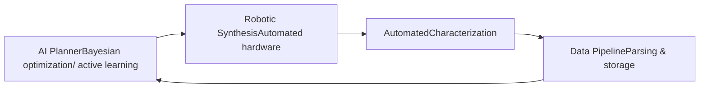

# Self-Driving Labs Introduction

**Autonomous Experimentation for Accelerated Materials Discovery**

Materials discovery has traditionally taken 10–20 years from concept to deployment. Self-Driving Labs (SDLs) — laboratories that plan, execute, and analyze their own experiments in a closed loop — aim to compress that timeline by an order of magnitude. This series explains how SDLs work, what they have actually achieved, and what still stands in the way.

## Series Overview

An SDL combines three elements into a closed loop:

1. **A brain** — machine-learning experiment planners (Bayesian optimization, active learning) that decide which experiment to run next
2. **A body** — robotic synthesis and automated characterization hardware that executes the plan
3. **A nervous system** — orchestration software and data infrastructure that connect the two

## Chapters

| Chapter | Title | What You Will Learn |
|---------|-------|---------------------|
| 1 | [What is a Self-Driving Lab?](chapter-1.html) | Closed-loop experimentation, the DMTA cycle, history and landmark systems |
| 2 | [The Brain: AI Experiment Planning](chapter-2.html) | Bayesian optimization and active learning as SDL planners, batch and multi-objective planning |
| 3 | [The Body: Automation and Orchestration](chapter-3.html) | Robotic synthesis platforms, automated characterization, workflow orchestration software |
| 4 | [Case Studies](chapter-4.html) | A-Lab, the mobile robotic chemist, thin-film and perovskite SDLs — results and controversies |
| 5 | [Challenges and Outlook](chapter-5.html) | Reproducibility, standardization, data sharing, the human role, and global initiatives |

## Prerequisites

- Basic machine learning concepts (regression, uncertainty)
- Helpful but not required: our [Bayesian Optimization](../../PI/bayesian-optimization/index.html) and [Active Learning](../active-learning-introduction/index.html) series

## Related Series

- [Bayesian Optimization Introduction](../../PI/bayesian-optimization/index.html) — the most common SDL "brain"
- [Active Learning Introduction](../active-learning-introduction/index.html) — data-efficient experiment selection
- [NIMO Introduction](../nimo-introduction/index.html) — an orchestration tool developed at NIMS
