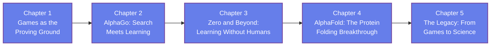

[AI Terakoya Top](<../../index.html>)›[Machine Learning Dojo](<../index.html>)›[AlphaGo to AlphaFold](<index.html>)

🌐 EN | [🇯🇵 JP](<../../../jp/ML/alphago-to-alphafold/index.html>) | Last sync: 2026-08-19

[← Back to Machine Learning Dojo](<../index.html>)

## 🎯 Series Overview

A program learned to play a board game. Less than a decade later, the line of work that program started shared a Nobel Prize in Chemistry. This series is about how that happened, what actually transferred between the two problems, and — the part most accounts skip — what was never solved at all.

The route runs from the game to the science. We set up **why games were the proving ground** for AI and why Go resisted the methods that beat chess; assemble **AlphaGo** from a learned evaluation and Monte Carlo tree search, and see how each half compensates for the other's weakness; watch the successors **delete the human data** and then the game-specific machinery, getting stronger with each subtraction; move to **AlphaFold**, where self-play is impossible and the ground truth had to come from somewhere else entirely; and finish with the **legacy** — the AlphaFold Database, the 2024 Nobel Prize in Chemistry, the ripples into materials science, and an unsparing account of the open problems.

This is a **history and principles** series rather than an implementation course. The through-line is a single question — *where does the feedback signal come from?* — and the answer is what explains the apparently contradictory arcs of the two systems: AlphaGo could throw away human knowledge because the rules of Go supply unlimited free ground truth, while AlphaFold had to build a channel to the ground truth that evolution had already recorded.

It is written for **machine learning learners who want the conceptual spine behind the headlines**, and for **materials and life-science researchers** who keep encountering these systems as analogies for their own work and want to know how far the analogy carries. Within the Machine Learning Dojo it complements [Introduction to Reinforcement Learning](<../reinforcement-learning-introduction/index.html>) — which develops the algorithms this series treats historically — along with [Introduction to Graph Neural Networks](<../gnn-introduction/index.html>) and [Introduction to Transformers](<../transformer-introduction/index.html>), whose architectural ideas appear throughout the AlphaFold story.

> **A promise about hype, stated up front.** This series names no result it cannot state precisely, quotes no number that is disputed, and does not describe any benchmark victory as a solved science. Where a claim is contested — the counts announced by AI-driven materials-discovery pipelines, for instance — it is reported as contested rather than repeated. Where a system is genuinely remarkable, it is said plainly. The organizing value is **calibration over allegiance**: neither treating each announcement as a formality on the way to everything, nor treating every result as marketing.

### Learning Path

### 📋 Learning Objectives

  * Explain why games served as the proving ground for AI research, and what specifically made Go resist the search techniques that had already solved chess
  * Describe how AlphaGo combined learned evaluation with Monte Carlo tree search, and why neither component would have been sufficient alone
  * Explain how self-play removes the need for human training data, and why that removal was possible in games and impossible in protein structure prediction
  * Describe what AlphaFold predicts, what evolutionary information and geometric structure contribute, and why CASP made the result credible rather than merely claimed
  * Judge claims about AI in science against what was actually measured — distinguishing a benchmark result from a solved problem, and identifying where a cheap, reliable feedback signal does or does not exist

### 📖 Prerequisites

**Basic machine learning concepts** are the one genuine requirement: what a neural network is at the level of "a function with parameters fitted to data", what training and generalization mean, and the rough idea of supervised learning. If you have worked through any introductory ML material, you have enough.

**Python** appears in every chapter as one short self-contained hands-on block that uses **NumPy** alone. The code is there to make each argument quantitative, not to teach implementation; you can read the chapters without running it, though running it is more convincing.

**No background in game AI is needed.** Minimax, search trees, branching factors, and Monte Carlo tree search are all built up from the beginning. **No background in biology is needed either.** Amino acids, protein folding, multiple sequence alignments, and the CASP evaluation are introduced as they become necessary, at the level required to follow the argument rather than to do the biochemistry.

Chapter 1

Games as the Proving Ground

Understand why board games became the standard testbed for artificial intelligence. See what made chess tractable and what made Go different — a branching factor that defeats exhaustive search and a position-evaluation problem nobody knew how to write by hand — and why Go was widely regarded as the benchmark that would hold out longest.

Game AI History Search Trees Branching Factor Evaluation Functions Why Go Was Hard

⏱️ 20-25 minutes

[Read Chapter 1 →](<chapter-1.html>)

Chapter 2

AlphaGo: Search Meets Learning

See the two halves fit together. Learn how a learned policy narrows which moves are worth considering and a learned value function estimates who is winning without playing to the end, and how Monte Carlo tree search uses both — the network telling the search where to look, the search telling the network what mattered.

Policy Networks Value Networks Monte Carlo Tree Search Supervised Bootstrapping The Lee Sedol Matches

⏱️ 25-30 minutes

[Read Chapter 2 →](<chapter-2.html>)

Chapter 3

Zero and Beyond: Learning Without Humans

Watch the human data get deleted — and the system get stronger. Follow the move to pure self-play with no human games, the collapse of two networks into one, the removal of hand-built features and rollouts, and finally the generalization beyond Go, and understand exactly what property of games made all of that possible.

Self-Play Tabula Rasa Learning Architectural Simplification Generalization Across Games The Free Verifier

⏱️ 25-30 minutes

[Read Chapter 3 →](<chapter-3.html>)

Chapter 4

AlphaFold: The Protein Folding Breakthrough

Move to a problem where self-play cannot work. Learn what protein structure prediction asks, why decades of effort had stalled, how evolutionary information in multiple sequence alignments supplies the ground truth that game rules supplied for free, how geometry and symmetry enter the architecture, and what the CASP result did and did not establish.

Protein Folding Multiple Sequence Alignments Geometric Reasoning CASP Confidence Estimates

⏱️ 30-35 minutes

[Read Chapter 4 →](<chapter-4.html>)

Chapter 5

The Legacy: From Games to Science

Resolve the apparent contradiction between the two arcs and draw the honest boundary around what was achieved. Quantify the feedback-signal argument in a short NumPy simulation, survey the AlphaFold Database and its effect on practice, get the 2024 Nobel Prize split right, follow the template into materials science with the caution it deserves, and work through the open problems that "solved" never covered.

Feedback Signals AlphaFold Database 2024 Nobel Prize Materials Screening Open Problems

💻 NumPy hands-on ⏱️ 25-30 minutes

[Read Chapter 5 →](<chapter-5.html>)

## 📚 Recommended Learning Paths

### Pattern 1: Beginner - Full Tour (5 days)

  * Day 1: Chapter 1 (Why games, and why Go was hard)
  * Day 2: Chapter 2 (AlphaGo: search meets learning)
  * Day 3: Chapter 3 (Self-play and the removal of human data)
  * Day 4: Chapter 4 (AlphaFold and the protein problem)
  * Day 5: Chapter 5 (The legacy and the honest limits) + Review

### Pattern 2: Intermediate - Fast Track (3 days)

  * Day 1: Chapters 1-2 (The problem and the first system)
  * Day 2: Chapters 3-4 (Deletion of priors, then injection of structure)
  * Day 3: Chapter 5 (Legacy, limits, and all exercises)

### Pattern 3: Researcher - Straight to the Argument (1 day)

  * Skim Chapter 1 for the branching-factor and evaluation problems
  * Read Chapter 3 for what self-play requires from a problem
  * Read Chapter 4 carefully (where the ground truth comes from when self-play is unavailable)
  * Read Chapter 5 in full, and run the simulation before quoting any AI-for-science result to anyone

## 🎯 Overall Learning Outcomes

Upon completing this series, you will achieve:

### Knowledge Level

  * ✅ Explain what made Go resistant to the search methods that solved chess
  * ✅ Describe the roles of policy network, value network, and tree search in AlphaGo, and how they reinforce each other
  * ✅ State the condition a problem must satisfy for self-play to be possible, and why protein structure does not satisfy it
  * ✅ Describe what the 2024 Nobel Prize in Chemistry recognized, including both halves of the award, and what a CASP result does and does not establish

### Practical Skills

  * ✅ Classify a problem by its feedback regime — free exact verifier, rationed exact verifier, or cheap proxy plus small budget
  * ✅ Run and modify a short NumPy simulation showing how proxy quality determines what a limited verification budget can achieve
  * ✅ Distinguish a domain prior that encodes a stateable fact about the world from one that is architectural decoration
  * ✅ Read an AI-for-science announcement and separate what was predicted from what was independently verified

### Application Ability

  * ✅ Judge whether the AlphaGo or AlphaFold analogy actually applies to a problem in your own field
  * ✅ Identify the cheapest reliable feedback signal available in your own work, and treat improving it as an engineering target
  * ✅ Design an evaluation for your own domain using CASP's blind, independently assessed structure as a model
  * ✅ Communicate a machine learning result with calibrated claims — stating what the benchmark measured and what it omits

## 🛠️ Technologies and Tools Used

### Main Libraries

  * **numpy**

### Development Environment

  * **Python** : 3.8 or higher
  * **Jupyter Notebook** : Interactive development and visualization
  * **IDE** : VSCode, PyCharm, or similar

### Recommended Tools

  * Google Colab (cloud-based, no setup required)
  * Anaconda Distribution (complete environment)
  * Git (version control for exercises)

## 🚀 Next Steps

### Deep Dive Learning

For more advanced study in this field:

  * Monte Carlo Tree Search and Modern Planning Algorithms
  * Geometric Deep Learning and Equivariant Architectures
  * Evaluation Design: Blind Benchmarks and Held-Out Assessment

### Related Series

Expand your knowledge with related topics:

  * [Introduction to Reinforcement Learning](<../reinforcement-learning-introduction/index.html>) (the algorithms behind self-play, developed properly)
  * [Introduction to Graph Neural Networks](<../gnn-introduction/index.html>) (learning on structured, relational data)
  * [Introduction to Transformers](<../transformer-introduction/index.html>) (the attention machinery that recurs throughout the AlphaFold story)
  * [Computational Chemistry of OER](<../../MI/oer-computational-chemistry/index.html>) (predict-then-verify in one concrete scientific domain)
  * [MI Applications to Catalyst Design](<../../MI/catalyst-mi-application/index.html>) (the data-driven screening layer, with its own honest limits)

### Practical Projects

Apply your skills to hands-on projects:

  * Audit one problem from your own work against the three feedback regimes of Chapter 5 and propose a change that moves it one regime better
  * Extend the Chapter 5 simulation so that the proxy is reliable only over part of the search space, and report how the advantage changes
  * A critical review of one public AI-driven scientific discovery announcement against the questions in Chapter 5

### ⚠️ Disclaimer

  * This content is provided for educational and informational purposes only and does not constitute professional advice.
  * All content and code examples are provided "AS IS" without warranty of any kind, either express or implied, including but not limited to warranties of accuracy, reliability, completeness, or fitness for a particular purpose.
  * The use of external links, data, tools, and libraries is at your own discretion and risk. The authors and contributors are not responsible for their availability, functionality, or suitability.
  * In no event shall the content creator or contributors be liable for any direct, indirect, incidental, special, exemplary, or consequential damages arising from the use of this content, to the maximum extent permitted by law.
  * Accuracy of information is not guaranteed. Content may contain errors or become outdated.
  * Content is licensed under Creative Commons BY 4.0 unless otherwise specified. Please refer to the license for usage terms.
