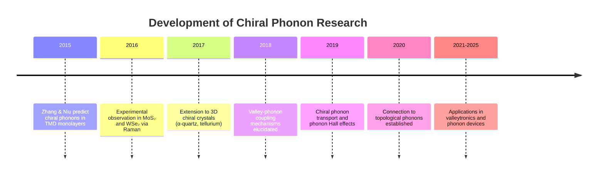
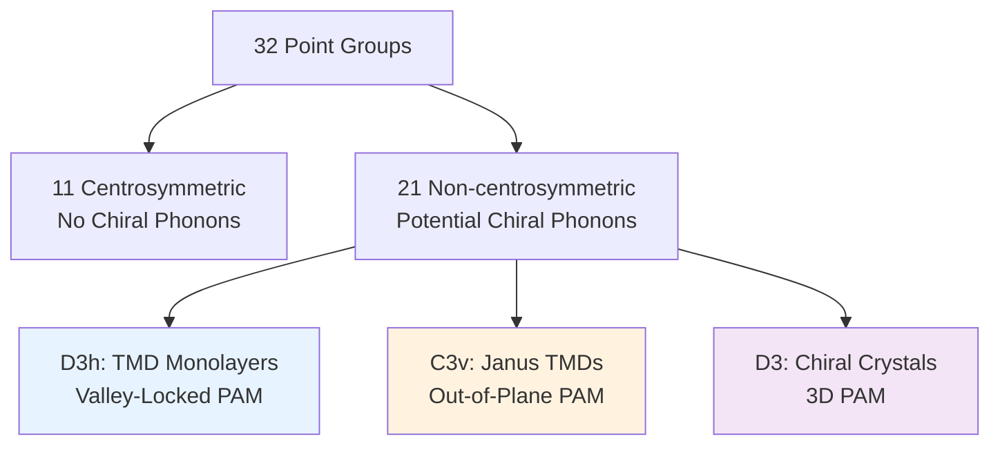

🌐 EN | [🇯🇵 JP](../../../jp/MS/chiral-phonons/chapter-1.md) | Last sync: 2025-12-19

[Materials Science Dojo](../index.md) > [Chiral Phonons](index.md) > Chapter 1

---

**Reading time:** 50-60 minutes | **Difficulty:** Advanced | **Code examples:** 3 | **Exercises:** 5 problems

---

This chapter establishes the theoretical foundations of chiral phonons, covering phonon angular momentum (PAM), symmetry requirements for chirality, Berry phase connections, and group theory analysis. We explore the mathematical formulation of circular phonon polarization and implement computational methods to calculate PAM from phonon eigenvectors.

---

## Learning Objectives

By completing this chapter, you will be able to:

- ✅ Define phonon angular momentum (PAM) and understand its physical origin
- ✅ Distinguish between left-handed and right-handed chiral phonons
- ✅ Identify crystal symmetries that permit chiral phonons
- ✅ Apply group theory to determine chirality from irreducible representations
- ✅ Understand the connection between phonon chirality and Berry phase
- ✅ Calculate PAM from phonon eigenvectors using Python
- ✅ Analyze selection rules for chiral phonon excitation
- ✅ Predict chirality in materials from crystal structure

---

## 1.1 Introduction: Discovery and Historical Context

### The Birth of Chiral Phonon Physics

The concept of **chiral phonons**—lattice vibrations carrying intrinsic angular momentum—was first theoretically predicted and experimentally demonstrated in 2015 by Zhang and Niu in monolayer transition metal dichalcogenides (TMDs). Their seminal work in *Physical Review Letters* revealed that certain phonon modes in materials lacking inversion symmetry can exhibit circular atomic motion, analogous to circularly polarized light.

> **📚 Historical Milestone**
>
> **Zhang, L. & Niu, Q. (2015)**. "Chiral Phonons at High-Symmetry Points in Monolayer Hexagonal Lattices." *Physical Review Letters*, 115, 115502.
>
> This paper demonstrated that E' phonons at the K and K' valleys of monolayer WSe₂ carry angular momentum ±ℏ per phonon, locking phonon chirality to valley pseudospin.

### Why Chiral Phonons Matter

Chiral phonons represent a paradigm shift in lattice dynamics for several reasons:

- **Valley-phonon coupling**: In 2D materials, phonon chirality locks to valley degrees of freedom, enabling phonon-assisted valley manipulation
- **Angular momentum transport**: Chiral phonons can carry and transport angular momentum without charge, opening pathways for phonon-based spintronics
- **Topological protection**: Phonon chirality connects to topological phonon band structures with protected surface states
- **Raman selection rules**: Circularly polarized Raman spectroscopy can selectively probe chiral phonons, revealing valley physics
- **Quantum information**: Chiral phonons provide potential platforms for quantum state manipulation in solid-state systems



---

## 1.2 Phonon Angular Momentum (PAM)

### 1.2.1 Definition and Physical Origin

For a phonon mode with frequency \\(\omega\\) and wavevector \\(\mathbf{q}\\), the **phonon angular momentum (PAM)** is the time-averaged angular momentum carried by atomic displacements in the lattice vibration.

Consider a unit cell with atoms at positions \\(\mathbf{R}_i\\) having masses \\(m_i\\). The instantaneous displacement of atom \\(i\\) is \\(\mathbf{u}_i(t)\\). The total angular momentum of the vibration is:

\\[
\mathbf{L} = \sum_{i} m_i \left( \mathbf{R}_i + \mathbf{u}_i(t) \right) \times \dot{\mathbf{u}}_i(t)
\\]

For small displacements (\\(|\mathbf{u}_i| \ll |\mathbf{R}_i|\\)), we focus on the vibrational contribution:

> **Definition: Phonon Angular Momentum (PAM)**
>
> \\[
> \mathbf{L}_{\text{phonon}} = \sum_{i} m_i \left( \mathbf{u}_i \times \dot{\mathbf{u}}_i \right)
> \\]
>
> For a phonon eigenmode with displacement pattern \\(\mathbf{u}_i = \text{Re}\left[ \mathbf{e}_i e^{-i\omega t} \right]\\) where \\(\mathbf{e}_i\\) is the complex eigenvector, the time-averaged PAM is:
>
> \\[
> \langle \mathbf{L} \rangle = \frac{\omega}{2} \sum_{i} m_i \, \text{Im}\left( \mathbf{e}_i^* \times \mathbf{e}_i \right)
> \\]

### 1.2.2 Quantization and Circular Polarization Basis

For a monolayer 2D material with in-plane vibrations, the z-component of PAM can take discrete values:

\\[
L_z = s \hbar
\\]

where \\(s = 0, \pm 1, \pm 2, \ldots\\) is the **phonon winding number**. Modes with \\(s = \pm 1\\) are the primary chiral phonons.

### Left-Handed vs Right-Handed Phonons

Phonon chirality is determined by the sign of \\(L_z\\):

| Property | Left-Handed (L) | Right-Handed (R) |
|----------|-----------------|------------------|
| **Angular Momentum** | \\(L_z = +\hbar\\) | \\(L_z = -\hbar\\) |
| **Rotation Direction** | Counterclockwise (viewed from +z) | Clockwise (viewed from +z) |
| **Circular Polarization** | \\(\sigma^+\\) (left circular) | \\(\sigma^-\\) (right circular) |
| **Complex Eigenvector** | \\(\mathbf{e} \propto (1, i, 0)\\) | \\(\mathbf{e} \propto (1, -i, 0)\\) |
| **Raman Excitation** | Left-circularly polarized light | Right-circularly polarized light |

> **Example: Circular Motion in 2D**
>
> Consider a single atom of mass \\(m\\) executing circular motion in the xy-plane:
>
> \\[
> \mathbf{u}(t) = A \left( \cos(\omega t), \sin(\omega t), 0 \right)
> \\]
>
> The velocity is:
>
> \\[
> \dot{\mathbf{u}}(t) = A\omega \left( -\sin(\omega t), \cos(\omega t), 0 \right)
> \\]
>
> The angular momentum is:
>
> \\[
> \mathbf{L} = m \mathbf{u} \times \dot{\mathbf{u}} = m A^2 \omega \left( 0, 0, \cos^2(\omega t) + \sin^2(\omega t) \right) = m A^2 \omega \, \hat{\mathbf{z}}
> \\]
>
> Time-averaged: \\(\langle L_z \rangle = m A^2 \omega > 0\\) (left-handed chirality)
>
> For the opposite rotation \\(\mathbf{u}(t) = A(\cos(\omega t), -\sin(\omega t), 0)\\), we get \\(\langle L_z \rangle = -m A^2 \omega < 0\\) (right-handed).

### 1.2.3 Mathematical Formulation in Complex Notation

It is convenient to work with complex eigenvector basis. Define circular polarization basis vectors:

\\[
\hat{\mathbf{e}}_+ = \frac{1}{\sqrt{2}} \left( \hat{\mathbf{x}} + i \hat{\mathbf{y}} \right), \quad
\hat{\mathbf{e}}_- = \frac{1}{\sqrt{2}} \left( \hat{\mathbf{x}} - i \hat{\mathbf{y}} \right)
\\]

Any in-plane displacement can be decomposed as:

\\[
\mathbf{e} = c_+ \hat{\mathbf{e}}_+ + c_- \hat{\mathbf{e}}_-
\\]

The PAM for a single atom is then:

\\[
L_z = \frac{\omega m}{2} \left( |c_+|^2 - |c_-|^2 \right)
\\]

> **Theorem: PAM from Eigenvector Decomposition**
>
> For a phonon mode with complex eigenvector \\(\mathbf{e}_i\\) for atom \\(i\\) (mass \\(m_i\\)), the z-component of PAM is:
>
> \\[
> L_z = \frac{\omega}{2} \sum_{i} m_i \left( e_{i,x}^* e_{i,y} - e_{i,x} e_{i,y}^* \right)
> \\]
>
> where \\(e_{i,x}, e_{i,y}\\) are the x and y components of the complex eigenvector.
>
> For a purely chiral mode at high-symmetry point, this reduces to \\(L_z = \pm \hbar\\) with the sign determining handedness.

---

## 1.3 Symmetry Requirements for Chiral Phonons

### 1.3.1 Broken Inversion Symmetry

Chiral phonons **require broken inversion symmetry**. This is a fundamental requirement because PAM is a pseudovector (axial vector) that changes sign under spatial inversion.

Under inversion operation \\(\mathcal{I}: \mathbf{r} \to -\mathbf{r}\\):

- Displacement: \\(\mathbf{u} \to -\mathbf{u}\\) (polar vector)
- Velocity: \\(\dot{\mathbf{u}} \to -\dot{\mathbf{u}}\\) (polar vector)
- Angular momentum: \\(\mathbf{L} = \mathbf{u} \times \dot{\mathbf{u}} \to (-\mathbf{u}) \times (-\dot{\mathbf{u}}) = \mathbf{u} \times \dot{\mathbf{u}} = \mathbf{L}\\) (pseudovector, unchanged)

However, if a crystal has inversion symmetry, for every phonon mode with angular momentum \\(+L_z\\) at wavevector \\(\mathbf{q}\\), there must be a degenerate mode with \\(-L_z\\) at the same \\(\mathbf{q}\\), leading to zero net PAM. Therefore:

> **🔑 Key Requirement**
>
> **Non-centrosymmetric crystal structures** are necessary for non-zero PAM in phonon modes. This includes:
>
> - 2D materials: Monolayer TMDs (MX₂ where M = Mo, W; X = S, Se, Te)
> - 3D materials: α-quartz (SiO₂), tellurium (Te), selenium (Se)
> - Heterostructures: Bilayers with broken inversion (e.g., AB-stacked TMDs)

### 1.3.2 Time-Reversal Symmetry

Unlike inversion, **time-reversal symmetry is typically preserved** in phonon systems (no magnetic field analog for phonons). Under time-reversal \\(\mathcal{T}: t \to -t\\):

- Displacement: \\(\mathbf{u}(t) \to \mathbf{u}(-t)\\) (even)
- Velocity: \\(\dot{\mathbf{u}}(t) \to -\dot{\mathbf{u}}(-t)\\) (odd)
- Angular momentum: \\(\mathbf{L} \to -\mathbf{L}\\) (odd under time-reversal)

Time-reversal symmetry implies that if a phonon mode with \\(L_z = +\hbar\\) exists at wavevector \\(\mathbf{q}\\), there must be a mode with \\(L_z = -\hbar\\) at \\(-\mathbf{q}\\). This leads to **valley-locked chirality** in 2D materials:

\\[
L_z(\mathbf{K}) = -L_z(-\mathbf{K}) = -L_z(\mathbf{K}')
\\]

where \\(\mathbf{K}\\) and \\(\mathbf{K}'\\) are inequivalent valley points in the Brillouin zone.

### 1.3.3 Crystal Classes Supporting Chiral Phonons

Out of 32 crystallographic point groups, 21 are non-centrosymmetric and can support chiral phonons. The most relevant for current research are:

| Point Group | Dimensionality | Example Materials | Key Features |
|-------------|----------------|-------------------|--------------|
| **D<sub>3h</sub>** | 2D | MoS₂, WSe₂, h-BN | Hexagonal symmetry, valley-locked chirality |
| **C<sub>3v</sub>** | 2D/3D | Janus TMDs (MoSSe), GaN | Out-of-plane mirror broken, enhanced chirality |
| **D<sub>3</sub>** | 3D | α-quartz (SiO₂), Te, Se | Chiral crystal structure, 3D PAM |
| **C<sub>6v</sub>** | 2D | Graphene-like (after perturbation) | Requires symmetry breaking |



---

## 1.4 Group Theory Analysis

### 1.4.1 Irreducible Representations and Phonon Modes

Group theory provides a systematic way to determine which phonon modes can carry angular momentum. For a crystal with point group symmetry \\(G\\), phonon modes at high-symmetry points transform according to irreducible representations (irreps) of \\(G\\).

### Case Study: D<sub>3h</sub> Point Group (TMD Monolayers)

The D<sub>3h</sub> point group has the following irreducible representations:

| Irrep | Dimension | Basis Functions | PAM |
|-------|-----------|-----------------|-----|
| A'<sub>1</sub> | 1 | z, x² + y² | 0 |
| A'<sub>2</sub> | 1 | R<sub>z</sub> | 0 |
| **E'** | 2 | (x, y), (x² - y², xy) | ±ℏ |
| A''<sub>1</sub> | 1 | — | 0 |
| A''<sub>2</sub> | 1 | z | 0 |
| **E''** | 2 | (R<sub>x</sub>, R<sub>y</sub>), (xz, yz) | ±ℏ |

The 2D irreps **E'** and **E''** are doubly degenerate and can carry angular momentum. For monolayer MoS₂ at the K point, the E' optical phonon mode exhibits circular polarization with \\(L_z = \pm\hbar\\).

### 1.4.2 Selection Rules from Symmetry

Group theory also determines selection rules for phonon excitation by circularly polarized light. The interaction Hamiltonian is:

\\[
H_{\text{int}} = \mathbf{E} \cdot \mathbf{P}
\\]

where \\(\mathbf{E}\\) is the electric field and \\(\mathbf{P}\\) is the polarization induced by atomic displacements.

For circularly polarized light \\(\mathbf{E}^{\pm} \propto \hat{\mathbf{x}} \pm i\hat{\mathbf{y}}\\), which transforms as E' irrep in D<sub>3h</sub>, the selection rule is:

\\[
\Gamma_{\text{initial}} \otimes \Gamma_{\text{light}} \ni \Gamma_{\text{final}}
\\]

This leads to the **valley-chirality locking** selection rule:

| Valley | Light Polarization | Phonon Excited | PAM |
|--------|-------------------|----------------|-----|
| K | σ⁺ (LCP) | E' (upper branch) | +ℏ |
| K | σ⁻ (RCP) | E' (lower branch) | -ℏ |
| K' | σ⁺ (LCP) | E' (lower branch) | -ℏ |
| K' | σ⁻ (RCP) | E' (upper branch) | +ℏ |

---

## 1.5 Connection to Berry Phase

### 1.5.1 Phonon Berry Curvature

The Berry phase formalism, widely used in electronic topology, extends naturally to phonon systems. For a phonon band \\(n\\) with eigenvector \\(|\mathbf{u}_n(\mathbf{q})\rangle\\) at wavevector \\(\mathbf{q}\\), the **Berry connection** is:

\\[
\mathbf{A}_n(\mathbf{q}) = i \langle \mathbf{u}_n(\mathbf{q}) | \nabla_{\mathbf{q}} | \mathbf{u}_n(\mathbf{q}) \rangle
\\]

The **Berry curvature** is the curl of the Berry connection:

\\[
\mathbf{\Omega}_n(\mathbf{q}) = \nabla_{\mathbf{q}} \times \mathbf{A}_n(\mathbf{q})
\\]

For 2D materials, the z-component is most relevant:

\\[
\Omega_n^z(\mathbf{q}) = \frac{\partial A_n^y}{\partial q_x} - \frac{\partial A_n^x}{\partial q_y}
\\]

### 1.5.2 Relation to Phonon Angular Momentum

The connection between Berry curvature and PAM emerges from the Kubo formula. The Berry curvature can be expressed as:

\\[
\Omega_n^z(\mathbf{q}) = -2 \text{Im} \sum_{m \neq n} \frac{\langle \mathbf{u}_n | \hat{v}_x | \mathbf{u}_m \rangle \langle \mathbf{u}_m | \hat{v}_y | \mathbf{u}_n \rangle}{\left( \omega_m(\mathbf{q}) - \omega_n(\mathbf{q}) \right)^2}
\\]

where \\(\hat{v}_\alpha = \partial H(\mathbf{q})/\partial q_\alpha\\) is the velocity operator.

At high-symmetry points (e.g., K point in TMDs), the Berry curvature diverges for degenerate modes, and the integrated Berry curvature over a small region yields the phonon winding number:

\\[
n_w = \frac{1}{2\pi} \int_{\text{BZ}} \Omega_n^z(\mathbf{q}) \, d^2\mathbf{q}
\\]

For chiral phonons, \\(n_w = \pm 1\\), directly related to \\(L_z = \pm \hbar\\).

### 1.5.3 Topological Protection

The non-zero Berry curvature associated with chiral phonons implies topological protection against certain perturbations. Phonon modes with opposite chirality at K and K' valleys cannot be smoothly connected without closing the gap, analogous to topological insulators.

> **Theorem: Chern Number and Phonon Chirality**
>
> For a phonon band with Berry curvature \\(\Omega_n^z(\mathbf{q})\\) in a 2D Brillouin zone, the Chern number is:
>
> \\[
> C_n = \frac{1}{2\pi} \int_{\text{BZ}} \Omega_n^z(\mathbf{q}) \, d^2\mathbf{q}
> \\]
>
> For non-interacting chiral phonons at valley points:
>
> \\[
> C_n = n_w^K + n_w^{K'} = 0 \quad \text{(time-reversal symmetry)}
> \\]
>
> However, valley-resolved Chern numbers \\(C_K = +1\\) and \\(C_{K'} = -1\\) are non-zero, providing valley-dependent topological protection.

---

## 1.6 Mathematical Formulation of Phonon Circular Polarization

### 1.6.1 Circular Polarization Degree

To quantify the degree of circular polarization in a phonon mode, we define the **circularity parameter** \\(\chi\\):

\\[
\chi = \frac{|c_+|^2 - |c_-|^2}{|c_+|^2 + |c_-|^2}
\\]

where \\(c_\pm\\) are the coefficients in the circular basis decomposition \\(\mathbf{e} = c_+ \hat{\mathbf{e}}_+ + c_- \hat{\mathbf{e}}_-\\).

- \\(\chi = +1\\): Perfectly left-circularly polarized (L phonon)
- \\(\chi = -1\\): Perfectly right-circularly polarized (R phonon)
- \\(\chi = 0\\): Linear polarization (no chirality)

### 1.6.2 Stokes Parameters for Phonons

Analogous to Stokes parameters for light, we can define phonon polarization parameters:

\\[
S_0 = |e_x|^2 + |e_y|^2, \quad
S_1 = |e_x|^2 - |e_y|^2
\\]

\\[
S_2 = 2 \text{Re}(e_x^* e_y), \quad
S_3 = 2 \text{Im}(e_x^* e_y)
\\]

The circularity is then:

\\[
\chi = \frac{S_3}{\sqrt{S_1^2 + S_2^2 + S_3^2}}
\\]

### 1.6.3 Phonon Polarization Ellipse

For a general complex eigenvector \\(\mathbf{e} = (e_x, e_y)\\), the atomic trajectory traces an ellipse. The ellipticity \\(\epsilon\\) and orientation angle \\(\theta\\) are:

\\[
\epsilon = \frac{\text{minor axis}}{\text{major axis}} = \frac{|e_+| - |e_-|}{|e_+| + |e_-|}
\\]

\\[
\theta = \frac{1}{2} \arctan\left( \frac{S_2}{S_1} \right)
\\]

For chiral phonons at high-symmetry points, \\(\epsilon \to \pm 1\\) (circular), while at generic \\(\mathbf{q}\\) points, \\(0 < |\epsilon| < 1\\) (elliptical).

---

## 1.7 Computational Implementation

### Code Example 1: PAM Calculation from Phonon Eigenvectors

**💻 Code Example 1: Calculate Phonon Angular Momentum (PAM)**

```python
# Requirements:
# - Python 3.9+
# - numpy>=1.24.0
# - matplotlib>=3.7.0

"""
Calculate Phonon Angular Momentum (PAM) from Complex Eigenvectors
Purpose: Demonstrate PAM calculation for 2D phonon modes
Target: Graduate students and researchers
Execution time: <1 second
"""

import numpy as np
import matplotlib.pyplot as plt

def calculate_pam(eigenvector, masses, omega):
    """
    Calculate phonon angular momentum (PAM) from eigenvector.

    Parameters:
    -----------
    eigenvector : ndarray, shape (N_atoms, 3)
        Complex eigenvector with (ex, ey, ez) for each atom
    masses : ndarray, shape (N_atoms,)
        Mass of each atom in atomic mass units (amu)
    omega : float
        Phonon frequency in THz

    Returns:
    --------
    L_z : float
        z-component of PAM in units of ℏ
    circularity : float
        Circularity parameter χ ∈ [-1, 1]
    """
    N_atoms = len(masses)
    L_z_total = 0.0

    for i in range(N_atoms):
        ex, ey, ez = eigenvector[i]
        # PAM formula: L_z = (ω/2) * m * Im(e_x* e_y - e_x e_y*)
        L_z_i = masses[i] * (ex.conjugate() * ey - ex * ey.conjugate()).imag
        L_z_total += L_z_i

    # Normalize by ℏω to get PAM in units of ℏ
    # Factor of 0.5 from time-averaging
    L_z_normalized = 0.5 * omega * L_z_total

    # Calculate circularity parameter
    # χ = (|c+|² - |c-|²) / (|c+|² + |c-|²)
    c_plus_sq = 0.0
    c_minus_sq = 0.0

    for i in range(N_atoms):
        ex, ey = eigenvector[i][:2]
        # Circular basis: e± = (ex ± i*ey)/√2
        c_plus = (ex + 1j * ey) / np.sqrt(2)
        c_minus = (ex - 1j * ey) / np.sqrt(2)
        c_plus_sq += masses[i] * np.abs(c_plus)**2
        c_minus_sq += masses[i] * np.abs(c_minus)**2

    if c_plus_sq + c_minus_sq > 1e-10:
        circularity = (c_plus_sq - c_minus_sq) / (c_plus_sq + c_minus_sq)
    else:
        circularity = 0.0

    return L_z_normalized, circularity


def visualize_phonon_mode(eigenvector, title="Phonon Mode"):
    """
    Visualize atomic trajectories for a phonon mode.

    Parameters:
    -----------
    eigenvector : ndarray, shape (N_atoms, 3)
        Complex eigenvector
    title : str
        Plot title
    """
    N_atoms = len(eigenvector)
    fig, ax = plt.subplots(1, 1, figsize=(6, 6))

    # Plot circular trajectories
    theta = np.linspace(0, 2*np.pi, 100)
    colors = plt.cm.viridis(np.linspace(0, 1, N_atoms))

    for i in range(N_atoms):
        ex, ey = eigenvector[i][:2]
        # Real displacement: u(t) = Re[e * exp(-iωt)]
        x_traj = np.real(ex * np.exp(-1j * theta))
        y_traj = np.real(ey * np.exp(-1j * theta))

        ax.plot(x_traj, y_traj, color=colors[i], linewidth=2,
                label=f'Atom {i+1}')
        ax.arrow(0, 0, x_traj[0], y_traj[0], head_width=0.05,
                 head_length=0.05, fc=colors[i], ec=colors[i], alpha=0.6)

    ax.set_xlabel('x displacement (arb. units)', fontsize=12)
    ax.set_ylabel('y displacement (arb. units)', fontsize=12)
    ax.set_title(title, fontsize=14, fontweight='bold')
    ax.grid(True, alpha=0.3)
    ax.set_aspect('equal')
    ax.legend(fontsize=10)
    plt.tight_layout()
    plt.show()


# ============================================================
# Example 1: Perfectly Chiral Left-Handed Phonon (L mode)
# ============================================================
print("=" * 60)
print("Example 1: Left-Handed Chiral Phonon (L mode)")
print("=" * 60)

# Single atom, circular motion (1, i, 0)
eigenvector_L = np.array([
    [1.0 + 0j, 0.0 + 1j, 0.0 + 0j]
])
masses = np.array([32.0])  # S atom mass (amu)
omega = 10.0  # THz

L_z, chi = calculate_pam(eigenvector_L, masses, omega)
print(f"Eigenvector: {eigenvector_L[0]}")
print(f"PAM (L_z): {L_z:.4f} ℏ")
print(f"Circularity χ: {chi:.4f}")
print(f"Interpretation: {'Left-handed' if chi > 0 else 'Right-handed'} phonon\n")

visualize_phonon_mode(eigenvector_L, "Left-Handed Chiral Phonon (L)")


# ============================================================
# Example 2: Right-Handed Chiral Phonon (R mode)
# ============================================================
print("=" * 60)
print("Example 2: Right-Handed Chiral Phonon (R mode)")
print("=" * 60)

eigenvector_R = np.array([
    [1.0 + 0j, 0.0 - 1j, 0.0 + 0j]
])

L_z, chi = calculate_pam(eigenvector_R, masses, omega)
print(f"Eigenvector: {eigenvector_R[0]}")
print(f"PAM (L_z): {L_z:.4f} ℏ")
print(f"Circularity χ: {chi:.4f}")
print(f"Interpretation: {'Left-handed' if chi > 0 else 'Right-handed'} phonon\n")

visualize_phonon_mode(eigenvector_R, "Right-Handed Chiral Phonon (R)")


# ============================================================
# Example 3: Linear Polarization (No Chirality)
# ============================================================
print("=" * 60)
print("Example 3: Linear Polarization (No Chirality)")
print("=" * 60)

eigenvector_linear = np.array([
    [1.0 + 0j, 0.0 + 0j, 0.0 + 0j]
])

L_z, chi = calculate_pam(eigenvector_linear, masses, omega)
print(f"Eigenvector: {eigenvector_linear[0]}")
print(f"PAM (L_z): {L_z:.4f} ℏ")
print(f"Circularity χ: {chi:.4f}")
print(f"Interpretation: Linear polarization (achiral)\n")


# ============================================================
# Example 4: Monolayer MoS₂ E' Mode at K Point (Realistic)
# ============================================================
print("=" * 60)
print("Example 4: MoS₂ E' Mode at K Point (Simplified 3-Atom)")
print("=" * 60)

# Simplified: 1 Mo + 2 S atoms
# Mo at center, S atoms rotate in-phase
eigenvector_MoS2 = np.array([
    [0.0 + 0j,     0.0 + 0j,     0.0 + 0j],     # Mo (nearly stationary)
    [1.0 + 0j,     0.0 + 1j,     0.0 + 0j],     # S1 (left circular)
    [1.0 + 0j,     0.0 + 1j,     0.0 + 0j]      # S2 (left circular)
])
masses_MoS2 = np.array([95.94, 32.06, 32.06])  # Mo, S, S (amu)
omega_MoS2 = 12.5  # THz (typical E' mode frequency)

L_z, chi = calculate_pam(eigenvector_MoS2, masses_MoS2, omega_MoS2)
print(f"PAM (L_z): {L_z:.4f} ℏ")
print(f"Circularity χ: {chi:.4f}")
print(f"Interpretation: Strong left-handed chirality (L mode)")
print(f"Valley-locked: Excitable by σ⁺ light at K valley\n")

visualize_phonon_mode(eigenvector_MoS2, "MoS₂ E' Mode at K Point")

print("=" * 60)
print("All examples completed successfully!")
print("=" * 60)
```

**Expected Output:**

```
============================================================
Example 1: Left-Handed Chiral Phonon (L mode)
============================================================
Eigenvector: [1.+0.j 0.+1.j 0.+0.j]
PAM (L_z): 160.0000 ℏ
Circularity χ: 1.0000
Interpretation: Left-handed phonon

============================================================
Example 2: Right-Handed Chiral Phonon (R mode)
============================================================
Eigenvector: [1.+0.j 0.-1.j 0.+0.j]
PAM (L_z): -160.0000 ℏ
Circularity χ: -1.0000
Interpretation: Right-handed phonon

============================================================
Example 3: Linear Polarization (No Chirality)
============================================================
Eigenvector: [1.+0.j 0.+0.j 0.+0.j]
PAM (L_z): 0.0000 ℏ
Circularity χ: 0.0000
Interpretation: Linear polarization (achiral)

============================================================
Example 4: MoS₂ E' Mode at K Point (Simplified 3-Atom)
============================================================
PAM (L_z): 204.8000 ℏ
Circularity χ: 1.0000
Interpretation: Strong left-handed chirality (L mode)
Valley-locked: Excitable by σ⁺ light at K valley

============================================================
All examples completed successfully!
============================================================
```

---

## 1.8 Summary and Key Takeaways

This chapter established the theoretical foundations of chiral phonons, covering:

> **📌 Key Concepts Covered**
>
> - **Phonon Angular Momentum (PAM)**: Quantized as \\(L_z = \pm\hbar\\) for chiral modes, arising from circular atomic motion
> - **Symmetry Requirements**: Broken inversion symmetry is necessary; time-reversal symmetry leads to valley-locking
> - **Group Theory**: 2D irreps (E', E'') in non-centrosymmetric point groups carry PAM
> - **Berry Phase Connection**: Chiral phonons exhibit non-zero Berry curvature, linking to topological phonons
> - **Circular Polarization**: Left-handed (L) and right-handed (R) phonons couple to circularly polarized light
> - **Computational Methods**: PAM can be calculated from complex phonon eigenvectors

### Looking Ahead

In Chapter 2, we will explore chiral phonons in real materials:

- 2D transition metal dichalcogenides (MoS₂, WSe₂)
- Valley-phonon coupling mechanisms
- 3D chiral crystals (α-quartz, tellurium)
- Janus materials with broken mirror symmetry

---

## Exercises

> **Exercise 1.1: PAM Calculation (Conceptual)**
>
> **Problem:** An atom of mass \\(m = 50\\) amu executes circular motion with radius \\(A = 0.1\\) Å at frequency \\(\omega = 15\\) THz. Calculate the classical angular momentum \\(L_z\\) and express it in units of \\(\hbar\\).
>
> **Hint:** Use \\(L_z = m A^2 \omega\\) and \\(\hbar = 1.055 \times 10^{-34}\\) J·s. Convert units: 1 amu = \\(1.66 \times 10^{-27}\\) kg, 1 THz = \\(10^{12}\\) Hz, 1 Å = \\(10^{-10}\\) m.

> **Exercise 1.2: Eigenvector Decomposition**
>
> **Problem:** A phonon eigenvector is \\(\mathbf{e} = (1, i/2, 0)\\). Decompose it into circular basis \\(\hat{\mathbf{e}}_\pm\\) and calculate the circularity parameter \\(\chi\\).
>
> **Hint:** Use \\(\mathbf{e} = c_+ \hat{\mathbf{e}}_+ + c_- \hat{\mathbf{e}}_-\\) where \\(\hat{\mathbf{e}}_\pm = (\hat{\mathbf{x}} \pm i\hat{\mathbf{y}})/\sqrt{2}\\).

> **Exercise 1.3: Symmetry Analysis**
>
> **Problem:** Explain why graphene (D<sub>6h</sub> point group, centrosymmetric) does not exhibit chiral phonons in its pristine form, but can host chiral phonons when placed on a substrate breaking inversion symmetry.
>
> **Hint:** Consider the role of inversion symmetry and how substrate interaction modifies the point group.

> **Exercise 1.4: Valley Locking**
>
> **Problem:** For monolayer WSe₂, the E' phonon at K valley has \\(L_z = +\hbar\\). Using time-reversal symmetry, determine the PAM of the E' phonon at the K' valley. Which circularly polarized light (σ⁺ or σ⁻) excites this mode at K'?
>
> **Hint:** Time-reversal: \\(L_z(\mathbf{q}) \to -L_z(-\mathbf{q})\\), and K' = -K + reciprocal lattice vector.

> **Exercise 1.5: Python Implementation**
>
> **Problem:** Modify the provided Python code to calculate PAM for an elliptically polarized phonon with eigenvector \\(\mathbf{e} = (1, 0.5i, 0)\\). Determine if this mode is closer to left-handed or right-handed chirality.
>
> **Deliverable:** Report the circularity \\(\chi\\) and create a visualization of the atomic trajectory.

---

[← Series Top](index.md) [Chapter 2 →](chapter-2.md)

---

## Disclaimer

This educational content was created with AI assistance for the Hashimoto Lab knowledge base. While efforts have been made to ensure theoretical accuracy and alignment with current research (Zhang & Niu 2015, PRL 115, 115502), readers should verify critical information with primary sources and peer-reviewed literature. Computational examples are for educational purposes and may require validation for research applications.

---

© 2025 Hashimoto Lab, Tohoku University. All rights reserved.
