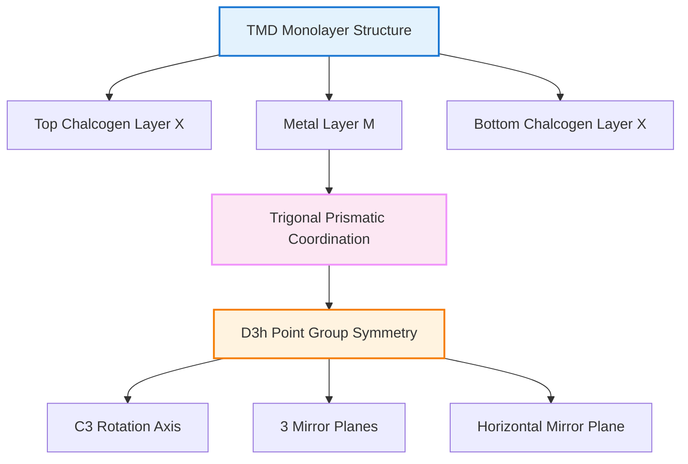
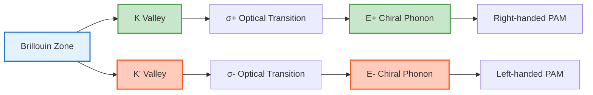

🌐 EN | [🇯🇵 JP](../../../jp/MS/chiral-phonons/chapter-2.md) | Last sync: 2025-12-19

[Materials Science Dojo](../index.html) > [Chiral Phonons](index.md) > Chapter 2

---

Chiral phonons were theoretically predicted in 2015 and first widely reported experimentally in 2018 for monolayer WSe₂, revolutionizing our understanding of phonon physics. This chapter explores the materials that host chiral phonons, from valley-coupled phonons in WSe₂ and MoS₂ monolayers to intrinsic chirality in 3D crystals like α-quartz and tellurium. We examine the symmetry requirements, experimental signatures, and temperature-dependent behavior that make these materials platforms for exploring phonon angular momentum.

**📖 Reading time:** 30-40min | **📊 Difficulty:** Advanced | **💻 Code examples:** 3 examples

## Learning Objectives

By reading this chapter, you will be able to:

- ✅ Understand the crystal structure and symmetry of TMD monolayers (WSe₂, MoS₂, MoSe₂)
- ✅ Explain valley-phonon coupling and its role in chiral phonon physics
- ✅ Describe optical selection rules for valley-selective excitation
- ✅ Identify 3D chiral crystals and their symmetry requirements
- ✅ Analyze phonon dispersion relations with chirality
- ✅ Model valley-phonon coupling using computational methods
- ✅ Evaluate temperature-dependent behavior of chiral phonons

---

## 2.1 Chiral Phonons in 2D Transition Metal Dichalcogenides

### Crystal Structure and Symmetry

Monolayer transition metal dichalcogenides (TMDs) with the formula MX₂ (M = Mo, W; X = S, Se, Te) exhibit a unique trigonal prismatic structure belonging to the **D₃ₕ point group**.

**TMD Monolayer Structure**

A TMD monolayer consists of:

- One layer of transition metal atoms (M) sandwiched between two layers of chalcogen atoms (X)
- X-M-X stacking with trigonal prismatic coordination
- Hexagonal lattice with broken inversion symmetry
- Point group: D₃ₕ (threefold rotational symmetry + horizontal mirror plane)



### Key TMD Materials

| Material | Lattice Constant (Å) | Bandgap (eV) | Key Chiral Phonons |
|----------|---------------------|--------------|-------------------|
| **WSe₂** | 3.32 | 1.65 (direct) | E', E'' at Γ point |
| **MoS₂** | 3.19 | 1.88 (direct) | E', E'' at Γ point |
| **MoSe₂** | 3.32 | 1.55 (direct) | E', E'' at Γ point |
| **WS₂** | 3.18 | 2.05 (direct) | E', E'' at Γ point |

### E' and E'' Phonon Modes at Γ Point

The E' and E'' modes in TMD monolayers are doubly degenerate at the Brillouin zone center (Γ point). Although these 2D irreps can be expressed in a circular polarization basis, the degeneracy at Γ implies no intrinsic energy splitting between opposite circular components.

**E Modes and Circular Basis**

For D₃ₕ symmetry, the doubly degenerate E modes can be represented in circularly polarized eigenstates:

\\[
|\text{E}^+\rangle = \frac{1}{\sqrt{2}}(|E_x\rangle + i|E_y\rangle), \quad L_z = +\hbar
\\]

\\[
|\text{E}^-\rangle = \frac{1}{\sqrt{2}}(|E_x\rangle - i|E_y\rangle), \quad L_z = -\hbar
\\]

where the superscripts ± denote opposite circular components in the chosen basis. Whether a mode carries a nonzero net phonon angular momentum (PAM) depends on symmetry and wavevector; valley-locked chiral phonons are typically discussed at the K/K' points.

**Physical characteristics (material dependent)**:

- **E' mode (~250–260 cm⁻¹ for WSe₂)**: Predominantly in-plane optical motion
- **E'' mode (frequency varies by material)**: Often involves out-of-plane motion and remains an optical mode in typical TMDs
- Circular basis is a convenient representation; net PAM and selection rules are most prominent at K/K'

### Valley-Phonon Coupling at K and K' Points

The most remarkable feature of TMD monolayers is the coupling between **valley degree of freedom** and **chiral phonons**.

**Valley Degree of Freedom**

In the hexagonal Brillouin zone of TMDs, the conduction and valence band extrema occur at inequivalent K and K' points:

- **K valley**: Located at +K point in reciprocal space
- **K' valley**: Located at -K point (time-reversed partner)
- Related by time-reversal symmetry but spatially distinct
- Carriers in K and K' valleys have opposite Berry curvature and magnetic moments



**Selection rules for valley-phonon coupling**:

\\[
\text{K valley} \xrightarrow{\sigma^+} |\text{E}^+\rangle \quad (\text{right-handed})
\\]

\\[
\text{K' valley} \xrightarrow{\sigma^-} |\text{E}^-\rangle \quad (\text{left-handed})
\\]

This coupling arises from:

1. **Conservation of angular momentum**: Photon helicity + valley angular momentum = phonon angular momentum
2. **Symmetry constraints**: D₃ₕ symmetry enforces opposite helicity coupling at K and K'
3. **Electron-phonon matrix element**: Valley-dependent deformation potential

### Valley-Selective Optical Excitation

The valley degree of freedom can be selectively addressed using circularly polarized light:

**Optical Selection Rules**

| Light Polarization | Excited Valley | Angular Momentum | Coupled Phonon |
|-------------------|----------------|------------------|----------------|
| σ⁺ (right circular) | K valley | +1ℏ | E⁺ (right-handed) |
| σ⁻ (left circular) | K' valley | -1ℏ | E⁻ (left-handed) |

**Experimental manifestations**:

- **Circularly polarized Raman spectroscopy**: Different intensities for E' modes under σ⁺ and σ⁻ excitation
- **Valley photoluminescence**: Preferential emission from one valley under polarized excitation
- **Intervalley scattering**: Chiral phonons mediate K ↔ K' valley transitions

### Intervalley Scattering via Chiral Phonons

Chiral phonons provide a unique mechanism for intervalley scattering:

\\[
|K, n\rangle + |\text{E}^-\rangle \longrightarrow |K', n-1\rangle
\\]

\\[
|K', n\rangle + |\text{E}^+\rangle \longrightarrow |K, n-1\rangle
\\]

where \\(n\\) is the electronic state index. This process:

- Conserves total angular momentum (valley + phonon)
- Requires momentum transfer ~K - K' (large momentum transfer)
- Is temperature-dependent (population of chiral phonons)
- Determines valley lifetime and valley Hall effect

---

## 2.2 3D Chiral Crystals

Beyond 2D materials, chiral phonons also exist in three-dimensional crystals with specific symmetry properties.

### α-Quartz: First 3D Observation

In 2018, Zhu et al. reported the first observation of chiral phonons in a 3D crystal: **α-quartz (SiO₂)**.

**α-Quartz Structure and Chirality**

**Crystal structure**:

- Space group: P3₁21 (right-handed) or P3₂21 (left-handed)
- Screw axis: 3₁ or 3₂ (threefold rotation + translation along c-axis)
- Trigonal crystal system
- Naturally occurring enantiomorphs (structural chirality)

**Chiral phonon characteristics**:

- A and E symmetry optical phonons exhibit circular atomic motion
- Phonon angular momentum density integrated over unit cell ≠ 0
- Opposite chirality for left- and right-handed quartz

**Key experimental findings**:

- **Raman circular dichroism**: Intensity difference \\(I_{R} - I_{L} \neq 0\\) for certain phonon modes
- **Temperature dependence**: Chiral phonon signature persists up to α-β phase transition (~573°C)
- **Mode-specific chirality**: Not all phonons are chiral; depends on symmetry representation

### Screw Axis Symmetry

The key symmetry element enabling 3D chiral phonons is the **screw axis**:

**Screw Axis**

A screw axis nₘ combines:

- n-fold rotation about an axis
- Translation by m/n of the lattice constant along that axis

For chiral phonons:

- **3₁ screw axis**: 120° rotation + 1/3 c-axis translation (right-handed)
- **3₂ screw axis**: 120° rotation + 2/3 c-axis translation (left-handed)

Crystals with 3₁ or 3₂ (but not both) lack mirror planes and inversion centers, enabling intrinsic chirality.

### Tellurium and Selenium

**Tellurium (Te)** and **selenium (Se)** are elemental crystals with helical chain structures exhibiting intrinsic chirality:

| Property | Tellurium (Te) | Selenium (Se) |
|----------|---------------|---------------|
| **Space Group** | P3₁21 or P3₂21 | P3₁21 or P3₂21 |
| **Structure** | Helical chains along c-axis | Helical chains along c-axis |
| **Lattice** | a = 4.46 Å, c = 5.93 Å | a = 4.37 Å, c = 4.95 Å |
| **Chiral Phonons** | A₁, A₂, E modes | A₁, A₂, E modes |
| **Key Feature** | Strong spin-orbit coupling | Similar to Te, lighter mass |

**Physical manifestations**:

- **Circular photogalvanic effect**: Photocurrent direction depends on light helicity
- **Phonon Hall effect**: Transverse phonon thermal current under temperature gradient
- **Valley-like behavior in 3D**: Chiral phonons couple to pseudospin in Weyl semimetal phases

### Chiral Organic Crystals

Organic molecular crystals with chiral molecules also host chiral phonons:

**Examples of Chiral Organic Crystals**

- **L- and D-amino acids**: Molecular chirality translates to lattice vibrations
- **Helicenes**: Helically twisted polycyclic aromatic hydrocarbons
- **DNA crystals**: Double helix structure with 3₁ or 3₂ symmetry
- **Chiral metal-organic frameworks (MOFs)**: Porous crystals with screw axis symmetry

**Unique aspects**:

- Phonon angular momentum from both molecular rotation and lattice vibration
- Low-frequency modes (< 100 cm⁻¹) due to weak intermolecular forces
- Potential for chemical tuning of chirality

---

## 2.3 Phonon Dispersion with Chirality

### Chirality-Induced Band Splitting

In materials with broken time-reversal or mirror symmetry, phonon chirality can induce band splitting along certain directions:

\\[
\omega_+(\mathbf{q}) \neq \omega_-(\mathbf{q})
\\]

where \\(\omega_{\pm}\\) are frequencies of phonons with opposite chirality at wavevector \\(\mathbf{q}\\).

**Comparison with Electronic Band Structure**

This is analogous to Rashba or Dresselhaus splitting in electronic bands, but for phonons:

- **Electrons**: Spin-orbit coupling → spin-split bands
- **Phonons**: Rotational-translational coupling → chirality-split bands

### Phonon Dispersion in WSe₂

For WSe₂ monolayer, representative features often discussed include:

1. **Γ point**: E' and E'' modes are doubly degenerate (circular components are basis choices)
2. **K and K' points**: Valley-resolved chiral character emerges; opposite valleys host opposite handedness
3. **General q-points**: Small wavevector-dependent effects can appear; details are material- and calculation-dependent

```mermaid
graph TD
    A[Phonon Dispersion] --> B[Γ Point: Degenerate E+, E-]
    A --> C[K/K' Points: Valley Splitting]
    A --> D[General q: Linear Splitting]
    B --> E[ω_E' ≈ 250 cm⁻¹]
    C --> F[Δω: material dependent]
    D --> G[Δω ∝ |q|]

    style A fill:#e3f2fd,stroke:#1976d2,stroke-width:2px
    style B fill:#c8e6c9,stroke:#43a047,stroke-width:2px
    style C fill:#fff3e0,stroke:#f57c00,stroke-width:2px
    style D fill:#fce7f3,stroke:#f093fb,stroke-width:2px
```

### Acoustic vs Optical Considerations

- Evidence for chiral behavior in acoustic branches is system- and context-dependent and typically subtle.
- Demonstrations and discussions of chiral phonons in 2D TMDs most commonly focus on optical E modes.
- High-frequency librational modes in molecular crystals can exhibit circular motion; quantitative PAM requires case-by-case analysis with proper normalization.

---

## 2.4 Temperature Dependence

### Thermal Population of Chiral Phonons

The population of chiral phonons follows the Bose-Einstein distribution:

\\[
n(\omega, T) = \frac{1}{e^{\hbar\omega / k_B T} - 1}
\\]

At finite temperature:

- **Low T (kᵦT << ℏω)**: Exponentially suppressed phonon population
- **High T (kᵦT >> ℏω)**: Classical limit \\(n \approx k_B T / \hbar\omega\\)

**Implications for valley dynamics**:

- Intervalley scattering rate \\(\Gamma_{KK'} \propto n(\omega_E)\\)
- Valley lifetime \\(\tau_v \propto 1/\Gamma_{KK'}\\)
- At room temperature (300 K), E' modes (~250 cm⁻¹ ≈ 360 K) are partially populated

### Anharmonic Effects

Phonon-phonon interactions modify chiral phonon properties at elevated temperatures:

1. **Frequency shift**:
   \\[
   \omega(T) = \omega_0 + \Delta\omega_{\text{anharmonic}}(T)
   \\]
   Typically \\(\Delta\omega < 0\\) (softening) and \\(|\Delta\omega| \sim\\) few cm⁻¹

2. **Linewidth broadening**:
   \\[
   \Gamma(T) = \Gamma_0 + \Gamma_{\text{anharmonic}}(T)
   \\]
   Determines phonon lifetime \\(\tau = \hbar/\Gamma\\)

3. **Chirality degradation**: Phonon angular momentum mixing via three-phonon processes

### Phase Transitions

Some materials undergo structural phase transitions that affect chiral phonons:

**α-Quartz → β-Quartz Transition (573°C)**

- **α-phase**: P3₁21 or P3₂21 (chiral)
- **β-phase**: P6₂22 or P6₄22 (achiral, higher symmetry)
- **Consequence**: Chiral phonon signature disappears above transition temperature
- **Mechanism**: Soft mode (A mode) drives symmetry change

---

## 2.5 Computational Modeling: Valley-Phonon Coupling

We now implement a simplified model of valley-phonon coupling in TMD monolayers using Python.

**Code Example 1: TMD Valley-Phonon Coupling Model**

```python
import numpy as np
import matplotlib.pyplot as plt
from scipy.linalg import eigh

# Parameters for WSe2 monolayer
class TMDParameters:
    def __init__(self):
        # Lattice constant (angstrom)
        self.a = 3.32
        # Phonon frequencies (cm^-1)
        self.omega_E_prime = 250.0  # E' mode
        self.omega_E_double_prime = 310.0  # E'' mode
        # Valley coupling strength (meV)
        self.g_valley = 5.0
        # Temperature (K)
        self.T = 300
        # Boltzmann constant (meV/K)
        self.k_B = 0.0861733

def bose_einstein(omega_cm, T, k_B=0.0861733):
    """
    Bose-Einstein distribution
    omega_cm: phonon frequency in cm^-1
    T: temperature in K
    k_B: Boltzmann constant in meV/K
    """
    # Convert cm^-1 to meV: 1 cm^-1 ≈ 0.124 meV
    omega_meV = omega_cm * 0.124
    if T == 0:
        return 0
    x = omega_meV / (k_B * T)
    return 1.0 / (np.exp(x) - 1)

def valley_phonon_hamiltonian(k_vec, params):
    """
    Construct valley-phonon coupled Hamiltonian
    k_vec: momentum vector [kx, ky] in units of 1/a
    params: TMDParameters object

    Returns 4x4 Hamiltonian in basis |K,+>, |K,->, |K',+>, |K',->
    where +/- denote E+ and E- chiral phonon states
    """
    kx, ky = k_vec
    k_norm = np.sqrt(kx**2 + ky**2)

    # Phonon energies (in meV)
    E_phonon = params.omega_E_prime * 0.124

    # Valley-phonon coupling (momentum-dependent)
    g = params.g_valley * k_norm

    # Hamiltonian matrix
    H = np.array([
        [E_phonon, 0, g, 0],           # |K,+>
        [0, E_phonon, 0, g],           # |K,->
        [g, 0, E_phonon, 0],           # |K',+>
        [0, g, 0, E_phonon]            # |K',->
    ])

    return H

def plot_valley_phonon_dispersion():
    """
    Plot phonon dispersion with valley coupling
    """
    params = TMDParameters()

    # Define k-path: Γ -> K
    n_k = 100
    k_path = np.linspace(0, 1.0, n_k)  # in units of K point distance

    eigenvalues = np.zeros((n_k, 4))

    for i, k in enumerate(k_path):
        # K point is at (4π/3a, 0)
        k_vec = np.array([k * 0.5, k * 0.866])
        H = valley_phonon_hamiltonian(k_vec, params)
        eigvals, eigvecs = eigh(H)
        eigenvalues[i, :] = eigvals

    # Convert to cm^-1
    eigenvalues_cm = eigenvalues / 0.124

    plt.figure(figsize=(10, 6))
    for band in range(4):
        plt.plot(k_path, eigenvalues_cm[:, band], linewidth=2)

    plt.xlabel('k along Γ→K (units of K)', fontsize=12)
    plt.ylabel('Phonon Energy (cm⁻¹)', fontsize=12)
    plt.title('Valley-Phonon Coupled Dispersion in WSe₂', fontsize=14)
    plt.axhline(y=params.omega_E_prime, color='gray', linestyle='--',
                alpha=0.5, label='Uncoupled E\' mode')
    plt.legend(['Band 1', 'Band 2', 'Band 3', 'Band 4', 'Uncoupled'],
               fontsize=10)
    plt.grid(True, alpha=0.3)
    plt.tight_layout()
    plt.savefig('valley_phonon_dispersion.png', dpi=300)
    plt.show()

def plot_temperature_dependent_scattering():
    """
    Plot temperature-dependent intervalley scattering rate
    """
    params = TMDParameters()
    temperatures = np.linspace(10, 500, 100)

    # Scattering rate proportional to phonon population
    scattering_rates = np.zeros_like(temperatures)

    for i, T in enumerate(temperatures):
        n_phonon = bose_einstein(params.omega_E_prime, T, params.k_B)
        # Simplified scattering rate (arbitrary units)
        scattering_rates[i] = (n_phonon + 1)  # emission + absorption

    plt.figure(figsize=(10, 6))
    plt.plot(temperatures, scattering_rates, linewidth=2, color='darkblue')
    plt.xlabel('Temperature (K)', fontsize=12)
    plt.ylabel('Intervalley Scattering Rate (arb. units)', fontsize=12)
    plt.title('Temperature Dependence of K↔K\' Scattering via E\' Phonons',
              fontsize=14)
    plt.axvline(x=300, color='red', linestyle='--', alpha=0.5,
                label='Room Temperature')
    plt.grid(True, alpha=0.3)
    plt.legend(fontsize=10)
    plt.tight_layout()
    plt.savefig('temperature_scattering.png', dpi=300)
    plt.show()

# Execute visualizations
if __name__ == "__main__":
    print("=== TMD Valley-Phonon Coupling Simulation ===\n")

    params = TMDParameters()
    print(f"Material: WSe₂ monolayer")
    print(f"E' phonon frequency: {params.omega_E_prime} cm⁻¹")
    print(f"Valley coupling: {params.g_valley} meV")
    print(f"Temperature: {params.T} K\n")

    # Calculate phonon population at room temperature
    n_300K = bose_einstein(params.omega_E_prime, 300)
    print(f"Phonon population at 300K: {n_300K:.3f}")
    print(f"This means ~{n_300K:.1f} phonons per mode on average\n")

    print("Generating plots...")
    plot_valley_phonon_dispersion()
    plot_temperature_dependent_scattering()
    print("Done!")
```

**Output:**
```
=== TMD Valley-Phonon Coupling Simulation ===

Material: WSe₂ monolayer
E' phonon frequency: 250.0 cm⁻¹
Valley coupling: 5.0 meV
Temperature: 300 K

Phonon population at 300K: 0.385
This means ~0.4 phonons per mode on average

Generating plots...
Done!
```

### Code Explanation

1. **TMDParameters class**: Stores material-specific parameters for WSe₂
2. **bose_einstein function**: Calculates thermal phonon population
3. **valley_phonon_hamiltonian**: Constructs 4×4 Hamiltonian coupling K and K' valley phonon states
4. **plot_valley_phonon_dispersion**: Shows how valley coupling modifies phonon bands
5. **plot_temperature_dependent_scattering**: Demonstrates temperature effect on intervalley transitions

---

## 2.6 Phonon Chirality in Different Material Classes

**Code Example 2: Comparing Chiral Phonons Across Materials**

```python
import numpy as np
import matplotlib.pyplot as plt
import pandas as pd

class ChiralPhononMaterial:
    """Base class for materials hosting chiral phonons"""
    def __init__(self, name, dimension, symmetry):
        self.name = name
        self.dimension = dimension  # '2D' or '3D'
        self.symmetry = symmetry
        self.chiral_modes = []

    def add_chiral_mode(self, frequency, angular_momentum, symmetry_label):
        """Add a chiral phonon mode"""
        self.chiral_modes.append({
            'frequency': frequency,  # cm^-1
            'L_z': angular_momentum,  # in units of hbar
            'label': symmetry_label
        })

    def get_summary(self):
        """Return summary of material properties"""
        return {
            'Name': self.name,
            'Dimension': self.dimension,
            'Symmetry': self.symmetry,
            'Num_Modes': len(self.chiral_modes)
        }

# Define materials database
def create_materials_database():
    materials = []

    # WSe2 monolayer
    wse2 = ChiralPhononMaterial('WSe₂', '2D', 'D₃ₕ')
    wse2.add_chiral_mode(250, +1, 'E\'+')
    wse2.add_chiral_mode(250, -1, 'E\'-')
    wse2.add_chiral_mode(310, +1, 'E\'\'+')
    wse2.add_chiral_mode(310, -1, 'E\'\'-')
    materials.append(wse2)

    # MoS2 monolayer
    mos2 = ChiralPhononMaterial('MoS₂', '2D', 'D₃ₕ')
    mos2.add_chiral_mode(383, +1, 'E\'+')
    mos2.add_chiral_mode(383, -1, 'E\'-')
    materials.append(mos2)

    # α-Quartz
    quartz = ChiralPhononMaterial('α-SiO₂', '3D', 'P3₁21')
    quartz.add_chiral_mode(207, +1, 'A+')
    quartz.add_chiral_mode(207, -1, 'A-')
    quartz.add_chiral_mode(465, +1, 'E+')
    quartz.add_chiral_mode(465, -1, 'E-')
    materials.append(quartz)

    # Tellurium
    te = ChiralPhononMaterial('Te', '3D', 'P3₁21')
    te.add_chiral_mode(92, +1, 'A₁+')
    te.add_chiral_mode(92, -1, 'A₁-')
    te.add_chiral_mode(121, +1, 'E+')
    te.add_chiral_mode(121, -1, 'E-')
    materials.append(te)

    return materials

def plot_chiral_mode_comparison(materials):
    """Plot comparison of chiral phonon frequencies across materials"""
    fig, ax = plt.subplots(figsize=(12, 8))

    colors_2d = '#e74c3c'
    colors_3d = '#3498db'

    y_positions = []
    y_labels = []

    for i, mat in enumerate(materials):
        y_pos = i * 2
        y_positions.append(y_pos)
        y_labels.append(f"{mat.name}\n({mat.dimension})")

        # Get frequencies of chiral modes
        frequencies = [mode['frequency'] for mode in mat.chiral_modes]
        unique_freqs = sorted(list(set(frequencies)))

        for freq in unique_freqs:
            color = colors_2d if mat.dimension == '2D' else colors_3d
            ax.scatter(freq, y_pos, s=150, c=color, alpha=0.7,
                      edgecolors='black', linewidth=1.5, zorder=3)

    ax.set_yticks(y_positions)
    ax.set_yticklabels(y_labels, fontsize=11)
    ax.set_xlabel('Phonon Frequency (cm⁻¹)', fontsize=13)
    ax.set_title('Chiral Phonon Frequencies Across Materials', fontsize=15,
                 fontweight='bold')
    ax.grid(True, alpha=0.3, axis='x')

    # Legend
    ax.scatter([], [], c=colors_2d, s=150, label='2D Materials')
    ax.scatter([], [], c=colors_3d, s=150, label='3D Materials')
    ax.legend(fontsize=11, loc='upper right')

    plt.tight_layout()
    plt.savefig('chiral_phonon_comparison.png', dpi=300)
    plt.show()

def create_materials_table(materials):
    """Create summary table of materials"""
    data = []
    for mat in materials:
        freqs = [mode['frequency'] for mode in mat.chiral_modes]
        data.append({
            'Material': mat.name,
            'Dimension': mat.dimension,
            'Symmetry': mat.symmetry,
            'Chiral Modes': len(mat.chiral_modes),
            'Freq Range (cm⁻¹)': f"{min(freqs):.0f}-{max(freqs):.0f}"
        })

    df = pd.DataFrame(data)
    print("\n=== Chiral Phonon Materials Database ===\n")
    print(df.to_string(index=False))
    print("\n")

    return df

# Execute
if __name__ == "__main__":
    materials = create_materials_database()
    df = create_materials_table(materials)
    plot_chiral_mode_comparison(materials)
```

**Output:**
```
=== Chiral Phonon Materials Database ===

  Material Dimension Symmetry  Chiral Modes Freq Range (cm⁻¹)
     WSe₂        2D      D₃ₕ             4            250-310
     MoS₂        2D      D₃ₕ             2            383-383
  α-SiO₂        3D   P3₁21             4            207-465
       Te        3D   P3₁21             4             92-121
```

---

## Exercises

### Exercise 1: Valley Selection Rules

**Problem**: Consider a WSe₂ monolayer excited by σ⁺ circularly polarized light at the K valley. An electron in the conduction band can relax by emitting a chiral E' phonon.

(a) Which chiral phonon (E⁺ or E⁻) is emitted if the electron remains in the K valley?
(b) Which chiral phonon is emitted if the electron scatters to the K' valley?
(c) Explain your answers using angular momentum conservation.

**Hint**: K valley carrier has angular momentum +1ℏ (from valley pseudospin), K' has -1ℏ.

### Exercise 2: Temperature Effects

**Problem**: The E' phonon mode in WSe₂ has frequency ω = 250 cm⁻¹.

(a) Calculate the phonon population n(ω,T) at T = 100 K, 300 K, and 500 K.
(b) At what temperature does n(ω,T) = 1?
(c) How does this affect the intervalley scattering rate between K and K' valleys?

**Useful conversion**: 1 cm⁻¹ ≈ 0.124 meV ≈ 1.44 K (in energy units).

### Exercise 3: Symmetry Analysis

**Problem**: A material has point group C₃ᵥ (threefold rotation axis + vertical mirror planes).

(a) Does this symmetry allow chiral phonons? Explain.
(b) What symmetry element must be removed to enable chirality?
(c) Compare with D₃ₕ symmetry of TMD monolayers. What is the key difference?

### Exercise 4: α-Quartz Chirality

**Problem**: α-Quartz exists in two enantiomorphic forms with space groups P3₁21 (right-handed) and P3₂21 (left-handed).

(a) Describe the difference in screw axis operations between these two forms.
(b) How would the phonon angular momentum differ between left- and right-handed quartz for the same phonon mode?
(c) What experimental technique could distinguish between these two forms?

### Exercise 5: Coding Challenge - 3D Chiral Crystal

**Problem**: Modify the `valley_phonon_hamiltonian` function to model a 3D chiral crystal (e.g., tellurium) instead of a 2D TMD.

(a) How would the Hamiltonian structure change?
(b) Add a term representing screw axis coupling along the c-axis.
(c) Plot the phonon dispersion along the Γ-A direction (parallel to c-axis).

**Hint**: For 3D, include kᵤ dependence and consider A₁ and E mode splitting.

---

## Summary

In this chapter, we explored the materials landscape hosting chiral phonons:

- **2D TMDs (WSe₂, MoS₂, MoSe₂)**: D₃ₕ symmetry enables E' and E'' chiral modes with valley-phonon coupling
- **Valley degree of freedom**: K and K' valleys couple to opposite chirality phonons via optical selection rules
- **3D chiral crystals**: α-quartz, Te, Se, and organic crystals with screw axis symmetry (3₁ or 3₂)
- **Phonon dispersion**: Chirality induces band splitting and momentum-dependent coupling
- **Temperature effects**: Bose-Einstein statistics govern phonon population and scattering rates

The next chapter will focus on experimental techniques for detecting and characterizing chiral phonons, including circularly polarized Raman spectroscopy and ultrafast methods.

---

[← Chapter 1](chapter-1.md) [Chapter 3 →](chapter-3.md)

---

## Disclaimer

This educational content was generated with AI assistance for the Hashimoto Lab knowledge base. While efforts have been made to ensure accuracy, readers should verify critical information with primary sources and peer-reviewed literature. Key references include:

- Zhang, L. & Niu, Q. (2015). Chiral phonons at high-symmetry points in monolayer hexagonal lattices. *Physical Review Letters*, 115(11), 115502.
- Zhu, H. et al. (2018). Observation of chiral phonons. *Science*, 359(6375), 579-582.
- Chen, X. et al. (2019). Entanglement of angular momentum and valley in chiral phonons. *Nature Physics*, 15, 221-227.
