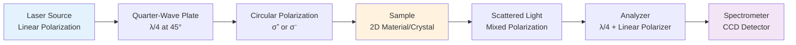
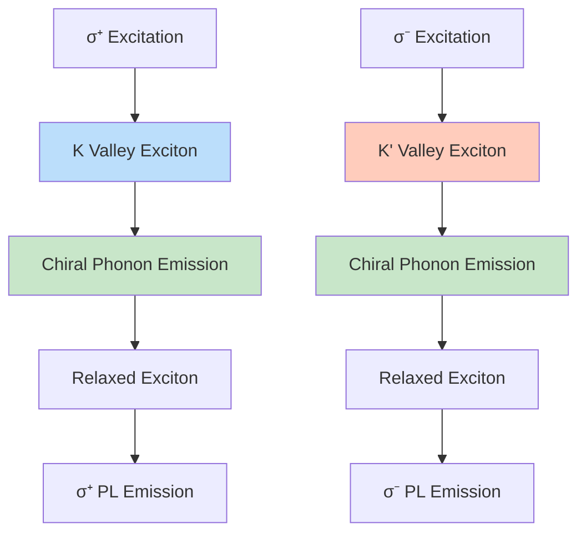

## Video Lecture

<div class="video-container">
  <iframe
    width="560"
    height="315"
    src="https://www.youtube.com/embed/wW5X1EXoWgE"
    title="Chiral Phonons Ch.3: Experimental Detection"
    allow="accelerometer; autoplay; clipboard-write; encrypted-media; gyroscope; picture-in-picture"
    allowfullscreen>
  </iframe>
</div>

> This video covers the same content as the text below. Choose your preferred learning format.

---

🌐 EN | [🇯🇵 JP](../../../jp/MS/chiral-phonons/chapter-3.md) | Last sync: 2025-12-19

[Knowledge Base](../../index.html) > [Materials Science](../index.html) > [Chiral Phonons](index.md) > Chapter 3

---

# Chapter 3: Experimental Detection of Chiral Phonons

**From Circularly Polarized Raman to Ultrafast Spectroscopy**

⏱️ Reading time: 40-45 minutes | 💻 Code examples: 3 | 📊 Difficulty: Advanced | 🔬 Practical exercises: 5

---

This chapter covers the experimental techniques for detecting and characterizing chiral phonons. You will learn circularly polarized Raman spectroscopy, circular dichroism methods, ultrafast spectroscopy, and key experimental results that confirmed the existence of chiral phonons in materials.

## Learning Objectives

Upon completing this chapter, you will acquire the following skills and knowledge:

- ✅ Understand the experimental setup for circularly polarized Raman spectroscopy
- ✅ Explain Raman selection rules for chiral phonons and circular polarization degree measurement
- ✅ Understand circular dichroism in phonon absorption and its connection to angular momentum
- ✅ Describe helicity-resolved photoluminescence and valley polarization detection
- ✅ Explain ultrafast spectroscopy techniques for time-resolved chiral phonon detection
- ✅ Analyze key experimental results in WSe₂ and α-quartz
- ✅ Simulate Raman polarization dependence using Python

## 3.1 Circularly Polarized Raman Spectroscopy

### 3.1.1 Fundamentals of Raman Scattering

**Raman scattering** is an inelastic light scattering process where incident photons interact with phonons (lattice vibrations) in a material. The scattered light's frequency shift reveals the phonon energy:

\\[
\omega_{\text{scattered}} = \omega_{\text{incident}} \pm \omega_{\text{phonon}}
\\]

For chiral phonons, the key innovation is using **circularly polarized light** to probe phonon angular momentum. The experimental configuration distinguishes between co-polarized and cross-polarized scattering.

> **💡 Polarization Configurations**
>
> **Co-polarized (\\(\sigma^+/\sigma^+\\) or \\(\sigma^-/\sigma^-\\))**
> - Incident and scattered light have the same circular polarization
> - Selects phonons with zero angular momentum projection (\\(m = 0\\))
> - Example: \\(A_1\\) modes in TMDs
>
> **Cross-polarized (\\(\sigma^+/\sigma^-\\) or \\(\sigma^-/\sigma^+\\))**
> - Incident and scattered light have opposite circular polarizations
> - Selects phonons with angular momentum \\(m = \pm 1\\)
> - Example: \\(E'\\) modes in monolayer TMDs split into chiral components

### 3.1.2 Experimental Setup with Quarter-Wave Plates

The experimental setup for circularly polarized Raman spectroscopy requires precise control of light polarization using optical elements:



**Key Components:**

1. **Quarter-Wave Plate (QWP):** Converts linear polarization to circular by introducing a 90° phase shift between orthogonal components
2. **Linear Polarizer:** Selects specific linear polarization direction
3. **Analyzer System:** Second QWP + polarizer to select circular polarization of scattered light
4. **Backscattering Geometry:** Maximizes signal and simplifies configuration

### 3.1.3 Raman Selection Rules for Chiral Phonons

The Raman scattering intensity is determined by the Raman tensor \\(\mathbf{R}\\) and the polarization vectors of incident (\\(\mathbf{e}_i\\)) and scattered (\\(\mathbf{e}_s\\)) light:

\\[
I \propto |\mathbf{e}_s \cdot \mathbf{R} \cdot \mathbf{e}_i|^2
\\]

For chiral phonons with angular momentum \\(m\\), the Raman tensor has specific symmetry properties. In monolayer TMDs (point group \\(D_{3h}\\)), the \\(E'\\) mode can be described in a circular basis with left-handed (\\(E'_L\\)) and right-handed (\\(E'_R\\)) components (a degenerate pair at Γ) that are addressed differently by circular polarizations.

| Phonon Mode | Angular Momentum | Active Configuration | Inactive Configuration |
|-------------|------------------|----------------------|------------------------|
| **\\(A_1'\\) (breathing)** | \\(m = 0\\) | \\(\sigma^+/\sigma^+\\), \\(\sigma^-/\sigma^-\\) | \\(\sigma^+/\sigma^-\\), \\(\sigma^-/\sigma^+\\) |
| **\\(E'_R\\) (right-handed)** | \\(m = +1\\) | \\(\sigma^+/\sigma^-\\) (K valley) | \\(\sigma^-/\sigma^+\\) (K' valley) |
| **\\(E'_L\\) (left-handed)** | \\(m = -1\\) | \\(\sigma^-/\sigma^+\\) (K' valley) | \\(\sigma^+/\sigma^-\\) (K valley) |

> **⚠️ Critical Considerations**
> - **Valley Selection:** In TMDs, chiral phonon selection is valley-dependent due to valley-phonon coupling
> - **Sample Quality:** Defects and strain can break selection rules and cause depolarization
> - **Detection Efficiency:** QWP alignment and optical aberrations affect measured polarization degree
> - **Temperature Effects:** Phonon linewidth and polarization can vary with temperature

### 3.1.4 Circular Polarization Degree Measurement

The **circular polarization degree** quantifies the chiral nature of phonon modes:

\\[
P_c = \frac{I_{\text{co}} - I_{\text{cross}}}{I_{\text{co}} + I_{\text{cross}}}
\\]

where \\(I_{\text{co}}\\) is co-polarized intensity and \\(I_{\text{cross}}\\) is cross-polarized intensity.

**Interpretation:**
- \\(P_c = +1\\): Purely co-polarized (non-chiral mode, e.g., \\(A_1'\\))
- \\(P_c = -1\\): Purely cross-polarized (chiral mode with \\(\Delta m = \pm 1\\))
- \\(|P_c| < 1\\): Partially polarized (mixed character or experimental imperfections)

## 3.2 Circular Dichroism in Phonon Absorption

### 3.2.1 Infrared Circular Dichroism (IR-CD)

**Circular dichroism** is the differential absorption of left- and right-handed circularly polarized light. For phonons, IR-CD arises when phonon modes carry angular momentum:

\\[
\text{CD} = A(\sigma^+) - A(\sigma^-)
\\]

where \\(A(\sigma^+)\\) and \\(A(\sigma^-)\\) are absorbances for right- and left-handed circular polarizations.

> **💡 Physical Origin of Phonon CD**
>
> Phonon circular dichroism requires both:
> 1. **Broken inversion symmetry:** Allows phonon angular momentum
> 2. **Phonon-light coupling:** Electric dipole or magnetic dipole transitions
>
> In chiral crystals (e.g., α-quartz), phonon CD signals can be surprisingly strong due to the helical crystal structure that enhances phonon-photon coupling.

### 3.2.2 Connection to Phonon Angular Momentum

The CD signal is directly related to the phonon angular momentum \\(\mathbf{L}_{\text{ph}}\\) through the rotational strength:

\\[
R = \text{Im}[\mathbf{\mu} \cdot \mathbf{m}^*]
\\]

where \\(\mathbf{\mu}\\) is the electric dipole transition moment and \\(\mathbf{m}\\) is the magnetic dipole transition moment. For chiral phonons, the non-zero rotational strength produces CD.

## 3.3 Helicity-Resolved Photoluminescence

### 3.3.1 Valley Polarization Detection

In monolayer TMDs, optical transitions at K and K' valleys couple to circularly polarized light with opposite helicities. Phonon-assisted photoluminescence (PL) can probe valley-phonon coupling:



The valley polarization is defined as:

\\[
P_v = \frac{I_{\sigma^+} - I_{\sigma^-}}{I_{\sigma^+} + I_{\sigma^-}}
\\]

where \\(I_{\sigma^+}\\) and \\(I_{\sigma^-}\\) are PL intensities with circular polarizations.

### 3.3.2 Phonon-Assisted Processes

Chiral phonons play crucial roles in valley-dependent optical processes:

1. **Phonon Replicas:** Sidebands in PL spectra separated by phonon energy, showing valley selectivity
2. **Valley Depolarization:** Intervalley scattering mediated by phonons affects valley lifetime
3. **Indirect Transitions:** Phonon-assisted absorption/emission in momentum-indirect materials

## 3.4 Ultrafast Spectroscopy

### 3.4.1 Time-Resolved Detection of Chiral Phonons

**Ultrafast pump-probe spectroscopy** enables direct observation of chiral phonon dynamics with femtosecond time resolution. The technique uses:

- **Pump pulse:** Excites the material (often circularly polarized)
- **Probe pulse:** Detects transient changes in optical properties as a function of time delay
- **Time delay:** Controlled by optical delay line (typically 0-10 ps)

The differential transmission/reflection reveals coherent phonon oscillations:

\\[
\frac{\Delta T}{T}(t) = A \cos(\omega_{\text{ph}} t + \phi) e^{-t/\tau}
\\]

where \\(\omega_{\text{ph}}\\) is the phonon frequency, \\(\phi\\) is the initial phase, and \\(\tau\\) is the dephasing time.

### 3.4.2 Coherent Phonon Generation

Coherent phonons are generated through impulsive stimulated Raman scattering (ISRS) when the pump pulse duration is shorter than the phonon period:

> **💡 Coherent Chiral Phonon Generation Mechanisms**
>
> **1. Displacive Excitation (DECP)**
> - Sudden change in equilibrium lattice position
> - Creates symmetric modes (\\(A_1\\))
>
> **2. Impulsive Stimulated Raman Scattering (ISRS)**
> - Coherent Raman process with ultrashort pulses
> - Can generate chiral phonons with circularly polarized pump
>
> **3. Valley-Selective Excitation**
> - Circularly polarized pump creates valley polarization
> - Valley-phonon coupling drives chiral phonon oscillations

### 3.4.3 Pump-Probe Techniques for Chirality Detection

To detect phonon chirality, the pump and probe polarizations are varied:

| Configuration | Pump | Probe | Detected Mode |
|---------------|------|-------|---------------|
| **Co-circular** | \\(\sigma^+\\) | \\(\sigma^+\\) | Non-chiral + valley-specific |
| **Counter-circular** | \\(\sigma^+\\) | \\(\sigma^-\\) | Chiral phonons |
| **Cross-linear** | Linear | Linear ⊥ | All Raman-active modes |

The polarization-dependent signal reveals the phonon angular momentum and valley coupling.

## 3.5 Inelastic Neutron and X-ray Scattering

### 3.5.1 Polarized Neutron Scattering

While Raman and infrared spectroscopies probe zone-center (\\(\mathbf{q} \approx 0\\)) phonons, **inelastic neutron scattering (INS)** and **inelastic X-ray scattering (IXS)** can measure phonon dispersion throughout the Brillouin zone.

For chiral phonons, **polarized neutron scattering** is particularly interesting because neutrons carry spin-1/2, allowing spin-phonon coupling measurements. However, detecting phonon chirality with neutrons remains challenging.

### 3.5.2 Challenges and Opportunities

**Challenges:**
- Neutron flux limitations require large sample sizes
- Energy resolution (~0.1-1 meV) may be insufficient for narrow phonon lines
- Separating chiral phonon signatures from conventional phonon scattering is non-trivial

**Opportunities:**
- Complete phonon dispersion mapping across Brillouin zone
- Momentum-resolved phonon angular momentum
- Coupling between magnons and chiral phonons in magnetic materials
- Bulk crystal measurements (not limited to 2D materials)

## 3.6 Key Experimental Results

### 3.6.1 WSe₂ Experiments (2018–2019)

Landmark reports on chiral phonons in monolayer WSe₂ include the 2018 experimental observation (Zhu et al., Science) and subsequent works exploring valley–phonon coupling and angular momentum (e.g., Chen et al., 2019, Nat. Phys.). Representative observations include:

> **🔬 Representative Findings in Monolayer WSe₂**
> 1. **E' circular components:** The doubly degenerate \\(E'\\) mode near ~250 cm⁻¹ can be addressed in circular polarization basis (left/right components as a degenerate pair)
> 2. **Valley-dependent selection rules:** Opposite circular helicities couple to K and K' valleys, consistent with angular momentum conservation
> 3. **Polarization contrast:** High circular polarization contrast is observed for chiral-sensitive configurations (magnitude is setup- and sample-dependent)
> 4. **Temperature robustness:** Chiral-sensitive signals persist to elevated temperatures in high-quality samples
> 5. **Layer dependence:** Monolayers show the strongest signatures; interlayer coupling can reduce contrast

**Typical Experimental Configuration:**
- Laser wavelength near excitonic resonance (e.g., 532 nm)
- Sample: Mechanically exfoliated monolayer WSe₂ on SiO₂/Si (or encapsulated)
- Temperature range: cryogenic to room temperature
- Backscattering geometry with polarization control and analysis

### 3.6.2 α-Quartz Experiments (Zhu et al. 2018)

Zhu et al. demonstrated chiral phonons in 3D chiral crystal α-quartz using Raman and infrared circular dichroism:

> **🔬 Key Findings in α-Quartz**
> 1. **Phonon circular dichroism:** Strong CD signals in infrared absorption at ~400 cm⁻¹ and ~800 cm⁻¹
> 2. **Handedness detection:** CD sign reverses between left-handed and right-handed quartz crystals
> 3. **Raman activity:** Chiral Raman modes show polarization-dependent intensity
> 4. **Angular momentum:** Calculated phonon angular momentum consistent with experimental CD spectra

The quartz results demonstrated that chiral phonons are not limited to 2D materials but occur in any crystal structure lacking inversion symmetry with appropriate symmetry breaking.

## 3.7 Python Code: Simulating Raman Polarization Dependence

We will simulate the Raman scattering intensity as a function of polarization configuration for chiral and non-chiral phonon modes.

### Example 1: Raman Intensity for Chiral Phonon Modes

```python
# Requirements:
# - Python 3.9+
# - matplotlib>=3.7.0
# - numpy>=1.24.0, <2.0.0

"""
Simulation of Raman scattering intensity for chiral phonon modes
with different polarization configurations
"""
import numpy as np
import matplotlib.pyplot as plt

def raman_tensor_A1(theta):
    """
    Raman tensor for A1' mode (non-chiral, m=0)

    Args:
        theta: Analyzer angle [degrees]

    Returns:
        R: 2x2 Raman tensor
    """
    # A1' mode: diagonal tensor (isotropic in-plane)
    R = np.array([[1, 0],
                  [0, 1]])
    return R

def raman_tensor_E_chiral(theta, chirality=+1):
    """
    Raman tensor for E' chiral phonon mode

    Args:
        theta: Analyzer angle [degrees]
        chirality: +1 for right-handed, -1 for left-handed

    Returns:
        R: 2x2 Raman tensor
    """
    # E' mode: off-diagonal tensor (chiral character)
    R = np.array([[0, chirality],
                  [-chirality, 0]])
    return R

def circular_polarization_vector(helicity=+1):
    """
    Circular polarization vector

    Args:
        helicity: +1 for σ⁺, -1 for σ⁻

    Returns:
        e: 2D complex polarization vector
    """
    e = np.array([1, helicity * 1j]) / np.sqrt(2)
    return e

def raman_intensity(R, e_in, e_out):
    """
    Calculate Raman scattering intensity

    Args:
        R: 2x2 Raman tensor
        e_in: Incident polarization vector
        e_out: Scattered polarization vector

    Returns:
        I: Raman intensity
    """
    # I ∝ |e_out · R · e_in|²
    amplitude = np.dot(e_out.conj(), np.dot(R, e_in))
    I = np.abs(amplitude)**2
    return I

def simulate_raman_polarization():
    """
    Simulate Raman intensity for different phonon modes
    and polarization configurations
    """
    # Polarization configurations
    sigma_plus = circular_polarization_vector(+1)
    sigma_minus = circular_polarization_vector(-1)

    # Phonon modes
    modes = {
        'A1 (non-chiral)': raman_tensor_A1(0),
        'E (right-chiral)': raman_tensor_E_chiral(0, chirality=+1),
        'E (left-chiral)': raman_tensor_E_chiral(0, chirality=-1)
    }

    # Configurations
    configs = {
        'σ⁺/σ⁺ (co)': (sigma_plus, sigma_plus),
        'σ⁺/σ⁻ (cross)': (sigma_plus, sigma_minus),
        'σ⁻/σ⁺ (cross)': (sigma_minus, sigma_plus),
        'σ⁻/σ⁻ (co)': (sigma_minus, sigma_minus)
    }

    # Calculate intensities
    results = {}
    for mode_name, R in modes.items():
        results[mode_name] = {}
        for config_name, (e_in, e_out) in configs.items():
            I = raman_intensity(R, e_in, e_out)
            results[mode_name][config_name] = I

    # Plot results
    fig, axes = plt.subplots(1, 3, figsize=(15, 4))

    for idx, (mode_name, intensities) in enumerate(results.items()):
        ax = axes[idx]
        config_names = list(intensities.keys())
        values = list(intensities.values())

        bars = ax.bar(range(len(config_names)), values,
                      color=['#2196F3', '#FF9800', '#FF9800', '#2196F3'])
        ax.set_xticks(range(len(config_names)))
        ax.set_xticklabels(config_names, rotation=45, ha='right')
        ax.set_ylabel('Raman Intensity (a.u.)')
        ax.set_title(mode_name)
        ax.set_ylim([0, 1.2])
        ax.grid(axis='y', alpha=0.3)

    plt.tight_layout()
    plt.savefig('raman_chiral_phonon_polarization.png', dpi=300, bbox_inches='tight')
    plt.show()

    # Print polarization degrees
    print("\nCircular Polarization Degree P_c = (I_co - I_cross)/(I_co + I_cross)")
    print("="*70)
    for mode_name, intensities in results.items():
        I_co = (intensities['σ⁺/σ⁺ (co)'] + intensities['σ⁻/σ⁻ (co)']) / 2
        I_cross = (intensities['σ⁺/σ⁻ (cross)'] + intensities['σ⁻/σ⁺ (cross)']) / 2

        if I_co + I_cross > 0:
            P_c = (I_co - I_cross) / (I_co + I_cross)
        else:
            P_c = 0

        print(f"{mode_name:20s}: P_c = {P_c:+.3f}")

if __name__ == "__main__":
    simulate_raman_polarization()
```

**Expected Output:**
- **A1' mode:** Strong co-polarized signal (\\(P_c = +1\\)), no cross-polarized intensity
- **E' right-chiral:** Strong \\(\sigma^+/\sigma^-\\) cross-polarized signal, zero \\(\sigma^-/\sigma^+\\)
- **E' left-chiral:** Strong \\(\sigma^-/\sigma^+\\) cross-polarized signal, zero \\(\sigma^+/\sigma^-\\)

### Example 2: Simulating Phonon Circular Dichroism

```python
"""
Simulation of infrared circular dichroism for chiral phonons
"""
import numpy as np
import matplotlib.pyplot as plt

def lorentzian(omega, omega0, gamma):
    """
    Lorentzian lineshape for phonon absorption

    Args:
        omega: Frequency array [cm⁻¹]
        omega0: Phonon frequency [cm⁻¹]
        gamma: Damping constant [cm⁻¹]

    Returns:
        L: Lorentzian profile
    """
    return gamma / ((omega - omega0)**2 + gamma**2)

def absorption_CD(omega, omega0, gamma, chirality, strength=1.0):
    """
    Calculate circular dichroism signal for chiral phonon

    Args:
        omega: Frequency array [cm⁻¹]
        omega0: Phonon frequency [cm⁻¹]
        gamma: Damping constant [cm⁻¹]
        chirality: +1 for right-handed, -1 for left-handed
        strength: CD signal strength

    Returns:
        CD: Circular dichroism spectrum
    """
    # CD ∝ derivative of Lorentzian (dispersive lineshape)
    # This is simplified model; real CD has both absorptive and dispersive parts
    CD = chirality * strength * (omega - omega0) / ((omega - omega0)**2 + gamma**2) * gamma
    return CD

def simulate_phonon_CD():
    """
    Simulate infrared circular dichroism for chiral crystal
    """
    # Frequency range
    omega = np.linspace(200, 1000, 1000)

    # Chiral phonon modes (example: α-quartz)
    modes = [
        {'omega0': 400, 'gamma': 10, 'chirality': +1, 'strength': 0.5, 'name': 'E mode 1 (R)'},
        {'omega0': 450, 'gamma': 8, 'chirality': -1, 'strength': 0.3, 'name': 'E mode 2 (L)'},
        {'omega0': 800, 'gamma': 15, 'chirality': +1, 'strength': 0.7, 'name': 'E mode 3 (R)'}
    ]

    # Calculate total CD spectrum
    CD_total = np.zeros_like(omega)

    fig, axes = plt.subplots(2, 1, figsize=(10, 8))

    # Plot individual absorption and CD
    for mode in modes:
        absorption = lorentzian(omega, mode['omega0'], mode['gamma'])
        CD = absorption_CD(omega, mode['omega0'], mode['gamma'],
                          mode['chirality'], mode['strength'])
        CD_total += CD

        axes[0].plot(omega, absorption, label=mode['name'], alpha=0.7)
        axes[1].plot(omega, CD, label=mode['name'], alpha=0.7)

    # Absorption spectrum
    axes[0].set_xlabel('Frequency (cm⁻¹)')
    axes[0].set_ylabel('Absorption (a.u.)')
    axes[0].set_title('Infrared Absorption Spectrum')
    axes[0].legend()
    axes[0].grid(alpha=0.3)

    # CD spectrum
    axes[1].plot(omega, CD_total, 'k-', linewidth=2, label='Total CD')
    axes[1].axhline(y=0, color='gray', linestyle='--', alpha=0.5)
    axes[1].set_xlabel('Frequency (cm⁻¹)')
    axes[1].set_ylabel('CD Signal (a.u.)')
    axes[1].set_title('Circular Dichroism Spectrum')
    axes[1].legend()
    axes[1].grid(alpha=0.3)

    plt.tight_layout()
    plt.savefig('phonon_circular_dichroism.png', dpi=300, bbox_inches='tight')
    plt.show()

    print("\nPhonon Circular Dichroism Analysis")
    print("="*70)
    for mode in modes:
        hand = "Right-handed" if mode['chirality'] > 0 else "Left-handed"
        print(f"{mode['name']:20s}: {mode['omega0']} cm⁻¹, {hand}")

if __name__ == "__main__":
    simulate_phonon_CD()
```

### Example 3: Coherent Phonon Dynamics from Pump-Probe

```python
"""
Simulation of coherent chiral phonon dynamics in pump-probe spectroscopy
"""
import numpy as np
import matplotlib.pyplot as plt

def coherent_phonon_signal(t, omega, amplitude, phase, dephasing_time):
    """
    Coherent phonon oscillation signal

    Args:
        t: Time array [ps]
        omega: Phonon angular frequency [THz]
        amplitude: Oscillation amplitude
        phase: Initial phase [radians]
        dephasing_time: Dephasing time [ps]

    Returns:
        signal: Time-dependent differential transmission
    """
    signal = amplitude * np.cos(2 * np.pi * omega * t + phase) * np.exp(-t / dephasing_time)
    return signal

def simulate_pump_probe():
    """
    Simulate pump-probe detection of chiral phonons
    """
    # Time array
    t = np.linspace(0, 10, 1000)  # 0-10 ps

    # Phonon parameters (example: E' mode in WSe₂ at ~7.5 THz)
    modes = [
        {'omega': 7.5, 'amplitude': 1.0, 'phase': 0, 'tau': 3.0,
         'name': 'E\' chiral', 'color': '#2196F3'},
        {'omega': 8.2, 'amplitude': 0.5, 'phase': np.pi/4, 'tau': 2.0,
         'name': 'A₁\' breathing', 'color': '#FF9800'}
    ]

    fig, axes = plt.subplots(3, 1, figsize=(10, 10))

    # Individual phonon modes
    signals = []
    for mode in modes:
        signal = coherent_phonon_signal(t, mode['omega'], mode['amplitude'],
                                       mode['phase'], mode['tau'])
        signals.append(signal)
        axes[0].plot(t, signal, label=mode['name'], color=mode['color'], alpha=0.7)

    axes[0].set_xlabel('Time Delay (ps)')
    axes[0].set_ylabel('ΔT/T (a.u.)')
    axes[0].set_title('Individual Coherent Phonon Modes')
    axes[0].legend()
    axes[0].grid(alpha=0.3)

    # Total signal
    total_signal = np.sum(signals, axis=0)
    axes[1].plot(t, total_signal, 'k-', linewidth=1.5)
    axes[1].axhline(y=0, color='gray', linestyle='--', alpha=0.5)
    axes[1].set_xlabel('Time Delay (ps)')
    axes[1].set_ylabel('ΔT/T (a.u.)')
    axes[1].set_title('Total Pump-Probe Signal')
    axes[1].grid(alpha=0.3)

    # Fourier transform to frequency domain
    dt = t[1] - t[0]
    frequencies = np.fft.fftfreq(len(t), dt)
    fft_signal = np.fft.fft(total_signal * np.exp(-t/5.0))  # Apply window

    # Plot positive frequencies only
    positive_freq_mask = frequencies > 0
    freq_thz = frequencies[positive_freq_mask]
    fft_amplitude = np.abs(fft_signal[positive_freq_mask])

    axes[2].plot(freq_thz, fft_amplitude, 'k-', linewidth=1.5)
    axes[2].set_xlabel('Frequency (THz)')
    axes[2].set_ylabel('FFT Amplitude (a.u.)')
    axes[2].set_title('Fourier Transform: Phonon Frequency Spectrum')
    axes[2].set_xlim([0, 15])
    axes[2].grid(alpha=0.3)

    # Mark phonon frequencies
    for mode in modes:
        axes[2].axvline(x=mode['omega'], color=mode['color'],
                       linestyle='--', alpha=0.5, label=mode['name'])
    axes[2].legend()

    plt.tight_layout()
    plt.savefig('coherent_chiral_phonon_dynamics.png', dpi=300, bbox_inches='tight')
    plt.show()

    print("\nCoherent Phonon Analysis")
    print("="*70)
    for mode in modes:
        print(f"{mode['name']:15s}: ω = {mode['omega']:.1f} THz, τ = {mode['tau']:.1f} ps")

if __name__ == "__main__":
    simulate_pump_probe()
```

## 3.8 Exercises

### Exercise 1: Raman Selection Rules

Consider a monolayer TMD with \\(D_{3h}\\) point group symmetry.

**(a)** Using group theory, derive the selection rules for Raman scattering with circularly polarized light. Show which phonon modes (\\(A_1'\\), \\(E'\\)) are active in co-polarized (\\(\sigma^+/\sigma^+\\)) and cross-polarized (\\(\sigma^+/\sigma^-\\)) configurations.

**(b)** Explain why the \\(E'\\) mode exhibits valley-dependent selection rules.

**(c)** In a bilayer TMD with AB stacking, how do the selection rules change? What happens to the chiral phonon signatures?

---

### Exercise 2: Circular Dichroism Calculation

For a chiral phonon mode at frequency \\(\omega_0 = 500\\) cm⁻¹ with damping \\(\gamma = 10\\) cm⁻¹:

**(a)** Calculate and plot the absorption spectra for \\(\sigma^+\\) and \\(\sigma^-\\) polarizations assuming the phonon has angular momentum \\(m = +1\\).

**(b)** Compute the CD spectrum \\(\text{CD}(\omega) = A_{\sigma^+}(\omega) - A_{\sigma^-}(\omega)\\) and determine the peak CD signal.

**(c)** How does the CD signal scale with phonon angular momentum? What happens if \\(m = 0\\)?

---

### Exercise 3: Experimental Design

You want to measure chiral phonons in a new 2D material with unknown phonon frequencies.

**(a)** Design a complete experimental setup for circularly polarized Raman spectroscopy. Specify all optical components, their orientations, and the detection scheme.

**(b)** What control experiments would you perform to verify that the observed signals are genuine chiral phonon signatures and not experimental artifacts?

**(c)** How would you distinguish between chiral phonons arising from broken inversion symmetry versus those from valley-phonon coupling?

---

### Exercise 4: Valley Polarization Dynamics

In a pump-probe experiment on monolayer WSe₂:

**(a)** A \\(\sigma^+\\) pump pulse excites K valley excitons. Describe the phonon-assisted relaxation processes that can lead to valley depolarization.

**(b)** If the chiral phonon frequency is 7.5 THz and the valley splitting is 150 meV, calculate whether phonon-assisted intervalley scattering is energetically favorable at room temperature (300 K).

**(c)** Sketch the expected time-resolved valley polarization \\(P_v(t)\\) for two scenarios: (i) strong valley-phonon coupling, (ii) weak valley-phonon coupling. Explain the differences.

---

### Exercise 5: Temperature Dependence

Chiral phonon signatures can vary with temperature.

**(a)** Explain the physical mechanisms that cause phonon frequency and linewidth to change with temperature (consider anharmonicity and phonon-phonon scattering).

**(b)** Using the Bose-Einstein distribution, estimate the phonon occupation number at T = 10 K, 77 K, and 300 K for a chiral phonon at 250 cm⁻¹ (~7.5 THz). How does this affect coherent phonon signals?

**(c)** Based on the WSe₂ experimental results, why do chiral phonon selection rules persist at room temperature despite thermal fluctuations?

---

## Summary

In this chapter, we explored the diverse experimental techniques for detecting and characterizing chiral phonons:

- **Circularly polarized Raman spectroscopy** with careful control of polarization states reveals phonon chirality through selection rules
- **Circular dichroism** in infrared absorption directly probes phonon angular momentum
- **Helicity-resolved photoluminescence** detects valley-phonon coupling in 2D materials
- **Ultrafast pump-probe spectroscopy** captures coherent chiral phonon dynamics with femtosecond resolution
- **Landmark experiments** in WSe₂ and α-quartz confirmed theoretical predictions and established experimental protocols

These experimental advances have transformed chiral phonons from a theoretical curiosity to a measurable and controllable degree of freedom in condensed matter systems.

---

## Navigation

[← Chapter 2: Chiral Phonons in Materials](chapter-2.md) | [Series Home](index.md) | [Chapter 4: Applications and Computation →](chapter-4.md)

---

## Disclaimer

This educational content was generated with AI assistance for the Hashimoto Lab knowledge base. While efforts have been made to ensure accuracy, readers should verify critical information with primary sources and peer-reviewed literature.

**Key References:**
- Zhu et al., "Observation of chiral phonons," *Science* **359**, 579 (2018)
- Chen et al., "Entanglement of angular momentum and valley in chiral phonons," *Nature Physics* **15**, 221 (2019)
- Zhang & Niu, "Angular Momentum of Phonons and the Einstein–de Haas Effect," *Phys. Rev. Lett.* **112**, 085503 (2014)

---

© 2025 Hashimoto Lab, Tohoku University. All rights reserved.
