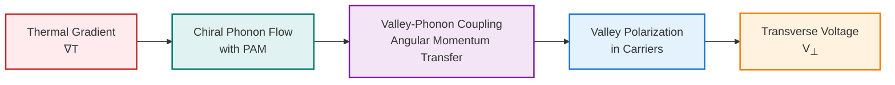
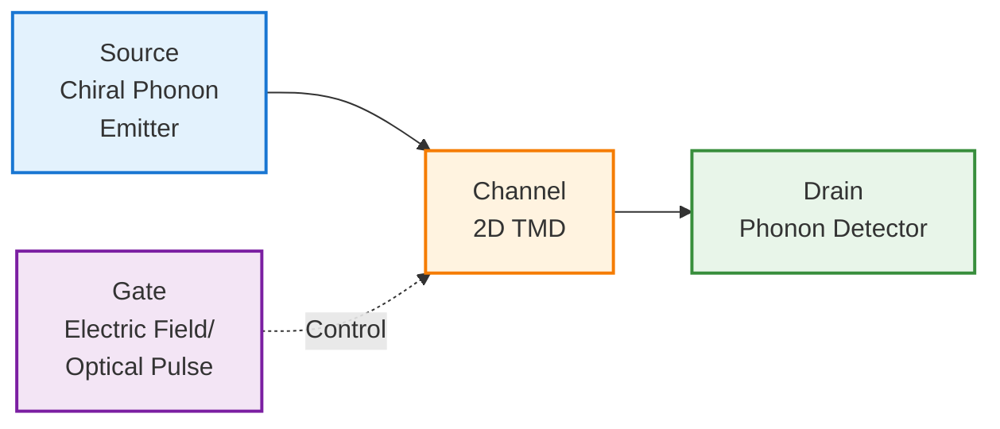

## Video Lecture

<div class="video-container">
  <iframe
    width="560"
    height="315"
    src="https://www.youtube.com/embed/bWqfo0IBMbs"
    title="Chiral Phonons Ch.4: Applications and Computational Methods"
    allow="accelerometer; autoplay; clipboard-write; encrypted-media; gyroscope; picture-in-picture"
    allowfullscreen>
  </iframe>
</div>

> This video covers the same content as the text below. Choose your preferred learning format.

---

🌐 EN | [🇯🇵 JP](../../../jp/MS/chiral-phonons/chapter-4.md) | Last sync: 2025-12-19

[Materials Science Dojo](../index.html) > [Chiral Phonons](index.md) > Chapter 4

# Chapter 4: Applications and Computational Methods

**Chiral Phonons Series - From DFT Calculations to Device Applications**

📖 Reading time: 45-60min | 📊 Difficulty: Advanced | 💻 Code examples: 8 examples

---

This chapter bridges theory and application by covering computational methods for calculating phonon chirality and emerging applications in valleytronics and phonon-based devices. You will learn how to extract phonon angular momentum from DFT calculations using Phonopy and Quantum ESPRESSO, understand phonon angular momentum transport phenomena, and explore device concepts that leverage chiral phonons for information processing.

## Learning Objectives

By reading this chapter, you will be able to:

- ✅ Calculate phonon eigenvectors and extract circular polarization from DFT results
- ✅ Compute phonon angular momentum using the formula \\(\mathbf{L} = \text{Im}[\mathbf{e}^* \times \mathbf{e}]\\)
- ✅ Set up and run phonon calculations with Phonopy and Quantum ESPRESSO
- ✅ Understand phonon angular momentum transport and the phononic Einstein-de Haas effect
- ✅ Apply chiral phonons to valleytronics applications including valley manipulation
- ✅ Explore emerging device concepts: phonon transistors, polarizers, and filters
- ✅ Understand chiral phonon-polaritons and light-matter coupling

---

## 4.1 Computational Methods for Phonon Chirality

### 4.1.1 Overview of DFT-Based Phonon Calculations

The calculation of chiral phonons requires determining phonon eigenvectors from first-principles density functional theory (DFT). The workflow consists of:

```mermaid
flowchart TD
    A[Structure Optimization<br/>DFT relaxation] --> B[Force Constant Calculation<br/>Phonopy/DFPT]
    B --> C[Diagonalize Dynamical Matrix<br/>Obtain eigenvalues & eigenvectors]
    C --> D[Extract Phonon Eigenvectors<br/>Complex vectors e<sub>κα</sub>]
    D --> E[Calculate Circular Polarization<br/>C = Im[e* × e]]
    E --> F[Compute Phonon Angular Momentum<br/>L = ℏC]

    style A fill:#e3f2fd,stroke:#1976d2,stroke-width:2px
    style B fill:#f3e5f5,stroke:#7b1fa2,stroke-width:2px
    style C fill:#fff3e0,stroke:#f57c00,stroke-width:2px
    style D fill:#e8f5e9,stroke:#388e3c,stroke-width:2px
    style E fill:#fce4ec,stroke:#c2185b,stroke-width:2px
    style F fill:#e0f2f1,stroke:#00796b,stroke-width:2px
```

#### Dynamical Matrix Formalism

The phonon eigenvectors are obtained from the dynamical matrix:

\\[D_{\kappa\alpha,\kappa'\beta}(\mathbf{q}) = \frac{1}{\sqrt{M_\kappa M_{\kappa'}}} \sum_{\mathbf{R}} \Phi_{\kappa\alpha,\kappa'\beta}(\mathbf{R}) e^{i\mathbf{q}\cdot\mathbf{R}}\\]

where:

- \\(\kappa, \kappa'\\): Atom indices in the unit cell
- \\(\alpha, \beta\\): Cartesian components (\\(x, y, z\\))
- \\(M_\kappa\\): Mass of atom \\(\kappa\\)
- \\(\Phi_{\kappa\alpha,\kappa'\beta}(\mathbf{R})\\): Force constant matrix
- \\(\mathbf{q}\\): Phonon wavevector

Diagonalization yields phonon frequencies \\(\omega_j\\) and eigenvectors \\(\mathbf{e}_j\\):

\\[D(\mathbf{q}) \mathbf{e}_j(\mathbf{q}) = \omega_j^2(\mathbf{q}) \mathbf{e}_j(\mathbf{q})\\]

### 4.1.2 Extracting Circular Polarization from Eigenvectors

The phonon eigenvector \\(\mathbf{e}_j(\mathbf{q})\\) is a complex vector describing the atomic displacement pattern. For a phonon mode with atoms displaced in a circular pattern, the eigenvector exhibits a phase difference between orthogonal components.

#### Circular Polarization Formula

The **circular polarization** (or pseudoangular momentum) vector is:

\\[\mathbf{C}_j(\mathbf{q}) = \text{Im}\left[\mathbf{e}_j^*(\mathbf{q}) \times \mathbf{e}_j(\mathbf{q})\right]\\]

For an individual atom \\(\kappa\\):

\\[\mathbf{C}_{j,\kappa}(\mathbf{q}) = \text{Im}\left[e_{j,\kappa}^*(x) e_{j,\kappa}(y) - e_{j,\kappa}^*(y) e_{j,\kappa}(x)\right] \hat{z} + \text{cyclic permutations}\\]

In 2D materials (e.g., monolayer TMDs), focusing on in-plane motion:

\\[C_{j,\kappa}^z = \text{Im}\left[e_{j,\kappa,x}^* e_{j,\kappa,y} - e_{j,\kappa,y}^* e_{j,\kappa,x}\right]\\]

> **Physical Interpretation**: \\(C_{j,\kappa}^z > 0\\) indicates counterclockwise circular motion (left-handed chirality), while \\(C_{j,\kappa}^z < 0\\) indicates clockwise motion (right-handed chirality).

#### Phonon Angular Momentum (PAM)

The total phonon angular momentum per unit cell is:

\\[\mathbf{L}_j(\mathbf{q}) = \hbar \sum_\kappa M_\kappa \mathbf{C}_{j,\kappa}(\mathbf{q})\\]

Units: \\(\hbar\\) per phonon (quantized angular momentum)

### 4.1.3 Software Tools: Phonopy and Quantum ESPRESSO

#### Phonopy

[Phonopy](https://phonopy.github.io/phonopy/) is a Python-based phonon calculation tool that interfaces with various DFT codes (VASP, Quantum ESPRESSO, Abinit, etc.).

**Key capabilities**:

- Finite displacement method for force constants
- Phonon dispersion and DOS calculations
- Extraction of eigenvectors at arbitrary q-points
- Group theory analysis of phonon modes

**Installation**:

```bash
pip install phonopy
# For plotting
pip install matplotlib seekpath
```

#### Quantum ESPRESSO

[Quantum ESPRESSO](https://www.quantum-espresso.org/) is an open-source DFT suite with powerful phonon capabilities via DFPT (Density Functional Perturbation Theory).

**Key modules**:

- `pw.x`: Ground state DFT calculations
- `ph.x`: Phonon calculations using DFPT
- `dynmat.x`: Post-processing of dynamical matrices

### 4.1.4 Complete Python Code Example: PAM Calculation

Below is a complete Python script to calculate phonon angular momentum from Phonopy output:

```python
#!/usr/bin/env python3
"""
Phonon Angular Momentum (PAM) Calculator
Calculates circular polarization and PAM from Phonopy eigenvectors

Requirements: phonopy, numpy, matplotlib
"""

import numpy as np
from phonopy import Phonopy
from phonopy.interface.vasp import read_vasp
from phonopy.file_io import parse_FORCE_SETS, parse_BORN
import matplotlib.pyplot as plt

class PAMCalculator:
    """Calculate phonon angular momentum from phonon eigenvectors"""

    def __init__(self, phonopy_obj, hbar=1.0545718e-34):
        """
        Parameters
        ----------
        phonopy_obj : Phonopy
            Phonopy object with force constants set
        hbar : float
            Reduced Planck constant (J·s)
        """
        self.phonopy = phonopy_obj
        self.hbar = hbar
        self.unitcell = phonopy_obj.get_unitcell()
        self.masses = self.unitcell.masses
        self.num_atoms = len(self.masses)

    def calculate_circular_polarization(self, eigvec):
        """
        Calculate circular polarization vector C = Im[e* × e]

        Parameters
        ----------
        eigvec : ndarray, shape (num_atoms, 3)
            Complex phonon eigenvector for one mode

        Returns
        -------
        C_total : float
            Total z-component of circular polarization
        C_per_atom : ndarray, shape (num_atoms,)
            z-component per atom
        """
        C_per_atom = np.zeros(self.num_atoms)

        for atom_idx in range(self.num_atoms):
            ex = eigvec[atom_idx, 0]  # x component (complex)
            ey = eigvec[atom_idx, 1]  # y component (complex)

            # C_z = Im[e_x* e_y - e_y* e_x]
            #     = Im[e_x* e_y] - Im[e_y* e_x]
            #     = 2 * Im[e_x* e_y]
            C_z = 2 * np.imag(np.conj(ex) * ey)
            C_per_atom[atom_idx] = C_z

        C_total = np.sum(C_per_atom)
        return C_total, C_per_atom

    def calculate_PAM(self, eigvec):
        """
        Calculate phonon angular momentum L = ℏ Σ_κ M_κ C_κ

        Parameters
        ----------
        eigvec : ndarray, shape (num_atoms, 3)
            Complex phonon eigenvector

        Returns
        -------
        L_total : float
            Total PAM in units of ℏ
        L_per_atom : ndarray
            PAM contribution per atom
        """
        C_total, C_per_atom = self.calculate_circular_polarization(eigvec)

        # Mass-weighted circular polarization
        L_per_atom = self.masses * C_per_atom
        L_total = np.sum(L_per_atom)

        return L_total, L_per_atom

    def analyze_qpoint(self, qpoint, plot=True):
        """
        Analyze all phonon modes at a specific q-point

        Parameters
        ----------
        qpoint : array-like, shape (3,)
            q-point in fractional coordinates
        plot : bool
            Whether to plot results

        Returns
        -------
        results : dict
            Dictionary containing frequencies, PAM values, etc.
        """
        # Set q-point
        self.phonopy.set_qpoints_phonon([qpoint])

        # Get frequencies and eigenvectors
        freqs = self.phonopy.get_qpoints_phonon()[0]  # THz
        eigvecs_raw = self.phonopy.get_qpoints_phonon()[1][0]

        # Reshape eigenvectors: (num_modes, num_atoms, 3)
        num_modes = 3 * self.num_atoms
        eigvecs = eigvecs_raw.reshape(num_modes, self.num_atoms, 3)

        # Calculate PAM for each mode
        PAM_values = []
        C_values = []

        for mode_idx in range(num_modes):
            L_total, _ = self.calculate_PAM(eigvecs[mode_idx])
            C_total, _ = self.calculate_circular_polarization(eigvecs[mode_idx])

            PAM_values.append(L_total)
            C_values.append(C_total)

        results = {
            'qpoint': qpoint,
            'frequencies': freqs,  # THz
            'PAM': np.array(PAM_values),
            'circular_polarization': np.array(C_values)
        }

        if plot:
            self._plot_PAM_spectrum(results)

        return results

    def _plot_PAM_spectrum(self, results):
        """Plot frequency vs PAM"""
        fig, (ax1, ax2) = plt.subplots(2, 1, figsize=(10, 8))

        freqs = results['frequencies']
        PAM = results['PAM']
        C = results['circular_polarization']

        # Filter out acoustic modes (near-zero frequency)
        mask = freqs > 0.5  # THz

        # Plot PAM
        ax1.scatter(freqs[mask], PAM[mask], c=PAM[mask],
                   cmap='RdBu', s=100, alpha=0.7)
        ax1.axhline(0, color='k', linestyle='--', linewidth=0.5)
        ax1.set_xlabel('Frequency (THz)', fontsize=12)
        ax1.set_ylabel('PAM (ℏ per phonon)', fontsize=12)
        ax1.set_title(f'Phonon Angular Momentum at q = {results["qpoint"]}',
                     fontsize=14)
        ax1.grid(True, alpha=0.3)

        # Plot circular polarization
        ax2.scatter(freqs[mask], C[mask], c=C[mask],
                   cmap='RdBu', s=100, alpha=0.7)
        ax2.axhline(0, color='k', linestyle='--', linewidth=0.5)
        ax2.set_xlabel('Frequency (THz)', fontsize=12)
        ax2.set_ylabel('Circular Polarization', fontsize=12)
        ax2.grid(True, alpha=0.3)

        plt.tight_layout()
        plt.savefig('PAM_spectrum.png', dpi=300, bbox_inches='tight')
        plt.show()

        return fig

# Example usage
def main():
    """Example: Calculate PAM for monolayer WSe2"""

    # Read structure from VASP POSCAR
    unitcell = read_vasp("POSCAR")

    # Create Phonopy object
    phonon = Phonopy(unitcell,
                     supercell_matrix=[[4, 0, 0], [0, 4, 0], [0, 0, 1]],
                     primitive_matrix='auto')

    # Read force constants from FORCE_SETS
    force_sets = parse_FORCE_SETS()
    phonon.set_displacement_dataset(force_sets)
    phonon.produce_force_constants()

    # Optional: NAC parameters for polar materials
    try:
        nac_params = parse_BORN(phonon.get_primitive())
        phonon.set_nac_params(nac_params)
    except:
        print("No NAC parameters found, proceeding without NAC")

    # Create PAM calculator
    pam_calc = PAMCalculator(phonon)

    # Analyze K-point (valley point in TMD)
    # K = (1/3, 1/3, 0) in fractional coordinates
    K_point = np.array([1./3., 1./3., 0.0])
    results_K = pam_calc.analyze_qpoint(K_point, plot=True)

    # Print chiral phonon modes (|PAM| > 0.1)
    print("\n=== Chiral Phonon Modes at K-point ===")
    for i, (freq, pam) in enumerate(zip(results_K['frequencies'],
                                        results_K['PAM'])):
        if abs(pam) > 0.1 and freq > 0.5:
            chirality = "Left" if pam > 0 else "Right"
            print(f"Mode {i}: {freq:.2f} THz, PAM = {pam:+.3f} ℏ ({chirality})")

if __name__ == "__main__":
    main()
```

#### Key Steps in the Code

1. **Initialization**: Load structure and force constants from Phonopy
2. **Eigenvector Extraction**: Get complex eigenvectors at specified q-point
3. **Circular Polarization**: Calculate \\(C_z = 2\text{Im}[e_x^* e_y]\\) per atom
4. **PAM Calculation**: Mass-weighted sum \\(L = \hbar \sum_\kappa M_\kappa C_\kappa\\)
5. **Visualization**: Plot frequency vs PAM to identify chiral modes

### 4.1.5 Example: Quantum ESPRESSO Workflow

For polar materials requiring accurate treatment of long-range electrostatic interactions, Quantum ESPRESSO with DFPT is preferred:

```bash
# Step 1: SCF calculation
pw.x < scf.in > scf.out

# Step 2: Phonon calculation at K-point
ph.x < ph_K.in > ph_K.out

# Step 3: Post-process dynamical matrix
dynmat.x < dynmat.in > dynmat.out
```

**Example ph.x input (ph_K.in)**:

```bash
&inputph
  prefix = 'wse2'
  outdir = './tmp/'
  fildyn = 'wse2.dyn'

  ! K-point in TMD Brillouin zone
  ldisp = .false.
  qplot = .true.

  tr2_ph = 1.0d-14
  alpha_mix = 0.7
/
1              ! Number of q-points
0.333333 0.333333 0.0   ! K-point
```

The eigenvectors can then be extracted from the dynamical matrix file and post-processed with Python to calculate PAM.

---

## 4.2 Phonon Angular Momentum Transport

### 4.2.1 Einstein-de Haas Effect for Phonons

The **Einstein-de Haas effect** demonstrates that angular momentum can be transferred between different degrees of freedom. For phonons, this means:

> Excitation of chiral phonons carrying angular momentum \\(\mathbf{L}_{\text{phonon}}\\) induces mechanical rotation of the crystal lattice to conserve total angular momentum.

\\[\mathbf{L}_{\text{total}} = \mathbf{L}_{\text{phonon}} + \mathbf{L}_{\text{lattice}} = \text{constant}\\]

#### Experimental Status

Experimental demonstrations of a phononic Einstein–de Haas effect remain an active area of research. Building on theoretical proposals (e.g., Zhang & Niu 2014, PRL 112, 085503), ongoing efforts explore optical excitation of chiral phonons and possible transfer of phonon angular momentum to lattice rotations. Reported observations and inferred magnitudes vary by system and methodology; careful calibration and controls are essential.

### 4.2.2 Phonon Spin Current

Analogous to electronic spin currents, **phonon spin currents** represent flow of phonon angular momentum without net energy transport.

#### Definition

The phonon spin current density:

\\[\mathbf{j}_s = \sum_j \mathbf{L}_j \cdot \mathbf{v}_{g,j} \cdot n_j\\]

where:

- \\(\mathbf{L}_j\\): PAM of mode \\(j\\)
- \\(\mathbf{v}_{g,j}\\): Group velocity
- \\(n_j\\): Phonon occupation number

#### Generation Mechanisms

1. **Thermal Gradient**: Temperature difference drives phonon flow with net angular momentum
2. **Optical Excitation**: Circularly polarized light selectively excites one chirality
3. **Phonon Pumping**: Ultrafast laser pulses generate coherent chiral phonons

### 4.2.3 Thermal Hall Effect and Phonon Angular Momentum

The **thermal Hall effect** is the transverse heat flow perpendicular to a temperature gradient, observed in some insulators.

#### Connection to Chiral Phonons

In materials with broken time-reversal symmetry (e.g., under magnetic field), chiral phonons can contribute to the thermal Hall conductivity:

\\[\kappa_{xy} = \frac{1}{T} \sum_j \int \frac{d^3q}{(2\pi)^3} c_j(\mathbf{q}) v_{j,x}(\mathbf{q}) \Omega_{j,y}(\mathbf{q})\\]

where:

- \\(c_j\\): Phonon heat capacity
- \\(v_{j,x}\\): Group velocity in \\(x\\)-direction
- \\(\Omega_{j,y}\\): Berry curvature in \\(y\\)-direction (related to PAM)

**Key insight**: Phonon Berry curvature and angular momentum are closely related topological properties.

### 4.2.4 Phonon Nernst Effect

The **phonon Nernst effect** generates a transverse voltage from a thermal gradient in the presence of chiral phonons coupled to electronic degrees of freedom.

\\[E_y = S_{yx} \nabla_x T\\]

where \\(S_{yx}\\) is the Nernst coefficient.

**Mechanism in TMDs**:

1. Temperature gradient drives thermal phonon current
2. Chiral phonons carry net angular momentum
3. Valley-phonon coupling transfers angular momentum to valley carriers
4. Valley polarization induces transverse electric field via valley Hall effect



---

## 4.3 Applications in Valleytronics

### 4.3.1 Valley-Phonon Coupling for Valley Manipulation

In 2D TMDs, the valley degree of freedom (K and K' valleys) can be manipulated using chiral phonons due to angular momentum conservation.

#### Selection Rules

For valley-phonon coupling in monolayer WSe₂:

| Valley | Exciton Angular Momentum | Phonon Chirality Required | Optical Helicity |
|--------|--------------------------|---------------------------|------------------|
| K      | \\(+1\\)                 | Left-handed (PAM > 0)     | \\(\sigma^+\\)   |
| K'     | \\(-1\\)                 | Right-handed (PAM < 0)    | \\(\sigma^-\\)   |

#### Valley Initialization via Phonons

1. **Optical Pumping**: \\(\sigma^+\\) light excites K-valley excitons
2. **Phonon Emission**: Exciton relaxation emits chiral phonon (PAM = \\(+1\hbar\\))
3. **Momentum Conservation**: Total angular momentum conserved

\\[L_{\text{exciton}}^{\text{initial}} = L_{\text{exciton}}^{\text{final}} + L_{\text{phonon}}\\]

### 4.3.2 Chiral Phonon-Mediated Intervalley Scattering

Intervalley scattering (K → K' transitions) can occur via emission or absorption of chiral phonons.

#### Scattering Rate

The intervalley scattering rate mediated by chiral phonons:

\\[\Gamma_{K\rightarrow K'} = \frac{2\pi}{\hbar} |g_{ep}|^2 [n(\omega) + 1] \delta(E_K - E_{K'} - \hbar\omega)\\]

where:

- \\(g_{ep}\\): Electron-phonon coupling strength
- \\(n(\omega)\\): Phonon occupation number (Bose-Einstein)
- \\(\omega\\): Chiral phonon frequency

**Temperature Dependence**: At low temperatures, phonon occupation is suppressed, leading to longer valley lifetimes.

### 4.3.3 Valley Information Storage

Chiral phonons enable **valley information storage** by encoding binary information in the valley index:

- **Bit "0"**: K valley (angular momentum \\(+1\\))
- **Bit "1"**: K' valley (angular momentum \\(-1\\))

#### Read/Write Operations

**Write**:

- \\(\sigma^+\\) laser pulse → Initialize K valley (bit "0")
- \\(\sigma^-\\) laser pulse → Initialize K' valley (bit "1")

**Read**:

- Detect valley-selective photoluminescence
- Measure valley Hall voltage

**Coherence Time**: Limited by intervalley scattering (typically ps to ns range at room temperature)

### 4.3.4 Code Example: Valley-Phonon Scattering Simulation

```python
import numpy as np
import matplotlib.pyplot as plt

class ValleyPhononScattering:
    """Simulate valley-phonon scattering dynamics"""

    def __init__(self, temperature, phonon_freq, coupling_strength):
        """
        Parameters
        ----------
        temperature : float
            Temperature in Kelvin
        phonon_freq : float
            Chiral phonon frequency in THz
        coupling_strength : float
            Electron-phonon coupling in meV
        """
        self.T = temperature
        self.omega = phonon_freq * 1e12  # Convert THz to Hz
        self.g_ep = coupling_strength * 1.60218e-22  # Convert meV to Joules

        # Constants
        self.hbar = 1.0545718e-34  # J·s
        self.kB = 1.380649e-23     # J/K

    def phonon_occupation(self):
        """Bose-Einstein distribution"""
        x = self.hbar * self.omega / (self.kB * self.T)
        if x > 50:  # Avoid overflow
            return 0.0
        return 1.0 / (np.exp(x) - 1.0)

    def intervalley_rate(self):
        """
        Calculate intervalley scattering rate (1/s)
        Assumes energy conservation is satisfied
        """
        n_ph = self.phonon_occupation()

        # Emission rate
        rate_emission = (2 * np.pi / self.hbar) * self.g_ep**2 * (n_ph + 1)

        # Absorption rate
        rate_absorption = (2 * np.pi / self.hbar) * self.g_ep**2 * n_ph

        return rate_emission + rate_absorption

    def valley_lifetime(self):
        """Valley lifetime in seconds"""
        return 1.0 / self.intervalley_rate()

    def valley_dynamics(self, t_max=10e-12, n_K_init=1.0):
        """
        Simulate valley population dynamics

        Parameters
        ----------
        t_max : float
            Maximum time in seconds
        n_K_init : float
            Initial K-valley population (normalized)

        Returns
        -------
        t : ndarray
            Time array
        n_K : ndarray
            K-valley population vs time
        """
        rate = self.intervalley_rate()
        tau = self.valley_lifetime()

        t = np.linspace(0, t_max, 1000)

        # Exponential decay to equilibrium (50% at long times)
        n_K = 0.5 + (n_K_init - 0.5) * np.exp(-t / tau)
        n_Kp = 1.0 - n_K  # K' valley population

        return t, n_K, n_Kp

# Example: Temperature dependence of valley lifetime
temperatures = np.linspace(10, 300, 50)  # K
lifetimes = []

phonon_freq = 5.0  # THz (typical for TMD chiral phonon)
coupling = 10.0    # meV

for T in temperatures:
    sim = ValleyPhononScattering(T, phonon_freq, coupling)
    tau = sim.valley_lifetime()
    lifetimes.append(tau * 1e12)  # Convert to ps

plt.figure(figsize=(10, 6))
plt.plot(temperatures, lifetimes, linewidth=2, color='#1976d2')
plt.xlabel('Temperature (K)', fontsize=14)
plt.ylabel('Valley Lifetime (ps)', fontsize=14)
plt.title('Valley Lifetime vs Temperature (Phonon-Mediated Scattering)', fontsize=16)
plt.grid(True, alpha=0.3)
plt.tight_layout()
plt.savefig('valley_lifetime_vs_T.png', dpi=300)
plt.show()

print(f"Valley lifetime at 300 K: {lifetimes[-1]:.2f} ps")
print(f"Valley lifetime at 10 K: {lifetimes[0]:.2f} ps")
```

---

## 4.4 Emerging Device Concepts

### 4.4.1 Phonon-Based Information Processing

Chiral phonons offer a new platform for information processing with potential advantages:

- **Low Power**: Phononic devices operate at lower power than electronic counterparts
- **High Frequency**: THz phonons enable ultrafast switching
- **Coherence**: Phonon coherence times can reach nanoseconds
- **Valley Integration**: Direct coupling to valleytronic logic

#### Phonon Logic Gates

Proposed schemes for phononic logic:

1. **AND Gate**: Two chiral phonon inputs with opposite chirality annihilate (output = 0) unless both have same chirality
2. **NOT Gate**: Chirality reversal via coupling to valley degrees of freedom
3. **XOR Gate**: Detect chirality mismatch through interference effects

### 4.4.2 Chiral Phonon Transistors

A **chiral phonon transistor** modulates phonon angular momentum current using an external control.

#### Device Structure



#### Operating Principle

1. **Source**: Generate chiral phonons (e.g., via \\(\sigma^+\\) laser on TMD)
2. **Channel**: 2D material where valley-phonon coupling is controlled
3. **Gate**: Electric field or optical pulse modulates valley polarization
4. **Drain**: Detect phonon angular momentum (e.g., via thermal Hall effect)

**Switching Mechanism**: Gate voltage changes valley population, altering scattering rate for chiral phonons

### 4.4.3 Phonon Polarizers and Filters

Analogous to optical polarizers, **phonon polarizers** selectively transmit phonons of specific chirality.

#### Design Strategies

1. **Symmetry-Based Filtering**:
   - Use materials with broken mirror symmetry
   - One chirality couples strongly to electronic states (absorbed)
   - Opposite chirality passes through

2. **Resonant Filtering**:
   - Design cavity with chiral resonance
   - Only left-handed phonons at specific frequency resonate

3. **Valley-Selective Filtering**:
   - Apply valley-polarized carrier population (via optical pumping)
   - Phonons matching valley chirality are absorbed by carrier scattering
   - Opposite chirality transmitted

#### Performance Metrics

- **Extinction Ratio**: \\(\eta = I_{\text{transmitted}}^{\text{left}} / I_{\text{transmitted}}^{\text{right}}\\)
- **Bandwidth**: Frequency range of filtering
- **Loss**: Total phonon intensity reduction

### 4.4.4 Phonon Circulators

A **phonon circulator** routes phonons unidirectionally based on chirality, enabling non-reciprocal phonon transport.

#### Three-Port Circulator

- **Port 1 → Port 2**: Left-handed phonons
- **Port 2 → Port 3**: Right-handed phonons
- **Port 3 → Port 1**: Neutral phonons

**Application**: Phononic signal routing in integrated phononic circuits

---

## 4.5 Chiral Phonon-Polaritons

### 4.5.1 Coupling Chiral Phonons to Photons

**Phonon-polaritons** are hybrid quasiparticles arising from strong coupling between photons and phonons. When the phonon carries angular momentum, the resulting polariton inherits chirality.

#### Coupling Hamiltonian

\\[H = \hbar\omega_{\text{ph}} a_{\text{ph}}^\dagger a_{\text{ph}} + \hbar\omega_{\gamma} a_{\gamma}^\dagger a_{\gamma} + \hbar g (a_{\text{ph}}^\dagger a_{\gamma} + a_{\gamma}^\dagger a_{\text{ph}})\\]

where:

- \\(a_{\text{ph}}\\): Phonon annihilation operator
- \\(a_{\gamma}\\): Photon annihilation operator
- \\(g\\): Coupling strength

#### Polariton Dispersion

In the strong coupling regime (\\(g > \gamma_{\text{ph}}, \gamma_{\gamma}\\)), the dispersion splits into upper and lower polariton branches:

\\[E_{\pm} = \frac{\hbar(\omega_{\text{ph}} + \omega_{\gamma})}{2} \pm \frac{\hbar}{2}\sqrt{(\omega_{\text{ph}} - \omega_{\gamma})^2 + 4g^2}\\]

**Rabi splitting**: \\(\Omega_R = 2g\\) (observable in spectroscopy)

### 4.5.2 Enhanced Light-Matter Interaction

Chiral phonon-polaritons exhibit enhanced circular dichroism (CD) compared to pure phonons.

#### Circular Dichroism Enhancement

\\[\text{CD} = \frac{A_{\sigma^+} - A_{\sigma^-}}{A_{\sigma^+} + A_{\sigma^-}}\\]

where \\(A_{\sigma^\pm}\\) is the absorption for \\(\sigma^\pm\\) polarized light.

**Mechanism**: Polariton combines phonon chirality with photon spin, leading to stronger angular momentum coupling.

### 4.5.3 Applications

1. **Tunable THz Sources**: Chiral polaritons emit circularly polarized THz radiation
2. **Quantum Optics**: Single-phonon-polariton sources for quantum information
3. **Nonlinear Optics**: Enhanced second-harmonic generation with chirality transfer

---

## 4.6 Future Directions and Challenges

### 4.6.1 Quantum Phononics with Chirality

**Quantum phononics** aims to utilize phonons as quantum information carriers. Chiral phonons add angular momentum as a quantum degree of freedom.

#### Potential Applications

- **Phonon Qubits**: Encode quantum information in phonon chirality (left/right)
- **Phonon Entanglement**: Create entangled chiral phonon pairs
- **Quantum Transduction**: Convert between photonic and phononic qubits

#### Challenges

- **Decoherence**: Phonon-phonon scattering limits coherence times
- **Single-Phonon Sources**: Difficult to generate and detect single phonons
- **Temperature**: Thermal occupation of phonons limits quantum fidelity

### 4.6.2 Topological Protection of Chiral Phonons

Combining chiral phonons with topological protection could yield robust phononic states.

#### Topological Chiral Phonons

- **Edge States**: Chiral phonons propagating unidirectionally along material edges
- **Weyl Phonons**: 3D topological phonons with chiral character
- **Floquet Engineering**: Use time-periodic driving to create topological chiral phonon bands

**Advantage**: Topological protection prevents backscattering, enabling low-loss phonon transport

### 4.6.3 Room-Temperature Applications

Most current studies of chiral phonons focus on low temperatures. For practical devices, room-temperature operation is essential.

#### Strategies for Room-Temperature Phononics

1. **Large Energy Splitting**: Use materials with large phonon energies (> kT at 300 K)
2. **Ultrafast Dynamics**: Operate on timescales faster than thermalization (sub-picosecond)
3. **High Valley Contrast**: Materials with large valley splitting suppress thermal mixing
4. **Encapsulation**: Protect 2D materials from environmental scattering

#### Promising Materials

- **h-BN**: Large bandgap, stable phonons at room temperature
- **Transition Metal Monochalcogenides**: High Curie temperatures for ferroelectric/valley properties
- **Heterostructures**: Engineer valley and phonon properties through stacking

### 4.6.4 Integration with Existing Technologies

For widespread adoption, chiral phononic devices must integrate with electronics and photonics.

#### Integration Pathways

1. **CMOS Compatibility**: Fabricate phononic elements on Si substrates
2. **Hybrid Circuits**: Combine electronic control with phononic logic
3. **Optical Interconnects**: Use chiral phonon-polaritons to bridge optics and phononics
4. **Thermal Management**: Leverage phononic crystals with chiral properties for heat control

---

## 4.7 Exercises

### Exercise 4.1: PAM Calculation from Eigenvector

Consider a phonon mode in a monolayer TMD where the metal atom (M, mass = 180 amu) has the following complex eigenvector components:

- \\(e_x = \frac{1}{\sqrt{2}}\\)
- \\(e_y = \frac{i}{\sqrt{2}}\\)
- \\(e_z = 0\\)

**(a)** Calculate the circular polarization \\(C_z\\) for this atom.
**(b)** Calculate the phonon angular momentum in units of \\(\hbar\\).
**(c)** Determine the chirality (left-handed or right-handed) based on the sign of PAM.

### Exercise 4.2: Temperature Dependence of Valley Lifetime

Using the valley-phonon scattering simulation code, investigate:

**(a)** Plot the valley lifetime vs temperature for a chiral phonon frequency of 6.0 THz and electron-phonon coupling of 15 meV.
**(b)** At what temperature does the valley lifetime drop below 1 ps?
**(c)** Explain physically why the lifetime decreases with temperature.

### Exercise 4.3: Phonon Polarizer Design

Design a phonon polarizer using a 2D TMD material.

**(a)** Sketch the device structure, indicating source, filter medium, and detector.
**(b)** Explain how valley-selective optical pumping can filter phonon chirality.
**(c)** Estimate the extinction ratio if the valley polarization is 80% and the phonon-valley coupling efficiency is 50%.

### Exercise 4.4: Phonon-Polariton Rabi Splitting

A chiral phonon at \\(\omega_{\text{ph}} = 5.0\\) THz is coupled to a photon mode at \\(\omega_{\gamma} = 5.2\\) THz with coupling strength \\(g = 0.3\\) THz.

**(a)** Calculate the upper and lower polariton energies \\(E_+\\) and \\(E_-\\) (in meV).
**(b)** What is the Rabi splitting \\(\Omega_R\\)?
**(c)** Sketch the polariton dispersion diagram showing the anti-crossing.

### Exercise 4.5: Quantum Phononic Qubit

Consider using a chiral phonon as a qubit, where \\(|0\rangle\\) represents left-handed chirality and \\(|1\rangle\\) represents right-handed chirality.

**(a)** If the phonon coherence time is \\(\tau_c = 500\\) ps and a single-qubit gate takes 10 ps, estimate the maximum number of gate operations before decoherence.
**(b)** What is the required temperature to suppress thermal occupation below 1% for a 5 THz phonon?
**(c)** Propose a scheme to initialize, manipulate, and read out this phonon qubit.

---

## Summary

This chapter covered computational methods and applications of chiral phonons:

- **Computational Methods**: DFT calculations with Phonopy/Quantum ESPRESSO, extraction of circular polarization \\(\mathbf{C} = \text{Im}[\mathbf{e}^* \times \mathbf{e}]\\), and PAM calculation
- **PAM Transport**: Einstein-de Haas effect, phonon spin currents, thermal Hall effect, and phonon Nernst effect
- **Valleytronics**: Valley-phonon coupling, intervalley scattering, valley initialization and storage
- **Devices**: Phonon transistors, polarizers, filters, and circulators for information processing
- **Phonon-Polaritons**: Strong light-matter coupling with chiral phonons, enhanced circular dichroism
- **Future Directions**: Quantum phononics, topological protection, room-temperature operation, and technology integration

Chiral phonons represent a frontier in condensed matter physics with rich opportunities for fundamental research and technological innovation.

---

[← Chapter 3](chapter-3.md) | [Series Top →](index.md)

---

## Disclaimer

This educational content was generated with AI assistance for the Hashimoto Lab knowledge base. While efforts have been made to ensure accuracy, readers should verify critical information with primary sources and peer-reviewed literature. For the latest research on chiral phonons, consult recent publications in journals such as Nature, Physical Review Letters, and Science.
