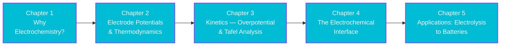

[AI Terakoya Top](<../../index.html>)›[Materials Science Dojo](<../index.html>)›[Electrochemistry Introduction](<index.html>)

🌐 EN | [🇯🇵 JP](<../../../jp/MS/electrochemistry-introduction/index.html>) | Last sync: 2026-08-20

[← Back to Materials Science Dojo](<../index.html>)

## 🎯 Series Overview

Three of the technologies the carbon-neutral transition depends on look, at first glance, like separate fields. Water electrolysis makes hydrogen from renewable electricity. CO₂ electrolysis turns a waste gas back into a feedstock. Batteries store energy so that electricity generated at one time can be used at another. Different industries, different journals, different conferences.

They are the same device. Two electrodes, an electrolyte between them, a wire outside, and electrons crossing an interface. Every one of them is governed by the same two questions — **what does thermodynamics permit, and how fast will kinetics let it happen?** — and by the same handful of quantities: an electrode potential, an overpotential, an exchange current density, an ohmic drop. Learn those once and all three technologies become readable, along with corrosion, electroplating, sensors, and fuel cells.

This series builds that vocabulary from nothing, in the order the ideas actually depend on each other. We start with **why electrochemistry is a distinct subject at all** — what changes when you physically separate the two halves of a redox reaction and force the electrons through a wire you own. We establish the **thermodynamics**: electrode potentials, \\(\Delta G = -nFE\\), the Nernst equation, and where the 1.23 V of water splitting comes from. We then insist on the distinction that beginners most often miss — that a reaction thermodynamics permits may proceed imperceptibly slowly — and develop the **kinetics** of overpotential and Tafel analysis, which is where catalysis lives. We look closely at the **interface** itself, the double layer and the three-electrode measurement that makes any of it measurable. And we finish by spending all of it on **applications**, reading electrolysers, CO₂ reactors, and batteries as one diagram with different labels.

> **A promise about numbers.** This series quotes only values that are universally established — the Faraday constant, the gas constant, the 1.23 V reversible voltage for water splitting, a small set of standard electrode potentials — or values computed in front of you by code you can run. Where the literature disagrees, or where a number depends on the exact material and measurement convention, the text says so and stays qualitative rather than inventing false precision. Model parameters used for illustration are labelled as illustrative every time they appear.

### Learning Path

### 📋 Learning Objectives

  * Describe an electrochemical reaction as two half-reactions at two electrodes, and distinguish galvanic from electrolytic operation without being confused by the anode/cathode naming reversal
  * Use electrode potentials and \\(\Delta G = -nFE\\) to predict whether a cell reaction is spontaneous and what voltage it will show, and apply the Nernst equation to concentration dependence
  * Explain why thermodynamic feasibility says nothing about rate, and use overpotential, exchange current density, and Tafel analysis to describe how fast a real electrode actually runs
  * Read a three-electrode measurement and a cyclic voltammogram, explain why a reference electrode is necessary, and separate interfacial behaviour from ohmic artefacts
  * Decompose the operating voltage of a real device into thermodynamic, kinetic, and ohmic terms, and use that decomposition to judge which improvement is worth pursuing

### 📖 Prerequisites

**Basic chemistry** is the only genuine requirement: what an ion is, what oxidation and reduction mean at the level of electrons moving, and comfort with a balanced chemical equation. Familiarity with the idea of Gibbs free energy helps but is not assumed — Chapter 2 introduces everything it needs.

**No prior electrochemistry is expected.** Electrode potentials, the standard hydrogen electrode, the Nernst equation, overpotential, Butler–Volmer kinetics, the electrical double layer, and cyclic voltammetry are all built up from the beginning, in that order, each one used by the chapter that follows it.

**Python** appears in every chapter as one short, self-contained hands-on block using **NumPy** alone. The code exists to make each argument quantitative — a Nernst curve, a Tafel slope, a voltage budget — not to teach programming. The chapters are readable without running it, though running it is considerably more convincing.

Chapter 1

Why Electrochemistry?

Meet the subject as electron bookkeeping: a redox reaction with its two halves physically separated, so the electrons must travel through an external circuit where you can count them. Learn the galvanic/electrolytic distinction, the roles of anode and cathode and why their labels flip between the two modes, and see the map of where this leads — hydrogen, carbon recycling, and energy storage.

Redox Half-Reactions Galvanic vs Electrolytic Anode and Cathode Faraday's Law Series Roadmap

💻 NumPy hands-on ⏱️ 20-25 minutes

[Read Chapter 1 →](<chapter-1.html>)

Chapter 2

Electrode Potentials & Thermodynamics

Put numbers on what is possible. Build the electrode-potential scale against the standard hydrogen electrode, connect potential to free energy through \\(\Delta G = -nFE\\), assemble the Daniell cell from two half-cells, and use the Nernst equation to see how concentration shifts a potential — arriving at where the 1.23 V of water splitting actually comes from.

Standard Electrode Potentials SHE Reference ΔG = −nFE The Nernst Equation 59 mV/decade

💻 NumPy hands-on ⏱️ 25-30 minutes

[Read Chapter 2 →](<chapter-2.html>)

Chapter 3

Kinetics — Overpotential & Tafel Analysis

Learn the distinction that separates textbook electrochemistry from the working kind: equilibrium is not a rate. Define overpotential and its activation, concentration, and ohmic components, meet exchange current density as the measure of intrinsic speed, and extract a Tafel slope from a Butler–Volmer curve to see exactly what a catalyst changes — and what it cannot.

Overpotential Exchange Current Density Butler–Volmer Tafel Slopes What Catalysts Change

💻 NumPy hands-on ⏱️ 25-30 minutes

[Read Chapter 3 →](<chapter-3.html>)

Chapter 4

The Electrochemical Interface

Go to where the reaction actually happens. Build an intuition for the electrical double layer and the enormous field across a few nanometres, understand why a single electrode potential cannot be measured alone and what the three-electrode cell does about it, learn to read the peaks of a cyclic voltammogram, and see how iR correction separates the interface from the electrolyte.

Electrical Double Layer Three-Electrode Cells Reference Electrodes Cyclic Voltammetry iR Correction

💻 NumPy hands-on ⏱️ 25-30 minutes

[Read Chapter 4 →](<chapter-4.html>)

Chapter 5

Applications: Electrolysis to Batteries

Spend the whole toolkit. Decompose a water electrolyser's voltage into 1.23 V plus overpotentials plus iR and see why the oxygen evolution reaction is the bottleneck; meet CO₂ electrolysis and its selectivity problem, where thermodynamics refuses to separate the products from hydrogen; and re-read battery charge and discharge as the same cell run in both directions, with the voltage gap as visible overpotential.

Water Electrolysis HER and OER CO₂ Reduction Selectivity Battery Charge/Discharge Voltage Budgets

💻 NumPy hands-on ⏱️ 30-35 minutes

[Read Chapter 5 →](<chapter-5.html>)

## 📚 Recommended Learning Paths

### Pattern 1: Beginner - Full Tour (5 days)

  * Day 1: Chapter 1 (What electrochemistry is, and why the wire matters)
  * Day 2: Chapter 2 (Potentials, free energy, and the Nernst equation)
  * Day 3: Chapter 3 (Overpotential and Tafel analysis)
  * Day 4: Chapter 4 (The interface and how it is measured)
  * Day 5: Chapter 5 (Electrolysis, CO₂, batteries) + Review

### Pattern 2: Intermediate - Fast Track (3 days)

  * Day 1: Chapters 1-2 (Setup and thermodynamics)
  * Day 2: Chapters 3-4 (Kinetics and measurement)
  * Day 3: Chapter 5 (Applications and all exercises)

### Pattern 3: Researcher - Straight to the Working Ideas (1 day)

  * Skim Chapter 1 for conventions, then read Chapter 2 for the \\(\Delta G = -nFE\\) bridge
  * Read Chapter 3 in full — this is the chapter that changes how you read a paper
  * Read Chapter 4's three-electrode and iR-correction sections before designing any measurement
  * Read Chapter 5 and run the voltage budget before quoting an efficiency number to anyone

## 🎯 Overall Learning Outcomes

Upon completing this series, you will achieve:

### Knowledge Level

  * ✅ State what an electrode potential is physically, and why it is always quoted against a reference
  * ✅ Explain why a thermodynamically favourable reaction can still be immeasurably slow, and name the three components of overpotential
  * ✅ Explain what a catalyst changes and what it provably cannot change
  * ✅ Describe why the oxygen evolution reaction limits water electrolysis, and why selectivity rather than rate is the defining problem in CO₂ reduction

### Practical Skills

  * ✅ Convert between free energy, cell voltage, and charge using \\(\Delta G = -nFE\\) and Faraday's law
  * ✅ Extract a Tafel slope and an exchange current density from current–potential data
  * ✅ Decide when an iR correction is required and what it does and does not justify
  * ✅ Build a voltage budget for a real cell and identify which term to attack first

### Application Ability

  * ✅ Read an electrocatalysis paper and tell a thermodynamic claim from a kinetic one
  * ✅ Judge an efficiency figure by asking which reference voltage it was computed against
  * ✅ Diagnose a battery's rate limitation from the shape of its charge–discharge curves
  * ✅ Estimate what a proposed catalyst or cell improvement is actually worth, in volts and in energy per unit product

## 🛠️ Technologies and Tools Used

### Main Libraries

  * **numpy**

### Development Environment

  * **Python** : 3.8 or higher
  * **Jupyter Notebook** : Interactive development and visualization
  * **IDE** : VSCode, PyCharm, or similar

### Recommended Tools

  * Google Colab (cloud-based, no setup required)
  * Anaconda Distribution (complete environment)
  * Git (version control for exercises)

## 🚀 Next Steps

### Deep Dive Learning

For more advanced study in this field:

  * Electrocatalysis: descriptors, scaling relations, and the limits they impose
  * Electrochemical impedance spectroscopy and the separation of loss mechanisms
  * Operando characterization of working electrodes

> **A follow-on series is planned.** CO₂ electrolysis and carbon recycling get one section in Chapter 5 and deserve a series of their own — gas-diffusion electrodes, the selectivity trade-off, product separation, and the techno-economics. This series was written to be its prerequisite, so the vocabulary will already be in place.

### Related Series

Expand your knowledge with related topics:

  * [Computational Chemistry of OER](<../../MI/oer-computational-chemistry/index.html>) (why the oxygen evolution overpotential resists improvement, computed from first principles)
  * [MI Applications to Catalyst Design](<../../MI/catalyst-mi-application/index.html>) (the data-driven layer above catalyst discovery, with its honest limits)
  * [Introduction to Supercritical Fluids](<../supercritical-fluid-introduction/index.html>) (another route to materials processing and reaction media)
  * [Introduction to Bayesian Optimization](<../../MI/bayesian-optimization-introduction/index.html>) (how to choose the next experiment when each measurement is expensive)

### Practical Projects

Apply your skills to hands-on projects:

  * Rebuild the Chapter 5 voltage budget with parameters taken from a paper you trust, and report which term dominates
  * Take a published current–potential curve, extract the Tafel slope yourself, and compare it with the value the authors state
  * Audit one efficiency claim from a press release: identify the reference voltage, the current density, and what was left out

### ⚠️ Disclaimer

  * This content is provided for educational and informational purposes only and does not constitute professional advice.
  * All content and code examples are provided "AS IS" without warranty of any kind, either express or implied, including but not limited to warranties of accuracy, reliability, completeness, or fitness for a particular purpose.
  * The use of external links, data, tools, and libraries is at your own discretion and risk. The authors and contributors are not responsible for their availability, functionality, or suitability.
  * In no event shall the content creator or contributors be liable for any direct, indirect, incidental, special, exemplary, or consequential damages arising from the use of this content, to the maximum extent permitted by law.
  * Accuracy of information is not guaranteed. Content may contain errors or become outdated.
  * Content is licensed under Creative Commons BY 4.0 unless otherwise specified. Please refer to the license for usage terms.
