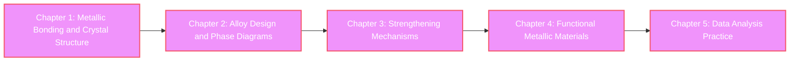

## Series

this series is 、metallic materials of fundamentals and becomemetallic bond and Crystal Structurefrom、Alloydesign、Strengthening Mechanisms、functionitymetallic materialsto、Python practiceal apro chi studyIntroductionko sis。CalculationMaterials Science of pointfrommetallic materials understand 、materialdesign of construction 。

### learning of
    
    

## Series

Chapter1

metallic bond and Crystal Structure

metallic bond of 、FCC/BCC/HCPCrystal Structure、 rate、coordination number、burabe 、 surface and Tableshow study、Python structureVisualization and ityCalculation perform。

⏱️ 30-35💻 7Code Example📊 Introduction

[learning start →](<chapter-1.html>)

Chapter2

Alloydesign and Phase Diagram

Solid Solution（ ・ ）、Intermetallic Compound、Eutectic・ reaction、Phase Transformation、two systemPhase Diagram of 、Scheil-Gulliver equation、CALPHAD of fundamentals learn。

⏱️ 30-35💻 7Code Example📊 Introduction〜

[learning start →](<chapter-2.html>)

Chapter3

Strengthening Mechanisms

Solid Solution Strengthening、Precipitation Strengthening（Orowan Mechanism）、Work Hardening（Dislocation Densityincrease）、Grain Refinement（Hall-PetchRelation）、transformationstrengthening、 strengthening of theory and practiceCalculation learn。

⏱️ 25-35💻 7Code Example📊

[learning start →](<chapter-3.html>)

Chapter4

functionitymetallic materials

（BCStheory、high ）、 Alloy（Martensitetransformation）、 Alloy、 material、 itymaterial、formation material of principle and application learn。

⏱️ 25-35💻 7Code Example📊 〜up

[learning start →](<chapter-4.html>)

Chapter5

Pythonpractice：metallic materialsDataanalyzewa kfro

pymatgen/ASEbyCrystal Structureoperation、pycalphadbyPhase DiagramCalculation、materialDatabe sAPI 、mechanicallearningbymaterial ityPrediction、 wa kfro practice 。

⏱️ 30-40💻 7Code Example📊 up

[learning start →](<chapter-5.html>)

## Learning Objectives

of Series dothing 、or less of skiru and knowledge learn ：

  * ✅ metallic bond of moderu understand 、 degree・ degree Calculationcan
  * ✅ FCC、BCC、HCP of Crystal Structure 、 rate・coordination number can
  * ✅ mira Index surface and Table 、surface Calculationcan
  * ✅ two systemPhase Diagram 、EquilibriumComposition・fraction Calculationcan
  * ✅ Hume-Rothery Rules usingSolid Solutionformation Predictioncan
  * ✅ Hall-Petchequation、Orowanequation Strength al Predictioncan
  * ✅ multiple of Strengthening Mechanisms of Phase use design can
  * ✅ BCStheory Temperature of Dependence understandcan
  * ✅ effect of enerugi explaincan
  * ✅ pymatgen and pycalphad Phase Diagram and structureData can

## recommendedlearningpata n

### pata n1: learning - theory and practice of barans（5-7 ）

  * 1day: Chapter1（metallic bond and Crystal Structure）
  * 2day: Chapter2（Alloydesign and Phase Diagram）
  * 3day: Chapter3（Strengthening Mechanisms）
  * 4day: Chapter4（functionitymetallic materials）
  * 5day: Chapter5（Pythonpractice）+

### pata n2: learning - metallic materialsmasta （3 ）

  * 1day: Chapter1-2（Crystal Structure and Alloydesign）
  * 2day: Chapter3-4（Strengthening Mechanisms and functionitymaterial）
  * 3day: Chapter5（practiceanalyze）+ eachExercises

### pata n3: practice - CalculationMaterials Scienceskirulearn（1 ）

  * Chapter1-4: Code Example of execute（theory is Degree）
  * Chapter5: 、actualmaterialData Calculation
  * necessary theory Confirmation

## knowledge

| necessaryLevel| explain  
---|---|---  
**Materials Sciencefundamentals**|  IntroductionLevel| izationstudy 、Atomstructure、 Table of understand  
**study**|  study1-2 Level| study、thermodynamics、 study、 study of fundamentals  
**numberstudy**|  study1 Level| 、line number、 equation of fundamentals  
**Python**| |  numpy、matplotlib、pandas、pymatgen、ASE of Basicoperation  
  
## usedoPythonraiburari

of Series usedomainraiburari：

  * **numpy** : valueCalculation and operation
  * **matplotlib** : 2DGraph・FigureTablecreation
  * **scipy** : studyCalculation（optimize、value 、statistics）
  * **pandas** : Datatreatment and analyze
  * **pymatgen** : Crystal Structureoperation、Phase Diagram、materialDatabe s
  * **ASE** : AtomSimulation （Crystal Structure、enerugi Calculation）
  * **pycalphad** : CALPHADPhase DiagramCalculation
  * **scikit-learn** : mechanicallearning（ 、classification、 ）
  * **seaborn** : statisticsalDataVisualization

## FAQ - exist

### Q1: Experimental Data evenlearning ？

is 、 is。this series is theoryCalculation and Simulation point 。 materialDatabe s（Materials Project、AFLOW） of Data use 、experiment understand obtain 。

### Q2: Alloydesign and Strengthening Mechanisms of Relation is ？

Alloydesign（Chapter2） Composition and structure design 、Strengthening Mechanisms（Chapter3） mechanicalalStrength caninfluence ization 。 dothing 、 Characteristics domaterialdesign 。

### Q3: Materials Informatics（MI） to of application is ？

Chapter5 studypymatgen and pycalphad is 、MI materialdescriptor 、Databe sconstruction、mechanicallearningmoderucreation of is。structure-Composition-Characteristics of Relation mechanicallearning Predictiondo of skiruis。

### Q4: Phase DiagramCalculation（pycalphad） of learn is is？

Chapter2 and Chapter5 、Basical Python and numpy of knowledge learning 。pycalphad is also 、Alloy of useis。

### Q5: seramiks and rima also use ？

this series is ization 、Crystal Structure（Chapter1）、Phase Transformation（Chapter2）、Strengthening Mechanisms（Chapter3） of fundamentalsconcept is material also is。however、seramiks is ion ・ 、 rima is high of theory necessaryis。

### Q6: ChapteroneprincipleCalculation and of Relation is ？

this seriesinChapteroneprincipleCalculation is 、pymatgen and ASE is ChapteroneprincipleCalculation（VASP、Quantum ESPRESSO） and of possibleis。this series fundamentals after、ChapteroneprincipleCalculation of Idealalis。

### Q7: Dislocationtheory of Detailed is study？

Chapter3 DislocationbyStrengthening Mechanisms（Work Hardening） 、Dislocation of Detailed study（Burgers Vector、 Dislocation、Dislocation、Frank-Read ） is 「 Introduction」Series studything 。

### Q8: useAlloy（Steel、Aluminum Alloy、Titanium Alloy） of design is ？

this series is principle point 。 useAlloy of Specifical design is 「Alloydesignpractice」Series 。however、this series studyprinciple（Solid Solution Strengthening、Precipitation Strengthening、Phase Diagram） is useAlloydesign of is。

### Q9: Dataanalyze（Chapter5） studyalsois？

Chapter5 is Chapter1-4 of theory as。 、Crystal Structure（Chapter1） and Phase Diagram（Chapter2） of understand 、Chapter5 of practiceko do is understand 。theory practicefrom thing also possibleis 、after theory thing 。

### Q10: mechanicallearningbymaterial is study？

Chapter5 mechanicallearning of fundamentals（ 、classification） 、 al material （beizuoptimize、 learning、descriptordesign） is 「Materials Informaticspractice」Series studything 。this series is of and becomematerialdescriptor of understand provide 。

## learning of int

  * **ske ru** : AtomLevel（Å）→ Microstructure（μm）→ makroCharacteristics of structure
  * **ization of** : 「 」in 「Yield Stress800 MPa」、「 」in 「Volume Fraction15%」
  * **structure-CharacteristicsPhase** : Crystal Structure and structure ity influencedo consider
  * **ko doexecute and Parameter** : of Code Example execute 、Parameter understand
  * **Databe s use** : Materials Project、AFLOW of Data
  * **theory and experiment of** : theoryCalculationresult of experimentvalue and Ratiocomparisondo

## of step

of Series after、or less of learning ：

  * **seramiksmaterialIntroduction** \- ion・ 、 、 izationstudy
  * **rima materialIntroduction** \- high izationstudy、reoroji 、 ization
  * **materialIntroduction** \- strengthening、 surface、 rule
  * **Introduction** \- Dislocation、 、Phase Boundary、Point Defect
  * **Alloydesignpractice** \- Steel、Aluminum Alloy、Titanium Alloy of usedesign
  * **Phase DiagramCalculationpractice** \- pycalphad and ThermoCalcby systemPhase DiagramCalculation
  * **ChapteroneprincipleCalculationIntroduction** \- density numbertheory、VASP、Quantum ESPRESSO
  * **Materials Informaticspractice** \- descriptordesign、mechanicallearningmoderingu、beizuoptimize
