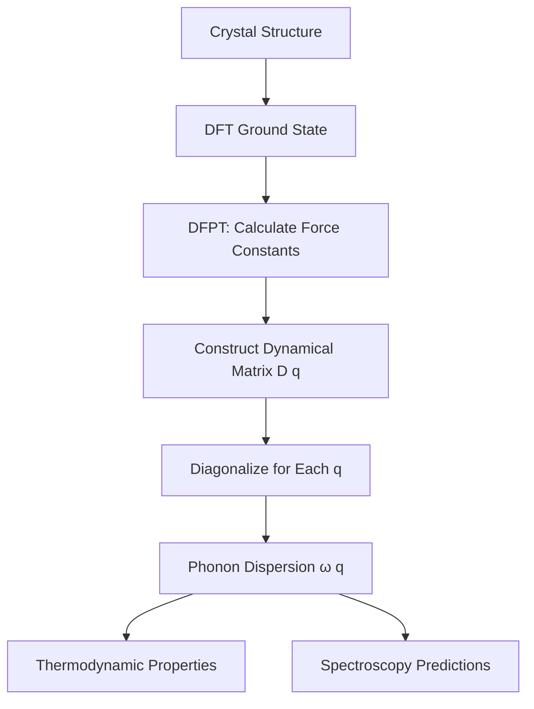

🌐 EN | [🇯🇵 JP](../../../jp/MS/phonon-intermediate/chapter-1.md) | Last sync: 2025-12-20

[Materials Science Dojo](../index.html) > [Intermediate Phonon Physics](index.md) > Chapter 1

# Chapter 1: Lattice Dynamics Theory

**Formal Mathematical Framework for Phonons**

⏱️ 30-40 min | 💻 6 Code Examples | 📊 Intermediate

## Learning Objectives

- Understand the Born-von Kármán boundary conditions and their role in lattice dynamics
- Derive the equations of motion for a general 3D crystal lattice
- Construct the dynamical matrix \\(\mathbf{D}(\mathbf{q})\\) and understand its properties
- Explore force constants, their symmetries, and translational invariance
- Solve the eigenvalue problem to obtain phonon frequencies \\(\omega^2(\mathbf{q})\\)
- Apply the acoustic sum rule and understand its physical significance
- Recognize the role of point group and space group symmetries in phonon calculations
- Classify phonon modes using irreducible representations
- Implement dynamical matrix construction and diagonalization in Python
- Connect lattice dynamics to modern DFT-based phonon calculations

## 1.1 Introduction to Lattice Dynamics

### Historical Context

The theory of **lattice dynamics** provides a rigorous mathematical framework for describing atomic vibrations in crystalline solids. Developed primarily by **Max Born** and **Theodore von Kármán** in the early 20th century, this theory forms the foundation for understanding phonons—the quantized normal modes of lattice vibrations.

> **Why Lattice Dynamics?**
>
> While the harmonic approximation and simple models (like the diatomic chain) provide intuition, real materials require a more sophisticated treatment that accounts for:
>
> - Three-dimensional crystal structures with multiple atoms per unit cell
> - Long-range and short-range interatomic forces
> - Crystal symmetries that constrain phonon properties
> - Realistic force constant tensors from first-principles calculations

### The General Problem

Consider a crystal with:

- \\(N\\) primitive unit cells (typically \\(N \sim 10^{23}\\))
- \\(r\\) atoms per unit cell (basis atoms)
- Total number of atoms: \\(N_{\text{tot}} = N \times r\\)
- Degrees of freedom: \\(3N_{\text{tot}}\\) (3 spatial dimensions per atom)

Our goal is to find the \\(3Nr\\) normal modes (phonon branches) and their dispersion relations \\(\omega(\mathbf{q})\\) across the Brillouin zone.

## 1.2 Born-von Kármán Boundary Conditions

### Motivation for Periodic Boundary Conditions

For a macroscopic crystal with \\(N \sim 10^{23}\\) unit cells, surface effects are negligible. To eliminate surface boundary conditions and maintain translational symmetry, we impose **Born-von Kármán periodic boundary conditions**.

**Definition: Born-von Kármán Boundary Conditions**

The crystal is treated as if it were repeated periodically in space. For a crystal with \\(N_1 \times N_2 \times N_3\\) unit cells along the three primitive lattice vectors \\(\mathbf{a}_1, \mathbf{a}_2, \mathbf{a}_3\\), we require:

\\[
\mathbf{u}(\mathbf{R} + N_i \mathbf{a}_i) = \mathbf{u}(\mathbf{R})
\\]

where \\(\mathbf{u}(\mathbf{R})\\) is the displacement at lattice site \\(\mathbf{R}\\), and \\(i = 1, 2, 3\\).

### Allowed Wavevectors

The periodic boundary conditions discretize the allowed wavevectors \\(\mathbf{q}\\) in the first Brillouin zone:

\\[
\mathbf{q} = \sum_{i=1}^{3} \frac{n_i}{N_i} \mathbf{b}_i
\\]

where \\(\mathbf{b}_i\\) are the reciprocal lattice vectors, and \\(n_i\\) are integers: \\(0 \leq n_i < N_i\\).

> **Number of Allowed Wavevectors**
>
> The total number of allowed \\(\mathbf{q}\\)-points is exactly \\(N = N_1 \times N_2 \times N_3\\), matching the number of primitive unit cells. With \\(r\\) atoms per unit cell and 3 degrees of freedom per atom, we have \\(3Nr\\) total phonon modes, as expected.

## 1.3 Equations of Motion for a 3D Crystal

### Displacement Notation

We denote the displacement of atom \\(\kappa\\) (where \\(\kappa = 1, 2, \ldots, r\\)) in unit cell \\(\mathbf{R}_l\\) as:

\\[
\mathbf{u}_\kappa(\mathbf{R}_l) = \mathbf{u}(l, \kappa)
\\]

The equilibrium position is \\(\mathbf{R}_l + \mathbf{r}_\kappa\\), where \\(\mathbf{r}_\kappa\\) is the position of atom \\(\kappa\\) within the unit cell.

### Harmonic Approximation

Expanding the potential energy \\(U\\) to second order in displacements (harmonic approximation):

\\[
U = U_0 + \frac{1}{2} \sum_{l, l'} \sum_{\kappa, \kappa'} \sum_{\alpha, \beta} \Phi_{\alpha\beta}^{\kappa\kappa'}(l, l') \, u_\alpha^\kappa(l) \, u_\beta^{\kappa'}(l')
\\]

where:

- \\(\Phi_{\alpha\beta}^{\kappa\kappa'}(l, l')\\) are the **force constants** (second derivatives of potential energy)
- \\(\alpha, \beta \in \{x, y, z\}\\) label Cartesian components
- \\(u_\alpha^\kappa(l)\\) is the \\(\alpha\\)-component of displacement of atom \\(\kappa\\) in cell \\(l\\)

### Newton's Second Law

The equation of motion for atom \\(\kappa\\) in cell \\(l\\) is:

\\[
M_\kappa \frac{d^2 u_\alpha^\kappa(l)}{dt^2} = -\sum_{l', \kappa', \beta} \Phi_{\alpha\beta}^{\kappa\kappa'}(l, l') \, u_\beta^{\kappa'}(l')
\\]

where \\(M_\kappa\\) is the mass of atom \\(\kappa\\).

## 1.4 Plane Wave Solutions and the Dynamical Matrix

### Bloch's Theorem for Phonons

Due to the translational symmetry of the crystal, we seek plane wave solutions of the form:

\\[
u_\alpha^\kappa(l, t) = \frac{1}{\sqrt{M_\kappa}} e_\alpha^\kappa(\mathbf{q}) \, e^{i(\mathbf{q} \cdot \mathbf{R}_l - \omega t)}
\\]

where \\(e_\alpha^\kappa(\mathbf{q})\\) is the polarization vector (eigenvector) for atom \\(\kappa\\).

### Derivation of the Dynamical Matrix

Substituting the plane wave ansatz into the equations of motion, we obtain:

\\[
\omega^2 e_\alpha^\kappa(\mathbf{q}) = \sum_{\kappa', \beta} D_{\alpha\beta}^{\kappa\kappa'}(\mathbf{q}) \, e_\beta^{\kappa'}(\mathbf{q})
\\]

**Definition: Dynamical Matrix \\(\mathbf{D}(\mathbf{q})\\)**

The **dynamical matrix** is defined as:

\\[
D_{\alpha\beta}^{\kappa\kappa'}(\mathbf{q}) = \frac{1}{\sqrt{M_\kappa M_{\kappa'}}} \sum_{l'} \Phi_{\alpha\beta}^{\kappa\kappa'}(0, l') \, e^{i\mathbf{q} \cdot \mathbf{R}_{l'}}
\\]

This is a \\(3r \times 3r\\) Hermitian matrix for each wavevector \\(\mathbf{q}\\).

### Eigenvalue Problem

The phonon frequencies \\(\omega_s(\mathbf{q})\\) (where \\(s = 1, 2, \ldots, 3r\\) labels the phonon branch) are obtained by solving:

\\[
\det \left[ \mathbf{D}(\mathbf{q}) - \omega^2 \mathbf{I} \right] = 0
\\]

This yields \\(3r\\) eigenvalues \\(\omega_s^2(\mathbf{q})\\) and corresponding eigenvectors (polarization vectors) \\(\mathbf{e}_s(\mathbf{q})\\).

## 1.5 Force Constants and Their Properties

### Definition and Physical Meaning

The force constant tensor \\(\Phi_{\alpha\beta}^{\kappa\kappa'}(l, l')\\) represents the force on atom \\(\kappa\\) in cell \\(l\\) along direction \\(\alpha\\) due to a displacement of atom \\(\kappa'\\) in cell \\(l'\\) along direction \\(\beta\\):

\\[
\Phi_{\alpha\beta}^{\kappa\kappa'}(l, l') = \frac{\partial^2 U}{\partial u_\alpha^\kappa(l) \, \partial u_\beta^{\kappa'}(l')}
\\]

### Symmetry Properties

#### 1. Invariance Under Exchange

From the equality of mixed partial derivatives:

\\[
\Phi_{\alpha\beta}^{\kappa\kappa'}(l, l') = \Phi_{\beta\alpha}^{\kappa'\kappa}(l', l)
\\]

#### 2. Translational Invariance

Force constants depend only on the relative positions of unit cells:

\\[
\Phi_{\alpha\beta}^{\kappa\kappa'}(l, l') = \Phi_{\alpha\beta}^{\kappa\kappa'}(0, l' - l)
\\]

This allows us to write \\(\Phi_{\alpha\beta}^{\kappa\kappa'}(\mathbf{R})\\) where \\(\mathbf{R} = \mathbf{R}_{l'} - \mathbf{R}_l\\).

### Acoustic Sum Rule

One of the most important constraints on force constants is the **acoustic sum rule**, which arises from translational invariance of the crystal as a whole:

**Theorem: Acoustic Sum Rule**

\\[
\sum_{l', \kappa'} \Phi_{\alpha\beta}^{\kappa\kappa'}(0, l') = 0
\\]

This ensures that uniform translation of the entire crystal (all atoms moving together) costs zero energy.

#### Consequence at \\(\mathbf{q} = 0\\)

At the Brillouin zone center (\\(\mathbf{q} = 0\\)), the acoustic sum rule guarantees that there are exactly 3 acoustic modes with \\(\omega = 0\\) (corresponding to rigid translations in the three spatial directions).

### Python Example: Verifying the Acoustic Sum Rule

```python
import numpy as np

def verify_acoustic_sum_rule(force_constants):
    """
    Verify the acoustic sum rule for force constants.

    Parameters:
    -----------
    force_constants : ndarray, shape (r, r, 3, 3, N1, N2, N3)
        Force constant tensor where:
        - First two indices: basis atoms (kappa, kappa')
        - Next two indices: Cartesian components (alpha, beta)
        - Last three indices: lattice vector components

    Returns:
    --------
    max_violation : float
        Maximum violation of the sum rule
    """
    r, _, _, _, N1, N2, N3 = force_constants.shape

    max_violation = 0.0

    for kappa in range(r):
        for alpha in range(3):
            for beta in range(3):
                # Sum over all l' and kappa'
                sum_value = np.sum(force_constants[kappa, :, alpha, beta, :, :, :])
                max_violation = max(max_violation, abs(sum_value))

    return max_violation

# Example: Simple cubic lattice with 1 atom per cell
# Force constants for nearest-neighbor interactions only
N = 5  # Small supercell for demonstration
r = 1  # 1 atom per unit cell

# Initialize force constants
fc = np.zeros((r, r, 3, 3, N, N, N))

# Simple spring model: k = 1.0 N/m, nearest neighbors only
k = 1.0

for i in range(N):
    for j in range(N):
        for k_idx in range(N):
            # Diagonal terms (self-interaction)
            fc[0, 0, 0, 0, i, j, k_idx] = -6 * k  # 6 nearest neighbors
            fc[0, 0, 1, 1, i, j, k_idx] = -6 * k
            fc[0, 0, 2, 2, i, j, k_idx] = -6 * k

            # Nearest neighbor terms
            # +x direction
            ip = (i + 1) % N
            fc[0, 0, 0, 0, ip, j, k_idx] = k

            # +y direction
            jp = (j + 1) % N
            fc[0, 0, 1, 1, i, jp, k_idx] = k

            # +z direction
            kp = (k_idx + 1) % N
            fc[0, 0, 2, 2, i, j, kp] = k

violation = verify_acoustic_sum_rule(fc)
print(f"Acoustic sum rule violation: {violation:.2e}")
print(f"Sum rule satisfied: {violation < 1e-10}")
```

## 1.6 Point Group Symmetry and Phonons

### Crystal Point Group

The **point group** of a crystal consists of all symmetry operations (rotations, reflections, inversions) that leave at least one point fixed. These symmetries impose constraints on the force constants and the dynamical matrix.

### Transformation of Force Constants

Under a point group operation \\(R\\), the force constants must transform as:

\\[
\Phi_{\alpha\beta}^{\kappa\kappa'}(\mathbf{R}_{l'}) = \sum_{\gamma, \delta} R_{\alpha\gamma} R_{\beta\delta} \Phi_{\gamma\delta}^{\kappa\kappa'}(R \mathbf{R}_{l'})
\\]

where \\(R_{\alpha\beta}\\) are the matrix elements of the rotation/reflection in Cartesian coordinates.

> **Practical Implication**
>
> Point group symmetry significantly reduces the number of independent force constants that need to be calculated. For example, in cubic crystals, many off-diagonal components must vanish or be equal by symmetry.

## 1.7 Space Group Symmetry and Phonon Classification

### Space Group Operations

A **space group** combines point group operations with translations. For phonons, space group symmetry leads to selection rules and the classification of phonon modes into irreducible representations.

### Irreducible Representations

At high-symmetry points in the Brillouin zone (e.g., Γ, X, L, K), the phonon eigenvectors can be classified according to the **irreducible representations** of the little group (the subgroup of the space group that leaves \\(\mathbf{q}\\) invariant).

**Example: Phonons at the Γ Point**

At the Brillouin zone center (\\(\mathbf{q} = 0\\)), the little group is the full point group of the crystal. For a cubic crystal (point group \\(O_h\\)), the 3 acoustic modes transform as the \\(T_{1u}\\) representation (triply degenerate), while optical modes can belong to representations like \\(T_{2g}\\), \\(E_g\\), \\(A_{1g}\\), etc.

### Selection Rules for Spectroscopy

The symmetry classification determines which phonon modes are:

- **Raman-active**: Modes that transform like components of the polarizability tensor
- **Infrared-active**: Modes that transform like components of the dipole moment vector
- **Silent modes**: Modes that are neither Raman nor IR active

## 1.8 Constructing the Dynamical Matrix

### Fourier Transform of Force Constants

The dynamical matrix is the Fourier transform of the force constants in real space:

\\[
D_{\alpha\beta}^{\kappa\kappa'}(\mathbf{q}) = \frac{1}{\sqrt{M_\kappa M_{\kappa'}}} \sum_{\mathbf{R}} \Phi_{\alpha\beta}^{\kappa\kappa'}(\mathbf{R}) \, e^{i\mathbf{q} \cdot \mathbf{R}}
\\]

### Properties of \\(\mathbf{D}(\mathbf{q})\\)

#### 1. Hermiticity

The dynamical matrix is Hermitian:

\\[
D_{\alpha\beta}^{\kappa\kappa'}(\mathbf{q})^* = D_{\beta\alpha}^{\kappa'\kappa}(\mathbf{q})
\\]

This ensures that all eigenvalues \\(\omega^2\\) are real.

#### 2. Positive Semi-Definiteness

For stable crystals, \\(\omega^2 \geq 0\\) for all \\(\mathbf{q}\\). Negative eigenvalues indicate lattice instabilities (imaginary phonon frequencies).

#### 3. Acoustic Branches

At \\(\mathbf{q} = 0\\), there are exactly 3 zero-frequency modes (acoustic modes). For small \\(\mathbf{q}\\), acoustic branches disperse linearly:

\\[
\omega_{\text{acoustic}}(\mathbf{q}) \approx v_s |\mathbf{q}|
\\]

where \\(v_s\\) is the sound velocity.

### Python Example: Dynamical Matrix for a Diatomic Linear Chain

```python
import numpy as np
import matplotlib.pyplot as plt

def dynamical_matrix_1D_diatomic(q, k, M1, M2, a):
    """
    Construct the dynamical matrix for a 1D diatomic chain.

    Parameters:
    -----------
    q : float or ndarray
        Wavevector (in units of 1/a)
    k : float
        Spring constant
    M1, M2 : float
        Masses of the two atoms
    a : float
        Lattice constant

    Returns:
    --------
    D : ndarray, shape (2, 2) or (len(q), 2, 2)
        Dynamical matrix
    """
    scalar_input = np.isscalar(q)
    q = np.atleast_1d(q)

    D = np.zeros((len(q), 2, 2), dtype=complex)

    for i, qi in enumerate(q):
        D[i, 0, 0] = k / M1
        D[i, 1, 1] = k / M2
        D[i, 0, 1] = -k / np.sqrt(M1 * M2) * np.exp(-1j * qi * a / 2)
        D[i, 1, 0] = -k / np.sqrt(M1 * M2) * np.exp(1j * qi * a / 2)

    return D[0] if scalar_input else D

def dispersion_1D_diatomic(q, k, M1, M2, a):
    """
    Calculate phonon dispersion for 1D diatomic chain.
    """
    D = dynamical_matrix_1D_diatomic(q, k, M1, M2, a)

    # Diagonalize for each q
    omega2 = np.zeros((len(q), 2))
    eigvecs = np.zeros((len(q), 2, 2), dtype=complex)

    for i in range(len(q)):
        eigenvalues, eigenvectors = np.linalg.eigh(D[i])
        omega2[i] = eigenvalues
        eigvecs[i] = eigenvectors

    omega = np.sqrt(np.abs(omega2))

    return omega, eigvecs

# Parameters
k = 1.0  # Spring constant (arbitrary units)
M1 = 1.0  # Mass of atom 1
M2 = 2.0  # Mass of atom 2
a = 1.0   # Lattice constant

# Wavevector range: -π/a to π/a
q_values = np.linspace(-np.pi/a, np.pi/a, 200)

# Calculate dispersion
omega, eigvecs = dispersion_1D_diatomic(q_values, k, M1, M2, a)

# Plot dispersion
fig, axes = plt.subplots(1, 2, figsize=(14, 5))

# Left: Dispersion relation
axes[0].plot(q_values * a / np.pi, omega[:, 0], 'b-', linewidth=2, label='Acoustic')
axes[0].plot(q_values * a / np.pi, omega[:, 1], 'r-', linewidth=2, label='Optical')
axes[0].axhline(y=0, color='k', linestyle='--', alpha=0.3)
axes[0].axvline(x=0, color='k', linestyle='--', alpha=0.3)
axes[0].set_xlabel('Wavevector q (π/a)', fontsize=12)
axes[0].set_ylabel('Frequency ω (arbitrary units)', fontsize=12)
axes[0].set_title('Phonon Dispersion: 1D Diatomic Chain', fontsize=14)
axes[0].legend(fontsize=11)
axes[0].grid(True, alpha=0.3)
axes[0].set_xlim(-1, 1)

# Right: Verify eigenvalue equation
q_test = np.pi / (2 * a)
D_test = dynamical_matrix_1D_diatomic(q_test, k, M1, M2, a)
eigenvalues, eigenvectors = np.linalg.eigh(D_test)

axes[1].text(0.1, 0.9, 'Eigenvalue Verification', fontsize=14, fontweight='bold',
             transform=axes[1].transAxes)
axes[1].text(0.1, 0.75, f'q = π/(2a)', fontsize=11, transform=axes[1].transAxes)
axes[1].text(0.1, 0.6, f'ω₁² = {eigenvalues[0]:.4f}', fontsize=11, transform=axes[1].transAxes)
axes[1].text(0.1, 0.5, f'ω₂² = {eigenvalues[1]:.4f}', fontsize=11, transform=axes[1].transAxes)
axes[1].text(0.1, 0.35, f'ω₁ = {np.sqrt(eigenvalues[0]):.4f}', fontsize=11,
             transform=axes[1].transAxes, color='blue')
axes[1].text(0.1, 0.25, f'ω₂ = {np.sqrt(eigenvalues[1]):.4f}', fontsize=11,
             transform=axes[1].transAxes, color='red')

# Verify orthogonality
e1 = eigenvectors[:, 0]
e2 = eigenvectors[:, 1]
orthogonality = np.abs(np.vdot(e1, e2))
axes[1].text(0.1, 0.1, f'⟨e₁|e₂⟩ = {orthogonality:.2e} (should be ≈0)', fontsize=10,
             transform=axes[1].transAxes)

axes[1].axis('off')

plt.tight_layout()
plt.show()

print("\n=== Dynamical Matrix Properties ===")
print(f"Hermiticity check (max |D - D†|): {np.max(np.abs(D_test - D_test.conj().T)):.2e}")
print(f"Eigenvalues (ω²): {eigenvalues}")
print(f"Frequencies (ω): {np.sqrt(eigenvalues)}")
```

## 1.9 Connection to DFT-Based Phonon Calculations

### Density Functional Perturbation Theory (DFPT)

Modern phonon calculations use **Density Functional Perturbation Theory (DFPT)** to obtain force constants from first principles:

1. **Ground State DFT**: Calculate the electronic ground state using DFT
2. **Linear Response**: Compute the response of the electronic structure to atomic displacements
3. **Force Constants**: Extract \\(\Phi_{\alpha\beta}^{\kappa\kappa'}(\mathbf{R})\\) directly without finite-difference displacements
4. **Fourier Interpolation**: Construct \\(\mathbf{D}(\mathbf{q})\\) for arbitrary \\(\mathbf{q}\\) in the Brillouin zone

> **Advantages of DFPT**
>
> - Directly calculates force constants without finite displacements
> - More accurate and numerically stable than frozen phonon methods
> - Can handle long-range electrostatic interactions (important for polar materials)
> - Implemented in codes like Quantum ESPRESSO, VASP, ABINIT

### Workflow: From DFT to Phonon Dispersion



## 1.10 Advanced Topics: Beyond the Harmonic Approximation

### Anharmonic Effects

The harmonic approximation assumes small displacements and quadratic potential energy. Real materials exhibit **anharmonicity**, which leads to:

- Phonon-phonon interactions and finite phonon lifetimes
- Thermal expansion
- Temperature-dependent phonon frequencies
- Nonlinear effects in thermal conductivity

Anharmonicity is treated by including cubic and quartic terms in the potential expansion, which will be covered in Chapter 2.

### Non-Analytic Terms in Polar Materials

In polar materials (ionic crystals, ferroelectrics), long-range electrostatic interactions lead to a **non-analytic contribution** to the dynamical matrix near \\(\mathbf{q} = 0\\):

\\[
D_{\alpha\beta}^{\text{NA}}(\mathbf{q}) \propto \frac{(\mathbf{q} \cdot \mathbf{Z})_\alpha (\mathbf{q} \cdot \mathbf{Z})_\beta}{\mathbf{q} \cdot \boldsymbol{\epsilon}_\infty \cdot \mathbf{q}}
\\]

where \\(\mathbf{Z}\\) is the Born effective charge tensor and \\(\boldsymbol{\epsilon}_\infty\\) is the high-frequency dielectric tensor. This causes the LO-TO splitting in optical phonons.

## Summary

**Key Takeaways**

- **Born-von Kármán boundary conditions** impose periodicity and discretize allowed wavevectors in the Brillouin zone
- **Equations of motion** in the harmonic approximation lead to the eigenvalue problem for the dynamical matrix
- The **dynamical matrix \\(\mathbf{D}(\mathbf{q})\\)** is Hermitian and yields \\(3r\\) phonon branches for \\(r\\) atoms per unit cell
- **Force constants** are constrained by symmetry and the acoustic sum rule
- **Point group and space group symmetries** simplify calculations and classify phonon modes into irreducible representations
- The **acoustic sum rule** ensures 3 zero-frequency acoustic modes at \\(\mathbf{q} = 0\\)
- **DFPT** enables parameter-free phonon calculations from first principles using DFT
- Understanding lattice dynamics is essential for predicting thermal, optical, and electronic properties of materials

## Exercises

**Exercise 1: Acoustic Sum Rule**

Prove that the acoustic sum rule \\(\sum_{l', \kappa'} \Phi_{\alpha\beta}^{\kappa\kappa'}(0, l') = 0\\) ensures that uniform translation of the entire crystal (all atoms displaced by the same vector) results in zero restoring force. Use this to show that at \\(\mathbf{q} = 0\\), there are exactly 3 zero-frequency modes.

**Exercise 2: Monatomic Linear Chain**

For a 1D monatomic chain with nearest-neighbor interactions (force constant \\(k\\)), lattice constant \\(a\\), and atomic mass \\(M\\):

1. Write down the dynamical matrix \\(D(q)\\) as a function of wavevector \\(q\\)
2. Solve for the dispersion relation \\(\omega(q)\\)
3. Verify that \\(\omega(0) = 0\\) and find the sound velocity \\(v_s = \lim_{q \to 0} \omega(q)/q\\)
4. Calculate the maximum frequency at the zone boundary \\(q = \pi/a\\)

**Exercise 3: Symmetry Analysis**

Consider a face-centered cubic (FCC) crystal with one atom per primitive cell (e.g., Al, Cu). At the Γ point (\\(\mathbf{q} = 0\\)):

1. What is the point group symmetry?
2. How many phonon branches are there?
3. Classify the 3 acoustic modes by their irreducible representation
4. Explain why there are no optical modes for this structure

**Exercise 4: Force Constant Matrix**

For a 2D square lattice with one atom per unit cell and nearest-neighbor interactions only (force constant \\(k\\)), construct the \\(2 \times 2\\) dynamical matrix \\(D_{\alpha\beta}(q_x, q_y)\\) where \\(\alpha, \beta \in \{x, y\}\\). Show that it can be written as:

\\[
D(q_x, q_y) = \frac{k}{M} \begin{pmatrix} 2 - 2\cos(q_x a) & 0 \\ 0 & 2 - 2\cos(q_y a) \end{pmatrix}
\\]

What are the two phonon branches?

**Exercise 5 (Advanced): DFPT Interpretation**

In DFPT, the force constant is related to the second derivative of the total energy with respect to atomic displacements:

\\[
\Phi_{\alpha\beta}^{\kappa\kappa'}(\mathbf{R}) = \frac{\partial^2 E_{\text{tot}}}{\partial u_\alpha^\kappa(0) \, \partial u_\beta^{\kappa'}(\mathbf{R})}
\\]

Explain conceptually how linear response theory allows calculation of these second derivatives without explicitly displacing atoms. What advantage does this provide over the frozen phonon method?

---

**Navigation**

[← Back to Series Index](index.md) | [Chapter 2: Phonon Interactions →](chapter-2.md)

---

**Disclaimer**

This educational content was created for the Hashimoto Lab knowledge base. While care has been taken to ensure accuracy, readers should verify critical information with primary sources and consult original research papers.

**Author**: MS Knowledge Hub Content Team
**Version**: 1.0 | **Last Updated**: 2025-12-19
**License**: Creative Commons BY 4.0
