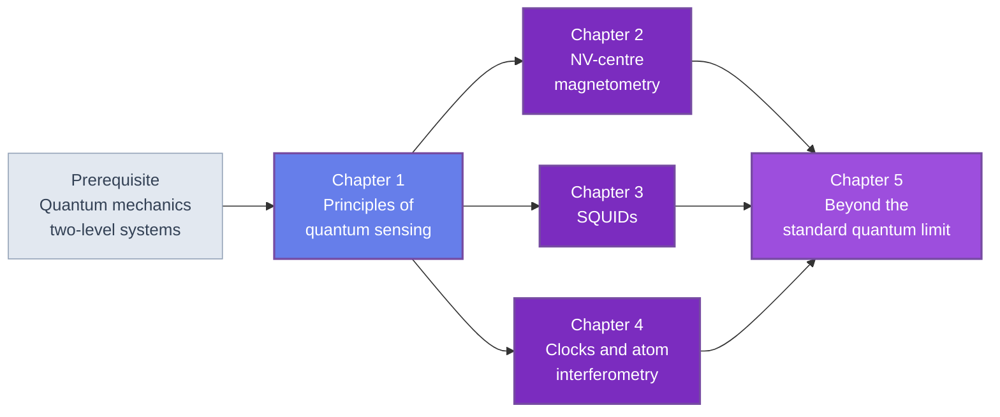

🌐 EN | [🇯🇵 JP](<../../../jp/MS/quantum-sensing-introduction/index.html>) | Last sync: 2026-08-13

[AI Terakoya Top](<../../index.html>)›[Materials Science Dojo](<../index.html>)›[Introduction to Quantum Sensing](<index.html>)

[← Back to Materials Science Dojo](<../index.html>)

## 🎯 Series Overview

Quantum sensing is the third pillar of quantum technology, and it is the one that already works. While quantum computing argues about error thresholds and quantum communication about repeaters, quantum sensors have been sitting in laboratories for decades doing measurements that nothing else can do — and a large fraction of those measurements are measurements of materials.

That is why this course lives in the Materials Science Dojo rather than in a quantum dojo. A nitrogen-vacancy centre in diamond is not primarily a qubit candidate here; it is a magnetic-field microscope with tens of nanometres of resolution, used to image domain walls, two-dimensional magnets, antiferromagnetic textures and current distributions in operating devices. A SQUID is not primarily a superconducting circuit; it is the susceptometer and the flux microscope that a magnetism laboratory already owns. An atomic clock is not primarily a frequency standard; it is the instrument that taught everyone else how to characterize the stability of a measurement. Read this way, quantum sensing belongs beside [X-ray diffraction](<../xrd-analysis-introduction/index.html>), [spectroscopy](<../spectroscopy-introduction/index.html>), [electron microscopy](<../electron-microscopy-introduction/index.html>) and [electrical and magnetic testing](<../electrical-magnetic-testing-introduction/index.html>) as one more family of characterization methods — one that answers a question none of the others do: *what is the local field here, now, without touching the sample and without averaging over the whole specimen.*

The course is built around a single observation. Every method in it — NV magnetometry, the dc SQUID, the optical clock, the atom interferometer, and the entangled-probe schemes at the end — is the same interferometer with different hardware. Chapter 1 establishes that template, defines the sensitivity $\eta$ once for the whole course, derives the projection-noise limit and verifies it numerically, and builds the stability and filter-function machinery that the four later chapters all call. Chapters 2, 3 and 4 are then three instances of it, readable in any order provided Chapter 2 comes before the comparison passages of Chapters 3 and 4 are taken literally. Chapter 5 asks what entanglement adds, and answers honestly.

Every number in these five chapters is computed from stated formulas with NumPy, SciPy and Matplotlib. There is no instrument SDK, no vendor software, and no hardware access.

### Learning Path

Chapter 1 is required first, because it fixes the notation, the sensitivity definition and the numerical toolkit that the rest of the course reuses without restating. Chapters 2, 3 and 4 are then mostly parallel: they cover three different platform families whose physics is developed independently, and the only shared derivations are Chapter 1's. They are not fully self-contained, though. Chapter 3 compares its own numbers against Chapter 2's AC sensitivity (§2.3), $T_1$ relaxometry bandwidth (§2.4) and stray-field model (§2.5), two of its exercises use those results directly, and Chapter 4 refers back to the flux-locked loop of §3.2 and to the SQUID's operating temperature. Read in order, those passages land as comparisons; read out of order, they are forward references you can follow or skip. Chapter 5 assumes all three, since its whole point is what entanglement would add to any of them.

### 📋 Learning Objectives

On finishing this series you will be able to:

  * Write any quantum-sensing protocol as a Ramsey interferometer, identifying the beamsplitter, the accumulated phase and the readout, and explain what the shared structure implies about the shared sensitivity formula
  * Define the sensitivity $\eta$ in signal per root hertz, derive it from projection noise, and use it correctly — including knowing the averaging times over which it is a valid extrapolation and the ones over which it is not
  * Compute an Allan deviation, identify the white, flicker and drift regimes from its slope, and decide whether a measurement should be averaged longer or modulated instead
  * Explain the level structure of the nitrogen-vacancy centre, simulate an ODMR spectrum, and compute the sensitivity of DC, AC and relaxometric protocols including projection noise
  * Derive the $V$-$\Phi$ characteristic of a dc SQUID from the resistively-shunted-junction model, convert a flux noise into a field sensitivity, and explain why pickup-coil geometry decides everything
  * Explain the operating principle of an optical lattice clock and of a light-pulse atom interferometer, and compute the phase sensitivity of each
  * State what the standard quantum limit does and does not forbid, quantify the entanglement-enhanced gain, and demonstrate numerically how quickly decoherence removes it
  * Place any measurement problem on the sensitivity-against-resolution map and judge, from scaling laws alone, whether a quantum sensor is the right instrument or the wrong one

### 📖 Prerequisites

**Required.** Quantum mechanics at the level of two-level systems: superposition, the Bloch sphere, Rabi and Ramsey dynamics, and the measurement postulate. [Introduction to Quantum Computing](<../../FM/quantum-computing-introduction/index.html>) Chapters 1 and 2 cover exactly this if it is not already familiar.

**Strongly recommended.** [Introduction to Quantum Hardware](<../../FM/quantum-hardware-introduction/index.html>), and in particular [its Chapter 1](<../../FM/quantum-hardware-introduction/chapter-1.html>). That chapter defines $T_1$, $T_2$, $T_2^\ast$, noise spectral density, the Ramsey and echo sequences and the filter-function formalism, and this course uses all of them with the same meanings and the same symbols rather than re-deriving them. The relationship between the two courses is exact: the hardware course asks how to stop a two-level system from noticing its environment, and this one asks how to read out what it noticed.

**Useful for Chapter 3.** [Introduction to Superconductivity](<../superconductivity-introduction/index.html>) for flux quantization and the Josephson effect. Chapter 3 recapitulates what it needs, but the recapitulation is brisk.

**Useful for Chapter 2's applications.** [Introduction to Spintronics](<../spintronics-introduction/index.html>) for magnetic domains, domain walls and current-induced textures — the objects that scanning magnetometry is used to image.

**Required tooling.** Python 3.8 or later with NumPy, SciPy and Matplotlib. Nothing else.

* * *

## 📚 Chapters

### Chapter 1: Principles of Quantum Sensing

Why a quantum system makes a good instrument: a discrete transition is a reproducible frequency reference, and the phase of a superposition is a time integral of whatever perturbed it. Then the template — split, accumulate, recombine, read — written out for all four platforms of the course side by side, so that the sensitivity formula can be derived once. Projection noise from binomial statistics, the standard quantum limit $\delta\phi = 1/(C\sqrt{N})$ verified by Monte Carlo over six decades, and the sensitivity $\eta$ defined with its units and its three standard misuses. The optimal interrogation time $\tau = T_2/2$ and the dead-time correction. Then stability: the Allan deviation, its white, flicker and random-walk regimes reproduced numerically, and the reason a sensitivity quoted without a stability curve is half a specification. Closes with filter functions read three ways — as decoupling, as a lock-in amplifier, and as spectroscopy of the host material — and the sensitivity-against-resolution map the rest of the course navigates by.

**Key topics** : two-level system as reference and transducer · Ramsey protocol as universal template · projection noise · standard quantum limit · sensitivity $\eta$ · optimal interrogation time · dead time and duty cycle · Allan deviation · filter functions · AC sensitivity · sensitivity-resolution trade-off

💻 6 Code Examples ⏱️ 40-45 minutes 📊 Intermediate

[Read Chapter 1 →](<chapter-1.html>)

### Chapter 2: NV-Center Magnetometry

The case where a materials defect becomes an instrument. The nitrogen-vacancy centre's level structure, its spin-dependent fluorescence and optically detected magnetic resonance — the mechanism that makes a single spin readable at room temperature. DC magnetometry by CW-ODMR and by Ramsey, with the sensitivity formula of Chapter 1 evaluated for real level structures and checked numerically. AC magnetometry and dynamical decoupling: from the Hahn echo to XY8, why the same pulse train that extends $T_2$ also selects a measurement band, and how the two readings of the filter function are used in the same experiment. $T_1$ relaxometry as a probe of gigahertz noise, which is the one modality that reaches frequencies no pulse sequence can filter. Then imaging: scanning NV microscopy and wide-field magnetometry applied to magnetic domains, two-dimensional magnets, antiferromagnets and current distributions.

**Key topics** : NV level structure · zero-field splitting · spin-dependent fluorescence · ODMR · CW and pulsed DC magnetometry · XY8 and dynamical decoupling · AC sensitivity · $T_1$ relaxometry · scanning and wide-field imaging · thermometry and strain sensing

💻 7 Code Examples ⏱️ 45-50 minutes 📊 Intermediate

[Read Chapter 2 →](<chapter-2.html>)

### Chapter 3: SQUIDs — Superconducting Quantum Interference Devices

The most sensitive magnetometer ever built, and an interferometer whose arms are made of superconductor rather than of pulses. Flux quantization and the Josephson relations, recapitulated at the level Chapter 3 needs. The dc SQUID: the $V$-$\Phi$ characteristic derived from the resistively-shunted-junction model, the flux-to-voltage transfer function, and why a flux-locked loop is not an accessory but part of the measurement. What limits the sensitivity — flux noise, and the $1/f$ contribution from the same two-level systems and surface defects that limit superconducting qubits, which is where this chapter becomes a materials argument. Then the applications a materials laboratory actually uses: susceptometry, scanning SQUID microscopy, flux imaging, and the pickup-coil scaling that decides the sensitivity-resolution trade-off in this platform.

**Key topics** : flux quantization · Josephson effect · dc SQUID and the RSJ model · $V$-$\Phi$ characteristic · flux-locked loop · flux noise and $1/f$ noise · surface spins and two-level systems · pickup-coil design and scaling · susceptometry · scanning SQUID microscopy

💻 5 Code Examples ⏱️ 45-50 minutes 📊 Intermediate

[Read Chapter 3 →](<chapter-3.html>)

### Chapter 4: Atomic Clocks and Atom Interferometry

Where the Ramsey protocol reaches its highest precision, and where the vocabulary of stability was invented. Time and frequency as the reference measurement: fractional stability, the Allan deviation revisited with clocks as its native application, and the systematic-error discipline that clock work demands. Optical lattice clocks and ion clocks, built from physics the quantum-hardware course already established. Light-pulse atom interferometry: laser pulses as beamsplitters, the gravimetric and Sagnac phases, and the sensitivity formula for an inertial measurement. Then the design trade that matters most outside the clock community — the vapour-cell magnetometer, optically pumped and operated in the spin-exchange relaxation-free regime, which reaches extraordinary sensitivity with no cryogenics at all.

**Key topics** : Ramsey as a time standard · fractional frequency stability · systematic error budgets · optical lattice and ion clocks · light-pulse beamsplitters · Mach-Zehnder atom interferometer · gravimetry and rotation sensing · optical pumping · vapour-cell magnetometers · the SERF regime

💻 6 Code Examples ⏱️ 40-45 minutes 📊 Advanced

[Read Chapter 4 →](<chapter-4.html>)

### Chapter 5: Beyond the Standard Quantum Limit

What entanglement buys, what it costs, and what remains. Spin squeezing and entanglement-enhanced interferometry: the route from the $1/\sqrt{N}$ standard quantum limit towards the $1/N$ Heisenberg limit, stated as physics rather than as a slogan. Then the honest evaluation — the implementation cost of preparing and holding a squeezed or entangled state, and a numerical experiment showing how quickly the advantage evaporates under realistic decoherence, because a fragile gain that is reported without its fragility is not a result. Sensor output as *quantum data*, which is the concrete form of the prospect that [Introduction to Quantum Machine Learning](<../../MI/quantum-machine-learning-introduction/index.html>) Chapter 5 leaves open. Then a materials research roadmap: which measurement problems quantum sensors can realistically address — nanoscale magnetism, device self-heating, internal currents in batteries — assessed from principles rather than from announcements. Closes with a synthesis of the whole quantum series.

**Key topics** : spin squeezing · entanglement-enhanced metrology · Heisenberg limit · N00N states and loss fragility · decoherence and the disappearing advantage · quantum data · materials research roadmap · series synthesis

💻 5 Code Examples ⏱️ 45-50 minutes 📊 Advanced

[Read Chapter 5 →](<chapter-5.html>)

* * *

## 🔤 Notation and Shared Conventions

Fixed in Chapter 1 and used unchanged, so that a formula from any chapter can be read with any other.

| Symbol | Meaning |
| --- | --- |
| $\gamma$ | angular gyromagnetic ratio, rad s$^{-1}$ T$^{-1}$; quoted numbers are $\gamma/2\pi$ in Hz/T |
| $\phi$ | accumulated interferometer phase, $\phi = \int_0^\tau \delta\omega\,dt$ |
| $\tau$ | interrogation (free-precession) time of one shot |
| $t_d$ | dead time per shot: initialization plus readout |
| $T$ | total measurement time; the resolution reached is $\eta/\sqrt{T}$ |
| $C$ | fringe contrast, $0 < C \le 1$, absorbing every imperfection |
| $N$ | number of independent probes read out per shot |
| $\eta$ | sensitivity, $\eta = \delta X_\mathrm{min}\sqrt{T}$, in signal per $\sqrt{\mathrm{Hz}}$ |
| $\sigma_y(\tau)$ | Allan deviation at averaging time $\tau$ |
| $\lvert\tilde{s}(f,\tau)\rvert^2$ | filter function of a pulse sequence |
| $T_1, T_2, T_2^\ast$ | as defined in [quantum-hardware Chapter 1](<../../FM/quantum-hardware-introduction/chapter-1.html>) §1.4, without redefinition |
| $\Phi_0$ | magnetic flux quantum $h/2e$ |

**Sensitivity is an amplitude spectral density.** $\eta$ has units of signal per root hertz; its *square* is a power spectral density. Both conventions appear in the literature and they differ by a square, so every comparison in this course states which one is meant.

**Angular versus cyclic frequency.** $\Omega$, $\Delta$ and $\gamma$ are angular; quoted numbers are cyclic, written with an explicit $2\pi$. Every factor of $2\pi$ in the code is explicit for this reason.

**The figure of merit is $N T_2$.** Chapter 1 shows that the projection-noise-limited sensitivity depends only on the product of the probe count and the coherence time — and that dead time is what breaks the symmetry. Every platform comparison in the course is a comparison of how each one spends that product.

* * *

## 🔍 What This Series Is and Is Not

**It is** a physics and methods course. Every formula is derived, every number is computed from the formula by code printed in the text, and every scaling law is checked numerically rather than asserted.

**It is not a table of sensitivity records.** No chapter states the best sensitivity achieved by any technique. Such numbers are the fastest-moving quantity in the field, they are obsolete before they are read, and — more importantly — they are not explanatory. What is stated instead is the scaling: $\eta \propto 1/\sqrt{N T_2}$, $\eta_B \propto d^{-3/2}$, $B \propto z^{-3}$. Those do not go out of date, and they are what let you evaluate a claim you meet in the wild.

**It is not an instrument catalogue.** No vendors, no product names, no model numbers, no purchasing advice. A reader who wants to know which instrument to buy is reading the wrong document; a reader who wants to know what any instrument of a given class *can and cannot do, and why*, is reading the right one.

**It is not a quantum computing course.** The overlap in physics is large and the overlap in purpose is zero. Where a piece of two-level-system physics is needed, this course cites [Introduction to Quantum Hardware](<../../FM/quantum-hardware-introduction/index.html>) rather than re-deriving it, and it uses the same symbols so that the two can be read together.

**It is not a substitute for the conventional methods.** Chapter 1's map includes cases where a quantum sensor is the wrong choice, and Chapter 5 keeps that honesty. Where a bulk susceptibility measurement or an electron microscope answers the question better, the course says so.

## 📚 Recommended Learning Paths

### Pattern 1: Complete path (5-6 days)

  * Day 1: Chapter 1, Sections 1.1-1.5 — the template, the sensitivity, the stability, the map
  * Day 2: Chapter 1, Section 1.6 — run all six examples and reproduce the $1/\sqrt{N}$ and Allan results yourself
  * Day 3: Chapter 2 — NV centres, from level structure to imaging
  * Day 4: Chapter 3 — SQUIDs, from flux quantization to scanning microscopy
  * Day 5: Chapter 4 — clocks, atom interferometers and vapour cells
  * Day 6: Chapter 5 and the exercises — squeezing, its fragility, and the roadmap

### Pattern 2: The magnetic-imaging path (two days)

  * Chapter 1, Sections 1.2, 1.3 and 1.5 — the template, $\eta$, and the resolution trade-off
  * Chapter 2 in full — this is the imaging chapter
  * Chapter 3, Sections 3.4 onward — scanning SQUID microscopy, for the comparison
  * Chapter 5, Section 5.4 — where nanoscale magnetometry is heading

### Pattern 3: The measurement-science path (one day)

  * Chapter 1, Sections 1.3 and 1.4 — sensitivity, Allan deviation, filter functions
  * Chapter 4, Sections 4.1 and 4.2 — stability and systematic error budgets, done properly
  * Chapter 1, Exercises 1 to 4 — the four calculations a measurement scientist should be able to do from memory

## 🎯 Overall Learning Outcomes

### Knowledge Level

  * ✅ State the Ramsey template and identify it in four physically unrelated instruments
  * ✅ Define $\eta$, $C$, $N T_2$ and $\sigma_y(\tau)$, and explain what each one does and does not specify
  * ✅ Explain the physical origin of the sensitivity-resolution trade-off, and why it cannot be engineered away
  * ✅ State what the standard quantum limit forbids, and what it does not

### Practical Skills

  * ✅ Compute the sensitivity of a pulse sequence including projection noise, contrast and dead time
  * ✅ Compute an Allan deviation from a data record and read the regimes off its slope
  * ✅ Evaluate a filter function exactly and design a pulse sequence for a target frequency band
  * ✅ Simulate an ODMR spectrum, a SQUID $V$-$\Phi$ curve, and an atom-interferometer fringe

### Application Ability

  * ✅ Choose, from scaling laws alone, whether a measurement problem needs a scanning probe, a wide-field ensemble, a pickup loop or a vapour cell
  * ✅ Read a quantum-sensing paper and locate its sensitivity definition, its averaging time and its missing stability curve
  * ✅ Recognize when a conventional characterization method is the better instrument
  * ✅ Turn a coherence measurement into a statement about defects in the host material

## 🛠️ Technologies and Tools Used

### Main Libraries

  * **numpy** — every simulation, every filter function, every Allan deviation
  * **scipy** — integration, root finding, optimization, special functions
  * **matplotlib** — fringes, spectra, stability curves, sensitivity maps

### Development Environment

  * **Python** : 3.8 or higher
  * **Jupyter Notebook** : recommended, since each chapter is written as one continuous session
  * Google Colab runs every example. Nothing here needs a GPU, an instrument, or an account

## 🚀 Next Steps

### Deep Dive Learning

  * Quantum metrology theory: the quantum Fisher information, the Cramér-Rao bound, and when entanglement provably helps
  * Noise spectroscopy: inverting families of coherence curves into spectral densities, and what that reveals about defect ensembles
  * Nanoscale NMR and single-molecule detection with shallow defect centres
  * Optomechanical and photonic sensors, where the probe is a light field rather than a spin

### Related Series

  * [Introduction to Quantum Hardware](<../../FM/quantum-hardware-introduction/index.html>) — the sister course, and the source of this one's coherence vocabulary
  * [Introduction to Quantum Computing](<../../FM/quantum-computing-introduction/index.html>) — the prerequisite for two-level-system formalism
  * [Introduction to Quantum Machine Learning](<../../MI/quantum-machine-learning-introduction/index.html>) — where the quantum data produced by these sensors would be consumed
  * [Introduction to Superconductivity](<../superconductivity-introduction/index.html>) — the physics behind Chapter 3
  * [Introduction to Spintronics](<../spintronics-introduction/index.html>) — the objects Chapter 2's microscopes are pointed at
  * [Introduction to Electrical and Magnetic Testing](<../electrical-magnetic-testing-introduction/index.html>) — the conventional magnetic characterization this course sits beside

### Practical Projects

  * Take a published sensitivity claim, reconstruct it from the Chapter 1 formula, and identify which parameter the authors optimized
  * Record any slowly-drifting laboratory signal and compute its Allan deviation; find the optimal averaging time before you next average anything
  * Design a CPMG sequence for a noise band you actually care about, and compute how much of the rest of the spectrum it rejects
  * Place your own measurement problem on the Chapter 1 map and argue, in scaling laws only, for or against a quantum sensor

### ⚠️ Disclaimer

  * This content is provided solely for educational, research, and informational purposes and does not constitute professional advice (legal, accounting, technical warranty, etc.).
  * This content and accompanying code examples are provided "AS IS" without any warranty, express or implied, including but not limited to merchantability, fitness for a particular purpose, non-infringement, accuracy, completeness, operation, or safety.
  * Every sensitivity figure in this course is computed from the stated formulas and the stated assumptions: the numbers illustrate scaling laws and are not measurements, specifications, or claims about any instrument.
  * The author and Tohoku University assume no responsibility for the content, availability, or safety of external links, third-party data, tools, libraries, etc.
  * To the maximum extent permitted by applicable law, the author and Tohoku University shall not be liable for any direct, indirect, incidental, special, consequential, or punitive damages arising from the use, execution, or interpretation of this content.
  * The content may be changed, updated, or discontinued without notice.
  * The copyright and license of this content are subject to the stated conditions (e.g., CC BY 4.0). Such licenses typically include no-warranty clauses.
