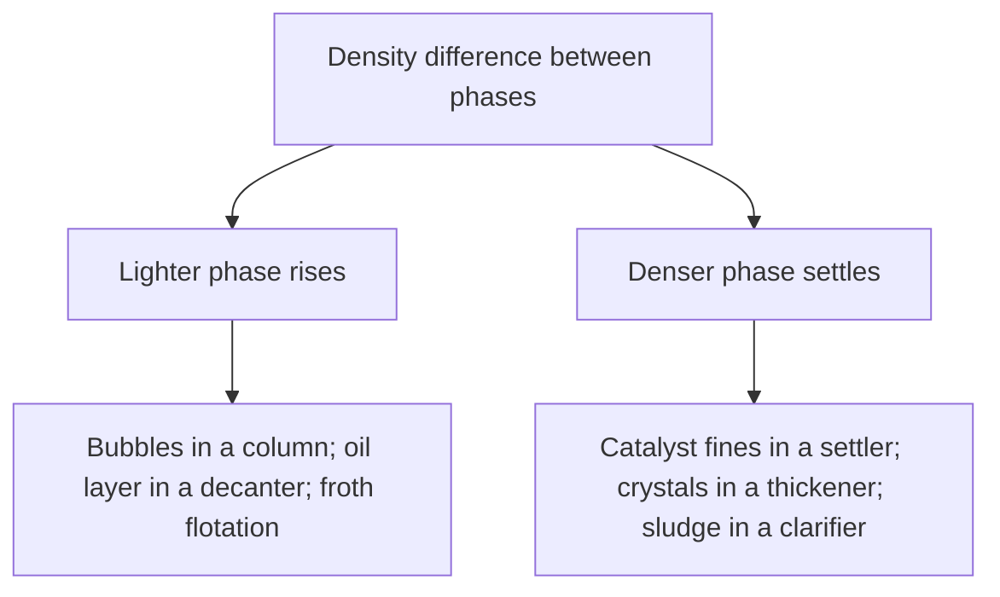

## Video Lecture

<div class="video-container">
  <iframe
    width="560"
    height="315"
    src="https://www.youtube.com/embed/lfGMREF-V-c"
    title="Chemical Engineering Fluid Mechanics Ch.1: Fluids, Pressure, and Statics"
    frameborder="0"
    allow="accelerometer; autoplay; clipboard-write; encrypted-media; gyroscope; picture-in-picture"
    allowfullscreen>
  </iframe>
</div>

> This video covers the same content as the text below. Choose your preferred learning format.

---

# Chapter 1: Fluids, Pressure, and Statics

This chapter lays the groundwork for chemical engineering fluid mechanics: what makes a fluid a fluid, which two properties the whole subject runs on, how pressure is distributed in a fluid at rest, and how a mass balance for a pipe becomes the continuity equation.

**Density, Viscosity, and the Pressure Field**

## Learning Objectives

By completing this chapter, you will be able to:

  * ✅ Define a fluid by its response to shear and state Newton's law of viscosity
  * ✅ Quote order-of-magnitude densities and viscosities for liquids and gases as sanity checks
  * ✅ Compute hydrostatic pressure with $\Delta P = \rho g h$ and convert between Pa, bar, and atm
  * ✅ Distinguish gauge from absolute pressure and explain why the confusion is expensive
  * ✅ Explain buoyancy and how density difference drives gravity separation equipment
  * ✅ Apply continuity, $\dot{m} = \rho v A$, and its incompressible form $v_1 A_1 = v_2 A_2$

**Reading Time**: 20-25 minutes **Code Examples**: 1 **Exercises**: 3

* * *

## 1.1 Why Fluid Mechanics Runs the Plant

Walk a chemical plant and count what is standing still. Almost nothing is. Feeds are pumped, gases compressed, vapor climbs a distillation column while liquid runs back down, cooling water loops through exchangers, product leaves in a pipeline. A plant is, mechanically, a machine for moving fluids while something useful happens to them on the way. That pays in three currencies:

1. **Pressure drop is money.** Every meter of pipe, every bend and valve takes a bite out of the pressure, and a pump or compressor puts it back — on the electricity bill, for the life of the plant. The cost scales steeply with velocity, as [Chapter 4](chapter-4.html) makes quantitative.
2. **Flow regime decides performance.** Whether flow is smooth and layered or chaotic and mixing ([Chapter 3](chapter-3.html)) changes heat transfer coefficients by an order of magnitude and controls whether reactants ever meet.
3. **Safety lives here.** Overpressure, water hammer, cavitating pumps, and blocked-in lines are fluid mechanics problems first.

[Introduction Chapter 1](../chemical-engineering-introduction/chapter-1.html) introduced **transport phenomena** — momentum, heat, and mass all obeying laws of the form *flux = coefficient × driving force*. This series develops the first row of that table, **momentum transport**; the heat row is developed in [Chemical Engineering Heat Transfer](../chemical-engineering-heat-transfer/index.html), and the mass row in [Chemical Engineering Mass Transfer and Separation](../chemical-engineering-mass-transfer/index.html). Momentum comes first because its driving force, a velocity gradient, is the one you can see.

## 1.2 What Is a Fluid

A **solid** under a shear stress — a force applied parallel to a surface — deforms by a fixed amount and then stops. A **fluid** cannot: apply any shear stress, however small, and it keeps deforming as long as the stress lasts. That continuous deformation is flow, and it is the definition: *a fluid deforms continuously under shear.* Liquids and gases both qualify, differing mainly in compressibility.

Two properties carry almost all the weight here. **Density** $\rho$, mass per unit volume in kg/m³, sets what a fluid weighs, what pressure a column of it generates, and how much momentum a stream carries. **Viscosity** $\mu$, resistance to shearing in Pa·s, sets the force needed to keep it moving.

| Fluid (at ~20 °C) | Density $\rho$ [kg/m³] | Viscosity $\mu$ [Pa·s] |
|---|---|---|
| **Water** | ≈ 998 | ≈ 0.001 (1 mPa·s) |
| **Light organic liquids** | ≈ 650–900 | ≈ 0.0003–0.001 |
| **Air (1 atm)** | ≈ 1.2 | ≈ 0.000018 |
| **Glycerol** | ≈ 1260 | ≈ 1.4 |
| **Honey** | ≈ 1400 | ≈ 10 (order of magnitude) |

Read the table for ratios, not digits. Liquid densities cluster within a factor of two of water; gases at ambient conditions are about a thousand times lighter. Viscosities span far more — gases roughly fifty times less viscous than water, honey ten thousand times more. Temperature works in opposite directions on the two: heating a **liquid** thins it, heating a **gas** thickens it slightly.

### Newton's Law of Viscosity

Picture a fluid between two parallel plates, the lower fixed and the upper dragged sideways at steady speed. The layer touching each plate moves with it — the **no-slip condition**, an experimental fact underpinning the whole subject — so a linear velocity profile develops across the gap. The shear stress $\tau$ sustaining it is

$$ \tau = \mu \frac{dv}{dy} $$

the transport table made concrete: a **momentum flux** ($\tau$, in N/m², equivalently momentum per unit area per unit time) equals a **coefficient** ($\mu$) times a **driving force** (the velocity gradient). Momentum diffuses from fast layers into slow ones exactly as heat diffuses from hot to cold.

Fluids obeying this law with constant $\mu$ are **Newtonian**: water, air, most solvents. Many industrial fluids are not. **Shear-thinning** materials — polymer solutions, paints, many slurries — thin out as you shear them harder, which is why a stirred slurry pumps more easily than its at-rest thickness suggests; others thicken, or need a yield stress before moving at all. This series is Newtonian throughout, so spotting a non-Newtonian fluid matters: the later correlations do not apply to it as written.

## 1.3 Pressure and the Hydrostatic Field

**Pressure** is a normal stress: force per unit area acting perpendicular to a surface, in pascals (1 Pa = 1 N/m²). In a fluid at rest it is **isotropic** — at a given point the same magnitude in every direction, so sensor orientation does not matter. The only thing that changes it is depth, because the fluid below must hold up the weight of the fluid above:

$$ \Delta P = \rho g h $$

with $\rho$ in kg/m³, $g = 9.81$ m/s², and $h$ the vertical depth in meters. Note what is *absent*: vessel shape, cross-sectional area, and total quantity of liquid — a narrow standpipe and a wide tank filled to the same height read the same pressure at the bottom.

### Worked Example: A 10-Meter Water Column

For water at 20 °C ($\rho = 998$ kg/m³), 10 m down:

$$ \Delta P = 998 \times 9.81 \times 10 = 97{,}904\ \text{Pa} \approx 0.979\ \text{bar} \approx 0.966\ \text{atm} $$

Hence the working **rule of thumb**: *10 meters of water is roughly 1 atmosphere, or roughly 1 bar.* Exactly, 1 atm of water head is 10.35 m and 1 bar is 10.21 m, so the rule is good to about 3.5% — well inside what a mental estimate needs, and worth memorizing.

### Gauge vs Absolute Pressure

$$ P_{\text{abs}} = P_{\text{gauge}} + P_{\text{atm}} $$

Nearly every pressure instrument in a plant reads **gauge** pressure — the difference from local atmosphere — reported as barg, kPag, or psig. A vessel showing "0" is at atmospheric pressure, not vacuum. Other calculations demand **absolute** pressure: the ideal gas law, compressor work, vapor pressure comparisons, any system below atmospheric. The confusion is a chronic source of real errors — reading 2 barg as 2 bara is a 50% error in a gas's absolute pressure, hence in its density and in the compressor duty computed from it. State the convention in every calculation you write.

### Manometers and Level by Differential Pressure

Two everyday uses follow. A **manometer** turns a pressure difference into a readable height difference in a liquid column, $\Delta P = \rho g \Delta h$. Run backward, the same relation measures most **tank levels**: a differential-pressure (DP) transmitter compares the bottom of a vessel with the vapor space above and reports $h = \Delta P / (\rho g)$. The catch is in the equation — the reading is only as good as the assumed density, so a shift in temperature, composition, or entrained gas moves the indicated level while the real one holds still.

```python
G = 9.81  # m/s^2

FLUIDS = {"water": 998.0, "organic": 800.0, "brine": 1200.0}  # kg/m^3


def hydrostatic_dp(rho, h):
    """Pressure difference [Pa] across a static column of height h [m]."""
    return rho * G * h


def level_from_dp(rho, dp):
    """Liquid level [m] implied by a differential-pressure reading dp [Pa]."""
    return dp / (rho * G)


print(f"{'fluid':>8} {'rho':>6} {'dP over 10 m':>14} {'in bar':>8} {'in atm':>8}")
for name, rho in FLUIDS.items():
    dp = hydrostatic_dp(rho, 10.0)
    print(f"{name:>8} {rho:6.0f} {dp:14.0f} {dp/1e5:8.3f} {dp/101325:8.3f}")

print()
print(f"{'fluid':>8} {'dP = 50 kPa -> level':>22}")
for name, rho in FLUIDS.items():
    print(f"{name:>8} {level_from_dp(rho, 50_000):19.2f} m")

#    fluid    rho   dP over 10 m   in bar   in atm
#    water    998          97904    0.979    0.966
#  organic    800          78480    0.785    0.775
#    brine   1200         117720    1.177    1.162
#
#    fluid   dP = 50 kPa -> level
#    water                5.11 m
#  organic                6.37 m
#    brine                4.25 m
```

The second block is the warning: the **same** 50 kPa reading is 5.11 m of water, 6.37 m of a light organic, or 4.25 m of brine. Calibrate a transmitter for the wrong fluid and it confidently reports a level off by 20% or more.

## 1.4 Buoyancy and Two-Phase Consequences

Because pressure increases with depth, a submerged object is pushed harder from below than from above, and the imbalance is an upward force. **Archimedes' principle** states its size: the buoyant force equals the weight of fluid displaced, $F_b = \rho_{\text{fluid}} g V$. Denser than the surrounding fluid, an object sinks; lighter, it rises. That single comparison explains a whole equipment category:



**Gravity separation** is the cheapest separation there is — no energy beyond residence time — so decanters, settlers, clarifiers, and knock-out drums appear wherever a plant has two phases of different density to part. Flotation inverts the trick: attach gas bubbles to the particles you want removed, and the composite rises instead of sinking.

How *fast* it moves follows from three forces — gravity down, buoyancy up, drag opposing the motion. Drag grows with speed, so they balance quickly and the particle travels at a constant **terminal velocity**. For small particles moving slowly the low-speed limit called the **Stokes regime** applies, and its dependencies are what matter here: terminal velocity rises with the **density difference** and the **square of particle size**, and falls as the continuous phase's **viscosity** rises. Doubling particle diameter speeds settling roughly fourfold — which is why upstream crystallization or flocculation, not a bigger settler, usually fixes a slow separation.

## 1.5 The Continuity Equation

The *Introduction* series wrote every balance as *accumulation = in − out + generation − consumption*. For mass flowing through a pipe, nothing is generated or consumed, and at **steady state** nothing accumulates, so what enters must leave:

$$ \dot{m} = \rho v A = \text{constant} $$

where $\dot{m}$ is the mass flow rate in kg/s, $v$ the average velocity over the cross-section in m/s, and $A$ the flow area in m². This is the **continuity equation** — the mass balance of fluid mechanics. For an **incompressible** fluid — any liquid, and a gas whose pressure changes only modestly along the line — $\rho$ is equal at both ends and cancels:

$$ v_1 A_1 = v_2 A_2 $$

**Mini-example.** A pipe carrying liquid at 2 m/s steps down from 100 mm to 50 mm internal diameter. Area scales with diameter squared, so halving $D$ quarters $A$, and continuity demands the velocity rise fourfold, to **8 m/s** — geometry alone, with nothing pumped or added. [Chapter 2](chapter-2.html) shows the price: velocity gained this way is paid for out of pressure.

### Typical Design Velocities

Pipe sizing trades steel against pumping power: a large pipe costs more up front but gives low velocity and little pressure drop. The economic optimum lands in a familiar range — **common design guidelines**, not physical laws:

| Service | Typical velocity |
|---|---|
| **Liquids in process piping** | ≈ 1–3 m/s |
| **Pump suction lines** | lower, ≈ 0.5–1.5 m/s, to protect against cavitation |
| **Gases and vapors** | ≈ 15–30 m/s |

Gases run roughly ten times faster because they are about a thousand times less dense, and pressure loss per unit length depends on $\rho v^2$. Use them as a check: a liquid line computed at 15 m/s has an error in it, or a very good reason.

## 1.6 Chapter Summary

- A **fluid** deforms continuously under any shear stress; this series runs on **density** $\rho$ (water ≈ 998 kg/m³, gases ≈ 1 kg/m³ ambient) and **viscosity** $\mu$ (water ≈ 0.001 Pa·s, gases ≈ 0.00002 Pa·s, honey ≈ 10 Pa·s)
- **Newton's law of viscosity**, $\tau = \mu\,dv/dy$, is momentum transport in flux-equals-coefficient-times-gradient form; **Newtonian** fluids have constant $\mu$, shear-thinning polymer solutions and slurries do not
- Pressure is an **isotropic normal stress** set only by depth, $\Delta P = \rho g h$; a 10 m water column gives $998 \times 9.81 \times 10 = 97{,}904$ Pa ≈ 0.979 bar ≈ 0.966 atm — the **rule of thumb** 10 m water ≈ 1 atm ≈ 1 bar, good to about 3.5%
- **Gauge vs absolute**: $P_{\text{abs}} = P_{\text{gauge}} + P_{\text{atm}}$; instruments read gauge, gas-law and compressor calculations need absolute
- Level by **differential pressure**, $h = \Delta P/(\rho g)$, is only as accurate as the assumed density: 50 kPa is 5.11 m of water but 4.25 m of brine
- **Buoyancy** ($F_b = \rho_{\text{fluid}} g V$) makes density difference the driver of decanters, settlers, and flotation; **Stokes-regime** terminal velocity grows with density difference and diameter squared, falls with viscosity
- **Continuity**: $\dot{m} = \rho v A$ constant at steady state, $v_1 A_1 = v_2 A_2$ when incompressible — halving the diameter quarters the area and quadruples the velocity; guidelines put liquids near 1–3 m/s, gases near 15–30 m/s

**Next chapter**: continuity accounts for the mass but not for what it costs to move. Adding energy gives the **Bernoulli equation and the mechanical energy balance** ([Chapter 2](chapter-2.html)), linking pressure, velocity, and elevation — and showing where pump work goes.

## Exercises

1. **Conceptual — shape, gauge, and depth**: Tank A is a 3 m diameter cylinder filled with water to 8 m. Tank B is a narrow 0.2 m diameter standpipe, also water-filled to 8 m. (a) Which has the higher pressure at its base, and why? (b) A gauge on tank A's base reads 0.78 bar; what is the absolute pressure there, taking atmospheric as 1.013 bar? (c) Tank A is now sealed and its vapor space pressurized to 2 barg. What does the base gauge read?
   *Hint*: write down which variables appear in $\Delta P = \rho g h$ — and which do not.
   *Answer*: (a) **The same.** Hydrostatic pressure depends only on $\rho$, $g$, and depth; diameter, volume, and total weight of liquid do not appear. Both bases sit 8 m below a free surface open to the same atmosphere, so both read $998 \times 9.81 \times 8 = 78{,}323$ Pa ≈ 0.78 barg. This is sometimes called the hydrostatic paradox, though nothing about it is paradoxical once the equation is read carefully. (b) $P_{\text{abs}} = 0.78 + 1.013 =$ **1.79 bara**. (c) Pressure applied to the surface is transmitted undiminished throughout the fluid, so the base now reads $2 + 0.78 =$ **2.78 barg**, i.e. 3.79 bara.

2. **Quantitative — tank base pressure and level**: A vertical tank holds brine of density **1200 kg/m³** to a depth of **6 m**, open to atmosphere. (a) Compute the gauge pressure at the base in Pa and in bar. (b) A DP level transmitter on this tank was mistakenly calibrated for water ($\rho = 998$ kg/m³). What level would it report when the true brine level is 6 m? (c) By what percentage is the reading wrong?
   *Hint*: use $\Delta P = \rho g h$ for (a); for (b) feed that same $\Delta P$ back through $h = \Delta P/(\rho g)$ with the *wrong* density.
   *Answer*: (a) $\Delta P = 1200 \times 9.81 \times 6 =$ **70,632 Pa ≈ 0.71 bar gauge** (0.706 bar). (b) The transmitter sees 70,632 Pa and divides by the water figure: $h = 70{,}632/(998 \times 9.81) =$ **7.21 m**. (c) $(7.21 - 6.00)/6.00 =$ **+20.2%**, the same as the density ratio $1200/998 = 1.202$. A tank rated for 8 m would appear nearly full when it holds only 6 m of brine — a calibration error, not an instrument fault.

3. **Discussion — continuity and pipe sizing**: A plant wants to double the throughput of an existing liquid line currently running at 2 m/s in a 100 mm pipe, without replacing the pipe. (a) What velocity results, and what does continuity say about the mass flow? (b) Why do the design guidelines of Section 1.5 flag this? (c) If instead the line is replaced, what diameter keeps the velocity at 2 m/s at the doubled flow?
   *Hint*: $\dot{m} = \rho v A$ with $A$ fixed for (a); for (c) require $A$ to double and remember $A \propto D^2$.
   *Answer*: (a) With the area fixed and density constant, doubling $\dot{m}$ doubles the velocity to **4 m/s**. (b) That is above the ≈ 1–3 m/s guideline band for process liquids. Pressure drop rises steeply with velocity — roughly with $v^2$, as [Chapter 4](chapter-4.html) shows — so the pumping cost grows about fourfold, and the existing pump may not deliver the extra head at all; erosion and noise also worsen. (c) Doubling the flow at constant velocity needs twice the area, so $D_2 = D_1\sqrt{2} = 100 \times 1.414 =$ **141 mm**, in practice the next standard size up (150 mm nominal). The trade-off is the general one: larger pipe means more capital spent once, less pumping energy spent every hour for the plant's life.
