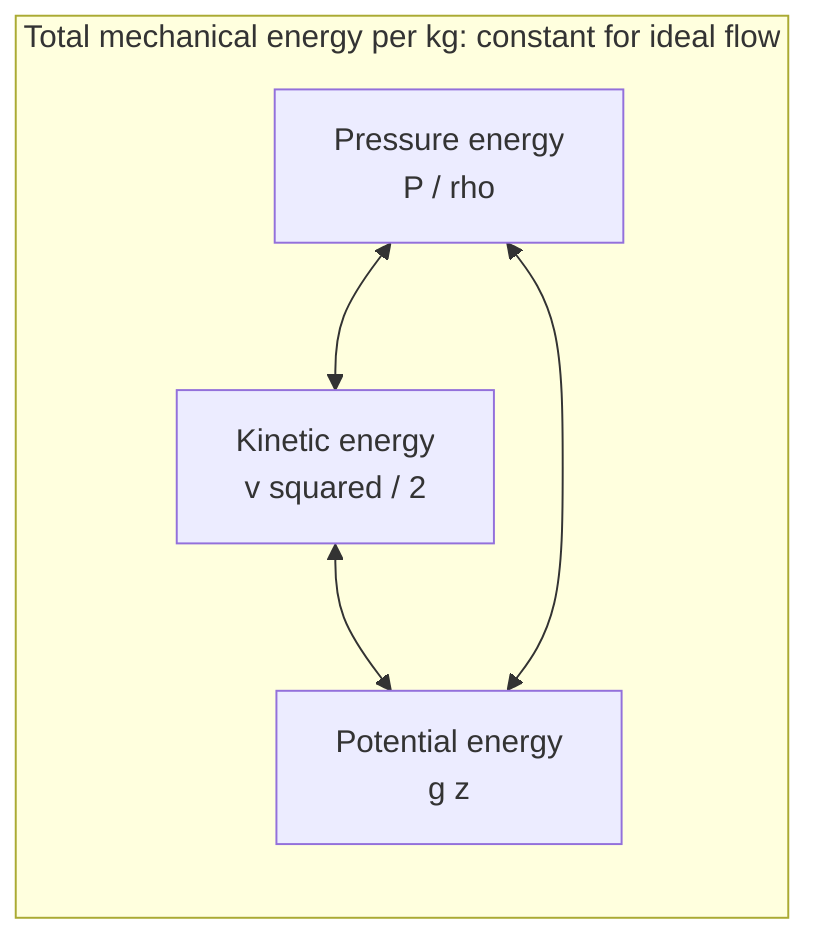
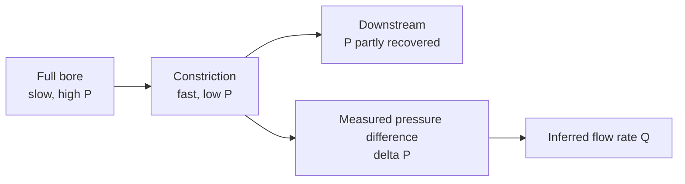

## Video Lecture

<div class="video-container">
  <iframe
    width="560"
    height="315"
    src="https://www.youtube.com/embed/lfGMREF-V-c?start=765"
    title="Chemical Engineering Fluid Mechanics Ch.2: Bernoulli and the Mechanical Energy Balance"
    frameborder="0"
    allow="accelerometer; autoplay; clipboard-write; encrypted-media; gyroscope; picture-in-picture"
    allowfullscreen>
  </iframe>
</div>

> This video covers the same content as the text below. Choose your preferred learning format.

---

# Chapter 2: Bernoulli and the Mechanical Energy Balance

Chapter 1 left the fluid standing still. This chapter sets it moving and follows its energy: how pressure, speed, and elevation trade against one another, how that trade becomes a flow measurement, and what friction takes away permanently.

**Where the Energy of a Flow Goes**

## Learning Objectives

By completing this chapter, you will be able to:

  * ✅ Write Bernoulli's equation as an energy balance per kilogram and state the assumptions behind it
  * ✅ Explain the three-way trade among pressure energy, kinetic energy, and elevation
  * ✅ Derive and apply Torricelli's result $v = \sqrt{2gh}$ to a draining tank, and say why the real jet is slower
  * ✅ Explain how venturi meters, orifice plates, and pitot tubes turn a pressure difference into a flow rate
  * ✅ Extend Bernoulli into the mechanical energy balance with friction loss and pump work
  * ✅ Recognize the conditions that cause cavitation and why they constrain pump suction piping

**Reading Time**: 20-25 minutes **Code Examples**: 1 **Exercises**: 3

* * *

## 2.1 An Energy Balance for Moving Fluid

The *Chemical Engineering Thermodynamics* series opened with the First Law for a flowing stream, $\Delta H = Q - W_s$ ([Thermodynamics Chapter 1](../chemical-engineering-thermodynamics/chapter-1.html)), and deliberately dropped the kinetic- and potential-energy terms as negligible. In fluid mechanics those are exactly the terms we care about, and the thermal ones are what we set aside. Take a fluid of constant density with no heat exchange, no shaft work, and — for now — no friction, and what remains is a balance of **mechanical** energy alone. Per kilogram of fluid, three quantities can hold it:

$$ \frac{P}{\rho} + \frac{v^2}{2} + gz = \text{constant} $$

This is **Bernoulli's equation**. Every term has units of J/kg, and that shared currency is the whole point: the three forms are interconvertible, and a flow moves energy freely among them.

| Term | Name | What it represents | Value for water at a typical condition |
|---|---|---|---|
| $P/\rho$ | **Pressure energy** (flow work) | Energy carried by the fluid because it is pressurized | 1 bar → $10^5/998 = 100$ J/kg |
| $v^2/2$ | **Kinetic energy** | Energy of motion | 2 m/s → 2.0 J/kg |
| $gz$ | **Potential energy** | Energy of elevation above a chosen datum | 10 m → 98.1 J/kg |

Read the right-hand column carefully, because it sets intuition for the rest of the series. At ordinary pipe velocities of 1–3 m/s the kinetic term is **tiny** — a couple of joules per kilogram, about 0.02 bar. Elevation is far larger: 10 m of water is worth roughly 1 bar. Pressure dominates a pumped system, and kinetic energy becomes interesting only where the fluid is deliberately accelerated — which is precisely what a nozzle, an orifice, or a leaking flange does.

Because the sum is constant along a streamline, **any gain in one term is paid for out of the others**. Speed a fluid up and its pressure falls; raise it and, at constant speed, its pressure falls by $\rho g z$. Nothing is created; the accounting simply moves.



The assumptions are strict and worth stating aloud, because every real application violates at least one: **steady flow, constant density, no friction, no shaft work, along a single streamline.** Bernoulli is therefore a reasoning tool and a first estimate, not a design equation. Section 2.4 repairs it.

## 2.2 Torricelli and Tank Draining

The classic application is a vented tank with a hole in its side — a situation every plant contains, as a drain, a nozzle, or a leak.

Apply Bernoulli between the free liquid surface (point 1) and the jet leaving the hole (point 2). Both are open to atmosphere, so the pressure terms cancel; the tank is wide compared with the hole, so the surface descends slowly and $v_1 \approx 0$. Taking the hole as the datum, $z_1 = h$ and $z_2 = 0$:

$$ gh = \frac{v^2}{2} \qquad \Longrightarrow \qquad v = \sqrt{2gh} $$

This is **Torricelli's result**. For a liquid level $h = 5$ m above the hole:

$$ v = \sqrt{2 \times 9.81 \times 5} = \sqrt{98.1} = 9.9\ \text{m/s} $$

This is identical to the speed of an object dropped from the same height, and for the same reason — potential energy converting to kinetic energy with nothing taken out along the way. Note also what is *absent*: density. Ideal draining is equally fast for water, kerosene, and mercury.

Reality is slower on two counts. **Friction** at the hole edge and within the fluid dissipates some energy. And the streamlines cannot turn a sharp corner instantly, so the jet keeps contracting after it leaves the wall, reaching its narrowest cross-section — the **vena contracta** — a short distance downstream, thinner than the hole it came from.

Both effects are lumped into a **discharge coefficient** $C_d$, an empirical multiplier (dimensionless, always less than 1) converting the ideal prediction into the observed flow:

$$ Q = C_d\, A \sqrt{2gh} $$

For a sharp-edged orifice in a thin plate, $C_d$ is **typically about 0.6–0.65**. So a 25 mm drain hole 5 m below the surface has an ideal flow of $4.909 \times 10^{-4} \times 9.9 = 4.86 \times 10^{-3}$ m³/s, or 17.5 m³/h — but delivers closer to **10.9 m³/h** at $C_d = 0.62$. A rounded, gently tapered nozzle avoids the contraction almost entirely and runs at $C_d$ above 0.95. The shape of a hole matters more than its size.

## 2.3 Flow Measurement by Pressure Difference

Bernoulli earns its keep in instrumentation. Squeeze a pipe and **continuity** ($A_1 v_1 = A_2 v_2$ for constant density) forces the fluid to speed up through the smaller area. Bernoulli then says the pressure must drop to pay for it. Measure that drop and you have inferred the flow rate without ever putting a moving part in the stream.



Combining the two relations for a constriction of area $A_2$ gives the working equation used by every differential-pressure flow meter:

$$ Q = C_d\, A_2 \sqrt{\frac{2\,\Delta P}{\rho}} $$

As written, this form drops the **velocity-of-approach factor** $1/\sqrt{1-\beta^4}$, where $\beta$ is the ratio of the constriction bore to the pipe diameter — acceptable when the bore is much smaller than the pipe, which the worked example below assumes, but a correction that a real meter calculation carries explicitly.

| Device | How it works | Permanent pressure loss | Cost and use |
|---|---|---|---|
| **Orifice plate** | A drilled plate clamped between flanges | High — **typically 50–80%** of the measured $\Delta P$ | Cheap, easy to replace, by far the most common |
| **Venturi** | A gradual convergence, throat, and long gentle diffuser | Low — **typically 10–20%** | Expensive and bulky; used where pumping cost or available head matters |
| **Pitot tube** | A small tube facing into the flow | Negligible | Measures *local* velocity at one point, not total flow |

The orifice-versus-venturi choice is a capital-versus-operating trade-off in miniature. Both convert pressure into velocity at the constriction; the difference is what happens afterward. The venturi's long tapered outlet lets the flow decelerate smoothly and **recover** most of its pressure. The orifice dumps its jet into a sudden expansion, where the fluid churns and most of that pressure never comes back — a loss the pump pays for continuously, for the life of the plant.

A **pitot tube** applies the same principle in reverse: facing the oncoming stream, it brings the fluid at its tip to rest, and the difference between that stagnation pressure and the undisturbed static pressure is $\rho v^2/2$, giving $v = \sqrt{2\Delta P/\rho}$ directly.

These devices are what make [Introduction Chapter 3](../chemical-engineering-introduction/chapter-3.html)'s flow control loops physically possible: a flow controller needs a measurement before it can act, and in most plants that measurement is an orifice plate with a differential-pressure transmitter across it.

```python
import math

RHO = 998.0        # kg/m3, water at ~20 C
CD = 0.62          # discharge coefficient, typical sharp-edged orifice plate
D_ORIFICE = 0.050  # m, orifice bore

A = math.pi * D_ORIFICE**2 / 4.0   # m2

print(f"orifice bore = {D_ORIFICE*1000:.0f} mm, area = {A*1e4:.2f} cm2, Cd = {CD}")
print(f"{'dP [kPa]':>9} {'dP [mbar]':>10} {'v_th [m/s]':>11} {'Q [m3/h]':>9} {'mdot [kg/s]':>12}")
for dp_kpa in [1, 2, 5, 10, 20, 50, 100]:
    dp = dp_kpa * 1000.0                 # Pa
    v_th = math.sqrt(2 * dp / RHO)       # m/s, ideal throat velocity
    q = CD * A * v_th                    # m3/s
    print(f"{dp_kpa:9.0f} {dp_kpa*10:10.0f} {v_th:11.2f} {q*3600:9.2f} {q*RHO:12.2f}")

# orifice bore = 50 mm, area = 19.63 cm2, Cd = 0.62
#  dP [kPa]  dP [mbar]  v_th [m/s]  Q [m3/h]  mdot [kg/s]
#         1         10        1.42      6.20         1.72
#         2         20        2.00      8.77         2.43
#         5         50        3.17     13.87         3.85
#        10        100        4.48     19.62         5.44
#        20        200        6.33     27.75         7.69
#        50        500       10.01     43.87        12.16
#       100       1000       14.16     62.04        17.20
```

The table exposes the characteristic weakness of every differential-pressure meter: **the relationship is square-root, not linear.** Quadrupling $\Delta P$ from 5 to 20 kPa only doubles the flow, from 13.87 to 27.75 m³/h. Near the bottom of the range a large fractional error in $\Delta P$ becomes a large error in $Q$, which is why an orifice meter is normally trusted over a **turndown** — the usable ratio of maximum to minimum flow — of only about 3:1 to 4:1. Operate a plant far below design rate and its flow measurements quietly become unreliable.

## 2.4 The Real Fluid: Friction Enters

Bernoulli's frictionless fluid does not exist. Real flow rubs against pipe walls and against itself, and that rubbing removes mechanical energy from the balance. Adding a loss term $h_f$ and the work $w_{\text{pump}}$ supplied by a pump gives the **mechanical energy balance**, the equation the rest of this series is built on:

$$ \frac{P_1}{\rho} + \frac{v_1^2}{2} + gz_1 + w_{\text{pump}} = \frac{P_2}{\rho} + \frac{v_2^2}{2} + gz_2 + h_f $$

All terms are J/kg. Two asymmetries deserve attention. **$w_{\text{pump}}$ appears only on the left** — a pump adds mechanical energy, and it is the only thing in the equation that can. **$h_f$ appears only on the right and is always positive**, never negative, no matter which way the fluid goes. Reverse the flow direction and friction still takes its cut.

That one-sidedness is the Second Law showing up in a pipe. The energy removed by friction is not destroyed: it reappears as **internal energy**, warming the fluid by a fraction of a degree, and the First Law is satisfied exactly. But the conversion runs one way only — warm water does not spontaneously reorganize itself into pressure — so friction converts mechanical energy into internal energy: the Second Law at work. [Thermodynamics Chapter 2](../chemical-engineering-thermodynamics/chapter-2.html) calls this destroyed work potential, and every real flow generates entropy. Friction degrades energy *quality* while conserving its quantity.

Practically, $h_f$ sizes the pump and sets the electricity bill. Everything else in the balance is fixed by the job — the tank is where it is, the pressure is what the process needs. Only $h_f$ follows from design choices: pipe diameter, length, fittings, and roughness. **[Chapter 4](chapter-4.html) is devoted entirely to computing it**, and [Chapter 5](chapter-5.html) to paying for it.

## 2.5 Cavitation Preview

The mechanical energy balance also warns of a specific failure. Follow the pressure along a line into a pump suction: elevation losses, friction, and acceleration into the pipe all subtract from it. If the local pressure anywhere falls to the liquid's **vapor pressure** $P_{sat}$ — the pressure at which it boils at the prevailing temperature, from [Thermodynamics Chapter 3](../chemical-engineering-thermodynamics/chapter-3.html) — the liquid vaporizes *in place*. Vapor bubbles form, are swept into the higher-pressure region of the impeller, and collapse violently.

That collapse is **cavitation**. It sounds like gravel in the casing, erodes impeller metal, wrecks bearings and seals, and destroys the pump's delivered head — a leading cause of pump failure in plants.

Two design rules follow directly from the balance, and both concern the **suction** side:

- **Short**: less pipe length means less $h_f$ subtracted before the fluid reaches the impeller.
- **Fat**: a larger diameter means lower velocity, which cuts both the friction loss and the $v^2/2$ drawn out of the pressure term.

Hence the piping convention that suction lines are one size larger than discharge lines. Temperature makes the margin narrower still: water at 25 °C boils at about 3.2 kPa absolute, leaving nearly a full atmosphere of headroom, but at 80 °C its vapor pressure is roughly 47 kPa, so an open vessel at atmospheric pressure leaves under 6 m of water head to spend before the liquid flashes. Hot liquids are almost always fed to pumps from an elevated vessel. [Chapter 5](chapter-5.html) makes this quantitative as **NPSH**, net positive suction head.

## 2.6 Chapter Summary

- **Bernoulli's equation**, $P/\rho + v^2/2 + gz = \text{constant}$ (J/kg), balances mechanical energy per kilogram of ideal flow; the three terms are interconvertible, so a gain in one is paid for by the others
- Magnitudes set intuition: 1 bar ≈ 100 J/kg and 10 m of elevation ≈ 98 J/kg, but 2 m/s ≈ only 2 J/kg — **kinetic energy matters only where the fluid is deliberately accelerated**
- The assumptions — steady, incompressible, frictionless, no shaft work, along a streamline — make Bernoulli a reasoning tool, not a design equation
- **Torricelli**: a tank draining under 5 m of head gives $v = \sqrt{2 \times 9.81 \times 5} = 9.9$ m/s, independent of density; the real jet is slower through friction and the **vena contracta**, lumped into a **discharge coefficient** of typically **0.6–0.65** for a sharp orifice
- Constriction plus continuity plus Bernoulli gives $Q = C_d A \sqrt{2\Delta P/\rho}$ — the basis of **orifice plates** (cheap, 50–80% permanent loss), **venturis** (expensive, 10–20%), and **pitot tubes** (local velocity); the square-root form limits such meters to roughly **3:1 to 4:1 turndown**
- The **mechanical energy balance** adds reality: $P_1/\rho + v_1^2/2 + gz_1 + w_{\text{pump}} = P_2/\rho + v_2^2/2 + gz_2 + h_f$, where $h_f$ is always positive because friction degrades mechanical energy into internal energy — the Second Law's lost work, in a pipe
- **Cavitation** occurs when local pressure falls to the vapor pressure; suction lines are kept **short and fat**, and hot liquids leave far less margin

**Next chapter**: $h_f$ cannot be computed until we know how the fluid is actually moving. **[Chapter 3](chapter-3.html)** introduces laminar and turbulent flow and the **Reynolds number** that tells them apart — the single dimensionless group that decides whether friction follows a clean formula or an empirical chart.

## Exercises

1. **Conceptual — where the pressure went**: A horizontal pipe narrows from 100 mm to 50 mm bore and then widens back to 100 mm. Water flows steadily through it. (a) What happens to the velocity in the narrow section, and by what factor? (b) What happens to the pressure there, and why does that not violate conservation of energy? (c) Downstream of the expansion, is the pressure back to its original value?
   *Hint*: apply continuity first, then Bernoulli; then ask what Section 2.4 adds to Bernoulli.
   *Answer*: (a) Continuity gives $A_1 v_1 = A_2 v_2$, and halving the diameter quarters the area, so the velocity rises by a factor of **4**. (b) The pressure **falls**. Nothing is violated — Bernoulli says the kinetic term $v^2/2$ grew, and it was paid for out of the pressure term $P/\rho$. Energy is conserved; only its form changed. (c) **Not quite.** Ideal Bernoulli predicts full recovery, but the real expansion is a churning, dissipative process that contributes to $h_f$. A gentle venturi diffuser recovers most of the pressure (10–20% permanently lost); an abrupt orifice-type expansion loses 50–80%. The difference between the two is entirely the shape of the outlet.

2. **Quantitative — the water tower**: A water tower holds its free surface **20 m** above a tap at ground level. Take $\rho = 998$ kg/m³ and $g = 9.81$ m/s², and ignore friction. (a) What is the gauge pressure at the closed tap? (b) If the tap is opened to atmosphere, what is the ideal jet speed? (c) Compare the elevation and kinetic energies per kilogram at each condition.
   *Hint*: with the tap closed the fluid is static, so use Chapter 1's hydrostatic result; with it open, all the elevation energy converts to kinetic energy.
   *Answer*: (a) $P = \rho g h = 998 \times 9.81 \times 20 = 195{,}808$ Pa ≈ **1.96 bar gauge**. (b) $v = \sqrt{2gh} = \sqrt{2 \times 9.81 \times 20} = \sqrt{392.4} = $ **19.8 m/s**. (c) The elevation term is $gz = 9.81 \times 20 = 196.2$ J/kg in both cases. Closed tap: it appears entirely as pressure energy, $P/\rho = 195{,}808/998 = 196.2$ J/kg, with zero kinetic energy. Open tap: it appears entirely as kinetic energy, $v^2/2 = 19.8^2/2 = 196$ J/kg, at zero gauge pressure. **Same 196 J/kg, two different forms** — which is Bernoulli's entire message. In a real tap, friction in the pipework would consume part of it and the jet would be noticeably slower.

3. **Discussion — specifying a flow meter**: You must meter a 200 m³/h cooling-water line that runs 24 hours a day. A colleague proposes an orifice plate because it costs a fraction of a venturi, and notes the plant will sometimes run at 25% of design rate. (a) What is the hidden cost of the orifice? (b) What is wrong with metering at 25% rate? (c) Under what circumstances would you accept the orifice anyway?
   *Hint*: consider the permanent pressure loss as a continuous pumping load, and revisit the square-root behavior in Section 2.3.
   *Answer*: (a) The orifice permanently destroys **50–80%** of its measured $\Delta P$, against 10–20% for a venturi. That loss becomes an extra $h_f$ term in the mechanical energy balance, which the pump must supply for every hour of the plant's life — capital saved once, electricity paid forever. (b) At 25% of design flow the differential is only about **1/16** of its design value, since $Q \propto \sqrt{\Delta P}$. That is outside the roughly 3:1 to 4:1 turndown an orifice is trusted over, and the measurement becomes unreliable exactly when operators most need to know what the plant is doing. (c) The orifice is the right choice when the line has **generous available head** (a gravity feed or an oversized pump makes the permanent loss free in practice), when the flow stays near design rate, or when the measurement feeds a control loop that only needs to hold a setpoint rather than report an accurate absolute rate. If wide turndown genuinely matters, neither device is ideal — a magnetic or Coriolis meter, with no pressure loss and a linear response, is the honest answer.
