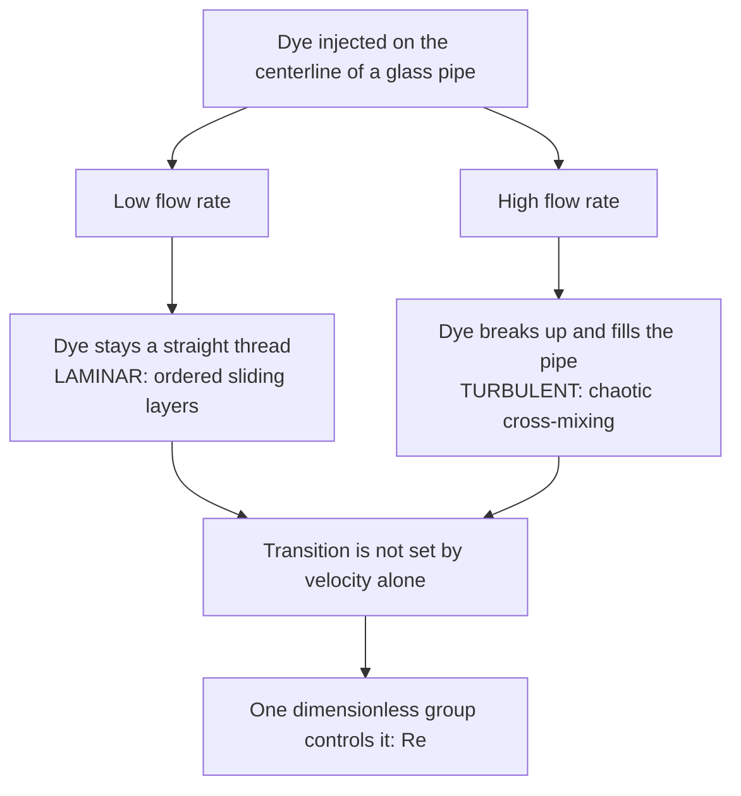

## Video Lecture

<div class="video-container">
  <iframe
    width="560"
    height="315"
    src="https://www.youtube.com/embed/lfGMREF-V-c?start=1495"
    title="Chemical Engineering Fluid Mechanics Ch.3: Laminar, Turbulent, and the Reynolds Number"
    frameborder="0"
    allow="accelerometer; autoplay; clipboard-write; encrypted-media; gyroscope; picture-in-picture"
    allowfullscreen>
  </iframe>
</div>

> This video covers the same content as the text below. Choose your preferred learning format.

---

# Chapter 3: Laminar, Turbulent, and the Reynolds Number

Chapter 2 balanced mechanical energy along a streamline and left one term deliberately vague: the friction loss. Before that loss can be given a number, the flow must be classified — and the classification rests on a single dimensionless group.

**Two Regimes, One Dimensionless Group**

## Learning Objectives

By completing this chapter, you will be able to:

  * ✅ Explain what Reynolds' 1883 dye experiment revealed
  * ✅ Compute $Re = \rho v D/\mu$ and show it is dimensionless
  * ✅ Classify pipe flow as laminar, transitional, or turbulent
  * ✅ Apply Hagen–Poiseuille and the parabolic laminar profile
  * ✅ Derive the $D^{-4}$ pressure-drop scaling at fixed flow rate
  * ✅ Say why industry runs turbulent, and name the laminar niches
  * ✅ Generalize $Re$ to tanks, packed beds, and particles

**Reading Time**: 20-25 minutes **Code Examples**: 1 **Exercises**: 3

* * *

## 3.1 Reynolds' Experiment

In 1883 Osborne Reynolds ran water from a tank through a straight glass pipe and injected a fine jet of dye on the centerline. At low flow rates the dye drew a **straight, sharp thread** the whole length of the pipe: the water was moving in orderly layers that slid past one another without exchanging material sideways.

Opening the valve further changed nothing — until, quite abruptly, it changed everything. Past a certain flow rate the thread wavered, broke up, and **dispersed across the whole cross-section within a few pipe diameters**. He had not blurred one regime into the other; he had crossed a threshold between two qualitatively different states of motion.



The decisive result came next. He repeated the experiment with different diameters, different temperatures — which change the viscosity — and different liquids, and the velocity at which the thread broke up moved around wildly. Yet when those four variables were combined into a **single dimensionless group**, transition always occurred near the same value of it. That number now carries his name.

## 3.2 The Reynolds Number

$$ Re = \frac{\rho v D}{\mu} $$

where $\rho$ is density (kg/m³), $v$ the average velocity (m/s), $D$ the pipe inside diameter (m), and $\mu$ the dynamic viscosity (Pa·s). The group is a **ratio of inertial to viscous forces**: the numerator measures the fluid's tendency to keep doing what it is doing, the denominator its ability to damp a disturbance by internal friction. When viscosity wins, perturbations die and the layers stay ordered; when inertia wins, a perturbation feeds on the flow's own momentum, grows, and order collapses.

Checking once that $Re$ is genuinely **dimensionless** is worthwhile, since that is what lets one threshold serve both a laboratory tube and a refinery line. Using Pa·s = kg/(m·s):

$$ [Re] = \frac{(\text{kg/m}^3)(\text{m/s})(\text{m})}{\text{kg/(m}\cdot\text{s)}} = \frac{\text{kg/(m}\cdot\text{s)}}{\text{kg/(m}\cdot\text{s)}} = 1 $$

For **flow inside a circular pipe**, the standard textbook guideline is:

| $Re$ range | Regime | Character |
|---|---|---|
| Below about **2,100** | **Laminar** | Ordered layers, dye thread intact |
| About **2,100 – 4,000** | **Transitional** | Intermittent, unpredictable, avoided in design |
| Above about **4,000** | **Turbulent** | Fully chaotic, strong cross-mixing |

These are engineering guidelines, not physical constants — the lower value is quoted variously as 2,100 or 2,300, and laminar flow has been sustained far past it in exceptionally smooth, vibration-free rigs. Designers avoid sizing lines into the transitional band, where flow can flicker between regimes.

**Worked example 1 — water**, $\rho = 998$ kg/m³, $\mu = 0.001$ Pa·s, $v = 2$ m/s, $D = 0.05$ m:

$$ Re = \frac{998 \times 2 \times 0.05}{0.001} = 99{,}800 \approx 1.0 \times 10^5 $$

Turbulent, 25 times above the threshold — the industrial norm. Water-like fluids at ordinary velocities in ordinary pipes are turbulent, and making them otherwise takes deliberate effort.

**Worked example 2 — a viscous oil**, $\rho = 900$ kg/m³, $\mu = 0.1$ Pa·s (a hundred times water), $v = 0.5$ m/s, $D = 0.05$ m:

$$ Re = \frac{900 \times 0.5 \times 0.05}{0.1} = 225 $$

Laminar, and not marginally so. Heavy oils, syrups, polymer melts, and concentrated slurries live here permanently.

```python
def reynolds(rho, v, D, mu):
    """Re = rho*v*D/mu  [kg/m3 * m/s * m / (Pa s)] -> dimensionless"""
    return rho * v * D / mu

def regime(Re):
    if Re < 2100:
        return "laminar"
    if Re < 4000:
        return "transitional"
    return "turbulent"

# (name, density kg/m3, viscosity Pa s) at roughly 20-25 C
FLUIDS = [
    ("water",        998.0, 0.001),
    ("air",            1.2, 1.8e-5),
    ("light oil",    900.0, 0.05),
    ("heavy oil",    900.0, 0.10),
    ("glycerol",    1260.0, 1.0),
]

CASES = [(0.5, 0.05), (2.0, 0.05), (2.0, 0.10)]  # (velocity m/s, diameter m)

hdr = f"{'fluid':>10} {'v [m/s]':>8} {'D [m]':>6} {'Re':>12}  regime"
print(hdr)
print("-" * len(hdr))
for name, rho, mu in FLUIDS:
    for v, D in CASES:
        Re = reynolds(rho, v, D, mu)
        print(f"{name:>10} {v:8.1f} {D:6.2f} {Re:12,.0f}  {regime(Re)}")

#      fluid  v [m/s]  D [m]           Re  regime
# -----------------------------------------------
#      water      0.5   0.05       24,950  turbulent
#      water      2.0   0.05       99,800  turbulent
#      water      2.0   0.10      199,600  turbulent
#        air      0.5   0.05        1,667  laminar
#        air      2.0   0.05        6,667  turbulent
#        air      2.0   0.10       13,333  turbulent
#  light oil      0.5   0.05          450  laminar
#  light oil      2.0   0.05        1,800  laminar
#  light oil      2.0   0.10        3,600  transitional
#  heavy oil      0.5   0.05          225  laminar
#  heavy oil      2.0   0.05          900  laminar
#  heavy oil      2.0   0.10        1,800  laminar
#   glycerol      0.5   0.05           32  laminar
#   glycerol      2.0   0.05          126  laminar
#   glycerol      2.0   0.10          252  laminar
```

Water is turbulent in every row, even at a leisurely 0.5 m/s. Air is turbulent in most rows *despite* a kinematic viscosity about 15 times water's ($\nu_{\text{air}} \approx 1.5 \times 10^{-5}$ m²/s against $1.0 \times 10^{-6}$ m²/s), because air is about 832 times less dense but only about 56 times less viscous — **the ratio $\mu/\rho$, the kinematic viscosity, is what really decides**, and air's is the larger. That larger $\nu$ is exactly why air, alone in the table above, drops into the laminar row at 0.5 m/s. And light oil lands in the transitional band at the larger diameter: exactly what a designer avoids.

## 3.3 Life in Laminar Flow

Here the fluid moves as concentric cylindrical shells sliding over one another, molecules crossing between shells only by slow diffusion. The wall holds its adjacent layer at zero velocity (the **no-slip condition**), each layer drags on the next through viscosity, and the result is a **parabolic velocity profile**: zero at the wall, maximum on the axis. For a circular pipe the centerline velocity is exactly **twice the average** — stated here without derivation. Centerline fluid therefore reaches the outlet in half the average time while fluid near the wall crawls, giving a laminar tubular reactor a wide spread of residence times.

The pressure drop sustaining laminar pipe flow is the **Hagen–Poiseuille equation**:

$$ \Delta P = \frac{32\,\mu\,L\,v}{D^2} $$

with $L$ the pipe length. Note what is absent: density, and roughness. Laminar friction is pure viscous shear. **The equation is valid in the laminar regime only** — applying it to turbulent flow is a common error, and it under-predicts badly.

### Why Small Pipes Are Brutally Expensive

The $D^2$ looks like a modest penalty for narrowing a pipe, but it understates the truth, because the real comparison is at **fixed volumetric flow rate** $Q$, not fixed velocity. The same $Q$ through a smaller pipe means faster fluid:

$$ v = \frac{Q}{A} = \frac{4Q}{\pi D^2} \quad \Rightarrow \quad v \propto D^{-2} $$

Substituting, the two effects compound:

$$ \Delta P = \frac{32\mu L}{D^2}\cdot\frac{4Q}{\pi D^2} = \frac{128\,\mu\,L\,Q}{\pi\,D^4} \quad \Rightarrow \quad \Delta P \propto \frac{Q}{D^4} $$

**Halving the diameter at fixed flow rate multiplies velocity by 4 and pressure drop by $2^4 = 16$**; cutting it to one third multiplies $\Delta P$ by 81. Pumping power is $\Delta P \times Q$, so operating cost follows the same fourth power. Keep the basis straight: at fixed *velocity* the formula gives only $D^{-2}$, a factor of 4 — quoting that instead of 16 is the mistake to avoid, and it comes from forgetting that a narrower pipe also runs faster.

This fourth-power law is why capital-versus-operating trade-offs in piping are so lopsided, why fouling that halves a tube's bore is a catastrophe rather than a nuisance, and — outside the plant — why arterial narrowing is so dangerous.

## 3.4 Life in Turbulent Flow

Turbulent flow contains **eddies**: swirling fluid parcels across a wide range of sizes, the large ones drawing energy from the mean flow and breaking into smaller ones until viscosity dissipates it as heat. At any fixed point the velocity fluctuates continuously about a mean. Eddies transport momentum across the pipe far more effectively than molecular viscosity can, so the mean profile is **flattened**: nearly uniform across the core, the whole velocity change compressed into a thin layer near the wall. The centerline exceeds the average by only about 20% ($v_{max}/v_{avg} \approx 1.2$), against the factor of 2 in laminar flow.

| | **Laminar** | **Turbulent** |
|---|---|---|
| **Pipe $Re$** | Below ~2,100 | Above ~4,000 |
| **Motion** | Ordered sliding layers | Eddies across many scales |
| **Profile** | Parabolic, $v_{max} = 2 v_{avg}$ | Flat core, $v_{max} \approx 1.2\,v_{avg}$ |
| **Radial mixing** | Molecular diffusion only | Vigorous eddy transport |
| **Wall roughness** | Irrelevant | Strongly relevant |
| **Friction** | $\Delta P \propto v$ | $\Delta P$ roughly $\propto v^{1.8-2}$ |

Industry mostly runs turbulent by choice. **Mixing** needs cross-stream transport, and laminar flow has essentially none. **Heat transfer** at a wall depends on how fast wall fluid is swept into the bulk, and eddies do this orders of magnitude faster than conduction — which is why heat-transfer coefficients jump on crossing the transition (the subject of our [Chemical Engineering Heat Transfer](../chemical-engineering-heat-transfer/index.html) series). **Mass transfer** — dissolution, absorption, extraction — obeys the same logic in [Chemical Engineering Mass Transfer and Separation](../chemical-engineering-mass-transfer/index.html). Turbulence is what makes process equipment compact. The price is friction: turbulent pressure drop rises roughly with the square of velocity rather than linearly, so the pumping bill grows faster than throughput. Chapter 4 puts a number on it.

Laminar flow keeps genuine niches. **Microfluidics** runs at $Re$ of order 1 or below, where two streams flow side by side in a channel and mix only by diffusion — a nuisance to engineer around, or a feature to exploit in a diffusion-based assay. **Highly viscous fluids** — polymer melts, greases, food pastes — cannot reach turbulence at any practical velocity, so they must be moved laminarly and mixed mechanically. **Laminar-flow reactors** and coating operations use the ordered profile deliberately.

## 3.5 Beyond Pipes

Nothing in the reasoning behind $Re$ is specific to a pipe. The group compares inertia with viscosity, and forming it needs only a **characteristic length** and velocity appropriate to the geometry. What does *not* transfer is the numerical threshold, because "the" length is defined differently in each case.

| Geometry | Reynolds number | Characteristic length | Rough regime guideline |
|---|---|---|---|
| **Pipe flow** | $\rho v D/\mu$ | Pipe inside diameter $D$ | Laminar < 2,100; turbulent > 4,000 |
| **Stirred tank** | $\rho N D_i^2/\mu$ | Impeller diameter $D_i$ ($N$ = rev/s) | Laminar < ~10; turbulent > ~10,000 |
| **Packed bed** | $\rho v_s d_p/\mu$ | Particle diameter $d_p$ ($v_s$ = superficial velocity: volumetric flow divided by the full cross-section, as if no packing were present) | Viscous-dominated < ~10; inertia-dominated > ~1,000 |
| **Flow past a particle** | $\rho v d_p/\mu$ | Particle diameter $d_p$ | Stokes' law valid below ~0.1–1 |
| **Flat plate boundary layer** | $\rho v x/\mu$ | Distance $x$ from the leading edge | Transition near ~5 × 10⁵ |

The particle row connects back to Chapter 1. Terminal settling velocity came from Stokes' law, and Stokes' law is a **low-Reynolds-number result** — it assumes viscosity so dominant that inertia drops out entirely. Always check the particle $Re$ after computing a settling velocity; above about 1 the answer is invalid and a drag-coefficient correlation is needed. And always state which $Re$ you mean: "Re = 500" describes a firmly laminar pipe flow and a well-mixed turbulent stirred tank at the same time.

## 3.6 Chapter Summary

- Reynolds' 1883 dye experiment showed **two distinct regimes**, not a gradual blur: a straight dye thread (**laminar**) breaking up abruptly into full-pipe dispersion (**turbulent**)
- One dimensionless group sets the transition: $Re = \rho v D/\mu$, the ratio of **inertial to viscous forces**. All units cancel, which is why one threshold serves laboratory and plant alike
- Pipe guideline: **laminar below about 2,100**, **fully turbulent above about 4,000**, transitional between — a band designers avoid
- Water ($998$, $0.001$, 2 m/s, 0.05 m) gives $Re = 99{,}800 \approx 1.0\times10^5$, turbulent and typical; a viscous oil ($900$, $0.1$, 0.5 m/s, 0.05 m) gives $Re = 225$, laminar
- Laminar flow has a **parabolic profile**, $v_{max} = 2v_{avg}$, and obeys **Hagen–Poiseuille** $\Delta P = 32\mu L v/D^2$ — no density, no roughness, laminar regime only
- At **fixed volumetric flow rate** $v \propto D^{-2}$, so $\Delta P = 128\mu L Q/(\pi D^4) \propto D^{-4}$: **halving the diameter multiplies pressure drop by 16**, not by 4
- Turbulence flattens the profile ($v_{max} \approx 1.2 v_{avg}$) and mixes vigorously; industry runs turbulent because **mixing, heat transfer, and mass transfer** all improve, and pays in friction. Laminar niches: microfluidics, viscous polymers, laminar-flow reactors
- $Re$ generalizes through a **characteristic length** — impeller or particle diameter, distance along a plate — but each geometry has its own threshold, so always say which $Re$ you mean

**Next chapter**: knowing a flow is turbulent does not yet say what it costs to push. **Pipe Flow and Pressure Drop** ([Chapter 4](chapter-4.html)) introduces the friction factor, the Moody diagram, and the Darcy–Weisbach equation, turning the regime label into the number Chapter 2's mechanical energy balance was missing.

## Exercises

1. **Conceptual — why one number suffices**: Reynolds' transition velocity moved around when he changed diameter or warmed the water, yet transition always occurred near the same $\rho v D/\mu$. (a) What does warming a liquid do to the transition velocity? (b) A pilot unit uses a 10 mm tube, the full-scale unit a 100 mm pipe, both with water: how must velocity change to match $Re$? (c) Why is dimensionlessness essential here?
   *Hint*: for liquids, viscosity falls as temperature rises; then hold $\rho v D/\mu$ constant while changing $D$.
   *Answer*: (a) Heating **lowers** $\mu$, raising $Re$ at any given velocity, so the critical $Re$ arrives at a **lower** velocity — the transition velocity **falls**. This is exactly why velocity alone cannot characterize the transition. (b) With $\rho$ and $\mu$ fixed, constant $Re$ requires constant $vD$, so a tenfold larger diameter needs a **tenfold lower velocity** (2 m/s becomes 0.2 m/s). (c) A dimensionless group has no built-in scale, so its value carries no memory of whether the rig is millimeters or meters across. "Transition at 0.3 m/s" would hold only for that one pipe, fluid, and temperature.

2. **Quantitative — a glycerol-like fluid**: A fluid with $\rho = 1260$ kg/m³ and $\mu = 1.0$ Pa·s flows at $v = 1$ m/s through a pipe of $D = 0.08$ m. (a) Compute $Re$ and classify the flow. (b) What velocity would reach $Re = 2{,}100$? (c) What does that imply for viscous fluids in process piping? (d) For a 20 m length, find $\Delta P$ at 1 m/s.
   *Hint*: apply $Re = \rho v D/\mu$, then invert for $v$. For (d), confirm the regime before choosing the equation.
   *Answer*: (a) $Re = 1260 \times 1 \times 0.08/1.0 = 100.8 \approx \mathbf{101}$ — **laminar**, over 20 times below the threshold. (b) $v = Re\,\mu/(\rho D) = 2100 \times 1.0/(1260 \times 0.08) = 2100/100.8 = \mathbf{20.8}$ **m/s**. (c) Impractical: liquid lines are designed around 1–3 m/s, and 20.8 m/s would mean enormous pressure drop, erosion, and noise. **Viscous fluids essentially never go turbulent in pipes** — they must be designed as permanently laminar systems, with mixing and heat transfer supplied by something other than turbulence. (d) Laminar, so Hagen–Poiseuille applies: $\Delta P = 32 \times 1.0 \times 20 \times 1/(0.08)^2 = 640/0.0064 = \mathbf{100{,}000}$ **Pa = 1.0 bar** over just 20 m.

3. **Discussion — a proposed pipe change**: To cut capital cost, a colleague proposes replacing a 50 mm laminar oil line with a 25 mm line at the **same volumetric flow rate**, arguing that since $\Delta P = 32\mu L v/D^2$, quartering the area merely quadruples the pressure drop. (a) Identify the error. (b) Give the correct factor. (c) Does the regime change? (d) What happens to pumping power?
   *Hint*: velocity is not the same in the two pipes. Work out $v(D)$ at fixed $Q$ before substituting.
   *Answer*: (a) They held **velocity** constant, but the specification fixes **volumetric flow rate**. At fixed $Q$, $v = 4Q/(\pi D^2) \propto D^{-2}$, so halving $D$ multiplies velocity by **4** — which must be carried into the formula too. (b) Combining both effects, $\Delta P = 128\mu L Q/(\pi D^4) \propto D^{-4}$: halving the diameter multiplies pressure drop by $2^4 = \mathbf{16}$, four times worse than claimed. (c) With $v$ up 4× and $D$ down 2×, $Re$ is **doubled**. From a firmly laminar line it will usually still be laminar, but check: if the new $Re$ lands between 2,100 and 4,000 the line sits in the transitional band and Hagen–Poiseuille no longer applies. (d) Power is $\Delta P \times Q$, so at fixed $Q$ it also rises **16-fold**. The pipe saving is one-time capital; the penalty is on the electricity bill every hour the plant runs, and the existing pump is unlikely to hold 16 times the head in reserve.
