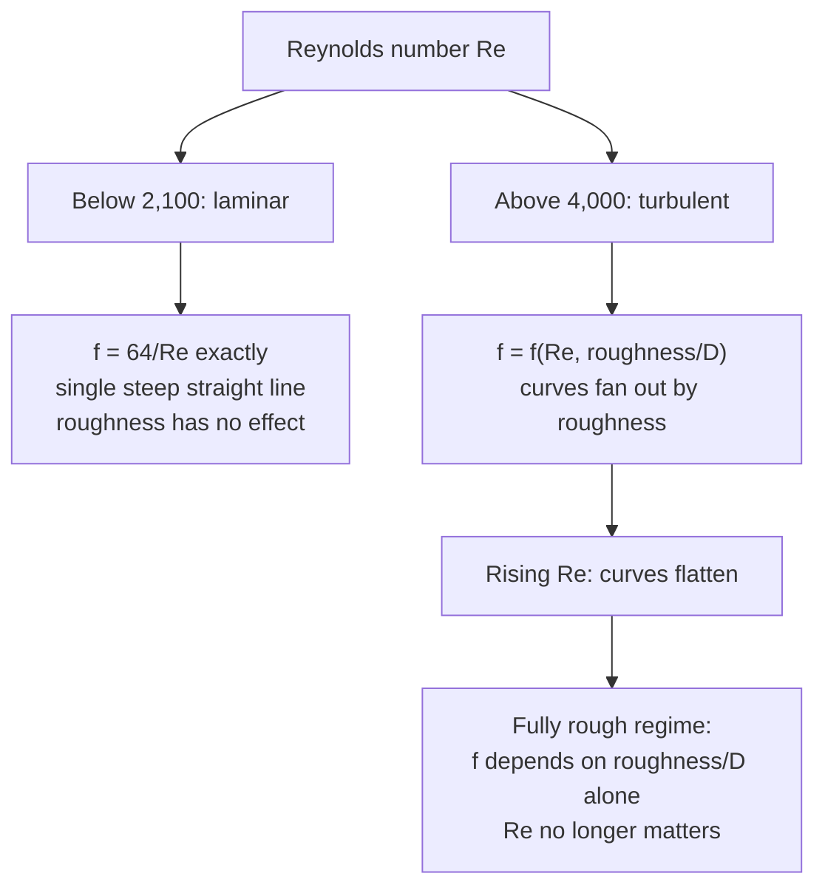

## Video Lecture

<div class="video-container">
  <iframe
    width="560"
    height="315"
    src="https://www.youtube.com/embed/lfGMREF-V-c?start=2266"
    title="Chemical Engineering Fluid Mechanics Ch.4: Pipe Flow and Pressure Drop"
    frameborder="0"
    allow="accelerometer; autoplay; clipboard-write; encrypted-media; gyroscope; picture-in-picture"
    allowfullscreen>
  </iframe>
</div>

> This video covers the same content as the text below. Choose your preferred learning format.

---

# Chapter 4: Pipe Flow and Pressure Drop

This chapter turns the friction term that [Chapter 2](chapter-2.html) left as a symbol into a number. The Darcy–Weisbach equation and the friction factor let you compute what a pipe run costs to pump, and the answer scales so steeply with diameter that it decides the size of nearly every line on a flowsheet.

**The Friction Factor and the Cost of Moving Fluid**

## Learning Objectives

By completing this chapter, you will be able to:

  * ✅ Explain why frictional pressure drop is an operating cost that recurs for the life of the plant
  * ✅ Apply the Darcy–Weisbach equation, and distinguish the Darcy (Moody) friction factor from the Fanning factor
  * ✅ Show that the laminar result $f = 64/Re$ is the Hagen–Poiseuille law in disguise
  * ✅ Read a Moody chart conceptually: the roles of Reynolds number and relative roughness
  * ✅ Compute pressure drop and pumping power for a pipe run, and predict how both scale with diameter
  * ✅ Account for fittings and valves using equivalent-length and $K$-factor methods

**Reading Time**: 20-25 minutes **Code Examples**: 1 **Exercises**: 3

* * *

## 4.1 Pressure Drop is an Operating Cost

The mechanical energy balance of [Chapter 2](chapter-2.html) ended with a term written $h_f$ — the friction loss — and a promise that it would later be computed rather than assumed. That term is not an accounting nuisance. It is a bill.

Friction converts mechanical energy into heat that never comes back. Whatever the fluid loses to the pipe wall, a pump must put back in, and the motor driving that pump draws electricity every hour the plant runs. A line that wastes half a kilowatt costs about 4,400 kWh a year in continuous service — for one line, in a plant that has thousands. The capital cost of a pipe is paid once; its friction is paid forever.

That framing sets up the design question. A larger pipe carries the same flow at a lower velocity, and lower velocity means dramatically less friction — but larger pipe costs more steel, more supports, and more welding. A smaller pipe is cheap to buy and expensive to operate. Somewhere between sits the diameter that minimizes the sum, and finding it requires a quantitative model of friction: the friction factor.

## 4.2 The Darcy Friction Factor

The working equation for frictional pressure drop in a straight run of circular pipe is **Darcy–Weisbach**:

$$ \Delta P = f \, \frac{L}{D} \, \frac{\rho v^2}{2} $$

$h_f = \Delta P/\rho$ expresses the same loss in J/kg (Chapter 2's units), or $\Delta P/(\rho g)$ as head in meters.

where $L$ is the pipe length, $D$ the internal diameter, $\rho$ the fluid density, $v$ the mean velocity, and $f$ the dimensionless **friction factor**. Read the structure before the arithmetic: pressure drop is proportional to length, inversely proportional to diameter, and proportional to the **velocity head** $\rho v^2/2$ — the same kinetic-energy group that ran through Bernoulli's equation. Doubling the velocity quadruples the loss at fixed $f$ — in reality $f$ drifts slightly down with $Re$, giving the $v^{1.8-2}$ behavior noted in [Chapter 3](chapter-3.html).

> ⚠️ **Convention warning — Darcy or Fanning?** Two friction factors are in circulation and they differ by a factor of four: $f_{\text{Darcy}} = 4 f_{\text{Fanning}}$. **This series uses the Darcy (also called Moody) friction factor throughout**, the one for which the laminar result is $f = 64/Re$. Some chemical engineering texts use the Fanning factor, for which the laminar result is $f = 16/Re$ and the equation carries an explicit 4. Mixing them is a classic error that produces a pressure drop wrong by 4×. Always check what a chart, correlation, or piece of software returns — the quickest test is the laminar line: 64 means Darcy, 16 means Fanning.

**In laminar flow**, $f$ is not an empirical quantity at all — it is exact:

$$ f = \frac{64}{Re} $$

This is [Chapter 3](chapter-3.html)'s Hagen–Poiseuille law rewritten. That law gives $\Delta P = 32\mu L v / D^2$; substituting it into Darcy–Weisbach and solving for $f$ gives $f = \frac{32\mu L v}{D^2}\cdot\frac{D}{L}\cdot\frac{2}{\rho v^2} = \frac{64\mu}{\rho v D} = \frac{64}{Re}$. Same physics, two notations — and note that laminar pressure drop is proportional to velocity, not velocity squared, because the $v^2$ in Darcy–Weisbach is canceled by the $1/v$ hidden inside $f$.

**In turbulent flow**, no such derivation exists. The friction factor becomes an experimental correlation in two dimensionless groups: the Reynolds number and the **relative roughness** $\varepsilon/D$ — the height of the wall's surface irregularities divided by the pipe diameter. A 0.05 mm bump matters in a 10 mm tube and is invisible in a 1 m header, which is why the ratio, not the absolute height, governs.

| Pipe material | Absolute roughness $\varepsilon$ |
|---|---|
| **Drawn tubing (copper, glass)** | ≈ 0.0015 mm — effectively smooth |
| **Commercial steel / wrought iron** | **≈ 0.045 mm** — the standard design value |
| **Galvanized iron** | ≈ 0.15 mm |
| **Concrete** | ≈ 0.3–3 mm |

For commercial pipe at the Reynolds numbers typical of process lines ($10^4$ to $10^6$), $f$ commonly lands in the range **0.02 to 0.04** — near the low end for large, smooth, fast lines, higher for small or rough ones. Carrying $f \approx 0.02$ as a mental default for a clean steel line makes order-of-magnitude pressure drops something you can do in your head.

## 4.3 The Moody Chart

The classical way to obtain $f$ is the **Moody chart**: a log–log plot of friction factor against Reynolds number, carrying a family of curves each labeled with a value of relative roughness $\varepsilon/D$. Its shape encodes [Chapter 3](chapter-3.html)'s regimes.



At low Reynolds number the chart shows a **single steep straight line** — all pipes fall on it, because in laminar flow the fluid never feels the wall texture. Past the transition region the curves **fan out by relative roughness** and then **flatten to the right**. In that flat, **fully rough** regime the friction factor has stopped depending on Reynolds number altogether and is set by $\varepsilon/D$ alone, with a practical consequence: for a rough pipe at high flow, pressure drop reverts to being simply proportional to $v^2$.

Nobody in industry reads $f$ off a paper chart anymore. Software evaluates a correlation, and the reference correlation for turbulent flow is **Colebrook's**, which is implicit and must be solved iteratively. Explicit approximations avoid the iteration — the **Swamee–Jain** equation is the most widely used, reproducing Colebrook to within about 1% over the practical range. But the chart remains the mental map: it tells you at a glance whether you are on the laminar line, in the roughness-sensitive middle, or out on the plateau where only $\varepsilon/D$ matters.

## 4.4 Worked Design Example

Take water at $\rho = 998$ kg/m³ flowing at $v = 2$ m/s through a commercial steel line of $D = 0.05$ m over $L = 100$ m. From [Chapter 3](chapter-3.html)'s definition, $Re = \rho v D/\mu \approx 998 \times 2 \times 0.05 / 10^{-3} \approx 1.0 \times 10^5$ — firmly turbulent — and we take the typical value $f = 0.02$ (the Swamee–Jain correlation gives 0.022 here; we round to 0.02 for a clean hand calculation — a ~10% understatement of $\Delta P$).

$$ \Delta P = 0.02 \times \frac{100}{0.05} \times \frac{998 \times 2^2}{2} = 0.02 \times 2000 \times 1996 = 79{,}840\ \text{Pa} \approx 0.80\ \text{bar} $$

Now convert that to money. The volumetric flow is $Q = vA = 2 \times (\pi \times 0.05^2/4) = 2 \times 0.001963 = 0.003927$ m³/s, and the **hydraulic power** — the mechanical power the fluid actually absorbs — is the product of flow rate and the pressure drop being overcome:

$$ P_{\text{hyd}} = Q\,\Delta P = 0.003927 \times 79{,}840 = 313.5\ \text{W} \approx 0.31\ \text{kW} $$

A pump does not deliver that for free. At a typical combined pump-and-motor efficiency of 65%, the electrical draw is $0.313/0.65 \approx 0.48$ kW — roughly 4,200 kWh a year in continuous service, to move water down a pipe.

Now change the diameter while holding the flow rate fixed. At fixed $Q$, velocity scales as $D^{-2}$ (the area goes as $D^2$), so $v^2 \propto D^{-4}$; combined with the explicit $1/D$ in Darcy–Weisbach, this gives

$$ \Delta P \propto \frac{1}{D}\cdot\frac{1}{D^4} = D^{-5} \qquad \text{(fixed } Q,\ \text{fixed } f) $$

and, since $Q$ is fixed, pumping power scales the same way. **Halving the diameter multiplies the pumping power by 32.**

```python
import math

RHO = 998.0     # kg/m3, water at ~20 C
Q   = 0.003927  # m3/s, fixed volumetric flow (= 2 m/s in a 0.05 m pipe)
L   = 100.0     # m, pipe length
F   = 0.02      # Darcy friction factor, held fixed to isolate the D dependence
ETA = 0.65      # pump + motor efficiency, typical

print(f"{'D [m]':>7} {'v [m/s]':>8} {'dP [kPa]':>10} {'P_hyd [kW]':>11} {'P_elec [kW]':>12}")
for D in [0.025, 0.040, 0.050, 0.065, 0.080, 0.100]:
    A  = math.pi * D**2 / 4
    v  = Q / A
    dP = F * (L / D) * (RHO * v**2 / 2)   # Darcy-Weisbach, Pa
    Ph = Q * dP                            # hydraulic power, W
    print(f"{D:7.3f} {v:8.2f} {dP/1e3:10.1f} {Ph/1e3:11.3f} {Ph/ETA/1e3:12.3f}")

# scaling check: dP ratio between 0.05 m and 0.10 m against the D^-5 law
print(f"\nD^-5 law: halving D raises dP by {(0.10/0.05)**5:.0f}x")

#   D [m]  v [m/s]   dP [kPa]  P_hyd [kW]  P_elec [kW]
#   0.025     8.00     2554.9      10.033       15.435
#   0.040     3.13      243.7       0.957        1.472
#   0.050     2.00       79.8       0.314        0.482
#   0.065     1.18       21.5       0.084        0.130
#   0.080     0.78        7.6       0.030        0.046
#   0.100     0.50        2.5       0.010        0.015
#
# D^-5 law: halving D raises dP by 32x
```

Read the extremes of that table. At 25 mm the line demands over 15 kW of electricity; at 100 mm it demands 15 W. The pipe is four times the diameter and perhaps six or eight times the cost per meter, and it has cut the operating cost by a factor of a thousand. That is why the fifth power matters more than almost any other exponent in process engineering — and also why nobody simply specifies the largest available pipe, since capital rises without limit while the absolute power saving eventually becomes negligible.

## 4.5 Fittings, Valves, and Equivalent Length

Real piping bends, branches, expands, contracts, and passes through valves, and every one of those features costs pressure. Two equivalent bookkeeping methods are in use.

The **$K$-factor** (or velocity-head) method assigns each fitting a dimensionless loss coefficient and charges it against the velocity head:

$$ \Delta P_{\text{fitting}} = K \, \frac{\rho v^2}{2} $$

The **equivalent-length** method instead expresses each fitting as the length of straight pipe causing the same loss — an elbow "equal to 30 diameters," say — and adds it to $L$ before applying Darcy–Weisbach once. The two are the same statement rearranged ($L_{\text{eq}}/D = K/f$); the choice is a matter of habit.

| Fitting | Loss | Comment |
|---|---|---|
| **Long-radius elbow** | Small | Gentle turning; a short-radius elbow costs noticeably more |
| **Tee, flow through run** | Small | The straight-through path is nearly free |
| **Tee, flow through branch** | Moderate | Turning the corner is what costs |
| **Gate valve, fully open** | Small | Designed for isolation: open bore, minimal obstruction |
| **Globe valve, fully open** | **Large** | Tortuous internal path — often tens of times a gate valve |
| **Control valve, in service** | **Large by design** | See below |

That last row looks at first like an engineering failure. The control valves of the *Chemical Engineering Introduction* series ([Chapter 3](../chemical-engineering-introduction/chapter-3.html)) end nearly every feedback loop, and they work precisely **by throttling** — by consuming pressure drop. A valve taking almost no drop when open would have almost no ability to change the flow when it moved, because the rest of the circuit would dominate. Control engineers call this **valve authority**, and a common rule of thumb allocates a quarter to a third of the system's dynamic pressure drop to the valve. **Controllability is bought with energy**, permanently — a legitimate purchase, but one that belongs on the same balance sheet as the pipe diameter.

Which returns us to the **economic velocity** heuristic of [Chapter 1](chapter-1.html), roughly 1–3 m/s for liquid lines. That range is not a fluid-mechanical constant; it is the observed location of a cost minimum. Below it you are buying steel you do not need; above it the $D^{-5}$ law takes over and you pay an electricity bill for decades. It is exactly the trade-off that sets the **reflux ratio** in the *Introduction* series ([Chapter 4](../chemical-engineering-introduction/chapter-4.html)): buy the equipment once, or pay the utility every hour for twenty years.

## 4.6 Chapter Summary

- Frictional pressure drop is **an operating cost, not a modeling detail**: a pump replaces the lost energy every hour the plant runs, so pipe capital is paid once and friction is paid forever
- **Darcy–Weisbach**: $\Delta P = f (L/D)(\rho v^2/2)$ — proportional to length, inverse in diameter, proportional to the velocity head. This series uses the **Darcy (Moody)** factor; $f_{\text{Darcy}} = 4 f_{\text{Fanning}}$, and mixing them gives an answer wrong by 4×. Check the laminar line: 64 means Darcy, 16 means Fanning
- **Laminar**: $f = 64/Re$ exactly — algebraically identical to Hagen–Poiseuille, roughness irrelevant. **Turbulent**: $f = f(Re, \varepsilon/D)$, empirical, typically **0.02–0.04** for commercial steel ($\varepsilon \approx 0.045$ mm) at process Reynolds numbers
- The **Moody chart** maps $f$ against $Re$ for families of relative roughness: a steep laminar line, curves fanning out by roughness, then a fully rough plateau where only $\varepsilon/D$ matters. Software now uses **Colebrook** (or the explicit **Swamee–Jain** approximation), but the chart remains the mental map
- Worked case — water, $v = 2$ m/s, $D = 0.05$ m, $L = 100$ m, $f = 0.02$: $\Delta P = $ **79,840 Pa ≈ 0.80 bar**, $Q = 0.003927$ m³/s, hydraulic power **≈ 0.31 kW**, **≈ 0.48 kW** electrical at a typical 65% efficiency
- At **fixed flow rate**, $v \propto D^{-2}$ so $\Delta P \propto D^{-5}$: halving the diameter multiplies pumping power by **32**
- Fittings are charged by **$K$-factor** ($\Delta P = K\rho v^2/2$) or **equivalent length** ($L_{\text{eq}}/D = K/f$); gate valves are cheap open, globe valves expensive, and **control valves are throttled deliberately** because valve authority is bought with pressure drop
- The **economic velocity** of 1–3 m/s marks the capital-versus-power cost minimum — the same trade-off shape as distillation's reflux ratio

**Next chapter**: this chapter computed the bill; **[Chapter 5](chapter-5.html): Pumps and Piping Systems** introduces the machine that pays it — pump curves, the system curve, the operating point where they intersect, and NPSH, the constraint that decides whether a pump works at all or destroys itself by cavitation.

## Exercises

1. **Conceptual — which factor?** A colleague's spreadsheet computes pipe pressure drop and, for a laminar case at $Re = 1000$, reports a friction factor of 0.016. (a) Which convention is the spreadsheet using? (b) If you insert that number into the Darcy–Weisbach equation as written in this chapter, by what factor is your pressure drop wrong, and in which direction? (c) Why does relative roughness not appear anywhere in this laminar calculation?
   *Hint*: evaluate both laminar formulas at $Re = 1000$ before deciding anything.
   *Answer*: (a) $64/1000 = 0.064$ and $16/1000 = 0.016$, so the spreadsheet returns the **Fanning** factor. (b) Darcy–Weisbach as written here expects $f_{\text{Darcy}} = 4f_{\text{Fanning}}$, so using 0.016 directly gives a pressure drop **4× too small** — a dangerous direction, since the pump would be undersized. Either use 0.064 or insert the explicit factor of 4. (c) In laminar flow the fluid moves in ordered layers and the wall irregularities sit inside the viscous region near the wall; there are no turbulent eddies to interact with them. All pipes, smooth or rough, fall on the same laminar line.

2. **Quantitative — the diameter law**: The worked example carried $Q = 0.003927$ m³/s of water ($\rho = 998$ kg/m³) through $D = 0.05$ m, $L = 100$ m at $f = 0.02$, giving $\Delta P = 79{,}840$ Pa. Repeat the calculation for $D = 0.10$ m at the **same volumetric flow** and the same $f$, and check the result against the $D^{-5}$ law.
   *Hint*: get the new velocity from $Q = vA$ first — the area, not the diameter, is what scales the velocity.
   *Answer*: The area quadruples ($A = \pi \times 0.10^2/4 = 0.007854$ m²), so $v = 0.003927/0.007854 = $ **0.5 m/s**. Then $\Delta P = 0.02 \times (100/0.10) \times (998 \times 0.5^2/2) = 0.02 \times 1000 \times 124.75 = $ **2,495 Pa ≈ 0.025 bar**. The ratio is $79{,}840 / 2{,}495 = $ **32.0**, exactly the $2^5 = 32$ predicted by the $D^{-5}$ law. Hydraulic power falls from 313.5 W to $0.003927 \times 2495 = $ **9.8 W**. (In reality the improvement is slightly smaller: doubling $D$ halves $Re$ and halves $\varepsilon/D$, so the true $f$ shifts a little — but the fifth-power scaling dominates any such correction.)

3. **Discussion — sizing a line**: A junior engineer sizing a new cooling-water line proposes the smallest pipe that keeps velocity below the erosion limit, arguing that it minimizes cost. (a) What cost are they minimizing, and what are they ignoring? (b) How does the answer change if the line runs 24 hours a day for twenty years versus a few hours a month? (c) Why does adding a control valve to the line make the pressure-drop budget larger on purpose, and is that waste?
   *Hint*: separate one-time costs from recurring ones, then ask what a controller needs in order to control.
   *Answer*: (a) They are minimizing **capital cost** — pipe, fittings, supports, insulation, installation labor — and ignoring the **operating cost** of pumping, which scales as $D^{-5}$ at fixed flow. A modest diameter increase can cut pumping power by an order of magnitude for a fractional increase in capital, which is why the economic optimum sits near 1–3 m/s rather than at the erosion limit. (b) **Duty cycle changes the optimum.** Continuous service means the power term accumulates for twenty years and pushes toward larger pipe; an intermittent line accrues almost no energy cost, so the optimum moves back toward the smallest pipe that is mechanically and hydraulically acceptable. Sizing rules of thumb assume continuous service. (c) A control valve regulates flow by **throttling** — by consuming pressure drop — so a valve with negligible drop has negligible **authority**: moving it would barely change the flow, because the fixed resistance of the pipe would dominate. Allocating a substantial share of the dynamic pressure drop to the valve is the price of controllability, not waste. It is a real and permanent energy cost, and where control is not needed (or where a variable-speed drive can replace the throttling), it should not be paid.
