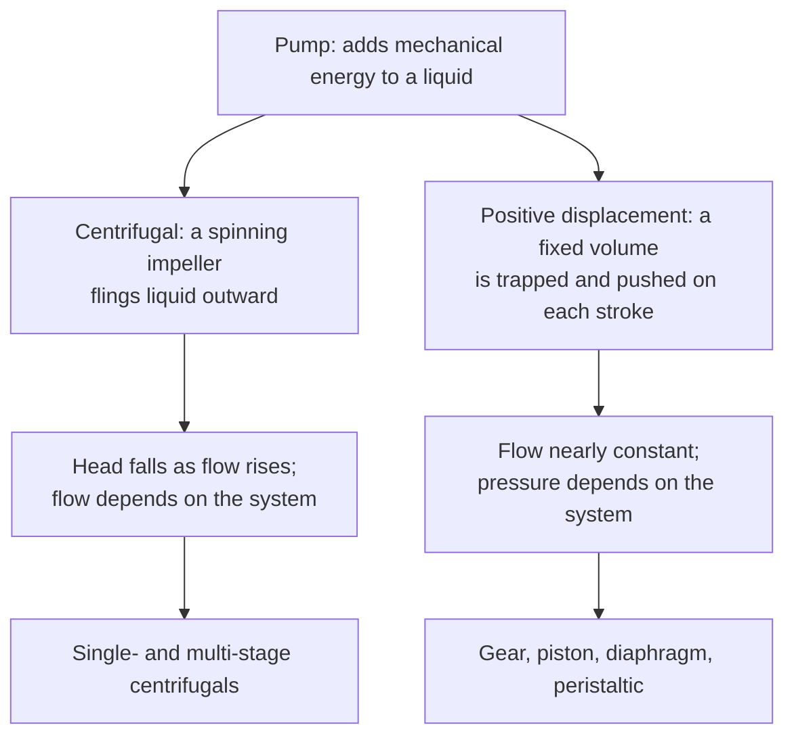

## Video Lecture

<div class="video-container">
  <iframe
    width="560"
    height="315"
    src="https://www.youtube.com/embed/lfGMREF-V-c?start=3065"
    title="Chemical Engineering Fluid Mechanics Ch.5: Pumps and Piping Systems"
    frameborder="0"
    allow="accelerometer; autoplay; clipboard-write; encrypted-media; gyroscope; picture-in-picture"
    allowfullscreen>
  </iframe>
</div>

> This video covers the same content as the text below. Choose your preferred learning format.

---

# Chapter 5: Pumps and Piping Systems

This chapter closes the series with the machine that pays the bill. Chapter 4 counted the cost of moving fluid through pipe; here we meet the pump that supplies it, learn to find the one flow rate at which a pump and its piping agree, and see the two ways that flow is controlled — one cheap and wasteful, one expensive and efficient.

**Matching the Machine to the Circuit**

## Learning Objectives

By completing this chapter, you will be able to:

  * ✅ Explain what a pump supplies to the mechanical energy balance: elevation, pressure, and friction
  * ✅ Define **head** in meters and convert it to pressure with $\Delta P = \rho g H$
  * ✅ Distinguish centrifugal from positive-displacement pumps and state when each is chosen
  * ✅ Locate the **operating point** where a pump curve meets a system curve, and predict how throttling and speed changes move it
  * ✅ State the **affinity laws** and use them to explain why variable-speed drives save energy
  * ✅ Check a suction line for cavitation risk using $\text{NPSH}_a > \text{NPSH}_r$

**Reading Time**: 20-25 minutes **Code Examples**: 1 **Exercises**: 3

* * *

## 5.1 The Pump's Job

[Chapter 2](chapter-2.html) wrote the mechanical energy balance with a term for shaft work, $w_{\text{pump}}$, and left it as a promise. [Chapter 4](chapter-4.html) then made that promise expensive: friction in pipes, fittings, and valves consumes mechanical energy continuously, and something must keep replacing it. That something is the pump, and its job splits into exactly three parts.

It must **lift** the liquid against gravity, from a suction tank to a higher discharge point. It must **push** against pressure, from a vessel at one pressure into a vessel at a higher one. And it must **pay the friction bill** computed in Chapter 4 — the loss that grows roughly with the square of the flow rate. A pump that only had to lift liquid 10 m might easily be delivering another 15 m worth of energy purely to overcome pipe friction; on a long transfer line, friction is the dominant term.

Industry does not quote that energy in joules or the resulting rise in pascals. It quotes **head**, symbol $H$, in **meters**:

$$ H = \frac{w_{\text{pump}}}{g} $$

**Head is energy per unit weight of fluid rather than per unit mass**, which is why dividing work per kilogram by $g$ leaves a length. A pump "delivering 30 m of head" would, in the absence of friction, raise *any* liquid 30 m — water, gasoline, or sulfuric acid alike. That fluid-independence is the whole reason the unit survived: one number on a nameplate describes the machine, not the contents.

Pressure behaves differently. The pressure rise a pump produces follows from the hydrostatic relation of [Chapter 1](chapter-1.html):

$$ \Delta P = \rho g H $$

so the *same* 30 m of head becomes a different pressure rise in every liquid, in proportion to density. **Head is a property of the pump; pressure is a property of the pump and the fluid together.** Confusing the two is the most common unit error in pump work, and Exercise 2 makes the difference concrete.

The power required follows from head and flow. Useful hydraulic power is $\rho g Q H$; the power actually drawn at the shaft is larger by the efficiency $\eta$, typically 0.6–0.8 for a well-selected centrifugal pump:

$$ \dot{W}_{\text{shaft}} = \frac{\rho g Q H}{\eta} $$

## 5.2 Two Families

Almost every pump in a chemical plant belongs to one of two families, distinguished by *how* they add energy.



A **centrifugal pump** accelerates liquid outward with a rotating impeller and converts that velocity into pressure. It is the dominant workhorse: simple, cheap, no valves, tolerant of solids, and continuous. Its defining behavior is that **head falls as flow rises** — open the discharge valve wider and the pump gives you more flow at less head.

A **positive-displacement (PD) pump** traps a fixed volume of liquid and pushes it out mechanically — a gear mesh, a piston, a flexing diaphragm. Its defining behavior is the mirror image: **flow is nearly constant regardless of the pressure it must overcome.** That is powerful and dangerous. A PD pump running against a closed discharge valve does not "stall"; it keeps trying to displace its volume, and the pressure climbs until something yields. **A PD pump must never be operated against a closed valve without a relief device in the discharge line** — this is standard practice, not a refinement.

| | **Centrifugal** | **Positive displacement** |
|---|---|---|
| **Flow vs. pressure** | Flow falls as head rises | Flow nearly independent of pressure |
| **Best for** | Low-to-moderate viscosity, large flows | Viscous liquids, metering, high pressure |
| **Flow steadiness** | Smooth | Often pulsating (piston, diaphragm) |
| **Closed discharge valve** | Survives briefly; overheats | Fails destructively without relief |
| **Typical duty** | Transfer, circulation, reflux, cooling water | Dosing, polymer and slurry transfer, homogenizing |

The standard selection practice is short: **viscous, metering, or high-pressure duties go to positive displacement; nearly everything else goes to centrifugal.** Centrifugal pumps are chosen by default because the exceptions are the minority of plant service.

## 5.3 The Operating Point

A centrifugal pump does not have "a flow rate." It has a **pump curve** — head versus flow, sloping downward — and the piping has a **system curve**: the static head it must overcome plus the friction loss of [Chapter 4](chapter-4.html), expressed as head, rising roughly as $Q^2$. The pump can only deliver a combination that lies on *both* curves, so the plant runs at their single intersection, the **operating point**.

Two ways exist to move it. **Throttling** a discharge valve adds friction, steepening the system curve and sliding the point left to lower flow. It is simple, instantaneous, and it is what the control valve of [Introduction Chapter 3](../chemical-engineering-introduction/chapter-3.html) does. It is also wasteful: the pump still produces high head, and the excess is destroyed across the valve as heat.

A **variable-speed drive (VSD)** instead moves the *pump* curve down. The scaling is captured by the **affinity laws**, the proportionalities relating a centrifugal pump's performance to its rotational speed $N$:

- Flow scales with speed: $Q \propto N$
- Head scales with speed squared: $H \propto N^2$
- Power scales with speed cubed: $P \propto N^3$

The cube on power is the entire economic argument for variable-speed pumping: a 20% speed reduction removes roughly half the shaft power. These are idealizations — they assume geometric similarity and unchanged efficiency — so treat them as a first estimate, not a guarantee.

The code below finds the operating point by intersecting a quadratic pump curve $H = a s^2 - bQ^2$ with a system curve $H = H_{\text{static}} + kQ^2$, where $a$ is the **shutoff head** (the head at zero flow) and $s$ is the speed ratio. This is a **simplified textbook treatment**: it applies the affinity scaling to the ideal quadratic curve rather than to a measured one, which is exactly what a real selection would use.

```python
import math

RHO = 998.0      # kg/m3, water
G = 9.81         # m/s2

A = 40.0         # m, pump shutoff head at full speed
B = 0.0015       # m per (m3/h)^2, pump curve droop
H_STATIC = 12.0  # m, static lift between the two tank levels
K = 0.0012       # m per (m3/h)^2, friction coefficient of the open piping

def operating_point(k, s=1.0):
    """Pump curve H = A*s^2 - B*Q^2 meets system curve H = H_STATIC + k*Q^2."""
    q2 = (A * s**2 - H_STATIC) / (B + k)          # solve the two curves for Q^2
    q = math.sqrt(q2)                             # m3/h
    h = H_STATIC + k * q2                         # m
    p_fluid = RHO * G * (q / 3600.0) * h / 1000.0 # kW delivered to the liquid
    p_valve = RHO * G * (q / 3600.0) * ((k - K) * q2) / 1000.0  # kW burned in the valve
    return q, h, p_fluid, p_valve

cases = [("full speed, valve open", K, 1.0),
         ("throttled (k doubled)", 2 * K, 1.0),
         ("speed reduced to 80%", K, 0.8)]

print(f"{'case':>23} {'Q [m3/h]':>9} {'H [m]':>7} {'P_fluid [kW]':>13} {'P_valve [kW]':>13}")
for label, k, s in cases:
    q, h, pf, pv = operating_point(k, s)
    print(f"{label:>23} {q:9.1f} {h:7.2f} {pf:13.2f} {pv:13.2f}")

#                    case  Q [m3/h]   H [m]  P_fluid [kW]  P_valve [kW]
#  full speed, valve open     101.8   24.44          6.77          0.00
#   throttled (k doubled)      84.7   29.23          6.74          1.99
#    speed reduced to 80%      71.0   18.04          3.48          0.00
```

Read the two control strategies against each other. Throttling cuts flow by 17%, from 101.8 to 84.7 m³/h — and the power delivered to the liquid barely changes, 6.77 to 6.74 kW, because the pump simply climbs its curve to higher head. Nearly 2.0 kW, some 30% of the pump's output, is now destroyed in the valve. Slowing the pump to 80% speed cuts flow by 30% and fluid power by 49%, with nothing burned in a valve. Note also that flow falls further than the affinity law alone suggests (71.0 m³/h, not $0.8 \times 101.8 = 81.5$): the affinity laws describe the pump, while the static head belongs to the system and does not scale at all.

## 5.4 NPSH and Cavitation

Chapter 2 previewed a failure that Bernoulli made inevitable: accelerate a liquid enough and its pressure falls to its own vapor pressure, at which point it boils. In a pump this happens at the impeller eye, where velocity is highest and pressure lowest, and it has a name and a number.

**Net Positive Suction Head (NPSH)** is the margin, in meters of head, between the **absolute** pressure available at the pump suction and the liquid's saturation vapor pressure $P^{sat}$ (also absolute) at the operating temperature — the property introduced in [Thermodynamics Chapter 3](../chemical-engineering-thermodynamics/chapter-3.html). Feed a gauge reading into this comparison and one full atmosphere — about 10 m of water head — silently disappears from the margin: [Chapter 1](chapter-1.html)'s gauge-versus-absolute lesson in the most dangerous place it can be forgotten. **NPSH available** is computed from the plant: suction vessel pressure, liquid level, and the friction of the suction line. **NPSH required** is a property of the pump, published on its datasheet. The rule is unforgiving:

$$ \text{NPSH}_a > \text{NPSH}_r $$

with a design margin, commonly 0.5–1 m or more. Violate it and vapor bubbles form in the low-pressure region and collapse violently a few millimeters later where pressure recovers. That is **cavitation**: gravel-in-the-pump noise, vibration, falling head, and impeller metal pitted away.

Every practical fix raises the left side or lowers the right:

| Fix | Mechanism |
|---|---|
| Raise the suction tank or lower the pump | More static head at the suction |
| Cool the liquid | Lowers $P^{sat}$ steeply |
| Shorten, straighten, or enlarge the suction line | Less friction loss before the impeller |
| Slow the pump | Lowers $\text{NPSH}_r$ |

The classic victims are pumps handling **liquids already at their boiling point**, where the margin starts near zero: reboiler circulation pumps, condensate pumps, and any pump taking suction from a vessel at saturation. For those services the fix is usually architectural — the vessel is simply installed high above the pump.

## 5.5 Gases: Fans, Blowers, and Compressors

Move a gas instead of a liquid and the job is the same but the fluid is compressible, which changes everything downstream. Machines are graded by pressure rise: **fans** for ventilation-scale pressures, **blowers** for moderate boosts, **compressors** for real ratios. Because compressing a gas raises its temperature — the First Law of [Thermodynamics Chapter 1](../chemical-engineering-thermodynamics/chapter-1.html) — a compressor delivers hot gas that may need cooling before the next stage, and the work is genuine shaft work, the precious commodity Chapter 2 of this series insisted on. Large duties are therefore split into **multiple stages with intercooling between them**, the same staged-and-cooled logic that governs interstage cooling in exothermic reactors. The result is less work for the same pressure ratio, and materials that survive.

## 5.6 Series Summary

Five chapters, one sentence each. **Chapter 1** established fluid properties and the pressure that exists before anything moves. **Chapter 2** turned energy conservation into the mechanical energy balance and Bernoulli's equation, the tool that converts pressure, velocity, and elevation into one another. **Chapter 3** introduced the Reynolds number and the laminar-turbulent divide that decides which correlations apply. **Chapter 4** priced the friction in pipes and fittings and showed how sharply diameter controls that cost. **Chapter 5** supplied the machine that pays the bill and matched it to the circuit.

The arc does not end here. Every chapter of this series has been an instance of one pattern — a **flux equal to a coefficient times a driving force** — and that same structure carries directly into **heat transfer** — our [Chemical Engineering Heat Transfer](../chemical-engineering-heat-transfer/index.html) series — where the driving force is a temperature difference, and into **mass transfer** — [Chemical Engineering Mass Transfer and Separation](../chemical-engineering-mass-transfer/index.html) — where it is a concentration difference. The friction factor you learned here has counterparts there with different names and identical logic.

Where to go next: our *Chemical Engineering Introduction* series for the unit operations these flows serve, *Chemical Engineering Thermodynamics* for the property models behind vapor pressure and compression work, and *Process Informatics Introduction* for the data layer built on top of all of it.

Thank you for learning with us.

## Exercises

1. **Conceptual — choosing a family**: You must specify two pumps. (a) A 250 m³/h cooling-water circulation loop, water at 30 °C. (b) A catalyst additive dosed at 4 L/h into a pressurized reactor, accuracy ±2% required. Choose centrifugal or positive displacement for each, justify it, and name one protective device the second one must have.
   *Hint*: ask which matters more in each service — a large steady flow, or an exact one.
   *Answer*: **(a) Centrifugal.** Large flow, low viscosity, modest head, and no accuracy requirement — the default service for which centrifugals are cheapest, simplest, and most reliable. (b) **Positive displacement**, specifically a metering (diaphragm or piston) pump. Its flow is set by stroke and speed and is nearly independent of discharge pressure, so it holds the dose when reactor pressure varies; a centrifugal would deliver whatever the system curve allowed and its flow would swing with reactor pressure. The protective device is a **pressure relief valve in the discharge line** (or an integral relief): a PD pump against a blocked discharge raises pressure until a pipe, seal, or casing fails.

2. **Quantitative — head is not pressure**: A pump delivers **30 m of head**. Compute the pressure rise it produces (a) with water, $\rho = 998$ kg/m³, and (b) with an organic solvent, $\rho = 800$ kg/m³. Take $g = 9.81$ m/s². (c) What does the comparison tell you about reading a pump nameplate?
   *Hint*: $\Delta P = \rho g H$, in Pa when SI units go in; 1 bar = 10⁵ Pa.
   *Answer*: (a) $\Delta P = 998 \times 9.81 \times 30 = \mathbf{293{,}711\ Pa \approx 2.94\ bar}$. (b) $\Delta P = 800 \times 9.81 \times 30 = \mathbf{235{,}440\ Pa \approx 2.35\ bar}$ — about **20% less**, in the density ratio $800/998 = 0.802$. (c) The **head is the same in both cases** because head is a property of the machine, not the liquid; the **pressure rise is not**. So a nameplate head transfers directly to a new service, but any pressure figure quoted with it is valid only for the fluid it was quoted for. The same logic bites in reverse: a pump moved from water to a dense brine produces the same head but a higher pressure and draws more power, since $\dot{W} = \rho g Q H/\eta$ also scales with density.

3. **Discussion — the flow is too high**: A centrifugal pump on a transfer line is delivering more flow than the process needs. An operator proposes pinching the discharge valve; an engineer proposes fitting a variable-speed drive. (a) Explain what each does to the curves and to the operating point. (b) Estimate the power saving from a 20% speed reduction and say why the real saving is smaller. (c) A third colleague suggests throttling the *suction* valve instead — what is wrong with that?
   *Hint*: one option changes the system curve, the other changes the pump curve; part (c) is about Section 5.4.
   *Answer*: (a) **Throttling steepens the system curve** by adding friction; the intersection slides left to lower flow but *higher* head, and the surplus head is destroyed as heat across the valve. In the Section 5.3 example, flow fell 17% while the power delivered to the liquid was essentially unchanged, with about 30% of it burned in the valve. **The VSD lowers the pump curve** ($H \propto N^2$) against an unchanged system curve, reaching lower flow at lower head with nothing wasted. (b) The affinity law $P \propto N^3$ gives $0.8^3 = 0.512$, an idealized saving of nearly **50%**, and the computed case gave 6.77 → 3.48 kW, a 49% drop in fluid power. Do **not** read the second number as confirmation of the first. The affinity laws hold along a path of geometrically similar operating states, which a purely frictional system provides; with **12 m of static head** in this system the operating point takes a different path, and the fluid power $\rho g Q H$ does not follow $N^3$ at all — 49% landing so close to 51.2% here is coincidence. What survives is the conclusion: a VSD reaches the lower flow with nothing destroyed in a valve, and so saves far more than throttling. Real savings are smaller still because pump efficiency falls away from the **best-efficiency point** (the flow at which the pump wastes least energy), the drive itself has losses of a few percent, and **static head does not scale with speed** — which is also why flow fell to 71.0 rather than the 81.5 m³/h that $Q \propto N$ alone predicts. On a system that is mostly static lift, a VSD saves much less, and can stop delivering entirely once $a s^2$ drops below the static head. (c) **Never throttle the suction.** Discharge throttling costs energy; suction throttling reduces the pressure reaching the impeller, cutting $\text{NPSH}_a$ directly and driving the pump into **cavitation** — noise, vibration, lost head, and eroded impellers. Flow control belongs on the discharge side.
