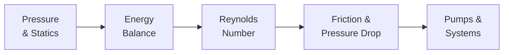

## Video Lecture

  <iframe
    width="560"
    height="315"
    src="https://www.youtube.com/embed/lfGMREF-V-c"
    title="Chemical Engineering Fluid Mechanics - Full Series"
    frameborder="0"
    allow="accelerometer; autoplay; clipboard-write; encrypted-media; gyroscope; picture-in-picture"
    allowfullscreen>
  </iframe>

> The whole series is available as a single video with chapter markers. Each chapter page starts this video at that chapter.

---

# Chemical Engineering Fluid Mechanics

**Pressure, Flow Regimes, Friction, and the Machines That Move Fluids**

Nearly everything in a chemical plant is a fluid being moved — feeds pumped, gases compressed, products piped. Pressure drop is money, and flow regime decides how well everything downstream mixes, transfers heat, and reacts. This course opens the transport-phenomena arc of our chemical engineering curriculum: momentum transfer first, continuing in our **Chemical Engineering Heat Transfer** series, and completed by **Chemical Engineering Mass Transfer and Separation**.

## Series Overview

1. **Hold** — fluid properties and the hydrostatic pressure field
2. **Trade** — Bernoulli and the mechanical energy balance: pressure, speed, and height exchange
3. **Sort** — the Reynolds number splits every flow into laminar or turbulent
4. **Pay** — the friction factor turns flow into an operating cost
5. **Drive** — pumps and compressors matched to the piping system

## Chapters

| Chapter | Title | What You Will Learn |
|---------|-------|---------------------|
| 1 | [Fluids, Pressure, and Statics](chapter-1.html) | Density and viscosity, hydrostatics, gauge vs absolute pressure, continuity |
| 2 | [Bernoulli and the Mechanical Energy Balance](chapter-2.html) | The pressure-speed-height trade, Torricelli, flow measurement, friction and pump work |
| 3 | [Laminar, Turbulent, and the Reynolds Number](chapter-3.html) | Reynolds' experiment, Re and flow regimes, Hagen–Poiseuille, why industry runs turbulent |
| 4 | [Pipe Flow and Pressure Drop](chapter-4.html) | The Darcy friction factor, the Moody chart, a worked pumping-cost design, fittings |
| 5 | [Pumps and Piping Systems](chapter-5.html) | Centrifugal vs positive displacement, operating point, NPSH and cavitation, compressors |

## Who This Series is For

- **Students** continuing from our Chemical Engineering Introduction and Thermodynamics series into the transport-phenomena core
- **Engineers and researchers** who size pipes, select pumps, or debug flow problems and want the reasoning behind the correlations
- **Data scientists** working with plant flow, pressure, and power data who need the physics those signals obey

Recommended preparation: Chemical Engineering Introduction; the Thermodynamics series helps for the energy and vapor-pressure connections. Mathematics stays at algebra with a few worked calculations.

## Related Series

Part of the classical-fundamentals track with **Chemical Engineering Introduction** and **Chemical Engineering Thermodynamics**. The transport arc continues in **Chemical Engineering Heat Transfer** and completes in **Chemical Engineering Mass Transfer and Separation**. The data-driven companions are **Process Informatics Introduction** and **Introduction to Process Monitoring and Control**.
