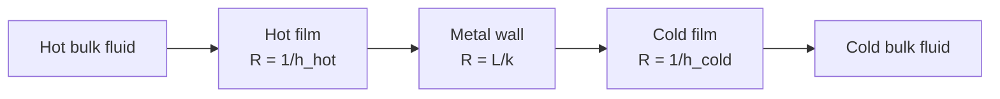

## Video Lecture

<div class="video-container">
  <iframe
    width="560"
    height="315"
    src="https://www.youtube.com/embed/fpjFV6KX1hc"
    title="Chemical Engineering Heat Transfer Ch.1: Conduction, Convection, and the Overall Coefficient"
    frameborder="0"
    allow="accelerometer; autoplay; clipboard-write; encrypted-media; gyroscope; picture-in-picture"
    allowfullscreen>
  </iframe>
</div>

> This video covers the same content as the text below. Choose your preferred learning format.

---

# Chapter 1: Conduction, Convection, and the Overall Coefficient

This chapter opens the heat-transfer series with the two mechanisms that carry almost every duty in a plant — conduction through solids and convection at surfaces — and shows how they combine into the single number every exchanger is sized with: the overall heat transfer coefficient $U$.

**Fourier's Law, Film Coefficients, and Thermal Resistances in Series**

## Learning Objectives

By completing this chapter, you will be able to:

  * ✅ Place heat transfer in the transport-phenomena framework as *flux = coefficient × driving force*
  * ✅ Apply Fourier's law and quote thermal conductivities across the metal-to-gas range
  * ✅ Explain why the film coefficient $h$ is not a material property but a consequence of flow
  * ✅ Combine film and wall resistances in series to compute an overall coefficient $U$
  * ✅ Identify the controlling resistance and predict which improvements will and will not pay
  * ✅ Describe fouling as a growing resistance and what a falling $U$ signals in service

**Reading Time**: 20-25 minutes **Code Examples**: 1 **Exercises**: 3

* * *

## 1.1 The Third Transport

[Introduction Chapter 1](../chemical-engineering-introduction/chapter-1.html) set out **transport phenomena** as a single table with three rows — momentum, heat, and mass — each row an instance of the same sentence: *flux = coefficient × driving force*. The [Fluid Mechanics](../chemical-engineering-fluid-mechanics/chapter-1.html) series developed the momentum row, where the driving force is a velocity gradient and the coefficient is viscosity. This series develops the heat row. The driving force is a temperature difference, and the coefficients are the subject of this chapter.

The commercial reason to care is already on the table. [Thermodynamics Chapter 1](../chemical-engineering-thermodynamics/chapter-1.html) showed that a distillation column's reboiler and condenser are usually the largest utility consumers on a flowsheet, because every pass of reflux must be boiled again and condensed again. Thermodynamics tells you *how much* energy that costs — $Q = \Delta H$ — and stops there. It never says how large the exchanger must be, or whether a fouled tube bundle will still make duty in August. Those are heat transfer questions, and nearly all of them route through one equation:

$$ Q = U A \Delta T $$

Duty $Q$ in watts, heat transfer area $A$ in m², a representative temperature difference $\Delta T$ in kelvin, and $U$ — the **overall heat transfer coefficient**, in W/(m²·K) — carrying everything about the materials, the fluids, and the flow. This series turns the utility bill into design equations: this chapter builds $U$, [Chapter 2](chapter-2.html) makes $\Delta T$ precise for a real exchanger, and Chapters 3 to 5 extend the picture to boiling, radiation, and design.

## 1.2 Conduction: Fourier's Law

**Conduction** is heat moving through matter without the matter moving — energy handed between neighboring molecules and, in metals, carried by free electrons. Its law is the direct analogue of Newton's law of viscosity:

$$ q = -k \frac{dT}{dx} $$

where $q$ is the **heat flux** in W/m² (power per unit area), $dT/dx$ the temperature gradient in K/m, and $k$ the **thermal conductivity** in W/(m·K). The minus sign is bookkeeping, not physics: it states that heat flows *down* the gradient, from hot toward cold, so a negative gradient gives a positive flux.

For the case that matters industrially — a flat wall of thickness $L$ and area $A$, steady state, hot face at $T_1$ and cold face at $T_2$ — the gradient is uniform and the law integrates to

$$ Q = \frac{k A (T_1 - T_2)}{L} = \frac{k A \Delta T}{L} $$

Thin walls and conductive materials transfer well; thick, insulating ones do not. Both forms assume **steady state** — temperatures fixed in time, so whatever enters one face leaves the other — which is the normal condition for a plant running at rate, and the assumption behind every calculation in this chapter. What makes the result useful is the enormous spread in $k$:

| Material (typical values, ~20 °C) | Thermal conductivity $k$ [W/(m·K)] |
|---|---|
| **Copper** | ≈ 400 |
| **Carbon steel** | ≈ 45 |
| **Stainless steel** | ≈ 15 |
| **Water** | ≈ 0.6 |
| **Mineral-wool insulation** | ≈ 0.04 |
| **Air (still)** | ≈ 0.026 |

These are typical magnitudes for orientation, not design data; real values shift with alloy, temperature, and moisture content. Read them as ratios. Copper to still air is a factor of roughly 15,000 — four orders of magnitude — and that span is the entire design space. **Metals conduct, gases insulate**, and every thermal decision in a plant is made somewhere along that line. Note too that stainless steel conducts about three times worse than carbon steel: specifying it for corrosion resistance is a thermal concession, quantified in Exercise 2.

The insulation entry explains itself once you see the air entry. Mineral wool, foam, and fiberglass are not good insulators because of what they are made of — glass fibers conduct far better than 0.04 — but because of what they *contain*. They trap air in pockets small enough to suppress internal circulation, so the composite behaves nearly like still air held in place. **Insulation works by immobilizing a gas.** Compress it, soak it, or let it settle, and it stops working.

## 1.3 Convection and the Film Coefficient

**Convection** is heat carried between a surface and a moving fluid, and it is where most of the resistance in a real exchanger lives. Its defining equation, Newton's law of cooling, is deliberately simple:

$$ Q = h A \Delta T $$

with $\Delta T$ the difference between the surface and the bulk fluid, and $h$ the **film coefficient** (also called the convective or surface heat transfer coefficient) in W/(m²·K).

The simplicity hides the difficulty. Thermal conductivity is a **property** — look up copper and you have it. The film coefficient is **not a property**. The same water against the same steel gives a different $h$ if you change the velocity, the tube diameter, the temperature, or whether the flow is laminar or turbulent. It is a consequence of the flow field, which is why this series depends on the last one.

The picture that makes it intuitive is the **film** the coefficient is named for. However fast the bulk fluid moves, the no-slip condition holds it still at the wall, so a thin, slow-moving layer clings to the surface. Heat must cross that layer by conduction through a fluid, and fluids conduct badly — water at 0.6, gases near 0.026. That stagnant film, often a fraction of a millimeter thick, is the real resistance; the well-mixed bulk beyond it is nearly isothermal by comparison. Anything that thins the film raises $h$.

This is where the [Reynolds number](../chemical-engineering-fluid-mechanics/chapter-3.html) reappears. Turbulence sweeps eddies close to the wall, thinning the film and steepening the temperature gradient across it, so $h$ rises sharply once flow goes turbulent — a dependence made quantitative by correlations such as the Dittus–Boelter equation, in which $h$ climbs with roughly the 0.8 power of Reynolds number, so doubling tube velocity buys about 74% more film coefficient. It also costs pressure drop, which grows about as velocity squared. That trade — heat transfer against pumping power — is the explicit subject of [Chapter 5](chapter-5.html).

| Situation (typical order-of-magnitude ranges) | $h$ [W/(m²·K)] |
|---|---|
| **Free convection, gases** | ≈ 5–25 |
| **Forced convection, gases** | ≈ 25–250 |
| **Forced convection, liquids** | ≈ 100–10,000 |
| **Boiling or condensing** | ≈ 2,500–100,000 |

Four orders of magnitude again, and the ordering is what to memorize: gases are terrible, pumped liquids are good, and phase change is in a class of its own, because latent heat moves large energy at nearly constant temperature ([Chapter 3](chapter-3.html)). A gas on one side of a wall dominates whatever happens on the other side — the arithmetic below is unambiguous about it.

## 1.4 Resistances in Series and the Overall Coefficient

Heat crossing an exchanger wall makes three trips in sequence: through the hot fluid's film, through the metal, through the cold fluid's film. Sequential steps mean **resistances in series**, exactly as in an electrical circuit, where temperature difference plays the role of voltage and heat flow the role of current.



The analogy is worth taking seriously, because it imports a habit: in a series circuit the same current passes every element, so the largest resistance takes the largest voltage drop. Here the same heat crosses every layer, so the largest thermal resistance takes the largest share of the temperature difference. Adding the resistances gives the overall coefficient, defined so that $Q = U A \Delta T$ recovers the whole duty from the total temperature difference:

$$ \frac{1}{U} = \frac{1}{h_i} + \frac{L}{k} + \frac{1}{h_o} $$

with $h_i$ the film coefficient on the inside surface and $h_o$ the one outside. Each term has units of m²·K/W, and $1/U$ is their sum. This is the **plane-wall form**. In a tube the inside and outside areas differ, so a rigorous treatment carries curvature corrections and states which area $U$ refers to; those refinements are set aside here, since they change the numbers by a few percent while the lesson below is a factor-of-ten effect.

**Worked example.** Cooling water inside a tube with $h_i = 1{,}000$ W/(m²·K), a 5 mm carbon steel wall with $k = 45$ W/(m·K), and a process liquid outside with $h_o = 2{,}000$ W/(m²·K):

$$ \frac{1}{U} = 0.001000 + \frac{0.005}{45} + 0.000500 = 0.001000 + 0.000111 + 0.000500 = 0.001611 $$

$$ U = 621\ \text{W/(m}^2\text{·K)} $$

The wall contributes 0.000111 of 0.001611 — **6.9%** of the total. The metal that dominates the drawing is nearly irrelevant thermally; the two thin films own 93% of the resistance between them.

(The code below labels the water side `h_hot` purely by position in the formula — the physics does not care which side is hotter, only that both films are counted.)

```python
def overall_U(h_hot, thickness, k, h_cold):
    """Overall coefficient U [W/(m^2*K)] for a plane wall, with each resistance."""
    resistances = {
        "hot film  1/h_hot": 1.0 / h_hot,
        "wall        L/k  ": thickness / k,
        "cold film 1/h_cold": 1.0 / h_cold,
    }
    total = sum(resistances.values())
    return 1.0 / total, total, resistances


CASES = {
    "water / steel / water": dict(h_hot=1000.0, thickness=0.005, k=45.0, h_cold=2000.0),
    "water / steel / air": dict(h_hot=1000.0, thickness=0.005, k=45.0, h_cold=50.0),
}

for name, case in CASES.items():
    U, total, res = overall_U(**case)
    print(f"{name}:  U = {U:.1f} W/(m^2*K),  total R = {total:.6f} m^2*K/W")
    for label, value in res.items():
        print(f"    {label} = {value:.6f}  ({100 * value / total:4.1f}% of total)")
    print()

# water / steel / water:  U = 620.7 W/(m^2*K),  total R = 0.001611 m^2*K/W
#     hot film  1/h_hot = 0.001000  (62.1% of total)
#     wall        L/k   = 0.000111  ( 6.9% of total)
#     cold film 1/h_cold = 0.000500  (31.0% of total)
#
# water / steel / air:  U = 47.4 W/(m^2*K),  total R = 0.021111 m^2*K/W
#     hot film  1/h_hot = 0.001000  ( 4.7% of total)
#     wall        L/k   = 0.000111  ( 0.5% of total)
#     cold film 1/h_cold = 0.020000  (94.7% of total)
```

The second case is the one to keep. Replace the outside liquid with air at $h = 50$ and $U$ collapses from 621 to **47.4 W/(m²·K)** — the air film alone is **94.7%** of the resistance. Now spend money on the water side, upgrading it from 1,000 to 5,000 W/(m²·K) with higher velocity and a better tube: $U$ rises to 49.2, a gain of under 4%. You have bought pumping power and delivered nothing.

**The largest resistance controls.** Improving anything else is wasted effort until the controlling resistance is dealt with. Run it the other way on the first case: doubling the *smaller* resistance's coefficient, 2,000 to 4,000, lifts $U$ from 621 to 735 (+18%), while doubling the *dominant* 1,000 to 2,000 lifts it to 900 (+45%). This single rule explains a great deal of real equipment. Air-cooled exchangers wear fins on the air side and nothing on the tube side, because area added where the coefficient is worst is the only area that helps. Whenever a gas meets a liquid across a wall, the gas is in charge.

## 1.5 Fouling: The Resistance That Grows

Everything so far assumed clean metal. Real surfaces accumulate deposits — scale from hard cooling water, biological films, corrosion product, coke, polymer, precipitated salts. Each deposit is a thin layer of low-conductivity material sitting exactly where the heat has to cross, and it enters the sum as one more $L/k$ term:

$$ \frac{1}{U} = \frac{1}{h_i} + R_{f,i} + \frac{L}{k} + R_{f,o} + \frac{1}{h_o} $$

The added terms are **fouling factors** (or fouling resistances), $R_f$ in m²·K/W: a design allowance for dirt the exchanger is expected to collect between cleanings. Typical published allowances run about 0.0001 to 0.0004 m²·K/W for clean services such as treated cooling water or condensing steam, and rise toward 0.001 and beyond for fouling-prone duties. Take them as order-of-magnitude design allowances, not measurements.

Small numbers, large consequences. Add a modest 0.0002 to each side of the worked example and $1/U$ goes from 0.001611 to 0.002011: $U$ falls from 621 to **497 W/(m²·K)**, a loss of 20% of the exchanger's capability, bought before it ever runs. That is why exchangers are deliberately oversized at design — and why an over-generous allowance is its own hazard, since a badly oversized unit runs at low velocity, and low velocity fouls faster.

Fouling is also the one resistance that *changes with time*, which makes it observable. Flows and temperatures are measured continuously, so $U$ can be back-calculated from $Q = U A \Delta T$ and trended. A steadily falling $U$ is a cleaning schedule writing itself; an abrupt drop is usually a different fault — a bypass, a blocked pass, a leaking tube. This is exactly the soft-sensor logic of [Introduction Chapter 5](../chemical-engineering-introduction/chapter-5.html): infer a hard-to-measure condition, here the state of a surface no one can see, from cheap measurements you already have. [Chapter 5](chapter-5.html) returns to fouling as a design and intensification problem.

## 1.6 Chapter Summary

1. Heat transfer is the second row of the **transport table** — *flux = coefficient × driving force* — and turns the thermodynamic duty $Q = \Delta H$ into hardware through $Q = U A \Delta T$
2. **Fourier's law**, $q = -k\,dT/dx$, gives $Q = kA\Delta T/L$ through a slab; typical conductivities span copper ≈ 400 to still air ≈ 0.026 W/(m·K), roughly 15,000-fold, and insulation works by trapping air rather than by any special material property
3. The **film coefficient** $h$ in $Q = hA\Delta T$ is not a property but a result of the flow: turbulence thins the stagnant wall film and raises $h$, so it tracks the Reynolds number; typical ranges run 5–25 for free convection in gases up to 2,500–100,000 for boiling and condensing
4. Resistances add in series: $1/U = 1/h_i + L/k + 1/h_o$ (plane-wall form, inside and outside films; tube-curvature corrections are ignored here)
5. Worked case: $0.001000 + 0.000111 + 0.000500 = 0.001611$ gives $U = 621$ W/(m²·K), with the steel wall only **6.9%** of the resistance
6. **The largest resistance controls.** With air outside ($h = 50$), $U$ falls to 47.4 W/(m²·K) and the air film is **94.7%** of the total — improving the water side from 1,000 to 5,000 gains under 4%
7. **Fouling factors** (typical design allowances ≈ 0.0001–0.001 m²·K/W) add resistance that grows in service; 0.0002 per side drops the worked case from 621 to 497 W/(m²·K), and a trended $U$ is a soft sensor for surface condition

**Next chapter**: $U$ is only one factor in $Q = U A \Delta T$, and in a real exchanger the temperature difference changes from end to end as both streams heat and cool. [Chapter 2](chapter-2.html) puts $U$ to work — **heat exchangers and the log mean temperature difference (LMTD)** — including what co-current and counter-current arrangements do to the duty you can achieve.

## Exercises

1. **Conceptual — where the resistance lives**: A shell-and-tube exchanger condenses steam on the shell side ($h \approx 8{,}000$ W/(m²·K)) and heats a viscous oil inside the tubes ($h \approx 200$ W/(m²·K)) through a 3 mm carbon steel wall. (a) Rank the three resistances without computing $U$ exactly. (b) A proposal is made to replace the tubes with copper to improve performance. Evaluate it. (c) What change would actually help, and why?
   *Hint*: write each resistance as $1/h$ or $L/k$ and compare magnitudes before doing any arithmetic.
   *Answer*: (a) Oil film $1/200 = 0.005$, steam film $1/8{,}000 = 0.000125$, wall $0.003/45 = 0.0000667$. The **oil film dominates** — about 96% of a total of roughly 0.00519 m²·K/W. (b) It is nearly worthless. Copper would cut the wall term from 0.0000667 to about 0.0000075, removing around 1% of the total resistance, and $U$ would rise from about 193 to about 195 W/(m²·K) — for a large materials bill. (c) Attack the oil film: raise tube-side velocity (more passes or smaller tubes), add turbulence promoters or twisted-tape inserts, or preheat the oil so its viscosity falls, since a less viscous fluid goes turbulent more readily. Any of these can move $h$ by a factor of two or more, and only that side changes $U$ appreciably.

2. **Quantitative — the stainless penalty**: An exchanger has $h_1 = 500$ W/(m²·K) on one side, a **3 mm stainless steel** wall ($k = 15$ W/(m·K)), and $h_2 = 5{,}000$ W/(m²·K) on the other. (a) Compute each resistance and the overall coefficient $U$. (b) Which resistance dominates, and by what share? (c) An engineer proposes doubling $h_2$ to 10,000 by increasing that stream's velocity. Compute the new $U$ and comment. (d) What would doubling $h_1$ to 1,000 achieve instead?
   *Hint*: build $1/U$ term by term; the wall term is $L/k = 0.003/15$.
   *Answer*: (a) $1/h_1 = 0.002000$, $L/k = 0.003/15 = 0.000200$, $1/h_2 = 0.000200$. Summing, $1/U = 0.002400$ m²·K/W, so $U = $ **417 W/(m²·K)**. (b) The **$h_1 = 500$ side**, at $0.002/0.0024 = $ **83.3%** of the total; wall and fast side contribute 8.3% each. (c) $1/U = 0.002 + 0.0002 + 0.0001 = 0.0023$, giving $U = $ **435 W/(m²·K)** — a gain of only 4.3%, in exchange for roughly four times the pressure drop on that stream. Not worth doing. (d) $1/U = 0.001 + 0.0002 + 0.0002 = 0.0014$, so $U = $ **714 W/(m²·K)**, a **71%** improvement from the same relative change applied to the controlling resistance. Note too that carbon steel in place of stainless would cut the wall term from 0.000200 to 0.0000667, worth about 6% on $U$ — real but secondary, and often unavailable because the stainless is there for corrosion reasons.

3. **Discussion — a gas cooler that underperforms**: A hot process gas is cooled by water in a plain-tube exchanger. Measured performance is $U \approx 40$ W/(m²·K), well below the 60 assumed at design, and the plant is considering (i) polishing and descaling the water side, (ii) increasing water flow by 50%, (iii) replacing the bundle with a finned-tube design, (iv) accepting the shortfall and adding a second unit in series. Discuss each, and explain what measurement would settle the argument.
   *Hint*: estimate which side holds the resistance from the typical $h$ ranges in Section 1.3 before judging any option.
   *Answer*: A gas gives $h$ of roughly 25–250 W/(m²·K) even in forced convection, while water gives 1,000 or more, so the **gas film holds nearly all the resistance** — a total $1/U$ of 0.025 m²·K/W against a water-side contribution near 0.001, about 4%. Options (i) and (ii) therefore address a resistance that is already negligible: even eliminating the water side entirely could not raise $U$ past about 42, and (ii) costs pumping power for nothing. Option (iii) is the correct engineering answer, because fins add area precisely where the coefficient is worst; the gas-side surface can be multiplied several-fold, and $UA$ — the product that actually sets duty — rises accordingly. Option (iv) is the brute-force version of (iii): it buys area at full price rather than cheaply, but is legitimate if plot space is available and downtime is not. The measurement that settles the argument is the **wall temperature**: if the tube surface sits close to the water temperature, nearly the whole $\Delta T$ is being spent across the gas film, confirming the gas side as controlling. Trending $U$ over time then separates a design shortfall from progressive **fouling** — a $U$ that started at 60 and decayed is a cleaning problem, while a $U$ that was never above 42 is a design problem no cleaning will fix.
