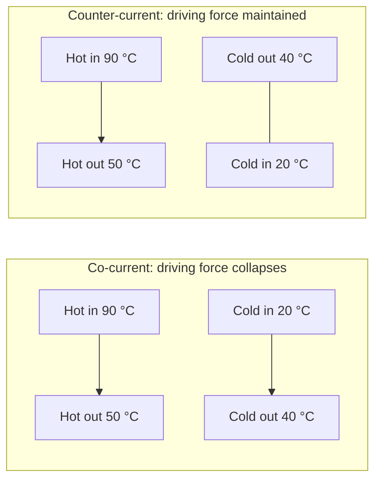

## Video Lecture

<div class="video-container">
  <iframe
    width="560"
    height="315"
    src="https://www.youtube.com/embed/fpjFV6KX1hc?start=778"
    title="Chemical Engineering Heat Transfer Ch.2: Heat Exchangers and the LMTD"
    frameborder="0"
    allow="accelerometer; autoplay; clipboard-write; encrypted-media; gyroscope; picture-in-picture"
    allowfullscreen>
  </iframe>
</div>

> This video covers the same content as the text below. Choose your preferred learning format.

---

# Chapter 2: Heat Exchangers and the LMTD

[Chapter 1](chapter-1.html) built the overall heat-transfer coefficient $U$ — the single number that collects film resistances, wall conduction, and fouling. This chapter spends it. Given two streams and a duty, how large an exchanger do you buy?

**Sizing the Workhorse of Process Heat**

## Learning Objectives

By completing this chapter, you will be able to:

  * ✅ Explain what a heat exchanger does for a flowsheet and why heat integration pays twice
  * ✅ Describe shell-and-tube construction and why it remains the industry standard
  * ✅ Contrast co-current and counter-current flow and state why counter-current wins
  * ✅ Compute the log-mean temperature difference and explain why the mean is logarithmic
  * ✅ Size an exchanger end to end with $Q = U A \Delta T_{lm}$, including fouling and the $F$ correction
  * ✅ Choose between the LMTD and ε-NTU methods for a given problem

**Reading Time**: 20-25 minutes **Code Examples**: 1 **Exercises**: 3

* * *

## 2.1 The Heat Exchanger's Job

A heat exchanger moves heat from one stream to another without mixing them. Stated that plainly it sounds like plumbing, but the economics are not plumbing at all. Every hot stream that needs cooling is a hot stream someone is paying cooling water to quench, and every cold stream that needs heating is steam on the utility bill. Match the two and one piece of equipment deletes both charges at once. That is **heat integration**, and [Introduction Chapter 4](../chemical-engineering-introduction/chapter-4.html) gave its systematic form: pinch analysis, which computes the minimum possible hot and cold utility *before* any network is drawn. Exchangers are the hardware that realizes those targets.

The equipment that does most of this work is the **shell-and-tube exchanger**: a bundle of tubes carrying one fluid, sealed into a cylindrical shell carrying the other, with baffles across the shell forcing the outside stream to zigzag over the tubes rather than slide straight past. It has been the standard for a century for unglamorous reasons. It tolerates essentially any pressure and temperature you can afford the metal for, it is mechanically robust, the tube bundle can be pulled for cleaning, and its design is codified by the **TEMA** standards, so a specification means the same thing to every fabricator. Under the standard practice of the industry, shell-and-tube is what you get unless there is a reason for something else.

There are reasons. **Plate exchangers** — gasketed corrugated plates stacked in a frame — achieve far higher $U$ in far less volume for clean, moderate-pressure duties, and they open flat for cleaning. [Chapter 5](chapter-5.html) treats them under intensification. Air coolers, double-pipe units, and spiral exchangers each occupy their own niche. The sizing logic below is identical for all of them; only $U$ and the geometry change.

## 2.2 Flow Arrangements

The two streams can run the same direction or opposite directions, and the choice is not cosmetic.

In **co-current** (parallel) flow, both enter at the same end. The temperature difference starts large — hot inlet against cold inlet — and collapses as the two streams converge toward a common intermediate temperature. In **counter-current** flow, they enter at opposite ends, so the hot inlet faces the cold *outlet* and the hot outlet faces the cold *inlet*. The difference between the streams decays far more slowly — exactly constant only when the two capacity rates match.

| | Co-current | Counter-current |
|---|---|---|
| **Inlets** | Same end | Opposite ends |
| **Driving force along the length** | Large at inlet, collapses toward outlet | Maintained, more uniform |
| **Cold outlet vs hot outlet** | Cold outlet must stay below hot outlet | Cold outlet **may exceed** hot outlet |
| **Area for a given duty** | Larger | Smaller |
| **Tube wall stress** | Sharp gradient at the inlet end | Gentler, spread out |

The third row is the decisive one. Co-current flow can never lift the cold stream above the hot stream's exit temperature — the two are approaching each other from the same starting point, and once they meet, heat stops flowing. Counter-current flow has no such limit: because the cold outlet meets the hot *inlet*, it can leave hotter than the hot stream leaves, a **temperature cross** that is simply unavailable in co-current. Combined with the larger average driving force, this is why counter-current is the default arrangement and why the following sections assume it.



Read the counter-current block right to left for the cold stream: it enters at 20 °C where the hot stream is *leaving* at 50 °C, and leaves at 40 °C where the hot stream is *entering* at 90 °C. Two approaches of 30 K and 50 K, rather than one of 70 K and one of 10 K.

## 2.3 The Log-Mean Temperature Difference

The sizing equation is a transport law in the standard form — flux equals coefficient times driving force, integrated over area:

$$ Q = U A \Delta T_{lm} $$

with $Q$ the **duty** (the heat transferred per unit time, in W), $U$ the overall coefficient in W/(m²·K), $A$ the heat-transfer area in m², and $\Delta T_{lm}$ the effective average temperature difference between the streams. The trouble is that this difference is not one number: it varies continuously along the exchanger. What average is correct?

Not the arithmetic one. As heat crosses the wall, each stream's temperature changes in proportion to the heat it has absorbed or given up, so the gap between them shrinks — or grows — exponentially with area rather than linearly. Integrating $dQ = U\,\Delta T\,dA$ along a counter-current exchanger with constant $U$, constant specific heats, and negligible heat loss to the surroundings gives the **log-mean temperature difference**:

$$ \Delta T_{lm} = \frac{\Delta T_1 - \Delta T_2}{\ln(\Delta T_1 / \Delta T_2)} $$

where $\Delta T_1$ and $\Delta T_2$ are the temperature approaches at the two ends.

### Worked Example

Hot water cools from 90 °C to 50 °C against cold water heated from 20 °C to 40 °C, counter-current. Pair each end correctly — hot inlet with cold outlet, hot outlet with cold inlet:

$$ \Delta T_1 = 90 - 40 = 50\ \text{K}, \qquad \Delta T_2 = 50 - 20 = 30\ \text{K} $$

$$ \Delta T_{lm} = \frac{50 - 30}{\ln(50/30)} = \frac{20}{0.5108} = 39.2\ \text{K} $$

The arithmetic mean would be 40 K — an overestimate of about 2.2%. Since $A$ is inversely proportional to $\Delta T$, using it would undersize the exchanger by about 2%. Here that is tolerable; the error is not constant. The log-mean is always the *smaller* of the two, and the gap widens as the ends become unequal. At a 10:1 spread the arithmetic mean overshoots by more than 40%, which is an exchanger that never makes its duty. Use the log mean.

## 2.4 A Complete Sizing

Take 2 kg/s of water cooled by 40 K, with $c_p = 4.18$ kJ/(kg·K). The duty follows from an energy balance on one stream:

$$ Q = \dot{m} c_p \Delta T = 2 \times 4.18 \times 40 = 334.4\ \text{kW} $$

For a water-to-water shell-and-tube unit a **typical** clean overall coefficient is around 500 W/(m²·K). With the 39.2 K driving force from above:

$$ A = \frac{Q}{U \Delta T_{lm}} = \frac{334{,}400}{500 \times 39.2} = 17.1\ \text{m}^2 $$

Two reality checks stand between that figure and a purchase order.

**Fouling.** The 500 W/(m²·K) is a clean value. In service, scale, biofilm, and corrosion products add the fouling resistances of [Chapter 1](chapter-1.html), and $U$ falls — often by a third or more on cooling-water duty. An exchanger sized exactly for the clean case meets its duty on commissioning day and misses it thereafter, so designers add a fouling allowance, effectively sizing for the dirty $U$.

**Multi-pass geometry.** Real shell-and-tube units rarely run pure counter-current. A **multi-pass** exchanger routes the tube fluid up and back through the shell more than once — two, four, or six tube passes — for velocity and for compactness. Some of those passes then run co-current, degrading the driving force. The standard fix is a **correction factor** $F$, a dimensionless number less than 1 read from published charts for the given pass arrangement, giving $Q = U A F \Delta T_{lm}$ — where $\Delta T_{lm}$ is the **counter-current** log-mean computed above, which $F$ then discounts for the arrangement actually built. Designers keep $F$ above roughly 0.8; below that the arrangement is too sensitive to be trusted, and the answer is more shells in series. The charts themselves are beyond this chapter — recognize the term and know that a multi-pass unit always needs more area than the counter-current ideal.

```python
import math

CP_WATER = 4.18  # kJ/(kg*K)


def duty(m_dot, cp, delta_T):
    """Heat duty [kW] for a stream of m_dot [kg/s] changed by delta_T [K]."""
    return m_dot * cp * delta_T


def lmtd(dT1, dT2):
    """Log-mean temperature difference [K] from the two end approaches."""
    if abs(dT1 - dT2) < 1e-9:
        return dT1
    return (dT1 - dT2) / math.log(dT1 / dT2)


def area(Q_kW, U, dT_lm):
    """Heat-transfer area [m^2] from Q = U * A * dT_lm, with U in W/(m^2*K)."""
    return Q_kW * 1000.0 / (U * dT_lm)


# Hot water 90 -> 50 C against cold water 20 -> 40 C, counter-current
dT1, dT2 = 90 - 40, 50 - 20
dT_lm = lmtd(dT1, dT2)
Q = duty(2.0, CP_WATER, 40.0)

print(f"dT1 = {dT1} K, dT2 = {dT2} K")
print(f"LMTD          = {dT_lm:.2f} K")
print(f"arithmetic dT = {(dT1 + dT2) / 2:.2f} K "
      f"(+{100 * ((dT1 + dT2) / 2 / dT_lm - 1):.1f}%)")
print(f"duty Q        = {Q:.1f} kW\n")

print(f"{'U [W/(m2.K)]':>13} {'area [m2]':>10}")
for U in (300, 500, 800):
    print(f"{U:>13} {area(Q, U, dT_lm):10.1f}")

# dT1 = 50 K, dT2 = 30 K
# LMTD          = 39.15 K
# arithmetic dT = 40.00 K (+2.2%)
# duty Q        = 334.4 kW
#
#  U [W/(m2.K)]  area [m2]
#           300       28.5
#           500       17.1
#           800       10.7
```

The sweep is the lesson: area is inversely proportional to $U$. A fouled unit at 300 W/(m²·K) needs 28.5 m², two-thirds more steel than the clean 17.1 m², while a high-performance surface at 800 W/(m²·K) needs only 10.7 m². Uncertainty in $U$ propagates directly into the capital cost, which is why the coefficient estimate of Chapter 1 deserves the care it got.

The driving force behaves the same way, and that is where the designer has a lever. Chase a tighter approach between the streams — recover more heat, shave the utility bill — and $\Delta T_{lm}$ shrinks while the area needed climbs toward infinity as the approach goes to zero. Heat recovery is therefore never free; it is bought with metal. Common practice settles the argument with a **minimum approach temperature**, typically around 10 K for liquid duties, which is precisely the parameter pinch analysis takes as its input.

## 2.5 The ε-NTU Method

The sizing above worked because all four terminal temperatures were known. Often they are not. Asked instead "I have this exchanger and these two inlet streams — what comes out?", the LMTD method stalls: $\Delta T_{lm}$ needs the outlets, and the outlets need the duty. You guess, solve, and iterate.

The **effectiveness-NTU** (ε-NTU) method removes the iteration by rephrasing the question. **Effectiveness** $\varepsilon$ is the actual duty divided by the thermodynamically maximum duty — what an infinitely large counter-current exchanger would transfer, limited by the stream with the smaller heat capacity rate $\dot{m} c_p$:

$$ \varepsilon = \frac{Q_{\text{actual}}}{Q_{\max}}, \qquad Q_{\max} = (\dot{m} c_p)_{\min} (T_{h,in} - T_{c,in}) $$

The **number of transfer units** is the exchanger's dimensionless size:

$$ \text{NTU} = \frac{UA}{(\dot{m} c_p)_{\min}} $$

For each flow arrangement there is a known relation $\varepsilon(\text{NTU}, C_r)$, where the **capacity-rate ratio** is $C_r = C_{\min}/C_{\max} \le 1$, the smaller of the two heat capacity rates $\dot{m}c_p$ divided by the larger. Given hardware and inlets, you compute NTU and $C_r$, read off $\varepsilon$, and the outlets follow in one pass — no iteration. The relations themselves are tabulated in any heat-transfer text and are deliberately left out here; what matters at this level is knowing which tool the problem calls for.

| Situation | Use |
|---|---|
| All four terminal temperatures known; find area | **LMTD** |
| Design of a new unit to a specified duty | **LMTD** |
| Outlet temperatures unknown; hardware fixed | **ε-NTU** |
| Rating an existing exchanger on a new service | **ε-NTU** |
| Checking how close a unit is to its thermodynamic limit | **ε-NTU** |

One more thing $\varepsilon$ buys: it is a performance score, not just a solving trick. An exchanger at $\varepsilon = 0.9$ is already extracting 90% of the available heat, and doubling its area will not find much more. That judgment is nearly invisible in the LMTD framing.

## 2.6 Chapter Summary

1. A heat exchanger transfers heat between streams without mixing them; matching hot and cold process streams — **heat integration** — cuts the steam bill and the cooling-water bill simultaneously
2. **Shell-and-tube** is the industry workhorse under standard practice: any pressure, mechanically robust, cleanable, standardized by TEMA. Plate exchangers give higher $U$ in less volume for clean duties ([Chapter 5](chapter-5.html))
3. **Counter-current** flow beats co-current: it maintains the driving force along the length and permits a temperature cross, where the cold stream leaves hotter than the hot stream leaves — impossible in co-current
4. The correct average driving force is the **log mean**, $\Delta T_{lm} = (\Delta T_1 - \Delta T_2)/\ln(\Delta T_1/\Delta T_2)$, because the gap between streams decays exponentially with area. For 90→50 °C against 20→40 °C: $\Delta T_1 = 50$ K, $\Delta T_2 = 30$ K, $\Delta T_{lm} = 20/0.5108 = 39.2$ K, against an arithmetic mean of 40 K that overestimates by 2.2%
5. **Sizing**: $Q = \dot{m} c_p \Delta T = 2 \times 4.18 \times 40 = 334.4$ kW, then $A = Q/(U\Delta T_{lm}) = 334{,}400/(500 \times 39.2) = 17.1$ m² at a typical water-water $U$ of 500 W/(m²·K). Area scales as $1/U$: 28.5 m² at 300, 10.7 m² at 800
6. Two corrections separate that number from a purchase: a **fouling allowance**, because $U$ degrades in service, and a **correction factor** $F < 1$ for multi-pass arrangements that are not purely counter-current — keep $F$ above about 0.8
7. **ε-NTU** replaces LMTD when outlet temperatures are unknown: $\varepsilon = Q_{\text{actual}}/Q_{\max}$ and $\text{NTU} = UA/(\dot{m}c_p)_{\min}$ give the answer without iteration, and $\varepsilon$ doubles as a score of how close a unit sits to its thermodynamic ceiling

**Next chapter**: every equation above assumed each stream has a constant $c_p$ and changes temperature as it absorbs heat. Let a stream boil or condense and that assumption collapses — it absorbs enormous heat at *constant* temperature, and the coefficients jump by an order of magnitude. [Chapter 3](chapter-3.html) takes on **boiling, condensation, and evaporators**.

## Exercises

1. **Conceptual — why counter-current**: A process stream must be heated from 30 °C to 85 °C using a hot stream available at 95 °C and leaving at 60 °C. (a) Is this duty achievable in a co-current exchanger? (b) In counter-current? (c) What are the two end approaches in the counter-current case, and what does the smaller one imply about the required area?
   *Hint*: in co-current, both streams march toward a common temperature from the same end; ask whether the cold stream can end up above the hot stream's exit.
   *Answer*: (a) **No.** In co-current flow the two streams converge, so the cold outlet can never exceed the hot outlet. Here the cold stream must reach 85 °C while the hot stream leaves at 60 °C — a **temperature cross** of 25 K, thermodynamically unreachable in that arrangement. (b) **Yes.** Counter-current pairs the cold outlet against the hot *inlet* (95 °C), so 85 °C is comfortably below the local hot temperature everywhere. (c) $\Delta T_1 = 95 - 85 = 10$ K at the hot-inlet end and $\Delta T_2 = 60 - 30 = 30$ K at the cold-inlet end. The 10 K approach is the constraint: driving force appears in the denominator of $A = Q/(U \Delta T_{lm})$, so a tight approach buys thermal performance with area. Here $\Delta T_{lm} = 20/\ln(3) = 18.2$ K — well below the 20 K arithmetic mean.

2. **Quantitative — LMTD for an oil cooler**: Hot oil is cooled from **120 °C to 70 °C** against cooling water heated from **25 °C to 45 °C**, counter-current. (a) Compute both end approaches. (b) Compute $\Delta T_{lm}$. (c) Compare with the LMTD of the water-water example in Section 2.3 and comment on the value of $\ln(\Delta T_1/\Delta T_2)$.
   *Hint*: hot inlet pairs with cold outlet, hot outlet with cold inlet. Then substitute into $\Delta T_{lm} = (\Delta T_1 - \Delta T_2)/\ln(\Delta T_1/\Delta T_2)$.
   *Answer*: (a) $\Delta T_1 = 120 - 45 =$ **75 K** and $\Delta T_2 = 70 - 25 =$ **45 K**. (b) $\Delta T_{lm} = (75-45)/\ln(75/45) = 30/0.5108 =$ **58.7 K**. (c) The logarithm is **the same 0.5108** as in Section 2.3, and not by accident: $75/45$ and $50/30$ both reduce to the ratio $5{:}3$, and only the *ratio* of the approaches enters the logarithm. The numerators differ (30 K here, 20 K there), so the LMTDs differ — 58.7 K against 39.2 K. Both arithmetic means (60 K and 40 K) sit about 2.2% above their log means (equivalently, the log means are about 2.1% below), which is the general result: the percentage gap is fixed by the ratio alone.

3. **Discussion — sizing and its corrections**: An engineer sizes a water-water exchanger for 334.4 kW with $U = 500$ W/(m²·K) and $\Delta T_{lm} = 39.2$ K, obtaining 17.1 m², and orders exactly that. (a) Name two effects that will make the installed unit underperform. (b) A two-tube-pass design gives $F = 0.85$; what area is then required? (c) If fouling additionally drops $U$ to 350 W/(m²·K) in service, what area would have met the duty in the dirty condition, and what does the comparison say about design practice?
   *Hint*: put both corrections into $Q = U A F \Delta T_{lm}$ and solve for $A$ each time.
   *Answer*: (a) **Fouling**, which adds resistance and lowers $U$ over months of service ([Chapter 1](chapter-1.html)), and the **multi-pass correction factor** $F < 1$, since a two-pass unit is not purely counter-current and has a smaller effective driving force than the LMTD implies. (b) $A = Q/(U F \Delta T_{lm}) = 334{,}400/(500 \times 0.85 \times 39.2) =$ **20.1 m²**, about 18% more than the ideal figure. (c) With $U = 350$ and $F = 0.85$: $A = 334{,}400/(350 \times 0.85 \times 39.2) =$ **28.7 m²**, roughly 68% above the original 17.1 m². The exchanger as ordered would meet its duty when clean and fall short within a cleaning cycle. Standard practice is therefore to size on the **dirty** coefficient with $F$ included — the extra area is bought once, whereas an undersized exchanger throttles the plant every day until it is replaced.
