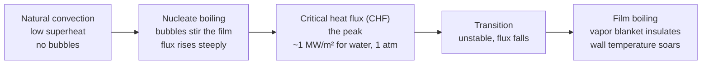
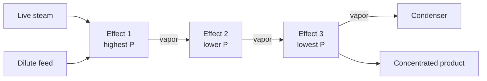

## Video Lecture

<div class="video-container">
  <iframe
    width="560"
    height="315"
    src="https://www.youtube.com/embed/fpjFV6KX1hc?start=1509"
    title="Chemical Engineering Heat Transfer Ch.3: Boiling, Condensation, and Evaporators"
    frameborder="0"
    allow="accelerometer; autoplay; clipboard-write; encrypted-media; gyroscope; picture-in-picture"
    allowfullscreen>
  </iframe>
</div>

> This video covers the same content as the text below. Choose your preferred learning format.

---

# Chapter 3: Boiling, Condensation, and Evaporators

The first two chapters moved heat into and out of fluids that stayed liquid or stayed gas. Let them change phase and both the coefficients and the hazards jump by an order of magnitude: boiling is the best heat transfer a process engineer can buy, right up to the point where it fails catastrophically.

**Phase Change: The Best and Most Dangerous Heat Transfer**

## Learning Objectives

By completing this chapter, you will be able to:

  * ✅ Explain why latent heat, not sensible heat, sets the size of reboilers, condensers, and evaporators
  * ✅ Describe the boiling curve and locate nucleate boiling, the critical heat flux, and film boiling on it
  * ✅ Recognize burnout as a design hazard specific to constant-heat-flux equipment
  * ✅ Distinguish filmwise from dropwise condensation and explain why noncondensable gases cripple a condenser
  * ✅ Compute steam economy for a multiple-effect evaporator and state which parts of the result are idealized
  * ✅ Identify a reboiler as a boiling exchanger and name its two classic failure modes

**Reading Time**: 20-25 minutes **Code Examples**: 1 **Exercises**: 3

* * *

## 3.1 Why Phase Change Dominates

[Thermodynamics Chapter 1](../chemical-engineering-thermodynamics/chapter-1.html) supplied this chapter's arithmetic. Water's specific heat is about 4.18 kJ/(kg·K); its latent heat of vaporization at 100 °C and 1 atm is about **2257 kJ/kg**. Divide one by the other and the ratio is a temperature: 2257 / 4.18 ≈ **540 K**. Condensing one kilogram of steam releases as much energy as cooling one kilogram of liquid water through 540 K — a swing no liquid water could survive. Phase change is where the energy is.

It is also where the *coefficient* is. The film coefficients tabulated in [Chapter 1](chapter-1.html) put gases from single digits to a few hundred W/(m²·K), and single-phase liquids from the hundreds up to about 10,000. Boiling and condensing water span roughly **2,500–100,000 W/(m²·K)** — typical design magnitudes, not constants. Two mechanisms explain the leap: bubbles growing and detaching violently stir the thermal boundary layer that otherwise insulates the wall, and condensing vapor gives up its latent heat at constant temperature, holding the driving force at its maximum along the whole surface instead of letting it decay as the stream cools.

The design consequence is direct. In the overall coefficient from [Chapter 1](chapter-1.html),

$$ \frac{1}{U} = \frac{1}{h_i} + \frac{L}{k} + R_f + \frac{1}{h_o} $$

(the fouling resistances of both sides lumped into one $R_f$), a phase-changing side contributes a resistance that nearly vanishes, so the *other* side — or the fouling layer — controls the exchanger. Reboilers, condensers, and evaporators are built around phase change because it moves the most energy through the least area.

## 3.2 The Boiling Curve

Immerse a heated surface in a pool of saturated liquid and slowly raise the wall above the saturation temperature. That difference, the **wall superheat** $\Delta T_{\text{sat}} = T_{\text{wall}} - T_{\text{sat}}$, is the driving force; the heat flux $q''$ in W/m² is the response. Plot one against the other and you have the **boiling curve** — not monotonic, which is the entire point.



At low superheat nothing boils: liquid warms, rises, and circulates by **natural convection** alone. Raise the superheat a few kelvin and bubbles nucleate at scratches and cavities in the surface, grow, and detach. This is **nucleate boiling**, the sweet spot — every departing bubble drags cold bulk liquid onto the wall, so the flux climbs steeply for a modest rise in superheat.

The climb ends. Once bubbles are numerous enough to merge into sheets, fresh liquid can no longer reach the surface between them, and the curve turns over at the **critical heat flux (CHF)** — the maximum flux nucleate boiling can sustain. For water at 1 atm the standard textbook magnitude is **≈ 1 MW/m²**; treat it as an order-of-magnitude anchor, not a design number. Past the peak lies **transition boiling**, where vapor patches form and collapse and the flux actually *falls* as superheat rises, and beyond it **film boiling**, a continuous vapor blanket separating liquid from wall. Vapor conducts poorly, so heat transfer collapses.

Whether that collapse is survivable depends on what is controlled. A steam-heated exchanger controls **wall temperature**: past CHF the flux simply drops, the equipment underperforms, and an operator notices. A fired heater tube, an electric immersion heater, or a nuclear fuel rod controls **heat flux** — the burner keeps firing, the current keeps flowing, regardless of what the surface is doing. When such a device exceeds CHF the only free variable left is wall temperature, and it leaps hundreds of kelvin in seconds to force the same flux through an insulating vapor film. That is **burnout**: melted hardware. The design rule is blunt — in constant-heat-flux service, stay well inside nucleate boiling with a margin to CHF.

## 3.3 Condensation

Condensation runs the same physics backward, and its subdivision matters. In **filmwise condensation** the liquid wets the surface and drains as a continuous film. That film is the resistance — every joule must conduct through it — so the coefficient falls as it thickens down the tube. In **dropwise condensation** the surface is non-wetting, so droplets form, grow, and roll off, repeatedly exposing bare metal, and the coefficient is several times higher.

Dropwise is not a design basis. Sustaining it needs surface promoters or coatings that erode, oxidize, or wash away over weeks to months, after which the surface reverts to filmwise. **Standard industrial practice is therefore to design for filmwise condensation** and treat any dropwise behavior as an unbooked bonus. Steam condenser coefficients quoted for design fall around **5,000–15,000 W/(m²·K)** — typical magnitudes, sensitive to geometry, orientation, and condensate loading.

One contaminant destroys all of this: **noncondensable gases**, meaning any species that will not condense at the operating conditions — air leaking into a vacuum condenser, nitrogen blanketing gas, dissolved gases from the feed. Vapor flowing toward the wall carries them along, but only the vapor condenses, so they build up in a stagnant layer through which incoming vapor must then *diffuse* — and diffusion is slow. A few percent of air by volume can cut a condenser's coefficient severalfold. Hence the **vent** on every condenser and the continuous ejectors on vacuum service. A condenser that has quietly stopped performing is more often air-bound than fouled, and unlike fouling the fix takes minutes.

## 3.4 Evaporators and Steam Economy

An **evaporator** concentrates a solution by boiling water out of it, and it is both of the previous sections in one shell: steam condensing on one side, process liquor boiling on the other, separated by tube wall. With feed entering at its boiling point there is no sensible term, so the duty is latent alone:

$$ Q = \dot{m}\lambda $$

with $\dot{m}$ the evaporation rate and $\lambda$ the latent heat of vaporization.

The economics reduce to one ratio. **Steam economy** is kilograms of vapor evaporated per kilogram of live steam consumed:

$$ \text{steam economy} = \frac{\text{kg vapor evaporated}}{\text{kg live steam consumed}} $$

A **single-effect** evaporator condenses one kilogram of steam to evaporate roughly one kilogram of water — economy ≈ 1, an idealization resting on the two latent heats being nearly equal and ignoring losses and feed preheating.

The improvement is to use that vapor twice. It still carries essentially all the latent heat that made it, so if the second effect is held at **lower pressure** its liquor boils at a **lower temperature** ([Thermodynamics Chapter 3](../chemical-engineering-thermodynamics/chapter-3.html): saturation temperature follows pressure) and the first effect's vapor is hot enough to heat it. Chain $N$ effects at successively lower pressures and, idealized, economy approaches $N$.



```python
LAMBDA = 2257.0      # kJ/kg, latent heat of water at 100 C, 1 atm (Thermodynamics Ch 1)
EVAP = 10_000.0      # kg/h of water to be evaporated
ETA = 0.85           # ILLUSTRATIVE per-effect factor, NOT a measured constant


def economy_ideal(n):
    """Idealized steam economy [kg vapor / kg steam]: N effects, N times the duty."""
    return float(n)


def economy_derated(n):
    """Same trend with an illustrative constant derating factor applied."""
    return ETA * n


def steam_demand(evap, economy):
    """Live steam required [kg/h] to evaporate `evap` kg/h at the given economy."""
    return evap / economy


print(f"{'effects':>7} {'ideal':>7} {'derated':>8} {'steam kg/h':>11} {'duty MW':>8} {'vs 1-effect':>12}")
base = steam_demand(EVAP, economy_derated(1))
for n in range(1, 7):
    econ = economy_derated(n)
    steam = steam_demand(EVAP, econ)
    duty = steam * LAMBDA / 3600.0 / 1000.0   # kg/h * kJ/kg -> kW -> MW
    saving = (1.0 - steam / base) * 100.0
    print(f"{n:7d} {economy_ideal(n):7.2f} {econ:8.2f} {steam:11.0f} {duty:8.2f} {saving:11.1f}%")

# effects   ideal  derated  steam kg/h  duty MW  vs 1-effect
#       1    1.00     0.85       11765     7.38         0.0%
#       2    2.00     1.70        5882     3.69        50.0%
#       3    3.00     2.55        3922     2.46        66.7%
#       4    4.00     3.40        2941     1.84        75.0%
#       5    5.00     4.25        2353     1.48        80.0%
#       6    6.00     5.10        1961     1.23        83.3%
```

Read the table for its *shape*, not its digits. The 0.85 factor is an **illustrative assumption inserted to show that real economies fall short of $N$** — not a measured constant. What survives it is the diminishing return: one effect to two saves 50% of the steam, five to six barely three points more. Capital moves the other way. Split the available temperature difference evenly among $N$ effects and each gets $\Delta T_{\text{tot}}/N$ while carrying $Q_{\text{tot}}/N$ of duty, so each needs about the same area as the single-effect unit would — total area grows roughly with $N$ while steam falls as $1/N$. Industrial trains commonly settle at two to six effects.

A different route upgrades the vapor instead of cascading it. **Mechanical vapor recompression (MVR)** compresses the evaporated vapor to a pressure at which it can heat its own effect. The compressor consumes shaft work — the precious commodity of [Thermodynamics Chapter 2](../chemical-engineering-thermodynamics/chapter-2.html) — but the pressure ratio is small, so that work is a fraction of the latent heat recycled.

## 3.5 The Reboiler Connection

Every distillation column ends in a boiling exchanger. The **reboiler** vaporizes liquid at the column base to generate the vapor traffic that reflux demands ([Introduction Chapter 4](../chemical-engineering-introduction/chapter-4.html)), and it is usually the largest single item on the plant's energy bill. Two configurations dominate. A **kettle reboiler** submerges a tube bundle in a liquid pool inside an oversized shell, boiling into the vapor space above: simple, tolerant, high vaporization per pass. A **thermosiphon reboiler** lets boiling itself lower the fluid's density and drive circulation from the column sump — no pump, less holdup, gentler on heat-sensitive material.

Two failure modes recur. **Fouling** deposits a low-conductivity layer that raises the wall temperature needed for a given duty, which degrades the product it is baking onto the tube — a self-accelerating loop. **Film boiling** follows when $\Delta T$ is pushed too far, typically by raising steam pressure to compensate for that fouling; duty then *falls* as $\Delta T$ rises, and the instinct to add more steam makes it worse. The two are usually the same event, in sequence.

Fluid mechanics sets the last constraint. Bottoms product leaves the column at its boiling point, so its pump has almost no margin between suction pressure and vapor pressure — the **NPSH** problem of [Fluid Mechanics Chapter 5](../chemical-engineering-fluid-mechanics/chapter-5.html). This is why column sumps sit high above their pumps: a saturated liquid cavitates at the slightest provocation.

## 3.6 Chapter Summary

1. **Latent heat dwarfs sensible heat**: water's 2257 kJ/kg equals 4.18 kJ/(kg·K) applied over 540 K, which is why phase-change equipment carries the plant's largest duties
2. Boiling and condensing film coefficients reach **2,500–100,000 W/(m²·K)** (typical magnitudes), an order of magnitude beyond single-phase — so the phase-changing side rarely controls $U$
3. The **boiling curve** runs natural convection → nucleate boiling → **critical heat flux** → transition → **film boiling**, where a vapor blanket insulates the wall; water at 1 atm peaks near **1 MW/m²** (textbook magnitude)
4. **Burnout** is a constant-heat-flux hazard: fired tubes, electric heaters, and fuel rods cannot shed the flux, so wall temperature soars past CHF — design with margin inside nucleate boiling
5. Condensers are designed **filmwise** because dropwise promoters degrade in service; steam-side coefficients of **5,000–15,000 W/(m²·K)** are typical
6. **Noncondensables** accumulate at the condensing surface and force vapor to diffuse through them — hence vents and ejectors on every condenser
7. **Steam economy** is kg vapor per kg steam: ≈ 1 single-effect, approaching $N$ for $N$ effects idealized, less in practice; area grows with $N$ while steam falls as $1/N$, so trains settle at two to six effects. **MVR** buys the same saving with a little shaft work
8. **Reboilers** are boiling exchangers — **kettle** (submerged bundle) or **thermosiphon** (density-driven circulation) — killed by **fouling** and the **film boiling** it provokes, with saturated bottoms liquid a permanent NPSH risk

**Next chapter**: every mechanism so far — conduction, convection, boiling, condensation — has needed matter in contact with matter. [Chapter 4](chapter-4.html) takes up **radiation**, which needs nothing at all, crosses vacuum, and scales with the fourth power of absolute temperature — the mechanism that runs a fired heater.

## Exercises

1. **Conceptual — the two ways to cross CHF**: An electric immersion heater and a steam-heated coil both boil water at 1 atm in the same vessel. Each is pushed until it crosses the critical heat flux. (a) Describe what happens to the wall temperature of each. (b) Why is only one of them destroyed? (c) A reboiler is fouling, and the operator raises steam pressure to hold the duty. What does the boiling curve predict?
   *Hint*: ask which variable each device holds fixed — heat flux or wall temperature — and then read the boiling curve for the one that is left free to move.
   *Answer*: (a) The **steam coil** fixes wall temperature (roughly the condensing steam temperature). Past CHF the curve turns over, so the **flux falls**; the coil underperforms but the metal stays near steam temperature. The **electric heater** fixes flux — the current keeps flowing. Past CHF no point on the nucleate branch can pass that flux, so the operating point jumps to the film-boiling branch, and **wall temperature leaps by hundreds of kelvin** to drive the same flux through an insulating vapor film. (b) Only the constant-flux device melts: it cannot shed the energy it is committed to delivering. Constant-temperature devices are **self-limiting**, which is exactly why steam heating is the safer utility. (c) Fouling raises the wall temperature needed for a given duty, so more steam pressure means more superheat — pushing toward the CHF peak and then over it. Duty then **falls as $\Delta T$ rises**, and the instinctive response (more steam) accelerates the failure. The correct response is to clean.

2. **Quantitative — evaporator duty and area**: An evaporator must vaporize **1,000 kg/h** of water at 1 atm from a feed already at its boiling point. Take $\lambda = 2257$ kJ/kg. (a) Compute the heat duty in kW. (b) With $U = 2{,}500$ W/(m²·K) and a temperature difference of **15 K**, compute the required heat-transfer area. (c) The steam supply is degraded and $\Delta T$ falls to 10 K. What area would the same duty need?
   *Hint*: duty is $\dot{m}\lambda$ with units reconciled (kg/h → kg/s); then $A = Q/(U\,\Delta T)$ from [Chapter 1](chapter-1.html).
   *Answer*: (a) $Q = 1000 \times 2257 / 3600 =$ **626.9 kW ≈ 627 kW**. Note that the feed enters at its boiling point, so there is no sensible term — all of it is latent. (b) $A = 626{,}900 / (2500 \times 15) =$ **16.7 m²**. (c) $A = 626{,}900/(2500 \times 10) =$ **25.1 m²**, a 50% increase in surface for the same job. Area is inversely proportional to $\Delta T$, which is why losing temperature driving force is expensive — and why multiple-effect trains, which deliberately divide the available $\Delta T$, pay for their steam savings in steel.

3. **Discussion — how many effects, and when to recompress**: A plant evaporating 10,000 kg/h of water is choosing between a single effect, a four-effect train, and MVR. (a) Using the Section 3.4 output, what steam saving does four effects buy, and why is ten effects rarely built? (b) What does the 0.85 factor in the code represent, and what may it not be used for? (c) Under what conditions does MVR beat a multiple-effect train?
   *Hint*: for (a) compare the steam trend against how total area behaves as $N$ grows; for (c) compare the cost of a kilowatt-hour of electricity against the cost of a kilowatt-hour of steam.
   *Answer*: (a) Four effects cut live steam by **75%** (11,765 → 2,941 kg/h in the table). Ten effects fail on two counts: the *marginal* saving shrinks — going from five to six effects saves only 3.3 further percentage points — while total heat-transfer area keeps growing roughly in proportion to $N$, since each effect receives only $\Delta T_{\text{tot}}/N$ of driving force and so needs about the same area as the single-effect unit. There is also a hard physical floor: the total available $\Delta T$ between supply steam and the final condenser is fixed, and boiling-point elevation in a concentrated liquor eats part of it in every effect. Two to six effects is the usual settlement. (b) It is an **illustrative derating assumption**, inserted only to show that real economies fall below the ideal $N$. It is not measured, not a constant of nature, and must **not** be used to size equipment or to quote a guaranteed economy — real losses depend on feed properties, boiling-point elevation, condensate subcooling, and insulation. (c) MVR wins where **electricity is cheap relative to steam**, where the boiling-point elevation is small (the compressor then needs only a small pressure ratio, hence little work), where a single moderate-sized unit is preferred to a long train of vessels, and where no low-grade waste steam is available to feed effect one. It loses where power is expensive, where the compressor's maintenance in a fouling or corrosive service is a liability, or where the site already has surplus low-pressure steam that a multiple-effect train can absorb for free.
