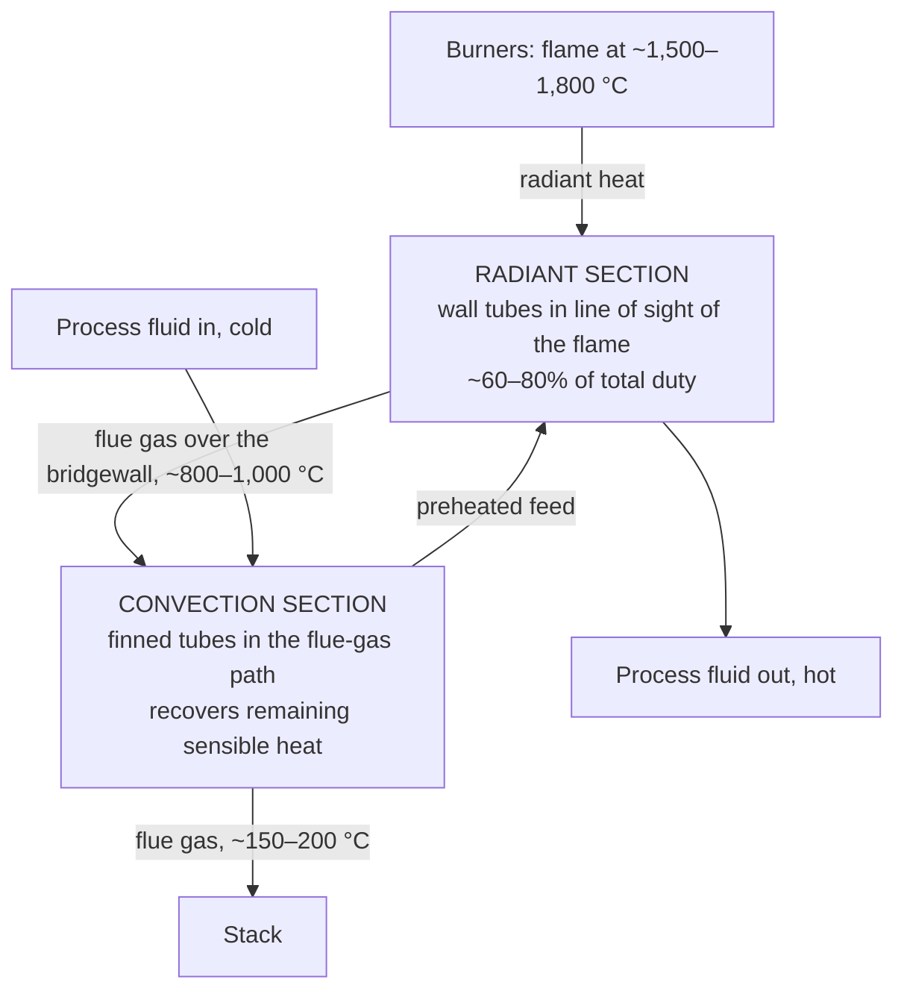

## Video Lecture

<div class="video-container">
  <iframe
    width="560"
    height="315"
    src="https://www.youtube.com/embed/fpjFV6KX1hc?start=2311"
    title="Chemical Engineering Heat Transfer Ch.4: Radiation and Furnaces"
    frameborder="0"
    allow="accelerometer; autoplay; clipboard-write; encrypted-media; gyroscope; picture-in-picture"
    allowfullscreen>
  </iframe>
</div>

> This video covers the same content as the text below. Choose your preferred learning format.

---

# Chapter 4: Radiation and Furnaces

This chapter takes up the third mechanism of heat transfer — the one that needs no material to travel through. Radiation is a rounding error on a warm pipe and the whole design basis of a fired heater, and the temperature at which it switches from one to the other is the story here.

**Heat That Needs No Medium**

## Learning Objectives

By completing this chapter, you will be able to:

  * ✅ Explain why radiation, unlike conduction and convection, crosses a vacuum
  * ✅ Apply the Stefan–Boltzmann law $E = \varepsilon \sigma T^4$ and justify the use of absolute temperature
  * ✅ Quote typical emissivities and use them to estimate net exchange with the surroundings
  * ✅ Judge from the surface temperature whether radiation is negligible, comparable, or dominant
  * ✅ Describe the radiant and convection sections of a process fired heater and what limits each
  * ✅ Name view factor and tube-skin temperature and say what each one governs

**Reading Time**: 20-25 minutes **Code Examples**: 1 **Exercises**: 3

* * *

## 4.1 The Third Mechanism

[Chapter 1](chapter-1.html) built the overall heat transfer coefficient out of two mechanisms. **Conduction** passes energy along through a material, molecule to neighboring molecule. **Convection** carries it away in moving fluid. Both need something to be there. Take the matter away and both stop.

Radiation does not stop. Every surface above absolute zero emits energy as electromagnetic waves, and those waves travel perfectly well through nothing at all. The proof arrives every morning: sunlight crosses 150 million kilometers of vacuum to warm a rooftop, with no medium at any point along the way. Nothing conducts across that gap and nothing convects across it, yet roughly a kilowatt per square meter arrives.

The awkward part for the practicing engineer is that radiation is always present and almost never important — until suddenly it is everything. A vessel wall at 60 °C radiates, but next to the convection stripping heat off the same wall the radiant contribution is a modest correction. Inside a fired heater at 1,200 °C, the ranking inverts completely: radiation delivers most of the duty and convection is the afterthought. The crossover between those two worlds is what this chapter locates.

## 4.2 The Stefan–Boltzmann Law

The emissive power of a surface — the energy it radiates per unit area per unit time, in W/m² — is

$$ E = \varepsilon \sigma T^4 $$

where $\sigma = 5.67 \times 10^{-8}$ W/(m²·K⁴) is the **Stefan–Boltzmann constant**, $\varepsilon$ is the surface's **emissivity** (introduced in the next section — for now, a number between 0 and 1 measuring how good a radiator the surface is), and $T$ is its **absolute** temperature in kelvin.

Note: $\varepsilon$ here is emissivity — unrelated to the exchanger effectiveness $\varepsilon$ of [Chapter 2](chapter-2.html); the symbol collision is standard in the literature.

Everything unusual about radiation lives in that exponent. Conduction and convection are linear in temperature difference: double the driving force, double the flux. Radiation is quartic in absolute temperature, so doubling $T$ multiplies emission by $2^4 = 16$.

### Worked Example: 300 K Against 1,000 K

Take a perfect emitter, a **blackbody** ($\varepsilon = 1$), at room temperature, 300 K:

$$ E = 5.67 \times 10^{-8} \times 300^4 = 459\ \text{W/m}^2 $$

Now the same surface in a furnace at 1,000 K:

$$ E = 5.67 \times 10^{-8} \times 1000^4 = 56{,}700\ \text{W/m}^2 \approx 56.7\ \text{kW/m}^2 $$

The temperature rose by a factor of 3.3. The emission rose by a factor of **123**. That single comparison is why radiation can be ignored around a warm tank and cannot be ignored anywhere near a flame.

### Kelvin Is Not Optional

The temperature in that fourth power is **absolute**, and there is no version of the calculation in which a Celsius value is acceptable. Substitute 300 °C as "300" instead of 573 K and the answer is wrong by a factor of $(573/300)^4 = 13$. Substitute 25 °C as "25" and the surroundings essentially vanish from the equation. Worse, a surface at 0 °C entered as "0" radiates nothing at all, which is nonsense — it radiates 316 W/m².

This is the same class of error as reading a gauge pressure as an absolute one, and it is worse here because the exponent amplifies it. A 50% error in absolute pressure stays a 50% error; a 50% error in absolute temperature becomes a factor of 16 in radiant flux. Write kelvin into every radiation calculation before anything else goes on the page.

## 4.3 Emissivity and Real Surfaces

Real surfaces are not blackbodies. **Emissivity** $\varepsilon$ is the fraction of blackbody emission a real surface actually achieves at the same temperature, running from 0 (a perfect reflector, emitting nothing) to 1 (a blackbody). These are **typical** values, adequate for estimating and no substitute for data on the actual surface:

| Surface | Typical emissivity $\varepsilon$ |
|---|---|
| **Oxidized carbon steel** | ≈ 0.8 |
| **Refractory brick** | ≈ 0.9 |
| **Most paints, any color** | ≈ 0.9 |
| **Polished steel** | ≈ 0.1 (typical) |
| **Polished aluminum / bright foil** | ≈ 0.05 |

Two of those deserve comment. First, oxidized steel sits near 0.8, but *clean, polished* steel is far lower — around 0.1 — meaning a pipe's radiant loss climbs substantially during its first months in service as the surface weathers. Second, the gap between polished aluminum at 0.05 and everything else at 0.8–0.9 is a design tool: a **low-emissivity foil** wrapped around insulation is not insulation in the conductive sense at all, it simply refuses to radiate, cutting the radiant term by a factor of roughly 16. Note also that color in the visible sense tells you nothing — white paint and black paint have nearly the same emissivity at process temperatures, because the emission is infrared.

### Net Exchange with the Surroundings

A hot surface both emits and absorbs, and only the difference matters. For the common case of a **small object in large surroundings** — a pipe, a vessel, a person, enclosed by walls or sky so much larger that essentially none of the radiation the object emits comes back to it — the net flux simplifies to

$$ q = \varepsilon \sigma (T_1^4 - T_2^4) $$

with $T_1$ the surface and $T_2$ the surroundings, both in kelvin. The form also assumes that the surface is **gray**, so its absorptivity equals its emissivity (Kirchhoff's law) — a good approximation for oxidized industrial surfaces, poor for selective coatings and solar input. The small-object assumption is doing real work too: it holds for a pipe in a large room, and fails inside a furnace where the object is a substantial part of its own enclosure. Section 4.5 names the bookkeeping that handles the general case.

The code below applies this to a bare pipe at three surface temperatures, alongside a convective estimate using $h = 10$ W/(m²·K), an order-of-magnitude figure for natural convection to still air.

```python
SIGMA = 5.67e-8  # W/(m^2*K^4)
EPS = 0.8        # emissivity of oxidized steel (typical)
H_CONV = 10.0    # W/(m^2*K), natural convection to still air (order of magnitude)
T_SURR_C = 25.0


def q_radiation(t_surface_c, t_surround_c=T_SURR_C, eps=EPS):
    """Net radiative flux [W/m^2] from a small hot surface to large surroundings."""
    t_s = t_surface_c + 273.15
    t_a = t_surround_c + 273.15
    return eps * SIGMA * (t_s**4 - t_a**4)


def q_convection(t_surface_c, t_surround_c=T_SURR_C, h=H_CONV):
    """Convective flux [W/m^2] from the same surface."""
    return h * (t_surface_c - t_surround_c)


print(f"{'T_surf [C]':>11} {'q_rad':>9} {'q_conv':>9} {'rad/conv':>9} {'total':>9}")
for t in (150.0, 300.0, 600.0):
    qr = q_radiation(t)
    qc = q_convection(t)
    print(f"{t:11.0f} {qr:9.0f} {qc:9.0f} {qr/qc:9.2f} {qr+qc:9.0f}")

#  T_surf [C]     q_rad    q_conv  rad/conv     total
#         150      1096      1250      0.88      2346
#         300      4536      2750      1.65      7286
#         600     26007      5750      4.52     31757
```

Read the third column. At 150 °C radiation is slightly *below* convection — a real contribution, not the dominant one. By 300 °C it is 1.65 times convection, and by 600 °C it is 4.5 times, because convection grew linearly (4.6 times from 150 °C to 600 °C, tracking the driving force) while radiation grew nearly 24-fold. The crossover, where the two are equal, falls near **180 °C** for these assumptions. Anyone estimating losses from a hot line by convection alone is progressively more wrong the hotter the line runs.

## 4.4 When Radiation Matters in a Plant

That calculation supports a working **guideline** — a habit of thought, not a law, and sensitive to the convective coefficient assumed:

- **Below about 100 °C**: radiation is a real but secondary term — on the $h = 10$ basis it still carries 30–40% of the loss, and less under forced convection. Include it in a careful heat-loss estimate; do not build the design around it.
- **100–500 °C**: radiation and convection are comparable, with the crossover near 180 °C sitting in this band. Neither can be dropped.
- **Above about 500–600 °C**: radiation dominates. A design that omits it is not conservative, it is simply wrong.

Two practical consequences follow. The first is **personnel protection**. A surface hot enough to radiate strongly is hot enough to burn on contact, and radiant flux is also what makes standing near an open furnace door uncomfortable at a distance no convection could reach. Guarding, shielding, and time limits near hot surfaces are radiation problems.

The second is money. A bare pipe at 200 °C sheds roughly 1.9 kW/m² by radiation alone, as Exercise 2 works out — every square meter of it, every hour, for the life of the plant, as fuel bought and burned. **Insulation pays twice**: it adds conductive resistance in series, and by presenting a cool outer surface it collapses the $T^4$ term along with it. An insulated line whose outer skin sits at 50 °C radiates about 136 W/m², under a tenth of the bare figure. The economic thickness calculation of [Chapter 5](chapter-5.html) counts both.

## 4.5 Furnaces and Fired Heaters

A **fired heater** — the workhorse that brings crude to distillation temperature, drives a reformer, or supplies reboiler duty too hot for steam — burns fuel and hands the heat to process fluid inside tubes. It does this in two stages, exploiting the fact that radiation and convection dominate in different temperature ranges.



The **radiant section** is the firebox: refractory-lined walls with process tubes arranged around them, in direct line of sight of the flame. There is no heat transfer coefficient to correlate here in the [Chapter 1](chapter-1.html) sense — the tubes are heated by $T^4$ from flame and glowing refractory, and this section typically carries 60–80% of the heater's total duty. The **convection section** sits above it, where flue gas that has cooled below radiant usefulness still holds a great deal of sensible heat; finned tubes recover it by ordinary forced convection, preheating the incoming feed before it enters the radiant coil. Note the counter-current arrangement: cold feed enters the convection section, hot product leaves the radiant section.

Three points complete the picture.

**The hot gas radiates too.** Nitrogen and oxygen are effectively transparent to thermal radiation, but the combustion products **carbon dioxide and water vapor** emit and absorb strongly in the infrared, so the flue gas itself is a radiating body, not merely a transparent window onto the flame. (Quantifying this needs gas-emissivity charts, well beyond our scope.)

**View factor** is the geometry bookkeeping. Radiation travels in straight lines, so how much of what one surface emits actually lands on another depends entirely on their relative size, spacing, and orientation. The **view factor** is the dimensionless fraction that captures it — a tube facing the flame across a short gap has a large view factor to it, one shadowed behind a row of others has a small one. It is why furnace design is as much a layout exercise as a thermal one, and why the simple two-surface formula of Section 4.3 is only the special case where the view factor is effectively 1.

**Tube-skin temperature** is the integrity limit. The metal wall of a radiant tube runs hotter than the fluid inside it, and that metal temperature — not the process temperature, and not the duty — is what the heater is ultimately limited by. Exceed the alloy's rating and the tube suffers **creep**, slow permanent deformation under stress at high temperature, ending in rupture. Run the inside surface too hot and hydrocarbons **coke**, laying down a carbon deposit whose thermal resistance forces the skin still hotter to pass the same duty — a self-accelerating loop that ends in a decoking shutdown or a tube failure. Tube-skin thermocouples and infrared surveys exist because of exactly this.

## 4.6 Chapter Summary

1. **Radiation needs no medium.** Every surface above absolute zero emits electromagnetic energy, which crosses a vacuum — as sunlight demonstrates daily. It is the third mechanism alongside conduction and convection.
2. **Stefan–Boltzmann**: $E = \varepsilon \sigma T^4$ with $\sigma = 5.67 \times 10^{-8}$ W/(m²·K⁴). The fourth power means doubling absolute temperature multiplies emission by 16.
3. **The worked contrast**: a blackbody at 300 K emits 459 W/m²; at 1,000 K it emits 56,700 W/m² — 123 times more for 3.3 times the temperature.
4. **Temperature must be absolute.** Kelvin, never Celsius. The exponent turns a temperature-scale slip into an error of an order of magnitude or more.
5. **Emissivity** $\varepsilon$ runs 0 to 1: oxidized steel ≈ 0.8, refractory brick ≈ 0.9, polished aluminum ≈ 0.05 (typical values). Low-$\varepsilon$ foil works as radiation insulation.
6. **Net exchange** for a small object in large surroundings is $q = \varepsilon\sigma(T_1^4 - T_2^4)$ — valid only when the surroundings are large enough that little of the emitted radiation returns.
7. **Crossover**: for a pipe at $\varepsilon = 0.8$ with $h = 10$ W/(m²·K), radiation reaches convection near 180 °C, is 1.65 times convection at 300 °C, and 4.5 times at 600 °C. Guideline: secondary but real below ~100 °C, comparable to convection over 100–500 °C, dominant above ~500–600 °C.
8. **Fired heaters** split into a **radiant section** (tubes see the flame, 60–80% of duty) and a **convection section** (finned tubes recover flue-gas sensible heat). CO₂ and H₂O in the flue gas radiate; **view factor** handles the geometry; **tube-skin temperature** sets the limit through creep and coking.
9. **Insulation pays twice**, cutting the conductive path and dropping the outer-surface $T^4$ term at the same time.

**Next chapter**: four chapters have supplied mechanisms — conduction, convection, phase change, radiation. [Chapter 5](chapter-5.html) assembles them into **heat-transfer design and intensification**: sizing and selecting equipment that survives fouling, meets the economics, and gets more duty out of less hardware.

## Exercises

1. **Conceptual — where radiation hides**: (a) A vacuum-jacketed cryogenic line has essentially no gas between its inner and outer walls. Which heat transfer mechanisms remain, and why is the inner wall usually wrapped in aluminized foil? (b) Two identical steel pipes run at 400 °C, one freshly polished and one long oxidized. Which loses more heat, and roughly by what factor on the radiant term? (c) Why does painting a hot vessel white do almost nothing for its radiant loss, even though white paint is visibly reflective?
   *Hint*: for each part, ask which term in $q = \varepsilon\sigma(T_1^4 - T_2^4)$ is being changed — and for (c), ask what wavelength the vessel is actually emitting at.
   *Answer*: (a) Convection is eliminated with the gas, and conduction survives only through the mechanical supports. That leaves **radiation as the dominant path**, so the fix must attack $\varepsilon$: aluminized foil at $\varepsilon \approx 0.05$ cuts the radiant term by roughly a factor of 16 against a bare metal surface near 0.8. This is why multilayer foil insulation, useless against conduction, is standard in cryogenic and vacuum service. (b) The **oxidized pipe**, by about $0.8/0.1 =$ **8 times** on the radiant term, taking polished steel at $\varepsilon \approx 0.1$ from the Section 4.3 table. Emissivity is a surface property, not a bulk one — the same steel at the same temperature, with a different skin. (c) Because emissivity at process temperatures is an **infrared** property, and nearly all paints — white, black, or otherwise — sit near $\varepsilon \approx 0.9$ in the infrared. Visible color describes reflection of sunlight, a different part of the spectrum. Only a genuine metallic finish lowers $\varepsilon$.

2. **Quantitative — the cost of a bare pipe**: A bare, oxidized steel pipe has a surface temperature of **200 °C (473 K)**, emissivity **0.8**, and radiates to surroundings at **25 °C (298 K)**. (a) Compute the net radiative flux in W/m². (b) Adding convection at $h = 10$ W/(m²·K), what is the total loss per square meter, and what fraction is radiant? (c) The pipe has 40 m² of surface and runs continuously. If heat costs 8 USD per GJ, what does leaving it bare cost per year, counting both mechanisms?
   *Hint*: use $q = \varepsilon\sigma(T_1^4 - T_2^4)$ with kelvin throughout; for (c) convert W to J/s and multiply by seconds in a year (3.15 × 10⁷ s).
   *Answer*: (a) $q = 0.8 \times 5.67 \times 10^{-8} \times (473^4 - 298^4) = 0.8 \times 5.67 \times 10^{-8} \times (5.006 \times 10^{10} - 7.886 \times 10^{9}) = 0.8 \times 5.67 \times 10^{-8} \times 4.217 \times 10^{10} =$ **1,913 W/m² ≈ 1.9 kW/m²** (using 473 K/298 K; with 473.15/298.15 as in the code, 1,915 W/m² — a 0.1% difference). (b) Convection contributes $10 \times (200 - 25) = 1{,}750$ W/m², so the total is **3,663 W/m²**, of which radiation is $1913/3663 =$ **52%** — at 200 °C the two mechanisms are near parity, consistent with the ~180 °C crossover found in Section 4.3. (c) Total loss $= 3{,}663 \times 40 = 146{,}500$ W $= 146.5$ kJ/s. Over a year, $146.5 \times 3.15 \times 10^7 = 4.61 \times 10^9$ kJ $= 4{,}615$ GJ, costing **≈ 37,000 USD per year**. Insulation with a few years' payback is not a close call — and note that half the saving would have been invisible to anyone who modeled convection only.

3. **Discussion — reading a fired heater**: A refinery fired heater is running at its design duty when the operator observes that tube-skin thermocouples in the radiant section have drifted 40 °C higher over several months, while the process outlet temperature and the fuel firing rate are both unchanged. (a) What is the most likely cause? (b) Why is the trend self-reinforcing? (c) Why is tube-skin temperature, rather than process outlet temperature, the variable the heater is limited by? (d) What does the stack temperature over the same period tell you if it has also risen?
   *Hint*: think about what could add thermal resistance between the tube wall and the process fluid without changing the duty being delivered — and what the wall must do to keep the duty constant across it.
   *Answer*: (a) **Coke laydown on the inside of the radiant tubes.** A carbon deposit adds a fouling resistance between metal and process fluid; to push the same duty through a larger resistance, the metal must sit at a higher temperature — exactly the observed drift, with no change in firing or outlet. (b) Because the deposit's own insulating effect raises the inside wall temperature, and coking rates climb steeply with temperature, so a hotter wall lays down coke faster, which raises the wall further. It is a positive feedback loop that ends in a planned decoke or an unplanned tube failure. (c) Because the tube metal, not the process fluid, is the pressure-containing element. Above its alloy rating the tube undergoes **creep** — slow permanent deformation under stress that eventually ruptures — and the rate accelerates sharply with temperature. Process outlet temperature can be held on target right up until the tube fails, so it carries no warning; the skin thermocouple does. (d) Rising stack temperature means less heat is being recovered before the flue gas leaves — fouling on the **convection section** tubes as well, on the gas side. Confirmed by both symptoms, the heater is losing efficiency at both ends, and the cleaning scope should cover more than the radiant coil.
