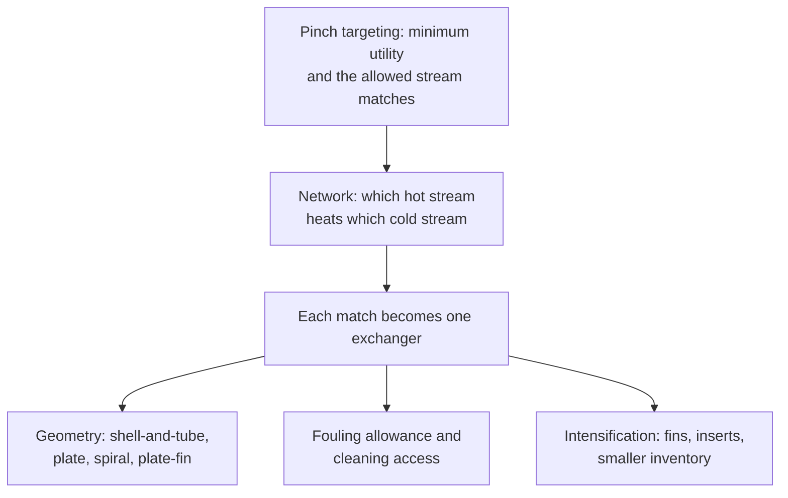

## Video Lecture

<div class="video-container">
  <iframe
    width="560"
    height="315"
    src="https://www.youtube.com/embed/fpjFV6KX1hc?start=3091"
    title="Chemical Engineering Heat Transfer Ch.5: Heat-Transfer Design and Intensification"
    frameborder="0"
    allow="accelerometer; autoplay; clipboard-write; encrypted-media; gyroscope; picture-in-picture"
    allowfullscreen>
  </iframe>
</div>

> This video covers the same content as the text below. Choose your preferred learning format.

---

# Chapter 5: Heat-Transfer Design and Intensification

This chapter closes the series by zooming out. Chapters 1 through 4 sized and analyzed one exchanger at a time; a real plant runs dozens of them as a single heat economy. Here we meet the equipment that makes each match cheap and compact, the fouling that quietly taxes all of it, the intensification that shrinks it, and the digital layer that keeps it honest.

**From Single Exchangers to the Plant's Heat Economy**

## Learning Objectives

By completing this chapter, you will be able to:

  * ✅ Explain how pinch targets set the duty that individual exchanger design must then deliver economically
  * ✅ Describe plate-and-frame, spiral, and plate-fin exchangers and state where shell-and-tube still wins
  * ✅ Treat fouling as an added resistance in series and compute the resulting loss of duty
  * ✅ Choose design and operating responses to fouling, including velocity discipline and cleaning scheduling
  * ✅ Explain why fins belong on the gas side and how intensification connects to inherently safer design
  * ✅ State what a digital twin adds to exchanger management — and what thermodynamics forbids it from beating

**Reading Time**: 20-25 minutes **Code Examples**: 1 **Exercises**: 3

* * *

## 5.1 From One Exchanger to a Network

Every previous chapter looked through a keyhole at one piece of equipment. Step back and the plant looks different: a refinery crude unit may carry forty or more exchangers, and each is a decision about which hot stream heats which cold one. Those decisions are not made exchanger by exchanger. **Pinch analysis** ([Introduction Chapter 4](../chemical-engineering-introduction/chapter-4.html)) computes the *minimum* hot and cold utility a set of streams can possibly need, before any network is drawn, and the three golden rules — no heat across the pinch, no cold utility above it, no hot utility below it — decide which matches are allowed to exist at all.

That targeting stage sets the duty. It does not build anything. Turning an allowed match into hardware is where this chapter lives, and the questions are relentlessly practical: how much surface, in what geometry, at what capital cost, surviving what fouling, cleaned how often.



The economics rhyme with the pipe sizing of *Fluid Mechanics* [Chapter 4](../chemical-engineering-fluid-mechanics/chapter-4.html). More surface costs capital once; too little costs utility every hour for twenty years. A tighter temperature approach saves energy and demands area, and area near $\Delta T_{lm} \to 0$ grows without bound — the wall [Chapter 2](chapter-2.html) put in front of us.

## 5.2 Compact Exchangers

The shell-and-tube exchanger of [Chapter 2](chapter-2.html) is the industry's default, not its optimum. Its rival in clean liquid service is the **plate-and-frame** exchanger: a stack of thin corrugated metal plates clamped in a frame, with hot and cold streams flowing in alternating narrow channels.

Four properties follow from that geometry. The corrugations trip the flow into **turbulence at low Reynolds numbers**, so the film coefficients of [Chapter 1](chapter-1.html) are high without brutal pumping. **Area density** — heat-transfer surface packed into a cubic meter of equipment — is far higher than a tube bundle can reach; typical figures run in the hundreds of m²/m³ against roughly 50–100 m²/m³ for shell-and-tube, so the same duty arrives in a fraction of the floor space. The channel arrangement gives **true counter-current** flow, so the correction factor $F$ of [Chapter 2](chapter-2.html) stays near one and approaches of 1–2 K are achievable where a shell-and-tube unit would need 5–10 K. And the frame simply **unbolts**: plates come out for inspection or mechanical cleaning in hours, and area can be added by inserting more plates.

The limits are in the seals. A **gasketed** unit — plates sealed by elastomer strips rather than welded — is only as good as its elastomer, and typical gasketed service caps out near **180–200 °C and 20–25 bar** (typical figures; check the vendor's, not this page's). Semi-welded, fully welded, and brazed variants push both limits considerably higher at the cost of the easy opening that made the type attractive. Two relatives fill niches: **spiral** exchangers, two long channels coiled around a center, tolerate slurries and fibrous fluids because each stream has one unobstructed path; **plate-fin** blocks, usually brazed aluminum, reach extreme area density and tiny approaches in cryogenic duty such as air separation and LNG.

**Standard practice** still sends large classes of service to shell-and-tube: high pressures, high temperatures, heavily fouling streams needing mechanical cleaning of straight tubes, vacuum and condensing duties with large vapor volumes, and anything where standardized mechanical codes and a century of fabrication experience shorten the project. Compact does not mean better — it means better *when the service allows it*.

## 5.3 Fouling Management

Fouling is the silent tax on every heat-transfer design. Scale, coke, corrosion products, biofilm, and settled particulate build a layer on the wall, and [Chapter 1](chapter-1.html) already tells us what a layer does: it adds a resistance in series.

$$ \frac{1}{U_{\text{fouled}}} = \frac{1}{U_{\text{clean}}} + R_f $$

Because the resistances add, the damage a given $R_f$ does depends entirely on how good the clean exchanger was. A superb $U$ has little resistance of its own, so a fouling film dominates it quickly; a mediocre one barely notices.

```python
U_CLEAN = 600.0   # W/(m2 K), clean overall coefficient
AREA = 120.0      # m2, fixed once the exchanger is built
DT_LM = 30.0      # K, log-mean temperature difference held constant

R_FOUL = [0.0, 0.0001, 0.00025, 0.0005, 0.00075, 0.001]  # m2 K/W


def fouled_U(u_clean, r_f):
    """Overall coefficient after adding a fouling resistance in series."""
    return 1.0 / (1.0 / u_clean + r_f)


def duty(u, area=AREA, dt_lm=DT_LM):
    """Q = U A dT_lm, in kW."""
    return u * area * dt_lm / 1000.0


q_clean = duty(U_CLEAN)

print(f"{'R_f [m2K/W]':>12} {'U [W/m2K]':>10} {'Q [kW]':>9} {'duty loss':>10}")
for r_f in R_FOUL:
    u = fouled_U(U_CLEAN, r_f)
    q = duty(u)
    print(f"{r_f:12.5f} {u:10.0f} {q:9.1f} {1 - q / q_clean:9.1%}")

r_half = 1.0 / U_CLEAN
print()
print(f"fouling resistance that halves the duty: {r_half:.5f} m2K/W")

#  R_f [m2K/W]  U [W/m2K]    Q [kW]  duty loss
#      0.00000        600    2160.0      0.0%
#      0.00010        566    2037.7      5.7%
#      0.00025        522    1878.3     13.0%
#      0.00050        462    1661.5     23.1%
#      0.00075        414    1489.7     31.0%
#      0.00100        375    1350.0     37.5%
#
# fouling resistance that halves the duty: 0.00167 m2K/W
```

Read the last line first. The clean exchanger's own resistance is $1/600 = 0.00167$ m²K/W, so a fouling film of exactly that size halves the duty — and a film three-tenths of it already costs 23%. Fouling factors are quoted in tables in units small enough to look negligible; they are not.

Design responses come first. **Velocity discipline** is the strongest: too slow and particulate settles and biofilm establishes, too fast and erosion and pumping cost take over, which is the economic-velocity trade of *Fluid Mechanics* [Chapter 4](../chemical-engineering-fluid-mechanics/chapter-4.html) wearing a fouling hat. Then **material and surface choice** against corrosion products and adhesion, and **geometry that can actually be cleaned** — straight tubes with removable heads for mechanical rodding, or a plate frame that unbolts. The traditional response, adding surface as a fouling allowance, has a trap: excess area at start-up means low velocity and an over-cooled wall, which can foul the unit faster than the allowance covers.

Operationally, fouling is *monitored*. Flows and four temperatures are measured on every serious exchanger anyway, so $U$ can be back-computed continuously from routine instrumentation and trended. That is a textbook **soft sensor** ([Introduction Chapter 5](../chemical-engineering-introduction/chapter-5.html)): the quantity you want is not measurable directly, so you infer it from cheap measurements you already have. Its failure modes are the usual ones — a drifting flow meter or a fouled thermowell degrades the inferred $U$ exactly like real fouling.

The trend then feeds a genuine optimization. Cleaning too often wastes production time and labor; cleaning too rarely burns extra fuel and can force a throughput cut. The optimum sits where the marginal energy cost of one more day of fouling equals the daily amortized cost of the shutdown — a scheduling problem, not a judgment call.

## 5.4 Intensification

**Process intensification** asks a sharper question than "how big must this be?" It asks how small it could be. In heat transfer the answers start with the lesson of [Chapter 1](chapter-1.html): the smallest film coefficient dominates the overall coefficient, and on any gas–liquid exchanger that is the gas side, often by two orders of magnitude.

So put the extra surface where the resistance is. **Fins** — extended metal surfaces on the gas side — multiply the area facing the weak coefficient, which is why every air cooler, radiator, and air-conditioning coil is finned on the air side and bare on the water side. **Low-fin tubes** carry short integral fins for moderate gains inside conventional shell-and-tube bundles. A **turbulator** — a twisted strip or wire coil pushed inside a tube — swirls the flow to raise the tube-side coefficient, paying in pressure drop, and is the standard retrofit when an existing exchanger falls short. A **heat pipe** goes further, using boiling and condensation of a working fluid inside a sealed tube ([Chapter 3](chapter-3.html)'s phase-change coefficients) to move heat along a passive device with almost no temperature drop.

The payoff is not only capital. Smaller equipment holds **less inventory**, and less inventory of a hot, flammable, or toxic fluid is a hazard reduced rather than controlled — Trevor Kletz's inherently safer design from [Introduction Chapter 4](../chemical-engineering-introduction/chapter-4.html), "what you don't have, can't leak," arriving as a side effect of good heat-transfer engineering. The catch is symmetrical: intensified geometries have narrow passages, so they are the least tolerant of the fouling of Section 5.3, and every intensification decision is really a bet about how clean the service stays.

## 5.5 The Digital Layer

An exchanger network is not a static object. Fouling accumulates on different streams at different rates, feeds change, ambient temperature swings, and a network optimal on the design day is merely acceptable a year later. The response is to **re-rate** the exchangers — recompute what an existing unit actually achieves under today's conditions, instead of trusting the duty on its datasheet — and to do it continuously rather than at turnaround.

That is a **digital twin** in the sense of [Introduction Chapter 5](../chemical-engineering-introduction/chapter-5.html): a model kept aligned with the plant by live data, used to answer questions the instruments do not answer directly. Fed the soft-sensed $U$ of Section 5.3, it estimates the fouling state of every unit, projects it forward, and prices the alternatives. On top of it sits optimization — which exchanger to clean at the next opportunity, how to split flow between parallel units, where to open a bypass. When each trial is expensive or slow, the sample-efficient methods of our *Bayesian Optimization* series ([series index](../bayesian-optimization/index.html)) are the right tool, exactly because you cannot afford many experiments on a running plant.

None of this repeals anything. A twin can find the cleaning schedule and the best bypass split, but it cannot transfer heat across a zero temperature difference, and it cannot recover the work destroyed when a 400 °C stream heats a 50 °C one. That destruction is the entropy generation of *Thermodynamics* [Chapter 2](../chemical-engineering-thermodynamics/chapter-2.html) — the minimum-work argument in heat-transfer clothing. Software optimizes within the floor; only the flowsheet moves the floor.

## 5.6 Series Summary

Five chapters, one sentence each. **Chapter 1** built the overall coefficient from resistances in series and showed which one dominates. **Chapter 2** turned that coefficient into hardware through $Q = UA\,\Delta T_{lm}$ and the exchanger configurations that make $\Delta T_{lm}$ meaningful. **Chapter 3** added phase change — the enormous coefficients of boiling and condensation, and the burnout and hazards that come with them. **Chapter 4** introduced radiation and its fourth-power law, which is why furnaces at high temperature are a different discipline from exchangers. **Chapter 5** assembled all of it into networks, fought fouling, and shrank the equipment.

The larger arc is the transport table from [Introduction Chapter 1](../chemical-engineering-introduction/chapter-1.html): *flux = coefficient × driving force*, three times over. **Momentum transfer** is covered in our *Chemical Engineering Fluid Mechanics* series. **Heat transfer** is this one, driven by temperature difference. **Mass transfer**, driven by concentration difference, completes the set in [Chemical Engineering Mass Transfer and Separation](../chemical-engineering-mass-transfer/index.html) — and if you have followed the logic here, its film coefficients, resistances in series, and driving forces will already look familiar.

Where to go next: *Chemical Engineering Introduction* for the unit operations these duties serve, *Chemical Engineering Thermodynamics* for the property models and the second-law floor, *Chemical Engineering Fluid Mechanics* for the flows that carry the heat, and *Process Informatics Introduction* for the data layer built on top of all of it.

Thank you for learning with us.

## Exercises

1. **Conceptual — choosing the geometry**: Specify an exchanger type for each service, with reasons. (a) 200 m³/h of clean process water cooled from 85 °C to 40 °C by cooling water, 6 barg, with a required approach of 3 K, in a plant short of floor space. (b) A 45 barg hydrocarbon stream at 320 °C that lays down coke, in continuous service between turnarounds. (c) Which of your two choices is the more exposed to the fouling arithmetic of Section 5.3, and why?
   *Hint*: check each service against the gasket and code limits of Section 5.2 before considering performance.
   *Answer*: (a) **Plate-and-frame.** Clean liquid–liquid duty well inside typical gasketed limits (~180–200 °C, ~20–25 bar), and the 3 K approach is where the type excels: true counter-current flow keeps $F$ near one, while high area density fits the duty into little floor space. The frame also unbolts for cleaning and accepts extra plates if duty grows. (b) **Shell-and-tube**, straight tubes with a removable head. The pressure and temperature exclude a gasketed plate unit outright, and a coking service must be cleaned mechanically — rodding straight tubes is routine, whereas coke in narrow plate channels is not recoverable by chemical cleaning alone. Standardized mechanical codes and fabrication experience apply here too. (c) **The plate unit is more exposed in principle**: its clean $U$ is high, so its own resistance is small and a given fouling film destroys a larger fraction of it. That it is nonetheless the right choice in (a) is precisely because the service is clean and the frame opens; the coking stream in (b) fouls far harder but is put in the geometry that can be cleaned.

2. **Quantitative — the cost of a fouling film**: An exchanger is designed for $U_{\text{clean}} = 600$ W/(m²·K). In service it accumulates a fouling resistance $R_f = 0.0005$ m²K/W. (a) Compute $U_{\text{fouled}}$. (b) By what percentage does the duty fall, at fixed area and fixed $\Delta T_{lm}$? (c) How much extra area would have been needed at the design stage to still deliver the clean duty in the fouled state?
   *Hint*: resistances add, so work with $1/U$; duty is $Q = UA\,\Delta T_{lm}$, so at fixed $A$ and $\Delta T_{lm}$ the duty ratio is just the $U$ ratio.
   *Answer*: (a) $1/U_{\text{fouled}} = 1/600 + 0.0005 = 0.001667 + 0.0005 = 0.002167$ m²K/W, so $U_{\text{fouled}} = \mathbf{462\ W/(m^2 \cdot K)}$ (461.5 before rounding). (b) With $A$ and $\Delta T_{lm}$ fixed, $Q \propto U$, so the loss is $1 - 462/600 = \mathbf{23\%}$ — 23.1% using the unrounded value, matching the $R_f = 0.0005$ row of the Section 5.3 output. (c) Restoring the duty needs the area scaled by the inverse ratio, $600/461.5 = 1.30$, i.e. **about 30% more surface**. That is what a fouling allowance buys, and Section 5.3's warning applies: the oversized unit runs slower and cooler on day one, which can accelerate the very fouling it was sized for.

3. **Discussion — when to clean**: An exchanger's back-computed $U$ has fallen 18% over eight months. Cleaning it costs a two-day shutdown of the unit. (a) What data would you need to decide when to clean? (b) Why is the back-computed $U$ a soft sensor, and how could it mislead you? (c) Where does a digital twin add value here, and what can it not do?
   *Hint*: frame it as a cost balance per day, then ask what could make the measured decline not be fouling.
   *Answer*: (a) The extra utility cost per day at the degraded $U$ (fuel or steam price times the added duty, or the value of any throughput cut it forces), the total cost of the shutdown including lost production, the cleaning cost itself, and the shape of the fouling curve — whether the resistance is still climbing steeply or has asymptoted. Clean when the marginal daily energy penalty exceeds the daily amortized cost of the shutdown; a network makes this harder, because cleaning one unit shifts duty onto others. (b) It infers an unmeasured quantity, the fouling state, from cheap routine measurements — flows and four temperatures — through a model, $U = Q/(A\,\Delta T_{lm})$. It misleads when the inputs drift: a miscalibrated flow meter, a thermowell in a stagnant pocket, or a lower feed rate reducing velocity all lower the computed $U$ without any deposit forming. Check for a step change against a gradual decline, and cross-check against pressure drop, which rises as deposits narrow the channel. (c) A twin re-rates every unit against current conditions, separates fouling from feed and ambient effects, projects the trend, and evaluates cleaning schedules and bypass splits before committing — with Bayesian optimization appropriate when each trial on the running plant is expensive. What it cannot do is beat the thermodynamic floor: no schedule recovers heat across a vanishing temperature difference, and no model undoes the work destroyed by a large-$\Delta T$ match. Removing that loss requires changing the network, which is a pinch-analysis question, not a modeling one.
