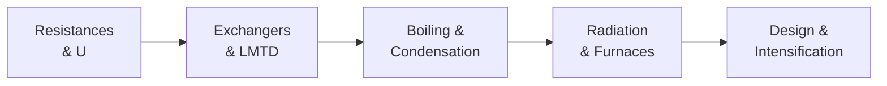

## Video Lecture

  <iframe
    width="560"
    height="315"
    src="https://www.youtube.com/embed/fpjFV6KX1hc"
    title="Chemical Engineering Heat Transfer - Full Series"
    frameborder="0"
    allow="accelerometer; autoplay; clipboard-write; encrypted-media; gyroscope; picture-in-picture"
    allowfullscreen>
  </iframe>

> The whole series is available as a single video with chapter markers. Each chapter page starts this video at that chapter.

---

# Chemical Engineering Heat Transfer

**Conduction, Convection, Radiation, and the Exchangers That Run the Plant**

Reboilers and condensers dominate a plant's utility bill, and nearly every stream is heated or cooled somewhere on the flowsheet. This course continues the transport-phenomena arc of our chemical engineering curriculum — momentum transfer came first, heat transfer is second, and mass transfer completes the trio in our **Chemical Engineering Mass Transfer and Separation** series.

## Series Overview

1. **Resist** — conduction, convection, and thermal resistances in series
2. **Size** — the log-mean temperature difference turns duty into exchanger area
3. **Change** — boiling and condensation: the best and most dangerous heat transfer
4. **Radiate** — the fourth-power law and the furnaces it governs
5. **Design** — compact exchangers, fouling management, and intensification

## Chapters

| Chapter | Title | What You Will Learn |
|---------|-------|---------------------|
| 1 | [Conduction, Convection, and the Overall Coefficient](chapter-1.html) | Fourier's law, film coefficients, resistances in series, fouling |
| 2 | [Heat Exchangers and the LMTD](chapter-2.html) | Counter-current vs co-current, log-mean temperature difference, a complete sizing, ε-NTU |
| 3 | [Boiling, Condensation, and Evaporators](chapter-3.html) | The boiling curve and critical heat flux, filmwise condensation, multiple-effect evaporation |
| 4 | [Radiation and Furnaces](chapter-4.html) | The Stefan–Boltzmann law, emissivity, when radiation dominates, fired heaters |
| 5 | [Heat-Transfer Design and Intensification](chapter-5.html) | Plate exchangers, fouling management, enhanced surfaces, the digital layer |

## Who This Series is For

- **Students** continuing the transport arc from our Fluid Mechanics series into process heat
- **Engineers and researchers** who size exchangers, troubleshoot fouling, or work around fired equipment
- **Data scientists** monitoring exchanger performance data who want the physics behind a drifting U

Recommended preparation: Chemical Engineering Introduction and Fluid Mechanics; the Thermodynamics series supplies the energy-balance and vapor-pressure connections. Mathematics stays at algebra with a few worked calculations.

## Related Series

Part of the classical-fundamentals track with **Chemical Engineering Introduction**, **Chemical Engineering Thermodynamics**, and **Chemical Engineering Fluid Mechanics**. **Chemical Engineering Mass Transfer and Separation** completes the transport trio. Data-driven companions: **Process Informatics Introduction** and **Introduction to Process Monitoring and Control**.
