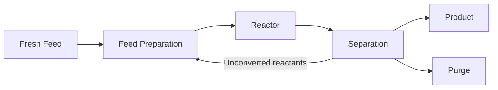

# Chapter 1: What is Chemical Engineering?

This chapter explains why industrial-scale chemistry is a different discipline from bench chemistry, introduces the two ideas that organize the whole field — **unit operations** and **balances** — and teaches you to read a process flowsheet.

**Unit Operations, Balances, and the Language of Processes**

## Learning Objectives

By completing this chapter, you will be able to:

  * ✅ Explain why a reaction that works in a flask does not simply scale to an industrial reactor
  * ✅ Define a unit operation and name the major ones by purpose
  * ✅ Write and solve a steady-state material balance
  * ✅ Read a block flow diagram and explain the role of a recycle stream
  * ✅ Describe the shared structure of momentum, heat, and mass transfer

**Reading Time**: 20-25 minutes **Code Examples**: 1 **Exercises**: 3

* * *

## 1.1 From Chemistry to Chemical Engineering

A chemist gets a reaction to work in a 100 mL flask. The yield is good, the product is pure. Now make ten thousand tonnes of it a year.

This is not the same problem, and the reason is geometry. Run the reaction in a 100 m³ reactor — a million times the volume — and the vessel is about **100 times larger in each direction**. Heat is generated throughout the *volume*, but removed through the *wall*:

- **Heat generation** ∝ volume ∝ L³ (grows 10⁶×)
- **Heat removal** ∝ surface area ∝ L² (grows 10⁴×)
- **Surface-to-volume ratio** ∝ 1/L — it *falls* by a factor of 100

An exotherm the flask shed harmlessly now has one-hundredth the relative cooling surface. Left unaddressed, the temperature runs away. The same argument applies to mixing (a second in a flask, minutes in 100 m³), to mass transfer between phases, and to the plain fact that a lab spill is a paper towel while an industrial one is an emergency.

> **Chemical engineering is the discipline of designing and operating processes that transform matter and energy at industrial scale — safely, reliably, and economically.**

Chemistry answers *what reaction occurs*. Chemical engineering answers *at what rate, in what equipment, at what cost, and what happens when something goes wrong*.

## 1.2 Unit Operations: The Founding Abstraction

In **1915**, **Arthur D. Little** — writing to MIT about how chemical engineering should be taught — argued that any process, however complicated, decomposes into a modest set of recurring physical steps. He called them **unit operations**. The idea reorganized the field: instead of teaching "sulfuric acid manufacture" and "soap manufacture" as separate recipes, you teach distillation, heat exchange, and filtration once, as engineering subjects in their own right.

| Purpose | Unit Operations | Principle Exploited |
|---|---|---|
| **Separation** | Distillation, absorption, extraction, adsorption, membrane separation, crystallization, drying, filtration | Differences in volatility, solubility, affinity, size, or phase |
| **Heat transfer** | Heat exchangers, evaporators, condensers | Temperature difference driving a heat flux |
| **Fluid handling** | Pumps, compressors, piping, mixing | Pressure difference and momentum transfer |
| **Reaction** | Reactors of many types — **Chapter 2** | Kinetics and thermodynamics |

The power of the abstraction is **transferability**. Learn distillation properly — vapor–liquid equilibrium, trays, reflux (returning part of the condensed overhead to the column), energy cost — and you can work on crude-oil fractionation in a refinery, an ethanol–water column in a bioethanol plant, or a cryogenic column separating nitrogen from oxygen in air. The fluids differ; the engineering is the same. Separations dominate the table for a reason: in most plants the reactor is a small fraction of the equipment, and most of the capital and energy goes into purifying what leaves it.

## 1.3 Mass and Energy Balances: The Grammar

If unit operations are the vocabulary, **balances** are the grammar. Every quantitative claim a chemical engineer makes rests on conservation, written for a defined region of space called the **control volume**:

```
accumulation = in − out + generation − consumption
```

Total mass is conserved, so generation and consumption appear only when you track a chemical *species* that reacts. At **steady state** — the normal condition of a continuous plant, where nothing changes with time — accumulation is zero and the balance becomes algebra you can solve by hand.

### Worked Example: Splitting Ethanol and Water

A distillation column is fed **F = 100 kg/h** of a mixture containing **10 wt% ethanol**. It produces a distillate **D** at **90 wt% ethanol** and a bottoms stream **B** at **1 wt% ethanol**. Nothing reacts. How much distillate does the column make?

Write two balances over the whole column — **overall mass** and **ethanol**:

```
F = D + B                →   100 = D + B
0.10 × 100 = 0.90 D + 0.01 B   →   10 = 0.90 D + 0.01 B
```

Substitute B = 100 − D into the ethanol balance:

```
10 = 0.90 D + 0.01 (100 − D) = 0.89 D + 1
0.89 D = 9
D = 10.11 kg/h      B = 89.89 kg/h
```

Always check: ethanol out = 0.90 × 10.11 + 0.01 × 89.89 = 9.10 + 0.90 = **10.0 kg/h**, equal to the ethanol in. Of the 10 kg/h fed, 9.10 kg/h leaves in the distillate — a **91% recovery**. Two equations, two unknowns, and nothing about the column's internals was needed. That is the characteristic move of the discipline: bound the problem with conservation first, then worry about mechanism. In code:

```python
import numpy as np

# Unknowns: D (distillate, kg/h), B (bottoms, kg/h)
# Row 1: overall mass balance      D +      B = 100
# Row 2: ethanol balance      0.90 D + 0.01 B = 0.10 * 100
A = np.array([[1.00, 1.00],
              [0.90, 0.01]])
b = np.array([100.0, 10.0])

D, B = np.linalg.solve(A, b)
print(f"D = {D:.2f} kg/h,  B = {B:.2f} kg/h")       # D = 10.11 kg/h,  B = 89.89 kg/h
print(f"ethanol out = {0.90*D + 0.01*B:.2f} kg/h")  # 10.00 kg/h
```

An **energy balance** works identically, with enthalpy — the energy content of a stream — in place of mass, and it turns this tidy result into a cost: separating ethanol from water means boiling the mixture — and vaporizing 1 kg of water at 100 °C and atmospheric pressure takes about **2,257 kJ**. Distillation is among the largest energy consumers in the chemical industry, so the energy balance, not the mass balance, usually decides whether a process is worth building. (A caution for later: ethanol and water form an azeotrope near 95.6 wt% ethanol at 1 atm, so ordinary distillation cannot exceed that purity.)

## 1.4 Reading a Process: Flowsheets

Processes are communicated as **flowsheets**, at three levels of detail:

| Diagram | Shows | Used For |
|---|---|---|
| **Block Flow Diagram (BFD)** | Process sections as boxes, main streams | Concept, teaching, overall balances |
| **Process Flow Diagram (PFD)** | Individual equipment, stream conditions, heat-and-material balance table | Process design and evaluation |
| **P&ID** | Every pipe, valve, instrument, control loop | Construction, operation, safety — **Chapter 4** |

Nearly every continuous process has the same skeleton:



The arrow returning from separation to the front is a **recycle stream**, one of the most consequential features in process design.

**Why recycle is essential**: reactors rarely convert all of the feed in one pass — equilibrium may forbid it, or the conditions needed to force high conversion may wreck selectivity. Discarding unconverted reactant would waste raw material, usually the largest operating cost. Recycling lets a reactor with modest single-pass conversion reach high **overall** conversion.

**Why recycle makes design harder**: it couples everything. Change the reactor temperature and the separation duty changes; change the separation and the reactor feed changes, which changes the reactor again. The flowsheet can no longer be solved unit by unit — it must be converged iteratively, which is what process simulators do. Recycle loops also accumulate whatever enters but cannot leave — an inert in the feed, or a by-product the separation misses — which is what the small **purge** stream is for: discarding a slice of the recycle to hold impurities steady. Recycle also carries disturbances back to the front of the plant, a control problem taken up in Chapter 3.

## 1.5 Transport Phenomena: The Physics Underneath

Unit operations look like a list of unrelated devices. They are not. In **1960**, **Bird, Stewart, and Lightfoot** published *Transport Phenomena*, which unified them by showing that momentum, heat, and mass transfer obey laws of the same shape:

```
flux = coefficient × driving force
```

A *flux* is an amount passing through unit area per unit time; the *driving force* is a gradient — how steeply a property changes with position.

| Transported Quantity | Law | Coefficient | Driving Force |
|---|---|---|---|
| **Momentum** | Newton's law of viscosity | Viscosity (μ) | Velocity gradient |
| **Heat** | Fourier's law of conduction | Thermal conductivity (k) | Temperature gradient |
| **Mass** (of a species) | Fick's law of diffusion | Diffusivity (D) | Concentration gradient |

All three transport in the direction that flattens the gradient: momentum from fast fluid to slow, heat from hot to cold, a species from concentrated to dilute. The payoff is practical — a result derived for one transport problem often carries over to the others, and the same equipment features (turbulence, thin films, large interfacial area) improve all three at once.

## 1.6 Where Chemical Engineers Work

The toolbox is industry-agnostic, which is why the degree travels so well:

- **Petroleum and petrochemicals** — the classical home of large-scale continuous processing
- **Pharmaceuticals** — mostly batch: crystallization, drying, strict regulation
- **Food and beverage** — evaporation, drying, sterilization, fermentation
- **Semiconductors** — ultrapure gases and water, thin-film deposition, contamination control
- **Batteries and energy** — slurry mixing, coating, drying, electrolyte handling, recycling
- **Environmental and water** — pollutant absorption, membrane treatment, carbon capture

A distillation column in a refinery and an evaporator in a dairy are the same unit operation obeying the same balances. The chemistry changes; the engineering transfers.

## 1.7 Chapter Summary

- Scale changes the physics: heat generation grows with volume (L³) while heat removal grows with area (L²), so surface-to-volume ratio falls as equipment grows — bench results do not transfer automatically
- **Unit operations** (Arthur D. Little, 1915) decompose any process into reusable steps: separation, heat transfer, fluid handling, and reaction
- **Balances** (accumulation = in − out + generation − consumption) reduce at steady state to algebra, as in the 100 kg/h column giving D = 10.11 kg/h and B = 89.89 kg/h
- Energy balances, not mass balances, usually decide whether a process is economic
- **Flowsheets** come as BFD, PFD, and P&ID; **recycle** makes processes economical while coupling every unit to every other, requiring purges and iterative solution
- **Transport phenomena** unify the field: momentum, heat, and mass transfer all follow flux = coefficient × driving force

**Next chapter**: the reactor at the center of the flowsheet — how reaction rates, reactor types, and residence time set conversion and selectivity.

## Exercises

1. **Conceptual — scale-up**: A reaction runs in a 1 L stirred flask and is scaled to a geometrically similar 1,000 L vessel. By what factor does the linear dimension grow, the wall heat-transfer area grow, and the surface-to-volume ratio change? Name two design responses that restore adequate cooling.
   *Hint*: take the cube root of the volume ratio first; then think about heat-transfer area that is not the vessel wall.
   *Answer*: Volume ×1,000, so the linear dimension grows by the cube root: **×10**. Wall area scales as L², so **×100**. Surface-to-volume scales as 1/L, so it **falls to one tenth** — each liter of contents has only 10% of the cooling surface it had in the flask. Design responses: add heat-transfer area that is not the wall (**internal cooling coils**, or an **external heat-exchange loop** pumping contents through an exchanger), or cut the heat-release rate by **semi-batch dosing** — feeding the limiting reactant slowly so generation never exceeds what the cooling can remove.

2. **Quantitative — material balance**: A dryer receives 500 kg/h of wet solid at 20 wt% water and produces product at 2 wt% water; water leaves only as vapor. Compute the dried-product flow and the water evaporated per hour, then check that total mass in equals total mass out.
   *Hint*: the dry solid passes through unchanged — balance it first and only one unknown remains.
   *Answer*: Dry solid in = 0.80 × 500 = **400 kg/h**, and it all leaves in the product, where it is 98 wt%: product = 400 / 0.98 = **408.16 kg/h**. Water evaporated = 500 − 408.16 = **91.84 kg/h**. Check: 408.16 + 91.84 = 500 kg/h in = out. ✓

3. **Discussion — recycle**: A reactor converts only 40% of reactant A per pass, but the separation section recovers essentially all unconverted A and returns it. Explain why *overall* conversion can still approach 100%, why a small inert in the feed must be purged, and what goes wrong if the purge rate is too high or too low.
   *Hint*: distinguish single-pass from overall conversion; an inert has no exit but the purge.
   *Answer*: **Overall conversion → ~100%** because unconverted A is not lost: it is returned to the reactor and gets further chances, so at steady state essentially all *fresh* A fed eventually becomes product even though each pass converts only 40%. An **inert** entering with the feed does not react and is not taken off with the product, so the recycle loop is its only home — without a purge it accumulates without limit. The purge rate is a trade-off: **too high** wastes recycled reactant along with the inert (raw-material cost, the largest operating cost); **too low** lets inerts build up, diluting the reactor feed, lowering the reaction rate, and enlarging every recycle-loop unit.
