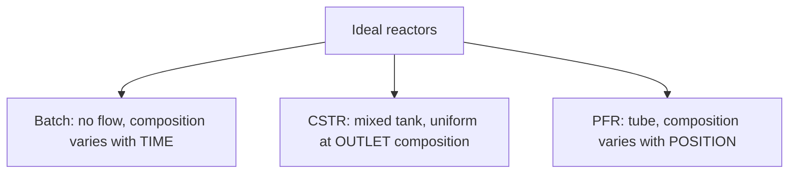
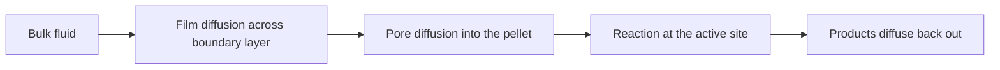

# Chapter 2: Reaction Engineering Fundamentals

This chapter introduces the reactor — the one unit where molecules actually change identity — and the handful of quantities engineers use to describe it: conversion, selectivity, yield, reaction rate, and residence time.

**Rates, Reactors, and Conversion**

## Learning Objectives

By completing this chapter, you will be able to:

  * ✅ Define conversion, selectivity, and yield, and explain why selectivity often matters more
  * ✅ Write a power-law rate law and explain reaction order
  * ✅ Use the Arrhenius equation to explain why rates are so temperature-sensitive
  * ✅ Compare batch, CSTR, and PFR reactors and their mixing assumptions
  * ✅ Size a simple first-order reactor using residence time
  * ✅ Describe why real catalytic reactors deviate from ideal behavior

**Reading Time**: 20-25 minutes **Code Examples**: 1 **Exercises**: 3

* * *

## 2.1 The Reactor is the Heart of the Process

Chapter 1's unit operations — mixing, heating, separating, pumping — all move material around or change its physical state. Only the **reactor** changes what the molecules *are*.

Here is the surprise for newcomers: the reactor is often **not** the most expensive equipment in a plant; separation trains, heat exchangers, and compressors frequently cost more. Yet it governs everything, because **what leaves the reactor sets the size of every unit downstream**. A reactor that leaves half the feed unreacted forces a large recycle loop. One that makes an unwanted byproduct forces an extra distillation column, forever.

Three numbers describe reactor performance. Take a reactant **A** that can go two ways: A → **P** (desired) or A → **W** (byproduct). We label the byproduct W so that the letter S is reserved for selectivity below.

| Quantity | Definition | Meaning |
|---|---|---|
| **Conversion** (X) | moles A reacted ÷ moles A fed | How much feed was used up |
| **Selectivity** (S) | moles P formed ÷ moles A reacted | Where the reacted A went |
| **Yield** (Y) | moles P formed ÷ moles A fed | Overall usefulness; **Y = X · S** (exact for one-to-one stoichiometry, A → P, as assumed here) |

Feed 100 mol of A to two candidate reactors:

- **Reactor 1**: 90 mol reacted, 63 mol P, 27 mol W → X = 90%, S = 70%, Y = 63%
- **Reactor 2**: 60 mol reacted, 57 mol P, 3 mol W → X = 60%, S = 95%, Y = 57%

Reactor 1 has the higher yield, yet most process engineers would still prefer Reactor 2:

1. **Unconverted feed is recoverable; wasted feed is not.** The 40 mol of A leaving Reactor 2 can be separated and recycled. The 27 mol converted to W in Reactor 1 is destroyed raw material — money that never comes back.
2. **Byproducts must be removed.** That W must be separated, purified or disposed of, and often treated as waste — capital and operating cost forever.

Hence the standard engineering instinct: **conversion can be bought with a bigger reactor or a recycle loop; selectivity usually cannot.** Selectivity is a chemistry problem, solved through catalysts, temperature, and concentration.

## 2.2 Reaction Rates

The **reaction rate** is how fast a reaction consumes reactant per unit volume per unit time (e.g. mol L⁻¹ s⁻¹). For introductory work we use a **power-law rate law**:

$$ r = k \cdot C_A^{\,n} $$

where $C_A$ is the concentration of A, $k$ is the **rate constant**, and $n$ is the **reaction order**.

Order is fitted to data, not read off the stoichiometry. **First order** ($n = 1$): doubling concentration doubles the rate. **Second order** ($n = 2$): doubling it quadruples the rate. **Zero order** ($n = 0$): the rate is independent of concentration — common when a catalyst surface is saturated. First order is the workhorse of introductory design because it has clean closed-form answers, used below.

### Temperature: The Arrhenius Equation

The rate constant depends on temperature through the **Arrhenius equation**:

$$ k = A \cdot \exp\!\left(\frac{-E_a}{RT}\right) $$

Here $A$ is the pre-exponential factor, $E_a$ the activation energy (typically 50–100 kJ/mol), $R$ = 8.314 J mol⁻¹ K⁻¹, and $T$ the **absolute** temperature in kelvin.

The exponential is the whole story. A well-known rule of thumb says that **near room temperature a 10 °C rise roughly doubles the rate**. Treat it as the rough heuristic it is — the doubling corresponds to $E_a \approx 53$ kJ/mol. From 298 K to 308 K:

| Activation energy | Rate increase for +10 °C |
|---|---|
| 50 kJ/mol | ≈ 1.9× |
| 75 kJ/mol | ≈ 2.7× |
| 100 kJ/mol | ≈ 3.7× |

So the honest version is: *for typical activation energies, +10 °C multiplies the rate by roughly two to four.*

Rate is only half the story: thermodynamics adds a second, independent limit — no rate law and no catalyst can push conversion past chemical equilibrium, and for an exothermic reaction a higher temperature actually *lowers* the equilibrium conversion, so speed and attainable conversion pull in opposite directions.

This makes temperature **the most powerful knob an operator has, and the most dangerous**. Most industrial reactions are exothermic. If cooling cannot remove heat as fast as the reaction generates it, temperature rises, which raises the rate exponentially, which releases heat faster still. That feedback loop is a **thermal runaway**, behind many of the industry's worst accidents. Holding a reactor at temperature is a **control** problem (Chapter 3); designing it so runaway cannot occur is a **safety and design** problem (Chapter 4).

## 2.3 The Three Ideal Reactors

Reaction engineering tames real reactors with three idealizations:



| | **Batch** | **CSTR** | **PFR** |
|---|---|---|---|
| **Flow** | None (closed vessel) | Continuous in and out | Continuous through a tube |
| **Mixing** | Perfectly mixed | Perfectly mixed | None along the flow |
| **Concentration** | Falls with time | Uniform, equal to outlet | Falls along the tube |
| **Typical use** | Pharmaceuticals, specialty chemicals | Liquid-phase reactions, fermentation | Gas-phase, packed catalyst beds |

The key design variable for continuous reactors is the **residence time**:

$$ \tau = \frac{V}{v} $$

with $V$ the reactor volume and $v$ the volumetric feed rate (for constant-density systems) — the average time a fluid element spends inside.

### The Key Insight: PFR Beats CSTR

At the same temperature and target conversion, **a PFR needs less volume than a CSTR**, entirely because of concentration. A PFR sees the full range: high at the inlet (fast), falling toward the outlet. A CSTR is perfectly mixed, so **its entire volume sits at the low outlet concentration**, the slowest condition for that duty.

For a first-order reaction the penalty has a closed form:

$$ \frac{V_{CSTR}}{V_{PFR}} = \frac{X/(1-X)}{\ln\!\big(1/(1-X)\big)} $$

At 90% conversion this is $9/\ln 10 = 9/2.303 \approx \mathbf{3.9}$ — nearly four times larger. The penalty grows sharply with conversion, which is why high-conversion industrial reactors are usually tubular, and why CSTRs are often placed in series to approximate a PFR.

## 2.4 Designing a Simple Reactor

A first-order liquid-phase reaction has $k = 0.5$ min⁻¹. We want **95% conversion** from a **100 L/min** feed.

**Option A — PFR**:

$$ \tau = \frac{\ln\!\big(1/(1-X)\big)}{k} = \frac{\ln 20}{0.5} = \frac{2.996}{0.5} \approx 6.0\ \text{min} \quad\Rightarrow\quad V \approx \mathbf{600\ L}\ \text{(599 L exactly)} $$

**Option B — a single CSTR**:

$$ \tau = \frac{X}{k(1-X)} = \frac{0.95}{0.5 \times 0.05} = 38\ \text{min} \quad\Rightarrow\quad V = 38 \times 100 = \mathbf{3800\ L} $$

The CSTR needs **more than six times the volume** for the same job. The penalty at 95% (6.3×) is far worse than at 90% (3.9×): the last few percent of conversion in a well-mixed tank are brutally expensive.

```python
import math

k = 0.5    # 1/min, first-order rate constant
v = 100.0  # L/min, volumetric feed rate

print(f"{'X':>6} {'tau_PFR':>9} {'V_PFR':>9} {'tau_CSTR':>10} {'V_CSTR':>10} {'ratio':>7}")
for X in [0.50, 0.80, 0.90, 0.95, 0.99]:
    tau_pfr  = math.log(1.0 / (1.0 - X)) / k    # PFR, first order
    tau_cstr = X / (k * (1.0 - X))              # CSTR, first order
    print(f"{X:6.2f} {tau_pfr:9.2f} {tau_pfr*v:9.1f} "
          f"{tau_cstr:10.2f} {tau_cstr*v:10.1f} {tau_cstr/tau_pfr:7.2f}")

#      X   tau_PFR     V_PFR   tau_CSTR     V_CSTR   ratio
#   0.50      1.39     138.6       2.00      200.0    1.44
#   0.80      3.22     321.9       8.00      800.0    2.49
#   0.90      4.61     460.5      18.00     1800.0    3.91
#   0.95      5.99     599.1      38.00     3800.0    6.34
#   0.99      9.21     921.0     198.00    19800.0   21.50
```

The last row is the lesson: at 99% conversion the CSTR needs over **twenty times** the PFR volume.

## 2.5 Catalysis and Real Reactors

Everything above assumed a clean single-phase reaction; industrially that is the exception. A standard textbook figure is that **roughly 90% of industrial chemical processes involve a catalyst** — a substance that speeds up a reaction by lowering its activation energy without being consumed.

| | **Homogeneous** | **Heterogeneous** |
|---|---|---|
| **Phase** | Same phase as reactants (dissolved) | Solid catalyst, fluid reactants |
| **Advantage** | Every site accessible; high selectivity | Easy separation — the fluid flows past |
| **Drawback** | Must be separated from the product | Reactants must reach the surface |
| **Example** | Acid catalysis in solution | Ammonia synthesis, catalytic cracking |

That last drawback is why a real **packed-bed reactor** deviates from the ideal PFR: before reacting on a solid catalyst, a molecule must complete extra transport steps.



If **film diffusion** or **pore diffusion** is slower than the chemistry, the observed rate is set by transport, not by the rate law. The reactor then runs slower than predicted and responds only weakly to temperature, since diffusion is far less temperature-sensitive than an Arrhenius rate constant. A reactor that stops speeding up when you raise the temperature is usually diffusion-limited.

Real reactors also drift. **Catalyst deactivation** — coking (carbon deposits), poisoning (impurities such as sulfur binding to active sites), or sintering (active particles fusing at high temperature) — steadily reduces activity. Operators compensate by slowly raising the temperature to hold conversion constant, until the catalyst must be regenerated or replaced. Managing that drift is exactly what process monitoring and control exist for.

## 2.6 Chapter Summary

- The reactor is rarely the plant's biggest cost, but its **conversion and selectivity set the size of everything downstream**
- **Y = X · S**: unconverted feed can be recycled; feed turned into byproduct is lost forever — so selectivity often outranks conversion
- Power-law rate law $r = k C_A^n$; the order $n$ is fitted to data, not read from stoichiometry
- Arrhenius makes rates **exponentially** temperature-sensitive: +10 °C multiplies the rate by roughly 2–4×, making temperature the most powerful and most dangerous knob
- Three ideal reactors — **batch** (varies with time), **CSTR** (uniform at outlet conditions), **PFR** (varies with position); residence time $\tau = V/v$ is the design variable
- A CSTR runs its whole volume at the slow outlet concentration: ≈3.9× the PFR volume at 90% conversion, ≈6.3× at 95%
- Most industrial processes are catalytic; film and pore diffusion plus deactivation make real reactors deviate from ideal models

**Next chapter**: a reactor only performs as designed if it stays at its design temperature, pressure, and flow rate. Holding it there — against disturbances, drift, and deactivation — is **process control**.

## Exercises

1. **Conceptual — conversion vs. selectivity**: Design 1 gives X = 95%, S = 60%; Design 2 gives X = 70%, S = 92%. (a) Compute each yield. (b) Which would you recommend, and what could change your answer?
   *Hint*: Y = X · S. Think about the fate of the unreacted A and of the byproduct W.
   *Answer*: (a) Design 1: Y = 0.95 × 0.60 = **57%**; Design 2: Y = 0.70 × 0.92 = **64.4%**. (b) Design 2 wins on both yield and selectivity, so it is the clear choice — unless unreacted A cannot be separated from P economically, in which case Design 2's recycle loop becomes expensive and Design 1's higher single-pass conversion gains value.

2. **Quantitative — reactor sizing**: A first-order liquid-phase reaction has k = 0.2 min⁻¹ with a 50 L/min feed, targeting 80% conversion. Compute (a) the PFR volume, (b) the single-CSTR volume, (c) the ratio.
   *Hint*: τ_PFR = ln(1/(1−X))/k, τ_CSTR = X/(k(1−X)), then V = τ · v.
   *Answer*: (a) τ_PFR = ln 5 / 0.2 = 8.05 min → V ≈ **402 L**. (b) τ_CSTR = 0.8/(0.2 × 0.2) = 20 min → V = **1000 L**. (c) Ratio ≈ **2.5** — far smaller than the 6.3× penalty at 95%, showing how steeply the CSTR penalty grows near 100%.

3. **Discussion — temperature and diffusion**: An engineer raises a packed-bed reactor's temperature by 10 °C but conversion rises only ~3%, far less than Arrhenius predicts. Give two explanations and one experiment to distinguish them.
   *Hint*: Consider what limits the rate besides the chemistry.
   *Answer*: (1) The reactor is **diffusion-limited** — film or pore diffusion controls the observed rate, and diffusion is only weakly temperature-dependent. (2) The reaction is near **equilibrium**, so higher conversion is thermodynamically blocked (and for an exothermic reaction, higher temperature actually lowers equilibrium conversion). Distinguishing experiment: crush the pellets smaller and re-run. If the rate rises, pore diffusion was limiting; if not, test a fresh catalyst charge under identical conditions to separate equilibrium from catalyst deactivation.
