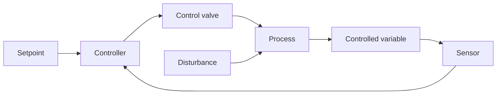

# Chapter 3: Process Control Fundamentals

This chapter explains why a chemical plant needs automatic control, how the feedback loop works, what the P, I, and D terms of a PID controller do, and why process dynamics make control harder than it looks.

**Keeping the Plant Where You Want It**

## Learning Objectives

By completing this chapter, you will be able to:

  * ✅ Explain why a plant does not stay at steady state, and rank control objectives from safety to profit
  * ✅ Trace a feedback loop from sensor through controller to control valve
  * ✅ Describe what P, I, and D contribute, and why most industrial loops run as PI
  * ✅ Explain how time constants and dead time limit how tightly a loop can be tuned
  * ✅ Recognize cascade, feedforward, and ratio control, and where MPC sits above them

**Reading Time**: 20-25 minutes **Code Examples**: 1 **Exercises**: 3

* * *

## 3.1 Why Control?

Chapter 1's balances assumed steady state — nothing changing with time. That is a convenient fiction. A real plant never holds steady by itself: **feed composition drifts**, **ambient conditions change**, **catalysts deactivate**, exchangers foul, and **demand changes** week to week. Left alone, a process wanders from its design point. **Process control** measures what the plant is doing and continuously adjusts it back. Its objectives rank in this priority order, highest first:

| Objective | Example |
|---|---|
| **Safety** | Stay below runaway temperature |
| **Environmental compliance** | Stay within emission permits |
| **Equipment protection** | Avoid cavitation (vapor bubbles collapsing in pumps), compressor surge (violent flow reversal), thermal shock |
| **Product quality** | Hold purity in specification |
| **Profit** | Run near the limiting constraint |

When objectives conflict, a control system gives up profit before it gives up safety.

### The motivating example: an exothermic reactor

Chapter 2 gave a rule of thumb from the Arrhenius equation — a 10 °C rise roughly **doubles the reaction rate** (2–4× for typical activation energies). Put an exothermic reaction in a cooled reactor: a temperature rise speeds the reaction, which releases heat faster, which raises the temperature further. Jacket cooling, meanwhile, grows only in rough proportion to the temperature difference. So near any given operating point the question is which of the two rises faster with temperature. If heat generation rises with temperature faster than heat removal does, the balance tips: the temperature accelerates away instead of settling. That is **thermal runaway**. Whether it can happen is not decided by the chemistry alone — it depends on the design and on the operating point chosen, which is exactly what makes exothermic reactors demanding to design (Chapter 4) and to control (this chapter).

## 3.2 The Feedback Loop

A **sensor** measures the controlled variable. A **controller** compares it with the **setpoint** and computes the **error**. An **actuator** — almost always a **control valve** — changes a manipulated variable such as cooling-water or steam flow. The process responds, and the cycle repeats.



The disturbance enters the process directly, not through the controller. This gives feedback two jobs: **disturbance rejection** (setpoint fixed, loop fights off upsets — what most loops do most of the time) and **setpoint tracking** (the target moves during a rate or grade change). Feedback has one defining limitation: **the controller acts only after the error exists.** It cannot prevent an upset, only correct it — the gap feedforward (Section 3.5) attacks.

### The 80/20 reality

A large plant may run several thousand loops, and the overwhelming majority are simple **single-input, single-output (SISO) feedback loops**: one measurement, one setpoint, one valve. Multivariable schemes get the conference papers, but plants run on ordinary flow, level, pressure, and temperature loops, and the final control element is a control valve in nearly all of them. Valves also carry the **fail-safe** philosophy: each moves to a safe position if instrument air is lost.

## 3.3 PID Control

The workhorse of industry is the **PID controller**: surveys of industrial practice consistently find that the great majority of plant loops are PID-type, and that most run as **PI**, with derivative switched off. PID computes its output from the error *e = setpoint − measurement* using three terms — the **present, past, and future** of the error:

| Term | Reads | Effect |
|---|---|---|
| **P** (proportional) | The error *now* | Bigger error, bigger correction |
| **I** (integral) | Accumulated *past* error | Pushes until the error is zero |
| **D** (derivative) | The *trend*, i.e. the future | Reacts to the rate of change |

In the standard (ISA) form:

$$ u(t) = K_c \left[ e(t) + \frac{1}{\tau_I} \int e\,dt + \tau_D \frac{de}{dt} \right] $$

where **Kc** is the controller gain, **τI** the integral (reset) time, and **τD** the derivative time. Read ∫ e dt as the running total of past error and de/dt as how fast the error is currently changing — you never need to evaluate either by hand; the controller does it for you.

**P alone leaves offset** because it produces an output only when there *is* an error: remove the error and you remove the signal holding the valve open, so a steady gap remains. **I removes it** because the integral keeps accumulating while any error remains, then holds that value as the new steady output — which is why virtually every industrial loop has integral action. **D is often off** because differentiating a noisy measurement hammers the valve; it earns its place mainly on slow temperature loops.

The simulation below puts a PI controller on a first-order process (time constant 5 min) and steps the setpoint at *t* = 0:

```python
# PI control of a first-order process, integrated with explicit Euler
tau, K = 5.0, 1.0        # process: time constant 5 min, steady-state gain 1
Kc, tauI = 2.0, 5.0      # PI tuning (lambda/IMC rule, explained in Section 3.4; lambda = 2.5 min)
dt, t_end = 0.01, 30.0   # Euler step must be much smaller than tau
setpoint = 1.0           # unit step in setpoint applied at t = 0

y, integral = 0.0, 0.0   # process output, and running integral of the error
for step in range(int(t_end / dt)):
    t = step * dt
    e = setpoint - y                    # where I want it minus where it is
    integral += e * dt                  # accumulated past error
    u = Kc * (e + integral / tauI)      # PI control action (valve signal)
    dydt = (-y + K * u) / tau           # first-order process dynamics
    y += dydt * dt                      # explicit Euler step
    if step % 500 == 0:                 # report every 5 minutes
        print(f"t = {t:4.1f} min   y = {y:5.3f}   u = {u:5.3f}")

# t =  0.0 min   y = 0.004   u = 2.004
# t =  5.0 min   y = 0.866   u = 1.134
# t = 10.0 min   y = 0.982   u = 1.018
# t = 15.0 min   y = 0.997   u = 1.002
# t = 20.0 min   y = 1.000   u = 1.000
# t = 25.0 min   y = 1.000   u = 1.000
```

The output reaches the setpoint **exactly** — integral action doing its job. Delete the `integral / tauI` term to make it P-only and the output stalls at 0.667: a 33% offset.

## 3.4 Process Dynamics: Why Control is Hard

If processes responded instantly, control would be trivial. Two effects prevent that.

**Inertia (time constant, τ).** A stirred tank full of liquid has thermal mass; open the steam valve and the temperature climbs gradually. A first-order process covers about 63% of its change in one time constant and is essentially finished after four or five.

**Dead time (θ).** After the valve moves, *nothing happens at all* for a while — fluid must travel down a pipe, a composition change must reach the analyzer. During this **transport delay** the controller is blind, pushing on stale information; push too hard and the correction that finally arrives is far too large, so the loop oscillates.

Combining the two gives the **first-order-plus-dead-time (FOPDT)** model, the universal approximate description of an industrial loop: three numbers from a step test — gain *K*, time constant *τ*, dead time *θ*. The key rule of thumb is the **dead-time ratio θ/τ**:

| θ/τ | Difficulty | Typical example |
|---|---|---|
| < 0.1 | Easy — tune aggressively | Flow, level loops |
| 0.1 – 1 | Moderate — normal tuning | Most temperature loops |
| > 1 | Hard — must be gentle | Analyzer composition loops |

**The larger the dead-time ratio, the more sluggish the controller must be** — you cannot correct information you do not yet have.

**Ziegler and Nichols published the classic tuning heuristics in 1942**, deriving *Kc*, *τI*, and *τD* from a simple plant test; they remain the standard entry point. Their settings are aggressive and tend to oscillate, so modern practice prefers gentler model-based rules — **lambda tuning** or **IMC (Internal Model Control) tuning** — where the engineer sets the closed-loop response speed directly, as with the `Kc = 2`, `τI = 5` above.

## 3.5 Beyond Single Loops

Three simple structures handle most of what a single loop cannot.

**Cascade control** nests one loop inside another. On a jacketed reactor, a *master* controller on reactor temperature does not move the valve — it sets the **setpoint of a slave controller** on jacket temperature, which does. The fast inner loop absorbs cooling-water disturbances before they reach the reactor, and works when the inner loop is much faster than the outer one.

**Feedforward control** measures the *disturbance itself* and acts before its effect appears: if the feed to a heater turns colder, feedforward raises the steam flow the moment the cold feed is detected, rather than waiting for the outlet temperature to fall. It needs a disturbance model and is never perfect, so it is always paired with feedback.

**Ratio control** holds one flow in fixed proportion to another — classically **fuel/air ratio** on a fired heater, where air tracks fuel to keep combustion complete and safe.

Above the loops sits the plant-wide layer: a **DCS (distributed control system)** executes thousands of loops, drives operator graphics, and runs the **alarm system**. Above it, **Advanced Process Control (APC)** — usually **Model Predictive Control (MPC)** — optimizes many interacting variables at once under constraints using a dynamic model, issuing setpoints down to the PID loops, which is what lets a plant run deliberately close to a constraint. This layer exists because loops interact: the **recycle streams** of Chapter 1 carry disturbances from the back of the plant round to the front again, so an upset corrected in one unit can return later through the recycle — one reason plant-wide control is more than the sum of its individual loops. For depth, see the **Introduction to Process Monitoring and Control** and **Process Informatics Introduction** series.

## 3.6 Chapter Summary

- A plant does not hold steady on its own, and an exothermic reactor can run away if heat generation outpaces removal; control objectives rank safety → environment → equipment → quality → profit
- The feedback loop — sensor → controller → valve → process — rejects disturbances and tracks setpoints; most loops are SISO and end in a control valve
- PID reads the present (P), past (I), and future (D) of the error: P alone leaves offset, I removes it, D amplifies noise — so most loops run as PI
- Dead time, more than inertia, sets a loop's speed limit; FOPDT and θ/τ are the standard model, Ziegler–Nichols (1942) the classic tuning heuristic
- Cascade, feedforward, and ratio control extend the single loop; DCS and MPC sit above them

**Next chapter**: process design — and the link runs both ways, because **a well-designed process is an easy-to-control process.**

## Exercises

1. **Conceptual**: A control valve admits cooling water to an exothermic reactor's jacket. On loss of instrument air, should it fail open or fail closed, and which Section 3.1 objectives does that trade off?
   *Hint*: ask what happens if cooling stops, then apply the priority ranking.
   *Answer*: **Fail open**. Losing air means losing control, and an uncooled exothermic reactor heads toward runaway. This serves **safety** and **equipment protection** at the cost of **product quality** and **profit** — overcooling ruins the batch, the correct trade.

2. **Quantitative**: For the code example (*K* = 1, setpoint step 1.0), a P-only controller settles at *y* = *Kc*·*K* / (1 + *Kc*·*K*) with zero bias. Compute the offset for *Kc* = 2 and *Kc* = 9. Why is raising the gain not the practical fix?
   *Hint*: the offset is the gap between setpoint and settled value.
   *Answer*: *Kc* = 2 gives *y* = 0.667, offset **0.333**; *Kc* = 9 gives *y* = 0.900, offset **0.100**. Offset shrinks with gain but never vanishes, and on a real process with dead time a high-gain loop turns oscillatory and eventually unstable. **Integral action** removes it at modest gain.

3. **Discussion**: Loop A has *τ* = 20 min, *θ* = 1 min; Loop B has *τ* = 4 min, *θ* = 4 min. Compute θ/τ — which is harder to tune tightly? For a reactor whose main upset is a cooling-water temperature swing, would you add cascade or feedforward?
   *Hint*: use the θ/τ table, then ask whether a fast inner loop already sees the disturbance.
   *Answer*: Loop A: θ/τ = 0.05 (easy). Loop B: θ/τ = 1.0 — blind for a full time constant, so it must be detuned, making it **much harder**. For the cooling-water upset, **cascade** is the natural choice: a jacket-temperature slave sees the swing almost immediately and corrects it before reactor temperature moves. Feedforward is a valid supplement, but it needs a disturbance model.
