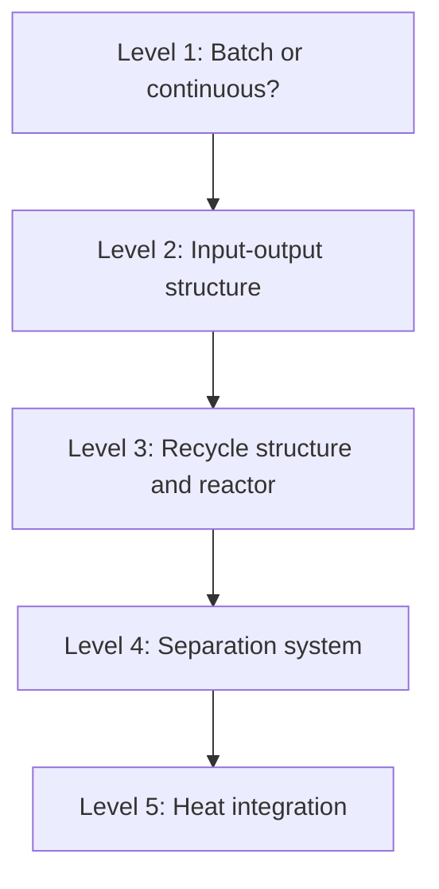
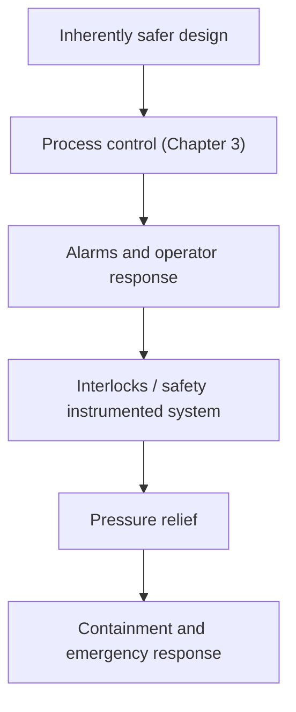

# Chapter 4: How Processes are Designed

This chapter shows how the pieces from the first three chapters — unit operations, reactors, control — become a complete process. Design is not a calculation with one right answer, but a structured sequence of decisions under competing constraints.

**From Concept to Flowsheet to Plant**

## Learning Objectives

By completing this chapter, you will be able to:

  * ✅ Explain why early design decisions commit most of a plant's lifetime cost
  * ✅ Describe Douglas's hierarchical decision procedure and why it is ordered as it is
  * ✅ Explain conceptually how distillation is designed and what reflux ratio trades off
  * ✅ Describe the purpose of pinch analysis and its three golden rules
  * ✅ Apply the inherently safer design principles within layers of protection

**Reading Time**: 20-25 minutes **Code Examples**: 0 **Exercises**: 3

* * *

## 4.1 Design is Decision-Making Under Constraints

A process design must satisfy several constraints at once:

- **Chemistry** — the reaction must work at the chosen conditions
- **Thermodynamics** — equilibrium and energy balances set limits nothing can beat
- **Economics** — capital cost, operating cost, product price
- **Safety** — inventories, pressures, temperatures, and failure behavior
- **Environment and regulation** — emissions, effluent, waste, permits

These pull in different directions. Higher temperature speeds the reaction (Chapter 2) but costs energy and raises the hazard; a purer product earns a better price but needs a bigger, hotter column. Because the objectives conflict, **there is no unique "correct" flowsheet** — only designs that are better or worse against a stated set of priorities.

What makes design demanding is *when* the decisions happen. A widely cited rule of thumb holds that **roughly 80% of a project's lifetime cost is committed during the conceptual stage**, which consumes only a small fraction of the engineering effort. Treat the number as qualitative, but the shape of the curve is real: by the time detailed engineering begins, the route, reactor, and separation sequence are fixed, and the remaining freedom is limited to optimizing equipment that perhaps should never have been there. **Cheap decisions early, expensive corrections late.**

Design also fixes how controllable the plant will be — surge volumes, measurement points, and the tightness of recycle coupling are set here, which is why a well-designed process is an easy-to-control process (Chapter 3).

## 4.2 The Design Hierarchy

Where do you start? The standard answer is the **hierarchical decision procedure** of **James Douglas**, *Conceptual Design of Chemical Processes* (1988): instead of solving the whole flowsheet at once, decide in a fixed order, each level adding detail to the one above.

- **Level 1 — Batch vs continuous.** Small volumes, many products, or short campaigns favor batch; large steady volumes favor continuous.
- **Level 2 — Input–output structure.** Treat the plant as one box: what raw materials enter, what products and by-products leave, what fraction of the feed becomes product. This is where **raw-material efficiency** is decided.
- **Level 3 — Recycle structure.** Open the box far enough to see the reactor and its recycles. Unconverted reactant is usually recovered and returned, linking conversion (Chapter 2) to recycle size.
- **Level 4 — Separation system.** Choose and sequence the separations that split the reactor effluent into product, recycle, and waste.
- **Level 5 — Heat integration.** Only now, with flows and temperatures known, match hot and cold streams to cut utility use.

The ordering follows the economics. For commodity chemicals, **raw materials typically dominate the cost of production** — standard textbook figures put them at roughly **33–85% of total production cost**, depending on product and site. The message of that range is unambiguous: a Level 2 decision that wastes feedstock in an unwanted by-product can cost more than every downstream equipment optimization combined. Each level is also a screen — if product value minus raw-material cost is already negative at Level 2, no separation or heat network will rescue the project.

## 4.3 Separations and the Cost of Purity

Reactors rarely produce pure product. Separation absorbs much of a plant's equipment and energy, and **distillation is the workhorse** — the most widely used industrial separation for fluid mixtures, and a major energy consumer. Frequently quoted figures attribute roughly **40–50% of the energy used in chemical and refining plant operations** to distillation, and roughly **90% of industrial fluid separations** are performed by it; both are order-of-magnitude survey numbers, but the message is clear. It dominates because it is robust and scalable.

The classic conceptual design tool for a binary column is the **McCabe–Thiele diagram**. On axes of vapor composition (y) against liquid composition (x), it shows:

- The **equilibrium curve** — what vapor composition is in equilibrium with a given liquid. This is thermodynamics; no design can cross it.
- The **operating lines**, one above the feed and one below — what the material balance actually delivers stage by stage.
- **Stage-stepping**, the staircase drawn between the two. Each step is one theoretical stage, so counting steps gives the stages required.

*(The video version of this chapter shows a rendered McCabe–Thiele diagram.)*

The knob that moves the operating lines is the **reflux ratio** — how much condensed overhead liquid is returned to the top of the column instead of taken as product:

| Reflux ratio | Stages required | Energy use | Practicality |
|---|---|---|---|
| **Minimum reflux** | Infinite | Lowest possible | Impossible — infinitely tall column |
| **Total reflux** | Minimum | Infinite | Impossible — no product taken |
| **~1.2–1.5 × minimum** | Finite, moderate | Moderate | Standard design heuristic |

More reflux means fewer stages (a shorter, cheaper column) but more reboiler and condenser duty (higher energy cost, forever); less reflux saves energy but demands a taller column. The economic optimum sits between the two impossible extremes, and the long-standing heuristic places it at **1.2 to 1.5 × the minimum reflux ratio**. This is process design's clearest **capital-versus-operating-cost trade-off**: buy equipment once, or pay utilities every hour for twenty years.

## 4.4 Heat Integration and Pinch Analysis

A flowsheet has streams that must be heated and streams that must be cooled. Handle them independently and you pay twice — for steam and for cooling water — while a hot stream needing cooling sits next to a cold stream needing heating. **Heat integration** matches them, so one process stream heats another and both utility bills shrink.

The systematic method is **pinch analysis**, developed by **Bodo Linnhoff** and co-workers in the late 1970s and 1980s. Its insight: the **minimum possible hot and cold utility requirement** can be computed *before* any exchanger network is designed. Hot streams are combined into one composite curve of heat availability versus temperature, cold streams into another, and the two brought as close together as the chosen minimum temperature approach allows. Where they touch is the **pinch**, the thermodynamic bottleneck. What cannot be supplied internally above it is the minimum hot utility; the surplus below is the minimum cold utility.

A target changes the question from "is this network good?" to "how far from the thermodynamic minimum?" Three golden rules follow:

1. **Do not transfer heat across the pinch**
2. **Do not use cold utility above the pinch**
3. **Do not use hot utility below the pinch**

Violating any of them adds duty at both ends at once, moving the design away from the minimum. Applied to existing plants, pinch analysis has repeatedly found large energy savings that inspection alone had missed.

## 4.5 Safety by Design

Safety is not a layer added after the flowsheet is finished. The most influential idea here is **inherently safer design**, argued over decades by **Trevor Kletz**: rather than control a hazard, remove it. Four principles:

| Principle | Meaning | Example |
|---|---|---|
| **Minimize** | Smaller inventories of hazardous material | Grams in a continuous reactor, not tonnes in a tank |
| **Substitute** | A safer material or route | A less toxic solvent or reagent |
| **Moderate** | Milder conditions or dilute forms | Lower pressure and temperature; dilute solution |
| **Simplify** | Design out complexity and error-prone steps | Fewer valves, fewer manual operations |

As Kletz put it, **"what you don't have, can't leak"**: a hazard eliminated on paper needs no protective system, no maintenance, and no operator training, ever. The cheapest moment to remove a hazard is the conceptual stage — exactly where Section 4.1 locates the leverage.

A finished design must then be reviewed systematically. The standard method is **HAZOP** (Hazard and Operability study): a multidisciplinary team walks the piping and instrumentation diagram (the P&ID of Chapter 1) node by node, applying **guide words** — *no*, *more*, *less*, *reverse*, *as well as*, *part of*, *other than* — to each process parameter. "More flow here: what causes it, what happens, what protects us?" The guide words make the review exhaustive rather than dependent on whoever is imaginative that morning.

What survives is protected in depth, by **layers of protection** arranged so failure of one does not defeat the next:

Each layer acts only after those above it have failed; the order is also a priority ranking — the first box is worth more than the last.

## 4.6 Chapter Summary

- Design balances chemistry, thermodynamics, economics, safety, and environment at once; there is no unique answer, only better and worse designs
- Early decisions dominate: as a rule of thumb, ~80% of lifetime cost is committed at the conceptual stage
- Douglas's hierarchy (1988): batch/continuous → input–output → recycle → separations → heat integration
- Raw materials often dominate production cost (commonly cited as 33–85%), so input–output decisions outweigh equipment optimization
- Distillation dominates separations and consumes large amounts of energy; McCabe–Thiele shows how equilibrium and material balance set the stage count, and reflux trades energy against capital (optimum ≈ 1.2–1.5 × minimum)
- Pinch analysis sets minimum utility targets before network design; obey the three golden rules
- Inherently safer design — minimize, substitute, moderate, simplify — removes hazards on paper; HAZOP reviews systematically; layers of protection catch the rest

**Next chapter**: nearly everything above is optimization over expensive evaluations — flowsheet alternatives, reflux ratios, exchanger networks, candidate chemistries. That is precisely where AI enters chemical engineering.

## Exercises

1. **Conceptual**: A team spent six months optimizing a heat-exchanger network, cutting utility cost by 15%. A review then finds that the chosen reaction route sends 30% of the feedstock into an unwanted by-product. Using the hierarchy and Section 4.2, explain which problem deserved attention first.
   *Hint*: Which hierarchy level does each issue sit at, and which cost element usually dominates?
   *Answer*: The by-product problem sits at **Level 2 (input–output structure / raw-material efficiency)**, while the exchanger network is **Level 5 (heat integration)**. Since raw materials commonly dominate production cost, sending 30% of the feedstock to waste almost certainly outweighs a 15% cut in utilities. The **route should have been fixed first** — and the hierarchy exists precisely to force that order, since a Level-2 defect cannot be repaired at Level 5.

2. **Reasoning without calculation**: A column runs at 1.05 × minimum reflux. Describe qualitatively what happens to (a) stages required, (b) reboiler duty, and (c) column height if reflux rises to 1.4 × minimum, and say which are capital and which operating costs.
   *Hint*: At minimum reflux the stage count diverges; the heuristic optimum is 1.2–1.5 × minimum.
   *Answer*: (a) Stages required **fall**, and sharply — at 1.05 × minimum the count is still near its divergent region. (b) Reboiler (and condenser) duty **rises**, roughly in proportion to the extra reflux boiled. (c) The column gets **shorter**, following the stage count. Stages and height are **capital** cost, paid once; reboiler duty is **operating** cost, paid every hour for the plant's life — which is why the optimum sits at 1.2–1.5 × minimum rather than at either extreme, and why 1.05 × is usually too close to the minimum.

3. **Discussion**: A process stores 20 tonnes of a toxic intermediate between two steps. Propose one design change for each of Kletz's four principles, and say where in the layers-of-protection diagram each acts.
   *Hint*: Must the intermediate be stored at all? Could a change of route or conditions remove the inventory rather than protect it?
   *Answer*: **Minimize** — reschedule or couple the two steps continuously so the intermediate is consumed as fast as it is made, removing the 20-tonne inventory. **Substitute** — adopt an alternative route that never forms the toxic intermediate. **Moderate** — if some hold-up is unavoidable, store it dilute, refrigerated, or at low pressure so a release disperses less energetically. **Simplify** — eliminate the storage step and its transfer lines, valves, and manual operations altogether. All four act in the **top box, "inherently safer design"**, above control, alarms, interlocks, relief, and containment — which is why they are worth more than any of them: a hazard removed on paper reduces the demand placed on every lower layer, forever.
