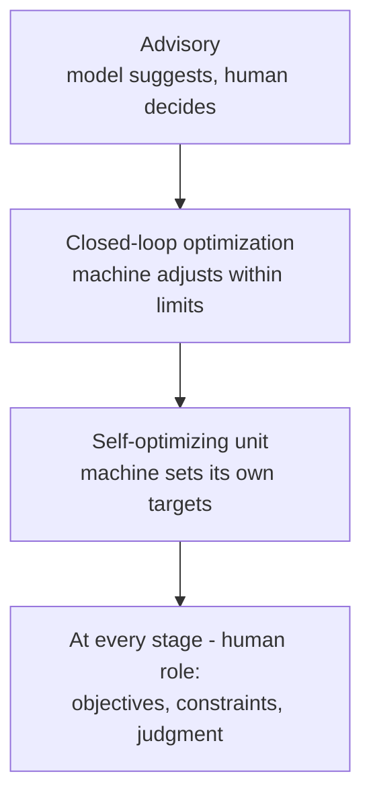

# Chapter 5: AI and the Future of Chemical Engineering

This final chapter connects Chapters 1–4 to the data-driven methods now entering industrial practice: soft sensors, Bayesian optimization, digital twins, and the road toward autonomous plants.

**Process Informatics and the Intelligent Plant**

## Learning Objectives

By completing this chapter, you will be able to:

  * ✅ Explain the three forces driving AI adoption in the process industries
  * ✅ Describe what a soft sensor is, what it buys you, and how it fails
  * ✅ Explain why Bayesian optimization suits expensive experiments
  * ✅ Distinguish first-principles, hybrid, and ML models, and define a digital twin
  * ✅ Identify the real barriers to autonomous operation
  * ✅ Summarize how the fundamentals make AI trustworthy

**Reading Time**: 20-25 minutes **Code Examples**: 0 **Exercises**: 3

* * *

## 5.1 Why AI, and Why Now

Chemical plants have been computerized since the 1960s, so "AI in chemical engineering" is no sudden arrival. What changed is the balance of three forces.

**Plants are already heavily instrumented.** The DCS of Chapter 3 samples thousands of measurement tags — temperatures, pressures, flows, levels, valve positions — continuously, archived in a process historian for years. In most fields the first task is building the measurement infrastructure; here the data was collected long before anyone planned to model it.

**Classical models are expensive to build and maintain.** A rigorous simulation of the flowsheets of Chapters 1 and 4 encodes thermodynamics, hydraulics, and equipment geometry. Building it takes an experienced engineer weeks, and keeping it faithful as the plant fouls and ages takes ongoing effort.

**The industry faces demographic knowledge loss.** It is a widely discussed concern that experienced operators are retiring faster than replacements are trained, and that much of what they know — which unit runs hot in summer, which alarm is usually spurious — was never written down. This is consensus-level observation rather than measured statistic, but it drives real investment: judgment that cannot be transferred person to person must partly be encoded.

The umbrella term is **Process Informatics (PI)**: using data together with models to design, operate, and optimize processes — the subject of our *Process Informatics Introduction* series, to which this chapter is the bridge.

## 5.2 Soft Sensors: The Entry Point

The most widely deployed data-driven model in the process industries is the **soft sensor** (or virtual sensor).

> **A soft sensor is a model that infers a hard-to-measure variable from easy-to-measure ones.**

The variables engineers most want to control are quality variables: composition, polymer melt index, biomass concentration, impurity levels. These need a laboratory sample or an expensive, slow, maintenance-hungry online analyzer — while the plant measures temperature, pressure, and flow everywhere, cheaply and continuously. A soft sensor learns the relationship between the cheap measurements and the expensive one from historical process data paired with past lab results, then estimates it continuously.

| | Laboratory analysis | Soft sensor |
|---|---|---|
| Update rate | Hourly to daily | Every control cycle |
| Delay | Sampling, transport, analysis | Essentially none |
| Accuracy | Reference quality | Approximate, model-dependent |

The idea is not new: **inferential control** — controlling composition through a proxy such as a distillation tray temperature — predates machine learning. A modern soft sensor generalizes it from one proxy variable to many, with a fitted model doing the combining.

Chapter 3 explains why this matters. A feedback loop can only correct what it measures, and dead time blinds it. A lab result arriving an hour later is nearly useless — by then an hour of off-spec product exists. **A soft sensor can close a loop that laboratory analysis never could.**

The classic failure is **model drift**. A soft sensor is fitted to a particular operating region — a feedstock, a catalyst age, a season. Outside it the model extrapolates without announcing the fact: it keeps reporting numbers, they are simply wrong. Deployments therefore retain lab samples, monitor prediction error against them, and define a retraining procedure. A soft sensor is not a device you install; it is a model you maintain.

## 5.3 Optimization When Experiments Are Expensive

Chapter 4 framed process design as a search over decisions — operating conditions, equipment sizes, recycle configurations — against an objective. When a simulator evaluates that objective cheaply, ordinary optimization applies. The hard case is when **each evaluation is expensive**: a pilot-plant run taking a shift, a batch experiment consuming costly reagents, a catalyst needing days to test. You may afford only tens of evaluations, so the question becomes: given everything measured so far, which experiment next?

**Bayesian optimization** answers this in three moves. First, fit a *surrogate* — a cheap statistical model of the objective over the decision variables. Second, require that surrogate to report **uncertainty**, not just a prediction, so the model knows where it is guessing. Third, use an *acquisition function* to combine predicted performance and uncertainty into one score, and run the experiment maximizing it — balancing **exploitation** (test where results look good) against **exploration** (test where you know least).

This spends a small budget deliberately rather than uniformly — the situation of every pilot campaign, catalyst screening, and formulation effort. Our *Introduction to Bayesian Optimization* series develops the mathematics; here it suffices that **when experiments are expensive, choosing the next one well is itself an engineering problem.**

## 5.4 Digital Twins and Model Predictive Control

Process models form a hierarchy rather than a competition:

| Model type | Built from | Strength | Weakness |
|---|---|---|---|
| **First-principles** | Balances, thermodynamics, kinetics | Extrapolates; explains *why* | Expensive to build and maintain |
| **Hybrid** | Physics core + ML residual | Physics keeps it sane; ML absorbs the rest | Needs both skill sets |
| **ML surrogate** | Data only | Fast to build and evaluate | Trustworthy only inside the training region |

First-principles models come in two flavors. **Steady-state flowsheeting** answers "what is the converged operating point?" — the question behind Chapter 4's design decisions. **Dynamic simulation** answers "how does the plant get there, and respond to a disturbance?" — the process dynamics of Chapter 3, and the kind control and operator training need.

A **digital twin** is not simply a simulation. It is a model **kept synchronized with the operating plant** — fed live measurements and periodically re-tuned so it tracks the real unit. That synchronization enables what-if analysis on the current state ("raise feed rate 5% now — does the column flood?"), operator training on scenarios too dangerous to stage, and optimization reflecting today's plant rather than the design day's.

The established industrial success story of model-based operation is **model predictive control (MPC)**, met at the top of Chapter 3's control hierarchy. An MPC controller holds an internal model, predicts the process response over a future horizon, and at each control interval solves an optimization for the moves that best meet targets while respecting constraints — then applies the first and repeats. It handles the multivariable, interacting, constrained problems that defeat single PID loops, and has been standard practice in refining and petrochemicals since roughly the 1980s–90s — the best evidence that model-based operation pays.

An honest caveat belongs here. The literature is dominated by algorithms, but the practical difficulty is elsewhere: plants drift — exchangers foul, catalysts deactivate, instruments lose calibration, feedstocks change — so a model matching the plant at commissioning will not match it in three years. Maintaining fidelity is unglamorous, continuous work, and where most failures live. **The bottleneck is model maintenance, not model building.**

## 5.5 Toward Autonomous Plants

The trajectory parallels our *Self-Driving Labs Introduction* series, on labs that plan, run, and analyze their own experiments.

Most industrial deployments sit at the first stage — advisory systems recommending setpoints for an operator to accept. The second, closed-loop optimization within a bounded envelope, is what MPC already does in mature sectors. The third, units adapting their own objectives, is genuinely experimental.

What holds the progression back is not algorithms. The real barriers are **safety certification** (a plant holds enormous stored energy and hazardous inventory; approving a controller whose behavior is learned rather than specified is an unsolved regulatory problem), **verification of learned models** (proving one behaves acceptably outside its training data is unsolved in general), and **accountability** (when an autonomous decision causes an incident, responsibility must be assignable). Institutions move more slowly than methods.

The most active bridge from lab to plant is **continuous-flow chemistry with automated experimentation**. Small flow reactors reach steady state quickly, use little material, and are naturally computer-controlled — ideal for closed-loop optimization, and the conditions found are already in scalable continuous form, not a batch recipe needing translation.

The human role does not disappear; it moves up, exactly as in the SDL series. Machines hold setpoints, search bounded spaces, and never get bored. People remain responsible for **framing objectives** (what are we optimizing, at what cost in safety, emissions, and equipment life?), **judging anomalies** (real upset, or failed transmitter?), and **owning the consequences**. The machine runs the loop; the engineer decides what it is for.

## 5.6 Series Summary

Chapter 1 established that any process decomposes into **unit operations**, with **mass and energy balances** as the accounting holding across every one. Chapter 2 opened the reactor, where **kinetics** sets the speed and **thermodynamics** the limit. Chapter 3 made the plant hold still through **feedback control** against disturbances. Chapter 4 assembled the pieces into a **design** — flowsheet, heat integration, economics, safety embedded rather than appended. Chapter 5 added the data layer.

The closing message is worth remembering. **AI does not replace the classical fundamentals — the fundamentals are what make AI in a plant trustworthy.** A soft sensor is credible because a mass balance says its output is physically possible. A digital twin is worth synchronizing because someone understood the physics well enough to write it down. An optimizer's recommendation is safe to act on because an engineer knows which constraints are hard.

Next: *Process Informatics Introduction* for the data layer, *Introduction to Bayesian Optimization* for the methods, *Digital Twin Construction Introduction* for models, and *Self-Driving Labs Introduction* for autonomy.

Thank you for learning with us.

## Exercises

1. **Conceptual**: A column's overhead purity is measured by a gas chromatograph reporting every 30 minutes, while the column responds to feed disturbances within about 10 minutes. Explain why feedback on the GC reading alone performs poorly, and what inputs a soft sensor would need.
   *Hint*: compare the measurement interval with the process response time and dead time of Chapter 3, and recall what the column already measures continuously.
   *Answer*: The column responds in about 10 minutes but is measured every 30, so **disturbances arrive and decay entirely between samples** — and each GC reading additionally carries sampling and analysis **dead time**, so the loop is correcting a purity that existed some minutes ago. Feedback on such stale, sparse information must be detuned to stay stable, and it reacts to history rather than to the plant. A **soft sensor** would infer purity continuously from what the column already measures every second: **tray and overhead temperatures**, column **pressure** (temperature only implies composition at a known pressure), **reflux flow**, and **feed flow and composition** — with the GC retained as the reference for monitoring drift and retraining.

2. **Judgment**: Two models of one reactor are offered: (a) a first-principles kinetic model predicting yield within ±3% across all tested conditions, and (b) an ML surrogate trained on two years of plant data predicting within ±1% on that same period. The plant is about to switch feedstock. Which do you trust, and why?
   *Hint*: the question is extrapolation, not accuracy — which model contains information absent from the data?
   *Answer*: Trust **(a), the first-principles model**. The surrogate's ±1% is an *interpolation* accuracy, valid only inside the operating region it was trained on; a feedstock switch moves the plant outside that region, where the model will keep reporting confident numbers that are simply wrong. The kinetic model encodes mechanism — balances, rate laws, thermodynamics — information that is not in the historical data, so it degrades gracefully rather than silently when conditions change. Best practice is not to choose once: **run (a) through the transition**, collect data at the new conditions, and **retrain (b)** so the surrogate's accuracy advantage returns once its training region covers the new feedstock.

3. **Discussion**: Argue in roughly 200 words whether the main obstacle to autonomous plants is technical or institutional. Use at least two barriers from Section 5.5, and state what evidence would change your mind.
   *Hint*: MPC's adoption since the 1980s–90s shows closed-loop model-based operation is already accepted — so what differs about the next step?
   *Answer* (model answer, arguing **institutional**): MPC has run refineries in closed loop for over thirty years, so industry plainly accepts a computer holding the setpoints — the technical act of automated control is settled. What is not settled is **safety certification** and **accountability**. An MPC's model is specified and auditable; a learned controller's behavior is inferred from data, and no regulator has an accepted procedure for approving one, nor for assigning responsibility when its decision contributes to an incident. **Verification of learned models** compounds this: proving acceptable behavior outside the training data is unsolved in general, so certification has nothing to certify against. These are institutional problems in the sense that the missing artifacts are standards, approval pathways, and liability rules, not algorithms. Evidence that would change the verdict: if a regulator-approved certification pathway for learned controllers existed and sat **unused for years** because no vendor could produce a model that met it, the binding constraint would clearly be technical rather than institutional — as would a record of certified autonomous units failing in service through genuine model inadequacy.
