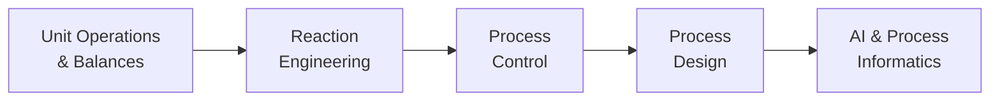

# Chemical Engineering Introduction

**Unit Operations, Reactors, Control, Design — and Where AI Fits**

A reaction that works beautifully in a 100 mL flask does not simply scale to a 100 m³ reactor. Chemical engineering is the discipline that bridges that gap: designing and operating processes that transform matter and energy at industrial scale — safely, economically, and increasingly with the help of AI. This series is a bird's-eye introduction for students and researchers who want to understand how the process industries actually work, and where data-driven methods fit in.

## Series Overview

The series follows the life of a process, from its building blocks to its intelligent operation:

1. **Decompose** — every process breaks down into reusable unit operations, glued together by mass and energy balances
2. **React** — the reactor sets conversion and selectivity, dictating everything downstream
3. **Control** — feedback keeps the plant at its target despite constant disturbances
4. **Design** — hierarchical decisions turn chemistry into an economic, safe flowsheet
5. **Learn** — soft sensors, Bayesian optimization, and digital twins make the plant intelligent

## Chapters

| Chapter | Title | What You Will Learn |
|---------|-------|---------------------|
| 1 | [What is Chemical Engineering?](chapter-1.html) | The scale-up problem, unit operations, mass and energy balances, flowsheets, transport phenomena |
| 2 | [Reaction Engineering Fundamentals](chapter-2.html) | Rate laws and Arrhenius behavior, batch/CSTR/PFR reactors, conversion and selectivity |
| 3 | [Process Control Fundamentals](chapter-3.html) | Feedback loops, PID control, process dynamics, cascade and plant-wide control |
| 4 | [How Processes are Designed](chapter-4.html) | The design hierarchy, separations and distillation, pinch analysis, inherently safer design |
| 5 | [AI and the Future of Chemical Engineering](chapter-5.html) | Soft sensors, Bayesian optimization, digital twins, the road to autonomous plants |

## Who This Series is For

- **Students** in chemistry, materials science, or engineering who want the process-scale picture their coursework may not cover
- **Researchers** collaborating with industry who need to speak the language of plants, flowsheets, and control loops
- **Data scientists and informatics practitioners** entering the process industries who want the domain fundamentals beneath process informatics

No prior chemical engineering background is assumed; the mathematics stays at the level of algebra, logarithms, and a few worked calculations; the one calculus expression (the PID equation) is explained in words.

## Related Series

This series is the classical-fundamentals companion to our data-driven process series: **Process Informatics Introduction**, **Introduction to Bayesian Optimization**, **Introduction to Process Monitoring and Control**, **Digital Twin Construction Introduction**, and **Self-Driving Labs Introduction**. Chapter 5 connects the two worlds explicitly.
