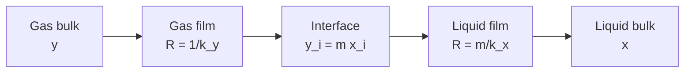

## Video Lecture

<div class="video-container">
  <iframe
    width="560"
    height="315"
    src="https://www.youtube.com/embed/ANAuU3W1DPw"
    title="Chemical Engineering Mass Transfer and Separation Ch.1: Diffusion and Mass-Transfer Coefficients"
    frameborder="0"
    allow="accelerometer; autoplay; clipboard-write; encrypted-media; gyroscope; picture-in-picture"
    allowfullscreen>
  </iframe>
</div>

> This video covers the same content as the text below. Choose your preferred learning format.

---

# Chapter 1: Diffusion and Mass-Transfer Coefficients

This chapter opens the mass-transfer series with the mechanism behind every separation in a plant — molecules moving from where they are concentrated to where they are not — and shows how a slow molecular process is turned into industrial equipment by the same device that made heat transfer tractable: a coefficient, a driving force, and resistances in series.

**Fick's Law, the Two-Film Model, and the Third Transport Row**

## Learning Objectives

By completing this chapter, you will be able to:

  * ✅ Place mass transfer as the third row of the transport table — *flux = coefficient × driving force*
  * ✅ Apply Fick's law and quote diffusivities across the gas-to-liquid range
  * ✅ Explain why industrial mass transfer never relies on molecular diffusion over long distances
  * ✅ Use the Schmidt number as the mass-transfer counterpart of the Prandtl number
  * ✅ Explain why the mass-transfer coefficient $k_c$ is a consequence of flow, not a property
  * ✅ Combine gas-film and liquid-film resistances in series and identify which one controls

**Reading Time**: 20-25 minutes **Code Examples**: 1 **Exercises**: 3

* * *

## 1.1 The Third Transport Row

[Introduction Chapter 1](../chemical-engineering-introduction/chapter-1.html) set out **transport phenomena** as a single table with three rows — momentum, heat, and mass — each row an instance of the same sentence: *flux = coefficient × driving force*. The [Fluid Mechanics](../chemical-engineering-fluid-mechanics/chapter-1.html) series developed the momentum row, where the driving force is a velocity gradient and the coefficient is viscosity. The [Heat Transfer](../chemical-engineering-heat-transfer/chapter-1.html) series developed the heat row, where the driving force is a temperature difference and the coefficients run from the conductivity $k$ and film coefficient $h$ to the overall $U$. This series completes the trio with the mass row. The driving force is a **concentration difference**, and the coefficients are the subject of this chapter.

| Transport row | Flux | Driving force | Coefficient |
|---|---|---|---|
| **Momentum** | Shear stress $\tau$ | Velocity gradient | Viscosity $\mu$ |
| **Heat** | Heat flux $q$ | Temperature gradient | Conductivity $k$, film $h$ |
| **Mass** | Molar flux $J$ | Concentration gradient | Diffusivity $D$, film $k_c$ |

The commercial reason to care is that **separations are what chemical plants mostly do**. A reactor rarely converts everything, and never converts only into what was wanted, so its effluent is a mixture: product, unconverted feed, by-products, solvent, water. Almost everything downstream of the reactor exists to take that mixture apart. Distillation and absorption columns dominate the flowsheets of refining, petrochemicals, and gas processing by count and by capital, and separations are commonly cited as consuming a large share of the energy used by chemical processes — the reboilers and condensers that [Heat Transfer Chapter 1](../chemical-engineering-heat-transfer/chapter-1.html) identified as the biggest utility consumers are, in the end, mass-transfer equipment being paid for in steam.

The equipment is sized with an equation that should look familiar:

$$ N = k_c \, \Delta C $$

Molar flux $N$ in mol/(m²·s), a concentration difference $\Delta C$ in mol/m³, and $k_c$ — the **mass-transfer coefficient**, in m/s — carrying everything about the fluids and the flow. This is the heat-flux law $q = h \, \Delta T$ with different letters — multiply by interfacial area and you have the mass-transfer twin of $Q = h A \Delta T$ — and much of the reasoning transfers with it.

This series turns that equation into equipment. This chapter builds the coefficient; [Chapter 2](chapter-2.html) puts it to work in **absorption columns**; [Chapter 3](chapter-3.html) covers **distillation**, the single most important separation in the industry; [Chapter 4](chapter-4.html) treats **extraction, adsorption, and membranes**; and [Chapter 5](chapter-5.html) closes with **drying, crystallization, and how to select a separation** for a given problem.

## 1.2 Diffusion: Fick's Law

**Diffusion** is matter moving through matter without bulk flow — molecules wandering randomly, and a net migration appearing whenever there are more of them on one side than the other. No force pushes them; the drift is simply what random motion does to an uneven distribution. Its law is the direct analogue of Fourier's law of conduction:

$$ J = -D \frac{dC}{dz} $$

where $J$ is the **molar flux** in mol/(m²·s), $dC/dz$ the concentration gradient in mol/m⁴ (concentration in mol/m³ changing over a distance in m), and $D$ the **diffusivity** (or diffusion coefficient) in m²/s. As with Fourier's law, the minus sign is bookkeeping rather than physics: it states that matter moves *down* the gradient, from high concentration toward low, so a negative gradient gives a positive flux.

Set the two laws side by side and the analogy is exact:

| Law | Flux | Gradient | Coefficient |
|---|---|---|---|
| **Fourier** (heat) | $q = -k\,dT/dx$ | Temperature | $k$ [W/(m·K)] |
| **Fick** (mass) | $J = -D\,dC/dz$ | Concentration | $D$ [m²/s] |

What makes the mass row different in practice is the size of the coefficient:

| Medium (typical values, near ambient conditions) | Diffusivity $D$ [m²/s] |
|---|---|
| **Gases** | about 1 × 10⁻⁵ to 2 × 10⁻⁵ |
| **Liquids** | about 1 × 10⁻⁹ |
| **Solids** | far smaller still |

These are typical magnitudes for orientation, not design data; real values shift with the specific pair of substances, temperature, and pressure. Read them as ratios. A liquid diffuses **roughly four orders of magnitude more slowly than a gas**, and diffusion in solids is slower again by a margin that varies too widely across materials to summarize in one number.

The practical consequence is the most important sentence in this chapter. Random molecular motion covers distance badly: as a rough scaling, the time for diffusion to spread a species over a distance $L$ grows with $L^2/D$, so doubling the distance quadruples the time. Over 1 cm of still water — $L^2/D \approx (0.01)^2 / 10^{-9}$ — that estimate is on the order of $10^5$ seconds, more than a day. No plant can wait.

So **industrial mass transfer never relies on molecular diffusion alone over long distances**. Instead, flow does the transport and diffusion does the delivery: pumps, agitators, packing, and trays bring fresh fluid physically close to the interface, and diffusion is asked only to cross the last thin film. Equipment design in this series is, almost entirely, the business of arranging that geometry — maximizing interfacial area and keeping the film thin. Exercise 1 works the timescale numbers.

## 1.3 The Schmidt Number

The heat and mass rows each have a dimensionless group comparing how fast their quantity spreads against how fast momentum spreads. For heat it is the Prandtl number, $Pr = \nu / \alpha$, where $\alpha$ is the thermal diffusivity in m²/s — a symbol that [Chapter 3](chapter-3.html) will reuse, by long convention, for relative volatility. The mass-transfer twin is the **Schmidt number**:

$$ Sc = \frac{\nu}{D} $$

where $\nu$ is the kinematic viscosity in m²/s — momentum diffusivity — and $D$ is the mass diffusivity. Both have units of m²/s, so $Sc$ is dimensionless, and it answers one question: does momentum or does mass spread faster through this fluid?

| Fluid (order of magnitude) | Schmidt number $Sc$ |
|---|---|
| **Gases** | about 1 |
| **Liquids** | about 1,000 |

In a gas, both momentum and mass are carried by the same molecules taking the same random walk, so the two spread at about the same rate and $Sc$ lands near 1 — the same coincidence that makes $Pr$ near 1 for gases. In a liquid, momentum is transmitted efficiently through a crowded, interacting molecular structure while an individual solute molecule has to squeeze between neighbors to go anywhere, so mass lags momentum by about three orders of magnitude.

That contrast has a physical picture attached. Where $Sc$ is large, the region near a wall in which concentration changes — the **concentration boundary layer** — is much thinner than the velocity boundary layer around it. Solutes in liquids are confined to a very thin skin at the interface, which is precisely why interfacial *area* matters so much in liquid-phase equipment. The Schmidt number is the group that appears in the design correlations for $k_c$, exactly as the Prandtl number appears in correlations for $h$ such as Dittus–Boelter. This series does not develop those correlations; [Chapter 2](chapter-2.html) instead folds the coefficient and the interfacial area together into the practical sizing quantity used for columns, the transfer unit.

## 1.4 The Film Model and the Mass-Transfer Coefficient

Since molecular diffusion cannot be relied on across long distances, engineering practice lumps everything that happens near an interface into one number, exactly as convection was lumped into $h$. The device is the **film model**: assume all resistance to mass transfer sits in a thin, stagnant film of thickness $\delta$ next to the interface, with the bulk fluid beyond it perfectly mixed and uniform in composition. Then

$$ N = k_c \, \Delta C $$

with $N$ the molar flux in mol/(m²·s), $\Delta C$ the concentration difference between the interface and the bulk in mol/m³, and $k_c$ the **mass-transfer coefficient** in m/s. Within that picture $k_c \approx D/\delta$, which is useful for intuition even though $\delta$ is never measured: a thinner film means a larger coefficient.

The essential point is the one made about $h$ in [Heat Transfer Chapter 1](../chemical-engineering-heat-transfer/chapter-1.html), and it is worth repeating because it is the most common misconception in the subject. Diffusivity $D$ is a **property** — look up oxygen in water at 25 °C and you have it. The mass-transfer coefficient $k_c$ is **not a property**. The same solute in the same solvent against the same interface gives a different $k_c$ if you change the velocity, the packing, the bubble size, the agitation rate, or whether the flow is laminar or turbulent. It is a consequence of the flow field, which is why this series depends on the fluid mechanics one, and why $k_c$ is quoted only together with the equipment and conditions it was measured in.

The design levers follow directly. Turbulence sweeps fresh fluid toward the interface and thins the film, raising $k_c$. Small bubbles or droplets raise the interfacial area per unit volume. Structured packing does both. This is why mass-transfer equipment so often reports the *product* $k_c a$, with $a$ the interfacial area per unit volume in m²/m³: what a column delivers is coefficient and area together, and the two are usually improved by the same hardware change.

Real interfaces are not always stagnant, so the film model is a simplification rather than a physical truth — penetration and surface-renewal models, which treat the interface as continually refreshed, predict a different dependence on $D$ and describe some contacting equipment better. The film model is used throughout this series because it is simple, it is the basis of the industry's design correlations, and it gets the engineering conclusions right.

## 1.5 Interfaces, Henry's Law, and the Two-Film Model

Heat transfer had one simplification that mass transfer does not get: temperature is continuous across an interface. Two touching materials sit at the same surface temperature. **Concentration is not continuous across a phase boundary.** A gas bubble in water and the water around it can both be at equilibrium and still contain wildly different amounts of the solute, because the solute simply prefers one phase to the other.

What matches at the interface is not concentration but **equilibrium**. For a dilute solute this is expressed by **Henry's law**, written here in mole fractions:

$$ y = m x $$

where $y$ is the mole fraction of the solute in the gas at the interface, $x$ its mole fraction in the liquid at the interface, and $m$ the dimensionless equilibrium constant (Henry's constant divided by total pressure). The value of $m$ *is* solubility, expressed as a number:

  * **Small $m$** — a very soluble gas. The liquid holds a lot at low gas-phase concentration. Ammonia in water is the standard example, with $m$ of order 1 near ambient conditions.
  * **Large $m$** — a sparingly soluble gas. It takes a high gas-phase concentration to dissolve much. Carbon dioxide in water is the standard example, with $m$ of order 1,000 near ambient conditions.

Take both as order-of-magnitude values: $m$ depends strongly on temperature and on total pressure, and rises as the liquid warms — which is why gases come out of solution when water is heated.

The **two-film model** assembles the whole picture. A solute crossing from gas to liquid makes two trips in sequence: through a gas film to the interface, then through a liquid film away from it. At the interface itself, equilibrium is assumed to hold instantly — the interface offers no resistance of its own. Sequential steps mean **resistances in series**, the same circuit logic used for the overall coefficient $U$.



Adding them gives the **overall gas-phase mass-transfer coefficient** $K_y$:

$$ \frac{1}{K_y} = \frac{1}{k_y} + \frac{m}{k_x} $$

with $k_y$ the gas-film coefficient and $k_x$ the liquid-film coefficient, both here in kmol/(m²·s) per unit mole fraction. The $m$ in the second term is what makes mass transfer richer than heat transfer: the liquid-film resistance is not just $1/k_x$ but $1/k_x$ *weighted by solubility*, because the equilibrium constant converts a liquid-side driving force into the gas-side units that $K_y$ is defined in. A poorly soluble gas therefore carries a liquid-film resistance amplified by a factor of $m$, even when the liquid film is physically no worse than the gas film.

**This is the controlling-resistance argument from [Heat Transfer Chapter 1](../chemical-engineering-heat-transfer/chapter-1.html), applied to a new pair of resistances.** There, the largest thermal resistance took the largest share of $\Delta T$ and set $U$, so improving anything else was wasted money until it was dealt with. Here the largest of the two film resistances sets $K_y$, and improving the other one buys nothing. The two canonical cases sit at opposite ends:

  * **Ammonia into water — gas-film controlled.** $m$ is small, so $m/k_x$ is small and most of the resistance is in the gas film. Design the gas side: raise gas velocity, choose packing that promotes gas-phase turbulence.
  * **Carbon dioxide into water — liquid-film controlled.** $m$ is large, so $m/k_x$ dominates by orders of magnitude. Design the liquid side: raise liquid loading, use agitation or packing that renews the liquid surface — or change the chemistry, by absorbing into an amine solution instead of water so that a reaction consumes the dissolved CO₂ and steepens the liquid-side gradient. That last option is the reason industrial CO₂ capture uses amines rather than water.

The arithmetic below makes the split explicit.

```python
def overall_Ky(k_y, k_x, m):
    """Overall gas-phase coefficient K_y and the two film resistances.

    k_y, k_x : film coefficients [kmol/(m^2*s) per unit mole fraction]
    m        : Henry's law slope, y = m*x [-]
    """
    resistances = {
        "gas film     1/k_y": 1.0 / k_y,
        "liquid film  m/k_x": m / k_x,
    }
    total = sum(resistances.values())
    return 1.0 / total, total, resistances


# Representative order-of-magnitude coefficients for a packed column, not design data.
CASES = {
    "NH3 into water  (m = 1, very soluble)":     dict(k_y=0.005, k_x=0.020, m=1.0),
    "CO2 into water  (m = 1000, sparingly sol.)": dict(k_y=0.005, k_x=0.020, m=1000.0),
}

for name, case in CASES.items():
    K_y, total, res = overall_Ky(**case)
    print(f"{name}:  K_y = {K_y:.3e} kmol/(m^2*s),  total R = {total:.1f}")
    for label, value in res.items():
        print(f"    {label} = {value:10.1f}  ({100 * value / total:5.1f}% of total)")
    print()

# NH3 into water  (m = 1, very soluble):  K_y = 4.000e-03 kmol/(m^2*s),  total R = 250.0
#     gas film     1/k_y =      200.0  ( 80.0% of total)
#     liquid film  m/k_x =       50.0  ( 20.0% of total)
#
# CO2 into water  (m = 1000, sparingly sol.):  K_y = 1.992e-05 kmol/(m^2*s),  total R = 50200.0
#     gas film     1/k_y =      200.0  (  0.4% of total)
#     liquid film  m/k_x =    50000.0  ( 99.6% of total)
```

The two films are physically identical in both runs — same $k_y$, same $k_x$, same hardware. Only the solubility changed, and it moved the controlling resistance from one side of the interface to the other, along with $K_y$ itself by a factor of about 200.

Now spend money on each case. Doubling the gas-film coefficient $k_y$ from 0.005 to 0.010 raises $K_y$ for ammonia from 4.00 × 10⁻³ to 6.67 × 10⁻³, a gain of about **67%** — but for CO₂ it moves $K_y$ from 1.992 × 10⁻⁵ to 1.996 × 10⁻⁵, a gain of about **0.2%**. Doubling the liquid-film coefficient $k_x$ instead does the reverse: about **11%** for ammonia, and about **99%** — very nearly a doubling — for CO₂. The same hardware change is either the right investment or a complete waste, and the only thing that decides it is which film controls.

Two cautions on the formula. It assumes a straight equilibrium line, $y = mx$ with constant $m$, which holds for dilute solutions; concentrated systems have curved equilibrium and require a local slope. And it assumes the interface itself offers no resistance, which is standard practice but breaks down when surfactants accumulate at the surface.

## 1.6 Chapter Summary

1. Mass transfer is the third row of the **transport table** — *flux = coefficient × driving force* — with a concentration difference as the driving force and $N = k_c \Delta C$ as the working equation; separations dominate chemical flowsheets and are commonly cited as taking a large share of the energy used by chemical processes
2. **Fick's law**, $J = -D\,dC/dz$, is the direct analogue of Fourier's law; typical diffusivities are about 1–2 × 10⁻⁵ m²/s in gases and about 1 × 10⁻⁹ m²/s in liquids — roughly four orders of magnitude slower — with solids slower still
3. Because diffusion time scales roughly as $L^2/D$, molecular diffusion cannot move material industrial distances: **flow brings fluid close and diffusion crosses the last film**, so equipment design is the business of maximizing interfacial area and thinning that film
4. The **Schmidt number** $Sc = \nu/D$ is the mass-transfer twin of the Prandtl number: about 1 for gases, about 1,000 for liquids, meaning liquid concentration boundary layers are very thin
5. The **mass-transfer coefficient** $k_c$ in $N = k_c \Delta C$ is not a property but a result of the flow, exactly as $h$ is in heat transfer; it is quoted with its equipment and conditions, often as the product $k_c a$ with interfacial area
6. Concentration is discontinuous across a phase boundary; what matches at the interface is equilibrium, **Henry's law** $y = mx$, with small $m$ meaning a very soluble gas and large $m$ a sparingly soluble one
7. **Two-film theory** puts the films in series: $1/K_y = 1/k_y + m/k_x$. With the same coefficients, NH₃ ($m \approx 1$) is **80% gas-film** resistance while CO₂ ($m \approx 1{,}000$) is **99.6% liquid-film** — the same controlling-resistance logic as $U$ in heat transfer, and the reason CO₂ capture uses reactive amines rather than water

**Next chapter**: a coefficient describes one patch of interface, while a column has to strip a stream down to specification over many meters of packing. [Chapter 2](chapter-2.html) puts $K_y$ to work — **gas absorption and stripping columns** — including operating lines, the minimum liquid rate, and how column height follows from the number of transfer units.

## Exercises

1. **Conceptual — why nobody waits for diffusion**: Using the rough scaling that diffusion time goes as $L^2/D$, estimate the time for a solute to spread (a) 1 mm and (b) 1 cm through still water ($D \approx 10^{-9}$ m²/s), and (c) 1 cm through a gas ($D \approx 10^{-5}$ m²/s). (d) A stirred tank achieves the same mixing in seconds. What is the stirrer actually doing, given that it cannot change $D$?
   *Hint*: work in meters and take the ratio; the point is the exponents, not the precision.
   *Answer*: (a) $(10^{-3})^2 / 10^{-9} = 10^{-6}/10^{-9} = $ **about 10³ s**, roughly 17 minutes. (b) $(10^{-2})^2/10^{-9} = $ **about 10⁵ s**, more than a day — ten times the distance costs a hundred times the time. (c) $(10^{-2})^2/10^{-5} = $ **about 10 s**, four orders of magnitude faster than the same distance in liquid, matching the diffusivity ratio. (d) The stirrer cannot change $D$, so it changes $L$. Bulk convection carries fluid elements physically across the tank and turbulent eddies chop the distance any molecule must diffuse down from centimeters to something on the order of micrometers. Since the time scales with $L^2$, cutting the diffusion distance by a factor of 10⁴ cuts the time by about 10⁸. **All industrial mass-transfer equipment is doing this**: not speeding diffusion up, but shortening the distance it has to cover. These are order-of-magnitude estimates from a scaling argument, not solutions of the diffusion equation.

2. **Quantitative — an intermediate solubility**: Sulfur dioxide is absorbed into water in a packed column with $k_y = 0.005$ and $k_x = 0.020$ kmol/(m²·s) per unit mole fraction, and an equilibrium slope of $m = 30$. (a) Compute the two film resistances, the overall coefficient $K_y$, and the percentage share of each film. (b) An engineer proposes doubling the gas velocity to double $k_y$. Compute the new $K_y$ and comment. (c) What would doubling $k_x$ achieve instead? (d) Compare the outcome with the ammonia case in Section 1.5 and state the general rule.
   *Hint*: build $1/K_y$ term by term, exactly as $1/U$ was built in heat transfer.
   *Answer*: (a) $1/k_y = 1/0.005 = 200$ and $m/k_x = 30/0.020 = 1{,}500$, so $1/K_y = 1{,}700$ and $K_y = $ **5.88 × 10⁻⁴ kmol/(m²·s)**. The **liquid film holds 88.2%** of the resistance (1,500 of 1,700), the gas film 11.8%. (b) $1/K_y = 100 + 1{,}500 = 1{,}600$, giving $K_y = $ **6.25 × 10⁻⁴**, a gain of only **6.3%** — in exchange for roughly four times the gas-side pressure drop, and a higher risk of flooding. Poor value. (c) $1/K_y = 200 + 750 = 950$, giving $K_y = $ **1.05 × 10⁻³**, a gain of about **79%** from the same relative change applied to the controlling resistance. (d) Ammonia at $m \approx 1$ was 80% gas-film controlled, so the gas side was the one worth improving; SO₂ at $m = 30$ has already shifted to liquid-film control. The general rule is the heat-transfer rule with new letters: **improve the controlling resistance, and identify it before spending anything.** Note that $m = 30$ sits between the two canonical extremes — solubility, not a category label, decides which side controls.

3. **Discussion — a scrubber that will not meet specification**: A water scrubber removing CO₂ from a vent stream is failing its outlet specification. Four proposals are on the table: (i) increase the gas blower speed to raise gas velocity through the packing, (ii) increase the water circulation rate, (iii) replace the water with an aqueous amine solution, (iv) install taller packing. Discuss each and state what single measurement or data point would settle the argument fastest.
   *Hint*: estimate $m$ for CO₂ in water before judging anything.
   *Answer*: CO₂ in water has $m$ of order 1,000, so from $1/K_y = 1/k_y + m/k_x$ the **liquid film carries essentially all the resistance** — in the Section 1.5 numbers, 99.6% of it. Option (i) therefore attacks a resistance already worth well under 1% of the total: even an infinite $k_y$ could not raise $K_y$ appreciably, and the extra velocity costs blower power while pushing the column toward flooding. Option (ii) is directed at the right film and raises $k_x$ somewhat, but $k_x$ typically climbs with a fractional power of liquid rate, so doubling the flow buys much less than double the coefficient — worth trying, unlikely to be sufficient alone, and it increases the pumping and downstream handling load. Option (iii) is the correct engineering answer and is why industrial CO₂ capture is done with amines: a solvent that reacts with dissolved CO₂ keeps the interfacial liquid concentration low, steepening the liquid-side gradient and effectively enhancing $k_x$ by a large factor, and it simultaneously improves the equilibrium so far less solvent is needed. Option (iv) buys transfer by adding area at full capital and pressure-drop cost — legitimate if height and budget exist, but it treats the symptom rather than the controlling resistance, and a column tall enough to make water work may be uneconomic. The fastest settling data point is the **equilibrium constant $m$ for the actual solvent, temperature, and pressure**: it determines the resistance split before any hardware is touched. A useful supporting check is whether the outlet liquid is anywhere near saturation with CO₂ — if it leaves far from equilibrium, the column is rate-limited and the liquid-film argument holds; if it leaves nearly saturated, the problem is solvent capacity rather than transfer rate, and only option (iii) addresses that.
