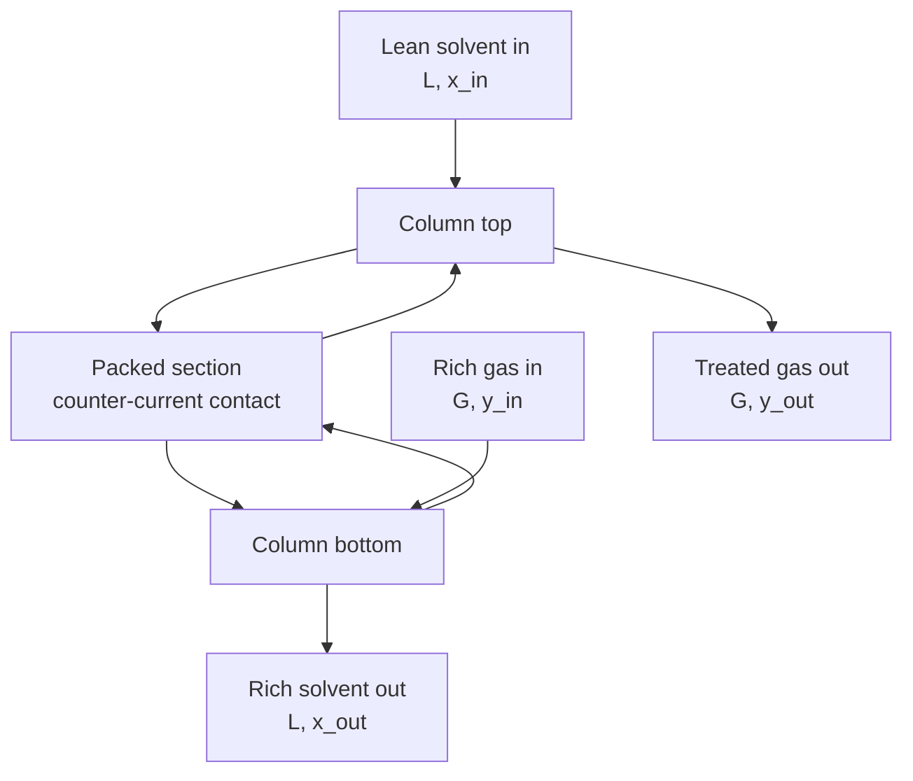

## Video Lecture

<div class="video-container">
  <iframe
    width="560"
    height="315"
    src="https://www.youtube.com/embed/ANAuU3W1DPw?start=817"
    title="Chemical Engineering Mass Transfer and Separation Ch.2: Absorption, Stripping, and the Transfer Unit"
    frameborder="0"
    allow="accelerometer; autoplay; clipboard-write; encrypted-media; gyroscope; picture-in-picture"
    allowfullscreen>
  </iframe>
</div>

> This video covers the same content as the text below. Choose your preferred learning format.

---

# Chapter 2: Absorption, Stripping, and the Transfer Unit

[Chapter 1](chapter-1.html) built the machinery of interphase transfer — the two-film picture, the overall coefficient, and Henry's law as the equilibrium statement that fixes where the two phases are trying to go. This chapter spends it. Given a gas stream carrying something you want out, how much solvent do you pump, and how tall a column do you buy?

**Operating Lines, Minimum Liquid Rate, and the HTU-NTU Method**

## Learning Objectives

By completing this chapter, you will be able to:

  * ✅ State what absorption and stripping do and name typical duties for each
  * ✅ Draw the equilibrium line and the operating line and read the driving force as the gap between them
  * ✅ Compute a minimum liquid-to-gas ratio from the pinch at the rich end of the column
  * ✅ Use the absorption factor $A = L/(mG)$ to judge whether a design is comfortable or pinched
  * ✅ Size a packed column with $Z = \text{HTU} \times \text{NTU}$, including the strong-solvent case $\text{NTU} = \ln(y_{in}/y_{out})$
  * ✅ Choose between trays and packing, and explain how an absorber and a stripper pair into a regeneration loop

**Reading Time**: 20-25 minutes **Code Examples**: 1 **Exercises**: 3

* * *

## 2.1 The Job: Move a Solute Between Phases

**Absorption** contacts a gas stream with a liquid solvent so that one component — the **solute** — leaves the gas and dissolves into the liquid. **Stripping** (or desorption) is the same equipment run the other way: contact a loaded liquid with a clean gas and the solute comes back out. The physics is the interphase transfer of [Chapter 1](chapter-1.html); the engineering question is how much contacting area to provide.

Both are everywhere in a plant, because they answer "this stream contains something that must not leave with it." Flue-gas scrubbing washes acid gases out of a combustion exhaust before the stack. Gas sweetening removes acidic components from a raw gas so it meets a pipeline specification and does not corrode the pipeline on the way. Solvent-vapor recovery pulls a regulated organic out of a vent; air stripping runs the reverse duty on contaminated water. Specifications differ enormously — one duty needs 90% removal, another five nines — but the sizing logic below is the same in every case.

Two properties decide whether the job is easy or brutal. The first is **solubility**: how strongly the solvent wants the solute, captured for dilute systems by the Henry's-law slope $m$ in $y^* = m x$, where $y^*$ is the gas-phase mole fraction in equilibrium with a liquid of composition $x$. Small $m$ means a tight-holding solvent and an easy separation. The second is the **required recovery**, which enters logarithmically rather than linearly — the central sizing result of Section 2.4, and the reason very deep removals cost less than intuition suggests.

Where a reaction in the liquid consumes the solute — the usual arrangement in acid-gas duty — the equilibrium partial pressure falls far below what physical solubility alone would give. **Chemical absorption** has its own design theory beyond this chapter; what follows is the physical, dilute, Henry's-law case, a reasonable first pass for many real columns.

## 2.2 Two Lines: Equilibrium and Operating

Picture the standard hardware: a vertical cylinder filled with **packing**, gas rising from the bottom, liquid trickling down over the packing surface from the top, the two phases in **counter-current** contact throughout.



Everything the designer needs sits on one plot of $y$ against $x$ — gas-phase against liquid-phase mole fraction — carrying two lines.

The **equilibrium line** says where the phases would end up given unlimited time and area. For a dilute system obeying Henry's law it is straight through the origin:

$$ y^* = m x $$

The **operating line** says where the phases actually are at each height, and it comes from a mass balance, not thermodynamics. Draw an envelope from the top of the column down to an arbitrary slice; solute in must equal solute out, so with $G$ the molar gas flow and $L$ the molar liquid flow:

$$ G(y - y_{out}) = L(x - x_{in}) \qquad \Longrightarrow \qquad y = \frac{L}{G}x + \left(y_{out} - \frac{L}{G}x_{in}\right) $$

A straight line of slope $L/G$, through the top-of-column point $(x_{in}, y_{out})$ and the bottom-of-column point $(x_{out}, y_{in})$. It is straight because the streams were assumed dilute enough that carrier gas and solvent flows barely change as solute crosses between them — the same simplification that straightened the equilibrium line. Concentrated systems curve the operating line in mole-fraction coordinates; switching to mole-ratio coordinates straightens it again, which is exactly why those coordinates exist.

Together the lines carry the whole design. At any height the gas is at $y$ and the liquid it contacts at $x$; the gas *would* be at $y^* = mx$ if equilibrium were reached. The **driving force** is the vertical distance between the lines, $y - y^*$. For absorption the operating line lies **above** the equilibrium line — the gas is richer than equilibrium with the local liquid, so solute moves gas → liquid, the direction wanted. Where the lines touch, the driving force is zero and no further transfer occurs however much packing is installed.

This is the structural twin of the heat-transfer picture. In [Heat Transfer Chapter 2](../chemical-engineering-heat-transfer/chapter-2.html) the driving force is a temperature gap along the exchanger and $Q = UA\,\Delta T_{lm}$ divides duty by an average driving force to get area; here the gap is a composition difference along a column, and the sizing law divides the required composition change by an average driving force to get height. Both averages come out logarithmic, for the same reason: the gap decays exponentially along the equipment.

## 2.3 The Minimum Liquid Rate

Solvent is not free — pumping costs power, regeneration costs steam, inventory costs money — so the designer wants $L$ as small as the separation allows. Watch what happens as $L/G$ falls.

The operating line is anchored at the top-of-column point $(x_{in}, y_{out})$: the lean solvent fed and the specification that must be hit. Reducing $L/G$ reduces its slope, swinging the line down toward the equilibrium line — physically, less solvent carrying the same load means a more concentrated loaded solvent, so $x_{out}$ rises and the bottom point slides right. Keep going and the lines touch. That contact is a **pinch**, and here it occurs at the **rich end**, the column bottom where both compositions are highest.

At the pinch the exiting liquid is in equilibrium with the entering gas:

$$ x_{out}^* = \frac{y_{in}}{m} $$

and the mass balance over the whole column then gives the **minimum liquid-to-gas ratio**:

$$ \left(\frac{L}{G}\right)_{min} = \frac{y_{in} - y_{out}}{x_{out}^* - x_{in}} = \frac{y_{in} - y_{out}}{y_{in}/m - x_{in}} $$

The minimum is a limit, not a design. At exactly $(L/G)_{min}$ the driving force at the bottom is zero and the required packed height is infinite — an unbounded column traded for a finite saving in pump duty. Approach the minimum and height climbs steeply; back away and it falls quickly at first, then hardly at all. Real designs sit on the knee of that curve, located by the **absorption factor**:

$$ A = \frac{L}{mG} $$

$A$ — the absorption factor, not to be confused with the area in $Q = UA\,\Delta T_{lm}$ — is the operating-line slope divided by the equilibrium-line slope: solvent capacity provided against what the solute's volatility demands. $A < 1$ means the equilibrium line is steeper and caps the attainable recovery at $A$ itself, however tall the column; $A > 1$ means the lines diverge down the column and any specified recovery can be bought with finite height. **Typically** absorber designs land around $A \approx 1.2$ to $2.0$ — a rule of thumb, not an optimum to quote without checking, since the real optimum depends on local solvent, steam, and capital costs.

One exact result makes it concrete. With a clean solvent ($x_{in} = 0$), dividing the minimum-ratio expression by $m$ gives

$$ A_{min} = \frac{(L/G)_{min}}{m} = 1 - \frac{y_{out}}{y_{in}} $$

exactly the fractional recovery. Demand 98% removal and $A$ must exceed 0.98 for the column to work at all; demand 99.9% and it must exceed 0.999. That floor is always below 1, so the customary band clears it for any recovery, and the design question is not *whether* $A$ is large enough but how much height a modest $A$ costs.

## 2.4 HTU and NTU: Height as a Product

The sizing result for a packed column is deceptively simple:

$$ Z = \text{HTU} \times \text{NTU} $$

where $Z$ is the packed height in meters. The factorization separates the separation's difficulty from the hardware's quality.

The **number of transfer units** (NTU) is the *difficulty*: a dimensionless count of how many times the available driving force must be consumed to get from the inlet composition to the outlet specification.

$$ \text{NTU} = \int_{y_{out}}^{y_{in}} \frac{dy}{y - y^*} $$

No hardware appears in it — only the compositions demanded and the equilibrium line the chemistry handed you. It is the mass-transfer analogue of the NTU in the ε-NTU method of [Heat Transfer Chapter 2](../chemical-engineering-heat-transfer/chapter-2.html), and shares the name for that reason.

The **height of a transfer unit** (HTU) is the *hardware*: the packed height needed for one transfer unit, equal to the gas flow per unit cross-section divided by the volumetric coefficient $K_y a$ — where $a$ is interfacial area per unit packed volume, the packing's whole reason for existing. A small HTU means a packing generating plenty of wetted area per meter. **Typical** packed-column HTU values are often quoted around 0.3 to 0.6 m, but that is a planning figure only: HTU depends on packing type and size, flow rates, physical properties, and how evenly the liquid is distributed, so real projects take it from vendor data or pilot tests.

The integral has a closed form when both lines are straight — the standard dilute-system result, in the Colburn form:

$$ \text{NTU} = \frac{A}{A-1}\ln\left[\left(1 - \frac{1}{A}\right)\frac{y_{in} - m x_{in}}{y_{out} - m x_{in}} + \frac{1}{A}\right] $$

Unwieldy, but it collapses in the limit that matters most. If the solvent is strong enough — high solvent rate, low $m$, or a reaction consuming the solute — that $y^* \approx 0$ everywhere, the integral becomes $\int dy/y$ — which evaluates to the logarithm of the ratio of its limits:

$$ \text{NTU} = \ln\!\left(\frac{y_{in}}{y_{out}}\right) $$

That logarithm is the sentence to remember. **Separation difficulty depends on the removal ratio, not the amount removed.** Halving the outlet always costs $\ln 2 \approx 0.69$ extra transfer units, whether going from 10% to 5% or from 1 ppm to 0.5 ppm.

### Worked Example

A dilute solute must be removed to 98%, with a solvent strong enough to take $y^* \approx 0$. The removal ratio is then

$$ \frac{y_{in}}{y_{out}} = \frac{1}{1 - 0.98} = 50 \qquad \Longrightarrow \qquad \text{NTU} = \ln 50 \approx 3.9 $$

With an assumed HTU of 0.6 m:

$$ Z = \text{HTU} \times \text{NTU} = 0.6 \times 3.9 \approx 2.3\ \text{m} $$

Under two and a half meters of packing for 98% removal — genuinely the order of magnitude for an easy absorption duty, and a good illustration of why packed columns are attractive. Treat it as a feasibility estimate, not a purchase. The HTU was assumed and carries most of the uncertainty; $y^* \approx 0$ is the *most* favorable case, and a finite $A$ raises NTU above $\ln 50$, sometimes far above, as the code shows; and a real column adds height for liquid distribution, for end effects where the phases enter, and for margin against off-design operation. The delivered vessel is taller than 2.3 m.

```python
import math

HTU = 0.6  # m, assumed packing height of a transfer unit


def ntu_strong_solvent(ratio):
    """NTU for the limiting case y* ~ 0, given the removal ratio y_in/y_out."""
    return math.log(ratio)


def ntu_colburn(A, ratio):
    """NTU for a straight equilibrium line and a clean solvent (x_in = 0).

    A is the absorption factor L/(m*G); ratio is y_in/y_out.
    """
    if abs(A - 1.0) < 1e-9:      # the A = 1 limit of the expression
        return ratio - 1.0
    return A / (A - 1.0) * math.log((1.0 - 1.0 / A) * ratio + 1.0 / A)


# Worked example: 98% removal, y* ~ 0
ratio = 1.0 / (1.0 - 0.98)
ntu0 = ntu_strong_solvent(ratio)
print(f"removal ratio y_in/y_out = {ratio:.0f}")
print(f"NTU (y* ~ 0)             = {ntu0:.2f}")
print(f"packed height Z          = {HTU * ntu0:.2f} m\n")

# The cost of running close to the pinch
print(f"{'A = L/(mG)':>11} {'NTU':>7} {'Z [m]':>7}")
for A in (1.0, 1.05, 1.1, 1.2, 1.5, 2.0, 3.0):
    n = ntu_colburn(A, ratio)
    print(f"{A:>11.2f} {n:7.1f} {HTU * n:7.1f}")
print(f"{'infinite':>11} {ntu0:7.1f} {HTU * ntu0:7.1f}")

# removal ratio y_in/y_out = 50
# NTU (y* ~ 0)             = 3.91
# packed height Z          = 2.35 m
#
#  A = L/(mG)     NTU   Z [m]
#        1.00    49.0    29.4
#        1.05    25.3    15.2
#        1.10    18.7    11.2
#        1.20    13.3     8.0
#        1.50     8.6     5.1
#        2.00     6.5     3.9
#        3.00     5.3     3.2
#    infinite     3.9     2.3
```

The sweep is the lesson — the quantitative form of the pinch argument. Just above the minimum ($A_{min} = 0.98$ here), at $A = 1$, the column needs 49 transfer units and nearly 30 m of packing. Raise $A$ to 1.5 and that collapses to about 5 m; at $A = 2$ it is under 4 m. Then it flattens: going from $A = 2$ to infinite solvent buys only another 1.6 m. That flattening is why the customary band sits where it does — below roughly $A \approx 1.2$ height is exploding, above roughly $A \approx 2$ you pay for circulation that no longer buys much column.

## 2.5 Trays or Packing

The same duty runs in a **packed column** — a random or structured packing bed with liquid distributed across the top — or a **tray column**, a stack of plates each holding a liquid pool through which the gas bubbles. Both create interfacial area; they trade differently.

| | Trays | Packing |
|---|---|---|
| **Contacting mechanism** | Gas bubbles through a liquid pool on each plate | Liquid films flow over a fixed bed surface |
| **Pressure drop per stage** | Higher — the gas must lift a liquid head on every tray | Lower — usually the deciding factor for vacuum and large-volume gas duties |
| **Capacity / turndown** | Handles high liquid loads well; tolerates wide flow swings | Sensitive to low liquid rates — dry patches wreck the wetted area |
| **Fouling and solids tolerance** | More tolerant — plates can be inspected and cleaned | Poorer — a fouling or precipitating service plugs the bed |
| **Small-diameter economics** | Poor — plate hardware and manways do not scale down cheaply | Better — packing is generally the cheaper choice below roughly a meter of diameter |
| **Corrosive service** | Metal fabrication constrains the material choice | Ceramic and plastic packings widen the options |
| **Design basis** | Equilibrium stages plus a tray efficiency | Continuous contact, $Z = \text{HTU} \times \text{NTU}$ |

The last row is the conceptual split. Trays are described as a sequence of **equilibrium stages**, each discounted by a **tray efficiency** below 1 because real trays do not reach equilibrium; packing is described as continuous contact and sized by transfer units. The two are interconvertible for straight lines, and a designer comparing options usually does convert, wanting one currency. Under standard practice, low-pressure-drop, small-diameter, and corrosive duties tend toward packing while high-liquid-load, fouling, and wide-turndown duties tend toward trays — a starting point for a specification, not a substitute for one, since real selections weigh vendor performance data, materials, and installed cost.

## 2.6 Stripping: The Mirror Image

Stripping runs absorption backwards, and every result above reflects rather than changes.

A loaded solvent enters the top and a clean **stripping agent** — steam, air, or an inert gas — enters the bottom. The liquid is now richer than equilibrium with the gas it meets, so the solute leaves the liquid. On the $y$-$x$ diagram the operating line lies **below** the equilibrium line and the driving force is $y^* - y$, the same gap read the other way. The pinch is at the rich end again — here the *top*, where the loaded liquid enters — and it sets a **minimum gas rate** rather than a minimum liquid rate. The controlling group inverts to the **stripping factor** $S = mG/L = 1/A$, which stripping wants comfortably above 1 for exactly the reason absorption wants $A$ above 1.

Everything that makes absorption easy makes stripping hard, and that trade sits at the center of solvent selection. A solvent with very small $m$ holds the solute tightly and absorbs beautifully; that same grip must be broken to get the solvent back, and the stripper pays in energy. Raising temperature or dropping pressure shifts $m$ helpfully — gas solubility in a liquid generally falls as temperature rises — which is why regeneration is typically hot and absorption typically cool.

That pairing is why strippers exist. Solvent is rarely used once and discarded; an absorber and a stripper couple into a **regeneration loop**. Lean solvent absorbs cold, the loaded solvent is heated (usually against the returning lean stream in a cross exchanger — the heat integration of [Heat Transfer Chapter 2](../chemical-engineering-heat-transfer/chapter-2.html) applied to a solvent circuit) and fed to the stripper, the solute leaves as a concentrated product or waste stream, and the regenerated solvent is cooled and returned. **Amine units** for acid-gas removal are the canonical example.

The loop reframes the solvent-rate decision. Section 2.4 treated a high $L/G$ as simply buying a shorter column, but every mole circulated must also be heated, stripped, and cooled again, returning as regenerator reboiler duty. Solvent rate is the main lever on the loop's steam consumption, so the honest optimum spans both columns and their utilities.

## 2.7 Chapter Summary

1. **Absorption** transfers a solute from a gas into a liquid solvent; **stripping** reverses it. Typical duties: flue-gas scrubbing, gas sweetening, solvent-vapor recovery from vents, air stripping of volatiles from water
2. Design lives on a $y$-$x$ plot with two lines — the **equilibrium line** $y^* = mx$ from Henry's law ([Chapter 1](chapter-1.html)) and the **operating line** $y = (L/G)x + (y_{out} - (L/G)x_{in})$ from a mass balance on a column slice. The **driving force** is the vertical gap between them; for absorption the operating line sits above the equilibrium line
3. As $L/G$ falls the operating line **pinches** onto the equilibrium line at the rich end, giving $x_{out}^* = y_{in}/m$ and $(L/G)_{min} = (y_{in}-y_{out})/(x_{out}^*-x_{in})$ — a limit requiring infinite height, never a design. The **absorption factor** $A = L/(mG)$ says how far above that pinch a design runs; with a clean solvent $A_{min}$ equals the fractional recovery exactly, and designs **typically** land around $A \approx 1.2$ to $2.0$
4. Packed height factorizes as $Z = \text{HTU} \times \text{NTU}$: **NTU** is the separation's difficulty, **HTU** the packing's efficiency yardstick — **typically** cited around 0.3 to 0.6 m, a planning figure to be replaced by vendor or pilot data
5. With a solvent strong enough that $y^* \approx 0$, $\text{NTU} = \ln(y_{in}/y_{out})$: difficulty depends on the removal *ratio*, so halving the outlet always costs $\ln 2 \approx 0.69$ more transfer units. For 98% removal, $y_{in}/y_{out} = 50$, $\text{NTU} = \ln 50 \approx 3.9$, and with HTU $= 0.6$ m, $Z \approx 2.3$ m — before margin, end effects, and distribution height
6. Running near the pinch is expensive: the same duty needs about 29 m of packing at $A = 1$, about 5 m at $A = 1.5$, about 3.9 m at $A = 2$, then flattens — which is where the 1.2-2.0 band comes from
7. **Trays** suit high liquid loads, fouling service, and wide turndown; **packing** suits low pressure drop, small diameters, and corrosive duty. Trays are sized as equilibrium stages with an efficiency, packing by transfer units
8. Stripping mirrors absorption: operating line **below** equilibrium, a minimum *gas* rate, and the **stripping factor** $S = mG/L = 1/A$. Absorbers and strippers pair into **regeneration loops** — amine units being canonical — so solvent rate trades against reboiler duty, not just column height

**Next chapter**: absorption exploited a solubility difference between a gas and a liquid. Let both phases be liquid-and-vapor of the *same* mixture, and the separation instead exploits differences in volatility — with every stage producing both a vapor and a liquid that must be recontacted. [Chapter 3](chapter-3.html) takes on **distillation**, the default large-scale separation of the process industries and commonly their largest separation energy consumer.

## Exercises

1. **Quantitative — minimum liquid rate**: A gas enters an absorber at $y_{in} = 0.020$ and must leave at $y_{out} = 0.0010$. The solvent is clean ($x_{in} = 0$) and the equilibrium line is $y^* = 2.0\,x$. (a) What liquid composition is in equilibrium with the entering gas? (b) Compute $(L/G)_{min}$. (c) What absorption factor does the minimum correspond to, and what is $A$ at 1.5 times the minimum liquid rate? Comment on where that lands relative to common practice.
   *Hint*: the pinch is at the rich (bottom) end, where the leaving liquid reaches equilibrium with the entering gas. Then $A = (L/G)/m$.
   *Answer*: (a) $x_{out}^* = y_{in}/m = 0.020/2.0 =$ **0.010**. (b) $(L/G)_{min} = (0.020-0.0010)/0.010 =$ **1.9** mol liquid per mol gas. (c) $A_{min} = 1.9/2.0 =$ **0.95**, exactly the fractional recovery $1 - 0.0010/0.020$, as Section 2.3 predicted for a clean solvent. At 1.5 times the minimum, $L/G = 2.85$ and $A = 2.85/2.0 =$ **1.43** — inside the customary 1.2-2.0 band, comfortably off the pinch without paying for solvent that buys little extra height. Note $A_{min} < 1$ always for a clean solvent, so the real constraint is never $A > 1$ as such; it is $A$ above the recovery fraction, with the rule-of-thumb band supplying the economic margin.

2. **Quantitative — NTU and packed height**: A vent stream must be scrubbed to 99% removal of a dilute solute, with a solvent strong enough that $y^* \approx 0$ throughout. (a) Compute the required NTU. (b) With an assumed HTU of 0.45 m, estimate the packed height. (c) The specification then tightens to 99.5%. How much does NTU rise, how much extra packing does that imply, and what general rule does the comparison illustrate?
   *Hint*: with $y^* \approx 0$, $\text{NTU} = \ln(y_{in}/y_{out})$, and the removal ratio for a fractional removal $R$ is $1/(1-R)$.
   *Answer*: (a) $y_{in}/y_{out} = 1/(1-0.99) = 100$, so $\text{NTU} = \ln 100 =$ **4.6**. (b) $Z = 0.45 \times 4.605 =$ **2.1 m** of packing — before margin, end effects, and distributor height, with the assumed HTU the dominant uncertainty, exactly as in Section 2.4. (c) At 99.5% the ratio is 200, so $\text{NTU} = \ln 200 = 5.30$, an increase of $\ln 2 =$ **0.69** transfer units, or $0.45 \times 0.69 =$ **0.31 m** more packing. The rule: because NTU is a logarithm of the removal *ratio*, each halving of the outlet costs the same fixed $\ln 2 \approx 0.69$ transfer units regardless of the starting point. Deep removals are far cheaper in height than linear intuition suggests — provided $A$ stays well clear of the pinch and $y^* \approx 0$ holds.

3. **Conceptual — why counter-current**: An engineer proposes running an absorber **co-currently**, feeding gas and liquid together at the top so both flow down through the packing. (a) State the best outcome co-current flow can achieve. (b) Explain why counter-current flow has no such ceiling. (c) Relate the argument to the counter-current case for heat exchangers in [Heat Transfer Chapter 2](../chemical-engineering-heat-transfer/chapter-2.html).
   *Hint*: in co-current contact both streams start at their inlet compositions in the same place; ask what state they approach as the column gets longer.
   *Answer*: (a) The rich gas meets the lean solvent only at the inlet, where the driving force is largest; thereafter the gas gets leaner while the liquid gets richer *together*. The two converge on **mutual equilibrium**, so the best an infinitely long co-current column can do is deliver gas in equilibrium with the leaving liquid, $y_{out} \to m x_{out}$. Since $x_{out}$ is set by the solute already absorbed, that floor can sit far above the specification and no extra packing gets past it. (b) Counter-current flow pairs the *treated* gas at the top against the *lean* solvent entering there, so the cleanest gas always meets the cleanest liquid. The driving force is maintained up the column rather than spent at the inlet, and the outlet gas is limited by the *entering* solvent composition, not the leaving one. With a clean solvent that limit is $y^* \to 0$ — the strong-solvent case of Section 2.4 — so arbitrarily deep removal is achievable in finite height. (c) Same argument, different currency. Co-current heat exchange cannot lift the cold outlet above the hot outlet because the streams converge to a common temperature; counter-current pairs the cold outlet against the hot *inlet* and permits a temperature cross. The shared structure: co-current spends its driving force near the inlet and asymptotes to one mixed state, while counter-current distributes the driving force along the equipment and judges each stream's outlet against the *other* stream's inlet. Equipment size in both disciplines is duty divided by an average driving force, so preserving that average is worth more than any refinement of the transfer coefficient.
