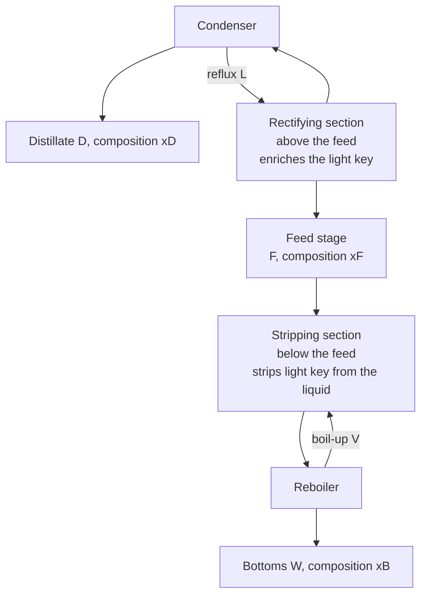

## Video Lecture

<div class="video-container">
  <iframe
    width="560"
    height="315"
    src="https://www.youtube.com/embed/ANAuU3W1DPw?start=1595"
    title="Chemical Engineering Mass Transfer and Separation Ch.3: Distillation and the McCabe-Thiele Method"
    frameborder="0"
    allow="accelerometer; autoplay; clipboard-write; encrypted-media; gyroscope; picture-in-picture"
    allowfullscreen>
  </iframe>
</div>

> This video covers the same content as the text below. Choose your preferred learning format.

---

# Chapter 3: Distillation and the McCabe-Thiele Method

This chapter is the direct continuation of [Thermodynamics Chapter 3](../chemical-engineering-thermodynamics/chapter-3.html). That chapter derived the vapor-liquid equilibrium of an ideal binary and compressed it into one number, the relative volatility $\alpha$. Here that number is spent: it becomes column height, reflux ratio, and reboiler duty.

**Relative Volatility, Operating Lines, and the Reflux Trade**

## Learning Objectives

By completing this chapter, you will be able to:

  * ✅ Explain why distillation is the default separation for volatile mixtures and why it is energy-hungry
  * ✅ Use the constant-$\alpha$ equilibrium relation and judge from $\alpha$ whether distillation is a comfortable choice
  * ✅ Identify the rectifying section, stripping section, reflux, reboiler, and condenser and state what each contributes
  * ✅ Apply the Fenske equation to compute minimum stages at total reflux
  * ✅ Construct a McCabe-Thiele diagram from the 45° line, the equilibrium curve, the operating lines, and the q-line
  * ✅ Compute minimum reflux for a saturated-liquid binary feed and explain the capital-versus-energy trade it governs

**Reading Time**: 20-25 minutes **Code Examples**: 1 **Exercises**: 3

* * *

## 3.1 Why Distillation, and Why It Costs So Much

Ask a process engineer to separate a liquid mixture of volatile species and the first answer will almost always be **distillation**. It is the most common large-scale separation for such mixtures in the chemical and petroleum industries — a statement about industrial practice rather than a measured share, and one worth keeping qualitative, since published estimates of distillation's energy footprint vary widely with what is counted.

The reasons are unglamorous and durable. Distillation needs no **mass separating agent** — no solvent, adsorbent, or membrane that must itself be bought, regenerated, and disposed of. It uses heat, which every plant already has piped to it. It scales smoothly from a laboratory column to a crude tower ten meters across, and its design methods are a century old and heavily validated. The alternatives — extraction, adsorption, membranes, crystallization — must justify themselves case by case, which is why they appear where distillation struggles.

The bill arrives as energy. [Thermodynamics Chapter 1](../chemical-engineering-thermodynamics/chapter-1.html) made the point in its own terms: a column does not merely warm its feed, it boils a stream at the bottom and condenses it again at the top, over and over, because **every mole of liquid returned as reflux must be vaporized once more on the next pass**. The internal vapor traffic is therefore several times the product flow, each unit of it carrying a latent heat of hundreds to thousands of kJ/kg. Hence the reboiler and condenser are typically the largest utility consumers on a flowsheet, and the hardware serving them — the reboilers and noncondensable-plagued condensers of [Heat Transfer Chapter 3](../chemical-engineering-heat-transfer/chapter-3.html) — is where the operating cost is actually incurred.

Two consequences organize the rest of the chapter: anything that reduces reflux reduces the energy bill directly, and reducing reflux costs stages, which are steel.

## 3.2 Relative Volatility as the Sorting Handle

What makes a mixture separable by boiling is that the vapor above it differs from the liquid beneath it. **Relative volatility** measures exactly that, for a binary with light component 1 and heavy component 2:

$$ \alpha = \frac{y_1/x_1}{y_2/x_2} $$

For an ideal solution this reduces to the ratio of pure-component vapor pressures, $\alpha = P_1^{sat}/P_2^{sat}$, as derived in [Thermodynamics Chapter 3](../chemical-engineering-thermodynamics/chapter-3.html). When $\alpha$ is roughly constant over the composition range — a decent approximation for chemically similar species over a modest temperature span, not a law — the equilibrium relation collapses to one expression:

$$ y = \frac{\alpha x}{1 + (\alpha - 1)x} $$

This single equation replaces a table of equilibrium data, which is what makes hand calculation of a column possible at all.

**Benzene-toluene** is the canonical well-behaved case and the worked system here. Benzene boils at **80.1 °C** and toluene at **110.6 °C** at 1 atm; the thermodynamics chapter obtained $\alpha \approx 2.48$ from vapor pressures at 90 °C, and that value is used throughout. Read the equation at $x = 0.4$ and it returns $y = 0.623$: one equilibrium contact lifts the benzene content by 22 percentage points.

How large must $\alpha$ be? A deliberately soft rule of thumb: **above about 1.5, distillation is generally comfortable** — stage counts stay in the tens and reflux ratios in the low single digits. Between roughly 1.1 and 1.5 it remains feasible but the column grows tall and the reflux expensive. As $\alpha$ approaches 1 the phases converge, each stage accomplishes almost nothing, and the design diverges toward infinite height; and at an **azeotropic composition**, where $\alpha$ passes through 1, no stage count moves the mixture past that point. These are heuristics, not thresholds: a large throughput or cheap steam can justify a low-$\alpha$ column a small plant would never build. Section 3.4's formula, at one fixed purity specification, gives about 6.5 minimum stages at $\alpha = 2.48$, about 14.5 at $\alpha = 1.5$, about 32 at $\alpha = 1.2$, and about 121 at $\alpha = 1.05$ — and those are *minimum* stages, before any allowance for finite reflux or tray inefficiency.

## 3.3 Anatomy of a Column

A distillation column is a vertical stack of contacting stages — trays, or an equivalent height of packing — fed near the middle, with a **reboiler** at the base and a **condenser** at the top.



Vapor rises, liquid falls, and on every stage they contact long enough to approach equilibrium. Because the vapor leaving a stage is richer in the light component than the liquid left behind, each contact shifts composition further in the desired direction.

The two sections do different jobs. Above the feed, the **rectifying section** enriches the rising vapor in the light key; below it, the **stripping section** removes the light key from the descending liquid so the bottoms product is clean. Neither works without a returning stream: the rectifying section needs liquid running down it, supplied by **reflux** — condensed overhead returned to the top rather than taken as product — and the stripping section needs vapor running up it, supplied by the reboiler's **boil-up**. A column with no reflux is a single flash drum with extra plumbing. That framing exposes the two limits bracketing every real design.

| Limit | Reflux ratio $R$ | Stages required | Product | Why it is impossible |
|---|---|---|---|---|
| **Total reflux** | $\infty$ | **minimum** | none | Everything condensed is returned; nothing leaves |
| **Minimum reflux** | $R_{\min}$ | **infinite** | full | The column would be infinitely tall |

Total reflux gives the fewest stages any column could need, because the driving force on every stage is as large as it can be. Minimum reflux gives the least energy, because the boil-up is as small as it can be — but there the operating line touches the equilibrium curve, the driving force vanishes at the contact, and the stages **pinch**: infinitely many accumulate where nothing changes. Real columns sit between.

## 3.4 Total Reflux and the Fenske Equation

At total reflux the material balance simplifies drastically: with no product withdrawn, the liquid falling from any stage equals the vapor rising to it, so the operating line coincides with the 45° line $y = x$. Chaining the constant-$\alpha$ equilibrium relation through $N$ such stages telescopes into the **Fenske equation** for the minimum number of theoretical stages:

$$ N_{\min} = \frac{\ln\!\left[\dfrac{x_D}{1-x_D}\cdot\dfrac{1-x_B}{x_B}\right]}{\ln \alpha} $$

The bracketed quantity is a ratio of two **separation ratios** — light-to-heavy in the distillate over light-to-heavy in the bottoms — so the equation counts how many multiplications by $\alpha$ span that gap.

### Worked Example: Benzene-Toluene at Total Reflux

Specify a distillate of $x_D = 0.95$ benzene and a bottoms of $x_B = 0.05$ benzene, with $\alpha = 2.48$:

$$ \frac{x_D}{1-x_D}\cdot\frac{1-x_B}{x_B} = \frac{0.95}{0.05}\times\frac{0.95}{0.05} = 19 \times 19 = 361 $$

$$ N_{\min} = \frac{\ln 361}{\ln 2.48} = \frac{5.89}{0.908} \approx \mathbf{6.5\ \text{theoretical stages}} $$

Three cautions travel with that number. It counts **theoretical** stages, each assumed to reach equilibrium; real trays do not, and dividing by a tray efficiency inflates the physical count. It counts the **reboiler as one stage**, since the reboiler is itself an equilibrium contact. And it is a *floor*, unreachable by any column that takes product. Its use is as a screening number and as the anchor for shortcut correlations that estimate real stage counts from $N_{\min}$ and $R_{\min}$ together.

## 3.5 The McCabe-Thiele Construction

The **McCabe-Thiele method** turns the design into a staircase drawn on one plot of vapor composition $y$ against liquid composition $x$, both running 0 to 1. Its power is that equilibrium and material balance appear as two different curves on the same axes, and alternating between them *is* the column. Four elements make the plot.

**The 45° line**, $y = x$: the no-separation reference, since a point on it has vapor and liquid of identical composition. It also locates $x_D$, $x_F$, and $x_B$, each a single stream with one composition.

**The equilibrium curve**, $y = \alpha x/[1+(\alpha-1)x]$, bulging above the 45° line. The vertical gap between curve and line at any $x$ is the enrichment one equilibrium stage delivers. For $\alpha = 2.48$ that gap peaks near $x = 0.4$ at about 0.22 and collapses at both ends — which is why the last few percent of purity are the expensive part.

**The rectifying operating line.** A material balance around the top of the column — condenser plus every stage above an arbitrary cut — relates the vapor rising past the cut to the liquid falling past it. With reflux ratio $R = L/D$ (reflux returned over distillate taken) and constant molar overflow assumed, it is straight:

$$ y = \frac{R}{R+1}\,x + \frac{x_D}{R+1} $$

The operating-line logic of [Chapter 2](chapter-2.html) applies unchanged; only the streams are renamed. Its slope $R/(R+1)$ is always below 1 and rises toward 1 as $R$ grows, while its intercept $x_D/(R+1)$ shrinks. It passes through $(x_D, x_D)$ whatever $R$ is, so raising the reflux **pivots** the line about that point, swinging it away from the equilibrium curve and opening up the driving force.

**The q-line.** How the feed enters changes the traffic on each side. The parameter $q$ is the moles of saturated liquid added to the stripping section per mole of feed — loosely, "how liquid" the feed is. A **saturated-liquid feed** has $q = 1$, a saturated vapor $q = 0$; a subcooled liquid gives $q > 1$ and a superheated vapor $q < 0$. The q-line is the locus of intersections of the two operating lines, starts at $(x_F, x_F)$, and has slope $q/(q-1)$. For the saturated-liquid case used below that slope is infinite: **the q-line is vertical at $x = x_F$**.

**The stripping operating line** then needs no separate algebra — it runs from $(x_B, x_B)$ to the point where the rectifying line meets the q-line. All three cross at one point, which is what makes the construction self-consistent.

### Stepping Off Stages

1. Start at $(x_D, x_D)$: the vapor leaving the top stage has composition $y = x_D$.
2. Move **horizontally to the equilibrium curve** — one equilibrium contact, finding the liquid in equilibrium with that vapor. One step drawn equals one theoretical stage.
3. Move **vertically to the operating line** — one material balance, finding the vapor rising from the stage below.
4. Repeat, switching from the rectifying to the stripping line as the staircase passes the q-line. That switch point is the **feed stage**.
5. Stop when a step lands at or below $x_B$, and count the steps: theoretical stages, reboiler included.

Two diagnostics come free. Steps are largest where the gap between operating line and equilibrium curve is largest and shrink where the two approach; a region of tiny steps is a **pinch**, the graphical signature of a reflux set too near the minimum. And if an operating line ever *touches* the equilibrium curve, no finite staircase gets past the contact.

## 3.6 Minimum Reflux and the Trade It Governs

For a binary with constant $\alpha$ and a saturated-liquid feed, the pinch occurs where the operating line meets the equilibrium curve at the feed composition, and the minimum reflux ratio follows in closed form (the **Underwood** result for this special case):

$$ R_{\min} = \frac{1}{\alpha - 1}\left[\frac{x_D}{x_F} - \frac{\alpha\,(1-x_D)}{1-x_F}\right] $$

### Worked Example: Benzene-Toluene, Saturated-Liquid Feed

Take an equimolar feed, $x_F = 0.5$, with the same $x_D = 0.95$ and $\alpha = 2.48$:

$$ R_{\min} = \frac{1}{1.48}\left[\frac{0.95}{0.5} - \frac{2.48 \times 0.05}{0.5}\right] = \frac{1}{1.48}\left[1.9 - 0.248\right] \approx \mathbf{1.12} $$

At $R = 1.12$ this column would need infinitely many stages, so practice adds a margin. The long-standing heuristic places the economic optimum at roughly **1.2 to 1.5 times $R_{\min}$** — sensitive to the local price of steam against the local price of steel, and a range modern optimization studies sometimes land outside. Taking $1.4 \times R_{\min}$ here gives a design reflux of about **1.56**, the case stepped off below.

| Move | Stages needed | Reboiler and condenser duty | Cost type |
|---|---|---|---|
| Raise $R$ | Fall, toward $N_{\min}$ | Rise, roughly with the boil-up | Capital down, energy up |
| Lower $R$ toward $R_{\min}$ | Rise, then diverge | Fall, toward its floor | Capital up, energy down |

Capital is paid once; energy is paid every hour for the life of the plant. That asymmetry is why retrofits shaving a few percent off a column's reflux are worth engineering attention.

```python
"""McCabe-Thiele stage stepping for a constant-alpha binary.
Benzene-toluene, alpha = 2.48 (Thermodynamics Chapter 3).
Saturated-liquid feed (q = 1), so the q-line is vertical at x = xF.
Constant molar overflow assumed throughout.
"""
import math

ALPHA = 2.48                      # relative volatility, benzene over toluene
xD, xB, xF = 0.95, 0.05, 0.50     # distillate, bottoms, feed compositions
R = 1.56                          # about 1.4 x R_min for this case


def y_eq(x):
    """Equilibrium vapor composition at constant relative volatility."""
    return ALPHA * x / (1.0 + (ALPHA - 1.0) * x)


def x_eq(y):
    """Inverse: liquid in equilibrium with vapor of composition y."""
    return y / (ALPHA - (ALPHA - 1.0) * y)


def fenske(xd, xb, alpha):
    """Minimum theoretical stages at total reflux."""
    return math.log((xd / (1 - xd)) * ((1 - xb) / xb)) / math.log(alpha)


def r_min(xd, xf, alpha):
    """Minimum reflux: binary, constant alpha, saturated-liquid feed."""
    return (1.0 / (alpha - 1.0)) * (xd / xf - alpha * (1 - xd) / (1 - xf))


Nmin, Rmin = fenske(xD, xB, ALPHA), r_min(xD, xF, ALPHA)
print(f"Fenske N_min   = {Nmin:.2f} theoretical stages (total reflux)")
print(f"Minimum reflux = {Rmin:.2f}   ->  1.4 x R_min = {1.4 * Rmin:.2f}")
print(f"Equilibrium check: y(0.40) = {y_eq(0.40):.3f}")

slope_rect = R / (R + 1.0)
icept_rect = xD / (R + 1.0)
y_feed = slope_rect * xF + icept_rect         # q-line is vertical at xF
slope_strip = (y_feed - xB) / (xF - xB)
print(f"\nRectifying: y = {slope_rect:.4f} x + {icept_rect:.4f}")
print(f"Operating lines cross the q-line at ({xF:.2f}, {y_feed:.4f})")
print(f"Stripping:  y = {slope_strip:.4f} (x - {xB}) + {xB}")


def y_op(x):
    """Operating line: rectifying above the feed, stripping below."""
    return slope_rect * x + icept_rect if x >= xF else slope_strip * (x - xB) + xB


print(f"\n{'stage':>5} {'y_op':>8} {'x_eq':>8}  section")
x, stages, feed_stage = xD, 0, None
while x > xB and stages < 100:
    y = x if stages == 0 else y_op(x)   # start on the 45 line at (xD, xD)
    section = "rectifying" if x >= xF else "stripping"
    x = x_eq(y)                        # horizontal step to equilibrium
    stages += 1
    if feed_stage is None and x < xF:
        feed_stage = stages
    print(f"{stages:5d} {y:8.4f} {x:8.4f}  {section}")

print(f"\nTheoretical stages (reboiler included): {stages}")
print(f"Feed stage, counted from the top:       {feed_stage}")
print(f"Ratio to the Fenske minimum:            {stages / Nmin:.2f}")

# Fenske N_min   = 6.48 theoretical stages (total reflux)
# Minimum reflux = 1.12   ->  1.4 x R_min = 1.56
# Equilibrium check: y(0.40) = 0.623
#
# Rectifying: y = 0.6094 x + 0.3711
# Operating lines cross the q-line at (0.50, 0.6758)
# Stripping:  y = 1.3906 (x - 0.05) + 0.05
#
# stage     y_op     x_eq  section
#     1   0.9500   0.8845  rectifying
#     2   0.9101   0.8033  rectifying
#     3   0.8606   0.7134  rectifying
#     4   0.8058   0.6259  rectifying
#     5   0.7525   0.5508  rectifying
#     6   0.7067   0.4928  rectifying
#     7   0.6658   0.4454  stripping
#     8   0.5999   0.3768  stripping
#     9   0.5045   0.2910  stripping
#    10   0.3852   0.2017  stripping
#    11   0.2609   0.1246  stripping
#    12   0.1538   0.0683  stripping
#    13   0.0754   0.0318  stripping
#
# Theoretical stages (reboiler included): 13
# Feed stage, counted from the top:       6
# Ratio to the Fenske minimum:            2.01
```

The staircase is the whole design in thirteen lines. The column needs **13 theoretical stages** including the reboiler, feed entering sixth from the top — very nearly **twice the Fenske minimum** of 6.5, a ratio that recurs often enough at 1.2–1.5 × $R_{\min}$ to serve as a sanity check, though it is an observation about this family of cases and not a law. Notice where the steps are small: stages 6 and 7, straddling the feed, advance composition least, because there the operating lines run closest to the equilibrium curve. Lower the reflux toward 1.12 and that is where the count would blow up.

## 3.7 Chapter Summary

1. **Distillation** is the default separation for volatile liquid mixtures — no mass separating agent, good scaling, mature methods — but it pays in energy, since every mole of **reflux** must be re-boiled
2. **Relative volatility** $\alpha$ is the sorting handle; for constant $\alpha$ the equilibrium curve is $y = \alpha x/[1+(\alpha-1)x]$, and benzene-toluene (80.1 °C / 110.6 °C) gives $\alpha \approx 2.48$
3. As a hedged rule of thumb, $\alpha$ above about **1.5** makes distillation comfortable; $\alpha$ near **1** forces very tall columns or another technology, and an azeotropic composition, where $\alpha$ passes through 1, blocks distillation past that point
4. A column is a **rectifying section** above the feed and a **stripping section** below, closed by a **condenser** returning reflux and a **reboiler** supplying boil-up
5. **Total reflux** gives minimum stages via the **Fenske equation**: for $x_D = 0.95$, $x_B = 0.05$, $\alpha = 2.48$ the log argument is $19 \times 19 = 361$ and $N_{\min} = 5.89/0.908 \approx$ **6.5 theoretical stages**
6. **Minimum reflux** gives infinite stages; for a saturated-liquid equimolar feed at the same specification, $R_{\min} = (1/1.48)[1.9 - 0.248] \approx$ **1.12**
7. **McCabe-Thiele** combines the 45° line, the equilibrium curve, the rectifying line $y = [R/(R+1)]x + x_D/(R+1)$, the **q-line** (vertical at $x_F$ for saturated liquid), and the stripping line; horizontal steps are equilibrium contacts, vertical steps material balances
8. At $R \approx 1.56$ (about $1.4 \times R_{\min}$) the worked case needs **13 theoretical stages** with the feed on stage 6, roughly twice $N_{\min}$. More reflux buys fewer stages at higher duty, and the reverse — capital once, energy forever

**Next chapter**: distillation separates by boiling, which fails when $\alpha$ approaches 1, when an azeotrope blocks the path, when the mixture is heat-sensitive, or when the feed is too dilute to boil economically. [Chapter 4](chapter-4.html) turns to the separations that step in for those cases — **extraction, adsorption, and membranes** — each built on a **mass separating agent** rather than heat, where the equilibrium relation is a partition or an isotherm rather than a volatility, but the staging logic carries over.

## Exercises

1. **Quantitative — Fenske and the cost of purity**: A benzene-toluene column with $\alpha = 2.48$ is respecified from $x_D = 0.95$, $x_B = 0.05$ to a tighter $x_D = 0.99$, $x_B = 0.01$. (a) Compute $N_{\min}$ and compare with the 6.5 stages of Section 3.4. (b) Now hold the original 0.95/0.05 specification but suppose the pair were close-boiling with $\alpha = 1.2$; compute $N_{\min}$. (c) What do the two results say about which variable a designer should worry about first?
   *Hint*: $N_{\min} = \ln[(x_D/(1-x_D))\cdot((1-x_B)/x_B)]/\ln\alpha$ — note that purity enters inside a logarithm while $\alpha$ sits in the denominator.
   *Answer*: (a) Both separation ratios are 99, so the argument is $99 \times 99 = 9801$, $\ln 9801 = 9.19$, and $N_{\min} = 9.19/0.908 \approx$ **10.1 stages** — up from 6.5, about 3.6 more stages or roughly 56%. Tightening both ends from 95% to 99% is expensive but not catastrophic, because purity enters logarithmically. (b) The argument is unchanged at 361, so $N_{\min} = 5.89/\ln 1.2 = 5.89/0.182 \approx$ **32 stages**, five times the original for the same products. (c) **Volatility dominates.** Purity sits inside a logarithm, so each additional nine adds a roughly constant increment of stages; $\alpha$ sits in the denominator, so as it approaches 1 the count diverges. When a separation looks unaffordable, the first question is what $\alpha$ is and whether it can be changed — by pressure, by an entrainer, or by a different unit operation — not whether the purity target can be relaxed.

2. **Quantitative — the rectifying operating line**: A column produces $x_D = 0.98$ at reflux ratio $R = 3$. (a) Write the rectifying operating line and give its slope and $y$-intercept. (b) Verify that it passes through $(x_D, x_D)$ and explain why it must. (c) Describe what happens to slope and intercept as $R \to \infty$ and as $R$ falls, connecting each limit to the physical operation.
   *Hint*: $y = [R/(R+1)]x + x_D/(R+1)$; substitute $x = x_D$ and simplify.
   *Answer*: (a) Slope $= 3/4 =$ **0.75**, intercept $= 0.98/4 =$ **0.245**, so $y = 0.75x + 0.245$. (b) At $x = 0.98$: $0.75 \times 0.98 + 0.245 = 0.735 + 0.245 = 0.98 = x_D$. It must, because the condenser splits one stream into two of identical composition — vapor reaching the condenser, distillate taken, and reflux returned all carry $x_D$ — so the balance is satisfied there regardless of $R$. This is why changing reflux **pivots** the line about $(x_D, x_D)$. (c) As $R \to \infty$ the slope $\to 1$ and the intercept $\to 0$: the line becomes the 45° line, which is **total reflux** — maximum driving force, minimum stages, no product. As $R$ falls the slope decreases and the intercept rises, swinging the line **up toward the equilibrium curve**; the vertical gaps shrink, the steps get smaller, and more stages are needed, until at $R = R_{\min}$ the line touches the curve and the count diverges. Note that lower reflux *raises* the intercept — the line moves closer to the curve, which is the graphical statement of "cheaper to run, more expensive to build."

3. **Conceptual — why temperature reads composition**: A column is instrumented with tray temperature sensors but has no online composition analyzer, and operators control it on those temperatures. (a) Explain, using the thermodynamics of the previous series, why a tray temperature carries information about that tray's composition. (b) What assumptions does the inference rest on, and which can fail in service? (c) Why might an engineer prefer a tray in the middle of a section over one right at the top for control?
   *Hint*: recall the Gibbs phase rule count for a binary two-phase system at fixed pressure from [Thermodynamics Chapter 3](../chemical-engineering-thermodynamics/chapter-3.html), and look at where the T-x-y curves are steep.
   *Answer*: (a) For a binary in vapor-liquid equilibrium, $F = 2 - 2 + 2 = 2$; fixing the column pressure consumes one, leaving exactly **one** free variable. At fixed pressure, specifying the tray temperature therefore *determines* the liquid composition — the two are locked together by the bubble-point curve of the T-x-y diagram. Benzene-toluene runs from 80.1 °C at pure benzene to 110.6 °C at pure toluene, so the top-to-bottom temperature profile is a direct read-out of the composition profile, and a cheap thermocouple stands in for an expensive analyzer. (b) It assumes a **binary** (or a mixture behaving as a pseudo-binary in the two key components), **constant and known pressure**, and **equilibrium on the tray**. All three can fail: a third component entering with the feed breaks the one-to-one mapping; a pressure change from fouling, flooding, or a swing in condenser duty shifts every boiling temperature and moves the inferred composition even when nothing has actually changed; and entrainment or weeping leaves the tray short of equilibrium. Pressure-compensated temperature is the standard partial remedy. (c) Near the top of the rectifying section the composition is already close to $x_D$ and the T-x-y curve is **flat** — large composition changes produce almost no temperature change, so sensitivity is worst exactly where the product specification lives. A tray part-way down sits where the profile is steep, so a small excursion produces a measurable temperature move and the controller reacts before the product goes off-spec. That inferential step — estimating an unmeasured quality variable from cheap, fast, correlated measurements — is the idea [Chapter 5](chapter-5.html) develops into data-driven **soft sensors**, where a model replaces the single-tray thermodynamic argument with a regression over many measurements at once.
