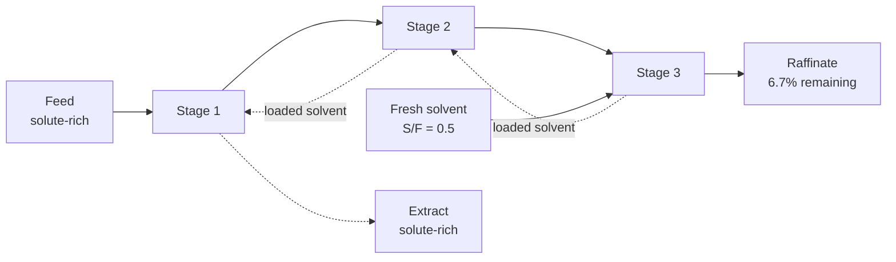

## Video Lecture

<div class="video-container">
  <iframe
    width="560"
    height="315"
    src="https://www.youtube.com/embed/ANAuU3W1DPw?start=2421"
    title="Chemical Engineering Mass Transfer and Separation Ch.4: Extraction, Adsorption, and Membranes"
    frameborder="0"
    allow="accelerometer; autoplay; clipboard-write; encrypted-media; gyroscope; picture-in-picture"
    allowfullscreen>
  </iframe>
</div>

> This video covers the same content as the text below. Choose your preferred learning format.

---

# Chapter 4: Extraction, Adsorption, and Membranes

Distillation separates most of what the process industries separate, and it does so on one condition: that boiling the mixture actually sorts it. This chapter is about the mixtures where that condition fails, and about the three families of equipment that take over when it does.

**The Separations That Step In When Distillation Cannot**

## Learning Objectives

By completing this chapter, you will be able to:

  * ✅ Name the four situations in which distillation fails or costs more than it should
  * ✅ Define the partition coefficient $K$ and the extraction factor $E = K \cdot S/F$
  * ✅ Compute the raffinate composition for single-stage, cross-current, and counter-current extraction and explain why counter-current wins with identical solvent
  * ✅ Describe mixer-settlers, extraction columns, and centrifugal contactors, and apply the criteria that select a solvent
  * ✅ Apply the Langmuir isotherm and interpret both of its limits, and explain fixed-bed breakthrough and cyclic regeneration by TSA and PSA
  * ✅ State the driving force for membrane separation and the permeance–selectivity trade-off
  * ✅ Match a distillation failure mode to the alternative that addresses it

**Reading Time**: 20-25 minutes **Code Examples**: 1 **Exercises**: 3

* * *

## 4.1 Four Ways Distillation Lets You Down

[Chapter 3](chapter-3.html) built distillation on relative volatility $\alpha$: stage count, reflux ratio, column height, and reboiler duty all trace back to how far $\alpha$ sits above 1. That is a strong foundation while it holds. There are four common ways it stops holding.

**Relative volatility near 1.** The stage requirement climbs steeply as $\alpha$ approaches unity, and with it the reflux ratio and the vapor traffic the reboiler must generate. A separation at $\alpha = 1.05$ can demand a hundred-plus stages and a reflux ratio that makes energy the dominant cost of the product. Close-boiling isomers — xylenes are the standard example — sit in this region. The column is buildable; it is often not worth building.

**An azeotrope.** At an azeotropic composition vapor and liquid have the same composition, $\alpha$ is exactly 1, and no number of stages moves the mixture past that point. Ethanol and water are the textbook case — the $\alpha = 1$ wall of [Chapter 3](chapter-3.html): ordinary distillation approaches roughly 95 wt% ethanol and stops. This is not an equipment limitation to be engineered around with a taller column; it is a thermodynamic wall.

**Heat-sensitive product.** Distillation works by boiling, which means holding the material at its saturation temperature for as long as it sits in the reboiler. Proteins denature, pharmaceuticals degrade, flavor and fragrance compounds decompose. Vacuum operation buys some room, but there is a point past which the product cannot survive the process that purifies it.

**A dilute feed.** This one is economic rather than thermodynamic, and it is the most common. To recover a solute present at a fraction of a percent, distillation must vaporize the *solvent* — usually water — because water is the bulk of what is there. Latent heat is paid on the majority component to recover the minority one, and the ratio gets worse the more dilute the feed. Boiling tons of water to collect kilograms of solute makes sense only when nothing else is available.

Each alternative here attacks one or more of these: **extraction** never boils anything, **adsorption** handles only the traces, **membranes** are blind to azeotropes. Section 4.6 makes the mapping explicit.

## 4.2 Liquid-Liquid Extraction

**Liquid-liquid extraction** contacts a feed with a second liquid — the **solvent** — that is largely immiscible with it and that the target solute prefers. The solvent-rich phase leaving with the solute is the **extract**; the depleted feed phase is the **raffinate**. No phase change occurs anywhere, which is the whole point: a heat-sensitive antibiotic can be extracted at ambient temperature.

The equilibrium is the partition relationship of [Chapter 1](chapter-1.html). In the dilute limit it is linear, and the constant is the **partition coefficient**

$$ K = \frac{y}{x} $$

with $y$ the solute concentration in the extract phase and $x$ that in the raffinate phase at equilibrium. Linearity holds while the solute is dilute enough not to alter the mutual solubility of the phases; at higher loading $K$ drifts and the arithmetic below becomes indicative rather than exact.

$K$ alone does not determine the separation, because it says nothing about how much solvent is present. Combine it with the solvent-to-feed flow ratio and you get the group that does, the **extraction factor**

$$ E = K \cdot \frac{S}{F} $$

where $S$ and $F$ are the solvent and feed flow rates. $E$ is the ratio of the solute's capacity in the solvent stream to its capacity in the feed stream — the extraction counterpart of the absorption factor from [Chapter 2](chapter-2.html), with the equilibrium constant now in the numerator rather than the denominator because $K$ measures affinity *for* the receiving phase while $m$ measured escape *from* it. $E$ well above 1 means the solvent can comfortably hold what the feed is carrying; $E$ at or below 1 caps the recovery even an unlimited counter-current cascade can reach at $E$ itself, so added stages buy sharply diminishing returns.

### The Same Solvent, Three Arrangements

Fix a case: $K = 4$ and a total solvent-to-feed ratio of $S/F = 0.5$, so

$$ E = 4 \times 0.5 = 2 $$

The solvent is a purchased quantity we are not allowed to increase. The only remaining decision is *how to deploy it*, and that decision is worth a factor of five.

**One stage, all the solvent at once.** A single equilibrium contact with the whole charge leaves

$$ \frac{x_{out}}{x_{in}} = \frac{1}{1 + E} = \frac{1}{3} \approx 33\% $$

Two thirds recovered — where a laboratory separating funnel stops.

**Cross-current, three stages.** Split the solvent into three equal portions and contact the raffinate with a fresh portion three times in succession. Each stage sees one third of the solvent, so $E_{stage} = 2/3$ and each stage leaves $1/(1 + 2/3) = 0.6$ of what entered it:

$$ \frac{x_{out}}{x_{in}} = \left(\frac{1}{1 + 2/3}\right)^3 = (0.6)^3 \approx 21.6\% $$

Better, for a familiar reason: each contact restarts against fresh solvent, so the driving force is renewed three times instead of spent once — the repeated-washing logic anyone who has rinsed glassware already knows.

**Counter-current, three stages.** Now run the same three stages with feed and solvent flowing in *opposite* directions — all the solvent enters at the far end and passes through every stage, meeting progressively richer feed. For linear equilibrium this is the **Kremser** result:

$$ \frac{x_{out}}{x_{in}} = \frac{E - 1}{E^{N+1} - 1} = \frac{2 - 1}{2^{4} - 1} = \frac{1}{15} \approx 6.7\% $$



Three arrangements, one solvent charge, and the raffinate goes 33% → 21.6% → 6.7%. **Counter-current contacting leaves about five times less solute behind than a single stage using exactly the same solvent**, at no additional operating cost — only the arrangement changed.

The reason runs through this whole subject. In counter-current flow the cleanest raffinate meets the freshest solvent and the richest feed meets the most loaded solvent, so a driving force survives at *every* position along the cascade, while cross-current discards each portion of solvent well short of equilibrium with the incoming feed. The identical argument produced the absorption cascade of [Chapter 2](chapter-2.html) and, in temperature rather than concentration, the counter-current heat exchanger of [Heat Transfer Chapter 2](../chemical-engineering-heat-transfer/chapter-2.html). Three transported quantities, one geometry.

### Code: Comparing the Three Arrangements

The script reproduces those three numbers and extends both multistage arrangements to arbitrary $N$.

```python
K = 4.0          # partition coefficient y/x (dilute, linear equilibrium)
S_OVER_F = 0.5   # total solvent-to-feed ratio, held fixed for every arrangement
E_TOTAL = K * S_OVER_F


def single_stage(e):
    """Fraction of solute remaining in the raffinate: one stage, all the solvent."""
    return 1.0 / (1.0 + e)


def cross_current(e_total, n):
    """Fraction remaining: n stages in series, fresh solvent split n ways."""
    e_stage = e_total / n
    return (1.0 / (1.0 + e_stage)) ** n


def counter_current(e, n):
    """Fraction remaining: n counter-current stages (Kremser, linear equilibrium)."""
    if abs(e - 1.0) < 1e-12:
        return 1.0 / (n + 1.0)
    return (e - 1.0) / (e ** (n + 1) - 1.0)


print(f"K = {K:.0f}, S/F = {S_OVER_F:.2f}  ->  extraction factor E = {E_TOTAL:.1f}\n")
print(f"{'N':>3} {'cross-current':>15} {'counter-current':>17}")
for n in (1, 2, 3, 4, 5):
    print(f"{n:3d} {cross_current(E_TOTAL, n):14.1%} {counter_current(E_TOTAL, n):16.1%}")

print(f"\nsingle stage, all solvent at once: {single_stage(E_TOTAL):.1%}")
print(f"cross-current, 3 equal portions:   {cross_current(E_TOTAL, 3):.1%}")
print(f"counter-current, 3 stages:         {counter_current(E_TOTAL, 3):.1%}")

# K = 4, S/F = 0.50  ->  extraction factor E = 2.0
#
#   N   cross-current   counter-current
#   1          33.3%            33.3%
#   2          25.0%            14.3%
#   3          21.6%             6.7%
#   4          19.8%             3.2%
#   5          18.6%             1.6%
#
# single stage, all solvent at once: 33.3%
# cross-current, 3 equal portions:   21.6%
# counter-current, 3 stages:         6.7%
```

At $N = 1$ the columns agree, as they must — with one stage there is no direction to flow counter to. From there they diverge: cross-current improves ever more slowly — still above 18% at $N = 5$, and even unlimited stages cannot push it below $e^{-E} \approx 13.5\%$ — because splitting a fixed charge into ever-smaller portions leaves every stage too little to work with, while counter-current keeps improving by roughly a factor of $E$ per added stage. Stages are a cheap lever in a counter-current cascade and nearly a wasted one in a cross-current cascade.

## 4.3 Hardware and Solvent Selection

**Mixer-settlers** are the most literal implementation: a stirred vessel that disperses one phase in the other, followed by a quiet vessel where gravity separates them again. Each unit approaches one theoretical stage, efficiency is high and predictable, and a cascade is built by repeating the pair. The costs are footprint and inventory, which is why mixer-settlers dominate in hydrometallurgy, where stage counts are modest and reliability outranks compactness.

**Extraction columns** stack the contacting vertically and let the density difference do the transport: the light phase rises, the heavy phase falls, and mass transfer happens continuously along the height. Packing, sieve trays, rotating discs, or reciprocating plates supply agitation that keeps drops small and interfacial area high. Columns are compact and hold far less inventory. Their difficulty is that the density difference driving everything is typically much smaller than in vapor-liquid service, so throughput is limited by **flooding** at modest velocities, and axial mixing degrades the counter-current behavior the previous section argued for.

**Centrifugal contactors** replace gravity with several hundred g inside a rotating bowl, cutting contact time to seconds and holdup to a few liters per stage. That is decisive when phase densities are close enough that gravity settling would be impractically slow or would emulsify, and when the material must not sit in the equipment — radioactive service, or unstable products. The price is rotating machinery in process-fluid duty.

### Selecting the Solvent

Hardware choice is secondary to solvent choice, because the solvent sets $K$ and $K$ sets everything else. Four criteria are usually decisive, and they conflict.

| Criterion | What it means | Why it fights the others |
|---|---|---|
| **Selectivity** | High $K$ for the target solute, low $K$ for everything else | A solvent that dissolves the solute strongly often dissolves its chemical relatives too — the impurities that must stay behind |
| **Recoverability** | The solute must be strippable from the extract and the solvent recycled at acceptable cost | High $K$ means the solute is held tightly — exactly what makes stripping it back out expensive; recovery is often the largest energy item in an extraction plant |
| **Immiscibility** | Low mutual solubility with the feed phase, and a density difference large enough to settle | A solvent chemically similar to the feed usually extracts well and separates poorly — the properties trade directly |
| **Safety and environment** | Low toxicity, flammability, and volatility; benign disposal; acceptable cost at makeup-loss rates | Several of the best-performing classical solvents — chlorinated and aromatic hydrocarbons among them — are now the hardest to permit |

The practical consequence is that a solvent is chosen, not calculated. **The highest-$K$ solvent is frequently the wrong answer**, because the recovery step it forces costs more than the extraction step it improves.

## 4.4 Adsorption

**Adsorption** binds molecules from a fluid onto the surface of a solid — the **adsorbent** — while the bulk passes through untouched. Because capture happens at a surface, adsorbents are engineered for enormous internal area per unit mass through microporous structure; activated carbon, silica gel, activated alumina, and zeolite molecular sieves are the standard materials. The economics invert distillation's: adsorption is at its most efficient when the target is present in traces, because only the traces are handled.

### The Langmuir Isotherm

An **isotherm** relates the amount adsorbed at equilibrium to the fluid-phase concentration at fixed temperature. The most-used form is the **Langmuir isotherm**:

$$ q = \frac{q_m K c}{1 + K c} $$

where $q$ is the equilibrium loading (mass of solute per mass of adsorbent), $c$ the fluid-phase concentration, $q_m$ the **monolayer capacity** — the loading at which the surface is full — and $K$ an adsorption equilibrium constant with units reciprocal to $c$.

Note: $K$ here is the Langmuir constant, unrelated to the partition coefficient $K$ of Section 4.2; the symbol collision is standard in the literature.

The two limits carry the physics:

- **Low concentration** ($Kc \ll 1$): the denominator approaches 1 and $q \approx q_m K c$. Loading is **linear** in concentration — most of the surface is empty, so each additional molecule finds a site.
- **High concentration** ($Kc \gg 1$): $Kc$ dominates the denominator and cancels, leaving $q \approx q_m$. Loading **saturates** — the surface is full, and raising the concentration further buys almost nothing.

That saturation is the structural difference between adsorption and the linear equilibria of extraction and absorption. An adsorbent has a finite capacity, and once it is reached the bed stops working — which is why a bed is not a continuous device.

### Fixed Beds and Breakthrough

Industrial adsorption is nearly always a **fixed bed**: a packed column through which the feed flows. The bed loads from the inlet end, and the partly-loaded region between saturated and fresh adsorbent — the **mass transfer zone** — travels slowly down the column like a wave. While it stays inside the bed the effluent is essentially clean; when its leading edge reaches the outlet, the effluent concentration climbs steeply toward the feed value. Plotted against time this is the **breakthrough curve**, and the moment the effluent crosses the specification limit is **breakthrough**, at which point the bed must come off line. A narrow zone uses most of the bed's capacity; a broad zone breaks through early and wastes the adsorbent behind the front.

So a fixed bed is a **batch device operated in cycles**, and because a plant needs continuous throughput, beds come in pairs or larger sets, one adsorbing while another regenerates. Two regeneration strategies dominate:

- **Temperature swing adsorption (TSA)** heats the bed with a hot purge gas. Adsorption is exothermic, so raising the temperature lowers the equilibrium loading and drives the solute off. Heating and cooling a mass of solid is slow, so TSA cycles typically run on the order of hours, suiting strongly-held species present in small quantities — the classic case being **gas drying** to very low dew points.
- **Pressure swing adsorption (PSA)** lowers the pressure instead. Loading falls with partial pressure, so depressurizing releases the adsorbed component with no thermal mass to move, and cycles run in minutes or less. **PSA oxygen and nitrogen production** from air is the flagship application — a sieve that adsorbs nitrogen preferentially delivers an oxygen-enriched product — and PSA is also standard for hydrogen purification.

**Activated-carbon polishing** — a final bed taking out trace organics, color, or odor — needs no regeneration at all and is often run to exhaustion. It illustrates adsorption's niche: not the main separation, but the one that reaches the last few parts per million the main separation cannot.

## 4.5 Membranes

A **membrane** is a thin barrier that some species cross more readily than others. There is no equilibrium stage, no boiling, and no third phase to recover: the feed is pushed against a **permselective** barrier, part of it passes through as **permeate**, and the rest leaves as **retentate**. The driving force is a difference in pressure or in concentration, so membrane processes run continuously, at ambient temperature if desired, and scale by adding area rather than by redesigning a column.

Two properties describe any membrane. **Permeance** is the flux per unit area per unit driving force — it sets how much area, and therefore capital, the duty requires. **Selectivity** is the ratio of permeance between the species being separated — it sets how good the product can be. Both are wanted high, and here is the difficulty: across most known membrane materials, **more permeable materials tend to be less selective**. The trade-off is empirical rather than a law, and materials research exists to push against it, but a designer choosing among commercially available membranes should expect to buy purity with area and area with purity.

**Reverse osmosis (RO)** is the largest application by volume. Applied pressure exceeding the feed's osmotic pressure forces water through a dense membrane while dissolved salts are retained, and it is the dominant technology for **seawater and brackish-water desalination**. Salt rejection for seawater RO membranes is typically **above about 99%** — a figure depending on membrane type, feed salinity, recovery, temperature, and age, and one that degrades over service life. Note what RO does *not* do: it never evaporates the water, which is why it displaced thermal desalination for most new capacity.

**Gas separation** membranes exploit differing permeability of gases through a polymer film — carbon dioxide removal from natural gas, hydrogen recovery from refinery purge, nitrogen generation from air. The permeance–selectivity trade-off is felt sharply here, and membranes usually compete against, or are combined with, the absorption of [Chapter 2](chapter-2.html) and the PSA of Section 4.4. **Dialysis** uses a concentration difference rather than pressure: solutes diffuse across the membrane toward a receiving stream. Hemodialysis is the familiar example, and the principle appears industrially wherever a gentle, low-pressure separation of small solutes from large ones is wanted.

Membranes reach the process as **modules**, where packing density is the design currency. **Spiral-wound** modules roll flat sheets with spacers around a central collection tube — the standard RO construction, giving high area per volume with reasonable tolerance of suspended solids. **Hollow-fiber** modules bundle thousands of fine fibers into a shell for still higher area per volume, suiting clean feeds such as gas separation. Both live under the same threat: **fouling**. Deposited solids, precipitated scale, and biological growth cut flux and raise the pressure required, so pretreatment and cleaning cycles are not accessories to a membrane plant but a large part of what it is.

## 4.6 Choosing Among Them

The four failure modes of Section 4.1 map onto the three alternatives as follows. Every entry is a starting point for evaluation, not a verdict — the actual choice depends on scale, product value, existing utilities, and what the plant already knows how to operate.

| Distillation fails because… | Typical alternative | Why it addresses the problem | Watch out for |
|---|---|---|---|
| **$\alpha$ near 1** — close-boiling components | Extraction; membranes | Both separate on a property other than volatility — solvent affinity or permeability — so a small volatility difference is irrelevant | Extraction adds a solvent recovery step; membrane selectivity may be modest |
| **Azeotrope** blocks the composition path | Membranes (pervaporation for solvent drying); extraction; extractive or azeotropic distillation with an entrainer | An azeotrope is a vapor-liquid phenomenon, invisible to a permeability- or partition-based separation | An entrainer is another component to recover; membrane duty often sits best as a polishing step past the azeotrope |
| **Heat-sensitive product** | Extraction; membranes | Neither requires boiling; both can run at or near ambient temperature | Solvent residue in a food or pharmaceutical product is a regulatory question, not only a process one |
| **Dilute feed** — trace solute in a large stream | Adsorption; extraction | Adsorption handles only the trace, never the bulk; extraction never vaporizes the bulk either | Adsorbent capacity is finite — cyclic operation must be designed for from the start |

Two cautions belong with it. First, **every alternative introduces something new to manage**: extraction adds a solvent and its recovery loop, adsorption a solid inventory and a regeneration cycle, membranes a fouling-prone consumable with a finite life. Distillation's enduring advantage is that it introduces nothing — its separating agent is heat, which the plant already has. Second, these processes are frequently **combined rather than chosen**: distillation to the azeotrope then a membrane to finish, extraction for bulk recovery then an adsorption bed for the last traces. The question in practice is rarely "which one" but "which sequence, and where does each hand over."

## 4.7 Chapter Summary

1. **Distillation fails or hurts** when relative volatility is near 1, when an azeotrope blocks the path, when the product is heat-sensitive, or when the feed is dilute enough that boiling the bulk to recover a trace is uneconomic.
2. **Liquid-liquid extraction** partitions a solute into a largely immiscible solvent with no phase change. The dilute-limit equilibrium is $K = y/x$; the governing group is the **extraction factor** $E = K \cdot S/F$.
3. **The staging result**: with $K = 4$ and $S/F = 0.5$ (so $E = 2$), a single stage leaves $1/(1+E) = 33\%$ of the solute, three cross-current stages leave $(0.6)^3 \approx 21.6\%$, and three counter-current stages leave $(E-1)/(E^{N+1}-1) = 1/15 \approx 6.7\%$ — a five-fold difference from the same solvent charge.
4. **Counter-current wins** because a driving force survives at every position in the cascade — the same argument that shaped the absorption cascade of [Chapter 2](chapter-2.html) and the counter-current heat exchanger.
5. **Hardware and solvent**: mixer-settlers (one stage per unit, large inventory), extraction columns (compact, flooding-limited at small density difference), centrifugal contactors (seconds of contact, minimal holdup). Solvent selection balances selectivity, recoverability, immiscibility, and safety — the highest-$K$ solvent is often wrong because recovery costs more than extraction gains.
6. **Langmuir isotherm**: $q = q_m K c/(1 + Kc)$, linear at low $c$ ($q \approx q_m K c$) and saturating at high $c$ ($q \approx q_m$). Finite capacity is what makes a bed a batch device.
7. **Fixed beds** load from the inlet, propagate a mass transfer zone, and reach **breakthrough** when it exits. They run in cycles, regenerated by **TSA** (hours, gas drying) or **PSA** (minutes, oxygen/nitrogen from air), or run to exhaustion as in activated-carbon polishing.
8. **Membranes** separate by permeance across a permselective barrier driven by pressure or concentration. More permeable materials **tend** to be less selective. RO dominates desalination with salt rejection typically **above about 99%**; spiral-wound and hollow-fiber are the standard modules, and fouling is the standing threat.
9. **Choose by failure mode**, and expect to combine rather than choose — distillation's advantage is that its separating agent is heat, which the plant already has.

**Next chapter**: everything so far leaves the products as fluids. [Chapter 5](chapter-5.html) closes the series with the separations that deliver a **solid** — drying and crystallization — and then steps back to the question the whole series has been building toward: given a real mixture, **which separation do you choose**, and what the plant's own data can tell you about how the choice is performing.

## Exercises

1. **Quantitative — deploying a fixed solvent charge**: A dilute aqueous feed is to be extracted with an organic solvent for which $K = 3$, using a solvent-to-feed ratio of $S/F = 0.6$. Assume linear equilibrium throughout. (a) Compute the extraction factor $E$ and the fraction of solute remaining after a **single** equilibrium stage using all the solvent. (b) Compute the fraction remaining for a **two-stage counter-current** cascade with the same total solvent. (c) The product specification requires that no more than **5%** of the solute remain. How many counter-current stages are needed?
   *Hint*: $E = K \cdot S/F$; single stage is $1/(1+E)$; counter-current is the Kremser expression $(E-1)/(E^{N+1}-1)$. For (c), evaluate $N = 3, 4$ and take the first that meets the specification.
   *Answer*: (a) $E = 3 \times 0.6 = 1.8$, and a single stage leaves $1/(1 + 1.8) = 1/2.8 =$ **35.7%**. (b) $N = 2$: $(1.8 - 1)/(1.8^3 - 1) = 0.8/(5.832 - 1) = 0.8/4.832 =$ **16.6%** — one extra stage, and less than half as much solute left, with no additional solvent. (c) $N = 3$ gives $0.8/(1.8^4 - 1) = 0.8/9.498 =$ 8.4%, which fails. $N = 4$ gives $0.8/(1.8^5 - 1) = 0.8/17.896 =$ **4.5%**, which passes. So **four stages** are required. Note the pattern: each additional counter-current stage divides the remaining solute by roughly $E = 1.8$, which is why adding stages is the cheap lever here and adding solvent is not.

2. **Quantitative — reading a Langmuir isotherm**: An activated carbon has a monolayer capacity $q_m = 200$ mg/g and a Langmuir constant $K = 0.05$ L/mg for a trace organic in water. (a) Compute the equilibrium loading $q$ at $c = 1$, $20$, and $200$ mg/L, and express each as a percentage of $q_m$. (b) At $c = 1$ mg/L, compare the exact result with the low-concentration linear approximation $q \approx q_m K c$, and state the error. (c) A bed holds 50 kg of this carbon and treats 2 m³/h of feed at 20 mg/L. Estimate the operating time to saturation, and say why the real breakthrough time will be shorter.
   *Hint*: substitute directly into $q = q_m K c/(1 + Kc)$, watching that $Kc$ is dimensionless. For (c), equate the solute loaded at equilibrium capacity to the solute fed per hour.
   *Answer*: (a) At $c = 1$: $Kc = 0.05$, so $q = 200 \times 0.05/1.05 =$ **9.5 mg/g**, or **4.8%** of $q_m$. At $c = 20$: $Kc = 1.0$, so $q = 200 \times 1/2 =$ **100 mg/g**, exactly **50%** of $q_m$ — the concentration $c = 1/K$ is always the half-saturation point. At $c = 200$: $Kc = 10$, so $q = 200 \times 10/11 =$ **181.8 mg/g**, or **90.9%**. A 200-fold rise in concentration produced a 19-fold rise in loading, which is saturation in numbers. (b) The linear approximation gives $200 \times 0.05 \times 1 =$ **10.0 mg/g** against the exact 9.52 mg/g, an overestimate of about **5%** — acceptable for a first pass here, and rapidly worse as $c$ climbs. (c) At 20 mg/L the equilibrium loading is 100 mg/g, so 50 kg of carbon holds $50{,}000 \times 100 = 5.0 \times 10^6$ mg $= 5.0$ kg of solute. The feed delivers $20 \times 2{,}000 = 40{,}000$ mg/h, giving **125 hours** to saturation. Real breakthrough comes **sooner**, because the bed is taken off line when the *leading edge* of the mass transfer zone reaches the outlet, not when the whole bed is saturated — the adsorbent still inside that zone is only partly loaded. The 125 h figure is an upper bound, and how close operation comes to it depends on how narrow the zone is.

3. **Conceptual — why counter-current extracts more**: Two engineers are given the same feed and the same total quantity of solvent. Engineer A splits the solvent into three equal portions and washes the feed three times in succession, discarding each portion after use. Engineer B arranges three stages counter-currently, sending all the solvent in at the far end so that it passes through every stage. Engineer B recovers substantially more solute. (a) Explain the mechanism, in terms of driving force, without invoking the Kremser equation. (b) Engineer A argues that fresh solvent at every stage must be better, since fresh solvent has the largest possible driving force. Where is the flaw? (c) Why does adding a fourth stage help Engineer B considerably more than it helps Engineer A?
   *Hint*: for each arrangement, ask what the solvent leaving the process looks like — how loaded is it, and how much of its capacity was actually used?
   *Answer*: (a) Mass transfer is driven by the departure from equilibrium between the phases in contact. In the counter-current arrangement the feed becomes leaner as it moves through the cascade while the solvent becomes richer moving the other way, so at every position a lean stream meets a lean stream and a rich stream meets a rich stream, and a finite driving force survives everywhere. The cleanest raffinate leaves in contact with the freshest solvent, which sets the final purity; the richest feed leaves in contact with the most loaded solvent, which makes the extract concentrated. (b) The flaw is that a large driving force is only useful if it is *used*. Each of Engineer A's portions contacts feed once and is discarded, carrying away only what a single contact could transfer — far short of its capacity. Fresh solvent everywhere means partly-used solvent everywhere. Counter-current deliberately sacrifices driving force at the feed end, where the solvent is nearly loaded, in exchange for extracting the *full capacity* of every unit of solvent, and that trade is favorable whenever $E$ is above about 1. (c) Because a counter-current cascade divides the remaining solute by roughly a factor of $E$ per stage — geometric improvement — while a cross-current cascade must split a fixed solvent charge into ever-smaller portions, so each new stage receives less to work with. In the Section 4.2 case a fourth stage takes counter-current from 6.7% to 3.2%, but cross-current only from 21.6% to 19.8%. Stages are a powerful lever in counter-current service and a weak one in cross-current service, which is why nearly all industrial extraction is counter-current.
