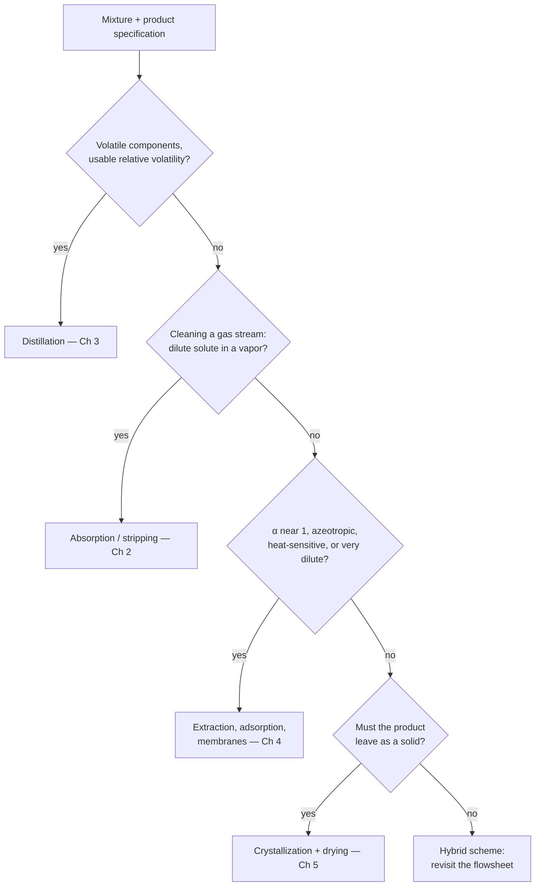

## Video Lecture

<div class="video-container">
  <iframe
    width="560"
    height="315"
    src="https://www.youtube.com/embed/ANAuU3W1DPw?start=3250"
    title="Chemical Engineering Mass Transfer and Separation Ch.5: Drying, Crystallization, and Choosing a Separation"
    frameborder="0"
    allow="accelerometer; autoplay; clipboard-write; encrypted-media; gyroscope; picture-in-picture"
    allowfullscreen>
  </iframe>
</div>

> This video covers the same content as the text below. Choose your preferred learning format.

---

# Chapter 5: Drying, Crystallization, and Choosing a Separation

Every separation so far has handed you a fluid. Distillate, raffinate, permeate, treated gas — all of them pour. This chapter covers the operations whose product does not, and then closes the series by answering the question implicit since Chapter 1: given a mixture, which unit operation do you reach for, and in what order do you ask?

**Solids-Forming Operations and the Selection Logic of the Flowsheet**

## Learning Objectives

By completing this chapter, you will be able to:

  * ✅ Explain why solids-forming separations couple heat and mass transfer and why handling dominates their cost
  * ✅ Interpret relative humidity and wet-bulb temperature, and state what a psychrometric chart is for
  * ✅ Distinguish the constant-rate and falling-rate drying periods and identify which step controls each
  * ✅ Describe supersaturation, the metastable zone, and how nucleation and growth set crystal size distribution
  * ✅ Work through an ordered logic that routes a mixture to distillation, absorption, extraction, adsorption, membranes, or crystallization
  * ✅ Name the routine signals a separation train emits and what each one infers

**Reading Time**: 20-25 minutes **Code Examples**: 1 **Exercises**: 3

* * *

## 5.1 Why Solids Change the Problem

A column, an absorber, and a membrane module differ enormously in mechanism but agree on one convenience: everything inside them flows. The moment the product is a **solid**, three things change.

**Heat and mass transfer stop being separable.** Water leaves a wet solid only if the latent heat to vaporize it arrives at the same place at the same rate, so the mass flux is chained to a heat flux across the same film. The clean division of labor that let *Heat Transfer* [Chapter 1](../chemical-engineering-heat-transfer/chapter-1.html) and this series' [Chapter 1](chapter-1.html) be taught as parallel subjects breaks down, and both coefficients appear in one rate expression.

**The product's physical form is part of the specification.** A distillate is specified by composition; a crystalline product is specified by composition *and* by crystal size distribution, habit, polymorph, and flowability — properties set inside the separator and nearly impossible to fix downstream without redissolving. A crystallization that hits assay but yields needles instead of prisms has failed: needles filter slowly and tablet badly.

**Handling dominates the cost.** Solids bridge, arch, rathole, segregate by size, pick up moisture from the air, and — for many organic powders — form explosible dust clouds. It is common for the filter, conveyor, silo, mill, and dust-collection train around a dryer to cost more and cause more downtime than the separator itself; treat that as a widely reported rule of thumb, not a measured constant. Hence solids-forming steps go **as late as possible**, once, and only when the product form demands it.

## 5.2 Humidity and the Wet-Bulb Idea

Drying usually uses air as the carrier, so some psychrometry is unavoidable. The working quantity is **absolute humidity** $Y$ — kilograms of water vapor per kilogram of *dry* air, the sensible basis because dry air is conserved as the stream picks up moisture — the same trick [Chapter 2](chapter-2.html) noted for concentrated absorbers. **Relative humidity** is the familiar reading, a ratio of partial pressures:

$$ \mathcal{H}_R = \frac{p_w}{p_w^{\text{sat}}(T)} \times 100\% $$

The denominator is what makes air useful. Saturation pressure climbs steeply with temperature, so heating air *without adding water* leaves $p_w$ untouched, raises $p_w^{\text{sat}}$, and collapses the relative humidity. Heating does not remove moisture from the air; it enlarges the air's appetite for more.

Now wet a thermometer bulb in a moving, unsaturated air stream. Evaporation from the wick draws latent heat from the passing air, so the bulb cools; as it cools the driving force for heat flow *in* grows while the driving force for evaporation shrinks, and the two balance:

$$ h\,(T - T_w) = k_y \lambda_w \,(Y_w - Y) $$

That steady reading is the **wet-bulb temperature** $T_w$ — a balance between a heat-transfer coefficient and a mass-transfer coefficient, and so a transport quantity rather than a thermodynamic one. For air–water specifically, the ratio of those coefficients falls close to the humid heat, which makes $T_w$ nearly coincide with the **adiabatic saturation temperature**, the temperature air would reach if saturated using only its own sensible heat — a convenience of air–water that does not generalize to organic solvents.

Two consequences. The wet-bulb depression $T - T_w$ reads directly how thirsty the air is. And a wet surface in hot air **sits at $T_w$, not the air temperature**, for as long as it stays wet — which is why 150 °C air can dry a heat-sensitive food without cooking it, right up until the surface dries out.

A **psychrometric chart** packages all of this — absolute humidity against dry-bulb temperature, overlaid with the saturation curve, constant-relative-humidity and constant wet-bulb lines, humid volume, and enthalpy — so that a *process path* can be traced on it: heating moves horizontally at constant $Y$, adiabatic drying travels up-left along a wet-bulb line, dehumidification runs left to saturation then down along it. We do not reproduce one here; charts are pressure-specific, and reading them is a hands-on skill best learned with the chart for your own conditions.

## 5.3 Drying: Two Periods, Two Controlling Steps

Weigh a wet solid drying in hot air and plot rate against **moisture content** $X$ (kg water per kg bone-dry solid). The curve almost always shows two regimes separated by a knee.

In the **constant-rate period**, liquid reaches the surface as fast as it evaporates, so the surface stays fully wetted and behaves like free water. The solid's structure is irrelevant and the rate is set entirely outside it:

$$ N_c = k_y (Y_w - Y) = \frac{h\,(T - T_w)}{\lambda_w} $$

Those are the external film coefficients of [Chapter 1](chapter-1.html) and *Heat Transfer* [Chapter 1](../chemical-engineering-heat-transfer/chapter-1.html), unchanged. Hotter air, drier air, higher velocity all raise the rate, and two very different solids can look nearly identical here.

At the **critical moisture content** $X_c$, liquid can no longer reach the surface as fast as it is removed, and the rate falls. In this **falling-rate period** control passes *inside* the solid: moisture migrates by capillary flow, by liquid diffusion through the matrix, or as vapor through pores once the evaporation front recedes below the surface. The material now dominates and air conditions matter much less — doubling air velocity here buys very little, an expensive surprise for anyone trying to speed up a dryer.

A common approximation takes the falling rate as proportional to the moisture remaining above equilibrium, giving exponential decay:

$$ X - X_e = (X_c - X_e)\,e^{-k t} \qquad \Longrightarrow \qquad t = \frac{1}{k}\ln\!\frac{X_c - X_e}{X - X_e} $$

The logarithm carries the lesson: time depends on the *ratio* of moisture excesses, so every further halving costs the same again, and the last fraction of a percent is typically the most expensive moisture to remove. Note the **equilibrium moisture** $X_e$ — a hygroscopic solid in equilibrium with air of a given humidity retains moisture that no amount of extra time removes. Real materials often show two or more falling-rate segments, so the single exponential is a fitting convenience validated against data for that material, not a law.

**The dryer gallery**, one line each:

| Dryer | How it works | Typical trade-off |
|---|---|---|
| **Tray** | Static solids on trays in a heated cabinet | Simplest and most flexible for small batches and valuable products; labor-intensive, slow, non-uniform |
| **Rotary** | Solids tumble down a rotating inclined drum against hot gas | Robust continuous workhorse for granular free-flowing solids; large, dusty, poor for fragile or sticky feeds |
| **Spray** | Pumpable feed atomized into hot gas, dried in flight in seconds | Liquid to free-flowing powder in one step with controllable particle size; large towers, high energy per kg |
| **Freeze** | Water frozen, then sublimed under deep vacuum | Best structure and activity retention for heat-sensitive biologicals; by a wide margin the slowest and costliest |

That last column is the selection logic: you move down the table only when the product forces you to.

## 5.4 Crystallization: Driving Force and Size Distribution

Crystallization separates *and* purifies in one step, because a growing lattice is selective about what it admits — which is why many pharmaceutical and fine-chemical processes end in a crystallizer rather than a column.

The starting point is the **solubility curve** $c^*(T)$, the concentration held at equilibrium with the solid phase. Its steepness decides the strategy: a steep curve means cooling alone deposits a large yield, while a nearly flat one (sodium chloride is the classic case) means cooling accomplishes almost nothing and solvent must be evaporated instead.

Nothing crystallizes at equilibrium. The driving force is **supersaturation**, written $\Delta c = c - c^*$ or as a ratio $S = c/c^*$ — the same pattern as always, with $\Delta c$ playing the role $\Delta T$ played in heat transfer. But supersaturation does not immediately produce crystals. Between the solubility curve and the point where spontaneous nucleation begins lies the **metastable zone**: a band in which a solution will sit for a long time without nucleating, yet in which existing crystals grow happily. That band is the control handle of the whole operation.

  * Operate **inside** the zone and add **seed** crystals: growth occurs on the seeds you provided, few new crystals appear, and the product is large, uniform, and filterable.
  * Push **beyond** the metastable limit: **primary nucleation** fires spontaneously, giving a shower of fines, a slow-filtering slurry, and heavy mother-liquor retention in the cake.

Two processes share that driving force. **Nucleation** creates particles; **growth** enlarges them. Both accelerate with supersaturation, but nucleation typically responds far more sharply, so pushing for speed shifts the balance toward many small crystals. That is why **cooling rate shapes crystal size distribution**: cool fast and supersaturation outruns the crystals' ability to consume it, breaching the metastable limit; cool slowly along a profile that stays inside the zone and the existing surface consumes it as fast as it forms. Well-run batch crystallizations commonly use a non-linear profile — gentle early when there is little crystal surface, faster later — with seeding at a defined temperature. **Secondary nucleation**, in which crystals shed fragments through collisions with the agitator and walls, is often dominant in stirred industrial vessels, making agitator speed a size-distribution variable as much as a mixing one.

Two configurations follow. **Batch cooling crystallizers** suit steep solubility curves, modest volumes, and high-value products, giving direct control of the cooling profile and seeding point — which is why they dominate pharmaceutical practice — at the price of batch-to-batch variability and idle time. **Evaporative crystallizers** suit flat curves and commodity tonnages, running continuously with good energy economy but less direct control of size and a persistent scaling problem on the heated surfaces. That scaling is the fouling of *Heat Transfer* [Chapter 5](../chemical-engineering-heat-transfer/chapter-5.html) wearing a crystallizer's face, and the monitoring mindset of that chapter transfers unchanged: back-compute the coefficient from routine measurements, trend it, and schedule cleaning against a cost balance rather than a calendar.

## 5.5 Choosing a Separation

This is what the series has been building toward. You have a mixture and a specification. Which unit operation?

Selection is a screening exercise, not an optimization: eliminate infeasible options cheaply, keep two or three, cost those properly. But the screening follows a reliable order, because these operations differ enormously in maturity, scale, and cost per kilogram.



| # | Question | If yes | Why it is asked here |
|---|---|---|---|
| 1 | Volatile, thermally stable components with a usable relative volatility? | **Distillation** ([Chapter 3](chapter-3.html)) | The default: no added solvent, unlimited staging in one shell, a century of experience. A screening threshold often quoted is $\alpha \gtrsim 1.2$–$1.5$; below it, stages and reflux escalate fast. |
| 2 | Removing a dilute solute *from a gas*? | **Absorption / stripping** ([Chapter 2](chapter-2.html)) | The carrier must not be condensed, so a countercurrent contactor beats any bulk phase change. The paired stripper is part of the design, not an afterthought. |
| 3 | $\alpha$ near 1, an azeotrope, heat-sensitive feed, or a very dilute liquid target? | **Extraction, adsorption, membranes** ([Chapter 4](chapter-4.html)) | Each defeats a specific distillation failure mode — affinity instead of volatility, scavenging to very low residuals, separation with no phase change — and each imports a burden: solvent recovery, regeneration, fouling. |
| 4 | Must the product leave as a purified solid or dry powder? | **Crystallization, then filtration and drying** (this chapter) | Taken because the specification is a solid, not because it beats a column on duty. High purity per pass and the required form — with the solids-handling train attached. |
| 5 | Nothing fits cleanly, or every option is uneconomic. | **Hybrid, or change the flowsheet** | Reactive, extractive, and azeotropic distillation; membrane-plus-distillation hybrids; adsorptive polishing behind a bulk unit. Also the most valuable answer available: change the reaction, solvent, or specification. |

Three secondary screens cut the survivors down. **Scale**: cost per kilogram varies by orders of magnitude — chromatography and freeze drying are reasonable at kilogram scale and unreasonable at kiloton scale; distillation is the reverse. **Energy**: distillation's dominance carries a large bill, commonly cited as a substantial share of process energy in refining and bulk chemicals — published estimates vary widely with what is counted, so verify against a current source before any figure enters a design document. That bill is why membranes and adsorption keep gaining ground on dilute and low-$\alpha$ duties. **Position**: do the bulk separation with the cheapest operation that will do it, then polish. A membrane asked to do bulk duty is the wrong tool made expensive; the same device behind a column, taking the last few percent, is often the cheapest element in the train.

## 5.6 The Digital Layer

Separation trains are unusually generous with data, for a structural reason: composition — the quantity you care about — is measured slowly, expensively, and often offline, while the quantities that correlate with it are measured continuously and nearly free. Each of the following is a **soft sensor** in the sense of *Heat Transfer* [Chapter 5](../chemical-engineering-heat-transfer/chapter-5.html).

**Column temperature profiles as composition proxies.** At fixed pressure, tray temperature is tied to tray composition — the inference foreshadowed in [Chapter 3](chapter-3.html). Tracking the vertical position of the temperature front shows where the separation is happening long before a lab assay returns. It holds only at constant pressure, and degrades near an azeotrope, where temperature stops discriminating between compositions.

**Pressure drop as a hydraulics and fouling indicator.** On a column, rising $\Delta P$ at constant throughput is the classic approach to **flooding**, while a falling one can signal weeping or a lost internal. On a membrane skid, the flux-versus-$\Delta P$ relationship separates reversible concentration polarization from irreversible fouling and schedules the cleaning cycle.

**Drying curves as endpoint detectors.** Ending a batch is usually decided badly — early, risking out-of-specification moisture, or late, burning hours for moisture already below specification. Fitting the falling-rate decay as the batch develops turns the endpoint into a prediction.

```python
import numpy as np

# ---------------------------------------------------------------------------
# ILLUSTRATIVE SYNTHETIC DATA -- generated for teaching, not measured on any
# real dryer. Moisture content X [kg water / kg dry solid] during the falling-
# rate period, t [h] measured from the critical moisture point.
# ---------------------------------------------------------------------------
t_data = np.array([0.0, 1.0, 2.0, 3.0, 4.0, 5.0, 6.0])
X_data = np.array([0.250, 0.184, 0.132, 0.101, 0.075, 0.061, 0.047])

X_EQ = 0.02      # equilibrium moisture at the drying air's humidity
X_TARGET = 0.05  # product specification

# Model: X - Xe = (X0 - Xe) exp(-k t)  ->  ln(X - Xe) is linear in t
slope, intercept = np.polyfit(t_data, np.log(X_data - X_EQ), 1)
k = -slope
X0 = np.exp(intercept) + X_EQ


def time_to(x_target, k=k, x0=X0, x_eq=X_EQ):
    """Hours of falling-rate drying needed to reach x_target."""
    return -np.log((x_target - x_eq) / (x0 - x_eq)) / k


print(f"fitted rate constant k = {k:.3f} 1/h")
print(f"fitted intercept   X0 = {X0:.3f} kg/kg dry")
print()
print(f"{'t [h]':>6} {'X data':>8} {'X fit':>8}")
for t, x in zip(t_data, X_data):
    print(f"{t:6.1f} {x:8.3f} {X_EQ + (X0 - X_EQ) * np.exp(-k * t):8.3f}")
print()
print(f"time to reach X = {X_TARGET:.2f} kg/kg : {time_to(X_TARGET):.2f} h")
print(f"  0.25 -> 0.10 kg/kg (removes 0.15): {time_to(0.10):.2f} h")
print(f"  0.05 -> 0.03 kg/kg (removes 0.02): {time_to(0.03) - time_to(0.05):.2f} h")

# fitted rate constant k = 0.354 1/h
# fitted intercept   X0 = 0.251 kg/kg dry
#
#  t [h]   X data    X fit
#    0.0    0.250    0.251
#    1.0    0.184    0.182
#    2.0    0.132    0.134
#    3.0    0.101    0.100
#    4.0    0.075    0.076
#    5.0    0.061    0.059
#    6.0    0.047    0.048
#
# time to reach X = 0.05 kg/kg : 5.77 h
#   0.25 -> 0.10 kg/kg (removes 0.15): 3.00 h
#   0.05 -> 0.03 kg/kg (removes 0.02): 3.10 h
```

Read the last two lines together. Removing 0.15 kg/kg at the start of the falling-rate period takes 3.00 hours; removing 0.02 kg/kg at the end takes 3.10 hours — slightly *longer*, for less than a seventh of the water. That is the logarithm of Section 5.3 made concrete, and the arithmetic behind every argument for a tightly justified rather than a conservatively low moisture target.

Two caveats keep it honest. The fitted $k$ is not a material property — it embeds air temperature, humidity, velocity, and bed geometry, and must be refitted when any of those change. And the answer extrapolates beyond the last data point: a solid with a second falling-rate segment dries more slowly than this fit predicts, which is why the fit is updated as the batch proceeds rather than trusted once at the start.

The caution the previous series ended on applies here too. A model that predicts an endpoint or infers a composition optimizes *within* the physics; it does not repeal the equilibrium that sets the minimum solvent rate, the relative volatility that sets the minimum reflux, or the equilibrium moisture that floors the drying. Software finds the best point below the ceiling; only a flowsheet change moves the ceiling. For the instrumentation and control layer built on all of this, our *Process Monitoring & Control* series ([series index](../process-monitoring-control-introduction/index.html)) is the natural continuation.

## 5.7 Series Summary

Five chapters, one sentence each. **Chapter 1** built diffusion and the mass-transfer coefficient, and showed how film resistances add in series. **Chapter 2** put that coefficient to work in gas absorption, where equilibrium sets the minimum solvent rate and staging sets the height. **Chapter 3** developed distillation from relative volatility through stages, reflux, and the economic minimum. **Chapter 4** covered the alternatives that exist because distillation fails on low-$\alpha$, azeotropic, heat-sensitive, and dilute systems. **Chapter 5** added the solids-forming operations and assembled the set into a selection logic.

With this series the **transport trio is complete**. *Fluid Mechanics* covered momentum, driven by velocity gradients; *Heat Transfer* covered energy, driven by temperature difference; this series covered mass, driven by concentration difference. Three subjects, three sets of equipment, three vocabularies — and one pattern underneath, the transport table from *Chemical Engineering Introduction* [Chapter 1](../chemical-engineering-introduction/chapter-1.html):

$$ \text{flux} = \text{coefficient} \times \text{driving force} $$

That is why film coefficients, resistances in series, log-mean driving forces, and the vanishing-driving-force wall reappeared in every chapter you have just read. If it felt like déjà vu, that was not repetition — that was the structure of transport phenomena doing its job.

What remains in the classical fundamentals track is the step where composition changes on purpose rather than by separation: **reaction engineering** — rate laws, reactor types, residence-time distribution, and the coupling of heat release to conversion and stability. That series now exists: [Chemical Engineering Reaction Engineering](../chemical-engineering-reaction-engineering/index.html) covers rate laws, reactor types, residence-time distribution, and the coupling of heat release to conversion and stability. In the meantime: *Chemical Engineering Introduction* for the flowsheet these separations sit in, *Chemical Engineering Thermodynamics* for the phase-equilibrium models they all depend on, and *Fluid Mechanics* and *Heat Transfer* for the other two members of the trio.

Thank you for learning with us.

## Exercises

1. **Conceptual — reading the air**: Air at 60 °C with a wet-bulb temperature of 30 °C is blown over a tray of wet filter cake. (a) What temperature does the *surface of the cake* sit at while it is still fully wetted, and why is it not 60 °C? (b) The same air is heated to 90 °C with no water added — state what happens to its absolute humidity, relative humidity, and wet-bulb temperature, and why heating helps at all. (c) Later the surface temperature begins climbing toward the air temperature. What has happened inside the solid, and what should be expected from a further increase in air velocity?
   *Hint*: work from $h(T - T_w) = k_y \lambda_w (Y_w - Y)$, and ask which quantity heating actually changes.
   *Answer*: (a) **About 30 °C — the wet-bulb temperature.** A fully wetted surface loses latent heat by evaporation as fast as it gains sensible heat from the air, and that balance pins it at $T_w$ — which is why hot air can dry heat-sensitive material safely in the constant-rate period. (b) **Absolute humidity unchanged**, since heating adds no water; **relative humidity falls sharply**, because $p_w^{\text{sat}}(T)$ climbs steeply while $p_w$ is fixed; **wet-bulb temperature rises**, but by far less than the 30 K of dry-bulb heating, so the wet-bulb *depression* grows. Heating enlarges the air's capacity to accept moisture rather than removing any, raising both driving forces in the balance and so the constant-rate flux. (c) The moisture has fallen through the **critical moisture content** into the **falling-rate period**: the evaporation front has receded into the solid and internal transport now controls. With less evaporative cooling the surface drifts toward the air temperature — the moment a heat-sensitive product becomes vulnerable. More air velocity should help **very little**, since velocity acts on external film coefficients that no longer set the rate, while raising the risk of overheating the drier surface.

2. **Quantitative — drying time from the fitted constant**: A second batch of the same solid dries under the same air conditions, so the constant fitted in Section 5.6, $k = 0.354$ h⁻¹, and $X_e = 0.02$ kg/kg dry may be reused. It enters the falling-rate period at $X_c = 0.30$ and must reach 0.06 kg/kg dry. (a) Estimate the falling-rate time. (b) A customer tightens the specification to 0.04 kg/kg dry — how much extra time, and how does it compare with (a)? (c) Give three reasons the estimate could be wrong in practice.
   *Hint*: use $t = \frac{1}{k}\ln\frac{X_c - X_e}{X - X_e}$; for (b) take the difference of two such times.
   *Answer*: (a) $t = \frac{1}{0.354}\ln\frac{0.28}{0.04} = \frac{\ln 7}{0.354} = \frac{1.946}{0.354} \approx \mathbf{5.5\ h}$. (b) To 0.04: $t = \frac{\ln 14}{0.354} = \frac{2.639}{0.354} \approx 7.5$ h, so the extra is $\approx \mathbf{2.0\ h}$ — a **36% longer batch** to remove a further 0.02 kg/kg, having just spent 5.5 h removing 0.24. That is the logarithmic penalty of Section 5.3 in commercial terms, and a strong argument for challenging tightened moisture specifications rather than accepting them by default. Note too that 0.04 is only twice $X_e$, so further tightening runs into the equilibrium floor where the required time diverges. (c) Any three of: **$k$ is not a material constant** — it embeds air temperature, humidity, velocity, and bed geometry, so a change in dryer loading invalidates it; **many solids show two or more falling-rate segments**, so a single exponential fitted to early data under-predicts the time to a low target; **$X_e$ itself depends on air humidity and temperature**, and an error in it propagates violently into the logarithm as $X$ approaches it; and this is falling-rate time only — heat-up and the constant-rate period must be added for a batch time.

3. **Selection — routing three streams**: Apply the Section 5.5 checklist in order to each. State the operation you would screen in, the chapter covering it, and one burden the choice imports. (a) 200 000 Nm³/h of flue gas at 50 °C containing roughly 8% CO₂, to be reduced to about 1%. (b) A fermentation broth containing 3% of a thermally labile antibiotic that must be delivered as a dry crystalline powder of controlled particle size. (c) A binary organic mixture with $\alpha \approx 1.05$ across the range of interest, 50 t/h, 99.5% purity in both products.
   *Hint*: ask question 1 even when the answer is obviously no — the reason it is no is the design constraint.
   *Answer*: (a) Question 1 fails — the bulk carrier is a permanent gas that cannot be condensed at any sane cost. Question 2 answers yes, a dilute solute in a vapor carrier, so screen in **absorption with a chemical solvent** ([Chapter 2](chapter-2.html)). The burden is the paired **stripper**, where the energy and operating cost sit; at this flow the absorber diameter is set by flooding, so the column is very large. Swing-cycle adsorption is a legitimate second candidate to cost. (b) Question 1 fails on thermal stability and question 2 does not apply. Question 3 is partly yes — a dilute, heat-sensitive aqueous solute suits extraction, adsorption, or membranes as a *concentration* step. But question 4 decides it: the specification is a **dry crystalline powder of controlled size**, so the train ends in **crystallization plus filtration plus drying** (this chapter), most likely behind a membrane or adsorption step that concentrates the broth. The burdens are the solids-handling train of Section 5.1 and the size distribution specifically — a seeded batch cooling crystallization on a controlled profile, with the dryer chosen for heat sensitivity (freeze drying if activity demands it, accepting the cost). (c) The components *are* volatile and stable, but $\alpha \approx 1.05$ sits far below the $\alpha \gtrsim 1.2$–$1.5$ screening range, so a conventional column needs very many stages at a reflux close enough to total that energy dominates lifetime cost. Question 3 answers yes on the low-$\alpha$ criterion, so screen in a **hybrid**: distillation for the bulk split with a **membrane unit** on the difficult end, or an extractive scheme with an entrainer that shifts the volatility ([Chapter 4](chapter-4.html), with [Chapter 3](chapter-3.html) still doing bulk duty). Burdens: a membrane brings fouling, module replacement, and modest per-module capacity to be multiplied up at 50 t/h; an entrainer brings its own recovery column. At this throughput the honest first move is question 5 — ask whether the upstream chemistry or the 99.5% specification can change, because at $\alpha = 1.05$ the separation, not the reaction, defines the plant.
