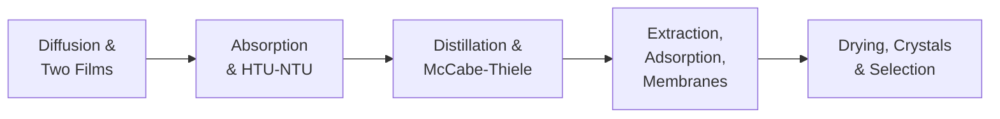

## Video Lecture

  <iframe
    width="560"
    height="315"
    src="https://www.youtube.com/embed/ANAuU3W1DPw"
    title="Chemical Engineering Mass Transfer and Separation - Full Series"
    frameborder="0"
    allow="accelerometer; autoplay; clipboard-write; encrypted-media; gyroscope; picture-in-picture"
    allowfullscreen>
  </iframe>

> The whole series is available as a single video with chapter markers. Each chapter page starts this video at that chapter.

---

# Chemical Engineering Mass Transfer and Separation

**Diffusion, Distillation, and the Separations That Define the Flowsheet**

Most of a flowsheet is separation equipment, and much of a plant's energy bill is paid there. This course completes the transport-phenomena arc of our chemical engineering curriculum — momentum transfer came first, heat transfer second, and mass transfer now closes the trio — then puts the theory to work across the separations that dominate industrial practice.

## Series Overview

1. **Diffuse** — Fick's law, the two-film model, and the mass-transfer coefficient
2. **Absorb** — operating lines, the pinch, and the HTU-NTU method
3. **Distill** — relative volatility, McCabe-Thiele, and the reflux trade
4. **Extract** — extraction, adsorption, and membranes for when distillation cannot
5. **Solidify** — drying, crystallization, and the selection logic of the flowsheet

## Chapters

| Chapter | Title | What You Will Learn |
|---------|-------|---------------------|
| 1 | [Diffusion and Mass-Transfer Coefficients](chapter-1.html) | Fick's law, diffusivity magnitudes, the two-film model, gas- vs liquid-film control |
| 2 | [Absorption, Stripping, and the Transfer Unit](chapter-2.html) | Operating and equilibrium lines, minimum liquid rate, HTU-NTU sizing, trays vs packing |
| 3 | [Distillation and the McCabe-Thiele Method](chapter-3.html) | Relative volatility, Fenske minimum stages, operating lines, minimum reflux, the capital-energy trade |
| 4 | [Extraction, Adsorption, and Membranes](chapter-4.html) | Extraction factor and staging, Langmuir isotherms and breakthrough, membrane selectivity |
| 5 | [Drying, Crystallization, and Choosing a Separation](chapter-5.html) | Wet-bulb and drying periods, supersaturation, separation selection, the digital layer |

## Who This Series is For

- **Students** completing the transport arc from our Fluid Mechanics and Heat Transfer series into separations
- **Engineers and researchers** who size columns, choose solvents, or troubleshoot dryers and crystallizers
- **Data scientists** working with column temperature profiles and drying curves who want the physics behind the signals

Recommended preparation: Chemical Engineering Introduction and Fluid Mechanics; the Thermodynamics series supplies the vapor-liquid equilibrium this course builds on, and the Heat Transfer series the film-coefficient logic it mirrors. Mathematics stays at algebra with a few worked calculations.

## Related Series

Part of the classical-fundamentals track with **Chemical Engineering Introduction**, **Chemical Engineering Thermodynamics**, **Chemical Engineering Fluid Mechanics**, and **Chemical Engineering Heat Transfer**. The reaction-engineering deep-dive continues the track in **Chemical Engineering Reaction Engineering**. Data-driven companions: **Process Informatics Introduction** and **Introduction to Process Monitoring and Control**.
